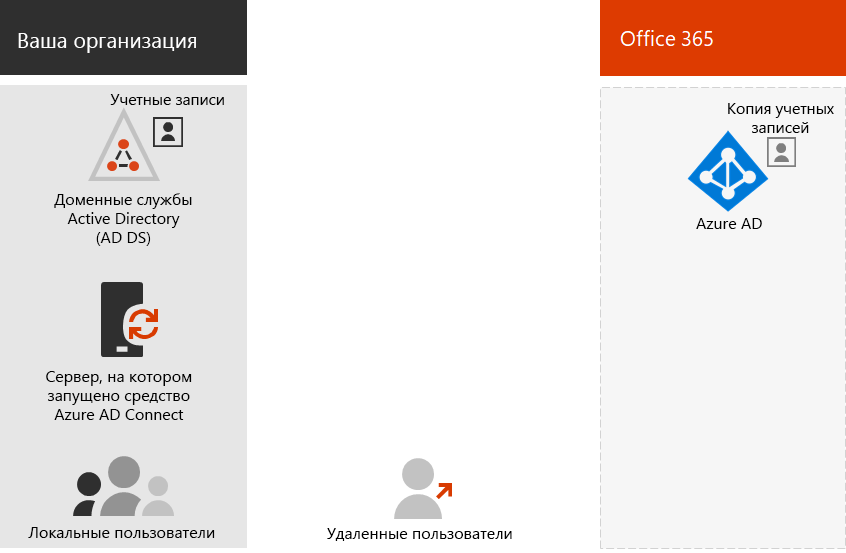

# Модели удостоверений Office 365 и Azure Active DirectoryOffice 365 identity models and Azure Active Directory

*Эта статья относится как к Office 365 Enterprise, так и к Microsoft 365 корпоративный.**This article applies to both Office 365 Enterprise and Microsoft 365 Enterprise.*

Office 365 использует Azure Active Directory (Azure AD), службу удостоверений и удостоверений пользователей на основе облачной службы проверки подлинности, включенную в вашу подписку на Office 365, для управления удостоверениями и проверкой подлинности для Office 365.Office 365 uses Azure Active Directory (Azure AD), a cloud-based user identity and authentication service that is included with your Office 365 subscription, to manage identities and authentication for Office 365. Правильная настройка инфраструктуры удостоверений крайне важна для управления доступом пользователей и разрешений Office 365 для Организации.Getting your identity infrastructure configured correctly is vital to managing Office 365 user access and permissions for your organization.

Прежде чем начать, просмотрите этот видеоролик, чтобы получить обзор моделей удостоверений и проверки подлинности для Office 365 и Microsoft 365.Before you begin, watch this video for an overview of identity models and authentication for both Office 365 and Microsoft 365.

> [!VIDEO https://www.microsoft.com/videoplayer/embed/RE2Pjwu]

Первым вариантом планирования является модель удостоверений Office 365.Your first planning choice is the Office 365 identity model.

## Модели удостоверений Office 365Office 365 identity models

Чтобы спланировать учетные записи пользователей, сначала необходимо ознакомиться с двумя моделями идентификации в Microsoft 365.To plan for user accounts, you first need to understand the two identity models in Microsoft 365. Вы можете поддерживать удостоверения вашей организации только в облаке, а также поддерживать локальные удостоверения доменных служб Active Directory (AD DS) и использовать их для проверки подлинности при доступе пользователей к Microsoft 365 Cloud Services.You can maintain your organization's identities only in the cloud, or you can maintain your on-premises Active Directory Domain Services (AD DS) identities and use them for authentication when users access Microsoft 365 cloud services.  

Ниже приведены два типа удостоверений, а также их наилучшее соответствие и преимущества.Here are the two types of identity and their best fit and benefits.

|||
|:-------|:-----|:-----|
|  | **Удостоверение только для облака****Cloud-only identity** | **Гибридное удостоверение****Hybrid identity** |
| **Определение****Definition** | Учетная запись пользователя существует только в клиенте Azure Active Directory (Azure AD) для вашей подписки на Microsoft 365.User account only exists in the Azure Active Directory (Azure AD) tenant for your Microsoft 365 subscription. | Учетная запись пользователя существует в доменных службах Active Directory, а также копия в клиенте Azure AD для вашей подписки на Microsoft 365.User account exists in AD DS and a copy is also in the Azure AD tenant for your Microsoft 365 subscription. Учетная запись пользователя в Azure AD также может включать хешированную версию пароля учетной записи пользователя.The user account in Azure AD might also include a hashed version of the user account password. |
| **Проверка подлинности учетных данных пользователей в Microsoft 365****How Microsoft 365 authenticates user credentials** | Клиент Azure AD для вашей подписки на Microsoft 365 выполняет проверку подлинности с учетной записью удостоверения в облаке.The Azure AD tenant for your Microsoft 365 subscription performs the authentication with the cloud identity account. | Клиент Azure AD для вашей подписки на Microsoft 365 обрабатывает процесс проверки подлинности или перенаправляет пользователя другому поставщику удостоверений.The Azure AD tenant for your Microsoft 365 subscription either handles the authentication process or redirects the user to another identity provider. |
| **Оптимально для**.**Best for** | Организации, которые не имеют локальных доменных служб Active Directory или не нуждаются в них.Organizations that do not have or need an on-premises AD DS. | Организации, использующие AD DS или другого поставщика удостоверений.Organizations using AD DS or another identity provider. |
| **Наибольшая выгода****Greatest benefit** | Простота использования.Simple to use. Не требуются дополнительные средства каталогов или серверы.No extra directory tools or servers required. | Пользователи могут использовать одни и те же учетные данные при доступе к локальным или облачным ресурсам.Users can use the same credentials when accessing on-premises or cloud-based resources. |
||||

## Удостоверение только для облакаCloud-only identity

Для удостоверения с единственным облаком используются учетные записи пользователей, существующие только в Azure AD.A cloud-only identity uses user accounts that exist only in Azure AD. Облачное удостоверение обычно используется малыми организациями, не имеющими локальных серверов, или не использующими AD DS для управления локальными удостоверениями.Cloud identity is typically used by small organizations that do not have on-premises servers or do not use AD DS to manage local identities. 

Ниже приведены основные компоненты удостоверения "только облако".Here are the basic components of cloud-only identity.
 

Как локальные, так и удаленные пользователи используют свои учетные записи пользователей и пароли Azure AD для доступа к облачным службам Office 365.Both on-premises and remote (online) users use their Azure AD user accounts and passwords to access Office 365 cloud services. Azure AD выполняет проверку подлинности учетных данных пользователя на основе сохраненных учетных записей пользователей и паролей.Azure AD authenticates user credentials based on its stored user accounts and passwords.

### АдминистрированиеAdministration
Так как учетные записи пользователей хранятся только в Azure AD, управление облачными удостоверениями осуществляется с помощью таких средств, как [центр администрирования Microsoft 365](https://admin.microsoft.com) и Windows PowerShell, с помощью модуля PowerShell Azure Active Directory PowerShell для Graph.Because user accounts are only stored in Azure AD, you manage cloud identities with tools such as the [Microsoft 365 admin center](https://admin.microsoft.com) and Windows PowerShell with the Azure Active Directory PowerShell for Graph module. 

## Гибридная идентификацияHybrid identity

Гибридное удостоверение использует учетные записи, созданные в локальных доменных службах Active Directory и имеющие копию в клиенте Azure AD подписки на Microsoft 365.Hybrid identity uses accounts that originate in an on-premises AD DS and have a copy in the Azure AD tenant of a Microsoft 365 subscription. Однако большинство изменений переходят только один из них.However, most changes only flow one way. Изменения, вносимые в учетные записи пользователей доменных служб Active Directory, синхронизируются с их копией в Azure AD.Changes that you make to AD DS user accounts are synchronized to their copy in Azure AD. Но изменения, внесенные в облачные учетные записи в Azure AD, такие как новые учетные записи пользователей, не синхронизируются с AD DS.But changes made to cloud-based accounts in Azure AD, such as new user accounts, are not synchronized with AD DS.

Azure AD Connect обеспечивает текущую синхронизацию учетных записей.Azure AD Connect provides the ongoing account synchronization. Он выполняется на локальном сервере, проверяет изменения в доменных СЛУЖБах Active Directory и пересылает эти изменения в Azure AD.It runs on an on-premises server, checks for changes in the AD DS, and forwards those changes to Azure AD. Azure AD Connect предоставляет возможность фильтрации синхронизируемых учетных записей и синхронизации хешированной версии паролей пользователей, называемой синхронизацией хеша паролей (ФС).Azure AD Connect provides the ability to filter which accounts are synchronized and whether to synchronize a hashed version of user passwords, known as password hash synchronization (PHS).

При внедрении гибридного удостоверения для сведений об учетной записи в локальной службе AD DS используется достоверный источник.When you implement hybrid identity, your on-premises AD DS is the authoritative source for account information. Это означает, что вы выполняете задачи по администрированию преимущественно в локальной среде, которые затем синхронизируются с Azure AD.This means that you perform administration tasks mostly on-premises, which are then synchronized to Azure AD. 

Ниже приведены компоненты гибридного удостоверения.Here are the components of hybrid identity.

У клиента Azure AD есть копия учетных записей доменных служб Active Directory.The Azure AD tenant has a copy of the AD DS accounts. В этой конфигурации как локальные, так и удаленные пользователи, обращающиеся к Microsoft 365 Cloud Services, проходят проверку подлинности в Azure AD.In this configuration, both on-premises and remote users accessing Microsoft 365 cloud services authenticate against Azure AD.

>[!Note]
>Всегда необходимо использовать Azure AD Connect для синхронизации учетных записей пользователей с гибридным удостоверением.You always need to use Azure AD Connect to synchronize user accounts for hybrid identity. Учетные записи синхронизированных пользователей в Azure AD необходимы для выполнения задач по управлению назначением лицензий и групп, а также для настройки разрешений и других административных задач, включающих учетные записи пользователей.You need the synchronized user accounts in Azure AD to perform license assignment and group management, configure permissions, and other administrative tasks that involve user accounts.
>

### АдминистрированиеAdministration

Так как первоначальные и полномочные учетные записи пользователей хранятся в локальной службе AD DS, вы управляете удостоверениями с теми же инструментами, что и AD DS, например с помощью средства "пользователи и компьютеры Active Directory".Because the original and authoritative user accounts are stored in the on-premises AD DS, you manage your identities with the same tools as AD DS, such as the Active Directory Users and Computers tool. 

Вы не используете центр администрирования Microsoft 365 или Windows PowerShell для управления синхронизированными учетными записями пользователей в Azure AD.You don’t use the Microsoft 365 admin center or Windows PowerShell to manage synchronized user accounts in Azure AD.

## Следующий шагNext step

Если требуется только Облачная модель удостоверений, ознакомьтесь со статьями " [облачные удостоверения](cloud-only-identities.md)".If you need the cloud-only identity model, see [Cloud-only identities](cloud-only-identities.md).

Если вам нужна Гибридная модель идентификации, ознакомьтесь со статьей [Синхронизация службы каталогов](plan-for-directory-synchronization.md).If you need the hybrid identity model, see [directory synchronization](plan-for-directory-synchronization.md).
  

## Обучающее видеоVideo training

В видеокурсе [Office 365: Управление удостоверениями с помощью Azure AD Connect](https://support.office.com/article/90991a1d-c0ab-479a-b413-35c9706f6fed.aspx), предоставленных в LinkedIn Learning.See the video course [Office 365: Manage Identities Using Azure AD Connect](https://support.office.com/article/90991a1d-c0ab-479a-b413-35c9706f6fed.aspx), brought to you by LinkedIn Learning.

## См. такжеSee also

[Обзор Microsoft 365 корпоративныйMicrosoft 365 Enterprise overview](https://docs.microsoft.com/microsoft-365/enterprise/microsoft-365-overview)
