# <a name="add-several-users-at-the-same-time-to-office-365---admin-help"></a>Добавление сразу нескольких пользователей в службу Office 365 (справка для администраторов)

Для входа в систему и доступа к службам Office 365, например электронной почте и приложениям Office, сотрудникам вашей организации необходимы учетные записи. Если в вашей организации много пользователей, вы можете добавить учетные записи сразу для всех с помощью таблицы Excel или файла в формате CSV. [Общие сведения о формате CSV](add-several-users-at-the-same-time.md#__toc316652088)
  
## <a name="add-multiple-users-to-office-365-in-the-microsoft-365-admin-center"></a>Добавление нескольких пользователей в Office 365, используя Центр администрирования Microsoft 365

1. Войдите в Office 365 с рабочей или учебной учетной записью. 
    
2. В Центре администрирования выберите **Пользователи** \> **Активные пользователи**.
    
    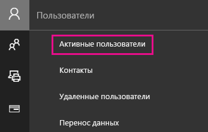
  
    
3. В области **Импорт нескольких пользователей** вы можете скачать шаблон CSV-файла с образцом сведений о пользователях или без него. 
    
    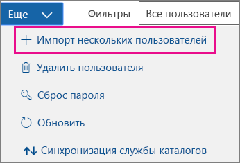
  
    В вашей таблице должны быть **точно такие же заголовки столбцов**, как и в шаблоне ("Имя пользователя", "Имя" и т. д.). Если вы используете шаблон, откройте его в текстовом редакторе, например в Блокноте. Данные в первой строке оставьте без изменений. Добавляйте сведения о пользователях начиная со второй строки. 
    
    Для каждого человека в таблице также следует указать имя пользователя (например, ivan@contoso.com) и отображаемое имя (например, Иван Воронков). 
    
  ```
  User Name,First Name,Last Name,Display Name,Job Title,Department,Office Number,Office Phone,Mobile Phone,Fax,Address,City,State or Province,ZIP or Postal Code,Country or Region
  chris@contoso.com,Chris,Green,Chris Green,IT Manager,Information Technology,123451,123-555-1211,123-555-6641,123-555-9821,1 Microsoft way,Redmond,Wa,98052,United States
  ben@contoso.com,Ben,Andrews,Ben Andrews,IT Manager,Information Technology,123452,123-555-1212,123-555-6642,123-555-9822,1 Microsoft way,Redmond,Wa,98052,United States
  david@contoso.com,David,Longmuir,David Longmuir,IT Manager,Information Technology,123453,123-555-1213,123-555-6643,123-555-9823,1 Microsoft way,Redmond,Wa,98052,United States
  cynthia@contoso.com,Cynthia,Carey,Cynthia Carey,IT Manager,Information Technology,123454,123-555-1214,123-555-6644,123-555-9824,1 Microsoft way,Redmond,Wa,98052,United States
  melissa@contoso.com,Melissa,MacBeth,Melissa MacBeth,IT Manager,Information Technology,123455,123-555-1215,123-555-6645,123-555-9825,1 Microsoft way,Redmond,Wa,98052,United States
  
  ```

4. Укажите путь к CSV-файлу в специальном поле или нажмите кнопку **Обзор** и выберите его, а затем нажмите кнопку **Проверить**.
    
    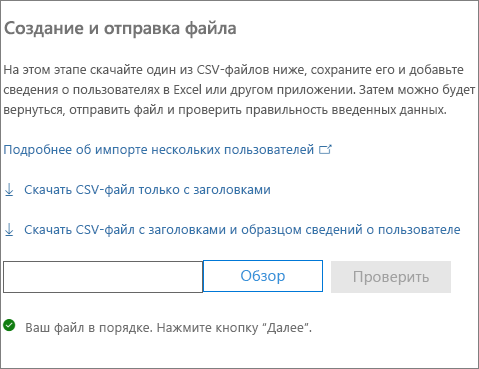
  
    Если при добавлении файла возникнут проблемы, их причины будут указаны в области импорта. Вы также можете скачать файл журнала.
    
5. В диалоговом окне **Настройка параметров пользователей** вы можете изменить состояние при входе в систему, а также лицензию продукта, которая будет назначена всем пользователям. 
    
6. В диалоговом окне **просмотра результатов** вы можете отправить их себе или другим пользователям (при этом пароли будут указаны в виде обычного текста), проверить число созданных пользователей и при необходимости приобрести лицензии, чтобы назначить их новым пользователям. 
    
## <a name="watch-the-video"></a>Смотреть видео
<a name="bk_preview"> </a>

 Посмотрите этот короткий видеоролик, в котором показано, как добавить нескольких пользователей. 
  
> [!VIDEO https://www.microsoft.com/videoplayer/embed/f4e7f161-8ae6-4264-a429-9297b539a8de?autoplay=false]
  
## <a name="next-steps"></a>Дальнейшие действия
<a name="bk_preview"> </a>

- После создания учетных записей пользователям понадобится [скачать, установить или переустановить Office 365 или Office 2016 на компьютерах с Windows или Mac OS](https://support.office.com/article/4414eaaf-0478-48be-9c42-23adc4716658). Каждый участник группы может установить Office 365 на пяти компьютерах с Windows или Mac OS. 
    
- Кроме того, каждый пользователь может [настроить приложения Office и электронную почту на мобильных устройствах](https://support.office.com/article/7dabb6cb-0046-40b6-81fe-767e0b1f014f), используя до пяти планшетов и пяти смартфонов, таких как iPhone, iPad и устройства с Android. Таким образом, они смогут редактировать файлы Office где угодно. 
    
    Подробный список этапов настройки см. в статье [Настройка Office 365 для бизнеса](https://support.office.com/article/6a3a29a0-e616-4713-99d1-15eda62d04fa). 
    
## <a name="more-information-about-how-to-add-users-to-office-365"></a>Дополнительные сведения о добавлении пользователей в Office 365
<a name="bk_preview"> </a>

### <a name="not-sure-what-csv-format-is"></a>Общие сведения о формате CSV
<a name="__toc316652088"> </a>

CSV-файл содержит значения, разделенные запятыми. Такие файлы создаются и редактируются с помощью обычного текстового редактора или программы для работы с таблицами, например Excel.
  
Для начала вы можете загрузить и использовать [этот пример электронной таблицы](https://www.microsoft.com/download/details.aspx?id=45485). Помните, что для Office 365 в первой строке должны быть заголовки столбцов, поэтому не заменяйте их другими данными. 
  
Сохраните файл в формате CSV под другим именем.
  

  
При сохранении вы, скорее всего, увидите сообщение о том, что в случае сохранения файла в формате CSV некоторые функции в книге будут потеряны. Это нормально. Нажмите кнопку **Да**, чтобы продолжить. 
  

  
### <a name="tips-for-formatting-your-spreadsheet"></a>Советы по форматированию электронной таблицы
<a name="__toc314595848"> </a>

- **Обязательно ли использовать такие же заголовки столбцов, как в примере электронной таблицы?** Да. Первая строка в примере таблицы содержит заголовки столбцов. Эти заголовки являются обязательными. Создайте строку под заголовками для каждого пользователя, которого вы хотите добавить в Office 365. Если вы добавите, измените или удалите какие-либо заголовки столбцов, Office 365 не сможет создать пользователей на основе данных из файла. 
    
- **Что делать, если сведения о пользователе неполны?** Имя пользователя и отображаемое имя обязательны: не указав их, вы не сможете добавить учетную запись. Если у вас нет других сведений, таких как факс, вы можете ввести вместо них пробел и запятую, чтобы оставить соответствующее поле пустым. 
    
- ** How small or large can the spreadsheet be? ** The spreadsheet must have at least two rows. One is for the column headings (the user data column label) and one for the user. You cannot have more than 251 rows. If you need to import more than 250 users, you can create more than one spreadsheet. 
    
- ** What languages can I use? ** When you create your spreadsheet, you can enter user data column labels in any language or characters, but you must not change the order of the labels, as shown in the sample. You can then make entries into the fields, using any language or characters, and save your file in a Unicode or UTF-8 format. 
    
- **Как добавить пользователей из разных стран или регионов?** Создайте отдельную таблицу для каждой области. Вам потребуется выполнить мастер массового добавления для каждой таблицы, указав одинаковое расположение для всех пользователей в текущем файле. 
    
- **Ограничено ли количество символов?** Максимальное количество знаков для значений в столбцах данных пользователя указано в таблице ниже. 
    
|**Столбец данных пользователя**|**Максимальная длина в знаках**|
|:-----|:-----|
|Имя пользователя (обязательно)  <br/> |79, включая знак @, в формате имя@домен.\<расширение\>. Псевдоним пользователя не может содержать больше 30 знаков, а имя домена — больше 48.  <br/> |
|Имя  <br/> |64  <br/> |
|Фамилия  <br/> |64  <br/> |
|Отображаемое имя (обязательно)  <br/> |256  <br/> |
|Должность  <br/> |64  <br/> |
|Отдел  <br/> |64  <br/> |
|Номер офиса  <br/> |128  <br/> |
|Рабочий телефон  <br/> |64  <br/> |
|Мобильный телефон  <br/> |64  <br/> |
|Факс  <br/> |64  <br/> |
|Адрес  <br/> |1023  <br/> |
|Город  <br/> |128  <br/> |
|Область или край  <br/> |128  <br/> |
|Почтовый индекс  <br/> |40  <br/> |
|Страна  <br/> |128  <br/> |
   
### <a name="still-having-problems-when-adding-users-to-office-365"></a>Все еще испытываете проблемы при добавлении пользователей в Office 365?

- **Убедитесь, что электронная таблица отформатирована правильно.** Проверьте соответствие заголовков столбцов заголовкам в примере файла. Убедитесь, что соблюдены ограничения на длину полей и что все поля разделены запятыми. 
    
- ** If you don't see the new users in Office 365 right away, wait a few minutes. ** It can take a little while for changes to go across all the services in Office 365. 
    
## <a name="add-multiple-users-to-office-365-in-the-old-admin-center"></a>Добавление нескольких пользователей в Office 365, используя старый Центр администрирования

1. Скачайте [этот пример электронной таблицы](https://www.microsoft.com/download/details.aspx?id=45485) и откройте его в Excel. 
    
    В вашей таблице должны быть **точно такие же заголовки столбцов**, как и в шаблоне ("Имя пользователя", "Имя" и т. д.). Если вы используете шаблон, то данные в первой строке следует оставить без изменений. Добавляйте сведения о пользователях начиная со второй строки. 
    
    Для каждого человека в таблице также следует указать имя пользователя (например, ivan@contoso.com) и отображаемое имя (например, Иван Воронков). Если вы хотите оставить остальные поля пустыми, введите в каждое из них пробел с запятой, как показано на рисунке ниже. 
    
    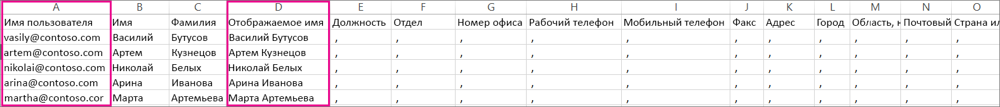
  
    Если ваши пользователи работают в разных странах/регионах, вам потребуется создать по таблице для каждой страны/региона. Например, в одной таблице должны быть перечислены все сотрудники из США, а в другой — все, кто работает в Японии. Это связано с тем, что доступность служб Office 365 зависит от региона. 
    
    **Совет.** Прежде чем добавлять сразу несколько пользователей в Office 365, рекомендуем попрактиковаться с помощью таблицы, приведенной в качестве примера. Добавьте в нее данные 5-10 пользователей и сохраните файл под новым именем. Выполните действия, описанные в этой инструкции, проверьте результат, а затем удалите созданные учетные записи и повторите все сначала. Таким образом вы поймете, какие именно данные вам нужно внести. Помимо этого, ознакомьтесь с разделом [Советы по форматированию электронной таблицы](add-several-users-at-the-same-time.md#__toc314595848).
    
2. Войдите в Office 365 с рабочей или учебной учетной записью. 
    
3. Перейдите в Центр администрирования.
    
4. Чтобы пользователи могли работать со службами Office 365, им необходимо назначить лицензии. Прежде чем продолжать, проверьте, достаточно ли у вас лицензий для всех пользователей, которых вы добавили в таблицу. Для этого выберите **Выставление счетов** \> **Подписки**.  Если вам нужно приобрести дополнительные лицензии, выберите ** Изменить количество лицензий **. Вы также можете запустить мастер и распределить имеющиеся лицензии, затем приобрести дополнительные и снова запустить его. 
    
5. Теперь откройте мастер массового добавления пользователей (выберите **Пользователи** \> **Активные пользователи**). Выберите , как показано на приведенном ниже рисунке. 
    
    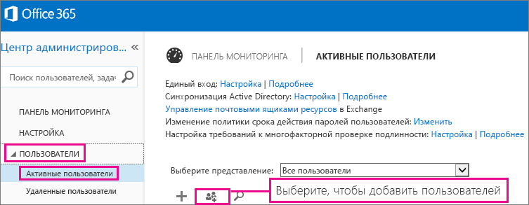
  
    Откроется мастер массового добавления пользователей с инструкциями по добавлению группы сотрудников в Office 365. 
    
6. В действии 1 "Выбор CSV-файла" укажите свою таблицу, как показано на приведенном ниже рисунке.
    
    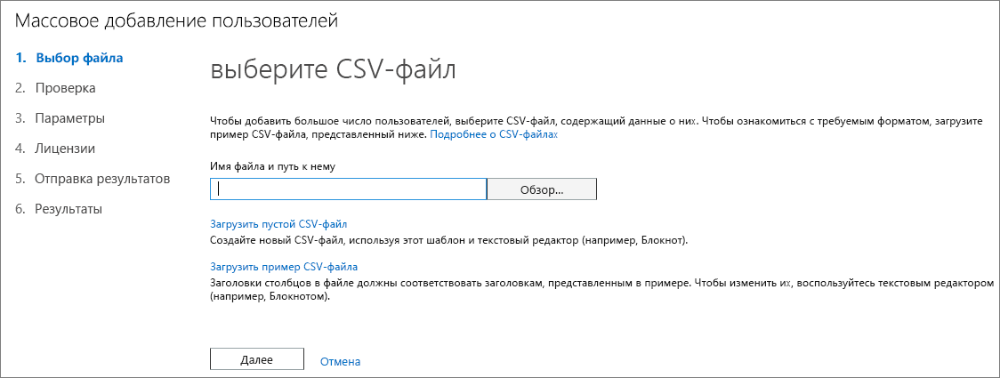
  
7. В действии 2 "Проверка" мастер сообщает вам, правильно ли отформатировано содержимое таблицы.
    
    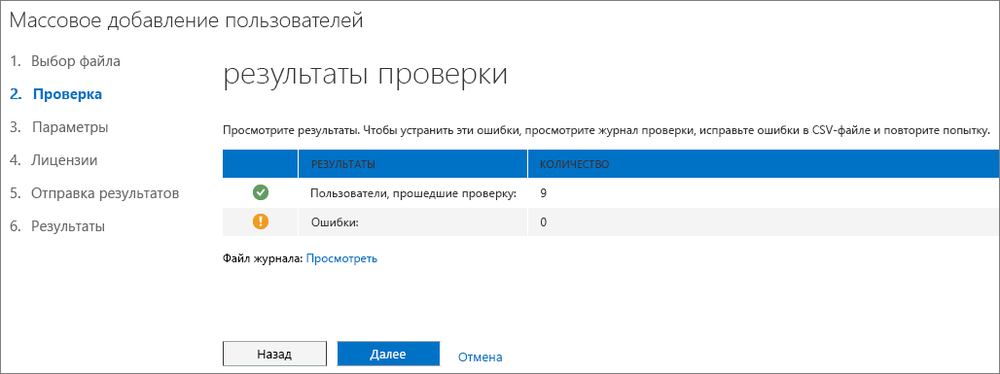
  
8. В действии 3 "Параметры" выберите **Разрешено**, чтобы указанные в таблице пользователи могли работать с Office 365. Также выберите страну, в которой эти пользователи будут работать с Office 365. Помните, что если некоторые сотрудники вашей организации будут использовать Office 365 в другой стране, то вам потребуется создать для них отдельную таблицу и еще раз выполнить мастер массового добавления. 
    
    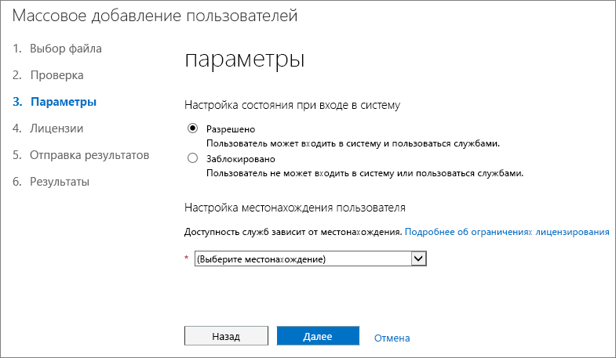
  
9. На странице назначения лицензий указано количество доступных лицензий. 
    
    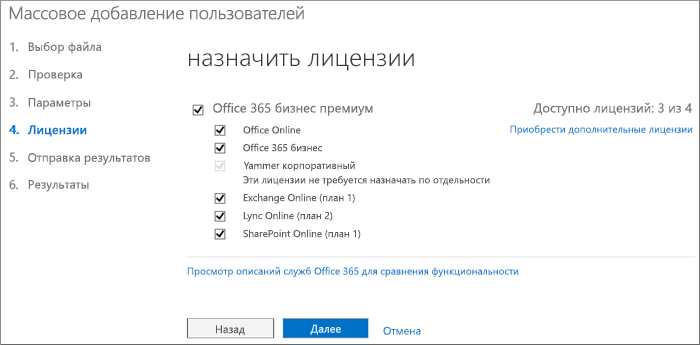
  
    Вы можете выбрать **Приобретение дополнительных лицензий**, но при этом мастер прекратит работу и вы перейдете в раздел **Выставление счетов** Центра администрирования Microsoft 365. После покупки дополнительных лицензий подождите несколько минут, чтобы мы успели обработать ваш заказ, и снова запустите мастер массового добавления пользователей. 
    
    Без покупки дополнительных лицензий вы не сможете создать учетные записи для всех пользователей, перечисленных в таблице. 
    
    В этом примере мы не приобретаем дополнительные лицензии, а продолжаем работу в мастере массового добавления.
    
10. В действии 5 "Отправка результатов" введите адреса электронной почты лиц, которым вы хотите отправить список  *всех*  имен и временных паролей Office 365 пользователей из таблицы. 
    
    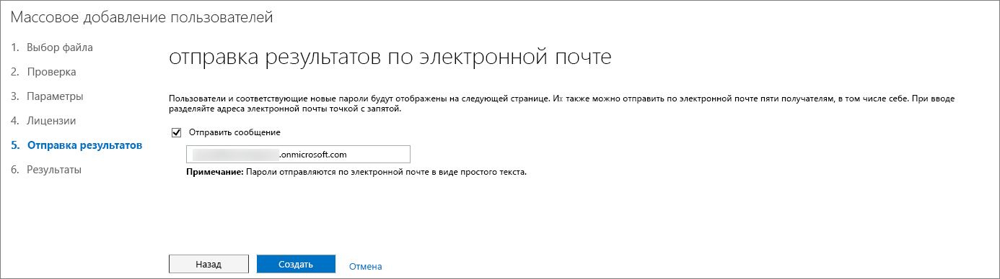
  
    Приведенное ниже сообщение электронной почты отправляется по всем адресам, указанным в действии 5 ("Отправка результатов"). Оно содержит сведения о том, какие учетные записи были созданы, а также об ошибках в процессе их добавления. Обратите внимание, что для некоторых пользователей учетные записи не созданы, поскольку им не хватило лицензий. 
    
    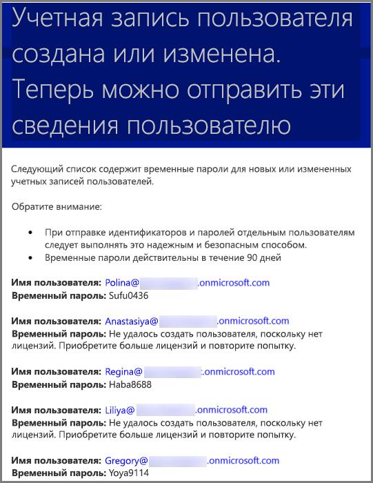
  
    Вы сможете приобрести дополнительные лицензии позже и еще раз запустить мастер массового добавления пользователей с той же таблицей. Мастер пропускает пользователей, у которых уже есть учетные записи. Строка "повторяющееся имя пользователя" в финальном отчете указывает на наличие учетной записи с теми же данными.
    
11. На последней странице мастера массового добавления перечислены имена пользователей и временные пароли, как показано на приведенном ниже рисунке.
    
    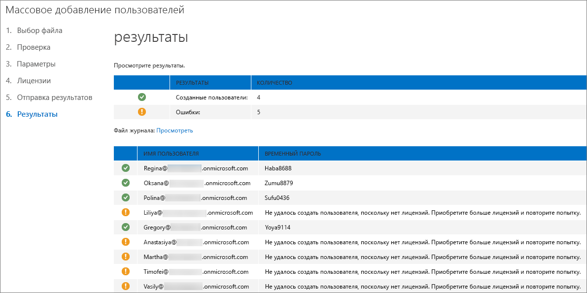
  
12. После того как вы добавите лицензии пользователей в Office 365, им нужно предоставить данные их учетных записей Office 365. Для этого следуйте стандартной процедуре передачи паролей.
    

