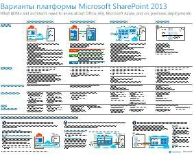
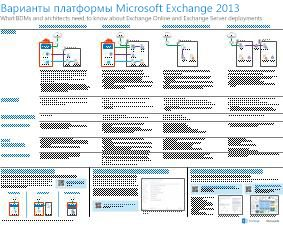
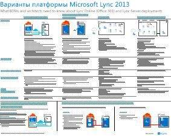
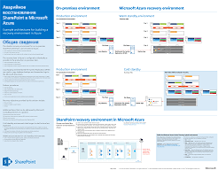

# Архитектурные модели для SharePoint, Exchange, Skype для бизнеса и LyncArchitectural models for SharePoint, Exchange, Skype for Business, and Lync

 **Сводка:** Получите плакаты ИТ, которые описывают модели архитектуры, развертывание и параметры платформе SharePoint, Exchange, Скайп для бизнеса и Lync.**Summary:** Get the IT posters that describe the architectural models, deployment, and platform options for SharePoint, Exchange, Skype for Business, and Lync.
  
На этих афишах для ИТ-специалистов описаны модели архитектуры и варианты развертывания SharePoint, Exchange, Skype для бизнеса и Lync. Эти ресурсы содержат также сведения о конфигурации для развертывания SharePoint в Microsoft Azure.These IT posters describe the architectural models and deployment options for SharePoint, Exchange, Skype for Business, and Lync, and they provide design information for deploying SharePoint in Microsoft Azure.
  
В Office 365 можно обеспечить взаимодействие и совместная работа службы, которые пользователи знакомы с как облачной службе. С некоторыми исключениями пользовательского интерфейса не меняется при обслуживании локального развертывания или с помощью Office 365. В этом объединенных пользовательский интерфейс упрощает менее указать место размещения каждой рабочей нагрузки и вызывает вопросы, такие как:With Office 365, you can provide the collaboration and communication services your users are familiar with as a cloud-based service. With a few exceptions, the user experience remains the same whether you are maintaining an on-premises deployment or using Office 365. This unified user experience makes it less straightforward to decide where to place each workload and raises questions such as:
  
- Как определить, какой вариант платформы использовать для отдельных рабочих нагрузок?How do you determine which platform option to choose for your individual workloads?
    
- Имеет ли смысл оставлять какую-либо службу локальной?Does it make sense to keep any service on-premises?
    
- В каком случае целесообразно использовать гибридное развертывание?What is a scenario where a hybrid deployment is appropriate?
    
- Как Microsoft Azure вписываются в рисунокHow does Microsoft Azure fit in the picture?
    
- Какие конфигурации поддерживаются для рабочих нагрузок Office Server в Azure?What are the supported configurations for Office Server workloads in Azure?
    
> [!TIP]
> Большинство плакатов на этой странице доступны на нескольких языках, включая английский, испанский, итальянский, китайский, корейский, немецкий, португальский, русский, французский и японский. Чтобы скачать плакат на одном из этих языков, нажмите ссылку **Другие языки**.Most of the posters on this page are available in multiple languages, including Chinese, English, French, German, Italian, Japanese, Korean, Portuguese, Russian, and Spanish. To download a poster in one of these languages, click the **More languages** link for that poster.
  
Ждем ваших отзывов по адресу [cloudadopt@microsoft.com](mailto:cloudadopt@microsoft.com).Let us know what you think! Send us email at [cloudadopt@microsoft.com](mailto:cloudadopt@microsoft.com). 
  
На этой странице есть ссылки на следующие афиши:This page links you to the following posters:
  
- **Плакаты модели архитектуры** Эти ресурсы можно использовать для определения идеальная платформы и конфигурации для SharePoint 2016 и Скайп для 2015 бизнеса.**Architectural models posters** You can use these resources to determine your ideal platform and configuration for SharePoint 2016 and Skype for Business 2015.
    
  - [Архитектурные модели Microsoft SharePoint 2016Microsoft SharePoint 2016 Architectural Models](architectural-models-for-sharepoint-exchange-skype-for-business-and-lync.md#SP2016_ArchModel)
    
  - [Поддержка нескольких регионов в OneDrive и SharePoint Online в Office 365Multi-Geo Capabilities in OneDrive and SharePoint Online in Office 365](architectural-models-for-sharepoint-exchange-skype-for-business-and-lync.md#MultiGeoO365ODB)
    
  - [Базы данных SharePoint Server 2016SharePoint Server 2016 Databases](architectural-models-for-sharepoint-exchange-skype-for-business-and-lync.md#SP2016_Databases)
    
  - [Архитектурные модели Microsoft Skype для бизнеса 2015Microsoft Skype for Business 2015 Architectural Models](architectural-models-for-sharepoint-exchange-skype-for-business-and-lync.md#SfB2015_ArchModel)
    
- **Плакаты параметры платформе** Эти ресурсы можно использовать для определения идеальная платформы и конфигурации для SharePoint 2013, Exchange 2013 и Lync 2013.**Platform options posters** You can use these resources to determine your ideal platform and configuration for SharePoint 2013, Exchange 2013, and Lync 2013.
    
  - [Варианты платформы SharePoint 2013SharePoint 2013 Platform Options](architectural-models-for-sharepoint-exchange-skype-for-business-and-lync.md#SP2013_Options)
    
  - [Варианты платформы Exchange 2013Exchange 2013 Platform Options](architectural-models-for-sharepoint-exchange-skype-for-business-and-lync.md#Exch2013_options)
    
  - [Варианты платформы Lync 2013Lync 2013 Platform Options](architectural-models-for-sharepoint-exchange-skype-for-business-and-lync.md#Lync2013_Options)
    
- **SharePoint Server 2013 в Azure решений плакатов** Можно использовать эти плакаты ИТ для определения проектирования и настройки рабочих нагрузок SharePoint Server 2013 в службах инфраструктуры.**SharePoint Server 2013 in Azure solutions posters** You can use these IT posters to determine the design and configuration for SharePoint Server 2013 workloads in Azure infrastructure services.
    
  - [Веб-сайты в Microsoft Azure с использованием SharePoint Server 2013Internet sites in Microsoft Azure using SharePoint Server 2013](architectural-models-for-sharepoint-exchange-skype-for-business-and-lync.md#Azure_sharepoint2013)
    
  - [Пример проекта: веб-сайты в Microsoft Azure для SharePoint 2013Design sample: Internet sites in Microsoft Azure for SharePoint 2013](architectural-models-for-sharepoint-exchange-skype-for-business-and-lync.md#DesignSampleInternetSites)
    
  - [Аварийное восстановление SharePoint в Microsoft AzureSharePoint Disaster Recovery to Microsoft Azure](architectural-models-for-sharepoint-exchange-skype-for-business-and-lync.md#sharepoint_recovery_Azure)
    
## Афиши с архитектурными моделямиArchitectural models posters

Эти новые афиши для ИТ-специалистов, посвященные SharePoint 2016 и Skype для бизнеса 2015, позволяют сравнивать различные методы развертывания и созданы в удобном для печати формате. На каждой афише перечислены все доступные варианты конфигураций или платформ, а также указаны следующие сведения о каждом варианте:These new IT posters for SharePoint 2016 and Skype for Business 2015 provide a way to compare the various deployment methods in an easy-to-print format. Each poster provides a list of all the configurations or platform options available and gives you the following information for each option:
  
- **Обзор (en)** Краткий обзор платформы, включая концептуальная диаграмма.**Overview** A brief summary of the platform, including a conceptual diagram.
    
- **Лучше всего подходит для** Распространенные сценарии, которые идеально подходит для конкретной платформе.**Best for** Common scenarios that are ideally suited for the particular platform.
    
- **Требования к лицензированию** Лицензии, необходимые для развертывания.**License requirements** The licenses you need for deployment.
    
- **Архитектура задач** Решения, которые необходимо внести в архитектора.**Architecture tasks** The decisions you need to make as an architect.
    
- **Для ИТ-специалистов задачи или обязанности** Ежедневный обязанности, которые необходимо спланировать ИТ-специалистов.**IT Pro tasks or responsibilities** The daily responsibilities that your IT staff needs to plan for.
    

### Архитектурные модели Microsoft SharePoint 2016Microsoft SharePoint 2016 Architectural Models

|**Элемент****Item**|**Описание****Description**|
|:-----|:-----|
|[          ](https://www.microsoft.com/download/details.aspx?id=52650)[          ](https://www.microsoft.com/download/details.aspx?id=52650)   [Версия в формате](https://download.microsoft.com/download/4/F/A/4FA0F94B-EE2F-41DB-A047-D9864FEF41E9/SharePoint2016ArchitecturalModels.pdf) \| [Visio](https://download.microsoft.com/download/4/F/A/4FA0F94B-EE2F-41DB-A047-D9864FEF41E9/SharePoint2016ArchitecturalModels.vsdx) \| [несколько языков](https://www.microsoft.com/download/details.aspx?id=52650)    [PDF](https://download.microsoft.com/download/4/F/A/4FA0F94B-EE2F-41DB-A047-D9864FEF41E9/SharePoint2016ArchitecturalModels.pdf)  \| [Visio](https://download.microsoft.com/download/4/F/A/4FA0F94B-EE2F-41DB-A047-D9864FEF41E9/SharePoint2016ArchitecturalModels.vsdx)  \| [More languages](https://www.microsoft.com/download/details.aspx?id=52650)   | На этой афише для ИТ-специалистов описаны конфигурации SharePoint Online, Microsoft Azure и локальной среды SharePoint, которые необходимо знать лицам, принимающим бизнес-решения, и архитекторам решений.This IT poster describes the SharePoint Online, Microsoft Azure, and SharePoint on-premises configurations that business decision makers and solutions architects need to know about.    - **SharePoint Online (SaaS)** — использование SharePoint с помощью программное обеспечение как услуга (SaaS) модель подписки.- **SharePoint Online (SaaS)** - Consume SharePoint through a Software as a Service (SaaS) subscription model.   - **Гибридная среда SharePoint** - перемещение сайтов SharePoint и приложений в облако на рабочем месте.- **SharePoint Hybrid** - Move your SharePoint sites and apps to the cloud at your own pace.   - **SharePoint в Azure (IaaS)** — расширение в локальной среде в Microsoft Azure и развертывать серверы 2016 SharePoint существует. (Рекомендуется для высокой доступности и аварийного восстановления и dev/тестовой среды.)- **SharePoint in Azure (IaaS)** - You extend your on-premises environment into Microsoft Azure and deploy SharePoint 2016 Servers there. (This is recommended for High Availability/Disaster Recovery and dev/test environments.)   - **Локальная версия SharePoint** — планирование, развертывание, обслуживание и настроить среду SharePoint в центре обработки данных, который хранится.- **SharePoint On-premises** - You plan, deploy, maintain and customize your SharePoint environment in a datacenter that you maintain.   |
   

### Поддержка нескольких регионов в OneDrive и SharePoint Online в Office 365Multi-Geo Capabilities in OneDrive and SharePoint Online in Office 365

|**Элемент****Item**|**Описание****Description**|
|:-----|:-----|
|[          ](https://github.com/MicrosoftDocs/OfficeDocs-Enterprise/raw/live/Enterprise/images/Multi-Geo-ODB.pdf)[          ](https://github.com/MicrosoftDocs/OfficeDocs-Enterprise/raw/live/Enterprise/images/Multi-Geo-ODB.pdf)   [PDF](https://github.com/MicrosoftDocs/OfficeDocs-Enterprise/raw/live/Enterprise/images/Multi-Geo-ODB.pdf)  \| [Visio](https://github.com/MicrosoftDocs/OfficeDocs-Enterprise/raw/live/Enterprise/images/Multi-Geo-ODB.vsdx)[PDF](https://github.com/MicrosoftDocs/OfficeDocs-Enterprise/raw/live/Enterprise/images/Multi-Geo-ODB.pdf)  \| [Visio](https://github.com/MicrosoftDocs/OfficeDocs-Enterprise/raw/live/Enterprise/images/Multi-Geo-ODB.vsdx)   | На этом плакате приведен обзор одной странице несколькими географически возможностей в OneDrive и SharePoint Online в Office 365. Эта модель включает в себя:This poster is a one-page overview of Multi-Geo Capabilities in OneDrive and SharePoint Online in Office 365. This model includes:    -Преимущества- Benefits   -Действия для развертывания- Steps for deployment   -Пример конфигурации- An example configuration     Дополнительные сведения о возможностях несколькими Geo в OneDrive и SharePoint Online в Office 365, щелкните [здесь](https://aka.ms/onedrivemultigeo).For more information about Multi-Geo Capabilities in OneDrive and SharePoint Online in Office 365, click [here](https://aka.ms/onedrivemultigeo).    |
   

### Базы данных SharePoint Server 2016SharePoint Server 2016 Databases

|**Элемент****Item**|**Описание****Description**|
|:-----|:-----|
|[          ](https://www.microsoft.com/download/details.aspx?id=55041)[          ](https://www.microsoft.com/download/details.aspx?id=55041)   [Версия в формате](https://download.microsoft.com/download/D/5/D/D5DC1121-8BC5-4953-834F-1B5BB03EB691/DBrefguideSPS2016_tabloid.pdf) \| [Visio](https://download.microsoft.com/download/D/5/D/D5DC1121-8BC5-4953-834F-1B5BB03EB691/DBrefguideSPS2016_tabloid.vsdx) \| [несколько языков](https://www.microsoft.com/download/details.aspx?id=55041)    [PDF](https://download.microsoft.com/download/D/5/D/D5DC1121-8BC5-4953-834F-1B5BB03EB691/DBrefguideSPS2016_tabloid.pdf)  \| [Visio](https://download.microsoft.com/download/D/5/D/D5DC1121-8BC5-4953-834F-1B5BB03EB691/DBrefguideSPS2016_tabloid.vsdx)  \| [More languages](https://www.microsoft.com/download/details.aspx?id=55041)   | На этой афише для IT-специалистов представлен краткий справочник по базам данных SharePoint Server 2016. По каждой базе данных указано следующее:This IT poster is a quick reference guide for SharePoint Server 2016 databases. Each database has the following details:    -Размер- Size   -Руководство по масштабирования- Scaling guidance   -Шаблоны операций ввода-вывода- I/O patterns   -Требования к- Requirements     Первая страница содержит системные базы данных SharePoint и приложений-служб, создания нескольких баз данных. Вторая страница отображаются все приложения-службы, которые имеют одной базы данных.The first page contains the SharePoint system databases and the service applications that have multiple databases. The second page shows all of the service applications that have single databases.     Дополнительные сведения о базах данных SharePoint Server 2016 см. в статье [Database types and descriptions in SharePoint Server 2016](https://technet.microsoft.com/en-us/library/cc678868%28v=office.16%29.aspx)For more information about the SharePoint Server 2016 databases, see [Database types and descriptions in SharePoint Server 2016](https://technet.microsoft.com/en-us/library/cc678868%28v=office.16%29.aspx)   |
   

### Архитектурные модели Microsoft Skype для бизнеса 2015Microsoft Skype for Business 2015 Architectural Models

|**Элемент****Item**|**Описание****Description**|
|:-----|:-----|
|[          ](https://www.microsoft.com/download/details.aspx?id=55022)[          ](https://www.microsoft.com/download/details.aspx?id=55022)   [Версия в формате](https://download.microsoft.com/download/7/7/4/7741262C-A60D-41F7-863B-99BF5964FBFE/Skype%20for%20Business%20Architectural%20Models.pdf) \| [Visio](https://download.microsoft.com/download/7/7/4/7741262C-A60D-41F7-863B-99BF5964FBFE/Skype%20for%20Business%20Architectural%20Models.vsd) \| [несколько языков](https://www.microsoft.com/download/details.aspx?id=55022)    [PDF](https://download.microsoft.com/download/7/7/4/7741262C-A60D-41F7-863B-99BF5964FBFE/Skype%20for%20Business%20Architectural%20Models.pdf)  \| [Visio](https://download.microsoft.com/download/7/7/4/7741262C-A60D-41F7-863B-99BF5964FBFE/Skype%20for%20Business%20Architectural%20Models.vsd)  \| [More languages](https://www.microsoft.com/download/details.aspx?id=55022)   |На этом плакате описывается Скайп для Online бизнеса, локального и гибридного, облако УАТС и интеграцию с конфигурации Exchange и SharePoint, принимающим решения и архитекторы решений необходимо знать о.This poster describes the Skype for Business Online, on-premises, hybrid, cloud PBX, and integration with Exchange and SharePoint configurations that business decision makers and solutions architects need to know about.    Предназначена для ИТ-специалистов аудитории для возведения сведения о различных основные архитектурные моделей, через которые может использоваться Скайп для бизнеса в Интернет и Скайп для бизнеса на локальном.It is intended for the IT Pro audience to raise awareness of the different fundamental architectural models through which Skype for Business Online and Skype for Business on premises can be consumed.   Начать с независимо от выбранного конфигурацию наиболее подходят для потребности вашей организации и планы на будущее. Попробуйте и использовать другие пользователи. Например может потребоваться Обдумайте возможность интеграции с Exchange и SharePoint или решения, использующий предложения облачных УАТС корпорации Майкрософт.Start with whichever configuration best suits your organization's needs and future plans. Consider and use others as needed. For example, you might want to consider integration with Exchange and SharePoint or a solution that takes advantage of Microsoft's Cloud PBX offering.    |
   
## Афиши с вариантами платформPlatform options posters

Эти афиши для ИТ-специалистов, посвященные SharePoint 2013, Exchange 2013 и Lync 2013, позволяют сравнивать различные методы развертывания и созданы в большом формате для удобства понимания. На каждой афише перечислены все доступные варианты конфигураций или платформ, а также указаны следующие сведения о каждом варианте:These IT posters for SharePoint 2013, Exchange 2013, and Lync 2013 provide a way to compare the various deployment methods at a single glance in a large poster format. Each poster provides a list of all the configurations or platform options available and gives you the following information for each option:
  
- **Обзор (en)** Краткий обзор платформы, включая концептуальная диаграмма.**Overview** A brief summary of the platform, including a conceptual diagram.
    
- **Лучше всего подходит для** Распространенные сценарии, которые идеально подходит для конкретной платформе.**Best for** Common scenarios that are ideally suited for the particular platform.
    
- **Требования к лицензированию** Лицензии, необходимые для развертывания.**License requirements** The licenses you need for deployment.
    
- **Архитектура задач** Решения, которые необходимо внести в архитектора.**Architecture tasks** The decisions you need to make as an architect.
    
- **Для ИТ-специалистов задачи или обязанности** Ежедневный обязанности, которые необходимо спланировать ИТ-специалистов.**IT Pro tasks or responsibilities** The daily responsibilities that your IT staff needs to plan for.
    

## Варианты платформы SharePoint 2013SharePoint 2013 Platform Options

****

|**Элемент****Item**|**Описание****Description**|
|:-----|:-----|
|[          ](https://www.microsoft.com/download/details.aspx?id=40332)[          ](https://www.microsoft.com/download/details.aspx?id=40332)   [Версия в формате](http://go.microsoft.com/fwlink/p/?LinkId=324594) \| [Visio](https://go.microsoft.com/fwlink/p/?LinkId=324593) \| [несколько языков](https://www.microsoft.com/download/details.aspx?id=40332)    [PDF](http://go.microsoft.com/fwlink/p/?LinkId=324594)  \| [Visio](https://go.microsoft.com/fwlink/p/?LinkId=324593)  \| [More languages](https://www.microsoft.com/download/details.aspx?id=40332)   |Для бизнеса лиц, принимающих решения (СУБД) и создают эта модель показывает параметры платформы для SharePoint 2013, SharePoint в Office 365, локальный гибридный с Office 365, Azure и только локальные развертывания. Он содержит обзор каждого архитектуру, рекомендации, требования к лицензированию и списки архитектор и задачи для ИТ-специалистов для каждой платформы. Несколько решений SharePoint в Azure, выделены.For business decision makers (BDMs) and architects, this model illustrates the platform options for SharePoint 2013, SharePoint in Office 365, on-premises hybrid with Office 365, Azure, and on-premises only deployments. It includes an overview of each architecture, recommendations, license requirements, and lists of architect and IT Pro tasks for each platform. Several SharePoint solutions on Azure are highlighted.   Версии доступных текст на этом плакате можно в статье [доступных схемы - параметры платформе Microsoft SharePoint 2013](accessible-diagrammicrosoft-sharepoint-2013-platform-options.md).For an accessible text version of this poster, see [Accessible diagram - Microsoft SharePoint 2013 Platform Options](accessible-diagrammicrosoft-sharepoint-2013-platform-options.md).    |
   

## Варианты платформы Exchange 2013Exchange 2013 Platform Options

****

|**Элемент****Item**|**Описание****Description**|
|:-----|:-----|
|[          ](https://www.microsoft.com/download/details.aspx?id=42676)[          ](https://www.microsoft.com/download/details.aspx?id=42676)   [Версия в формате](https://go.microsoft.com/fwlink/p/?LinkID=398740) \| [Visio](https://go.microsoft.com/fwlink/p/?LinkID=398742) \| [несколько языков](https://www.microsoft.com/download/details.aspx?id=42676)    [PDF](https://go.microsoft.com/fwlink/p/?LinkID=398740)  \| [Visio](https://go.microsoft.com/fwlink/p/?LinkID=398742)  \| [More languages](https://www.microsoft.com/download/details.aspx?id=42676)   |Для СУБД и создают в этой модели описываются параметры доступны платформы для Exchange 2013. Клиенты могут выбирать из Exchange Online в Office 365, гибридного Exchange, Exchange Server локальных и размещенных Exchange. Плакат приводятся подробные сведения о каждой архитектуры параметра, включая наиболее идеальная сценарии для каждого, требования к лицензированию и обязанности для ИТ-специалистов.For BDMs and architects, this model describes the available platform options for Exchange 2013. Customers can choose from Exchange Online with Office 365, Hybrid Exchange, Exchange Server on-premises and Hosted Exchange. The poster includes details of each architectural option, including the most ideal scenarios for each, the license requirements and IT Pro responsibilities.   Версии доступных текст на этом плакате можно в статье [доступных схемы - параметры платформе Microsoft Exchange 2013](accessible-diagrammicrosoft-exchange-2013-platform-options.md).For an accessible text version of this poster, see [Accessible diagram - Microsoft Exchange 2013 Platform Options](accessible-diagrammicrosoft-exchange-2013-platform-options.md).    |
   

## Варианты платформы Lync 2013Lync 2013 Platform Options

****

|**Элемент****Item**|**Описание****Description**|
|:-----|:-----|
|[          ](https://www.microsoft.com/download/details.aspx?id=41677)[          ](https://www.microsoft.com/download/details.aspx?id=41677)   [Версия в формате](https://go.microsoft.com/fwlink/p/?LinkID=391837) \| [Visio](https://go.microsoft.com/fwlink/p/?LinkID=391839) \| [несколько языков](https://www.microsoft.com/download/details.aspx?id=41677)    [PDF](https://go.microsoft.com/fwlink/p/?LinkID=391837)  \| [Visio](https://go.microsoft.com/fwlink/p/?LinkID=391839)  \| [More languages](https://www.microsoft.com/download/details.aspx?id=41677)   |Эта модель, предназначенная для лиц, принимающих бизнес-решения, и архитекторов, описывает доступные варианты платформы Lync 2013. Клиенты могут выбрать Lync Online с Office 365, гибридную среду Lync, локальный сервер Lync Server и размещенное решение Lync. Афиша для ИТ-специалистов содержит подробные сведения о каждом варианте архитектуры, включая наиболее подходящие сценарии для каждого из них, требования к лицензированию и обязанности ИТ-специалистов.For BDMs and architects, this model describes the available platform options for Lync 2013. Customers can choose from Lync Online with Office 365, Hybrid Lync, Lync Server on-premises and Hosted Lync. The IT poster includes details of each architectural option, including the most ideal scenarios for each, the license requirements and IT Pro responsibilities.    |
   

## Афиши с решениями SharePoint в AzureSharePoint in Azure solutions posters

Эти плакаты ИТ показывают решения на основе Azure с использованием SharePoint Server 2013 в формате больших афиши.These IT posters show Azure-based solutions using SharePoint Server 2013 in a large poster format.
  

### Веб-сайты в Microsoft Azure с использованием SharePoint Server 2013Internet sites in Microsoft Azure using SharePoint Server 2013

****

|**Элемент****Item**|**Описание****Description**|
|:-----|:-----|
|[          ](https://www.microsoft.com/download/details.aspx?id=41992)[          ](https://www.microsoft.com/download/details.aspx?id=41992)   [Версия в формате](https://go.microsoft.com/fwlink/p/?LinkId=392552) \| [Visio](https://go.microsoft.com/fwlink/p/?LinkId=392551) \| [несколько языков](https://www.microsoft.com/download/details.aspx?id=41992)    [PDF](https://go.microsoft.com/fwlink/p/?LinkId=392552)  \| [Visio](https://go.microsoft.com/fwlink/p/?LinkId=392551)  \| [More languages](https://www.microsoft.com/download/details.aspx?id=41992)   |На этом плакате описаны ключевые действий и рекомендуемые решений при проектировании архитектуры для сайтов Интернета в Azure. Версии доступных текст на этом плакате можно в статье [доступных схемы - веб-сайтов в Microsoft Azure для SharePoint 2013](accessible-diagraminternet-sites-in-microsoft-azure-for-sharepoint-2013.md).This poster outlines key design activities and recommended architecture choices for Internet-facing sites in Azure. For an accessible text version of this poster, see [Accessible diagram - Internet sites in Microsoft Azure for SharePoint 2013](accessible-diagraminternet-sites-in-microsoft-azure-for-sharepoint-2013.md).     Дополнительные сведения см. в следующих статьях:For more information, see the following articles:     - [Веб-сайты в Microsoft Azure с использованием SharePoint Server 2013](internet-sites-in-microsoft-azure-using-sharepoint-server-2013.md)- [Internet Sites in Microsoft Azure using SharePoint Server 2013](internet-sites-in-microsoft-azure-using-sharepoint-server-2013.md)   - [Архитектуры Microsoft Azure для SharePoint 2013](microsoft-azure-architectures-for-sharepoint-2013.md)- [Microsoft Azure Architectures for SharePoint 2013](microsoft-azure-architectures-for-sharepoint-2013.md)   |
   

### Пример проекта: веб-сайты в Microsoft Azure для SharePoint 2013Design sample: Internet sites in Microsoft Azure for SharePoint 2013

****

|**Элемент****Item**|**Описание****Description**|
|:-----|:-----|
|[          ](https://www.microsoft.com/download/details.aspx?id=41991)[          ](https://www.microsoft.com/download/details.aspx?id=41991)   [Версия в формате](https://go.microsoft.com/fwlink/p/?LinkId=392549) \| [Visio](https://go.microsoft.com/fwlink/p/?LinkId=392548) \| [несколько языков](https://www.microsoft.com/download/details.aspx?id=41991)    [PDF](https://go.microsoft.com/fwlink/p/?LinkId=392549)  \| [Visio](https://go.microsoft.com/fwlink/p/?LinkId=392548)  \| [More languages](https://www.microsoft.com/download/details.aspx?id=41991)   |Используйте этот пример проектирования в качестве отправной точки для собственных архитектуры Интернет-сайта в Azure с использованием SharePoint Server 2013. Версии доступных текст на этом плакате увидеть [доступных диаграмму — пример разработки: веб-сайты в Microsoft Azure для SharePoint 2013](accessible-diagramdesign-sample-internet-sites-in-microsoft-azure-for-sharepoint.md).Use this design sample as a starting point for your own architecture Internet-facing site in Azure using SharePoint Server 2013. For an accessible text version of this poster, see [Accessible diagram - Design sample: Internet sites in Microsoft Azure for SharePoint 2013](accessible-diagramdesign-sample-internet-sites-in-microsoft-azure-for-sharepoint.md).     Дополнительные сведения см. в следующих статьях:For more information, see the following articles:     - [Веб-сайты в Microsoft Azure с использованием SharePoint Server 2013](internet-sites-in-microsoft-azure-using-sharepoint-server-2013.md)- [Internet Sites in Microsoft Azure using SharePoint Server 2013](internet-sites-in-microsoft-azure-using-sharepoint-server-2013.md)   - [Архитектуры Microsoft Azure для SharePoint 2013](microsoft-azure-architectures-for-sharepoint-2013.md)- [Microsoft Azure Architectures for SharePoint 2013](microsoft-azure-architectures-for-sharepoint-2013.md)   |
   

### Аварийное восстановление SharePoint в Microsoft AzureSharePoint Disaster Recovery to Microsoft Azure

****

|**Элемент****Item**|**Описание****Description**|
|:-----|:-----|
|[          ](https://www.microsoft.com/download/details.aspx?id=41993)[          ](https://www.microsoft.com/download/details.aspx?id=41993)   [Версия в формате](https://go.microsoft.com/fwlink/p/?LinkId=392555) \| [Visio](https://go.microsoft.com/fwlink/p/?LinkId=392554) \| [несколько языков](https://www.microsoft.com/download/details.aspx?id=41993)    [PDF](https://go.microsoft.com/fwlink/p/?LinkId=392555)  \| [Visio](https://go.microsoft.com/fwlink/p/?LinkId=392554)  \| [More languages](https://www.microsoft.com/download/details.aspx?id=41993)   |На этом плакате ИТ иллюстрирует принципы архитектуры среды аварийного восстановления в Azure. Версии доступных текст на этом плакате в разделе [доступ диаграмму — аварийное восстановление SharePoint в Microsoft Azure](accessible-diagramsharepoint-disaster-recovery-to-microsoft-azure.md).This IT poster illustrates architecture principles for a disaster recovery environment in Azure. For an accessible text version of this poster, see [Accessible diagram - SharePoint Disaster Recovery to Microsoft Azure](accessible-diagramsharepoint-disaster-recovery-to-microsoft-azure.md).     Дополнительные сведения см. в следующих статьях:For more information, see the following articles:     - [SharePoint Server 2013 Disaster Recovery in Microsoft Azure](sharepoint-server-2013-disaster-recovery-in-microsoft-azure.md)- [SharePoint Server 2013 Disaster Recovery in Microsoft Azure](sharepoint-server-2013-disaster-recovery-in-microsoft-azure.md)   - [Архитектуры Microsoft Azure для SharePoint 2013](microsoft-azure-architectures-for-sharepoint-2013.md)- [Microsoft Azure Architectures for SharePoint 2013](microsoft-azure-architectures-for-sharepoint-2013.md)   |
   

## См. такжеSee Also

[Освоение облака и гибридные решенияCloud adoption and hybrid solutions](cloud-adoption-and-hybrid-solutions.md)
  
[Ресурсы для администраторов, посвященные архитектуре Microsoft CloudMicrosoft Cloud IT architecture resources](microsoft-cloud-it-architecture-resources.md)
  
[Руководства по лаборатории тестирования для принятия облачных решенийCloud adoption Test Lab Guides (TLGs)](cloud-adoption-test-lab-guides-tlgs.md)
  
[Гибридные решенияHybrid solutions](hybrid-solutions.md)

