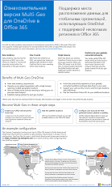
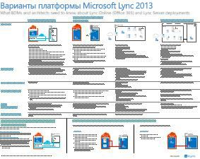

# Архитектурные модели для SharePoint, Exchange, Skype для бизнеса и LyncArchitectural models for SharePoint, Exchange, Skype for Business, and Lync

 **Сводка.** Здесь вы найдете афиши для ИТ-специалистов с описанием архитектурных моделей, развертывания и платформ для SharePoint, Exchange, Skype для бизнеса и Lync.**Summary:** Get the IT posters that describe the architectural models, deployment, and platform options for SharePoint, Exchange, Skype for Business, and Lync.
  
На этих афишах для ИТ-специалистов описаны модели архитектуры и варианты развертывания SharePoint, Exchange, Skype для бизнеса и Lync. Эти ресурсы содержат также сведения о конфигурации для развертывания SharePoint в Microsoft Azure.These IT posters describe the architectural models and deployment options for SharePoint, Exchange, Skype for Business, and Lync, and they provide design information for deploying SharePoint in Microsoft Azure.
  
С помощью Office 365 вы можете предоставлять пользователям знакомые функции совместной работы и коммуникации в составе облачной службы. За некоторыми исключениями, пользовательские интерфейсы в локальной среде и Office 365 одинаковы. Этот единый подход несколько затрудняет выбор среды для рабочих нагрузок и поднимает следующие вопросы:With Office 365, you can provide the collaboration and communication services your users are familiar with as a cloud-based service. With a few exceptions, the user experience remains the same whether you are maintaining an on-premises deployment or using Office 365. This unified user experience makes it less straightforward to decide where to place each workload and raises questions such as:
  
- Как определить, какой вариант платформы использовать для отдельных рабочих нагрузок?How do you determine which platform option to choose for your individual workloads?
    
- Имеет ли смысл оставлять какую-либо службу локальной?Does it make sense to keep any service on-premises?
    
- В каком случае целесообразно использовать гибридное развертывание?What is a scenario where a hybrid deployment is appropriate?
    
- Какова роль Microsoft Azure?How does Microsoft Azure fit in the picture?
    
- Какие конфигурации поддерживаются для рабочих нагрузок Office Server в Azure?What are the supported configurations for Office Server workloads in Azure?
    
> [!TIP]
> Большинство плакатов на этой странице доступны на нескольких языках, включая английский, испанский, итальянский, китайский, корейский, немецкий, португальский, русский, французский и японский. Чтобы скачать плакат на одном из этих языков, нажмите ссылку **Другие языки**.Most of the posters on this page are available in multiple languages, including Chinese, English, French, German, Italian, Japanese, Korean, Portuguese, Russian, and Spanish. To download a poster in one of these languages, click the **More languages** link for that poster.
  
Ждем ваших отзывов по адресу [cloudadopt@microsoft.com](mailto:cloudadopt@microsoft.com).Let us know what you think! Send us email at [cloudadopt@microsoft.com](mailto:cloudadopt@microsoft.com). 
  
На этой странице есть ссылки на следующие афиши:This page links you to the following posters:
  
- **Афиши с архитектурными моделями.**  Эти ресурсы помогут определить идеальную платформу и конфигурацию для SharePoint 2016 и Skype для бизнеса 2015.**Architectural models posters** You can use these resources to determine your ideal platform and configuration for SharePoint 2016 and Skype for Business 2015.
    
  - [Архитектурные модели Microsoft SharePoint 2016Microsoft SharePoint 2016 Architectural Models](architectural-models-for-sharepoint-exchange-skype-for-business-and-lync.md#SP2016_ArchModel)
    
  - [Поддержка нескольких регионов в OneDrive и SharePoint Online в Office 365Multi-Geo Capabilities in OneDrive and SharePoint Online in Office 365](architectural-models-for-sharepoint-exchange-skype-for-business-and-lync.md#MultiGeoO365ODB)
    
  - [Базы данных SharePoint Server 2016SharePoint Server 2016 Databases](architectural-models-for-sharepoint-exchange-skype-for-business-and-lync.md#SP2016_Databases)
    
  - [Архитектурные модели Microsoft Skype для бизнеса 2015Microsoft Skype for Business 2015 Architectural Models](architectural-models-for-sharepoint-exchange-skype-for-business-and-lync.md#SfB2015_ArchModel)
    
- **Афиши с вариантами платформ.**  Эти ресурсы помогут определить идеальную платформу и конфигурацию для SharePoint 2013, Exchange 2013 и Lync 2013.**Platform options posters** You can use these resources to determine your ideal platform and configuration for SharePoint 2013, Exchange 2013, and Lync 2013.
    
  - [Варианты платформы SharePoint 2013SharePoint 2013 Platform Options](architectural-models-for-sharepoint-exchange-skype-for-business-and-lync.md#SP2013_Options)
    
  - [Варианты платформы Exchange 2013Exchange 2013 Platform Options](architectural-models-for-sharepoint-exchange-skype-for-business-and-lync.md#Exch2013_options)
    
  - [Варианты платформы Lync 2013Lync 2013 Platform Options](architectural-models-for-sharepoint-exchange-skype-for-business-and-lync.md#Lync2013_Options)
    
- **Афиши с решениями SharePoint Server 2013 в Azure.**  Эти афиши для ИТ-специалистов помогут определить конфигурацию для рабочих нагрузок SharePoint Server 2013 в службах инфраструктуры Azure.**SharePoint Server 2013 in Azure solutions posters** You can use these IT posters to determine the design and configuration for SharePoint Server 2013 workloads in Azure infrastructure services.
    
  - [Веб-сайты в Microsoft Azure, использующие SharePoint Server 2013Internet sites in Microsoft Azure using SharePoint Server 2013](architectural-models-for-sharepoint-exchange-skype-for-business-and-lync.md#Azure_sharepoint2013)
    
  - [Пример проекта: веб-сайты в Microsoft Azure для SharePoint 2013Design sample: Internet sites in Microsoft Azure for SharePoint 2013](architectural-models-for-sharepoint-exchange-skype-for-business-and-lync.md#DesignSampleInternetSites)
    
  - [Аварийное восстановление SharePoint в Microsoft AzureSharePoint Disaster Recovery to Microsoft Azure](architectural-models-for-sharepoint-exchange-skype-for-business-and-lync.md#sharepoint_recovery_Azure)
    
## Афиши с архитектурными моделямиArchitectural models posters

Эти новые афиши для ИТ-специалистов, посвященные SharePoint 2016 и Skype для бизнеса 2015, позволяют сравнивать различные методы развертывания и созданы в удобном для печати формате. На каждой афише перечислены все доступные варианты конфигураций или платформ, а также указаны следующие сведения о каждом варианте:These new IT posters for SharePoint 2016 and Skype for Business 2015 provide a way to compare the various deployment methods in an easy-to-print format. Each poster provides a list of all the configurations or platform options available and gives you the following information for each option:
  
- **Общие сведения**. Кратное описание платформы, включая концептуальную схему.**Overview** A brief summary of the platform, including a conceptual diagram.
    
- **Оптимально для**. Распространенные сценарии, идеально подходящие для определенной платформы.**Best for** Common scenarios that are ideally suited for the particular platform.
    
- **Требования к лицензированию**. Лицензии, необходимые для развертывания.**License requirements** The licenses you need for deployment.
    
- **Задачи архитектуры**. Решения, которые вам нужно принять как архитектору.**Architecture tasks** The decisions you need to make as an architect.
    
- **Задачи или обязанности ИТ-специалистов**. Ежедневные обязанности, которые нужно запланировать ИТ-специалистам.**IT Pro tasks or responsibilities** The daily responsibilities that your IT staff needs to plan for.
    

### Архитектурные модели Microsoft SharePoint 2016Microsoft SharePoint 2016 Architectural Models

|**Элемент****Item**|**Описание****Description**|
|:-----|:-----|
|[          ](https://www.microsoft.com/download/details.aspx?id=52650)[          ](https://www.microsoft.com/download/details.aspx?id=52650)   [PDF](https://download.microsoft.com/download/4/F/A/4FA0F94B-EE2F-41DB-A047-D9864FEF41E9/SharePoint2016ArchitecturalModels.pdf)  \| [Visio](https://download.microsoft.com/download/4/F/A/4FA0F94B-EE2F-41DB-A047-D9864FEF41E9/SharePoint2016ArchitecturalModels.vsdx)  \| [Другие языки](https://www.microsoft.com/download/details.aspx?id=52650)[PDF](https://download.microsoft.com/download/4/F/A/4FA0F94B-EE2F-41DB-A047-D9864FEF41E9/SharePoint2016ArchitecturalModels.pdf)  \| [Visio](https://download.microsoft.com/download/4/F/A/4FA0F94B-EE2F-41DB-A047-D9864FEF41E9/SharePoint2016ArchitecturalModels.vsdx)  \| [More languages](https://www.microsoft.com/download/details.aspx?id=52650)   | На этой афише для ИТ-специалистов описаны конфигурации SharePoint Online, Microsoft Azure и локальной среды SharePoint, которые необходимо знать лицам, принимающим бизнес-решения, и архитекторам решений.This IT poster describes the SharePoint Online, Microsoft Azure, and SharePoint on-premises configurations that business decision makers and solutions architects need to know about.    - **SharePoint Online (SaaS)**. Используйте SharePoint по подписке в рамках модели SaaS.- **SharePoint Online (SaaS)** - Consume SharePoint through a Software as a Service (SaaS) subscription model.   - **Гибридная конфигурация SharePoint**. Перемещайте сайты и приложения SharePoint в облако тогда, когда вам удобно.- **SharePoint Hybrid** - Move your SharePoint sites and apps to the cloud at your own pace.   - **SharePoint в Azure (IaaS)**. Перенесите свою локальную среду в Microsoft Azure и разверните там серверы SharePoint 2016. (Это рекомендуется для сред с высоким уровнем доступности, сред аварийного восстановления, а также сред разработки и тестирования.) - **SharePoint in Azure (IaaS)** - You extend your on-premises environment into Microsoft Azure and deploy SharePoint 2016 Servers there. (This is recommended for High Availability/Disaster Recovery and dev/test environments.)   - **Локальная среда SharePoint**. Планируйте, развертывайте, обслуживайте и настраивайте среду SharePoint в своем центре обработки данных.- **SharePoint On-premises** - You plan, deploy, maintain and customize your SharePoint environment in a datacenter that you maintain.   |
   

### Поддержка нескольких регионов в OneDrive и SharePoint Online в Office 365Multi-Geo Capabilities in OneDrive and SharePoint Online in Office 365

|**Элемент****Item**|**Описание****Description**|
|:-----|:-----|
|[          ](https://github.com/MicrosoftDocs/OfficeDocs-Enterprise/raw/live/Enterprise/media/Multi-Geo-ODB.pdf)[          ](https://github.com/MicrosoftDocs/OfficeDocs-Enterprise/raw/live/Enterprise/media/Multi-Geo-ODB.pdf)   [PDF](https://github.com/MicrosoftDocs/OfficeDocs-Enterprise/raw/live/Enterprise/media/Multi-Geo-ODB.pdf)  \| [Visio](https://github.com/MicrosoftDocs/OfficeDocs-Enterprise/raw/live/Enterprise/media/Multi-Geo-ODB.vsdx)[PDF](https://github.com/MicrosoftDocs/OfficeDocs-Enterprise/raw/live/Enterprise/media/Multi-Geo-ODB.pdf)  \| [Visio](https://github.com/MicrosoftDocs/OfficeDocs-Enterprise/raw/live/Enterprise/media/Multi-Geo-ODB.vsdx)   | На этом плакате представлен обзор поддержки нескольких регионов в OneDrive и SharePoint Online в Office 365. Эта модель содержит:This poster is a one-page overview of Multi-Geo Capabilities in OneDrive and SharePoint Online in Office 365. This model includes:    - Преимущества- Benefits   - Этапы развертывания- Steps for deployment   - Пример конфигурации- An example configuration     Дополнительные сведения о поддержке нескольких регионов в OneDrive и SharePoint Online в Office 365 представлены по [ссылке](https://aka.ms/onedrivemultigeo).For more information about Multi-Geo Capabilities in OneDrive and SharePoint Online in Office 365, click [here](https://aka.ms/onedrivemultigeo).    |
   

### Базы данных SharePoint Server 2016SharePoint Server 2016 Databases

|**Элемент****Item**|**Описание****Description**|
|:-----|:-----|
|[          ](https://www.microsoft.com/download/details.aspx?id=55041)[          ](https://www.microsoft.com/download/details.aspx?id=55041)   [PDF](https://download.microsoft.com/download/D/5/D/D5DC1121-8BC5-4953-834F-1B5BB03EB691/DBrefguideSPS2016_tabloid.pdf)  \| [Visio](https://download.microsoft.com/download/D/5/D/D5DC1121-8BC5-4953-834F-1B5BB03EB691/DBrefguideSPS2016_tabloid.vsdx)  \| [Другие языки](https://www.microsoft.com/download/details.aspx?id=55041)[PDF](https://download.microsoft.com/download/D/5/D/D5DC1121-8BC5-4953-834F-1B5BB03EB691/DBrefguideSPS2016_tabloid.pdf)  \| [Visio](https://download.microsoft.com/download/D/5/D/D5DC1121-8BC5-4953-834F-1B5BB03EB691/DBrefguideSPS2016_tabloid.vsdx)  \| [More languages](https://www.microsoft.com/download/details.aspx?id=55041)   | На этом плакате для IT-специалистов представлен краткий справочник по базам данных SharePoint Server 2016. По каждой базе данных указано следующее: This IT poster is a quick reference guide for SharePoint Server 2016 databases. Each database has the following details:    - Размер- Size   - Рекомендации по масштабированию- Scaling guidance   - Особенности ввода-вывода- I/O patterns   - Требования- Requirements     На первой странице приведены сведения о системных базах данных SharePoint и приложениях служб с несколькими базами данных. На второй странице представлены сведения о приложениях служб с одной базой данных. The first page has the SharePoint system databases and the service applications that have multiple databases. The second page shows all of the service applications that have single databases.     Дополнительные сведения о базах данных SharePoint Server 2016 см. в статье [Типы и описания баз данных в SharePoint Server 2016](https://technet.microsoft.com/ru-RU/library/cc678868%28v=office.16%29.aspx)For more information about the SharePoint Server 2016 databases, see [Database types and descriptions in SharePoint Server 2016](https://technet.microsoft.com/en-us/library/cc678868%28v=office.16%29.aspx)   |
   

### Архитектурные модели Microsoft Skype для бизнеса 2015Microsoft Skype for Business 2015 Architectural Models

|**Элемент****Item**|**Описание****Description**|
|:-----|:-----|
|[          ](https://www.microsoft.com/download/details.aspx?id=55022)[          ](https://www.microsoft.com/download/details.aspx?id=55022)   [PDF](https://download.microsoft.com/download/7/7/4/7741262C-A60D-41F7-863B-99BF5964FBFE/Skype%20for%20Business%20Architectural%20Models.pdf)  \| [Visio](https://download.microsoft.com/download/7/7/4/7741262C-A60D-41F7-863B-99BF5964FBFE/Skype%20for%20Business%20Architectural%20Models.vsd)  \| [Другие языки](https://www.microsoft.com/download/details.aspx?id=55022)[PDF](https://download.microsoft.com/download/7/7/4/7741262C-A60D-41F7-863B-99BF5964FBFE/Skype%20for%20Business%20Architectural%20Models.pdf)  \| [Visio](https://download.microsoft.com/download/7/7/4/7741262C-A60D-41F7-863B-99BF5964FBFE/Skype%20for%20Business%20Architectural%20Models.vsd)  \| [More languages](https://www.microsoft.com/download/details.aspx?id=55022)   |На этом плакате описаны конфигурации со Skype для бизнеса Online, локальные и гибридные конфигурации, конфигурации с облачной УАТС, а также с интеграцией Exchange и SharePoint, о которых необходимо знать архитекторам решений и лицам, принимающим бизнес-решения.This poster describes the Skype for Business Online, on-premises, hybrid, cloud PBX, and integration with Exchange and SharePoint configurations that business decision makers and solutions architects need to know about.    Эта серия плакатов предназначена для ИТ-специалистов, чтобы они могли больше разбираться в различных базовых архитектурных моделях, благодаря которым можно использовать Skype для бизнеса Online и Skype для бизнеса в локальной среде.It is intended for the IT Pro audience to raise awareness of the different fundamental architectural models through which Skype for Business Online and Skype for Business on premises can be consumed.   Начните с конфигурации, которая больше всего соответствует потребностям организации и будущим планам. При необходимости используйте другие конфигурации. Например, может понадобиться интеграция Exchange и SharePoint или решение, использующее облачную УАТС корпорации Майкрософт.Start with whichever configuration best suits your organization's needs and future plans. Consider and use others as needed. For example, you might want to consider integration with Exchange and SharePoint or a solution that takes advantage of Microsoft's Cloud PBX offering.    |
   
## Афиши с вариантами платформPlatform options posters

Эти афиши для ИТ-специалистов, посвященные SharePoint 2013, Exchange 2013 и Lync 2013, позволяют сравнивать различные методы развертывания и созданы в большом формате для удобства понимания. На каждой афише перечислены все доступные варианты конфигураций или платформ, а также указаны следующие сведения о каждом варианте:These IT posters for SharePoint 2013, Exchange 2013, and Lync 2013 provide a way to compare the various deployment methods at a single glance in a large poster format. Each poster provides a list of all the configurations or platform options available and gives you the following information for each option:
  
- **Общие сведения**. Кратное описание платформы, включая концептуальную схему.**Overview** A brief summary of the platform, including a conceptual diagram.
    
- **Оптимально для**. Распространенные сценарии, идеально подходящие для определенной платформы.**Best for** Common scenarios that are ideally suited for the particular platform.
    
- **Требования к лицензированию**. Лицензии, необходимые для развертывания.**License requirements** The licenses you need for deployment.
    
- **Задачи архитектуры**. Решения, которые вам нужно принять как архитектору.**Architecture tasks** The decisions you need to make as an architect.
    
- **Задачи или обязанности ИТ-специалистов**. Ежедневные обязанности, которые нужно запланировать ИТ-специалистам.**IT Pro tasks or responsibilities** The daily responsibilities that your IT staff needs to plan for.
    

## Варианты платформы SharePoint 2013SharePoint 2013 Platform Options

****

|**Элемент****Item**|**Описание****Description**|
|:-----|:-----|
|[          ](https://www.microsoft.com/download/details.aspx?id=40332)[          ](https://www.microsoft.com/download/details.aspx?id=40332)   [PDF](http://go.microsoft.com/fwlink/p/?LinkId=324594)  \| [Visio](https://go.microsoft.com/fwlink/p/?LinkId=324593)  \| [Другие языки](https://www.microsoft.com/download/details.aspx?id=40332)[PDF](http://go.microsoft.com/fwlink/p/?LinkId=324594)  \| [Visio](https://go.microsoft.com/fwlink/p/?LinkId=324593)  \| [More languages](https://www.microsoft.com/download/details.aspx?id=40332)   |Эта модель, предназначенная для лиц, принимающих бизнес-решения, и архитекторов, описывает варианты платформ для SharePoint 2013, SharePoint в Office 365, локального гибридного развертывания в Office 365, Azure, а также локального развертывания. Она содержит обзор каждой архитектуры, рекомендации, лицензионные требования, а также списки задач для архитекторов и ИТ-специалистов по каждой платформе. В ней рассмотрено несколько решений SharePoint в Azure. For business decision makers (BDMs) and architects, this model shows the platform options for SharePoint 2013, SharePoint in Office 365, on-premises hybrid with Office 365, Azure, and on-premises only deployments. It includes an overview of each architecture, recommendations, license requirements, and lists of architect and IT Pro tasks for each platform. Several SharePoint solutions on Azure are highlighted.   Текстовая версия этого плаката представлена в статье [Доступная схема — варианты платформы Microsoft SharePoint 2013](accessible-diagrammicrosoft-sharepoint-2013-platform-options.md).For an accessible text version of this poster, see [Accessible diagram - Microsoft SharePoint 2013 Platform Options](accessible-diagrammicrosoft-sharepoint-2013-platform-options.md).    |
   

## Варианты платформы Exchange 2013Exchange 2013 Platform Options

****

|**Элемент****Item**|**Описание****Description**|
|:-----|:-----|
|[          ](https://www.microsoft.com/download/details.aspx?id=42676)[          ](https://www.microsoft.com/download/details.aspx?id=42676)   [PDF](https://go.microsoft.com/fwlink/p/?LinkID=398740)  \| [Visio](https://go.microsoft.com/fwlink/p/?LinkID=398742)  \| [Другие языки](https://www.microsoft.com/download/details.aspx?id=42676)[PDF](https://go.microsoft.com/fwlink/p/?LinkID=398740)  \| [Visio](https://go.microsoft.com/fwlink/p/?LinkID=398742)  \| [More languages](https://www.microsoft.com/download/details.aspx?id=42676)   |Эта модель, предназначенная для лиц, принимающих бизнес-решения, и архитекторов, описывает доступные варианты платформы для Exchange 2013. Клиенты могут выбрать Exchange Online с Office 365, гибридную среду Exchange, локальную среду Exchange Server и размещенную службу Exchange. Плакат содержит подробные сведения о каждом варианте архитектуры, включая наиболее подходящие сценарии для каждого из них, требования к лицензированию и описание обязанностей ИТ-специалистов.For BDMs and architects, this model describes the available platform options for Exchange 2013. Customers can choose from Exchange Online with Office 365, Hybrid Exchange, Exchange Server on-premises and Hosted Exchange. The poster includes details of each architectural option, including the most ideal scenarios for each, the license requirements and IT Pro responsibilities.   Текстовая версия этого плаката представлена в статье [Доступная схема — варианты платформы Microsoft Exchange 2013](accessible-diagrammicrosoft-exchange-2013-platform-options.md).For an accessible text version of this poster, see [Accessible diagram - Microsoft Exchange 2013 Platform Options](accessible-diagrammicrosoft-exchange-2013-platform-options.md).    |
   

## Варианты платформы Lync 2013Lync 2013 Platform Options

****

|**Элемент****Item**|**Описание****Description**|
|:-----|:-----|
|[          ](https://www.microsoft.com/download/details.aspx?id=41677)[          ](https://www.microsoft.com/download/details.aspx?id=41677)   [PDF](https://go.microsoft.com/fwlink/p/?LinkID=391837)  \| [Visio](https://go.microsoft.com/fwlink/p/?LinkID=391839)  \| [Другие языки](https://www.microsoft.com/download/details.aspx?id=41677)[PDF](https://go.microsoft.com/fwlink/p/?LinkID=391837)  \| [Visio](https://go.microsoft.com/fwlink/p/?LinkID=391839)  \| [More languages](https://www.microsoft.com/download/details.aspx?id=41677)   |Эта модель, предназначенная для лиц, принимающих бизнес-решения, и архитекторов, описывает доступные варианты платформы Lync 2013. Клиенты могут выбрать Lync Online с Office 365, гибридную среду Lync, локальный сервер Lync Server и размещенное решение Lync. Афиша для ИТ-специалистов содержит подробные сведения о каждом варианте архитектуры, включая наиболее подходящие сценарии для каждого из них, требования к лицензированию и обязанности ИТ-специалистов.For BDMs and architects, this model describes the available platform options for Lync 2013. Customers can choose from Lync Online with Office 365, Hybrid Lync, Lync Server on-premises and Hosted Lync. The IT poster includes details of each architectural option, including the most ideal scenarios for each, the license requirements and IT Pro responsibilities.    |
   

## Афиши с решениями SharePoint в AzureSharePoint in Azure solutions posters

На этих афишах для ИТ-специалистов в большом формате показаны решения, предусматривающие использование SharePoint Server 2013 и Azure.These IT posters show Azure-based solutions using SharePoint Server 2013 in a large poster format.
  

### Веб-сайты в Microsoft Azure с использованием SharePoint Server 2013Internet sites in Microsoft Azure using SharePoint Server 2013

****

|**Элемент****Item**|**Описание****Description**|
|:-----|:-----|
|[          ](https://www.microsoft.com/download/details.aspx?id=41992)[          ](https://www.microsoft.com/download/details.aspx?id=41992)   [PDF](https://go.microsoft.com/fwlink/p/?LinkId=392552)  \| [Visio](https://go.microsoft.com/fwlink/p/?LinkId=392551)  \| [Другие языки](https://www.microsoft.com/download/details.aspx?id=41992)[PDF](https://go.microsoft.com/fwlink/p/?LinkId=392552)  \| [Visio](https://go.microsoft.com/fwlink/p/?LinkId=392551)  \| [More languages](https://www.microsoft.com/download/details.aspx?id=41992)   |На этом плакате представлены основные задачи разработки и рекомендуемые варианты архитектуры веб-сайтов в Azure. Текстовая версия этого плаката доступна в статье [Доступная схема — веб-сайты в Microsoft Azure для SharePoint 2013](accessible-diagraminternet-sites-in-microsoft-azure-for-sharepoint-2013.md).This poster outlines key design activities and recommended architecture choices for Internet-facing sites in Azure. For an accessible text version of this poster, see [Accessible diagram - Internet sites in Microsoft Azure for SharePoint 2013](accessible-diagraminternet-sites-in-microsoft-azure-for-sharepoint-2013.md).     Дополнительные сведения см. в следующих статьях:For more information, see the following articles:     - [Веб-сайты в Microsoft Azure, использующие SharePoint Server 2013](internet-sites-in-microsoft-azure-using-sharepoint-server-2013.md)- [Internet Sites in Microsoft Azure using SharePoint Server 2013](internet-sites-in-microsoft-azure-using-sharepoint-server-2013.md)   - [Архитектуры Microsoft Azure для SharePoint 2013](microsoft-azure-architectures-for-sharepoint-2013.md)- [Microsoft Azure Architectures for SharePoint 2013](microsoft-azure-architectures-for-sharepoint-2013.md)   |
   

### Пример проекта: веб-сайты в Microsoft Azure для SharePoint 2013Design sample: Internet sites in Microsoft Azure for SharePoint 2013

****

|**Элемент****Item**|**Описание****Description**|
|:-----|:-----|
|[          ](https://www.microsoft.com/download/details.aspx?id=41991)[          ](https://www.microsoft.com/download/details.aspx?id=41991)   [PDF](https://go.microsoft.com/fwlink/p/?LinkId=392549)  \| [Visio](https://go.microsoft.com/fwlink/p/?LinkId=392548)  \| [Другие языки](https://www.microsoft.com/download/details.aspx?id=41991)[PDF](https://go.microsoft.com/fwlink/p/?LinkId=392549)  \| [Visio](https://go.microsoft.com/fwlink/p/?LinkId=392548)  \| [More languages](https://www.microsoft.com/download/details.aspx?id=41991)   |Используйте этот пример проекта в качестве отправной точки для создания архитектуры своего веб-сайта в Azure с использованием SharePoint Server 2013. Текстовая версия этого плаката доступна в статье [Доступная схема — пример проекта: веб-сайты в Microsoft Azure для SharePoint 2013](accessible-diagramdesign-sample-internet-sites-in-microsoft-azure-for-sharepoint.md).Use this design sample as a starting point for your own architecture Internet-facing site in Azure using SharePoint Server 2013. For an accessible text version of this poster, see [Accessible diagram - Design sample: Internet sites in Microsoft Azure for SharePoint 2013](accessible-diagramdesign-sample-internet-sites-in-microsoft-azure-for-sharepoint.md).     Дополнительные сведения см. в следующих статьях:For more information, see the following articles:     - [Веб-сайты в Microsoft Azure, использующие SharePoint Server 2013](internet-sites-in-microsoft-azure-using-sharepoint-server-2013.md)- [Internet Sites in Microsoft Azure using SharePoint Server 2013](internet-sites-in-microsoft-azure-using-sharepoint-server-2013.md)   - [Архитектуры Microsoft Azure для SharePoint 2013](microsoft-azure-architectures-for-sharepoint-2013.md)- [Microsoft Azure Architectures for SharePoint 2013](microsoft-azure-architectures-for-sharepoint-2013.md)   |
   

### Аварийное восстановление SharePoint в Microsoft AzureSharePoint Disaster Recovery to Microsoft Azure

****

|**Элемент****Item**|**Описание****Description**|
|:-----|:-----|
|[          ](https://www.microsoft.com/download/details.aspx?id=41993)[          ](https://www.microsoft.com/download/details.aspx?id=41993)   [PDF](https://go.microsoft.com/fwlink/p/?LinkId=392555)  \| [Visio](https://go.microsoft.com/fwlink/p/?LinkId=392554)  \| [Другие языки](https://www.microsoft.com/download/details.aspx?id=41993)[PDF](https://go.microsoft.com/fwlink/p/?LinkId=392555)  \| [Visio](https://go.microsoft.com/fwlink/p/?LinkId=392554)  \| [More languages](https://www.microsoft.com/download/details.aspx?id=41993)   |На этой афише для ИТ-специалистов отображены принципы создания архитектуры для среды аварийного восстановления в Azure. Текстовая версия этой афиши доступна в статье [Доступная схема — аварийное восстановление SharePoint в Microsoft Azure](accessible-diagramsharepoint-disaster-recovery-to-microsoft-azure.md).  This IT poster shows architecture principles for a disaster recovery environment in Azure. For an accessible text version of this poster, see [Accessible diagram - SharePoint Disaster Recovery to Microsoft Azure](accessible-diagramsharepoint-disaster-recovery-to-microsoft-azure.md).     Дополнительные сведения см. в следующих статьях:For more information, see the following articles:     - [Аварийное восстановление SharePoint Server 2013 в Microsoft Azure](sharepoint-server-2013-disaster-recovery-in-microsoft-azure.md)- [SharePoint Server 2013 Disaster Recovery in Microsoft Azure](sharepoint-server-2013-disaster-recovery-in-microsoft-azure.md)   - [Архитектуры Microsoft Azure для SharePoint 2013](microsoft-azure-architectures-for-sharepoint-2013.md)- [Microsoft Azure Architectures for SharePoint 2013](microsoft-azure-architectures-for-sharepoint-2013.md)   |
   

## См. такжеSee Also

[Освоение облака и гибридные решенияCloud adoption and hybrid solutions](cloud-adoption-and-hybrid-solutions.md)
  
[Ресурсы для администраторов, посвященные архитектуре Microsoft CloudMicrosoft Cloud IT architecture resources](microsoft-cloud-it-architecture-resources.md)
  
[Руководства по лабораториям тестирования (TLG) для принятия облачных решенийCloud adoption Test Lab Guides (TLGs)](cloud-adoption-test-lab-guides-tlgs.md)
  
[Гибридные решенияHybrid solutions](hybrid-solutions.md)

