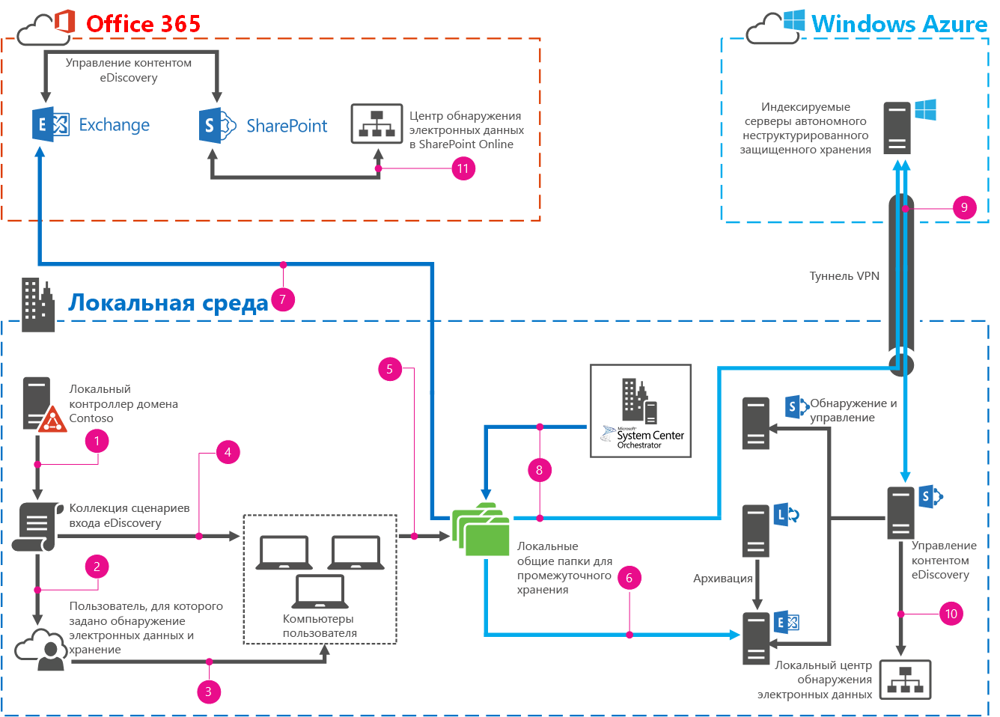

# <a name="automate-file-collection-for-ediscovery"></a>Автоматизация сбора файлов для обнаружения электронных данных

 **Сводка.** Узнайте, как автоматизировать сбор файлов с компьютеров пользователей для обнаружения электронных данных.
  
Ни одна компания не застрахована от судебных исков. Несмотря на то что юридические отделы стараются снизить этот риск, судебные разбирательства  неизбежная реальность бизнеса. Когда против компании начинается судебное разбирательство, она обязана предоставить суду и адвокату противной стороны все необходимые документы. 
  
Обнаружение электронных данных  это процесс, который компании используют для инвентаризации, поиска, идентификации, сохранения, фильтрации и предоставления необходимых электронных документов. В SharePoint 2013, Exchange Server 2013, Lync Server 2013, SharePoint Online и Exchange Online можно хранить большое количество документов. В зависимости от версии эти продукты могут поддерживать eDiscovery и хранение на месте (Lync через Exchange Server), что позволяет юридическим отделам легко индексировать, идентифицировать, хранить и фильтровать материалы по тому или иному делу.
  
Многие документы хранятся на локальных компьютерах пользователей (хранителей), а не в одной папке. В этом случае поиск данных в SharePoint 2013 практически невозможен. Следовательно, их невозможно включить в eDiscovery. В этом решении показано, как использовать сценарии входа, System Center Orchestrator 2012 R2 и Windows PowerShell, чтобы автоматизировать идентификацию и сбор документов с компьютеров пользователей в Exchange Server.
  
## <a name="what-this-solution-does"></a>Принцип работы решения

В этом решении используются глобальная группа безопасности, групповая политика и сценарий Windows PowerShell для поиска содержимого и PST-файлов Outlook на локальных компьютерах пользователей, их инвентаризации и сбора в скрытую общую папку. Оттуда PST-файлы можно импортировать в Exchange Server 2013 или Exchange Online. После этого все файлы перемещаются с помощью модуля Runbook System Center Orchestrator 2012 R2 в другую общую папку в Microsoft Azure для долгосрочного хранения и индексации с помощью SharePoint 2013. Затем вы можете использовать центры eDiscovery в локальном развертывании SharePoint 2013 или SharePoint Online, как при обычном поиске eDiscovery. 
  
> [!IMPORTANT]
> В этом решении файлы копируются с компьютеров хранителей в одну общую папку с помощью операции Robocopy. Операция Robocopy не копирует открытые или заблокированные файлы, поэтому все открытые файлы, в том числе PST-файлы, не будут собраны. Их потребуется собрать вручную. В этом решении не создается список файлов, которые не удалось скопировать, с полными путями к каждому файлу. 
  
На следующей схеме подробно рассмотрены все этапы и элементы решения.
  

  
|****Условные обозначения****||
|:-----|:-----|
||Создайте объект групповой политики (GPO) и свяжите его со сценарием входа для сбора данных.  <br/> |
|| Настройте фильтр безопасности GPO, чтобы применять объект групповой политики только к группе Custodians. <br/> |
||Хранитель входит в систему, после чего запускается GPO, вызывая сценарий входа для сбора данных.  <br/> |
||Сценарий входа для сбора данных проводит инвентаризацию всех локально подключенных дисков на компьютере хранителя, ищет нужные файлы и записывает их расположение.  <br/> |
||Сценарий входа для сбора данных копирует файлы, инвентаризация которых проведена, в скрытый файловый ресурс на промежуточном сервере.  <br/> |
|| (Вариант А) Вручную запустите сценарий импорта PST-файлов, чтобы импортировать собранные PST-файлы в Exchange Server 2013. <br/> |
||(Вариант Б) С помощью средства и процесса импорта Office 365 импортируйте собранные PST-файлы в Exchange Online.  <br/> |
||Переместите все собранные файлы в общую папку Azure для долгосрочного хранения с помощью модуля Runbook MoveToColdStorageSystem Center Orchestrator 2012 R2. <br/> |
||Индексируйте файлы в файловом ресурсе "холодного" хранилища с помощью SharePoint 2013.  <br/> |
||Выполните eDiscovery для контента в "холодном" хранилище и на локальном сервере Exchange Server 2013.  <br/> |
||Выполните eDiscovery для контента в Office 365.  <br/> |
   
## <a name="prerequisites"></a>Предварительные условия

Для настройки этого решения требуется ряд элементов, большинство из которых должны быть установлены и настроены, если вы планируете использовать eDiscovery. Мы предоставим вам ссылки на элементы, которые отсутствуют или требуют специальной настройки, чтобы вы смогли создать базовую конфигурацию. Базовая конфигурация должна быть готова до настройки самого решения.
  
### <a name="base-configuration"></a>Базовая настройка

|**Элемент**|**Ссылка**|
|:-----|:-----|
|Домен Доменные службы Active Directory  <br/> ||
|Подключение к Интернету из локальной сети  <br/> ||
|SQL Server 2012 для поддержки SharePoint 2013 и System Center Orchestrator 2012 R2  <br/> |[Развертывание System Center Orchestrator 2012](https://go.microsoft.com/fwlink/p/?LinkId=613503) <br/> |
| SharePoint 2013 в локальной среде или на основе Azure для eDiscovery (необходимо для варианта А) <br/> ||
|Локальный серверный файловый ресурс для промежуточного хранения  <br/> ||
|Локальный Exchange Server 2013 для импорта PST-файлов при использовании варианта А  <br/> |Накопительный пакет обновления 5 (15.913.22) доступен на [этой странице](https://go.microsoft.com/fwlink/p/?LinkId=613426).  <br/> |
|System Center Orchestrator 2012 R2  <br/> |[Развертывание System Center Orchestrator 2012](https://go.microsoft.com/fwlink/p/?LinkId=613503) <br/> |
|Office 365 (план E3) с Exchange Online и SharePoint Online (необходимо для варианта Б)  <br/> |Чтобы подписаться на Office 365 E3, посетите страницу [подписки на Office 365 E3](https://go.microsoft.com/fwlink/p/?LinkId=613504).  <br/> |
|Подписка на Azure с виртуальной машиной  <br/> |Сведения о подписке на Azure см. на странице [подписки на Microsoft Azure](https://go.microsoft.com/fwlink/p/?LinkId=512010). <br/> |
|VPN-подключение между локальной сетью и подпиской Azure  <br/> |Сведения о настройке туннеля VPN между службой Azure, предоставляемой по подписке, и локальной сетью см. в статье [Подключение локальной сети к виртуальной сети Microsoft Azure](https://go.microsoft.com/fwlink/p/?LinkId=613507).  <br/> |
|SharePoint 2013eDiscovery, настроенное на поиск в SharePoint и Exchange Server 2013, а также (необязательно) Lync Server 2013  <br/> |Сведения о том, как настроить обнаружение электронных данных таким образом, см. в статье [Настройка обнаружения электронных данных в SharePoint Server 2013](https://go.microsoft.com/fwlink/p/?LinkId=613508) и[руководстве по настройке обнаружения электронных данных для лаборатории тестирования общих папок Exchange, Lync, SharePoint и Windows](https://go.microsoft.com/fwlink/p/?LinkId=393130).    <br/> |
|eDiscovery в Office 365 для SharePoint Online и Exchange Online  <br/> |Сведения о том, как настроить обнаружение электронных данных в Office 365, см. в статье [Настройка центра обнаружения электронных данных в SharePoint Online](https://go.microsoft.com/fwlink/p/?LinkId=613628).  <br/> |
   
## <a name="configure-the-environment"></a>Настройка среды

Теперь, когда базовая конфигурация готова, вы можете перейти к настройке самого решения. 
  
### <a name="staging-file-share"></a>Подготовка общей папки для промежуточного хранения

1. Создайте на локальном домене глобальную группу безопасности Custodians.
    
2. Создайте скрытую общую папку для файлов, собираемых с компьютеров хранителей. Она должна находиться на локальном сервере. Например, на сервере Staging создайте общую папку Cases$. Символ **$** необходим для того, чтобы сделать эту папку скрытой.
    
3. Задайте следующие разрешения для общей папки:
    
  - Хранители: "Изменение", "Чтение"
    
  - Администраторы: полный доступ
    
  - Доверенная подсистема Exchange: "Изменение", "Чтение"
    
4. Откройте вкладку **Безопасность**, добавьте группу Custodians и нажмите кнопку **Дополнительно**. Для группы Custodians задайте следующие разрешения:
    
  - **Тип: Deny**
    
  - **Применимо к: "Для этой папки, ее подпапок и файлов"**
    
5. Нажмите **Дополнительные разрешения** и выберите следующее:
    
  - **Чтение атрибутов**;
    
  - **Чтение дополнительных атрибутов**;
    
  - **Чтение разрешений**.
    
6. Проверьте доступ к общей папке Cases$. Для этого сделайте следующее:
    
1. Добавьте пользователя в группу Custodians.
    
2. Поместите файл в папку Cases$.
    
3. От имени пользователя перейдите к промежуточному серверу, например к общей папке \\\\Staging, чтобы проверить, какие папки доступны. Папки **Cases$** не должно быть в списке.
    
4. Вручную введите полный путь к общей папке Cases$ в проводнике. Должна открыться общая папка Cases$.
    
5. Попробуйте открыть файл, который вы ранее разместили в общей папке. Должна возникнуть ошибка.
    
### <a name="logon-script"></a>Сценарий входа

1. Скопируйте и вставьте этот сценарий Windows PowerShell в Блокнот:
    
  ```
  # Automated file collection script
# Substantial error processing should be added for robust execution and troubleshooting opportunities
# All commented out write-hosts are for debugging only and are commented out for regular execution

# Functions 

Function CreateCaseFolder() {

#Check to see if case folder already exists
$CaseFolderCheck = Test-Path $CaseLocation

try {

    if (!$CaseFolderCheck) {
    # Case folder doesn't exist.  Create the case folder and the log file location
    # Write-Host -ForegroundColor Cyan "Creating Case Folder $CaseLocation"
    New-Item "$CaseLocation" -ItemType Directory -Force -ErrorAction SilentlyContinue
    # Write-Host -ForegroundColor Cyan "Creating Case Log Folder $CaseLogLocation"
    New-Item "$CaseLogLocation" -ItemType Directory -Force -ErrorAction SilentlyContinue
    # Write-Host -ForegroundColor Cyan "Creating Case PST folder $CasePSTLocation"
    New-Item "$CasePSTLocation" -ItemType Directory -Force -ErrorAction SilentlyContinue

    }
    else {

    # do nothing since the target case folder already exists

    }
}
catch [System.Exception] {

    # To do..
    # to log to an exception or log file
    
    }
}

Function CopyFileToCaseFolder($SourcePath, $TargetPath, $FileName) {
    
    # Check to see if the file already exists
    $TargetFileCheck = Test-Path $TargetPath\$FileName

try {

    if (!$TargetFileCheck) {
    # Copy the file to the case folder
    Write-Host $SourcePath $TargetPath $FileName
    robocopy "$SourcePath" "$TargetPath" "$FileName" /COPY:DATSO /TEE /LOG+:$LoggingFile /R:10 /W:10 | Out-Null

    }
    else {

    # do nothing since file is already in the target case folder

    }
}
catch [System.Exception] {

    # To do..
    # to log to an exception or log file
    
    }
}

# Global variable initializations

# Error log
$Loggederrors=@()

# The array to contain the file types we collect
$FileTypes = @("*.doc","*.docx","*.pst","*.txt")

# We'll set the case number to be a combination of the date and user name
# For example, a case for John Doe on Dec 14, 2014 at 2:38pm would be:
# 201412141438_jdoe
$CaseNo = get-date -Format yyyyMMddHHmm
$CaseNo = $CaseNo + "_" + [Environment]::UserName

# Target location to copy case files
$CaseRootLocation = "\\staging\Cases$" 

# File copy location, log file location, PST file location and temporary log file location
$CaseLocation = $CaseRootLocation + "\" + $CaseNo
$CaseLogLocation = $CaseRootLocation + "\" + $CaseNo + "\_Log"
$CasePSTLocation = $CaseRootLocation + "\" + $CaseNo + "\_PSTs"
$TemporaryLogLocation = [Environment]::getfolderpath('ApplicationData') + "\" + $CaseNo

# Inventory of local drives
$LocalDrives = Get-PSDrive -PSProvider FileSystem -Scope Global

$LoggingFile = "$CaseLogLocation\FileCopyErrors.log"

# Main script

# Create the case folder if it doesn't already exist
CreateCaseFolder

# Create the list of files to be copied
# First create the temporary directory in the AppData\Roaming folder
New-Item "$TemporaryLogLocation" -ItemType Directory -Force -ErrorAction SilentlyContinue
$LocalDrives | foreach {

    # Write-Host -ForeGroundColor Cyan "Collecting Files for Drive: " $_
    Get-ChildItem -Path $_.Root -Recurse -Include $FileTypes -ErrorAction SilentlyContinue -ErrorVariable +Loggederrors | Export-Clixml $TemporaryLogLocation\$_.xml -Force
    # Needs try catch and logged collection error file
}

# Now let's read each file and copy any files we need to the case folder
# We will also copy these XMLs to the case log files folder as we go along
# We only want to process XML files, just in case something else got in there as the script ran
$CaseDriveFiles = Get-ChildItem $TemporaryLogLocation -Filter '*.xml'
$CaseDriveFiles | foreach {
    # Copy the XML file to the case log location
    CopyFileToCaseFolder $_.Directory.FullName $CaseLogLocation $_.Name
    $DriveFile = $_.FullName
    # Write-Host -ForegroundColor Cyan "Copying Files specified in the XML file: $DriveFile"
    $CurrentDriveFile = Import-Clixml $DriveFile
    $CurrentDriveFile | foreach {
        # write-host $_.FullName
        # if it's a PST, add to the PSTs folder. otherwise add it to case folder
        if ($_.Extension -match '.PST')
        {
            CopyFileToCaseFolder $_.Directory.FullName $CasePSTLocation $_.Name
            write-host "this is a PST"
        }
        else
        {
            CopyFileToCaseFolder $_.Directory.FullName $CaseLocation $_.Name
        }
    }
}

# Now delete the temporary log file
Remove-Item $TemporaryLogLocation -Recurse 

Write-Host -ForegroundColor Cyan "Finished."

  ```

2. Сохраните приведенный выше сценарий как CollectionScript.ps1 в легкодоступном расположении, например C:\\AFCScripts.
    
3. Используя функцию Блокнота "Перейти", при необходимости внесите следующие изменения:
    
|**Номер строки**|**Необходимые изменения**|**Обязательно?**|
|:-----|:-----|:-----|
|71  <br/> |Переменная **$FileTypes**. Включите расширения всех типов файлов, подлежащих инвентаризации и сбору в переменной массива с использованием сценария.<br/> |Необязательный  <br/> |
|76 и 77  <br/> |Измените способ сборки переменной **$CaseNo** в соответствии со своими потребностями. Сценарий записывает текущую дату и время, а также добавляет к переменной имя пользователя.<br/> |Необязательный  <br/> |
|80  <br/> |Переменную **$CaseRootLocation** необходимо настроить для общей папки коллекции промежуточных серверов, например **\\\\Staging\\Cases$**. <br/> |Обязательный  <br/> |
   
4. Поместите файл CollectionScript.ps1 в общую папку Netlogon на контроллере домена. 
    
### <a name="configure-gpo-for-the-logon-script-and-custodians-group"></a>Настройте GPO для сценария входа и группы Custodians

1. Настройте сценарий входа для группы Custodians, следуя инструкциям из раздела "Как назначить сценарии входа пользователей" статьи [Использование сценариев запуска, завершения работы, входа и выхода в групповой политике](https://go.microsoft.com/fwlink/p/?LinkId=614844).
    
2. Удалите пользователей, прошедших проверку подлинности, из раздела **Фильтры безопасности** и добавьте группу Custodians.
    
### <a name="pst-import-option-a-script-for-exchange-server-2013"></a>Вариант А импорта PST-файлов, сценарий для Exchange Server 2013

1.  Скопируйте и вставьте следующий сценарий Windows PowerShell в Блокнот:
    
  ```
  # Script to import all PSTs in a given folder to a target mailbox
#
# This is for on-prem Exchange only
# Input parameters
# When you run the script, you call it with two parameters, PST source path and target mailbox alias
# For example:  .\PSTImport.ps1 \\FileShare\PSTFiles jdoe

param ([String]$SourcePath,[String]$MailboxAlias)

# Folder identifier is the string we want to show in the mailbox that we import the PSTs to

$FolderIdentifier = "zzImportedPSTs_"

# Connect to Exchange remote powershell using the connection Uri below
# This would be the format http://<exchange server FQDN>/Powershell

$ConnectionUri = 'http://h10-exch/PowerShell'
$RemoteEx2013Session = New-PSSession -ConfigurationName Microsoft.Exchange -ConnectionUri $ConnectionUri -Authentication Kerberos
Import-PSSession $RemoteEx2013Session

# Get all the files in the source path

$AllFiles = Get-ChildItem $SourcePath -Recurse

# Go through each file and if it's a PST launch a mailbox import request for it

$AllFiles | ForEach-Object {
    If ($_.Extension -eq ".pst") {
        $ImportName = $MailboxAlias + "_" + $_.Name
        $FolderName = $FolderIdentifier + $_.Name
        New-MailboxImportRequest -Name $ImportName -Mailbox $MailboxAlias -FilePath $_.FullName -TargetRootFolder $FolderName
    }
}
  ```

2. Сохраните сценарий как PSTImportScript.ps1 в расположении, которое вы сможете легко найти. Например, для удобства создайте папку \\\\Staging\\AFCScripts на своем промежуточном сервере и сохраните сценарий в ней.
    
3. Используя функцию Блокнота "Перейти", при необходимости внесите следующие изменения:
    
|**Номер строки**|**Необходимые изменения**|**Обязательно?**|
|:-----|:-----|:-----|
|12  <br/> |**$FolderIdentifier** помечает папки почтовых ящиков, в которые импортируются PST-файлы. При необходимости измените их.<br/> |Необязательный  <br/> |
|17  <br/> |**$ConnectionUri** необходимо настроить на отдельном сервере. <br/> > [!IMPORTANT]> Убедитесь, что **$ConnectionUri** указывает на расположение с префиксом http://, а не https://. Префикс https:// не будет работать.          |Обязательный  <br/> |
   
4. Убедитесь, что у учетной записи "Доверенная подсистема Exchange" есть разрешения на чтение, запись и выполнение в общей папке \\\\Staging\\Cases$.
    
5. У сценария импорта PST-файлов есть два обязательных входных параметра:
    
  - **$SourcePath**  расположение импортируемых PST-файлов, например \\\\Staging\\Cases$.
    
  - **$MailboxAlias**  псевдоним целевого почтового ящика, в который будут импортированы элементы электронной почты.
    
6. Например, если вы хотите импортировать все PST-файлы из пути \\Staging\Cases$ в почтовый ящик с псевдонимом eDiscoveryMailbox, запустите следующий сценарий: `\\staging\AFCscripts\PSTImportScript.ps1 \\Staging\cases$ eDiscoveryMailbox`.
    
### <a name="pst-import-option-b-for-exchange-online"></a>Вариант Б импорта PST-файлов для Exchange Online

-  Создайте структуру почтовых ящиков для размещения импортированных PST-файлов. Дополнительные сведения о том, как создать почтовый ящик пользователя в Exchange Online, см. в статье [Создание почтовых ящиков пользователей в Exchange Online](https://go.microsoft.com/fwlink/p/?LinkId=615118).
    
### <a name="cold-storage"></a>Автономное неструктурированное защищенное хранилище

1. Создайте общую папку в виртуальной машине Azure, в которую будут помещены все собранные файлы, например \\\\AZFile1\\ContentColdStorage.
    
2. Предоставьте стандартной учетной записи для доступа к контенту разрешения по крайней мере на чтение содержимого общей папки, а также всех вложенных папок и файлов. Дополнительные сведения о настройке службы поиска SharePoint 2013 см. в статье [Создание и настройка приложения-службы поиска в SharePoint Server 2013](https://go.microsoft.com/fwlink/p/?LinkId=614940).
    
3. Если планируется импортировать PST-файлы из общей папки \\\\AZFile1\\ContentColdStorage, предоставьте группе "Доверенная подсистема Exchange" разрешения на чтение, запись и выполнение в этой папке.
    
### <a name="orchestrator"></a>Orchestrator

1. Скачайте [MoveToColdStorage Runbook](https://go.microsoft.com/fwlink/?LinkId=616095) в Центре загрузки Майкрософт.
    
2. Откройте **Runbook Designer** и в области **Подключения** выберите папку, в которую нужно импортировать модуль Runbook. В меню **Действия** выберите пункт **Импортировать**. Откроется диалоговое окно **Импорт**.
    
3. В поле **Расположение файла** введите путь и имя файла модуля Runbook, который вы хотите импортировать, или щелкните многоточие ( **...**), чтобы найти необходимый файл. 
    
4. Последовательно выберите пункты **Импорт модулей Runbook** и **Импорт данных, зашифрованных в Orchestrator**. Очистите значения в полях **Счетчики**, **Расписания**, **Переменные**, **Группы компьютеров**, **Импортировать глобальные конфигурации** и **Перезаписать существующие глобальные конфигурации**.
    
5. Нажмите кнопку **Готово**.
    
6. Внесите в модуль Runbook **MoveFilesToColdStorage** следующие изменения.
    
1. Действие **Перемещение файла**: задайте в качестве значения параметра **Исходный файл** общую папку для сбора данных, например \\\\Staging\\cases$. Задайте в качестве значения параметра **Конечная папка** общую папку в защищенном хранилище в Azure, например \\\\AZFile1\\ContentColdStorage. Выберите пункт **Создать файл с уникальным именем**.
    
2. Действие **Удаление папки**: задайте в качестве значения параметра **Путь:** общую папку для сбора данных, например \\\\Staging\\cases$\\* и выберите пункт **Удалить все файлы и вложенные папки**. 
    
7. Разверните модуль Runbook **MoveToColdStorage**. Для этого выполните действия, перечисленные в статье[Развертывание модулей Runbook](https://go.microsoft.com/fwlink/p/?LinkId=615120).
    
### <a name="sharepoint-on-premises-search-for-cold-storage"></a>Локальный поиск защищенного хранилища в SharePoint

1. Создайте новый источник контента на своей ферме SharePoint 2013 для общей папки в автономном неструктурированном защищенном хранилище Azure, например \\\\AZFile1\\ContentColdStorage. Дополнительные сведения об управлении источниками контента см. в статье [Добавление, изменение и удаление источника контента в SharePoint Server 2013](https://go.microsoft.com/fwlink/p/?LinkId=615004).
    
2. Запустите полный обход контента. Дополнительные сведения см. в статье [Запуск, приостановка, возобновление и остановка обхода контента в SharePoint Server 2013](https://go.microsoft.com/fwlink/p/?LinkId=615005).
    
## <a name="using-the-solution"></a>Использование решения

Это решение используется в пять основных этапов, если PST-файлы не нужно импортировать как в Exchange Server 2013, так и в Exchange Online. В этом разделе описаны действия для всех этих этапов. При работе с решением вашими основными задачами будут следующие:
  
1. Управление членством в группе Custodians.
    
2. Ошибки
    
3. Управление процессом импорта PST-файлов.
    
4. Перемещение файлов коллекции в защищенное хранилище.
    
Все остальные действия используются не только для этого решения. Это стандартные административные задачи, выполняемые с помощью SharePoint 2013, Office 365 и Azure. Ниже перечислены элементы, которые это решение не поддерживает. Вам потребуется принять меры в их отношении, исходя из потребностей компании.
  
1. Отслеживание дел eDiscovery и связанных с ними хранителей.
    
2. Отслеживание связей наборов коллекций файлов и дел eDiscovery.
    
3. Согласование времени выполнения этапов импорта и перемещения в защищенное хранилище.
    
4. Управление размером файлов, используемых в службе Azure.
    
5. Управление почтовыми ящиками, в которые импортируются PST-файлы.
    
6. Резервное копирование и восстановление всех локальных данных.
    
### <a name="custodian-management"></a>Управление хранителями

- Чтобы начать процесс автоматического сбора файлов для отдельных пользователей, добавьте их в группу Custodians. При следующем входе пользователя в систему будет выполняться сценарий входа, назначенный группе Custodians с помощью групповой политики. 
    
### <a name="monitor-collected-files-and-review-log-files"></a>Отслеживание сбора файлов и просмотр файлов журнала

1. Откройте общую папку для сбора данных, например \\\\Staging\\cases$\\*, и найдите в ней папку пользователя. Имя папки будет иметь следующий формат:  *ггггММддЧЧмм_ИмяПользователя*  .
    
2. По завершении сбора данных откройте эту папку и перейдите в папку _Log. В папке _Log вы обнаружите следующее:
    
  - Один XML-файл для каждого локального диска на компьютере пользователя, например **A.xml**, **C.xml**. Эти файлы содержат инвентаризированные диски, на основе которых они получили свои имена. Файлы используются для операции Robocopy.
    
    > [!NOTE]
    > Сценарий сбора данных только создаст запись в файле инвентаризации для типов файлов, определенных в самом сценарии. Он не будет создавать запись инвентаризации для каждого файла на компьютере пользователя. 
  
  - Один файл журнала с именем FileCopyErrors.log для каждого цикла сбора данных. Этот файл содержит список файлов, которые операции Robocopy не удалось скопировать в общую папку для сбора данных, например \\\\Staging\\cases$\\*. Вам потребуется просмотреть этот список и решить, какие действия предпринять в отношении пропущенных файлов. Как правило, вам нужно будет собрать их вручную (если они необходимы) или исключить их из операции сбора данных, если вы решите, что эти файлы вам не нужны.
    
### <a name="pst-import-option-a-for-exchange-server-2013"></a>Вариант А импорта PST-файлов для Exchange Server 2013

1. Войдите на сервер, на котором размещена общая папка для сбора данных, например **сервер для промежуточного хранения**, и откройте Windows PowerShell. Дополнительные сведения о запуске Windows PowerShell см. в статье[Запуск Windows PowerShell в Windows Server](https://go.microsoft.com/fwlink/p/?LinkId=615115).
    
2. Установите отсутствие ограничений для политики выполнения. Введите  `Set-ExecutionPolicy Unrestricted -Scope Process` в Windows PowerShell и нажмите клавишу ВВОД.
    
3. Запустите файл PSTImportScript.ps1, указав параметры **$SourcePath** и **$MailboxAlias**. Дополнительные сведения о запуске сценариев Windows PowerShell см. в статье[Поддержка скриптов](https://go.microsoft.com/fwlink/p/?LinkID=615117).
    
4. Проверьте выходные данные на наличие ошибок.
    
5. Прежде чем импортировать PST-файл с таким же именем в тот же почтовый ящик, необходимо удалить запрос на импорт почтового ящика. Для этого выполните следующую команду:  `Get-MailboxImportRequest | Remove-MailboxImportRequest`. Вам будет предложено удалить каждый запрос из очереди по отдельности. Выполните необходимые действия.
    
### <a name="pst-import-option-b-for-exchange-online"></a>Вариант Б импорта PST-файлов для Exchange Online

- Чтобы перенести собранные PST-файлы в Exchange Online, следуйте указаниям из раздела "Импорт файлов в Office 365" статьи [Служба импорта Office 365](https://go.microsoft.com/fwlink/p/?LinkId=614938).
    
### <a name="move-to-cold-storage"></a>Перемещение в защищенное хранилище

1. Запустите модуль Runbook **MoveToColdStorage**. Для этого выполните действия, перечисленные в статье[Запуск модулей Runbook](https://go.microsoft.com/fwlink/p/?LinkId=615123).
    
2. Просмотрите общую папку Azure, используемую для долгосрочного хранения, например \\\\AZFile1\\ContentColdStorage, а также локальную общую папку для сбора данных, например \\\\Staging\\cases$. Файлы и папки должны появиться в общей папке в защищенном хранилище и исчезнуть из общей папки для сбора данных.
    
### <a name="ediscovery"></a>Обнаружение электронных данных

1. Разрешите полный обход контента для общей папки в автономном неструктурированном защищенном хранилище, чтобы запускать его по расписанию, либо инициируйте обход контента. Дополнительные сведения о запуске полного или добавочного обхода контента см. в статье [Запуск, приостановка, возобновление и остановка обхода контента в SharePoint Server 2013](https://go.microsoft.com/fwlink/p/?LinkId=615005).
    
2. Создайте обращение к функции "eDiscovery" в SharePoint 2013, если вы использовали вариант А для импорта PST-файлов, или обращение к функции "eDiscovery" в SharePoint Online, если использовался вариант Б.
    

