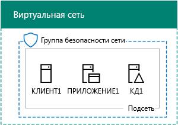
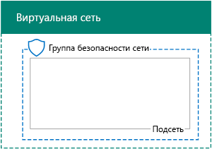
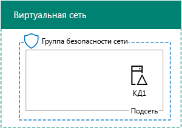
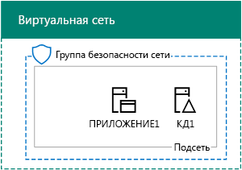

# <a name="base-configuration-devtest-environment"></a><span data-ttu-id="36d51-103">Базовая конфигурация среды разработки и тестирования</span><span class="sxs-lookup"><span data-stu-id="36d51-103">Base Configuration dev/test environment</span></span>

 <span data-ttu-id="36d51-104">**Сводка.** Создание упрощенной интрасети в качестве среды разработки и тестирования в Microsoft Azure.</span><span class="sxs-lookup"><span data-stu-id="36d51-104">**Summary:** Create a simplified intranet as a dev/test environment in Microsoft Azure.</span></span>
  
<span data-ttu-id="36d51-105">В этой статье представлено пошаговое руководство по созданию среды разработки и тестирования с базовой конфигурацией в Azure.</span><span class="sxs-lookup"><span data-stu-id="36d51-105">This article provides you with step-by-step instructions to create the following Base Configuration dev/test environment in Azure:</span></span>
  
<span data-ttu-id="36d51-106">**Рис. 1. Базовая конфигурация среды разработки и тестирования**</span><span class="sxs-lookup"><span data-stu-id="36d51-106">**Figure 1: The Base Configuration dev/test environment**</span></span>


  
<span data-ttu-id="36d51-p101">Среда разработки и тестирования с базовой конфигурацией, представленная на рис. 1, состоит из корпоративной подсети в облачной виртуальной сети Azure под названием TestLab. Последняя является симуляцией упрощенной частной интрасети, подключенной к Интернету. Она содержит три виртуальные машины Azure под управлением Windows Server 2016.</span><span class="sxs-lookup"><span data-stu-id="36d51-p101">The Base Configuration dev/test environment in Figure 1 consists of the Corpnet subnet in a cloud-only Azure virtual network named TestLab that simulates a simplified, private intranet connected to the Internet. It contains three Azure virtual machines running WIndows Server 2016:</span></span>
  
- <span data-ttu-id="36d51-110">Виртуальная машина DC1 настроена в качестве контроллера домена интрасети и сервера доменных имен (DNS).</span><span class="sxs-lookup"><span data-stu-id="36d51-110">DC1 is configured as an intranet domain controller and Domain Name System (DNS) server</span></span>
    
- <span data-ttu-id="36d51-111">APP1 настроена в качестве общего сервера приложений и веб-сервера.</span><span class="sxs-lookup"><span data-stu-id="36d51-111">APP1 is configured as a general application and web server</span></span>
    
- <span data-ttu-id="36d51-112">CLIENT1 действует как клиент интрасети.</span><span class="sxs-lookup"><span data-stu-id="36d51-112">CLIENT1 acts as an intranet client</span></span>
    
<span data-ttu-id="36d51-113">Вот что обеспечивает такая конфигурация для виртуальных машин DC1, APP1, CLIENT1 и дополнительных компьютеров корпоративной подсети:</span><span class="sxs-lookup"><span data-stu-id="36d51-113">This configuration allows DC1, APP1, CLIENT1, and additional Corpnet subnet computers to be:</span></span> 
  
- <span data-ttu-id="36d51-114">подключение к Интернету для установки обновлений, доступа к интернет-ресурсам в реальном времени и работы с общедоступными облачными технологиями, такими как Microsoft Office 365 и другие службы Azure;</span><span class="sxs-lookup"><span data-stu-id="36d51-114">Connected to the Internet to install updates, access Internet resources in real time, and participate in public cloud technologies such as Microsoft Office 365 and other Azure services.</span></span>
    
- <span data-ttu-id="36d51-115">управление при помощи подключения к удаленному рабочему столу с компьютера, соединенного с Интернетом или сетью организации.</span><span class="sxs-lookup"><span data-stu-id="36d51-115">Remotely managed using Remote Desktop connections from your computer that is connected to the Internet or your organization network.</span></span>
    
<span data-ttu-id="36d51-116">Цели использования получившейся тестовой среды:</span><span class="sxs-lookup"><span data-stu-id="36d51-116">You can use the resulting test environment:</span></span>
  
- <span data-ttu-id="36d51-117">разработка и тестирование приложений;</span><span class="sxs-lookup"><span data-stu-id="36d51-117">For application development and testing.</span></span>
    
- <span data-ttu-id="36d51-118">применение в качестве исходной конфигурации для собственной расширенной тестовой среды, в которую входят дополнительные виртуальные машины, службы Azure или другие облачные решения Майкрософт, такие как Office 365 и "Enterprise Security + Mobility" (EMS).</span><span class="sxs-lookup"><span data-stu-id="36d51-118">As the initial configuration of an extended test environment of your own design that includes additional virtual machines, Azure services, or other Microsoft cloud offerings such as Office 365 and Enterprise Security + Mobility (EMS).</span></span>
    
<span data-ttu-id="36d51-119">Существует четыре этапа настройки тестовой среды с базовой конфигурацией в Azure:</span><span class="sxs-lookup"><span data-stu-id="36d51-119">There are four phases to setting up the Base Configuration test environment in Azure:</span></span>
  
1. <span data-ttu-id="36d51-120">создание виртуальной сети;</span><span class="sxs-lookup"><span data-stu-id="36d51-120">Create the virtual network.</span></span>
    
2. <span data-ttu-id="36d51-121">настройка DC1;</span><span class="sxs-lookup"><span data-stu-id="36d51-121">Configure DC1.</span></span>
    
3. <span data-ttu-id="36d51-122">настройка APP1;</span><span class="sxs-lookup"><span data-stu-id="36d51-122">Configure APP1.</span></span>
    
4. <span data-ttu-id="36d51-123">настройка CLIENT1.</span><span class="sxs-lookup"><span data-stu-id="36d51-123">Configure CLIENT1.</span></span>
    
<span data-ttu-id="36d51-p102">Если у вас еще нет подписки на Azure, вы можете [оформить бесплатную пробную подписку](https://azure.microsoft.com/pricing/free-trial/). Если у вас есть подписка на MSDN или Visual Studio, см. статью [Ежемесячная сумма денег на счете в Azure для подписчиков Visual Studio](https://azure.microsoft.com/pricing/member-offers/msdn-benefits-details/).</span><span class="sxs-lookup"><span data-stu-id="36d51-p102">If you do not already have an Azure subscription, you can sign up for a free trial at [Try Azure](https://azure.microsoft.com/pricing/free-trial/). If you have an MSDN or Visual Studio subscription, see [Monthly Azure credit for Visual Studio subscribers](https://azure.microsoft.com/pricing/member-offers/msdn-benefits-details/).</span></span>
  
> [!NOTE]
> <span data-ttu-id="36d51-p103">За использование виртуальных машин Azure взимается повременная плата. Счет будет выставляться по вашей бесплатной пробной версии, подписке MSDN или платной подписке. Дополнительные сведения о стоимости использования виртуальных машин Azure см. в статьях [Цены на виртуальные машины](https://azure.microsoft.com/pricing/details/virtual-machines/) и [Калькулятор цен Azure](https://azure.microsoft.com/pricing/calculator/). Сведения о минимизации расходов см. в разделе [Минимизация расходов на виртуальные машины в тестовой среде в Azure](base-configuration-dev-test-environment.md#mincost).</span><span class="sxs-lookup"><span data-stu-id="36d51-p103">Virtual machines in Azure incur an ongoing monetary cost when they are running. This cost is billed against your free trial, MSDN subscription, or paid subscription. For more information about the costs of running Azure virtual machines, see [Virtual Machines Pricing Details](https://azure.microsoft.com/pricing/details/virtual-machines/) and [Azure Pricing Calculator](https://azure.microsoft.com/pricing/calculator/). To keep costs down, see [Minimizing the costs of test environment virtual machines in Azure](base-configuration-dev-test-environment.md#mincost).</span></span> 
  

  
> [!TIP]
> <span data-ttu-id="36d51-131">Щелкните [здесь](http://aka.ms/catlgstack), чтобы просмотреть схему всех статей, относящихся к руководствам по лаборатории тестирования в One Microsoft Cloud.</span><span class="sxs-lookup"><span data-stu-id="36d51-131">Click [here](http://aka.ms/catlgstack) for a visual map to all the articles in the One Microsoft Cloud Test Lab Guide stack.</span></span>
  
## <a name="phase-1-create-the-virtual-network"></a><span data-ttu-id="36d51-132">Этап 1. Создание виртуальной сети</span><span class="sxs-lookup"><span data-stu-id="36d51-132">Phase 1: Create the virtual network</span></span>

<span data-ttu-id="36d51-133">Сначала запустите командную строку Azure PowerShell.</span><span class="sxs-lookup"><span data-stu-id="36d51-133">First, start an Azure PowerShell prompt.</span></span>
  
> [!NOTE]
> <span data-ttu-id="36d51-p104">Для указанных ниже последовательностей команд используется последняя версия Azure PowerShell. См. статью [Начало работы с командлетами Azure PowerShell](https://docs.microsoft.com/ru-RU/powershell/azureps-cmdlets-docs/).</span><span class="sxs-lookup"><span data-stu-id="36d51-p104">The following command sets use the latest version of Azure PowerShell. See [Get started with Azure PowerShell cmdlets](https://docs.microsoft.com/ru-RU/powershell/azureps-cmdlets-docs/).</span></span> 
  
<span data-ttu-id="36d51-136">Войдите в свою учетную запись Azure с помощью указанной ниже команды.</span><span class="sxs-lookup"><span data-stu-id="36d51-136">Sign in to your Azure account with the following command.</span></span>
  
```
Login-AzureRMAccount
```

> [!TIP]
> <span data-ttu-id="36d51-137">Скачать текстовый файл, который содержит все команды PowerShell, приведенные в этой статье, можно [здесь](https://gallery.technet.microsoft.com/PowerShell-commands-for-ba957d3d).</span><span class="sxs-lookup"><span data-stu-id="36d51-137">Click [here](https://gallery.technet.microsoft.com/PowerShell-commands-for-ba957d3d) to get a text file that contains all the PowerShell commands in this article.</span></span>
  
<span data-ttu-id="36d51-138">Получите имя подписки с помощью приведенной ниже команды.</span><span class="sxs-lookup"><span data-stu-id="36d51-138">Get your subscription name using the following command.</span></span>
  
```
Get-AzureRMSubscription | Sort Name | Select Name
```

<span data-ttu-id="36d51-p105">Укажите свою подписку Azure. Замените текст в кавычках, в том числе символы < и >, на правильное имя.</span><span class="sxs-lookup"><span data-stu-id="36d51-p105">Set your Azure subscription. Replace everything within the quotes, including the < and > characters, with the correct name.</span></span>
  
```
$subscr="<subscription name>"
Get-AzureRmSubscription -SubscriptionName $subscr | Select-AzureRmSubscription
```

<span data-ttu-id="36d51-p106">Затем создайте группу ресурсов для лаборатории тестирования с базовой конфигурацией. Чтобы определить уникальное имя группы ресурсов, используйте указанную ниже команду для вывода списка имеющихся групп ресурсов.</span><span class="sxs-lookup"><span data-stu-id="36d51-p106">Next, create a new resource group for your Base Configuration test lab. To determine a unique resource group name, use this command to list your existing resource groups.</span></span>
  
```
Get-AzureRMResourceGroup | Sort ResourceGroupName | Select ResourceGroupName
```

<span data-ttu-id="36d51-p107">Создайте группу ресурсов с помощью приведенных ниже команд. Замените все символы в кавычках (в том числе символы < и >) на правильные имена.</span><span class="sxs-lookup"><span data-stu-id="36d51-p107">Create your new resource group with these commands. Replace everything within the quotes, including the < and > characters, with the correct names.</span></span>
  
```
$rgName="<resource group name>"
$locName="<location name, such as West US>"
New-AzureRMResourceGroup -Name $rgName -Location $locName
```

<span data-ttu-id="36d51-145">Затем создайте виртуальную сеть TestLab, в которой будет размещена корпоративная подсеть базовой конфигурации, и защитите ее с помощью группы безопасности сети.</span><span class="sxs-lookup"><span data-stu-id="36d51-145">Next, you create the TestLab virtual network that will host the Corpnet subnet of the base configuration and protect it with a network security group.</span></span>
  
```
$rgName="<name of your new resource group>"
$locName=(Get-AzureRmResourceGroup -Name $rgName).Location
$corpnetSubnet=New-AzureRMVirtualNetworkSubnetConfig -Name Corpnet -AddressPrefix 10.0.0.0/24
New-AzureRMVirtualNetwork -Name TestLab -ResourceGroupName $rgName -Location $locName -AddressPrefix 10.0.0.0/8 -Subnet $corpnetSubnet -DNSServer 10.0.0.4
$rule1=New-AzureRMNetworkSecurityRuleConfig -Name "RDPTraffic" -Description "Allow RDP to all VMs on the subnet" -Access Allow -Protocol Tcp -Direction Inbound -Priority 100 -SourceAddressPrefix Internet -SourcePortRange * -DestinationAddressPrefix * -DestinationPortRange 3389
New-AzureRMNetworkSecurityGroup -Name Corpnet -ResourceGroupName $rgName -Location $locName -SecurityRules $rule1
$vnet=Get-AzureRMVirtualNetwork -ResourceGroupName $rgName -Name TestLab
$nsg=Get-AzureRMNetworkSecurityGroup -Name Corpnet -ResourceGroupName $rgName
Set-AzureRMVirtualNetworkSubnetConfig -VirtualNetwork $vnet -Name Corpnet -AddressPrefix "10.0.0.0/24" -NetworkSecurityGroup $nsg
```

<span data-ttu-id="36d51-146">Это ваша текущая конфигурация.</span><span class="sxs-lookup"><span data-stu-id="36d51-146">This is your current configuration.</span></span>
  

  
## <a name="phase-2-configure-dc1"></a><span data-ttu-id="36d51-148">Этап 2. Настройка DC1</span><span class="sxs-lookup"><span data-stu-id="36d51-148">Phase 2: Configure DC1</span></span>

<span data-ttu-id="36d51-149">На этом этапе мы создадим виртуальную машину DC1 и настроим ее как контроллер для домена Windows Server Active Directory corp.contoso.com и DNS-сервер для виртуальных машин сети TestLab.</span><span class="sxs-lookup"><span data-stu-id="36d51-149">In this phase, we create the DC1 virtual machine and configure it as a domain controller for the corp.contoso.com Windows Server Active Directory (AD) domain and a DNS server for the virtual machines of the TestLab virtual network.</span></span>
  
<span data-ttu-id="36d51-150">Чтобы создать виртуальную машину Azure для DC1, сначала укажите имя группы ресурсов, а затем выполните приведенные ниже команды в командной строке Azure PowerShell на локальном компьютере.</span><span class="sxs-lookup"><span data-stu-id="36d51-150">To create an Azure virtual machine for DC1, fill in the name of your resource group and run these commands at the Azure PowerShell command prompt on your local computer.</span></span>
  
```
$rgName="<resource group name>"
$locName=(Get-AzureRmResourceGroup -Name $rgName).Location
$vnet=Get-AzureRMVirtualNetwork -Name TestLab -ResourceGroupName $rgName
$pip=New-AzureRMPublicIpAddress -Name DC1-PIP -ResourceGroupName $rgName -Location $locName -AllocationMethod Dynamic
$nic=New-AzureRMNetworkInterface -Name DC1-NIC -ResourceGroupName $rgName -Location $locName -SubnetId $vnet.Subnets[0].Id -PublicIpAddressId $pip.Id -PrivateIpAddress 10.0.0.4
$vm=New-AzureRMVMConfig -VMName DC1 -VMSize Standard_A1
$cred=Get-Credential -Message "Type the name and password of the local administrator account for DC1."
$vm=Set-AzureRMVMOperatingSystem -VM $vm -Windows -ComputerName DC1 -Credential $cred -ProvisionVMAgent -EnableAutoUpdate
$vm=Set-AzureRMVMSourceImage -VM $vm -PublisherName MicrosoftWindowsServer -Offer WindowsServer -Skus 2016-Datacenter -Version "latest"
$vm=Add-AzureRMVMNetworkInterface -VM $vm -Id $nic.Id
$vm=Set-AzureRmVMOSDisk -VM $vm -Name "DC1-OS" -DiskSizeInGB 128 -CreateOption FromImage -StorageAccountType StandardLRS
$diskConfig=New-AzureRmDiskConfig -AccountType StandardLRS -Location $locName -CreateOption Empty -DiskSizeGB 20
$dataDisk1=New-AzureRmDisk -DiskName "DC1-DataDisk1" -Disk $diskConfig -ResourceGroupName $rgName
$vm=Add-AzureRmVMDataDisk -VM $vm -Name "DC1-DataDisk1" -CreateOption Attach -ManagedDiskId $dataDisk1.Id -Lun 1
New-AzureRMVM -ResourceGroupName $rgName -Location $locName -VM $vm
```

<span data-ttu-id="36d51-p108">Вам будет предложено ввести имя пользователя и пароль учетной записи локального администратора на DC1. Задайте надежный пароль и запишите его вместе с именем пользователя в безопасном месте.</span><span class="sxs-lookup"><span data-stu-id="36d51-p108">You will be prompted for a user name and password for the local administrator account on DC1. Use a strong password and record both the name and password in a secure location.</span></span>
  
<span data-ttu-id="36d51-153">После этого подключитесь к виртуальной машине DC1.</span><span class="sxs-lookup"><span data-stu-id="36d51-153">Next, connect to the DC1 virtual machine.</span></span>
  
### <a name="connect-to-dc1-using-local-administrator-account-credentials"></a><span data-ttu-id="36d51-154">Подключение к DC1 с помощью учетных данных учетной записи локального администратора</span><span class="sxs-lookup"><span data-stu-id="36d51-154">Connect to DC1 using local administrator account credentials</span></span>

1. <span data-ttu-id="36d51-155">На [портале Azure](https://portal.azure.com) выберите **Группы ресурсов >** [имя новой группы ресурсов] **> DC1 > Подключить**.</span><span class="sxs-lookup"><span data-stu-id="36d51-155">In the [Azure portal](https://portal.azure.com), click **Resource Groups >** [the name of your new resource group] **> DC1 > Connect**.</span></span>
    
2. <span data-ttu-id="36d51-p109">В открытой области выберите элемент **Скачать RDP-файл**. Откройте скачанный файл DC1.rdp и нажмите **Подключить**.</span><span class="sxs-lookup"><span data-stu-id="36d51-p109">In the open pane, click **Download RDP file**. Open the DC1.rdp file that is downloaded, and then click **Connect**.</span></span>
    
3. <span data-ttu-id="36d51-158">Укажите имя учетной записи локального администратора DC1:</span><span class="sxs-lookup"><span data-stu-id="36d51-158">Specify the DC1 local administrator account name:</span></span>
    
  - <span data-ttu-id="36d51-159">Для Windows 7:</span><span class="sxs-lookup"><span data-stu-id="36d51-159">For Windows 7:</span></span>
    
    <span data-ttu-id="36d51-p110">В диалоговом окне **Безопасность Windows** выберите элемент **Использовать другую учетную запись**. В поле **Имя пользователя** введите **DC1\\**[имя локальной учетной записи администратора].</span><span class="sxs-lookup"><span data-stu-id="36d51-p110">In the **Windows Security** dialog box, click **Use another account**. In **User name**, type **DC1\\**[Local administrator account name].</span></span>
    
  - <span data-ttu-id="36d51-162">Для Windows 8 и Windows 10:</span><span class="sxs-lookup"><span data-stu-id="36d51-162">For Windows 8 or Windows 10:</span></span>
    
    <span data-ttu-id="36d51-p111">В диалоговом окне **Безопасность Windows** нажмите **Больше вариантов**, а затем — **Использовать другую учетную запись**. В поле **Имя пользователя** введите **DC1\\**[имя учетной записи локального администратора].</span><span class="sxs-lookup"><span data-stu-id="36d51-p111">In the **Windows Security** dialog box, click **More choices**, and then click **Use a different account**. In **User name**, type **DC1\\**[Local administrator account name].</span></span>
    
4. <span data-ttu-id="36d51-165">В поле **Пароль** укажите пароль к учетной записи локального администратора, а затем нажмите кнопку **ОК**.</span><span class="sxs-lookup"><span data-stu-id="36d51-165">In **Password**, type the password of the local administrator account, and then click **OK**.</span></span>
    
5. <span data-ttu-id="36d51-166">Когда появится соответствующий запрос, нажмите кнопку **Да**.</span><span class="sxs-lookup"><span data-stu-id="36d51-166">When prompted, click **Yes**.</span></span>
    
<span data-ttu-id="36d51-167">После этого добавьте еще один диск с данными в качестве нового тома с буквой диска "F:", используя приведенные ниже команды в командной строке Windows PowerShell на уровне администратора в DC1.</span><span class="sxs-lookup"><span data-stu-id="36d51-167">Next, add an extra data disk as a new volume with the drive letter F: with this command at an administrator-level Windows PowerShell command prompt on DC1.</span></span>
  
```
Get-Disk | Where PartitionStyle -eq "RAW" | Initialize-Disk -PartitionStyle MBR -PassThru | New-Partition -AssignDriveLetter -UseMaximumSize | Format-Volume -FileSystem NTFS -NewFileSystemLabel "WSAD Data"
```

<span data-ttu-id="36d51-p112">Затем настройте виртуальную машину DC1 как контроллер домена и DNS-сервер для домена corp.contoso.com. От имени администратора выполните указанные ниже команды в командной строке Windows PowerShell.</span><span class="sxs-lookup"><span data-stu-id="36d51-p112">Next, configure DC1 as a domain controller and DNS server for the corp.contoso.com domain. Run these commands at an administrator-level Windows PowerShell command prompt.</span></span>
  
```
Install-WindowsFeature AD-Domain-Services -IncludeManagementTools
Install-ADDSForest -DomainName corp.contoso.com -DatabasePath "F:\NTDS" -SysvolPath "F:\SYSVOL" -LogPath "F:\Logs"
```
<span data-ttu-id="36d51-p113">Потребуется указать пароль администратора для безопасного режима. Храните этот пароль в надежном месте.</span><span class="sxs-lookup"><span data-stu-id="36d51-p113">You will need to specify a safe mode administrator password. Store this password in a secure location.</span></span>
  
<span data-ttu-id="36d51-172">Обратите внимание, что на выполнение этих команд может потребоваться несколько минут.</span><span class="sxs-lookup"><span data-stu-id="36d51-172">Note that these commands can take a few minutes to complete.</span></span>
  
<span data-ttu-id="36d51-173">После перезапуска виртуальной машины DC1 снова подключитесь к ней.</span><span class="sxs-lookup"><span data-stu-id="36d51-173">After DC1 restarts, reconnect to the DC1 virtual machine.</span></span>
  
### <a name="connect-to-dc1-using-domain-credentials"></a><span data-ttu-id="36d51-174">Подключение к DC1 с помощью учетных данных домена</span><span class="sxs-lookup"><span data-stu-id="36d51-174">Connect to DC1 using domain credentials</span></span>

1. <span data-ttu-id="36d51-175">На [портале Azure](https://portal.azure.com) выберите элементы **Группы ресурсов >** [имя вашей группы ресурсов] ** DC1 > Подключить**.</span><span class="sxs-lookup"><span data-stu-id="36d51-175">In the [Azure portal](https://portal.azure.com), click **Resource Groups >** [your resource group name] **> DC1 > Connect**.</span></span>
    
2. <span data-ttu-id="36d51-176">Запустите скачанный файл DC1.rdp, а затем нажмите **Подключить**.</span><span class="sxs-lookup"><span data-stu-id="36d51-176">Run the DC1.rdp file that is downloaded, and then click **Connect**.</span></span>
    
3. <span data-ttu-id="36d51-p114">В разделе **Безопасность Windows** нажмите **Использовать другую учетную запись**. В поле **Имя пользователя** введите **CORP\\**[имя учетной записи локального администратора].</span><span class="sxs-lookup"><span data-stu-id="36d51-p114">In **Windows Security**, click **Use another account**. In **User name**, type **CORP\\**[Local administrator account name].</span></span>
    
4. <span data-ttu-id="36d51-179">В поле **Пароль** укажите пароль к учетной записи локального администратора, а затем нажмите кнопку **ОК**.</span><span class="sxs-lookup"><span data-stu-id="36d51-179">In **Password**, type the password of the local administrator account, and then click **OK**.</span></span>
    
5. <span data-ttu-id="36d51-180">Когда появится соответствующий запрос, нажмите кнопку **Да**.</span><span class="sxs-lookup"><span data-stu-id="36d51-180">When prompted, click **Yes**.</span></span>
    
<span data-ttu-id="36d51-p115">Затем создайте учетную запись пользователя в Active Directory, которая будет использоваться при входе в систему на компьютерах, входящих в домен CORP. От имени администратора выполните указанную ниже команду в командной строке Windows PowerShell.</span><span class="sxs-lookup"><span data-stu-id="36d51-p115">Next, create a user account in Active Directory that will be used when logging in to CORP domain member computers. Run this command at an administrator-level Windows PowerShell command prompt.</span></span>
  
```
New-ADUser -SamAccountName User1 -AccountPassword (read-host "Set user password" -assecurestring) -name "User1" -enabled $true -PasswordNeverExpires $true -ChangePasswordAtLogon $false
```

<span data-ttu-id="36d51-p116">Обратите внимание на то, что при выполнении этой команды вам будет предложено ввести пароль учетной записи User1. Так как эта учетная запись будет использоваться для подключения к удаленному рабочему столу для всех компьютеров, входящих в домен CORP, используйте надежный пароль. Запишите пароль к учетной записи User1 и храните его в безопасном месте.</span><span class="sxs-lookup"><span data-stu-id="36d51-p116">Note that this command prompts you to supply the User1 account password. Because this account will be used for remote desktop connections for all CORP domain member computers, choose a strong password. Record the User1 account password and store it in a secured location.</span></span>
  
<span data-ttu-id="36d51-p117">Затем сделайте новую учетную запись User1 учетной записью администратора предприятия. От имени администратора выполните приведенную ниже команду в командной строке Windows PowerShell.</span><span class="sxs-lookup"><span data-stu-id="36d51-p117">Next, configure the new User1 account as an Enterprise Administrator. Run this command at the administrator-level Windows PowerShell command prompt.</span></span>
  
```
Add-ADPrincipalGroupMembership -Identity "CN=User1,CN=Users,DC=corp,DC=contoso,DC=com" -MemberOf "CN=Enterprise Admins,CN=Users,DC=corp,DC=contoso,DC=com","CN=Domain Admins,CN=Users,DC=corp,DC=contoso,DC=com","CN=Schema Admins,CN=Users,DC=corp,DC=contoso,DC=com"
```

<span data-ttu-id="36d51-188">Закройте сеанс удаленного рабочего стола DC1 и подключитесь заново, войдя в учетную запись CORP\\User1.</span><span class="sxs-lookup"><span data-stu-id="36d51-188">Close the Remote Desktop session with DC1 and then reconnect using the CORP\\User1 account.</span></span>
  
<span data-ttu-id="36d51-189">Чтобы разрешить трафик для средства Ping, выполните приведенную ниже команду в командной строке Windows PowerShell от имени администратора.</span><span class="sxs-lookup"><span data-stu-id="36d51-189">Next, to allow traffic for the Ping tool, run this command at an administrator-level Windows PowerShell command prompt.</span></span>
  
```
Set-NetFirewallRule -DisplayName "File and Printer Sharing (Echo Request - ICMPv4-In)" -enabled True
```

<span data-ttu-id="36d51-190">Это ваша текущая конфигурация.</span><span class="sxs-lookup"><span data-stu-id="36d51-190">This is your current configuration.</span></span>
  

  
## <a name="phase-3-configure-app1"></a><span data-ttu-id="36d51-192">Этап 3. Настройка APP1</span><span class="sxs-lookup"><span data-stu-id="36d51-192">Phase 3: Configure APP1</span></span>

<span data-ttu-id="36d51-193">APP1 предоставляет веб-службы и службы общего доступа к файлам.</span><span class="sxs-lookup"><span data-stu-id="36d51-193">APP1 provides web and file sharing services.</span></span>

<span data-ttu-id="36d51-194">Чтобы создать виртуальную машину Azure для APP1, сначала укажите имя группы ресурсов, а затем выполните приведенные ниже команды в командной строке Azure PowerShell на локальном компьютере.</span><span class="sxs-lookup"><span data-stu-id="36d51-194">To create an Azure Virtual Machine for APP1, fill in the name of your resource group and run these commands at the Azure PowerShell command prompt on your local computer.</span></span>
  
```
$rgName="<resource group name>"
$locName=(Get-AzureRmResourceGroup -Name $rgName).Location
$vnet=Get-AzureRMVirtualNetwork -Name TestLab -ResourceGroupName $rgName
$pip=New-AzureRMPublicIpAddress -Name APP1-PIP -ResourceGroupName $rgName -Location $locName -AllocationMethod Dynamic
$nic=New-AzureRMNetworkInterface -Name APP1-NIC -ResourceGroupName $rgName -Location $locName -SubnetId $vnet.Subnets[0].Id -PublicIpAddressId $pip.Id
$vm=New-AzureRMVMConfig -VMName APP1 -VMSize Standard_A1
$cred=Get-Credential -Message "Type the name and password of the local administrator account for APP1."
$vm=Set-AzureRMVMOperatingSystem -VM $vm -Windows -ComputerName APP1 -Credential $cred -ProvisionVMAgent -EnableAutoUpdate
$vm=Set-AzureRMVMSourceImage -VM $vm -PublisherName MicrosoftWindowsServer -Offer WindowsServer -Skus 2016-Datacenter -Version "latest"
$vm=Add-AzureRMVMNetworkInterface -VM $vm -Id $nic.Id
$vm=Set-AzureRmVMOSDisk -VM $vm -Name "APP1-OS" -DiskSizeInGB 128 -CreateOption FromImage -StorageAccountType StandardLRS
New-AzureRMVM -ResourceGroupName $rgName -Location $locName -VM $vm
```

<span data-ttu-id="36d51-195">После этого подключитесь к виртуальной машине APP1, используя имя и пароль для учетной записи локального администратора APP1. Затем откройте командную строку Windows PowerShell.</span><span class="sxs-lookup"><span data-stu-id="36d51-195">Next, connect to the APP1 virtual machine using the APP1 local administrator account name and password, and then open a Windows PowerShell command prompt.</span></span>
  
<span data-ttu-id="36d51-196">Чтобы проверить разрешение имен и сетевое подключение между APP1 и DC1, выполните команду **ping dc1.corp.contoso.com** и убедитесь, что поступило четыре ответа.</span><span class="sxs-lookup"><span data-stu-id="36d51-196">To check name resolution and network communication between APP1 and DC1, run the **ping dc1.corp.contoso.com** command and verify that there are four replies.</span></span>
  
<span data-ttu-id="36d51-197">Затем присоедините виртуальную машину APP1 к домену CORP, выполнив приведенные ниже команды в командной строке Windows PowerShell.</span><span class="sxs-lookup"><span data-stu-id="36d51-197">Next, join the APP1 virtual machine to the CORP domain with these commands at the Windows PowerShell prompt.</span></span>
  
```
Add-Computer -DomainName corp.contoso.com
Restart-Computer
```

<span data-ttu-id="36d51-198">Обратите внимание, что после ввода команды **Add-Computer** вам потребуется указать данные учетной записи домена CORP\\User1.</span><span class="sxs-lookup"><span data-stu-id="36d51-198">Note that you must supply the CORP\\User1 domain account credentials after running the **Add-Computer** command.</span></span>
  
<span data-ttu-id="36d51-199">После перезапуска APP1 подключитесь к этой виртуальной машине с помощью учетной записи CORP\\User1, а затем откройте командную строку Windows PowerShell от имени администратора.</span><span class="sxs-lookup"><span data-stu-id="36d51-199">After APP1 restarts, connect to it using the CORP\\User1 account, and then open an administrator-level Windows PowerShell command prompt.</span></span>
  
<span data-ttu-id="36d51-200">После этого сделайте APP1 веб-сервером, выполнив приведенную ниже команду в командной строке Windows PowerShell в APP1.</span><span class="sxs-lookup"><span data-stu-id="36d51-200">Next, make APP1 a web server with this command at the Windows PowerShell command prompt on APP1.</span></span>
  
```
Install-WindowsFeature Web-WebServer -IncludeManagementTools
```

<span data-ttu-id="36d51-201">Создайте общую папку и текстовый файл в папке на APP1 с помощью указанных ниже команд PowerShell.</span><span class="sxs-lookup"><span data-stu-id="36d51-201">Next, create a shared folder and a text file within the folder on APP1 with these PowerShell commands.</span></span>
  
```
New-Item -path c:\files -type directory
Write-Output "This is a shared file." | out-file c:\files\example.txt
New-SmbShare -name files -path c:\files -changeaccess CORP\User1
```

<span data-ttu-id="36d51-202">Это ваша текущая конфигурация.</span><span class="sxs-lookup"><span data-stu-id="36d51-202">This is your current configuration.</span></span>
  

  
## <a name="phase-4-configure-client1"></a><span data-ttu-id="36d51-204">Этап 4. Настройка CLIENT1</span><span class="sxs-lookup"><span data-stu-id="36d51-204">Phase 4: Configure CLIENT1</span></span>

<span data-ttu-id="36d51-205">CLIENT1 действует как типичный ноутбук, планшет или компьютер в интрасети Contoso.</span><span class="sxs-lookup"><span data-stu-id="36d51-205">CLIENT1 acts as a typical laptop, tablet, or desktop computer on the Contoso intranet.</span></span>

> [!NOTE]  
> <span data-ttu-id="36d51-p118">Приведенный ниже набор команд создает виртуальную машину CLIENT1 под управлением Windows Server 2016 Datacenter. Это возможно благодаря подпискам на Azure любых типов. Если у вас есть подписка на Azure с Visual Studio, то вы можете создать виртуальную машину CLIENT1 под управлением Windows 10 на [портале Azure](https://portal.azure.com).</span><span class="sxs-lookup"><span data-stu-id="36d51-p118">-> The following command set creates CLIENT1 running Windows Server 2016 Datacenter, which can be done for all types of Azure subscriptions. If you have an Visual Studio-based Azure subscription, you can create CLIENT1 running Windows 10 with the [Azure portal](https://portal.azure.com).</span></span> 
  
<span data-ttu-id="36d51-208">Чтобы создать виртуальную машину Azure для CLIENT1, сначала укажите имя группы ресурсов, а затем выполните приведенные ниже команды в командной строке Azure PowerShell на локальном компьютере.</span><span class="sxs-lookup"><span data-stu-id="36d51-208">To create an Azure Virtual Machine for CLIENT1, fill in the name of your resource group and run these commands at the Azure PowerShell command prompt on your local computer.</span></span>
  
```
$rgName="<resource group name>"
$locName=(Get-AzureRmResourceGroup -Name $rgName).Location
$vnet=Get-AzureRMVirtualNetwork -Name TestLab -ResourceGroupName $rgName
$pip=New-AzureRMPublicIpAddress -Name CLIENT1-PIP -ResourceGroupName $rgName -Location $locName -AllocationMethod Dynamic
$nic=New-AzureRMNetworkInterface -Name CLIENT1-NIC -ResourceGroupName $rgName -Location $locName -SubnetId $vnet.Subnets[0].Id -PublicIpAddressId $pip.Id
$vm=New-AzureRMVMConfig -VMName CLIENT1 -VMSize Standard_A1
$cred=Get-Credential -Message "Type the name and password of the local administrator account for CLIENT1."
$vm=Set-AzureRMVMOperatingSystem -VM $vm -Windows -ComputerName CLIENT1 -Credential $cred -ProvisionVMAgent -EnableAutoUpdate
$vm=Set-AzureRMVMSourceImage -VM $vm -PublisherName MicrosoftWindowsServer -Offer WindowsServer -Skus 2016-Datacenter -Version "latest"
$vm=Add-AzureRMVMNetworkInterface -VM $vm -Id $nic.Id
$vm=Set-AzureRmVMOSDisk -VM $vm -Name "CLIENT1-OS" -DiskSizeInGB 128 -CreateOption FromImage -StorageAccountType StandardLRS
New-AzureRMVM -ResourceGroupName $rgName -Location $locName -VM $vm
```

<span data-ttu-id="36d51-209">После этого подключитесь к виртуальной машине CLIENT1, используя имя и пароль для учетной записи локального администратора CLIENT1. Затем откройте командную строку Windows PowerShell от имени администратора.</span><span class="sxs-lookup"><span data-stu-id="36d51-209">Next, connect to the CLIENT1 virtual machine using the CLIENT1 local administrator account name and password, and then open an administrator-level Windows PowerShell command prompt.</span></span>
  
<span data-ttu-id="36d51-210">Чтобы проверить разрешение имен и сетевое подключение между CLIENT1 и DC1, выполните команду **ping dc1.corp.contoso.com** в командной строке Windows PowerShell и убедитесь, что поступило четыре ответа.</span><span class="sxs-lookup"><span data-stu-id="36d51-210">To check name resolution and network communication between CLIENT1 and DC1, run the **ping dc1.corp.contoso.com** command at a Windows PowerShell command prompt and verify that there are four replies.</span></span>
  
<span data-ttu-id="36d51-211">Затем присоедините виртуальную машину CLIENT1 к домену CORP, выполнив приведенные ниже команды в командной строке Windows PowerShell.</span><span class="sxs-lookup"><span data-stu-id="36d51-211">Next, join the CLIENT1 virtual machine to the CORP domain with these commands at the Windows PowerShell prompt.</span></span>
  
```
Add-Computer -DomainName corp.contoso.com
Restart-Computer
```

<span data-ttu-id="36d51-212">Обратите внимание, что после ввода команды **Add-Computer** вам потребуется указать данные учетной записи домена CORP\\User1.</span><span class="sxs-lookup"><span data-stu-id="36d51-212">Note that you must supply your CORP\\User1 domain account credentials after running the **Add-Computer** command.</span></span>
  
<span data-ttu-id="36d51-213">После перезапуска CLIENT1 подключитесь к этой виртуальной машине, используя имя и пароль для учетной записи CORP\\User1, а затем откройте командную строку Windows PowerShell от имени администратора.</span><span class="sxs-lookup"><span data-stu-id="36d51-213">After CLIENT1 restarts, connect to it using the CORP\\User1 account name and password, and then open an administrator-level Windows PowerShell command prompt.</span></span>
  
<span data-ttu-id="36d51-214">Затем убедитесь, что у CLIENT1 есть доступ к веб-ресурсам и общим файловым ресурсам на виртуальной машине APP1.</span><span class="sxs-lookup"><span data-stu-id="36d51-214">Next, verify that you can access web and file share resources on APP1 from CLIENT1.</span></span>
  
### <a name="verify-client-access-to-app1"></a><span data-ttu-id="36d51-215">Проверка возможности доступа к APP1 для CLIENT1</span><span class="sxs-lookup"><span data-stu-id="36d51-215">Verify CLIENT access to APP1</span></span>

1. <span data-ttu-id="36d51-216">В области дерева диспетчера серверов выберите **Локальный сервер**.</span><span class="sxs-lookup"><span data-stu-id="36d51-216">In Server Manager, in the tree pane, click **Local Server**.</span></span>
    
2. <span data-ttu-id="36d51-217">В поле **Свойства CLIENT1** выберите значение **Вкл.** для параметра **Конфигурация усиленной безопасности Internet Explorer**.</span><span class="sxs-lookup"><span data-stu-id="36d51-217">In **Properties for CLIENT1**, click **On** next to **IE Enhanced Security Configuration**.</span></span>
    
3. <span data-ttu-id="36d51-218">В разделе **Конфигурация усиленной безопасности Internet Explorer** для параметров **Администраторы** и **Пользователи** выберите значение **Выкл.** и нажмите кнопку **ОК**.</span><span class="sxs-lookup"><span data-stu-id="36d51-218">In **Internet Explorer Enhanced Security Configuration**, click **Off** for **Administrators** and **Users**, and then click **OK**.</span></span>
    
4. <span data-ttu-id="36d51-219">На начальном экране выберите **Internet Explorer** и нажмите кнопку **ОК**.</span><span class="sxs-lookup"><span data-stu-id="36d51-219">From the Start screen, click **Internet Explorer**, and then click **OK**.</span></span>
    
5. <span data-ttu-id="36d51-p119">В адресной строке браузера введите **http:\//app1.corp.contoso.com/**, а затем нажмите клавишу ВВОД. Вы увидите страницу служб IIS по умолчанию для APP1.</span><span class="sxs-lookup"><span data-stu-id="36d51-p119">In the Address bar, type **http:\//app1.corp.contoso.com/**, and then press ENTER. You should see the default Internet Information Services web page for APP1.</span></span>
    
6. <span data-ttu-id="36d51-222">Нажмите значок проводника на панели задач рабочего стола.</span><span class="sxs-lookup"><span data-stu-id="36d51-222">From the desktop taskbar, click the File Explorer icon.</span></span>
    
7. <span data-ttu-id="36d51-p120">В адресной строке браузера введите **\\\\app1\\Files**, а затем нажмите клавишу ВВОД. Откроется окно папки с содержимым общей папки Files.</span><span class="sxs-lookup"><span data-stu-id="36d51-p120">In the address bar, type **\\\\app1\\Files**, and then press ENTER. You should see a folder window with the contents of the Files shared folder.</span></span>
    
8. <span data-ttu-id="36d51-p121">В окне общей папки **Files** дважды щелкните файл **Example.txt**. Вы увидите содержимое файла Example.txt.</span><span class="sxs-lookup"><span data-stu-id="36d51-p121">In the **Files** shared folder window, double-click the **Example.txt** file. You should see the contents of the Example.txt file.</span></span>
    
9. <span data-ttu-id="36d51-227">Закройте окно **example.txt - Блокнот** и окно общей папки **Files**.</span><span class="sxs-lookup"><span data-stu-id="36d51-227">Close the **example.txt - Notepad** and the **Files** shared folder windows.</span></span>
    
<span data-ttu-id="36d51-228">Это ваша окончательная конфигурация.</span><span class="sxs-lookup"><span data-stu-id="36d51-228">This is your final configuration.</span></span>
  

  
<span data-ttu-id="36d51-230">Теперь ваша базовая конфигурация в Azure готова к разработке и тестированию приложений, а также к созданию дополнительных тестовых сред.</span><span class="sxs-lookup"><span data-stu-id="36d51-230">Your Base Configuration in Azure is now ready for application development and testing or for building additional test environments.</span></span> 
  
> [!TIP]
> <span data-ttu-id="36d51-231">Щелкните [здесь](http://aka.ms/catlgstack), чтобы просмотреть схему всех статей, относящихся к руководствам по лаборатории тестирования One Microsoft Cloud.</span><span class="sxs-lookup"><span data-stu-id="36d51-231">Click [here](http://aka.ms/catlgstack) for a visual map to all of the articles in the One Microsoft Cloud Test Lab Guide stack.</span></span>
  
<span data-ttu-id="36d51-232"><a name="mincost"> </a></span><span class="sxs-lookup"><span data-stu-id="36d51-232"><a name="mincost"> </a></span></span>
## <a name="minimizing-the-costs-of-test-environment-virtual-machines-in-azure"></a><span data-ttu-id="36d51-233">Минимизация расходов на виртуальные машины в тестовой среде в Azure</span><span class="sxs-lookup"><span data-stu-id="36d51-233">Minimizing the costs of test environment virtual machines in Azure</span></span>

<span data-ttu-id="36d51-234">Чтобы снизить затраты на работу виртуальных машин тестовой среды, можно выполнить одно из указанных ниже действий.</span><span class="sxs-lookup"><span data-stu-id="36d51-234">To minimize the cost of running the test environment virtual machines, you can do one of the following:</span></span>
  
- <span data-ttu-id="36d51-p122">Создайте тестовую среду и проведите необходимое тестирование и демонстрацию как можно скорее. После завершения удалите группу ресурсов для тестовой среды.</span><span class="sxs-lookup"><span data-stu-id="36d51-p122">Create the test environment and perform your needed testing and demonstration as quickly as possible. When complete, delete the resource group for the test environment.</span></span>
    
- <span data-ttu-id="36d51-237">Завершите работу виртуальных машин своей тестовой среды, приведя их в освобожденное состояние.</span><span class="sxs-lookup"><span data-stu-id="36d51-237">Shut down your test environment virtual machines into a deallocated state.</span></span>
    
<span data-ttu-id="36d51-238">Чтобы завершить работу виртуальных машин с помощью Azure PowerShell, введите имя группы ресурсов и выполните указанные ниже команды.</span><span class="sxs-lookup"><span data-stu-id="36d51-238">To shut down the virtual machines with Azure PowerShell, fill in the resource group name and run these commands.</span></span>
  
```
$rgName="<your resource group name>"
Stop-AzureRMVM -ResourceGroupName $rgName -Name "CLIENT1" -Force
Stop-AzureRMVM -ResourceGroupName $rgName -Name "APP1" -Force
Stop-AzureRMVM -ResourceGroupName $rgName -Name "DC1" -Force
```

<span data-ttu-id="36d51-239">Чтобы виртуальные машины, находящиеся в остановленном (освобожденном) состоянии, работали должным образом после запуска и вывода их из этого состояния, запускайте их в следующем порядке:</span><span class="sxs-lookup"><span data-stu-id="36d51-239">To ensure that your virtual machines work properly when starting all of them from the Stopped (Deallocated) state, you should start them in the following order:</span></span>
  
1. <span data-ttu-id="36d51-240">DC1;</span><span class="sxs-lookup"><span data-stu-id="36d51-240">DC1</span></span>
2. <span data-ttu-id="36d51-241">APP1;</span><span class="sxs-lookup"><span data-stu-id="36d51-241">APP1</span></span>
3. <span data-ttu-id="36d51-242">CLIENT1.</span><span class="sxs-lookup"><span data-stu-id="36d51-242">CLIENT1</span></span>
    
<span data-ttu-id="36d51-243">Чтобы запустить виртуальные машины по порядку с помощью Azure PowerShell, введите имя группы ресурсов и выполните приведенные ниже команды.</span><span class="sxs-lookup"><span data-stu-id="36d51-243">To start the virtual machines in order with Azure PowerShell, fill in the resource group name and run these commands.</span></span>
  
```
$rgName="<your resource group name>"
Start-AzureRMVM -ResourceGroupName $rgName -Name "DC1"
Start-AzureRMVM -ResourceGroupName $rgName -Name "APP1"
Start-AzureRMVM -ResourceGroupName $rgName -Name "CLIENT1"
```

## <a name="see-also"></a><span data-ttu-id="36d51-244">См. также</span><span class="sxs-lookup"><span data-stu-id="36d51-244">See Also</span></span>

- [<span data-ttu-id="36d51-245">Среда разработки и тестирования Office 365</span><span class="sxs-lookup"><span data-stu-id="36d51-245">Office 365 dev/test environment</span></span>](office-365-dev-test-environment.md)
- [<span data-ttu-id="36d51-246">DirSync для среды разработки и тестирования Office 365</span><span class="sxs-lookup"><span data-stu-id="36d51-246">DirSync for your Office 365 dev/test environment</span></span>](dirsync-for-your-office-365-dev-test-environment.md)
- [<span data-ttu-id="36d51-247">Cloud App Security для среды разработки и тестирования Office 365</span><span class="sxs-lookup"><span data-stu-id="36d51-247">Cloud App Security for your Office 365 dev/test environment</span></span>](cloud-app-security-for-your-office-365-dev-test-environment.md)
- [<span data-ttu-id="36d51-248">Advanced Threat Protection в среде разработки и тестирования Office 365</span><span class="sxs-lookup"><span data-stu-id="36d51-248">Advanced Threat Protection for your Office 365 dev/test environment</span></span>](advanced-threat-protection-for-your-office-365-dev-test-environment.md)
- [<span data-ttu-id="36d51-249">Освоение облака и гибридные решения</span><span class="sxs-lookup"><span data-stu-id="36d51-249">Cloud adoption and hybrid solutions</span></span>](cloud-adoption-and-hybrid-solutions.md)
