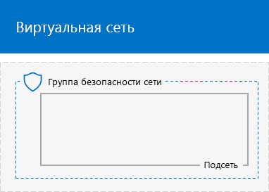
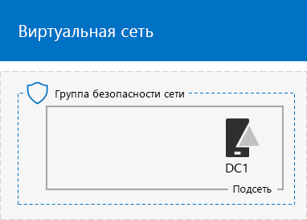
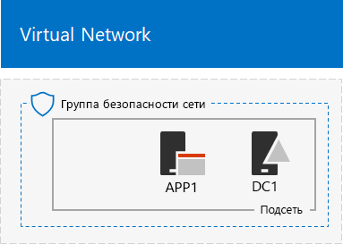

# <a name="base-configuration-devtest-environment"></a>Базовая конфигурация среды разработки и тестирования

 **Сводка.** Создание упрощенной интрасети в качестве среды разработки и тестирования в Microsoft Azure.
  
В этой статье представлено руководство по созданию среды разработки и тестирования с базовой конфигурацией в Azure.
  

  
**Рис. 1. Базовая конфигурация среды разработки и тестирования**

Среда разработки и тестирования с базовой конфигурацией, представленная на рис. 1, состоит из корпоративной подсети в облачной виртуальной сети Azure под названием TestLab. Последняя является симуляцией упрощенной частной интрасети, подключенной к Интернету. Она содержит три виртуальные машины Azure под управлением Windows Server 2016.
  
- Виртуальная машина DC1 настроена в качестве контроллера домена интрасети и сервера доменных имен (DNS).
    
- APP1 настроена в качестве общего сервера приложений и веб-сервера.
    
- CLIENT1 действует как клиент интрасети.
    
Вот что обеспечивает такая конфигурация для виртуальных машин DC1, APP1, CLIENT1 и дополнительных компьютеров корпоративной подсети: 
  
- подключение к Интернету для установки обновлений, доступа к интернет-ресурсам в реальном времени и работы с общедоступными облачными технологиями, такими как Microsoft Office 365 и другие службы Azure;
    
- управление при помощи подключения к удаленному рабочему столу с компьютера, соединенного с Интернетом или сетью организации.
    
Цели использования получившейся тестовой среды:
  
- разработка и тестирование приложений;
    
- применение в качестве исходной конфигурации для собственной расширенной тестовой среды, в которую входят дополнительные виртуальные машины, службы Azure или другие облачные решения Майкрософт, такие как Office 365 и "Enterprise Mobility + Security" (EMS).
    
Эту среду можно создать двумя способами:

1. Шаблон Azure Resource Manager
2. Azure PowerShell

## <a name="method-1-build-your-simulated-intranet-with-an-azure-resource-manager-template"></a>Способ 1. Создание имитированной интрасети с помощью шаблона Azure Resource Manager

Этот способ предполагает использование шаблона Azure Resource Manager (ARM) для создания имитации интрасети. Шаблоны ARM содержат все необходимые инструкции для создания и настройки сетевой инфраструктуры Azure и виртуальных машин.

Перед развертыванием шаблона ознакомьтесь со [страницей сведений шаблона (README)](https://github.com/maxskunkworks/TLG/tree/master/tlg-base-config_3-vm) и приготовьте приведенные ниже сведения.

- Название подписки на Azure. Вам понадобится ввести эту метку в поле **Подписка** на странице **Настраиваемое развертывание**.
- Имя группы ресурсов Azure. Вам понадобится ввести эту метку в поле **Группа ресурсов** на странице **Настраиваемое развертывание**.
- Префикс метки DNS для URL-адресов общедоступных IP-адресов виртуальных машин. Вам понадобится ввести эту метку в поле **Префикс метки DNS** на странице **Настраиваемое развертывание**.

После ознакомления с инструкциями нажмите **Развертывание в Azure** на [странице сведений шаблона (README)](https://github.com/maxskunkworks/TLG/tree/master/tlg-base-config_3-vm), чтобы приступить к работе.

>[!Note]
>Для имитации интрасети, созданной на основе шаблона ARM, требуется платная подписка Azure.
>

Ниже показана итоговая конфигурация после завершения работы с шаблоном.


## <a name="method-2-build-your-simulated-intranet-with-azure-powershell"></a>Способ 2. Создание имитированной интрасети с помощью Azure PowerShell

Этот способ предполагает использование Windows PowerShell и модуля Azure PowerShell для создания сетевой инфраструктуры, виртуальных машин и их конфигурации.

Используйте этот способ, если вы хотите получить возможность создания элементов инфраструктуры Azure поочередно по одному командному блоку с помощью PowerShell. Затем можно настроить командные блоки PowerShell для самостоятельного развертывания других виртуальных машин в Azure.

Существует четыре этапа настройки тестовой среды с базовой конфигурацией с помощью Azure PowerShell:
  
1. создание виртуальной сети;
    
2. настройка DC1;
    
3. настройка APP1;
    
4. настройка CLIENT1.
    
Если у вас еще нет подписки на Azure, вы можете [оформить бесплатную пробную подписку](https://azure.microsoft.com/pricing/free-trial/). Если у вас есть подписка на MSDN или Visual Studio, см. статью [Ежемесячная сумма денег на счете в Azure для подписчиков Visual Studio](https://azure.microsoft.com/pricing/member-offers/msdn-benefits-details/).
  
> [!NOTE]
> За использование виртуальных машин Azure взимается повременная плата. Счет будет выставляться по вашей бесплатной пробной версии, подписке MSDN или платной подписке. Дополнительные сведения о стоимости использования виртуальных машин Azure см. в статьях [Цены на виртуальные машины](https://azure.microsoft.com/pricing/details/virtual-machines/) и [Калькулятор цен Azure](https://azure.microsoft.com/pricing/calculator/). Сведения о минимизации расходов см. в разделе [Минимизация расходов на виртуальные машины в тестовой среде в Azure](base-configuration-dev-test-environment.md#mincost). 
  

  
> [!TIP]
> Щелкните [здесь](http://aka.ms/catlgstack), чтобы просмотреть схему всех статей, относящихся к руководствам по лаборатории тестирования в One Microsoft Cloud.
  
### <a name="step-1-create-the-virtual-network"></a>Этап 1. Создание виртуальной сети.

На этом этапе создается виртуальная сеть TestLab в Azure.

Сначала запустите командную строку Azure PowerShell.
  
> [!NOTE]
> Для указанных ниже последовательностей команд используется последняя версия Azure PowerShell. См. статью [Начало работы с командлетами Azure PowerShell](https://docs.microsoft.com/ru-RU/powershell/azureps-cmdlets-docs/). 
  
Войдите в свою учетную запись Azure с помощью указанной ниже команды.
  
```
Login-AzureRMAccount
```

> [!TIP]
> Скачать текстовый файл, который содержит все команды PowerShell, приведенные в этой статье, можно [здесь](https://gallery.technet.microsoft.com/PowerShell-commands-for-ba957d3d).
  
Получите имя подписки с помощью приведенной ниже команды.
  
```
Get-AzureRMSubscription | Sort Name | Select Name
```

Укажите свою подписку Azure. Замените текст в кавычках, в том числе символы < и >, на правильное имя.
  
```
$subscr="<subscription name>"
Get-AzureRmSubscription -SubscriptionName $subscr | Select-AzureRmSubscription
```

Затем создайте группу ресурсов для лаборатории тестирования с базовой конфигурацией. Чтобы определить уникальное имя группы ресурсов, используйте указанную ниже команду для вывода списка имеющихся групп ресурсов.
  
```
Get-AzureRMResourceGroup | Sort ResourceGroupName | Select ResourceGroupName
```

Создайте группу ресурсов с помощью приведенных ниже команд. Замените все символы в кавычках (в том числе символы < и >) на правильные имена.
  
```
$rgName="<resource group name>"
$locName="<location name, such as West US>"
New-AzureRMResourceGroup -Name $rgName -Location $locName
```

Затем создайте виртуальную сеть TestLab, в которой будет размещена корпоративная подсеть базовой конфигурации, и защитите ее с помощью группы безопасности сети.
  
```
$rgName="<name of your new resource group>"
$locName=(Get-AzureRmResourceGroup -Name $rgName).Location
$corpnetSubnet=New-AzureRMVirtualNetworkSubnetConfig -Name Corpnet -AddressPrefix 10.0.0.0/24
New-AzureRMVirtualNetwork -Name TestLab -ResourceGroupName $rgName -Location $locName -AddressPrefix 10.0.0.0/8 -Subnet $corpnetSubnet -DNSServer 10.0.0.4
$rule1=New-AzureRMNetworkSecurityRuleConfig -Name "RDPTraffic" -Description "Allow RDP to all VMs on the subnet" -Access Allow -Protocol Tcp -Direction Inbound -Priority 100 -SourceAddressPrefix Internet -SourcePortRange * -DestinationAddressPrefix * -DestinationPortRange 3389
New-AzureRMNetworkSecurityGroup -Name Corpnet -ResourceGroupName $rgName -Location $locName -SecurityRules $rule1
$vnet=Get-AzureRMVirtualNetwork -ResourceGroupName $rgName -Name TestLab
$nsg=Get-AzureRMNetworkSecurityGroup -Name Corpnet -ResourceGroupName $rgName
Set-AzureRMVirtualNetworkSubnetConfig -VirtualNetwork $vnet -Name Corpnet -AddressPrefix "10.0.0.0/24" -NetworkSecurityGroup $nsg
```

Это ваша текущая конфигурация.
  

  
### <a name="step-2-configure-dc1"></a>Этап 2. Настройка DC1

На этом этапе мы создадим виртуальную машину DC1 и настроим ее как контроллер для домена Windows Server Active Directory corp.contoso.com и DNS-сервер для виртуальных машин сети TestLab.

> [!NOTE]
> Перед выполнением следующего командного блока убедитесь, что выбранный регион (расположение) Azure поддерживает размер виртуальной машины Azure с заданным по умолчанию значением Standard_A1. Щелкните [здесь](https://azure.microsoft.com/global-infrastructure/services/?products=virtual-machines), чтобы просмотреть последние сведения о расположениях и размерах виртуальных машин Azure.
  
Чтобы создать виртуальную машину Azure для DC1, сначала укажите имя группы ресурсов, а затем выполните приведенные ниже команды в командной строке Azure PowerShell на локальном компьютере.
  
```
$rgName="<resource group name>"
$locName=(Get-AzureRmResourceGroup -Name $rgName).Location
$vnet=Get-AzureRMVirtualNetwork -Name TestLab -ResourceGroupName $rgName
$pip=New-AzureRMPublicIpAddress -Name DC1-PIP -ResourceGroupName $rgName -Location $locName -AllocationMethod Dynamic
$nic=New-AzureRMNetworkInterface -Name DC1-NIC -ResourceGroupName $rgName -Location $locName -SubnetId $vnet.Subnets[0].Id -PublicIpAddressId $pip.Id -PrivateIpAddress 10.0.0.4
$vm=New-AzureRMVMConfig -VMName DC1 -VMSize Standard_A1
$cred=Get-Credential -Message "Type the name and password of the local administrator account for DC1."
$vm=Set-AzureRMVMOperatingSystem -VM $vm -Windows -ComputerName DC1 -Credential $cred -ProvisionVMAgent -EnableAutoUpdate
$vm=Set-AzureRMVMSourceImage -VM $vm -PublisherName MicrosoftWindowsServer -Offer WindowsServer -Skus 2016-Datacenter -Version "latest"
$vm=Add-AzureRMVMNetworkInterface -VM $vm -Id $nic.Id
$vm=Set-AzureRmVMOSDisk -VM $vm -Name "DC1-OS" -DiskSizeInGB 128 -CreateOption FromImage -StorageAccountType "Standard_LRS"
$diskConfig=New-AzureRmDiskConfig -AccountType "Standard_LRS" -Location $locName -CreateOption Empty -DiskSizeGB 20
$dataDisk1=New-AzureRmDisk -DiskName "DC1-DataDisk1" -Disk $diskConfig -ResourceGroupName $rgName
$vm=Add-AzureRmVMDataDisk -VM $vm -Name "DC1-DataDisk1" -CreateOption Attach -ManagedDiskId $dataDisk1.Id -Lun 1
New-AzureRMVM -ResourceGroupName $rgName -Location $locName -VM $vm
```

Вам будет предложено ввести имя пользователя и пароль учетной записи локального администратора на DC1. Задайте надежный пароль и запишите его вместе с именем пользователя в безопасном месте.
  
После этого подключитесь к виртуальной машине DC1.
  
1. На [портале Azure](https://portal.azure.com) выберите **Группы ресурсов >** [имя новой группы ресурсов] **> DC1 > Подключить**.
    
2. В открытой области выберите элемент **Скачать RDP-файл**. Откройте скачанный файл DC1.rdp и нажмите **Подключить**.
    
3. Укажите имя учетной записи локального администратора DC1:
    
  - Для Windows 7:
    
    В диалоговом окне **Безопасность Windows** выберите элемент **Использовать другую учетную запись**. В поле **Имя пользователя** введите **DC1\\**[имя локальной учетной записи администратора].
    
  - Для Windows 8 и Windows 10:
    
    В диалоговом окне **Безопасность Windows** нажмите **Больше вариантов**, а затем — **Использовать другую учетную запись**. В поле **Имя пользователя** введите **DC1\\**[имя учетной записи локального администратора].
    
4. В поле **Пароль** укажите пароль к учетной записи локального администратора, а затем нажмите кнопку **ОК**.
    
5. Когда появится соответствующий запрос, нажмите кнопку **Да**.
    
После этого добавьте еще один диск с данными в качестве нового тома с буквой диска "F:", используя приведенные ниже команды в командной строке Windows PowerShell на уровне администратора в DC1.
  
```
Get-Disk | Where PartitionStyle -eq "RAW" | Initialize-Disk -PartitionStyle MBR -PassThru | New-Partition -AssignDriveLetter -UseMaximumSize | Format-Volume -FileSystem NTFS -NewFileSystemLabel "WSAD Data"
```

Затем настройте виртуальную машину DC1 как контроллер домена и DNS-сервер для домена corp.contoso.com. От имени администратора выполните указанные ниже команды в командной строке Windows PowerShell.
  
```
Install-WindowsFeature AD-Domain-Services -IncludeManagementTools
Install-ADDSForest -DomainName corp.contoso.com -DatabasePath "F:\NTDS" -SysvolPath "F:\SYSVOL" -LogPath "F:\Logs"
```
Потребуется указать пароль администратора для безопасного режима. Храните этот пароль в надежном месте.
  
Обратите внимание, что на выполнение этих команд может потребоваться несколько минут.
  
После перезапуска виртуальной машины DC1 снова подключитесь к ней с помощью учетных данных домена.
  
1. На [портале Azure](https://portal.azure.com) выберите элементы **Группы ресурсов >** [имя вашей группы ресурсов] ** DC1 > Подключить**.
    
2. Запустите скачанный файл DC1.rdp, а затем нажмите **Подключить**.
    
3. В разделе **Безопасность Windows** нажмите **Использовать другую учетную запись**. В поле **Имя пользователя** введите **CORP\\**[имя учетной записи локального администратора].
    
4. В поле **Пароль** укажите пароль к учетной записи локального администратора, а затем нажмите кнопку **ОК**.
    
5. Когда появится соответствующий запрос, нажмите кнопку **Да**.
    
Затем создайте учетную запись пользователя в Active Directory, которая будет использоваться при входе в систему на компьютерах, входящих в домен CORP. От имени администратора выполните указанную ниже команду в командной строке Windows PowerShell.
  
```
New-ADUser -SamAccountName User1 -AccountPassword (read-host "Set user password" -assecurestring) -name "User1" -enabled $true -PasswordNeverExpires $true -ChangePasswordAtLogon $false
```

Обратите внимание на то, что при выполнении этой команды вам будет предложено ввести пароль учетной записи User1. Так как эта учетная запись будет использоваться для подключения к удаленному рабочему столу для всех компьютеров, входящих в домен CORP, используйте надежный пароль. Запишите пароль к учетной записи User1 и храните его в безопасном месте.
  
Затем сделайте новую учетную запись User1 учетной записью администратора предприятия. От имени администратора выполните приведенную ниже команду в командной строке Windows PowerShell.
  
```
Add-ADPrincipalGroupMembership -Identity "CN=User1,CN=Users,DC=corp,DC=contoso,DC=com" -MemberOf "CN=Enterprise Admins,CN=Users,DC=corp,DC=contoso,DC=com","CN=Domain Admins,CN=Users,DC=corp,DC=contoso,DC=com","CN=Schema Admins,CN=Users,DC=corp,DC=contoso,DC=com"
```

Закройте сеанс удаленного рабочего стола DC1 и подключитесь заново, войдя в учетную запись CORP\\User1.
  
Чтобы разрешить трафик для средства Ping, выполните приведенную ниже команду в командной строке Windows PowerShell от имени администратора.
  
```
Set-NetFirewallRule -DisplayName "File and Printer Sharing (Echo Request - ICMPv4-In)" -enabled True
```

Это ваша текущая конфигурация.
  

  
### <a name="step-3-configure-app1"></a>Этап 3. Настройка APP1

На этом этапе создается и настраивается виртуальная машина APP1, которая выступает в качестве веб-сервера и сервера обмена файлами.

> [!NOTE]
> Перед выполнением следующего командного блока убедитесь, что выбранный регион (расположение) Azure поддерживает размер виртуальной машины Azure с заданным по умолчанию значением Standard_A1. Щелкните [здесь](https://azure.microsoft.com/global-infrastructure/services/?products=virtual-machines), чтобы просмотреть последние сведения о расположениях и размерах виртуальных машин Azure.
  
Чтобы создать виртуальную машину Azure для APP1, сначала укажите имя группы ресурсов, а затем выполните приведенные ниже команды в командной строке Azure PowerShell на локальном компьютере.
  
```
$rgName="<resource group name>"
$locName=(Get-AzureRmResourceGroup -Name $rgName).Location
$vnet=Get-AzureRMVirtualNetwork -Name TestLab -ResourceGroupName $rgName
$pip=New-AzureRMPublicIpAddress -Name APP1-PIP -ResourceGroupName $rgName -Location $locName -AllocationMethod Dynamic
$nic=New-AzureRMNetworkInterface -Name APP1-NIC -ResourceGroupName $rgName -Location $locName -SubnetId $vnet.Subnets[0].Id -PublicIpAddressId $pip.Id
$vm=New-AzureRMVMConfig -VMName APP1 -VMSize Standard_A1
$cred=Get-Credential -Message "Type the name and password of the local administrator account for APP1."
$vm=Set-AzureRMVMOperatingSystem -VM $vm -Windows -ComputerName APP1 -Credential $cred -ProvisionVMAgent -EnableAutoUpdate
$vm=Set-AzureRMVMSourceImage -VM $vm -PublisherName MicrosoftWindowsServer -Offer WindowsServer -Skus 2016-Datacenter -Version "latest"
$vm=Add-AzureRMVMNetworkInterface -VM $vm -Id $nic.Id
$vm=Set-AzureRmVMOSDisk -VM $vm -Name "APP1-OS" -DiskSizeInGB 128 -CreateOption FromImage -StorageAccountType "Standard_LRS"
New-AzureRMVM -ResourceGroupName $rgName -Location $locName -VM $vm
```

После этого подключитесь к виртуальной машине APP1, используя имя и пароль для учетной записи локального администратора APP1. Затем откройте командную строку Windows PowerShell.
  
Чтобы проверить разрешение имен и сетевое подключение между APP1 и DC1, выполните команду **ping dc1.corp.contoso.com** и убедитесь, что поступило четыре ответа.
  
Затем присоедините виртуальную машину APP1 к домену CORP, выполнив приведенные ниже команды в командной строке Windows PowerShell.
  
```
Add-Computer -DomainName corp.contoso.com
Restart-Computer
```

Обратите внимание, что после ввода команды **Add-Computer** вам потребуется указать данные учетной записи домена CORP\\User1.
  
После перезапуска APP1 подключитесь к этой виртуальной машине с помощью учетной записи CORP\\User1, а затем откройте командную строку Windows PowerShell от имени администратора.
  
После этого сделайте APP1 веб-сервером, выполнив приведенную ниже команду в командной строке Windows PowerShell в APP1.
  
```
Install-WindowsFeature Web-WebServer -IncludeManagementTools
```

Создайте общую папку и текстовый файл в папке на APP1 с помощью указанных ниже команд PowerShell.
  
```
New-Item -path c:\files -type directory
Write-Output "This is a shared file." | out-file c:\files\example.txt
New-SmbShare -name files -path c:\files -changeaccess CORP\User1
```

Это ваша текущая конфигурация.
  

  
### <a name="step-4-configure-client1"></a>Этап 4. Настройка CLIENT1

На этом этапе создается и настраивается виртуальная машина CLIENT1, которая выступает в качестве типичного ноутбука, планшета или настольного компьютера в интрасети Contoso.

> [!NOTE]  
> Приведенный ниже набор команд создает виртуальную машину CLIENT1 под управлением Windows Server 2016 Datacenter. Это возможно благодаря подпискам на Azure любых типов. Если у вас есть подписка на Azure с Visual Studio, то вы можете создать виртуальную машину CLIENT1 под управлением Windows 10 на [портале Azure](https://portal.azure.com). 
  

> [!NOTE]
> Перед выполнением следующего командного блока убедитесь, что выбранный регион (расположение) Azure поддерживает размер виртуальной машины Azure с заданным по умолчанию значением Standard_A1. Щелкните [здесь](https://azure.microsoft.com/global-infrastructure/services/?products=virtual-machines), чтобы просмотреть последние сведения о расположениях и размерах виртуальных машин Azure.
  
Чтобы создать виртуальную машину Azure для CLIENT1, сначала укажите имя группы ресурсов, а затем выполните приведенные ниже команды в командной строке Azure PowerShell на локальном компьютере.
  
```
$rgName="<resource group name>"
$locName=(Get-AzureRmResourceGroup -Name $rgName).Location
$vnet=Get-AzureRMVirtualNetwork -Name TestLab -ResourceGroupName $rgName
$pip=New-AzureRMPublicIpAddress -Name CLIENT1-PIP -ResourceGroupName $rgName -Location $locName -AllocationMethod Dynamic
$nic=New-AzureRMNetworkInterface -Name CLIENT1-NIC -ResourceGroupName $rgName -Location $locName -SubnetId $vnet.Subnets[0].Id -PublicIpAddressId $pip.Id
$vm=New-AzureRMVMConfig -VMName CLIENT1 -VMSize Standard_A1
$cred=Get-Credential -Message "Type the name and password of the local administrator account for CLIENT1."
$vm=Set-AzureRMVMOperatingSystem -VM $vm -Windows -ComputerName CLIENT1 -Credential $cred -ProvisionVMAgent -EnableAutoUpdate
$vm=Set-AzureRMVMSourceImage -VM $vm -PublisherName MicrosoftWindowsServer -Offer WindowsServer -Skus 2016-Datacenter -Version "latest"
$vm=Add-AzureRMVMNetworkInterface -VM $vm -Id $nic.Id
$vm=Set-AzureRmVMOSDisk -VM $vm -Name "CLIENT1-OS" -DiskSizeInGB 128 -CreateOption FromImage -StorageAccountType "Standard_LRS"
New-AzureRMVM -ResourceGroupName $rgName -Location $locName -VM $vm
```

После этого подключитесь к виртуальной машине CLIENT1, используя имя и пароль для учетной записи локального администратора CLIENT1. Затем откройте командную строку Windows PowerShell от имени администратора.
  
Чтобы проверить разрешение имен и сетевое подключение между CLIENT1 и DC1, выполните команду **ping dc1.corp.contoso.com** в командной строке Windows PowerShell и убедитесь, что поступило четыре ответа.
  
Затем присоедините виртуальную машину CLIENT1 к домену CORP, выполнив приведенные ниже команды в командной строке Windows PowerShell.
  
```
Add-Computer -DomainName corp.contoso.com
Restart-Computer
```

Обратите внимание, что после ввода команды **Add-Computer** вам потребуется указать данные учетной записи домена CORP\\User1.
  
После перезапуска CLIENT1 подключитесь к этой виртуальной машине, используя имя и пароль для учетной записи CORP\\User1, а затем откройте командную строку Windows PowerShell от имени администратора.
  
Затем проверьте доступ к веб-ресурсам и общим файловым ресурсам на APP1 с CLIENT1.
  
1. В области дерева диспетчера серверов выберите **Локальный сервер**.
    
2. В поле **Свойства CLIENT1** выберите значение **Вкл.** для параметра **Конфигурация усиленной безопасности Internet Explorer**.
    
3. В разделе **Конфигурация усиленной безопасности Internet Explorer** для параметров **Администраторы** и **Пользователи** выберите значение **Выкл.** и нажмите кнопку **ОК**.
    
4. На начальном экране выберите **Internet Explorer** и нажмите кнопку **ОК**.
    
5. В адресной строке браузера введите **http:\//app1.corp.contoso.com/**, а затем нажмите клавишу ВВОД. Вы увидите страницу служб IIS по умолчанию для APP1.
    
6. Нажмите значок проводника на панели задач рабочего стола.
    
7. В адресной строке браузера введите **\\\\app1\\Files**, а затем нажмите клавишу ВВОД. Откроется окно папки с содержимым общей папки Files.
    
8. В окне общей папки **Files** дважды щелкните файл **Example.txt**. Вы увидите содержимое файла Example.txt.
    
9. Закройте окно **example.txt - Блокнот** и окно общей папки **Files**.
    
Это ваша окончательная конфигурация.
  

  
Теперь ваша базовая конфигурация в Azure готова к разработке и тестированию приложений, а также к созданию дополнительных тестовых сред. 
  
> [!TIP]
> Щелкните [здесь](http://aka.ms/catlgstack), чтобы просмотреть схему всех статей, относящихся к руководствам по лаборатории тестирования One Microsoft Cloud.
  
<a name="mincost"> </a>
## <a name="minimizing-the-costs-of-test-environment-virtual-machines-in-azure"></a>Минимизация расходов на виртуальные машины в тестовой среде в Azure

Чтобы снизить затраты на работу виртуальных машин тестовой среды, можно выполнить одно из указанных ниже действий.
  
- Создайте тестовую среду и проведите необходимое тестирование и демонстрацию как можно скорее. После завершения удалите группу ресурсов для тестовой среды.
    
- Завершите работу виртуальных машин своей тестовой среды, приведя их в освобожденное состояние.
    
Чтобы завершить работу виртуальных машин с помощью Azure PowerShell, введите имя группы ресурсов и выполните указанные ниже команды.
  
```
$rgName="<your resource group name>"
Stop-AzureRMVM -ResourceGroupName $rgName -Name "CLIENT1" -Force
Stop-AzureRMVM -ResourceGroupName $rgName -Name "APP1" -Force
Stop-AzureRMVM -ResourceGroupName $rgName -Name "DC1" -Force
```

Чтобы виртуальные машины, находящиеся в остановленном (освобожденном) состоянии, работали должным образом после запуска и вывода их из этого состояния, запускайте их в следующем порядке:
  
1. DC1;
2. APP1;
3. CLIENT1.
    
Чтобы запустить виртуальные машины по порядку с помощью Azure PowerShell, введите имя группы ресурсов и выполните приведенные ниже команды.
  
```
$rgName="<your resource group name>"
Start-AzureRMVM -ResourceGroupName $rgName -Name "DC1"
Start-AzureRMVM -ResourceGroupName $rgName -Name "APP1"
Start-AzureRMVM -ResourceGroupName $rgName -Name "CLIENT1"
```

## <a name="see-also"></a>См. также

- [Среда разработки и тестирования Office 365](office-365-dev-test-environment.md)
- [DirSync для среды разработки и тестирования Office 365](dirsync-for-your-office-365-dev-test-environment.md)
- [Cloud App Security для среды разработки и тестирования Office 365](cloud-app-security-for-your-office-365-dev-test-environment.md)
- [Advanced Threat Protection в среде разработки и тестирования Office 365](advanced-threat-protection-for-your-office-365-dev-test-environment.md)
- [Освоение облака и гибридные решения](cloud-adoption-and-hybrid-solutions.md)
