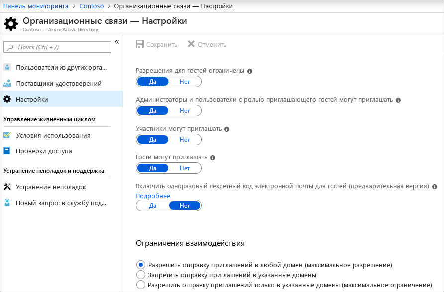
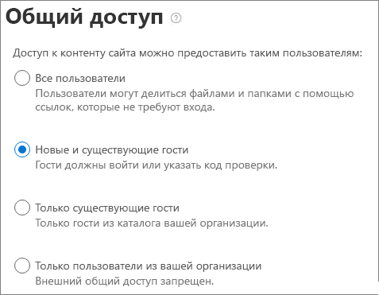

# Совместное сотрудничество с гостями в документе

Если вам требуется совместная работа с гостями в документах в SharePoint или OneDrive, вы можете отправить им ссылку для совместного доступа к документу. В этой статье мы рассмотрим действия по настройке Microsoft 365, необходимые для настройки ссылок общего доступа для SharePoint и OneDrive.

## Параметры связей в Организации Azure

Общий доступ в Microsoft 365 регулируется на самом высоком уровне параметрами организационных отношений в Azure Active Directory. Если общий доступ к гостям отключен или ограничен в Azure AD, все параметры общего доступа, настроенные в Microsoft 365, будут переопределены.

Проверьте параметры организационных отношений, чтобы предотвратить блокировку общего доступа с гостями.

Настройка параметров организационных отношений

1. Выполните вход в Microsoft Azure по [https://portal.azure.com](https://portal.azure.com)адресу.
2. В области навигации слева выберите **Azure Active Directory**.
3. В области **Обзор** щелкните **организационные связи**.
4. В области **организационные связи** щелкните **Параметры**.
5. Убедитесь, что у **администраторов и пользователей в роли гостя может быть приглашение** , а **Участники** — значение **Да**.
6. Если вы внесли изменения, нажмите кнопку **сохранить**.

Обратите внимание на параметры в разделе **ограничения совместной работы** . Убедитесь, что домены гостей, с которыми вы хотите работать совместно, не заблокированы.

## Параметры общего доступа на уровне Организации SharePoint

Для того, чтобы гости могли иметь доступ к документу в SharePoint или OneDrive, параметры общего доступа на уровне Организации SharePoint и OneDrive должны разрешить доступ к гостям.

Параметры на уровне Организации для SharePoint определяют параметры, доступные для отдельных сайтов SharePoint. Параметры сайта не могут быть более разрешительнои, чем параметры на уровне Организации. Настройка уровня Организации для OneDrive определяет уровень общего доступа, доступный в библиотеках OneDrive пользователей.

Если вы хотите разрешить общий доступ к файлам и папкам для анонимных пользователей Шарепионт и OneDrive, выберите пункт **все**. Если необходимо обеспечить проверку подлинности для всех гостей, выберите **новые и существующие гости**. 

В разделе SharePoint выберите параметры с наибольшим количеством разрешений, которые будут необходимы любому сайту в вашей организации.

Настройка параметров общего доступа на уровне Организации SharePoint

1. В центре администрирования Microsoft 365 в области навигации слева в разделе **центры администрирования**щелкните **SharePoint**.
2. В центре администрирования SharePoint в области навигации слева щелкните **общий доступ**.
3. Убедитесь, что для внешнего общего доступа для SharePoint или OneDrive задано значение " **любой пользователь** " или " **новые и существующие гости**". (Обратите внимание, что параметр OneDrive не может быть более разрешающим, чем параметр SharePoint.)
4. Если вы внесли изменения, нажмите кнопку **сохранить**.

## Параметры ссылок по умолчанию на уровне Организации SharePoint

Параметры ссылки по умолчанию для файлов и папок определяют, какой вариант ссылки отображается для пользователя по умолчанию при предоставлении общего доступа к файлу или папке. При необходимости пользователи могут изменить тип ссылки на один из других вариантов, прежде чем предоставлять общий доступ.

Имейте в виду, что этот параметр влияет на сайты SharePoint в Организации, а также на OneDrive.

Выберите тип ссылки, выбранной по умолчанию, когда пользователи совместно используют файлы и папки:

- Если вы ожидаете совместное использование большого числа файлов и папок анонимными пользователями, выберите этот параметр для **ссылки** . Если вы хотите разрешить ссылки для *всех пользователей* , но беспокоитесь о случайном анонимном доступе, примите во внимание один из других параметров, используемый по умолчанию. Этот тип ссылки доступен только в том случае, если вы включили **общий доступ** .
- **Только люди из вашей организации** — выберите этот вариант, если вы хотите, чтобы большая часть общего доступа к файлам и папкам была доступна пользователям в вашей организации.
- **** Если вы собираетесь делать большой объем общего доступа к файлам и папкам для гостей, используйте этот вариант. Этот тип ссылки работает с гостями и требует проверки подлинности.
 

Настройка параметров ссылок по умолчанию на уровне Организации в SharePoint и OneDrive

1. Перейдите на страницу "общий доступ" в центре администрирования SharePoint.
2. В разделе **ссылки на файлы и папки**выберите ссылку для совместного доступа по умолчанию, которую нужно использовать.
3. Если вы внесли изменения, нажмите кнопку **сохранить**.

## Параметры общего доступа на уровне сайта SharePoint

При совместном использовании файлов и фодлерс, которые находятся на сайте SharePoint, необходимо также проверить параметры общего доступа на уровне сайта для этого сайта.

Установка параметров общего доступа на уровне сайта
1. В центре администрирования SharePoint в области навигации слева разверните узел **сайты** и выберите пункт **активные сайты**.
2. Выберите сайт, который вы только что создали.
3. На ленте щелкните **общий доступ**.
4. Убедитесь, что для общего доступа задано значение " **любой пользователь** " или " **новые и существующие гости**".
5. Если вы внесли изменения, нажмите кнопку **сохранить**.

## Приглашение пользователей

Параметры общего доступа к гостям настроены, поэтому теперь пользователи могут предоставлять общий доступ к файлам и папкам гостями. Для получения дополнительных сведений см. [общий доступ к файлам и папкам OneDrive](https://support.office.com/article/9fcc2f7d-de0c-4cec-93b0-a82024800c07) и [общий доступ к файлам и папкам SharePoint](https://support.office.com/article/1fe37332-0f9a-4719-970e-d2578da4941c) .

## См. также
