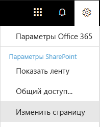

# Настройка поиска в OneDrive для бизнеса с поддержкой нескольких регионовConfigure Search for OneDrive for Business Multi-Geo

Используя среду OneDrive для бизнеса с поддержкой нескольких регионов, организация может иметь одного клиента Office 365, но при этом хранить содержимое OneDrive в нескольких географических расположениях — центральном и периферийных.In a Multi-Geo SharePoint Online (SPO) environment, an organization can have one Office 365 tenant, but store their SharePoint content in multiple geographical locations - one central location and one or more satellite geo locations.

В случае каждого географического расположения предусмотрены отдельные индекс и центр поиска. Когда пользователь пытается что-то найти, запрос развертывается для всех индексов, а возвращенные результаты объединяются.Each geographical location has its own search index and Search Center. When a user searches, the query is fanned out to all the indexes, and the returned results are merged.

Например, пользователь, находящийся в одном географическом расположении, может искать контент, хранящийся в другом, а также на сайте SharePoint, доступ к которому ограничен другим географическим расположением. Если у пользователя есть доступ к этому контенту, отобразятся результаты поиска.For example, a user in one geo location can search for content stored in another geo location, or for content on a SharePoint site that’s restricted to a different geo location. If the user has access to this content, search will show the result.

## Какие клиенты поиска работают в среде с поддержкой нескольких регионов?Which search clients work in a Multi-Geo environment?

Возвращать результаты поиска из всех географических расположений могут такие клиенты:These clients can return results from all geo locations:

-   OneDrive для бизнеса;OneDrive for Business

-   Delve;Delve

-   домашняя страница SharePoint;The SharePoint home page

-   центр поиска;The Search Center

-   специальные поисковые приложения, которые используют API поиска SharePoint.Custom search applications that use the SharePoint Search API

### OneDrive для бизнесаOneDrive for Business

Как только завершится настройка среды с поддержкой нескольких регионов, пользователи, выполняющие поиск в OneDrive, получат результаты из всех географических расположений.As soon as the Multi-Geo environment has been set up, users that search in OneDrive get results from all geo locations.

### DelveDelve

Как только завершится настройка среды с поддержкой нескольких регионов, пользователи, выполняющие поиск в Delve, получат результаты из всех географических расположений.As soon as the Multi-Geo environment has been set up, users that search in Delve get results from all geo locations.

Веб-канал Delve и карточка профиля показывают только краткое содержание файлов, которые хранятся в **центральном** расположении. В случае файлов, хранящихся в периферийных расположениях, отображается значок типа файла.The Delve feed and the profile card only show previews of files that are stored in the **central** location. For files that are stored in satellite geo locations, the icon for the file type is shown instead.

### домашняя страница SharePoint;The SharePoint home page

Как только завершится настройка среды с поддержкой нескольких регионов, пользователи на своей домашней странице SharePoint увидят новости, недавние и отслеживаемые сайты из нескольких географических расположений. Используя поле поиска на домашней странице SharePoint, пользователи получат объединенные результаты из нескольких географических расположений.As soon as the Multi-Geo environment has been set up, users will see news, recent and followed sites from multiple geo locations on their SharePoint home page. If they use the search box on the SharePoint home page, they'll get merged results from multiple geo locations.

### центр поиска;The Search Center

Когда завершится настройка среды с поддержкой нескольких регионов, каждый центр поиска будет по-прежнему отображать только результаты из своего географического расположения. Чтобы можно было получать данные из всех географических расположений, администраторы должны [изменить настройки каждого центра поиска](#_Set_up_a_1). После этого пользователи станут получать результаты из всех географических расположений.After the Multi-Geo environment has been set up, each Search Center continues to only show results from their own geo location. Admins must [change the settings of each Search Center](#_Set_up_a_1) to get results from all geo locations. Afterwards, users that search in the Search Center get results from all geo locations.

### Специальные поисковые приложенияCustom search applications

Как правило, специальные поисковые приложения взаимодействуют с индексами поиска при помощи существующих REST API поиска SharePoint. Для получения результатов из всех или некоторых географических расположений приложение должно [вызвать API и включить в запрос новые параметры поддержки нескольких регионов](#_Get_custom_search). Это действие активирует развертывание запроса для всех геообъектов.As usual, custom search applications interact with the search indexes by using the existing SharePoint Search REST APIs. To get results from all, or some geo locations, the application must [call the API and include the new Multi-Geo query parameters](#_Get_custom_search) in the request. This triggers a fan out of the query to all geo locations.

## Чем отличается поиск в среде с поддержкой нескольких регионов?What’s different about search in a Multi-Geo environment?

Некоторые знакомые вам функции поиска работают иначе в среде с поддержкой нескольких регионов.Some search features you might be familiar with, work differently in a Multi-Geo environment.

<table>
<thead>
<tr class="header">
<th align="left"><strong>Функция</strong><strong>Feature</strong></th>
<th align="left"><strong>Как это работает</strong><strong>How does it work</strong></th>
<th align="left"><strong>Решение</strong><strong>Workaround</strong></th>
</tr>
</thead>
<tbody>
<tr class="odd">
<td align="left">Повышение уровня результатовPromoted results</td>
<td align="left">Вы можете создавать правила запросов с повышением уровня результатов для всего клиента, семейства веб-сайтов или отдельного сайта. Чтобы в среде с поддержкой нескольких регионов повысить уровень результатов для центров поиска <strong>всех</strong> географических расположений, определите такие результаты для <strong>клиента</strong>. Чтобы повысить уровень результатов <strong>только</strong> для центра поиска, находящегося в географическом расположении семейства веб-сайтов или отдельного сайта, определите такие результаты для <strong>семейства веб-сайтов</strong> или <strong>сайта</strong> соответственно.You can create query rules with promoted results at different levels: for the whole tenant, for a site collection, or for a site. In a Multi-Geo environment, define promoted results at the <strong>tenant</strong> level if you want to promote the results to the Search Centers in <strong>all</strong> geo locations. If you <strong>only</strong> want to promote results in the Search Center that’s in the geo location of the site collection or site, define the results at the <strong>site collection</strong> or <strong>site</strong> level.</td>
<td align="left">Если вам не нужны различные результаты с повышенным уровнем для каждого отдельного географического расположения (например, разные правила для перемещения), рекомендуем определять результаты с повышенным уровнем для клиента.If you don’t need different promoted results per geo location, for example different rules for traveling, we recommend defining promoted results at the tenant level.</td>
</tr>
<tr class="even">
<td align="left">Уточнения поискаSearch refiners</td>
<td align="left">При поиске возвращаются уточнения из всех географических расположений клиента, а затем объединяются. Объединение выполняется максимально правильно, но счетчики уточнений могут не быть точными на 100 %. Для большинства сценариев поиска такой точности вполне достаточно. Search returns refiners from all the geo locations of a tenant and then aggregates them. The aggregation is a best effort, meaning that the refiner counts might not be 100% accurate. For most search-driven scenarios, this accuracy is sufficient. </td>
<td align="left">Поисковые приложения, которые зависят от полноты уточнения, запрашивают каждое географическое расположение отдельно, не используя развертывание с поддержкой нескольких регионов.For search-driven applications that depend on refiner completeness, query each geo location independently without using Multi-Geo fan-out.</td>
</tr>
<tr class="odd">
<td align="left"></td>
<td align="left">При поиске в среде с поддержкой нескольких регионов невозможно динамическое группирование числовых уточнений.Multi-Geo search doesn’t support dynamic bucketing for numerical refiners.</td>
<td align="left">В случае числовых уточнений задавайте <a href="https://docs.microsoft.com/en-us/sharepoint/dev/general-development/query-refinement-in-sharepoint">параметр discretize</a>.Use the <a href="https://docs.microsoft.com/en-us/sharepoint/dev/general-development/query-refinement-in-sharepoint">“Discretize” parameter</a> for numerical refiners.</td>
</tr>
<tr class="even">
<td align="left">Идентификаторы документовDocument IDs</td>
<td align="left">При разработке поискового приложения, которое зависит от ИД документов, обратите внимание на то, что такие идентификаторы в среде с поддержкой нескольких регионов уникальны только для каждого отдельного географического расположения.If you’re developing a search-driven application that depends on document IDs, note that document IDs in a Multi-Geo environment aren’t unique across geo locations, they are unique per geo location.</td>
<td align="left">Добавлен столбец "GeoLocationSource", который определяет географическое расположение и позволяет добиться уникальности.We’ve added a column that identifies the geo location. Use this column to achieve uniqueness. This column is named “GeoLocationSource”.</td>
</tr>
<tr class="odd">
<td align="left">Количество результатовNumber of results</td>
<td align="left">На странице результатов поиска отображаются объединенные данные из географических расположений (не более 500 результатов на одной странице).The search results page shows combined results from the geo locations, but it’s not possible to page beyond 500 results.</td>
<td align="left"></td>
</tr>
</tbody>
</table>

## Что не поддерживается при поиске в среде с поддержкой нескольких регионов?What’s not supported for search in a Multi-Geo environment?

Некоторые знакомые вам функции поиска в среде поддержки нескольких регионов не поддерживаются.Some of the search features you might be familiar with, aren’t supported in a Multi-Geo environment.

<table>
<thead>
<tr class="header">
<th align="left"><strong>Функция поиска</strong><strong>Search feature</strong></th>
<th align="left"><strong>Примечание</strong><strong>Note</strong></th>
</tr>
</thead>
<tbody>
<tr class="odd">
<td align="left">Проверка подлинности только для приложенийApp-only authentication</td>
<td align="left">При поиске в среде с поддержкой нескольких регионов невозможна проверка подлинности только для приложений (привилегированный доступ из служб).App-only authentication (privileged access from services) isn’t supported in Multi-Geo search.</td>
</tr>
<tr class="even">
<td align="left">Гостевые пользователиGuest users</td>
<td align="left">Гостевые пользователи получают результаты только из того географического расположения, из которого они выполняют поиск.Guest users only get results from the geo location that they’re searching from.</td>
</tr>
</tbody>
</table>

## Каковые принципы поиска в среде с поддержкой нескольких регионов?How does search work in a Multi-Geo environment?

**Все** клиенты поиска взаимодействуют с индексами поиска, используя существующие REST API поиска SharePoint.**All** the search clients use the existing SharePoint Search REST APIs to interact with the search indexes.

1. Клиент поиска вызывает конечную точку поиска REST с использованием свойства запроса EnableMultiGeoSearch = true.A search client calls the Search REST endpoint with the query property EnableMultiGeoSearch= true.
2. Запрос отправляется во все геообъекты, предусмотренные для клиента.The query is sent to all geo locations in the tenant.
3. Результаты поиска из каждого географического расположения объединяются и ранжируются.Search results from each geo location are merged and ranked.
4. Клиент получает объединенные результаты поиска.The client gets unified search results.

Обратите внимание на то, что результаты поиска не объединяются до тех пор, пока не будут получены данные из всех географических расположений. Это означает, что поиск в среде с поддержкой нескольких регионов выполняется с большей задержкой, чем поиск в среде с одним геообъектом.Notice that we don’t merge the search results until we’ve received results from all the geo locations. This means that Multi-Geo searches have additional latency compared to searches in an environment with only one geo location.

## Настройка отображения в центре поиска результатов из всех географических расположенийGet a Search Center to show results from all geo locations

Для каждого центра поиска предусмотрено несколько вертикалей, и каждую из них следует настраивать отдельно.Each Search Center has several verticals and you have to set up each vertical individually.

1.  Убедитесь, что выполняете эти действия в учетной записи, у которой есть разрешение на изменение страницы результатов поиска и веб-части результатов поиска.Ensure that you perform these steps with an account that has permission to edit the search results page and the Search Result Web Part.

2.  Перейдите на страницу результатов поиска (см. [список](https://support.office.com/article/174d36e0-2f85-461a-ad9a-8b3f434a4213) страниц результатов поиска).Navigate to the search results page (see the [list](https://support.office.com/article/174d36e0-2f85-461a-ad9a-8b3f434a4213) of search results pages)

3.  Выберите вертикаль для настройки. В верхнем правом углу щелкните значок шестеренки **Параметры**, а затем выберите **Изменить страницу**. Откроется страница результатов поиска в режиме редактирования.Select the vertical to set up, click **Settings** gear icon in the upper, right corner, and then click **Edit Page**. The search results page opens in Edit mode.

     
1.  В веб-части результатов поиска переместите указатель в верхний правый угол, щелкните стрелку, а затем в меню выберите **Изменить веб-часть**. Под лентой в верхней правой части страницы откроется область инструментов веб-части результатов поиска. In the Search Results Web Part, move the pointer to the upper, right corner of the Web Part, click the arrow, and then click **Edit Web Part** on the menu. The Search Results Web Part tool pane opens under the ribbon in the top right of the page. 

1.  Чтобы в веб-части результатов поиска отображались результаты из всех геообъектов, в области инструментов веб-части выберите **Параметры** > **Параметры управления результатами** > **Отображение результатов с поддержкой нескольких регионов**.In the Web Part tool pane, in the **Settings** section, under **Results control settings**, select **Show Multi-Geo results** to get the Search Results Web Part to show results from all geo locations.

2.  Чтобы сохранить изменения и закрыть область инструментов веб-части, нажмите кнопку **ОК**.Click **OK** to save your change and close the Web Part tool pane.

3.  Проверьте изменения, внесенные в веб-часть результатов поиска, выбрав **Возврат** на вкладке "Страница" главного меню.Check your changes to the Search Results Web Part by clicking **Check-In** on the Page tab of the main menu.

4.  Опубликуйте изменения, воспользовавшись ссылкой, предоставленной в примечании вверху страницы.Publish the changes by using the link provided in the note at the top of the page.

## Настройка отображения в специальных поисковых приложениях результатов из всех или некоторых географических расположенийGet custom search applications to show results from all or some geo locations

Специальные поисковые приложения получают результаты из всех или некоторых географических расположений, указывая параметры запроса для REST API поиска SharePoint. В зависимости от этих параметров запрос развертывается для всех или некоторых геообъектов. Например, если нужно найти релевантные данные, отправив запрос только в подмножество географических расположений, можно выполнить развертывание запроса именно для них. Если запрос будет выполнен успешно, REST API поиска SharePoint возвратит данные отклика.Custom search applications get results from all, or some, geo locations by specifying query parameters with the request to the SharePoint Search REST API. Depending on the query parameters, the query is fanned out to all geo locations, or to some geo locations. For example, if you only need to query a subset of geo locations to find relevant information, you can control the fan out to only these. If the request succeeds, the SharePoint Search REST API returns response data.

### Параметры запросаQuery parameters

EnableMultiGeoSearch — это логическое значение, определяющее, должен ли запрос развертываться для индексов других геообъектов клиента с несколькими регионами. Чтобы выполнить развертывание запроса, задайте для этого параметра значение **true**. Чтобы не выполнять его, установите значение **false**. По умолчанию задано **false**. Если не указать этот параметр, развертывание запроса **не** будет выполнено для других геообъектов. Если вы используете этот параметр в среде без поддержки нескольких регионов, он будет проигнорирован.EnableMultiGeoSearch - This is a Boolean value that specifies whether the query shall be fanned out to the indexes of other geo locations of the Multi-Geo tenant. Set it to **true** to fan out the query; **false** to not fan out the query. The default value is **false**. If you don’t include this parameter, the query is **not** fanned out to other geo locations. If you use the parameter in an environment that isn’t Multi-Geo, the parameter is ignored.

ClientType — строка. Введите для каждого поискового приложения уникальное имя клиента. Если не указать этот параметр, развертывание запроса **не** будет выполнено для других геообъектов.ClientType - This is a string. Enter a unique client name for each search application. If you don’t include this parameter, the query is **not** fanned out to other geo locations.

MultiGeoSearchConfiguration — дополнительный список географических расположений клиента с несколькими регионами. Он предназначен для развертывания запроса, когда параметру **EnableMultiGeoSearch** задано значение **true**. Если не указать этот параметр или его значение, развертывание запроса будет выполнено для всех географических расположений. Для каждого географического расположения введите указанные ниже элементы в формате JSON.MultiGeoSearchConfiguration - This is an optional list of which geo locations in the Multi-Geo tenant to fan the query out to when **EnableMultiGeoSearch** is **true**. If you don’t include this parameter, or leave it blank, the query is fanned out to all geo locations. For each geo location, enter the following items, in JSON format:

<table>
<thead>
<tr class="header">
<th align="left">ItemItem</th>
<th align="left">ОписаниеDescription</th>
</tr>
</thead>
<tbody>
<tr class="odd">
<td align="left">DataLocationDataLocation</td>
<td align="left">Географическое расположение (например, NAM).The geo location, for example NAM.</td>
</tr>
<tr class="even">
<td align="left">EndPointEndPoint</td>
<td align="left">Конечная точка для подключения (например, https://contoso.sharepoint.com).The endpoint to connect to, for example https://contoso.sharepoint.com</td>
</tr>
<tr class="odd">
<td align="left">SourceIdSourceId</td>
<td align="left">GUID источника результатов, например B81EAB55-3140-4312-B0F4-9459D1B4FFEE.The GUID of the result source, for example B81EAB55-3140-4312-B0F4-9459D1B4FFEE.</td>
</tr>
</tbody>
</table>

Если опустить элемент DataLocation или EndPoint, а также если продублировать DataLocation, запрос будет выполнен с ошибкой. [Сведения о конечной точке геообъектов клиента можно получить с помощью Microsoft Graph](https://docs.microsoft.com/ru-RU/sharepoint/dev/solution-guidance/multigeo-discovery).If you omit DataLocation or EndPoint, or if a DataLocation is duplicated, the request fails. [You can get information about the endpoint of a tenant's geo locations by using Microsoft Graph](https://docs.microsoft.com/ru-RU/sharepoint/dev/solution-guidance/multigeo-discovery).

### Данные откликаResponse data

MultiGeoSearchStatus — свойство, которое API поиска SharePoint возвращает в отклике на запрос. Значение этого свойства является строкой и предоставляет указанные ниже сведения о результатах, которые возвращает API поиска SharePoint.MultiGeoSearchStatus – This is a property that the SharePoint Search API returns in response to a request. The value of the property is a string and gives the following information about the results that the SharePoint Search API returns:

<table>
<thead>
<tr class="header">
<th align="left">ЗначениеValue</th>
<th align="left">ОписаниеDescription</th>
</tr>
</thead>
<tbody>
<tr class="odd">
<td align="left">FullFull</td>
<td align="left">Полные результаты из <strong>всех</strong> географических расположений.Full results from <strong>all</strong> the geo locations.</td>
</tr>
<tr class="even">
<td align="left">PartialPartial</td>
<td align="left">Частичные результаты из одного или нескольких географических расположений. Такие результаты являются неполными из-за временной ошибки.Partial results from one or more geo locations. The results are incomplete due to a transient error.</td>
</tr>

</tbody>
</table>

### Отправка запросов с помощью службы RESTQuery using the REST service

Используя GET-запрос, нужно указать соответствующие параметры в URL-адресе. Параметры POST-запроса передаются в его теле в формате нотации объектов JavaScript (JSON).With a GET request, you specify the query parameters in the URL. With a POST request, you pass the query parameters in the body in JavaScript Object Notation (JSON) format.

#### Заголовки запросовRequest headers

<table>
<thead>
<tr class="header">
<th align="left">ИмяName</th>
<th align="left">ЗначениеValue</th>
</tr>
</thead>
<tbody>
<tr class="odd">
<td align="left">Content-TypeContent-Type</td>
<td align="left">application/json;odata=verboseapplication/json;odata=verbose</td>
</tr>
</tbody>
</table>

#### Пример GET-запроса, развертывание которого выполняется для **всех** геообъектовSample GET request that’s fanned out to **all** geo locations

https:// \<клиент\>/\_api/search/query?querytext='sharepoint'&Properties='EnableMultiGeoSearch:true'&ClientType='ИД\_моего\_клиента'https:// \<tenant\>/\_api/search/query?querytext='sharepoint'&Properties='EnableMultiGeoSearch:true'&ClientType='my\_client\_id'

#### Пример GET-запроса, развертывание которого выполняется для **некоторых** геообъектовSample GET request to fan out to **some** geo locations

https:// \<tenant\>/\_api/search/query?querytext='site'&ClientType='my_client_id'&Properties='EnableMultiGeoSearch:true, MultiGeoSearchConfiguration:[{DataLocation\\:"NAM"\\,Endpoint\\:"https\\://contosoNAM.sharepoint.com"\\,SourceId\\:"B81EAB55-3140-4312-B0F4-9459D1B4FFEE"}\\,{DataLocation\\:"CAN"\\,Endpoint\\:"https\\://contosoCAN.sharepoint-df.com"}]'https:// \<tenant\>/\_api/search/query?querytext='site'&ClientType='my_client_id'&Properties='EnableMultiGeoSearch:true, MultiGeoSearchConfiguration:[{DataLocation\\:"NAM"\\,Endpoint\\:"https\\://contosoNAM.sharepoint.com"\\,SourceId\\:"B81EAB55-3140-4312-B0F4-9459D1B4FFEE"}\\,{DataLocation\\:"CAN"\\,Endpoint\\:"https\\://contosoCAN.sharepoint-df.com"}]'

> [!NOTE]
> Перед запятыми и двоеточиями в списке геообъектов для свойства MultiGeoSearchConfiguration используется символ **обратной косой черты**. Это обусловлено тем, что запросы GET используют двоеточия для разделения свойств и запятые для разделения аргументов свойств. Без обратной косой черты в качестве экранирующего символа свойство MultiGeoSearchConfiguration будет распознаваться неправильно.Commas and colons in the list of geo-locations for the MultiGeoSearchConfiguration property are preceded by the **backslash** character. This is because GET requests use colons to separate properties and commas to separate arguments of properties. Without the backslash as an escape character, the MultiGeoSearchConfiguration property is interpreted wrongly.

#### Пример POST-запроса, развертывание которого выполняется для **всех** геообъектовSample POST request that’s fanned out to **all** geo locations

    {
        "request": {
            "__metadata": {
            "type": "Microsoft.Office.Server.Search.REST.SearchRequest"
        },
        "Querytext": "sharepoint",
        "Properties": {
            "results": [
                {
                    "Name": "EnableMultiGeoSearch",
                    "Value": {
                        "QueryPropertyValueTypeIndex": 3,
                        "BoolVal": true
                    }
                }
            ]
        },
        "ClientType": "my_client_id"
        }
    }

#### Пример POST-запроса, развертывание которого выполняется для **некоторых** геообъектовSample POST request that’s fanned out to **some** geo locations

    {
        "request": {
            "Querytext": "SharePoint",
            "ClientType": "my_client_id",
            "Properties": {
                "results": [
                    {
                        "Name": "EnableMultiGeoSearch",
                        "Value": {
                            "QueryPropertyValueTypeIndex": 3,
                            "BoolVal": true
                        }
                    },
                    {
                        "Name": "MultiGeoSearchConfiguration",
                        "Value": {
                        "StrVal": "[{\"DataLocation\":\"NAM\",\"Endpoint\":\"https://contoso.sharepoint.com\",\"SourceId\":\"B81EAB55-3140-4312-B0F4-9459D1B4FFEE\"},{\"DataLocation\":\"CAN\",\"Endpoint\":\"https://contosoCAN.sharepoint.com\"}]",
                            "QueryPropertyValueTypeIndex": 1
                        }
                    }
                ]
            }
        }
    }

### Отправка запросов с помощью CSOMQuery using CSOM

Пример CSOM-запроса, развертывание которого выполняется для **всех** геообъектовHere’s a sample CSOM query that’s fanned out to **all** geo locations:

    var keywordQuery = new KeywordQuery(ctx);
    keywordQuery.QueryText = query.SearchQueryText;
    keywordQuery.ClientType = <enter a string here>;
    keywordQuery["EnableMultiGeoSearch"] = true;

