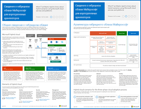

# Contoso в Microsoft Cloud

 **Сводка.** Показательный пример внедрения облачной ИТ-инфраструктуры с облачными предложениями Майкрософт вымышленной всемирной организацией.
  
Здесь вы найдете ссылки на ряд статей, в которых описано, как корпорация Contoso, транснациональный производственный конгломерат с главным офисом в Париже, развертывает ИТ-инфраструктуру в облаке и принимает важные проектные решения по организации сетей, обеспечению идентификации и безопасности, а также реализует сценарии корпоративного облака, соответствующие бизнес-задачам. Эти сведения можно просмотреть еще в виде 11-страничного плаката и распечатать в табличном формате (A3).
  

  
[PDF](https://go.microsoft.com/fwlink/p/?linkid=842085)  | [Visio](https://go.microsoft.com/fwlink/p/?linkid=842086)  | [Другие языки](https://www.microsoft.com/download/details.aspx?id=54427)
  
См. указанные ниже разделы.
  
- [Общие сведения о корпорации Contoso](overview-of-the-contoso-corporation.md)
    
    Корпорация Contoso — это транснациональная компания-конгломерат, которая занимается производством, продажей и поддержкой более чем 100 000 продуктов.
    
- [ИТ-инфраструктура и потребности корпорации Contoso](contoso-it-infrastructure-and-needs.md)
    
    Корпорация Contoso переходит с локальной, централизованной ИТ-инфраструктуры на облачную, включающую личные рабочие нагрузки на основе облака, приложения и гибридные сценарии.
    
- [Сеть корпорации Contoso](networking-for-the-contoso-corporation.md)
    
    Чтобы обеспечить наилучшую производительность служб на основе облака, сетевые инженеры корпорации Contoso оптимизировали весь интернет-трафик.
    
- [Удостоверение для корпорации Contoso](identity-for-the-contoso-corporation.md)
    
    Удостоверение Contoso в облачном решении использует собственный локальный поставщик удостоверений и включает федеративную проверку подлинности для тех доверенных сторонних поставщиков удостоверений, которые уже существуют.
    
- [Подписки, лицензии и учетные записи корпорации Contoso](subscriptions-licenses-and-user-accounts-for-the-contoso-corporation.md)
    
    В корпорации Contoso для доступа к облачным решениям Майкрософт используется следующая иерархия: организация/подписки/лицензии/учетные записи пользователей.
    
- [Безопасность в корпорации Contoso](security-for-the-contoso-corporation.md)
    
    При переносе своей ИТ-инфраструктуры в облако корпорация Contoso убедилась, что требования к безопасности локальной среды выполнены и реализованы в облачных решениях Майкрософт.
    
- [Корпоративные сценарии для корпорации Contoso](enterprise-scenarios-for-the-contoso-corporation.md)
    
    Узнайте, как Contoso решает свои коммерческие задачи с помощью облачных продуктов Майкрософт.
    
> [!NOTE]
> В этих статьях отражены сведения, представленные в выпуске плаката "Contoso в Microsoft Cloud" за **сентябрь 2017 г.**
  
## См. также

[Ресурсы для администраторов, посвященные архитектуре Microsoft Cloud](microsoft-cloud-it-architecture-resources.md)

[Стратегия Enterprise Cloud корпорации Майкрософт: ресурсы для лиц, принимающих решения в области ИТ](https://sway.com/FJ2xsyWtkJc2taRD)

