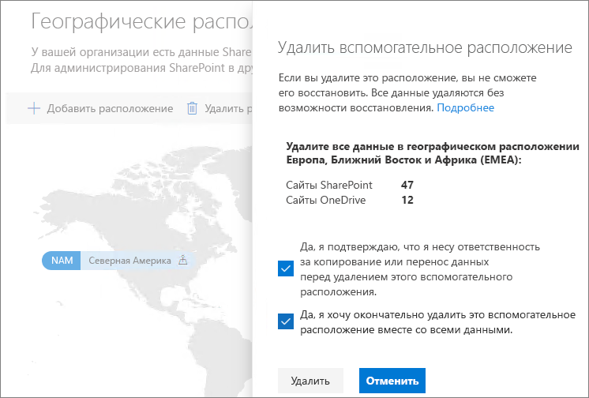

# Удаление вспомогательного расположения в Microsoft 365 Multi-Geo.Delete a satellite location in Microsoft 365 Multi-Geo

Если вам больше не нужно вспомогательное расположение, можно удалить его из клиента в Центре администрирования SharePoint.If you no longer need a satellite location, you can delete it from your tenant from the SharePoint admin center.

> [!WARNING]
> Все данные пользователя во вспомогательном расположении будут безвозвратно удалены.All user data in the satellite location will be permanently deleted. К ним относятся все содержимое OneDrive для бизнеса, сайты SharePoint, почтовые ящики Exchange, а также почтовые ящики групп Microsoft 365.This includes all OneDrive for Business content, SharePoint sites and Exchange mailboxes including Microsoft 365 Group mailboxes. Перед удалением вспомогательного расположения необходимо перенести все данные в другое вспомогательное или центральное расположение.You must migrate any data to another satellite location or the central location before you delete the satellite location. Это действие невозможно отменить.This action cannot be undone.

Удалить вспомогательное расположение могут только глобальные администраторы.Only global administrators can delete satellite locations.

Чтобы удалить вспомогательное расположение, выполните указанные ниже действия.To delete a satellite location

1. Откройте Центр администрирования SharePoint.Open the SharePoint admin center

2. Перейдите на вкладку **Географические расположения**.Navigate to the **Geo locations** tab.

3. На карте щелкните геообъект, который хотите удалить.On the map, click the geo location that you want to delete.

4. Нажмите **Удалить расположение**.Click **Delete location**.

5. Подтвердите удаление, установив флажки подтверждения.Confirm the deletion by selecting the confirmation check boxes.

6. Нажмите кнопку **Удалить**.Click **Delete**.
