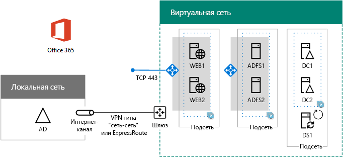

# Развертывание в Azure федеративной проверки подлинности для обеспечения высокой доступности в случае использования Office 365Deploy high availability federated authentication for Office 365 in Azure

 **Сводка.** Настройка федеративной проверки подлинности с высоким уровнем доступности для подписки на Office 365 в Microsoft Azure.**Summary:** Configure high availability federated authentication for your Office 365 subscription in Microsoft Azure.
  
Эта статья содержит ссылки на пошаговые инструкции по развертыванию федеративной проверки подлинности с высоким уровнем доступности для Microsoft Office 365 в службах инфраструктуры Azure со следующими виртуальными машинами:This article contains links to the step-by-step instructions for deploying high availability federated authentication for Microsoft Office 365 in Azure infrastructure services with these virtual machines:
  
- два прокси-сервера веб-приложений;Two web application proxy servers
    
- два сервера служб федерации Active Directory (AD FS);Two Active Directory Federation Services (AD FS) servers
    
- две реплики контроллеров домена;Two replica domain controllers
    
- один сервер DirSync, на котором запущено средство Azure AD Connect.One directory synchronization (DirSync) server running Azure AD Connect
    
Ниже приводится конфигурация с именами-заполнителями для каждого сервера.Here is the configuration, with placeholder names for each server.
  
**Инфраструктура федеративной проверки подлинности с высоким уровнем доступности для Office 365 в Azure****A high availability federated authentication for Office 365 infrastructure in Azure**

  
Все виртуальные машины находятся в единой виртуальной сети Azure из распределенного развертывания.All of the virtual machines are in a single cross-premises Azure virtual network (VNet). 
  
> [!NOTE]
> Федеративная проверка подлинности для отдельных пользователей не зависит от локальных ресурсов. Но если распределенное подключение станет недоступным, контроллеры домена в виртуальной сети не получат тех обновлений для учетных записей пользователей и для групп, которые появились в локальной службе AD на сервере Windows Server. Чтобы этого не произошло, настройте высокую доступность для распределенного подключения. Дополнительные сведения см. в статье [Настройка высокодоступных подключений: распределенных и между виртуальными сетями]((https://docs.microsoft.com/azure/vpn-gateway/vpn-gateway-highlyavailable)).Federated authentication of individual users does not rely on any on-premises resources. However, if the cross-premises connection becomes unavailable, the domain controllers in the VNet will not receive updates to user accounts and groups made in the on-premises Windows Server AD. To ensure this does not happen, you can configure high availability for your cross-premises connection. For more information, see [Highly Available Cross-Premises and VNet-to-VNet Connectivity]((https://docs.microsoft.com/azure/vpn-gateway/vpn-gateway-highlyavailable))
  
Каждая пара виртуальных машин для определенной роли находится в отдельной подсети или группе доступности.Each pair of virtual machines for a specific role is in its own subnet and availability set.
  
> [!NOTE]
> Поскольку эта виртуальная сеть соединена с локальной, в конфигурацию не входят виртуальные машины jumpbox и виртуальные машины наблюдения в подсети управления. Дополнительные сведения см. в статье [Запуск виртуальных машин Windows в n-уровневой архитектуре]((https://docs.microsoft.com/azure/guidance/guidance-compute-n-tier-vm)).Because this VNet is connected to the on-premises network, this configuration does not include jumpbox or monitoring virtual machines on a management subnet. For more information, see [Running Windows VMs for an N-tier architecture]((https://docs.microsoft.com/azure/guidance/guidance-compute-n-tier-vm)). 
  
Такая конфигурация обеспечивает федеративную проверку подлинности для всех пользователей Office 365, при которой они смогут применять для входа учетные данные Active Directory в Windows Server, а не учетную запись Office 365. Инфраструктура федеративной проверки подлинности включает группу избыточных серверов, которые проще развертывать в службах инфраструктуры Azure, чем в локальной сети периметра.The result of this configuration is that you will have federated authentication for all of your Office 365 users, in which they can use their Windows Server Active Directory credentials to sign in rather than their Office 365 account. The federated authentication infrastructure uses a redundant set of servers that are more easily deployed in Azure infrastructure services, rather than in your on-premises edge network.
  
## Перечень компонентовBill of materials

Для этой базовой конфигурации требуется следующий набор служб Azure и компонентов:This baseline configuration requires the following set of Azure services and components:
  
- семь виртуальных машин;Seven virtual machines
    
- одна нелокальная виртуальная сеть с четырьмя подсетями;One cross-premises virtual network with four subnets
    
- четыре группы ресурсов;Four resource groups
    
- три группы доступности;Three availability sets
    
- одна подписка Azure.One Azure subscription
    
Ниже приводится список виртуальных машин, необходимых для данной конфигурации, а также их размеры по умолчанию.Here are the virtual machines and their default sizes for this configuration.
  
|**Элемент****Item**|**Описание виртуальной машины****Virtual machine description**|**Изображение коллекции Azure****Azure gallery image**|**Размер по умолчанию****Default size**|
|:-----|:-----|:-----|:-----|
|1.1.    |Первый контроллер доменаFirst domain controller    |Windows Server 2016 DatacenterWindows Server 2016 Datacenter    |D2D2    |
|2.2.    |Второй контроллер доменаSecond domain controller    |Windows Server 2016 DatacenterWindows Server 2016 Datacenter    |D2D2    |
|3.3.    |Сервер Azure AD ConnectAzure AD Connect server    |Windows Server 2016 DatacenterWindows Server 2016 Datacenter    |D2D2    |
|4.4.    |Первый сервер AD FSFirst AD FS server    |Windows Server 2016 DatacenterWindows Server 2016 Datacenter    |D2D2    |
|5.5.    |Второй сервер AD FSSecond AD FS server    |Windows Server 2016 DatacenterWindows Server 2016 Datacenter    |D2D2    |
|6.6.    |Первый прокси-сервер веб-приложенийFirst web application proxy server    |Windows Server 2016 DatacenterWindows Server 2016 Datacenter    |D2D2    |
|7.7.    |Второй прокси-сервер веб-приложенийSecond web application proxy server    |Windows Server 2016 DatacenterWindows Server 2016 Datacenter    |D2D2    |
   
Рассчитать примерные затраты на эту конфигурацию можно с помощью [калькулятора цен Azure]((https://azure.microsoft.com/pricing/calculator/)).To compute the estimated costs for this configuration, see the [Azure pricing calculator]((https://azure.microsoft.com/pricing/calculator/))
  
## Этапы развертыванияPhases of deployment

Эта рабочая нагрузка развертывается на следующих этапах:You deploy this workload in the following phases:
  
<<<<<<< HEAD<<<<<<< HEAD
- [Федеративная проверка подлинности для обеспечения высокой доступности
Этап 1. Настройка Azure](high-availability-federated-authentication-phase-1-configure-azure.md). Создайте группы ресурсов, учетные записи хранения, группы доступности и нелокальную виртуальную сеть.[High availability federated authentication Phase 1: Configure Azure](high-availability-federated-authentication-phase-1-configure-azure.md). Create resource groups, storage accounts, availability sets, and a cross-premises virtual network.
    
- [Федеративная проверка подлинности для обеспечения высокой доступности
Этап 2. Настройка контроллеров домена](high-availability-federated-authentication-phase-2-configure-domain-controllers.md). Создайте и настройте реплики контроллеров домена Windows Server Active Directory (AD) и сервера DirSync.[High availability federated authentication Phase 2: Configure domain controllers](high-availability-federated-authentication-phase-2-configure-domain-controllers.md). Create and configure replica Windows Server Active Directory (AD) domain controllers and the DirSync server.
    
- [Федеративная проверка подлинности для обеспечения высокой доступности
Этап 3. Настройка серверов AD FS](high-availability-federated-authentication-phase-3-configure-ad-fs-servers.md). Создайте и настройте два сервера AD FS.[High availability federated authentication Phase 3: Configure AD FS servers](high-availability-federated-authentication-phase-3-configure-ad-fs-servers.md). Create and configure the two AD FS servers.
    
- [Федеративная проверка подлинности для обеспечения высокой доступности
Этап 4. Настройка прокси веб-приложений](high-availability-federated-authentication-phase-4-configure-web-application-pro.md). Создайте и настройте два прокси-сервера веб-приложений.[High availability federated authentication Phase 4: Configure web application proxies](high-availability-federated-authentication-phase-4-configure-web-application-pro.md). Create and configure the two web application proxy servers.
    
- [Федеративная проверка подлинности для обеспечения высокой доступности
Этап 5. Настройка федеративной проверки подлинности для Office 365](high-availability-federated-authentication-phase-5-configure-federated-authentic.md). Настройте федеративную проверку подлинности для подписки на Office 365.[High availability federated authentication Phase 5: Configure federated authentication for Office 365](high-availability-federated-authentication-phase-5-configure-federated-authentic.md). Configure federated authentication for your Office 365 subscription. =======
- [Федеративная проверка подлинности для обеспечения высокой доступности
Этап 1. Настройка Azure](high-availability-federated-authentication-phase-1-configure-azure.md). Создайте группы ресурсов, учетные записи хранения, группы доступности и нелокальную виртуальную сеть.[High availability federated authentication Phase 1: Configure Azure](high-availability-federated-authentication-phase-1-configure-azure.md) - Create resource groups, storage accounts, availability sets, and a cross-premises virtual network.
    
- [Федеративная проверка подлинности для обеспечения высокой доступности
Этап 2. Настройка контроллеров домена](high-availability-federated-authentication-phase-2-configure-domain-controllers.md). Создайте и настройте реплики контроллеров домена Windows Server Active Directory (AD) и сервер DirSync.[High availability federated authentication Phase 2: Configure domain controllers](high-availability-federated-authentication-phase-2-configure-domain-controllers.md) - Create and configure replica Windows Server Active Directory (AD) domain controllers and the DirSync server.
    
- [Федеративная проверка подлинности для обеспечения высокой доступности
Этап 3. Настройка серверов AD FS](high-availability-federated-authentication-phase-3-configure-ad-fs-servers.md). Создайте и настройте два сервера AD FS.[High availability federated authentication Phase 3: Configure AD FS servers](high-availability-federated-authentication-phase-3-configure-ad-fs-servers.md) - Create and configure the two AD FS servers.
    
- [Федеративная проверка подлинности для обеспечения высокой доступности
Этап 4. Настройка прокси веб-приложений](high-availability-federated-authentication-phase-4-configure-web-application-pro.md). Создайте и настройте два прокси-сервера веб-приложений.[High availability federated authentication Phase 4: Configure web application proxies](high-availability-federated-authentication-phase-4-configure-web-application-pro.md) - Create and configure the two web application proxy servers.
    
- [Федеративная проверка подлинности для обеспечения высокой доступности
Этап 5. Настройка федеративной проверки подлинности для Office 365](high-availability-federated-authentication-phase-5-configure-federated-authentic.md). Настройте федеративную проверку подлинности для подписки на Office 365.[High availability federated authentication Phase 5: Configure federated authentication for Office 365](high-availability-federated-authentication-phase-5-configure-federated-authentic.md) - Configure federated authentication for your Office 365 subscription.
>>>>>>> образецmaster
    
Эти статьи содержат поэтапное руководство по созданию функциональной федеративной проверки подлинности с высоким уровнем доступности для Office 365 в службах инфраструктуры Azure для предопределенной архитектуры. Учитывайте следующее:These articles provide a prescriptive, phase-by-phase guide for a predefined architecture to create a functional, high availability federated authentication for Office 365 in Azure infrastructure services. Keep the following in mind:
  
- Если у вас уже есть опыт развертывания AD FS, можете скорректировать инструкции на этапах 3 и 4 и создать группу серверов для своих нужд.If you are an experienced AD FS implementer, feel free to adapt the instructions in phases 3 and 4 and build the set of servers that best suits your needs.
    
- Если у вас уже есть гибридное облачное развертывание Azure с нелокальной виртуальной сетью, можете скорректировать или пропустить инструкции на этапах 1 и 2 и разместить серверы AD FS и прокси-серверы веб-приложений в соответствующих подсетях.If you already have an existing Azure hybrid cloud deployment with an existing cross-premises virtual network, feel free to adapt or skip the instructions in phases 1 and 2 and place the AD FS and web application proxy servers on the appropriate subnets.
    
Для создания среды разработки и тестирования или экспериментальной версии этой конфигурации ознакомьтесь со статьей [Федеративное удостоверение для среды разработки и тестирования Office 365](federated-identity-for-your-office-365-dev-test-environment.md).To build a dev/test environment or a proof-of-concept of this configuration, see [Federated identity for your Office 365 dev/test environment](federated-identity-for-your-office-365-dev-test-environment.md).
  
## Следующее действиеNext step

Начните настройку этой рабочей нагрузки с ознакомления со статьей [Этап 1. Федеративная проверка подлинности для обеспечения высокой доступности: настройка Azure](high-availability-federated-authentication-phase-1-configure-azure.md).Start the configuration of this workload with [High availability federated authentication Phase 1: Configure Azure](high-availability-federated-authentication-phase-1-configure-azure.md). 
  
> [!TIP]
> Чтобы быстрее выполнить развертывание федеративной проверки подлинности с высоким уровнем доступности для Office 365 в Azure, воспользуйтесь [этим комплектом средств]((https://gallery.technet.microsoft.com/Federated-Authentication-8a9f1664)).For a set of files to more quickly deploy your high availability federated authentication for Office 365 in Azure, see the [Federated Authentication for Office 365 in Azure Deployment Kit]((https://gallery.technet.microsoft.com/Federated-Authentication-8a9f1664)). 
  
## См. такжеSee Also

[Федеративное удостоверение для среды разработки и тестирования Office 365Federated identity for your Office 365 dev/test environment](federated-identity-for-your-office-365-dev-test-environment.md)
  
[Освоение облака и гибридные решенияCloud adoption and hybrid solutions](cloud-adoption-and-hybrid-solutions.md)

[Федеративные удостоверения для Office 365Federated identity for Office 365](https://support.office.com/article/Understanding-Office-365-identity-and-Azure-Active-Directory-06a189e7-5ec6-4af2-94bf-a22ea225a7a9#bk_federated)

