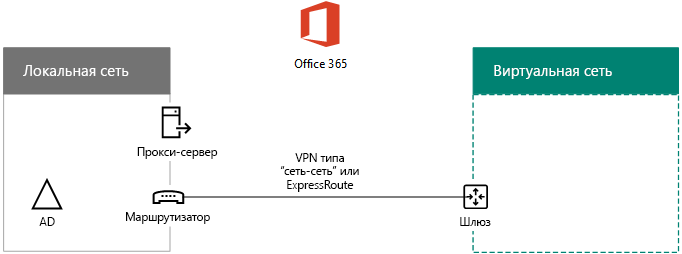
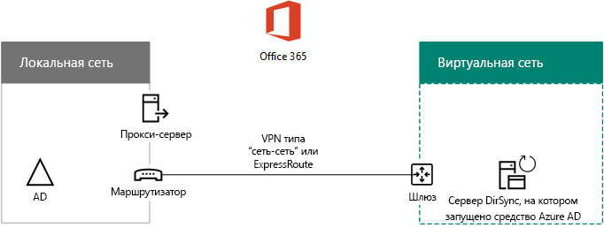

# Развертывание службы синхронизации каталогов Office 365 в Microsoft AzureDeploy Office 365 Directory Synchronization (DirSync) in Microsoft Azure

 **Сводка.** Развертывание средства Azure AD Connect на виртуальной машине в Azure для синхронизации учетных записей между локальным каталогом и клиентом Azure AD, связанным с подпиской на Office 365.**Summary:** Deploy Azure AD Connect (DirSync) on a virtual machine in Azure to synchronize accounts between your on-premises directory and the Azure AD tenant of your Office 365 subscription.
  
Средство Azure Active Directory Connect (предыдущие названия: средство синхронизации каталогов и средство DirSync.exe) — это серверное приложение, которое устанавливается на сервере, входящем в домен, для синхронизации локальных пользователей Windows Server Active Directory с клиентом Azure Active Directory, связанным с подпиской на Office 365. Вы можете установить средство Azure AD Connect как на локальном сервере, так и на виртуальной машине в Azure. Последний вариант установки возможен по следующим причинам:Azure Active Directory (AD) Connect (formerly known as the Directory Synchronization tool, Directory Sync tool, or the DirSync.exe tool) is a server-based application that you install on a domain-joined server to synchronize your on-premises Windows Server Active Directory users to the Azure Active Directory tenant of your Office 365 subscription. You can install Azure AD Connect on a on-premises server, but you can also install it on a virtual machine in Windows_Azure for the following reasons:
  
- Вы можете быстрее подготовить и настроить облачные службы, чтобы сделать их доступными для пользователей.You can provision and configure cloud-based servers faster, making the services available to your users sooner.
    
- Azure обеспечивает высокую доступность сайтов и требует меньше усилий.Windows_Azure offers better site availability with less effort.
    
- Вы можете сократить количество локальных серверов в своей организации.You can reduce the number of on-premises servers in your organization.
    
> [!IMPORTANT]
> Для этого решения требуется соединение между локальной сетью и виртуальной сетью Azure. Дополнительные сведения см. в статье [Подключение локальной сети к виртуальной сети Microsoft Azure](connect-an-on-premises-network-to-a-microsoft-azure-virtual-network.md).This solution requires connectivity between your on-premises network and your Azure Virtual Network. For more information, see [Connect an on-premises network to a Microsoft Azure Virtual Network](connect-an-on-premises-network-to-a-microsoft-azure-virtual-network.md). 
  
> [!IMPORTANT]
> В этой статье описывается синхронизация одного домена в одном лесу. Средство Azure AD Connect синхронизирует все домены Windows Server AD в лесу Active Directory с Office 365. Если вам нужно синхронизировать несколько лесов Active Directory с Office 365, см. [сценарий синхронизации каталогов с единым входом при наличии нескольких лесов](https://go.microsoft.com/fwlink/p/?LinkId=393091).This article describes synchronization of a single domain in a single forest. Azure AD Connect synchronizes all Windows Server AD domains in your Active Directory forest with Office 365. If you have multiple Active Directory forests to synchronize with Union_Lite_2nd, see  Multi-forest Directory Sync with Single Sign-On Scenario https://go.microsoft.com/fwlink/p/?LinkId=393091 . 
  
> [!NOTE]
> Office 365 использует службу каталогов Azure Active Directory (Azure AD). Подписка на Office 365 включает клиент Azure AD. Его также можно использовать для управления удостоверениями организации в других облачных рабочих нагрузках, в том числе других приложениях SaaS и приложениях в Azure.Union_Lite_2nd uses WindowsAzureActiveDirectory (WindowsAzureAD_2nd)  for its directory service. Your Office 365 subscription includes an WindowsAzureAD_2nd tenant. This tenant can also be used for management of your organization's identities with other cloud workloads, including other SaaS applications and apps in Windows_Azure. 
  
## Общие сведения о развертывании синхронизации каталогов Office 365 в AzureOverview of deploying Office 365 directory synchronization in Azure

На следующей схеме показано средство Azure AD Connect, запущенное на виртуальной машине в Azure (сервер синхронизации каталогов), которое синхронизирует локальный лес Windows Server AD с подпиской на Office 365.The following diagram shows Azure AD Connect running on a virtual machine in Windows_Azure (the DirSync server) that synchronizes and on-premises Windows Server AD forest to anUnion_Lite_2nd subscription.
  

  
На этой схеме показаны две сети, соединенные VPN-подключением типа "сеть-сеть" или подключением ExpressRoute. В локальной сети размещаются контроллеры доменов Windows Server AD, а в виртуальной сети Azure — сервер синхронизации каталогов, виртуальная машина, на которой запущено [средство Azure AD Connect](https://www.microsoft.com/download/details.aspx?id=47594). Из сервера синхронизации каталогов исходит два основных потока трафика:In the diagram, there are two networks connected by a site-to-site VPN or ExpressRoute connection. There is an on-premises network where Windows Server AD domain controllers are located, and there is an Windows_Azure virtual network with a DirSync server, a virtual machine running  Azure AD Connect https://www.microsoft.com/download/details.aspx?id=47594 . There are two main traffic flows originating from the DirSync server:
  
-  Средство Azure AD Connect отправляет контроллеру домена в локальной сети запросы на изменение учетных записей и паролей.Azure AD Connect queries a domain controller on the on-premises network for changes to accounts and passwords.
    
-  Средство Azure AD Connect отправляет изменения учетных записей и паролей экземпляру Azure AD подписки на Office 365. Так как сервер синхронизации каталогов является расширением локальной сети, эти изменения отправляются через прокси-сервер локальной сети.Azure AD Connect sends the changes to accounts and passwords to the WindowsAzureAD_2nd instance of your Union_Lite_2nd subscription. Because the DirSync server is in an extended portion of your on-premises network, these changes are sent through the on-premises network’s proxy server.
    
> [!NOTE]
> В этом решении описывается синхронизация одного домена Active Directory в одном лесу. Средство синхронизации Azure AD Connect синхронизирует все домены Active Directory в лесу Active Directory с Office 365. Если вам нужно синхронизировать несколько лесов Active Directory с Office 365, см. [сценарий синхронизации каталогов с единым входом при наличии нескольких лесов](https://go.microsoft.com/fwlink/p/?LinkId=393091).This article describes synchronization of a single domain in a single forest. The Azure AD Connect tool synchronizes all Active Directory domains in your Active Directory forest with Office 365. If you have multiple Active Directory forests to synchronize with Union_Lite_2nd, see  Multi-forest Directory Sync with Single Sign-On Scenario http://go.microsoft.com/fwlink/p/?LinkId=393091 . 
  
В обоих случаях трафик из средства Azure AD Connect, запущенного на виртуальной машине Azure, отправляется на шлюз в виртуальной сети Azure, который затем направляет трафик через VPN-подключение типа "сеть-сеть" или подключение ExpressRoute на устройство шлюза VPN в локальной сети. Затем инфраструктура маршрутизации локальной сети направляет трафик по назначению, например на контроллер домена или прокси-сервер.In both cases, the traffic originated by Azure AD Connect running on the Azure virtual machine is forwarded to a gateway on the virtual network in Windows_Azure, which then forwards the traffic across the site-to-site VPN or ExpressRoute connection to the VPN gateway device on the on-premises network. The routing infrastructure of the on-premises network then forwards the traffic to its destination, such as a domain controller or a proxy server.
  
Развертывание этого решения делится на два основных этапа:There are two major steps when you deploy this solution:
  
1. Создание виртуальной сети Azure и настройка VPN-подключения типа "сеть-сеть" к локальной сети. Дополнительные сведения см. в статье [Подключение локальной сети к виртуальной сети Microsoft Azure](connect-an-on-premises-network-to-a-microsoft-azure-virtual-network.md).Create an Windows_Azure virtual network and establish a site-to-site VPN connection to your on-premises network. For more information, see Connect an on-premises network to a Microsoft Azure Virtual Network.
    
2. Установка [средства Azure AD Connect](https://www.microsoft.com/download/details.aspx?id=47594) на присоединенной к домену виртуальной машине в Azure и синхронизация локального леса Windows Server AD с Office 365. Этот процесс включает следующие этапы:Install  Azure AD Connect https://www.microsoft.com/download/details.aspx?id=47594  on a domain-joined virtual machine in Windows_Azure, and then synchronize the on-premises Windows Server AD to Office 365. This involves:
    
    Создание виртуальной машины Azure для запуска Azure AD Connect.Creating an Azure Virtual Machine to run Azure AD Connect.
    
    Установка и настройка [Azure AD Connect](https://www.microsoft.com/download/details.aspx?id=47594).Installing and configuring [Azure AD Connect](https://www.microsoft.com/download/details.aspx?id=47594).
    
    Для настройки средства Azure AD Connect требуются учетные данные (имя пользователя и пароль) администратора Azure AD и администратора предприятия Windows Server AD. Средство Azure AD Connect запускается мгновенно и регулярно для синхронизации локального леса Windows Server AD с Office 365.Configuring Azure AD Connect requires the credentials (user name and password) of an WindowsAzureAD_2nd administrator account and a Windows Server AD enterprise administrator account. Azure AD Connect runs immediately and on an ongoing basis to synchronize the on-premises Windows Server AD forest to Union_Lite_2nd.
    
Прежде чем развертывать это решение в эксплуатационной среде, воспользуйтесь инструкциями в статье [Синхронизация каталогов для среды разработки и тестирования Office 365](dirsync-for-your-office-365-dev-test-environment.md), чтобы установить эту конфигурацию для демонстраций или экспериментов.Before you deploy this solution in production, use the instructions in [Directory synchronization for your Office 365 dev/test environment](dirsync-for-your-office-365-dev-test-environment.md) to set this configuration up as a proof of concept, for demonstrations, or for experimentation.
  
> [!IMPORTANT]
> После настройки средство Azure AD Connect не сохраняет учетные данные администратора предприятия Windows Server AD.When Azure AD Connect configuration completes, it does not save the Windows Server AD enterprise administrator account credentials. 
  
> [!NOTE]
> Это решение описывает синхронизацию одного леса Windows Server AD с Office 365. Топология, описываемая в этой статье, предоставляет только один из способов реализации решения. Топология вашей организации может отличаться в связи с уникальными требованиями к сети и ее безопасности.This solution describes synchronizing a single Active Directory forest to Office 365. The topology discussed in this article represents only one way to implement this solution. Your organization’s topology might differ based on your unique network requirements and security considerations. 
  
## Планирование размещения сервера синхронизации каталогов для Office 365 в AzurePlan for hosting a DirSync server for Office 365 in Azure

### ТребованияPrerequisites

Прежде чем приступать к работе, изучите требования для развертывания этого решения:Before you begin, review the following prerequisites for this solution:
  
- Изучите соответствующие материалы по планированию в разделе [Планирование виртуальной сети Azure](connect-an-on-premises-network-to-a-microsoft-azure-virtual-network.md#PlanningVirtual).Review the related planning content in [Plan your Azure Virtual Network](connect-an-on-premises-network-to-a-microsoft-azure-virtual-network.md#PlanningVirtual).
    
- Убедитесь, что ваша организация отвечает всем [требованиям](connect-an-on-premises-network-to-a-microsoft-azure-virtual-network.md#Prerequisites) для настройки виртуальной сети Azure.Ensure that you meet all [prerequisites](connect-an-on-premises-network-to-a-microsoft-azure-virtual-network.md#Prerequisites) for configuring the Azure virtual network.
    
- Приготовьте подписку на Office 365, которая включает функцию интеграции с Active Directory. Сведения о подписках на Office 365 см. на [этой странице](https://go.microsoft.com/fwlink/p/?LinkId=394278).Have an Union_Lite_2nd subscription that includes the Active Directory integration feature. For information about Union_Lite_2nd subscriptions, go to the  Office 365 subscription page https://go.microsoft.com/fwlink/p/?LinkId=394278 .
    
- Подготовьте одну виртуальную машину Azure, на которой запущено средство Azure AD Connect, для синхронизации локального леса Windows Server AD с Office 365.Provision one WindowsAzureVirtualMachine_1st that runs Azure AD Connect to synchronize your on-premises Windows Server AD forest with Union_Lite_2nd.
    
    У вас должны быть учетные данные (имена и пароли) администратора предприятия Windows Server AD и администратора Azure Active Directory.You must have the credentials (names and passwords) for a Windows Server AD enterprise administrator account and an Windows_Azure Active Directory Administrator account.
    
### Допущения по архитектуре решенияSolution architecture design assumptions

Ниже приведены принятые проектные решения.The following list describes the design choices made for this solution.
  
- Это решение использует одну виртуальную сеть Azure с VPN-подключением типа "сеть-сеть". В виртуальной сети Azure размещается одна подсеть с одним сервером синхронизации каталогов, на котором запущено средство Azure AD Connect.This solution uses a single Windows_Azure virtual network with a site-to-site VPN connection. The Windows_Azure virtual network hosts a single subnet that contains one server, the DirSync server that is running Azure AD Connect. 
    
- В локальной сети размещены контроллер домена и DNS-серверы.On the on-premises network, a domain controller and DNS servers exist.
    
- Вместо единого входа средство Azure AD Connect выполняет синхронизацию хэша паролей. Вам не требуется развертывать инфраструктуру служб федерации Active Directory (AD FS). Дополнительные сведения о синхронизации хэша паролей и едином входе см. в статье [Выбор правильного метода аутентификации для гибридного решения для идентификации Azure Active Directory](http://aka.ms/auth-options).Azure AD Connect performs password hash synchronization instead of single sign-on. You do not have to deploy an Active Directory Federation Services (AD FS) infrastructure. To learn more about password hash synchronization and single sign-on options, see [Choosing the right authentication method for your Azure Active Directory hybrid identity solution](http://aka.ms/auth-options).
    
При развертывании этого решения в своей среде вы можете рассмотреть дополнительные варианты структуры. К ним относятся следующие:There are additional design choices that you might consider when you deploy this solution in your environment. These include the following:
  
- Если в виртуальной сети Azure уже есть DNS-серверы, определите, должен ли сервер синхронизации каталогов использовать их вместо DNS-серверов в локальной сети.If there are existing DNS servers in an existing Windows_Azure virtual network, determine whether you want your DirSync server to use them for name resolution instead of DNS servers on the on-premises network.
    
- Если в существующей виртуальной сети Azure есть контроллеры доменов, решите, будет ли настройка сайтов и служб Active Directory более подходящим вариантом для вашей организации. Вместо контроллеров доменов локальной сети сервер синхронизации каталогов может отправлять запросы контроллерам доменов в виртуальной сети Azure для поиска изменений в учетных записях и паролях.If there are domain controllers in an existing Windows_Azure virtual network, determine whether configuring Active Directory Sites and Services may be a better option for you. The directory synchronization server can query the domain controllers in the Windows_Azure virtual network for changes in accounts and passwords instead of domain controllers on the on-premises network.
    
## План развертыванияDeployment roadmap

Развертывание Azure AD Connect на виртуальной машине в Azure состоит из трех этапов:Deploying Azure AD Connect on a virtual machine in  Windows_Azure consists of three phases:
  
- Этап 1. Создание и настройка виртуальной сети AzurePhase 1: Create and configure the Azure virtual network
    
- Этап 2. Создание и настройка виртуальной машины AzurePhase 2: Create and configure the Azure virtual machine
    
- Этап 3. Установка и настройка Azure AD ConnectPhase 3: Install and configure Azure AD Connect
    
После развертывания также необходимо назначить расположения и лицензии для новых учетных записей пользователей в Office 365.After deployment, you must also assign locations and licenses for the new user accounts in Office 365.
  
> [!TIP]
> [Сервер синхронизации каталогов в комплекте средств для развертывания Azure](https://gallery.technet.microsoft.com/DirSync-Server-in-Azure-32cb2ded) содержит все блоки Azure PowerShell для моделирования этого решения, схемы в формате Microsoft PowerPoint и Visio, а также таблицу настройки Microsoft Excel, которая создает блоки команд Azure PowerShell специально для ваших параметров.The  DirSync Server in Azure Deployment Kit https://gallery.technet.microsoft.com/DirSync-Server-in-Azure-32cb2ded  contains all of the Azure PowerShell blocks to build out this solution, the diagrams in Microsoft PowerPoint and Visio format, and a Microsoft Excel configuration workbook that generates Azure PowerShell command blocks customized for your settings.
  
### Этап 1. Создание и настройка виртуальной сети AzurePhase 1: Create and configure the Azure virtual network

Чтобы создать и настроить виртуальную сеть Azure, выполните [Этап 1. Подготовка локальной сети](connect-an-on-premises-network-to-a-microsoft-azure-virtual-network.md#Phase1) и [Этап 2. Создание виртуальной сети в Azure](connect-an-on-premises-network-to-a-microsoft-azure-virtual-network.md#Phase2) из схемы развертывания [Подключение локальной сети к виртуальной сети Microsoft Azure](connect-an-on-premises-network-to-a-microsoft-azure-virtual-network.md).To create and configure the Azure virtual network, complete [Phase 1: Prepare your on-premises network](connect-an-on-premises-network-to-a-microsoft-azure-virtual-network.md#Phase1) and [Phase 2: Create the cross-premises virtual network in Azure](connect-an-on-premises-network-to-a-microsoft-azure-virtual-network.md#Phase2) in the deployment roadmap of [Connect an on-premises network to a Microsoft Azure Virtual Network](connect-an-on-premises-network-to-a-microsoft-azure-virtual-network.md).
  
Ниже показана итоговая конфигурация.This is your resulting configuration.
  

  
На этом рисунке показана локальная сеть, подключенная к виртуальной сети Azure через подключение VPN типа "сеть-сеть" или ExpressRoute.This figure shows an on-premises network connected to an Azure virtual network through a site-to-site VPN or ExpressRoute connection.
  
### Этап 2. Создание и настройка виртуальной машины AzurePhase 2: Create and configure the Azure virtual machine

Создайте виртуальную машину в Azure, следуя инструкциям в статье [Создание первой виртуальной машины Windows на портале Azure](https://go.microsoft.com/fwlink/p/?LinkId=393098). Используйте следующие параметры:Create the virtual machine in Windows_Azure using the instructions  Create your first Windows virtual machine in the Azure portal https://go.microsoft.com/fwlink/p/?LinkId=393098 . Use the following settings:
  
- В области **Основные** выберите ту же подписку, расположение и группу ресурсов, что и в виртуальной сети. Запишите имя пользователя и пароль в надежном месте. Они потребуются позже для подключения к виртуальной машине.On the **Basics** pane, select the same subscription, location, and resource group as your virtual network. Record the user name and password in a secure location. You will need these later to connect to the virtual machine.
    
- В области **Выберите размер** выберите размер **Стандартный A2**.On the **Choose a size** pane, choose the **A2  Standard** size.
    
- В области **Параметры** в разделе **Хранилище** выберите тип хранилища **Стандартный**. В разделе **Сеть** выберите имя виртуальной сети и подсеть для размещения сервера синхронизации каталогов (не GatewaySubnet). Для всех остальных параметров оставьте значения по умолчанию.On the **Settings** pane, in the **Storage** section, select the **Standard** storage type and the storage account set up with your virtual network. In the **Network** section, select the name of your virtual network and the subnet for hosting virtual machines (not the GatewaySubnet). Leave all other settings at their default values.
    
Проверьте внутренний DNS, чтобы убедиться, что сервер синхронизации каталогов правильно использует DNS и для виртуальной машины добавлена запись адреса (A) с ее IP-адресом.Verify that your DirSync server is using DNS correctly by checking your internal DNS to make sure that an Address (A) record was added for the virtual machine with its IP address. 
  
Воспользуйтесь инструкциями в разделе [Подключение к виртуальной машине и вход](https://docs.microsoft.com/azure/virtual-machines/virtual-machines-windows-hero-tutorial?toc=%2fazure%2fvirtual-machines%2fwindows%2ftoc.json#connect-to-the-virtual-machine-and-sign-on), чтобы подключиться к серверу синхронизации каталогов через подключение к удаленному рабочему столу. После входа присоедините виртуальную машину к локальному домену Windows Server AD.Use the instructions in [Connect to the virtual machine and sign onhttps://docs.microsoft.com/azure/virtual-machines/virtual-machines-windows-hero-tutorial?toc=%2fazure%2fvirtual-machines%2fwindows%2ftoc.json#connect-to-the-virtual-machine-and-sign-on](https://docs.microsoft.com/azure/virtual-machines/virtual-machines-windows-hero-tutorial?toc=%2fazure%2fvirtual-machines%2fwindows%2ftoc.json#connect-to-the-virtual-machine-and-sign-on) to connect to the DirSync server with a Remote Desktop Connection. After signing in, join the virtual machine to the on-premises Windows Server AD domain.
  
Чтобы предоставить средству Azure AD Connect доступ к ресурсам Интернета, необходимо настроить сервер синхронизации каталогов на использование прокси-сервера локальной сети. Обратитесь к администратору сети за дополнительными инструкциями по настройке.For Azure AD Connect to gain access to Internet resources, you must configure the DirSync server to use the on-premises network's proxy server. You should contact your network administrator for any additional configuration steps to perform.
  
Ниже показана итоговая конфигурация.This is your resulting configuration.
  

  
На этом рисунке показана виртуальная машина сервера синхронизации каталогов в виртуальной сети Azure.This figure shows the DirSync server virtual machine in the cross-premises Azure virtual network.
  
### Этап 3. Установка и настройка Azure AD ConnectPhase 3: Install and configure Azure AD Connect

Выполните следующие действия:Complete the following procedure:
  
1. Подключитесь к серверу синхронизации каталогов в режиме удаленного рабочего стола, используя учетную запись домена Windows Server AD с правами локального администратора. См. статью [Подключение к виртуальной машине и вход](https://docs.microsoft.com/azure/virtual-machines/virtual-machines-windows-hero-tutorial?toc=%2fazure%2fvirtual-machines%2fwindows%2ftoc.json#connect-to-the-virtual-machine-and-sign-on).Connect to the DirSync server using a Remote Desktop Connection with a Windows Server AD domain account that has local administrator privileges. See [Connect to the virtual machine and sign onhttps://docs.microsoft.com/azure/virtual-machines/virtual-machines-windows-hero-tutorial?toc=%2fazure%2fvirtual-machines%2fwindows%2ftoc.json#connect-to-the-virtual-machine-and-sign-on](https://docs.microsoft.com/azure/virtual-machines/virtual-machines-windows-hero-tutorial?toc=%2fazure%2fvirtual-machines%2fwindows%2ftoc.json#connect-to-the-virtual-machine-and-sign-on).
    
2. На сервере синхронизации каталогов откройте статью [Настройка синхронизации службы каталогов для Office 365](https://support.office.com/article/Set-up-directory-synchronization-in-Office-365-1b3b5318-6977-42ed-b5c7-96fa74b08846) и следуйте инструкциям для синхронизации каталогов с синхронизацией хэша паролей.From the DirSync server, open  the [Set up directory synchronization in Office 365https://support.office.com/article/Set-up-directory-synchronization-in-Office-365-1b3b5318-6977-42ed-b5c7-96fa74b08846](https://support.office.com/article/Set-up-directory-synchronization-in-Office-365-1b3b5318-6977-42ed-b5c7-96fa74b08846) article and follow the directions for directory synchronization with password synchronization.
    
> [!CAUTION]
> Программа установки создает учетную запись **AAD_xxxxxxxxxxxx** в подразделении "Локальные пользователи". Не перемещайте и не удаляйте эту учетную запись, иначе синхронизация будет невозможна.Setup creates the **AAD_xxxxxxxxxxxx** account in the Local Users organizational unit (OU). Do not move or remove this account or synchronization will fail.
  
Ниже показана итоговая конфигурация.This is your resulting configuration.
  

  
На этом рисунке показан сервер синхронизации каталогов со средством Azure AD Connect в виртуальной сети Azure.This figure shows the DirSync server with Azure AD Connect in the cross-premises Azure virtual network.
  
### Назначение расположений и лицензий пользователям в Office 365Assign locations and licenses to users in Office 365

Средство Azure AD Connect добавляет учетные записи из локального леса Windows Server AD в подписку на Office 365, но чтобы пользователи могли входить в Office 365 и использовать службы, необходимо настроить расположение и лицензии. Чтобы добавить расположение и активировать лицензии для соответствующих учетных записей пользователей, сделайте следующее:Azure AD Connect adds accounts to your Office 365 subscription from the on-premises Windows Server AD, but in order for users to sign in to Office 365 and use its services, the accounts must configured with a location and licenses. Use these steps to add the location and activate licenses for the appropriate user accounts:
  
1. Выполните вход на [странице портала Office 365](https://portal.office.com) и нажмите **Администратор**.Sign in to the [Office 365 portal page](https://portal.office.com), and then click **Admin**.
    
2. На панели навигации слева выберите **Пользователи > Активные пользователи**.In the left navigation, click **Users > Active users**.
    
3. В списке учетных записей пользователей установите флажок рядом с нужным пользователем.In the list of user accounts, select the check box next to the user you want to activate.
    
4. На странице пользователя выберите **Изменить** для пункта **Лицензии на продукты**.On the page for the user, click **Edit** for **Product licenses**.
    
5. На странице **Лицензии на продукты** выберите расположение пользователя и включите для него соответствующие лицензии.On the **Product licences** page, select a location for the user for **Location**, and then enable the  appropriate licences for the user.
    
6. Когда закончите, нажмите кнопку **Сохранить**, а затем кнопку **Закрыть** дважды.When complete, click **Save**, and then click **Close** twice.
    
7. Вернитесь к шагу 3, чтобы повторить эти действия для других пользователей.Go back to step 3 for additional users.
    
## См. такжеSee Also

[Освоение облака и гибридные решенияCloud adoption and hybrid solutions](cloud-adoption-and-hybrid-solutions.md)
  
[Подключение локальной сети к виртуальной сети Microsoft AzureConnect an on-premises network to a Microsoft Azure virtual network](connect-an-on-premises-network-to-a-microsoft-azure-virtual-network.md)

[Скачать Azure AD ConnectDownload Azure AD Connect](https://www.microsoft.com/download/details.aspx?id=47594)
  
[Настройка синхронизации каталогов в Office 365Set up directory synchronization in Office 365](https://support.office.com/article/Set-up-directory-synchronization-in-Office-365-1b3b5318-6977-42ed-b5c7-96fa74b08846)
  
[Сервер синхронизации каталогов в комплекте средств для развертывания AzureDirectory Synchronization server in Azure Deployment Kit](https://gallery.technet.microsoft.com/DirSync-Server-in-Azure-32cb2ded)

