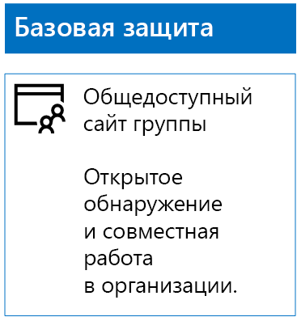
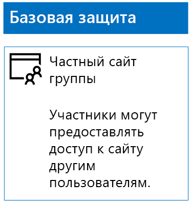
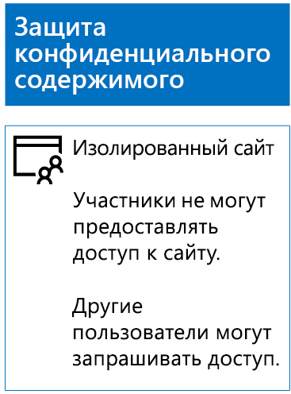
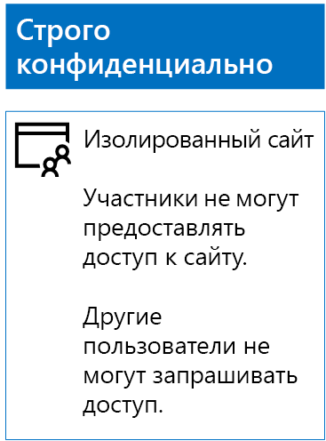

# Развертывание сайтов SharePoint Online для три уровня защитыDeploy SharePoint Online sites for three tiers of protection

 **Сводка:** Создание и настройка SharePoint Online сайты рабочих групп для различных уровнях защита информации.**Summary:** Create and configure SharePoint Online team sites for various levels of information protection.
  
В этой статье приводятся инструкции по разработке и развертыванию сайтов групп SharePoint Online с базовым, конфиденциальным и строго конфиденциальным уровнями защиты. Дополнительные сведения об этих трех уровнях защиты см. в статье [Secure SharePoint Online sites and files](secure-sharepoint-online-sites-and-files.md) (Защита сайтов и файлов SharePoint Online).Use the steps in this article to design and deploy baseline, sensitive, and highly confidential SharePoint Online team sites. For more information about these three tiers of protection, see [Secure SharePoint Online sites and files](secure-sharepoint-online-sites-and-files.md).
  
## Сайты групп SharePoint Online с базовым уровнем защитыBaseline SharePoint Online team sites

Базовый уровень защиты распространяется на частные и общедоступные сайты групп. Обнаруживать общедоступные сайты групп и получать к ним доступ может любой пользователь в организации. Обнаруживать частные сайты и получать к ним доступ могут только участники группы Office 365, связанной с сайтом группы. Оба этих типа сайтов групп позволяют участникам предоставлять доступ к сайту другим пользователям.Baseline protection includes both public and private team sites. Public team sites can be discovered and accessed by anybody in the organization. Private sites can only be discovered and accessed by members of the Office 365 group associated with the team site. Both of these types of team sites allow members to share the site with others.
  
### ОткрытыйPublic

Чтобы создать сайт группы SharePoint Online с базовым уровнем защиты и общим доступом и разрешениями, выполните приведенные далее действия.To create a baseline SharePoint Online team site with public access and permissions, do the following:
  
1. Войдите в портал Office 365 с использованием учетной записи, которая также будет использоваться для администрирования SharePoint Online сайта группы (администратору SharePoint Online). Дополнительные сведения см [Where для входа в Office 365](https://support.office.com/Article/Where-to-sign-in-to-Office-365-e9eb7d51-5430-4929-91ab-6157c5a050b4).Sign in to the Office 365 portal with an account that will also be used to administer the SharePoint Online team site (a SharePoint Online administrator). For help, see [Where to sign in to Office 365](https://support.office.com/Article/Where-to-sign-in-to-Office-365-e9eb7d51-5430-4929-91ab-6157c5a050b4).
    
2. В списке плиток выберите **SharePoint**.In the list of tiles, click **SharePoint**.
    
3. На новой вкладке **SharePoint** в браузере щелкните **+ Создать сайт**.On the new **SharePoint** tab in your browser, click **+ Create site**.
    
4. На странице **Создание сайта** щелкните **Сайт группы**.On the **Create a site** page, click **Team site**.
    
5. В поле **Имя сайта** введите имя для открытого сайта группы.In **Site name**, type a name for the public team site. 
    
6. В поле **Описание сайта группы** введите описание назначения сайта.In **Team site description**, type a description of the purpose of the site.
    
7. В **Параметры конфиденциальности**выберите **общедоступный - всем пользователям в организации доступ к этому узлу**и нажмите кнопку **Далее**.In **Privacy settings**, select **Public - anyone in the organization can access this site**, and then click **Next**.
    
8. В области **Who do you want to add?** (Кого нужно добавить?) нажмите кнопку **Готово**.On the **Who do you want to add?** pane, click **Finish**.
    
Ниже показана результирующая конфигурация.Here is your resulting configuration.
  

  
### PrivatePrivate

Чтобы создать сайт группы SharePoint Online с базовым уровнем защиты и закрытым доступом и разрешениями, выполните приведенные далее действия.To create a baseline SharePoint Online team site with private access and permissions, do the following:
  
1. Войдите в портал Office 365 с использованием учетной записи, которая также будет использоваться для администрирования SharePoint Online сайта группы (администратору SharePoint Online). Дополнительные сведения см [Where для входа в Office 365](https://support.office.com/Article/Where-to-sign-in-to-Office-365-e9eb7d51-5430-4929-91ab-6157c5a050b4).Sign in to the Office 365 portal with an account that will also be used to administer the SharePoint Online team site (a SharePoint Online administrator). For help, see [Where to sign in to Office 365](https://support.office.com/Article/Where-to-sign-in-to-Office-365-e9eb7d51-5430-4929-91ab-6157c5a050b4).
    
2. В списке плиток выберите **SharePoint**.In the list of tiles, click **SharePoint**.
    
3. На новой вкладке **SharePoint** в браузере щелкните **+ Создать сайт**.On the new **SharePoint** tab in your browser, click **+ Create site**.
    
4. На странице **Создание сайта** щелкните **Сайт группы**.On the **Create a site** page, click **Team site**.
    
5. В поле **Имя сайта** введите имя для частного сайта группы.In **Site name**, type a name for the private team site. 
    
6. В **поле Описание сайта группы** введите описание назначения сайта.In **Team site description,** type a description of the purpose of the site.
    
7. В **Параметры конфиденциальности**, выберите **частный — только для членов можно получить доступ к этот сайт**и нажмите кнопку **Далее**.In **Privacy settings**, select **Private - only members can access this site**, and then click **Next**.
    
8. В области **Who do you want to add?** (Кого нужно добавить?) в поле **Добавить участников** введите имена учетных записей пользователей, имеющих доступ к этому частному сайту группы.On the **Who do you want to add?** pane, in **Add members**, type the names of user accounts that have access to this private team site.
    
9. После добавления к узлу начальный набор элементов нажмите кнопку **Готово**When you are done adding the initial set of members to the site, click **Finish**
    
Ниже показана результирующая конфигурация.Here is your resulting configuration.
  

  
## Сайты групп SharePoint Online с конфиденциальным уровнем защитыSensitive SharePoint Online team sites

Конфиденциальный сайт группы SharePoint Online — это изолированный сайт группы, разрешения на доступ к которому определяются членством в группах SharePoint, а не в группе Office 365, связанной с этим сайтом группы.A sensitive SharePoint Online team site is an isolated team site, which means that permissions are controlled through membership in SharePoint groups instead of membership in the Office 365 group associated with the team site.
  
Есть два основных этапа создания изолированного сайта группы.To create an isolated team site, there are two main steps.
  
### Этап 1. Создание изолированного сайтаStep 1: Design your isolated site

Чтобы разработать изолированный сайт группы, необходимо определить:To design your isolated team site, you need to determine:
  
- Определите группы SharePoint и уровни разрешений.Your SharePoint groups and permission levels.
    
- Определите набор групп доступа, которые будут членами групп SharePoint.The set of access groups that will be members of your SharePoint groups.
    
     Рекомендуемый набор групп доступа — один для участников сайта, средства просмотра сайтов и Администраторы сайта.The recommended set of access groups is one for site members, one for site viewers, and one for site administrators.
    
- Будут ли использоваться вложенные группы внутри групп доступа.Whether you will use nested groups within your access groups.
    
Например, рекомендуемая структура групп и уровни разрешений выглядят следующим образом.For example, the recommended group structure and permission levels look like this:
  
|**Группа SharePoint****SharePoint group**|**Уровень разрешений****Permission level**|**Группа доступа (примеры)****Access group (examples)**|
|:-----|:-----|:-----|
|[имя сайта] — участники[site name] Members    |ПравкаEdit    |[имя сайта] — участники[site name] Members    |
|[имя сайта] — посетители[site name] Visitors    |ЧтениеRead    |[имя сайта] — посетители[site name] Viewers    |
|[имя сайта] — владельцы[site name] Owners    |Полный доступFull control    |[имя сайта] — администраторы[site name] Admins    |
   
Группы и уровни разрешений SharePoint создаются по умолчанию для сайта группы. Необходимо определить имена групп доступа.The SharePoint groups and permission levels are created by default for a team site. You need to determine the names of your access groups.
  
Сведения о процессе разработки см. в статье [Design an isolated SharePoint Online team site](design-an-isolated-sharepoint-online-team-site.md) (Разработка изолированного сайта группы SharePoint Online).For the details of the design process, see [Design an isolated SharePoint Online team site](design-an-isolated-sharepoint-online-team-site.md).
  
### Шаг 2. Развертывание изолированного сайтаStep 2: Deploy your isolated site

Для развертывания изолированного сайта сначала необходимо:To deploy your isolated site, you first need to:
  
- определить учетные записи пользователей и группы пользователей для добавления в каждую группу доступа;Determine the user accounts and groups to add to each of your access groups.
    
- создать группы доступа и добавить пользователей и членов групп.Create the access groups and add the user and group members.
    
Подробные инструкции см. в разделе **Этап 1** статьи [Deploy an isolated SharePoint Online team site](deploy-an-isolated-sharepoint-online-team-site.md) (Развертывание изолированного сайта группы SharePoint Online).For the detailed steps, see **Phase 1** of [Deploy an isolated SharePoint Online team site](deploy-an-isolated-sharepoint-online-team-site.md).
  
Далее следует создать сайт группы SharePoint Online, следуя приведенным ниже инструкциям.Next, you create the SharePoint Online team site with these steps.
  
1. Войдите в портал Office 365 с использованием учетной записи, которая также будет использоваться для администрирования SharePoint Online сайта группы (администратору SharePoint Online). Дополнительные сведения см [Where для входа в Office 365](https://support.office.com/Article/Where-to-sign-in-to-Office-365-e9eb7d51-5430-4929-91ab-6157c5a050b4).Sign in to the Office 365 portal with an account that will also be used to administer the SharePoint Online team site (a SharePoint Online administrator). For help, see [Where to sign in to Office 365](https://support.office.com/Article/Where-to-sign-in-to-Office-365-e9eb7d51-5430-4929-91ab-6157c5a050b4).
    
2. В списке плиток выберите **SharePoint**.In the list of tiles, click **SharePoint**.
    
3. На вкладке **SharePoint** нового окна браузера нажмите кнопку **+ Создание сайта**.In the new **SharePoint** tab of your browser, click **+ Create site**.
    
4. На странице **Создание сайта** щелкните **Сайт группы**.On the **Create a site** page, click **Team site**.
    
5. В поле **Имя сайта** введите имя для частного сайта группы.In **Site name**, type a name for the private team site.
    
6. В поле **Описание сайта группы**введите дополнительное описание.In **Team site description**, type an optional description.
    
7. В **Параметры конфиденциальности**, выберите **частный — только для членов можно получить доступ к этот сайт**и нажмите кнопку **Далее**.In **Privacy settings**, select **Private - only members can access this site**, and then click **Next**.
    
8. В области **Who do you want to add?** (Кого нужно добавить?) нажмите кнопку **Готово**.On the **Who do you want to add?** pane, click **Finish**.
    
На новом сайте группы SharePoint Online настройте разрешения, выполнив описанные ниже действия.Next, from the new SharePoint Online team site, configure permissions with these steps.
  
1. Определите имя участника-пользователя (UPN) для ИТ-администратора или другого человека, который будет обрабатывать запросы на получение доступа к сайту и отвечать на них (reginap@contoso.com — пример имени участника-пользователя). Напишите это имя участника-пользователя здесь: _________________________________________.Determine the User Principal Name (UPN) of the IT administrator or other person who will be responsible for responding to and addressing requests for access to the site (belindan@contoso.com is an example of a UPN). Write that UPN here: _________________________________________.
    
2. В панели инструментов щелкните значок параметры и нажмите кнопку **разрешения для сайта**.In the tool bar, click the settings icon, and then click **Site permissions**.
    
3. В области **Разрешения для сайта** щелкните **Дополнительные параметры разрешений**.In the **Site permissions** pane, click **Advanced permissions settings**.
    
4. На новой вкладке браузера **Разрешения** щелкните **Параметры запроса доступа**.On the new **Permissions** tab of your browser, click **Access Request Settings**.
    
5. В диалоговом окне **Параметры запросов доступа**:In the **Access Requests Settings** dialog box:
    
  - Снимите флажки **Разрешить участникам совместный доступ к этому сайту, а также отдельным файлам и папкам** и **Разрешить участникам приглашать других пользователей в группу участников сайта**.Clear the **Allow members to share the site and individual files and folders** and **Allow members to invite others to the site members group** check boxes.
    
  - В поле **Отправлять все запросы на доступ** введите имя UPN ИТ-администратора из шага 1.Type the UPN of your IT administrator from step 1 in **Send all requests for access**.
    
  - Нажмите кнопку **ОК**.Click **OK**.
    
6. На вкладке браузера **Разрешения** в списке выберите **[имя сайта] — участники**.On the **Permissions** tab of your browser, click **[site name] Members** in the list.
    
7. **Пользователи и группы**нажмите кнопку **Создать**.In **People and Groups**, click **New**.
    
8. В диалоговом окне **общий доступ** введите имя вашей доступа группы участников сайта для этого сайта, выберите его и нажмите кнопку **общий доступ**.In the **Share** dialog box, type the name of your site members access group for this site, select it, and then click **Share**.
    
9. Нажмите кнопку "Назад" в браузере.Click the back button on your browser.
    
10. В списке выберите **владельцев [имя сайта]** .Click **[site name] Owners** in the list.
    
11. **Пользователи и группы**нажмите кнопку **Создать**.In **People and Groups**, click **New**.
    
12. В диалоговом окне **общий доступ** введите имя группы доступа администраторов сайтов для данного узла, выберите его и нажмите кнопку **общий доступ**.In the **Share** dialog box, type the name of the site administrators access group for this site, select it, and then click **Share**.
    
13. Нажмите кнопку "Назад" в браузере.Click the back button on your browser.
    
14. В списке выберите **посетители [имя сайта]** .Click **[site name] Visitors** in the list.
    
15. **Пользователи и группы**нажмите кнопку **Создать**.In **People and Groups**, click **New**.
    
16. В диалоговом окне **общий доступ** введите имя группы доступа средства просмотра сайта для этого сайта, выберите его и нажмите кнопку **общий доступ**.In the **Share** dialog box, type the name of the site viewers access group for this site, select it, and then click **Share**.
    
17. Закройте вкладку браузера **Разрешения**.Close the **Permissions** tab of your browser.
    
Ознакомьтесь с результатами настройки разрешений.The results of these permission settings are:
  
- Группа SharePoint **[имя сайта] — владельцы** содержит группу доступа администраторов сайта, в которой все участники имеют уровень разрешений **Полный доступ**.The **[site name] Owners** SharePoint group contains the site administrators access group, in which all the members have the **Full control** permission level.
    
- Группа SharePoint **[имя сайта] — участники** содержит группу доступа участников сайта, в которой все участники имеют уровень разрешений **Изменение**.The **[site name] Members** SharePoint group contains the site members access group, in which all the members have the **Edit** permission level.
    
- Группа SharePoint **[имя сайта] — посетители** содержит группу доступа посетителей сайта, в которой все участники имеют уровень разрешений **Чтение**.The **[site name] Visitors** SharePoint group contains the site viewers access group, in which all the members have the **Read** permission level.
    
- Для участников отключена возможность приглашать других участников.The ability for members to invite other members is disabled.
    
- Для пользователей, не являющихся участниками, включена возможность запроса доступа.The ability for non-members to request access is enabled.
    
Ниже показана результирующая конфигурация.Here is your resulting configuration.
  

  
Благодаря членству в одной из групп доступа участники сайта теперь могут безопасно работать с ресурсами сайта.The members of the site, through group membership in one of the access groups, can now securely collaborate on the resources of the site.
  
## Сайты групп SharePoint Online со строго конфиденциальным уровнем защитыHighly confidential SharePoint Online team sites

Сайт группы SharePoint Online со строго конфиденциальным уровнем защиты является изолированным сайтом группы. Это означает, что управление разрешениями осуществляется за счет членства в группах SharePoint, а не членства в группе Office 365, связанной с сайтом группы.A highly confidential SharePoint Online team site is an isolated team site, which means that permissions are controlled through membership in SharePoint groups instead of membership in the Office 365 group associated with the team site.
  
Создание изолированного сайта для строго конфиденциальных данных и совместной работы выполняется в два основных этапа.To create an isolated team site for highly confidential information and collaboration, there are two main steps.
  
### Шаг 1. Разработка изолированного сайтаStep 1: Design your isolated site

Чтобы разработать изолированный сайт группы, необходимо определить:To design your isolated team site, you need to determine:
  
- Определите группы SharePoint и уровни разрешений.Your SharePoint groups and permission levels.
    
- Определите набор групп доступа, которые будут членами групп SharePoint.The set of access groups that will be members of your SharePoint groups.
    
     Рекомендуемый набор групп доступа — один для участников сайта, средства просмотра сайтов и Администраторы сайта.The recommended set of access groups is one for site members, one for site viewers, and one for site administrators.
    
- Будут ли использоваться вложенные группы внутри групп доступа.Whether you will use nested groups within your access groups.
    
Например, рекомендуемая структура групп и уровни разрешений выглядят следующим образом.For example, the recommended group structure and permission levels look like this:
  
|**Группа SharePoint****SharePoint group**|**Уровень разрешений****Permission level**|**Группа доступа (примеры)****Access group (examples)**|
|:-----|:-----|:-----|
|[имя сайта] — участники[site name] Members    |ПравкаEdit    |[имя сайта] — участники[site name] Members    |
|[имя сайта] — посетители[site name] Visitors    |ЧтениеRead    |[имя сайта] — посетители[site name] Viewers    |
|[имя сайта] — владельцы[site name] Owners    |Полный доступFull control    |[имя сайта] — администраторы[site name] Admins    |
   
Группы и уровни разрешений SharePoint создаются по умолчанию для сайта группы. Необходимо определить имена групп доступа.The SharePoint groups and permission levels are created by default for a team site. You need to determine the names of your access groups.
  
Сведения о процессе разработки см. в статье [Design an isolated SharePoint Online team site](design-an-isolated-sharepoint-online-team-site.md) (Разработка изолированного сайта группы SharePoint Online).For the details of the design process, see [Design an isolated SharePoint Online team site](design-an-isolated-sharepoint-online-team-site.md).
  
### Шаг 2. Развертывание изолированного сайтаStep 2: Deploy your isolated site

Для развертывания изолированного сайта необходимо сперва выполнить следующее:To deploy your isolated site, you first need to:
  
- Определить пользователя и членов каждой из групп доступа.Determine the user and group members of each of your access groups
    
- Создать группы доступа и добавить пользователя и членов группы.Create the access groups and add the user and group members
    
- Создать изолированный сайт группы, для которого используются группы доступа.Create an isolated team site that uses your access groups
    
Подробные инструкции см. в статье [Deploy an isolated SharePoint Online team site](deploy-an-isolated-sharepoint-online-team-site.md) (Развертывание изолированного сайта группы SharePoint Online).For the detailed steps, see [Deploy an isolated SharePoint Online team site](deploy-an-isolated-sharepoint-online-team-site.md).
  
Ниже приведены результаты настройки разрешений.The results of the permission settings are:
  
- Группа SharePoint **[имя сайта] — владельцы** содержит группу доступа администраторов сайта, в которой все участники имеют уровень разрешений **Полный доступ**.The **[site name] Owners** SharePoint group contains the site administrators access group, in which all the members have the **Full control** permission level.
    
- Группа SharePoint **[имя сайта] — участники** содержит группу доступа участников сайта, в которой все участники имеют уровень разрешений **Изменение**.The **[site name] Members** SharePoint group contains the site members access group, in which all the members have the **Edit** permission level.
    
- Группа SharePoint **[имя сайта] — посетители** содержит группу доступа посетителей сайта, в которой все участники имеют уровень разрешений **Чтение**.The **[site name] Visitors** SharePoint group contains the site viewers access group, in which all the members have the **Read** permission level.
    
- Для участников отключена возможность приглашать других участников.The ability for members to invite other members is disabled.
    
- Для пользователей, не являющихся участниками, отключена возможность запроса доступа.The ability for non-members to request access is disabled.
    
Ниже показана результирующая конфигурация.Here is your resulting configuration.
  

  
Благодаря членству в одной из групп доступа участники сайта теперь могут совместно работать над ресурсами сайта, соблюдая требования безопасности.The members of the site, through group membership in one of the access groups, can now securely collaborate on the resources of the site.
  
## Следующий этапNext step

[Защита файлов SharePoint Online с помощью Office 365 метки и защиты от потери данныхProtect SharePoint Online files with Office 365 labels and DLP](protect-sharepoint-online-files-with-office-365-labels-and-dlp.md)
    
## См. такжеSee Also

[Безопасность сайтов и файлов SharePoint OnlineSecure SharePoint Online sites and files](secure-sharepoint-online-sites-and-files.md)
  
[Защита сайтов SharePoint Online в среде разработки и тестированияSecure SharePoint Online sites in a dev/test environment](secure-sharepoint-online-sites-in-a-dev-test-environment.md)
  
[Руководство по безопасности (Майкрософт) для политических кампаний, некоммерческих и других динамических организацийMicrosoft Security Guidance for Political Campaigns, Nonprofits, and Other Agile Organizations](microsoft-security-guidance-for-political-campaigns-nonprofits-and-other-agile-o.md)
  
[Освоение облака и гибридные решенияCloud adoption and hybrid solutions](cloud-adoption-and-hybrid-solutions.md)

