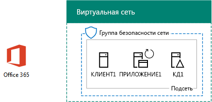

# <a name="dirsync-for-your-office-365-devtest-environment"></a><span data-ttu-id="a6b25-103">DirSync для среды разработки и тестирования Office 365</span><span class="sxs-lookup"><span data-stu-id="a6b25-103">DirSync for your Office 365 dev/test environment</span></span>

 <span data-ttu-id="a6b25-104">**Сводка:** Настройка синхронизации каталогов для Office 365 dev/тестовой среды.</span><span class="sxs-lookup"><span data-stu-id="a6b25-104">**Summary:** Configure directory synchronization for your Office 365 dev/test environment.</span></span>
  
<span data-ttu-id="a6b25-p101">Во многих организациях используют Azure AD Connect и средство синхронизации службы каталогов (DirSync), чтобы синхронизировать набор учетных записей в локальном лесу Windows Server Active Directory (AD) с учетными записями в Office 365. В этой статье описывается добавление DirSync с синхронизацией паролей в среду тестирования и разработки Office 365, в результате чего получается следующая конфигурация:</span><span class="sxs-lookup"><span data-stu-id="a6b25-p101">Many organizations use Azure AD Connect and directory synchronization (DirSync) to synchronize the set of accounts in their on-premises Windows Server Active Directory (AD) forest to the set of accounts in Office 365. This article describes how you can add DirSync with password synchronization to the Office 365 dev/test environment, resulting in the following configuration.</span></span>
  

  
<span data-ttu-id="a6b25-108">Конфигурация состоит из следующих компонентов: </span><span class="sxs-lookup"><span data-stu-id="a6b25-108">This configuration consists of:</span></span> 
  
- <span data-ttu-id="a6b25-109">Пробная подписка Office 365 E5, которая действительна в течение 30 дней с момента создания.</span><span class="sxs-lookup"><span data-stu-id="a6b25-109">An Office 365 E5 Trial Subscription, which expires 30 days from when you create it.</span></span>
    
- <span data-ttu-id="a6b25-p102">Упрощенная интрасеть организации, подключенная к Интернету и состоящая из трех виртуальных машин в подсети виртуальной сети Azure (DC1, APP1 и CLIENT1). Azure AD Connect работает на компьютере APP1 для синхронизации домена Windows Server AD с Office 365.</span><span class="sxs-lookup"><span data-stu-id="a6b25-p102">A simplified organization intranet connected to the Internet, consisting of three virtual machines on a subnet of an Azure virtual network (DC1, APP1, and CLIENT1). Azure AD Connect runs on APP1 to synchronize the Windows Server AD domain to Office 365.</span></span>
    
<span data-ttu-id="a6b25-112">Процесс настройки этой среды разработки и тестирования состоит из двух указанных ниже основных этапов.</span><span class="sxs-lookup"><span data-stu-id="a6b25-112">There are two phases to setting up this dev/test environment:</span></span>
  
1. <span data-ttu-id="a6b25-113">Создание среды разработки и тестирования Office 365 (виртуальных машин DC1, APP1 и CLIENT1 в виртуальной сети Azure с пробной подпиской Office 365 E5).</span><span class="sxs-lookup"><span data-stu-id="a6b25-113">Create the Office 365 dev/test environment (the DC1, APP1, and CLIENT1 virtual machines in an Azure virtual network with an Office 365 E5 trial subscription).</span></span>
    
2. <span data-ttu-id="a6b25-114">Установка и настройка Azure AD Connect на компьютере APP1.</span><span class="sxs-lookup"><span data-stu-id="a6b25-114">Install and configure Azure AD Connect on APP1.</span></span>
    
> [!TIP]
> <span data-ttu-id="a6b25-115">Щелкните [здесь](http://aka.ms/catlgstack), чтобы просмотреть схему всех статей, относящихся к руководствам по лаборатории тестирования Microsoft Cloud.</span><span class="sxs-lookup"><span data-stu-id="a6b25-115">Click [here](http://aka.ms/catlgstack) for a visual map to all the articles in the One Microsoft Cloud Test Lab Guide stack.</span></span>
  
## <a name="phase-1-create-an-office-365-devtest-environment"></a><span data-ttu-id="a6b25-116">Этап 1. Создание среды разработки и тестирования Office 365</span><span class="sxs-lookup"><span data-stu-id="a6b25-116">Phase 1: Create an Office 365 dev/test environment</span></span>

<span data-ttu-id="a6b25-p103">Следуйте инструкциям в этапа 1, 2 и 3 в статье [Office 365 dev/тестовой среды](office-365-dev-test-environment.md) . Вот Результирующая конфигурация.</span><span class="sxs-lookup"><span data-stu-id="a6b25-p103">Follow the instructions in phases 1, 2, and 3 of the [Office 365 dev/test environment](office-365-dev-test-environment.md) article. Here is the resulting configuration.</span></span>
  

  
<span data-ttu-id="a6b25-120">Конфигурация состоит из следующих компонентов: </span><span class="sxs-lookup"><span data-stu-id="a6b25-120">This configuration consists of:</span></span> 
  
- <span data-ttu-id="a6b25-121">Пробная подписка на Office 365 E5.</span><span class="sxs-lookup"><span data-stu-id="a6b25-121">An Office 365 E5 Trial Subscription.</span></span>
    
- <span data-ttu-id="a6b25-122">Упрощенная интрасеть организации, подключенная к Интернету и состоящая из виртуальных машин DC1, APP1 и CLIENT1 в подсети, входящей в виртуальную сеть Azure.</span><span class="sxs-lookup"><span data-stu-id="a6b25-122">A simplified organization intranet connected to the Internet, consisting of the DC1, APP1, and CLIENT1 virtual machines on a subnet of an Azure virtual network.</span></span>
    
## <a name="phase-2-install-azure-ad-connect-on-app1"></a><span data-ttu-id="a6b25-123">Этап 2. Установка Azure AD Connect на компьютере APP1</span><span class="sxs-lookup"><span data-stu-id="a6b25-123">Phase 2: Install Azure AD Connect on APP1</span></span>

<span data-ttu-id="a6b25-p104">После установки и настройки Azure AD Connect синхронизирует набор учетных записей на домене Windows Server AD CORP с учетными записями в пробной подписке Office 365. Описанная ниже процедура поможет вам установить средство Azure AD Connect на компьютере APP1 и убедиться, что оно работает.</span><span class="sxs-lookup"><span data-stu-id="a6b25-p104">Once installed and configured, Azure AD Connect synchronizes the set of accounts in the CORP Windows Server AD domain with the set of accounts in your Office 365 trial subscription. The following procedure steps you through installing Azure AD Connect on APP1 and verifying that it works.</span></span>
  
### <a name="install-and-configure-azure-ad-connect-on-app1"></a><span data-ttu-id="a6b25-126">Установка и настройка Azure AD подключение на APP1</span><span class="sxs-lookup"><span data-stu-id="a6b25-126">Install and configure Azure AD Connect on APP1</span></span>

1. <span data-ttu-id="a6b25-127">С [Azure портала](https://portal.azure.com), подключиться к APP1 с CORP\\учетной записи User1.</span><span class="sxs-lookup"><span data-stu-id="a6b25-127">From the [Azure portal](https://portal.azure.com), connect to APP1 with the CORP\\User1 account.</span></span>
    
2. <span data-ttu-id="a6b25-128">В виртуальной машине APP1 откройте командную строку Windows PowerShell с правами администратора и выполните следующие команды:</span><span class="sxs-lookup"><span data-stu-id="a6b25-128">From APP1, open an administrator-level Windows PowerShell command prompt, and then run these commands:</span></span>
    
  ```
  Set-ItemProperty -Path "HKLM:\\SOFTWARE\\Microsoft\\Active Setup\\Installed Components\\{A509B1A7-37EF-4b3f-8CFC-4F3A74704073}" -Name "IsInstalled" -Value 0
Set-ItemProperty -Path "HKLM:\\SOFTWARE\\Microsoft\\Active Setup\\Installed Components\\{A509B1A8-37EF-4b3f-8CFC-4F3A74704073}" -Name "IsInstalled" -Value 0
Stop-Process -Name Explorer -Force

  ```

3. <span data-ttu-id="a6b25-129">На панели задач нажмите кнопку **Internet Explorer** и перейдите к [https://aka.ms/aadconnect](https://aka.ms/aadconnect).</span><span class="sxs-lookup"><span data-stu-id="a6b25-129">From the task bar, click **Internet Explorer** and go to [https://aka.ms/aadconnect](https://aka.ms/aadconnect).</span></span>
    
4. <span data-ttu-id="a6b25-130">На странице Microsoft Azure Active Directory подключения нажмите кнопку **загрузить**и нажмите кнопку **Запуск**.</span><span class="sxs-lookup"><span data-stu-id="a6b25-130">On the Microsoft Azure Active Directory Connect page, click **Download**, and then click **Run**.</span></span>
    
5. <span data-ttu-id="a6b25-131">На странице " **Добро пожаловать в Azure AD подключение** " нажмите кнопку **принимаю**и нажмите кнопку **Продолжить**.</span><span class="sxs-lookup"><span data-stu-id="a6b25-131">On the **Welcome to Azure AD Connect** page, click **I agree**, and then click **Continue**.</span></span>
    
6. <span data-ttu-id="a6b25-132">На странице " **Быстрая** " щелкните **использовать параметры express**.</span><span class="sxs-lookup"><span data-stu-id="a6b25-132">On the **Express Settings** page, click **Use express settings**.</span></span>
    
7. <span data-ttu-id="a6b25-133">На странице " **подключение к Azure AD** " введите имя своей учетной записи глобального администратора в введите **имя пользователя,** пароль в поле **пароль**и нажмите кнопку **Далее**.</span><span class="sxs-lookup"><span data-stu-id="a6b25-133">On the **Connect to Azure AD** page, type your global administrator account name in **Username,** type its password in **Password**, and then click **Next**.</span></span>
    
8. <span data-ttu-id="a6b25-134">На странице **подключение к Доменные службы Active Directory** введите **CORP\\User1** в поле **имя пользователя** введите свой пароль в поле **пароль**и нажмите кнопку **Далее**.</span><span class="sxs-lookup"><span data-stu-id="a6b25-134">On the **Connect to AD DS** page, type **CORP\\User1** in **Username,** type its password in **Password**, and then click **Next**.</span></span>
    
9. <span data-ttu-id="a6b25-135">На странице " **Конфигурация входа в Azure AD** " нажмите кнопку **Продолжить без подтвержденным домены**и нажмите кнопку **Далее**.</span><span class="sxs-lookup"><span data-stu-id="a6b25-135">On the **Azure AD sign-in configuration** page, click **Continue without any verified domains**, and then click **Next**.</span></span>
    
10. <span data-ttu-id="a6b25-136">На странице **Готово к настройке** нажмите кнопку **Установить**.</span><span class="sxs-lookup"><span data-stu-id="a6b25-136">On the **Ready to configure** page, click **Install**.</span></span>
    
11. <span data-ttu-id="a6b25-137">На странице " **Настройка завершена** " нажмите кнопку **Выход**.</span><span class="sxs-lookup"><span data-stu-id="a6b25-137">On the **Configuration complete** page, click **Exit**.</span></span>
    
12. <span data-ttu-id="a6b25-138">В Internet Explorer перейдите к порталу Office 365 ([https://portal.office.com](https://portal.office.com)) и войдите пробной подписки Office 365 с учетной записью глобального администратора.</span><span class="sxs-lookup"><span data-stu-id="a6b25-138">In Internet Explorer, go to the Office 365 portal ([https://portal.office.com](https://portal.office.com)) and sign in to your Office 365 trial subscription with your global administrator account.</span></span>
    
13. <span data-ttu-id="a6b25-139">На главной странице портала щелкните **Администратор**.</span><span class="sxs-lookup"><span data-stu-id="a6b25-139">From the main portal page, click **Admin**.</span></span>
    
14. <span data-ttu-id="a6b25-140">На панели навигации слева выберите элементы **Пользователи > Активные пользователи**.</span><span class="sxs-lookup"><span data-stu-id="a6b25-140">In the left navigation, click **Users > Active users**.</span></span>
    
    <span data-ttu-id="a6b25-p105">Запомните учетную запись с именем **User1**. Эта учетная запись является из домена CORP Windows Server AD и обоснования работавших DirSync.</span><span class="sxs-lookup"><span data-stu-id="a6b25-p105">Note the account named **User1**. This account is from the CORP Windows Server AD domain and is proof that DirSync has worked.</span></span>
    
15. <span data-ttu-id="a6b25-p106">Нажмите кнопку учетной записи **User1** . Для лицензий на продукт нажмите кнопку **Изменить**.</span><span class="sxs-lookup"><span data-stu-id="a6b25-p106">Click the **User1** account. For product licenses, click **Edit**.</span></span>
    
16. <span data-ttu-id="a6b25-p107">В **лицензий на продукт**выберите страну и нажмите кнопку управления **Off** для **Office 365 корпоративный E5** (переключение к **на**). Нажмите кнопку **Сохранить** в нижней части страницы и нажмите кнопку **Закрыть**.</span><span class="sxs-lookup"><span data-stu-id="a6b25-p107">In **Product licenses**, select your country, and then click the **Off** control for **Office 365 Enterprise E5** (switching it to **On**). Click **Save** at the bottom of the page, and then click **Close**.</span></span>
    
<span data-ttu-id="a6b25-147">Ниже показана итоговая конфигурация.</span><span class="sxs-lookup"><span data-stu-id="a6b25-147">This is the resulting configuration.</span></span>
  

  
<span data-ttu-id="a6b25-149">Конфигурация состоит из следующих компонентов: </span><span class="sxs-lookup"><span data-stu-id="a6b25-149">This configuration consists of:</span></span> 
  
- <span data-ttu-id="a6b25-150">Пробная подписка на Office 365 E5.</span><span class="sxs-lookup"><span data-stu-id="a6b25-150">An Office 365 E5 Trial Subscription.</span></span>
    
- <span data-ttu-id="a6b25-p108">Упрощенная интрасеть организации, подключенная к Интернету и состоящая из виртуальных машин DC1, APP1 и CLIENT1 в подсети, входящей в виртуальную сеть Azure. Azure AD Connect работает на компьютере APP1 для синхронизации домена Windows Server AD CORP с Office 365 каждые 30 минут.</span><span class="sxs-lookup"><span data-stu-id="a6b25-p108">A simplified organization intranet connected to the Internet, consisting of the DC1, APP1, and CLIENT1 virtual machines on a subnet of an Azure virtual network. Azure AD Connect runs on APP1 to synchronize the CORP Windows Server AD domain to Office 365 every 30 minutes.</span></span>
    
## <a name="next-step"></a><span data-ttu-id="a6b25-153">Следующий шаг</span><span class="sxs-lookup"><span data-stu-id="a6b25-153">Next Step</span></span>

<span data-ttu-id="a6b25-154">Если вы готовы к развертыванию DirSync для вашей организации, видеть [Развертывание Office 365 синхронизации каталогов (DirSync) в Microsoft Azure](deploy-office-365-directory-synchronization-dirsync-in-microsoft-azure.md).</span><span class="sxs-lookup"><span data-stu-id="a6b25-154">When you are ready to deploy DirSync for your organization, see [Deploy Office 365 Directory Synchronization (DirSync) in Microsoft Azure](deploy-office-365-directory-synchronization-dirsync-in-microsoft-azure.md).</span></span>

## <a name="see-also"></a><span data-ttu-id="a6b25-155">См. также</span><span class="sxs-lookup"><span data-stu-id="a6b25-155">See Also</span></span>

[<span data-ttu-id="a6b25-156">Руководства по лаборатории тестирования для принятия облачных решений</span><span class="sxs-lookup"><span data-stu-id="a6b25-156">Cloud adoption Test Lab Guides (TLGs)</span></span>](cloud-adoption-test-lab-guides-tlgs.md)
  
[<span data-ttu-id="a6b25-157">Базовая конфигурация среды разработки и тестирования</span><span class="sxs-lookup"><span data-stu-id="a6b25-157">Base Configuration dev/test environment</span></span>](base-configuration-dev-test-environment.md)
  
[<span data-ttu-id="a6b25-158">Среда разработки и тестирования Office 365</span><span class="sxs-lookup"><span data-stu-id="a6b25-158">Office 365 dev/test environment</span></span>](office-365-dev-test-environment.md)
  
[<span data-ttu-id="a6b25-159">Облако безопасности приложения для Office 365 dev/тестовой среды</span><span class="sxs-lookup"><span data-stu-id="a6b25-159">Cloud App Security for your Office 365 dev/test environment</span></span>](cloud-app-security-for-your-office-365-dev-test-environment.md)
  
[<span data-ttu-id="a6b25-160">Дополнительные защиту от угроз для вашей среды разработки или тестирования Office 365</span><span class="sxs-lookup"><span data-stu-id="a6b25-160">Advanced Threat Protection for your Office 365 dev/test environment</span></span>](advanced-threat-protection-for-your-office-365-dev-test-environment.md)
  
[<span data-ttu-id="a6b25-161">Освоение облака и гибридные решения</span><span class="sxs-lookup"><span data-stu-id="a6b25-161">Cloud adoption and hybrid solutions</span></span>](cloud-adoption-and-hybrid-solutions.md)


