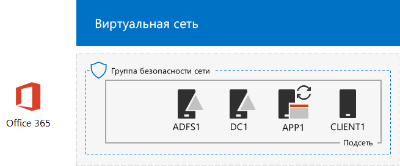

# <a name="federated-identity-for-your-office-365-devtest-environment"></a>Федеративная идентификация для среды разработки и тестирования Office 365

 **Сводка.** Сведения о настройке федеративной аутентификации для среды разработки и тестирования Office 365.
  
Office 365 поддерживает федеративную идентификацию. Это означает, что Office 365 не проверяет непосредственно учетные данные, а направляет подключающегося пользователя на федеративный сервер аутентификации, которому доверяет. Если учетные данные пользователя правильны, сервер федеративной аутентификации выдает токен безопасности, который клиент затем отправляет в Office 365 как доказательство аутентификации. Федеративная идентификация позволяет разгрузить и масштабировать аутентификацию для подписки на Office 365, а также реализовать расширенные сценарии аутентификации и безопасности.
  
В этой статье описано, как можно настроить федеративную аутентификацию для среды разработки и тестирования Office 365, чтобы получить представленную ниже конфигурацию.
  
**Рис. 1. Федеративная аутентификация для среды разработки и тестирования Office 365**


  
В состав конфигурации, показанной на рисунке 1, входит: 
  
- Пробная подписка Office 365 E5, которая действительна в течение 30 дней с момента создания.
    
- Упрощенная интрасеть организации, подключенная к Интернету и состоящая из пяти виртуальных машин в подсети виртуальной сети Azure (DC1, APP1, CLIENT1, ADFS1 и PROXY1). Azure AD Connect работает на APP1 для синхронизации списка учетных записей в домене доменных служб Active Directory с Office 365. PROXY1 получает входящие запросы аутентификации. ADFS1 проверяет учетные данные с помощью DC1 и выдает маркеры безопасности.
    
Настройка этой среды разработки и тестирования состоит из пяти указанных ниже этапов.
  
1. Создание среды разработки и тестирования Office 365 для условного предприятия с DirSync.
    
2. Создание сервера AD FS (ADFS1).
    
3. Создание веб-прокси-сервера (PROXY1).
    
4. Создание самозаверяющего сертификата и настройка ADFS1 и PROXY1.
    
5. Настройка федеративной идентификации для Office 365.
    
Сведения о том, как выполнить в Azure развертывание федеративной проверки подлинности для рабочей среды Office 365, см. в статье [Deploy high availability federated authentication for Office 365 in Azure](deploy-high-availability-federated-authentication-for-office-365-in-azure.md).
  
> [!NOTE]
> Эту среду разработки и тестирования невозможно настроить, имея пробную подписку на Azure. 
  
> [!TIP]
> Щелкните [здесь](http://aka.ms/catlgstack), чтобы просмотреть схему всех статей, относящихся к руководствам по лаборатории тестирования в Office 365.
  
## <a name="phase-1-create-the-simulated-enterprise-office-365-devtest-environment-with-dirsync"></a>Этап 1. Создание среды разработки и тестирования Office 365 для условного предприятия с DirSync

Следуйте инструкциям в статье [Синхронизация службы каталогов для среды разработки и тестирования Office 365](dirsync-for-your-office-365-dev-test-environment.md), чтобы создать среду разработки и тестирования Office 365 для условного предприятия, где APP1 выступает в качестве сервера DirSync и предусмотрена синхронизация идентификации между Office 365 и учетными записями AD DS на DC1.
  
Затем создайте новое общедоступное доменное имя DNS на основе текущего и добавьте его в подписку на Office 365. Рекомендуем использовать имя **testlab.**\<ваш_общедоступный_домен>. Например, если как имя общедоступного домена используется contoso.com, добавьте имя testlab.contoso.com.
  
Сведения о том, как создать правильные записи DNS в поставщике DNS и добавить домен в пробную подписку на Office 365, см. в статье [Добавление домена и пользователей в Office 365](https://support.office.com/article/Add-users-and-domain-to-Office-365-6383f56d-3d09-4dcb-9b41-b5f5a5efd611). 
  
Ниже показана полученная в итоге конфигурация.
  
**Рис. 2. Синхронизация каталога для среды разработки и тестирования Office 365**


  
На рисунке 2 показана синхронизация службы каталогов для среды разработки и тестирования Office 365, которая включает Office 365 и виртуальные машины CLIENT1, APP1 и DC1 в виртуальной сети Azure.
  
## <a name="phase-2-create-the-ad-fs-server"></a>Этап 2. Создание сервера AD FS

Сервер AD FS обеспечивает федеративную аутентификацию между Office 365 и учетными записями в домене corp.contoso.com, размещенном на DC1.
  
Чтобы создать виртуальную машину Azure для ADFS1, укажите имя своей подписки, группы ресурсов и расположение Azure для базовой конфигурации, а затем выполните указанные ниже команды в командной строке Azure PowerShell на локальном компьютере.
  
```
$subscrName="<your Azure subscription name>"
$rgName="<the resource group name of your Base Configuration>"
$vnetName="TlgBaseConfig-01-VNET"
# NOTE: If you built your simulated intranet with Azure PowerShell, comment the previous line with a "#" and remove the "#" from the next line.
#$vnetName="TestLab"
Connect-AzAccount
Select-AzSubscription -SubscriptionName $subscrName
$staticIP="10.0.0.100"
$locName=(Get-AzResourceGroup -Name $rgName).Location
$vnet=Get-AzVirtualNetwork -Name $vnetName -ResourceGroupName $rgName
$pip = New-AzPublicIpAddress -Name ADFS1-PIP -ResourceGroupName $rgName -Location $locName -AllocationMethod Dynamic
$nic = New-AzNetworkInterface -Name ADFS1-NIC -ResourceGroupName $rgName -Location $locName -SubnetId $vnet.Subnets[0].Id -PublicIpAddressId $pip.Id -PrivateIpAddress $staticIP
$vm=New-AzVMConfig -VMName ADFS1 -VMSize Standard_D2_v2
$cred=Get-Credential -Message "Type the name and password of the local administrator account for ADFS1."
$vm=Set-AzVMOperatingSystem -VM $vm -Windows -ComputerName ADFS1 -Credential $cred -ProvisionVMAgent -EnableAutoUpdate
$vm=Set-AzVMSourceImage -VM $vm -PublisherName MicrosoftWindowsServer -Offer WindowsServer -Skus 2016-Datacenter -Version "latest"
$vm=Add-AzVMNetworkInterface -VM $vm -Id $nic.Id
$vm=Set-AzVMOSDisk -VM $vm -Name "ADFS-OS" -DiskSizeInGB 128 -CreateOption FromImage -StorageAccountType "Standard_LRS"
New-AzVM -ResourceGroupName $rgName -Location $locName -VM $vm
```
<!--
> [!TIP]
> Click [here](https://gallery.technet.microsoft.com/PowerShell-commands-for-f79bc2c2?redir=0) for a text file that has all the PowerShell commands in this article.
-->
  
После этого на [портале Azure](http://portal.azure.com) подключитесь к виртуальной машине ADFS1, используя имя и пароль учетной записи локального администратора ADFS1. Затем откройте командную строку Windows PowerShell.
  
Чтобы проверить разрешение имен и сетевое подключение между ADFS1 и DC1, выполните команду **ping dc1.corp.contoso.com** и убедитесь, что поступило четыре ответа.
  
Далее присоедините виртуальную машину ADFS1 к домену CORP, выполнив указанные ниже команды в командной строке Windows PowerShell на ADFS1.
  
```
$cred=Get-Credential -UserName "CORP\User1" -Message "Type the User1 account password."
Add-Computer -DomainName corp.contoso.com -Credential $cred
Restart-Computer
```

Ниже показана полученная в итоге конфигурация.
  
**Рис. 3. Добавление сервера AD FS**


  
На рисунке 3 показано добавление сервера ADFS1 в DirSync для среды разработки и тестирования Office 365.
  
## <a name="phase-3-create-the-web-proxy-server"></a>Этап 3. Создание веб-прокси-сервера

PROXY1 обеспечивает передачу сообщений аутентификации через прокси-соединения между подключающимися пользователями и ADFS1.
  
Чтобы создать виртуальную машину Azure для PROXY1, укажите имя группы ресурсов, расположение Azure, а затем выполните указанные ниже команды в командной строке Azure PowerShell на локальном компьютере.
  
```
$rgName="<the resource group name of your Base Configuration>"
$vnetName="TlgBaseConfig-01-VNET"
# NOTE: If you built your simulated intranet with Azure PowerShell, comment the previous line with a "#" and remove the "#" from the next line.
#$vnetName="TestLab"
$staticIP="10.0.0.101"
$locName=(Get-AzResourceGroup -Name $rgName).Location
$vnet=Get-AzVirtualNetwork -Name $vnetName -ResourceGroupName $rgName
$pip = New-AzPublicIpAddress -Name PROXY1-PIP -ResourceGroupName $rgName -Location $locName -AllocationMethod Static
$nic = New-AzNetworkInterface -Name PROXY1-NIC -ResourceGroupName $rgName -Location $locName -SubnetId $vnet.Subnets[0].Id -PublicIpAddressId $pip.Id -PrivateIpAddress $staticIP
$vm=New-AzVMConfig -VMName PROXY1 -VMSize Standard_D2_v2
$cred=Get-Credential -Message "Type the name and password of the local administrator account for PROXY1."
$vm=Set-AzVMOperatingSystem -VM $vm -Windows -ComputerName PROXY1 -Credential $cred -ProvisionVMAgent -EnableAutoUpdate
$vm=Set-AzVMSourceImage -VM $vm -PublisherName MicrosoftWindowsServer -Offer WindowsServer -Skus 2016-Datacenter -Version "latest"
$vm=Add-AzVMNetworkInterface -VM $vm -Id $nic.Id
$vm=Set-AzVMOSDisk -VM $vm -Name "PROXY1-OS" -DiskSizeInGB 128 -CreateOption FromImage -StorageAccountType "Standard_LRS"
New-AzVM -ResourceGroupName $rgName -Location $locName -VM $vm
```

> [!NOTE]
> Машине PROXY1 присваивается статический общедоступный IP-адрес, который не должен меняться при перезапуске виртуальной машины PROXY1, так как на него указывает созданная вами общедоступная запись DNS. 
  
После этого добавьте правило в группу безопасности сети для подсети CorpNet, чтобы разрешить прием не запрошенного входящего трафика из Интернета на частный IP-адрес и TCP-порт 443 машины PROXY1. Выполните эти команды в командной строке Azure PowerShell на локальном компьютере.
  
```
$rgName="<the resource group name of your Base Configuration>"
Get-AzNetworkSecurityGroup -Name CorpNet -ResourceGroupName $rgName | Add-AzNetworkSecurityRuleConfig -Name "HTTPS-to-PROXY1" -Description "Allow TCP 443 to PROXY1" -Access "Allow" -Protocol "Tcp" -Direction "Inbound" -Priority 101 -SourceAddressPrefix "Internet" -SourcePortRange "*" -DestinationAddressPrefix "10.0.0.101" -DestinationPortRange "443" | Set-AzNetworkSecurityGroup
```

После этого подключитесь к виртуальной машине PROXY1 на [портале Azure](http://portal.azure.com), используя имя и пароль учетной записи локального администратора PROXY1. Затем откройте командную строку Windows PowerShell на PROXY1.
  
Чтобы проверить разрешение имен и сетевое подключение между PROXY1 и DC1, выполните команду **ping dc1.corp.contoso.com** и убедитесь, что поступило четыре ответа.
  
Далее присоедините виртуальную машину PROXY1 к домену CORP, выполнив указанные ниже команды в командной строке Windows PowerShell на PROXY1.
  
```
$cred=Get-Credential -UserName "CORP\User1" -Message "Type the User1 account password."
Add-Computer -DomainName corp.contoso.com -Credential $cred
Restart-Computer
```

Выведите на экран общедоступный IP-адрес PROXY1 с помощью этих команд Azure PowerShell на локальном компьютере:
  
```
Write-Host (Get-AzPublicIpaddress -Name "PROXY1-PIP" -ResourceGroup $rgName).IPAddress
```

После этого обратитесь к своему поставщику общедоступных DNS и создайте запись A для имени **fs.testlab.**\<доменное_имя_DNS>, которая разрешается в IP-адрес, отображаемый командой **Write-Host**. Имя **fs.testlab.**\<доменное_имя_DNS> далее именуется *FQDN службы федерации*.
  
После этого воспользуйтесь учетными данными CORP\\User1 на [портале Azure](http://portal.azure.com), чтобы подключиться к виртуальной машине DC1, а затем выполните следующие команды в командной строке Windows PowerShell, открытой от имени администратора:
  
```
Add-DnsServerPrimaryZone -Name corp.contoso.com -ZoneFile corp.contoso.com.dns
Add-DnsServerResourceRecordA -Name "fs" -ZoneName corp.contoso.com -AllowUpdateAny -IPv4Address "10.0.0.100" -TimeToLive 01:00:00
```
Эти команды создают внутреннюю запись DNS A, чтобы виртуальные машины в виртуальной сети Azure могли превращать внутреннее полное доменное имя в частный IP-адрес ADFS1.
  
Ниже показана итоговая конфигурация.
  
**Рис. 4. Добавление прокси-сервера веб-приложений**


  
На рисунке 4 показано добавление сервера PROXY1.
  
## <a name="phase-4-create-a-self-signed-certificate-and-configure-adfs1-and-proxy1"></a>Этап 4. Создание самозаверяющего сертификата и настройка ADFS1 и PROXY1

На этом этапе создается самозаверяющий цифровой сертификат для полного доменного имени службы федерации и настраиваются ADFS1 и PROXY1 как ферма AD FS.
  
Сначала подключитесь к виртуальной машине DC1 на [портале Azure](http://portal.azure.com), используя учетные данные CORP\\User1, а затем откройте командную строку Windows PowerShell от имени администратора. 
  
После этого создайте на DC1 учетную запись службы AD FS с помощью этой команды в командной строке Windows PowerShell:
  
```
New-ADUser -SamAccountName ADFS-Service -AccountPassword (read-host "Set user password" -assecurestring) -name "ADFS-Service" -enabled $true -PasswordNeverExpires $true -ChangePasswordAtLogon $false
```

Обратите внимание, что при выполнении этой команды вам будет предложено ввести пароль учетной записи. Выберите надежный пароль и запишите его в безопасном месте. Он понадобится вам на текущем этапе и на этапе 5.
  
Подключитесь к виртуальной машине ADFS1 на [портале Azure](http://portal.azure.com), используя учетные данные CORP\\User1. Откройте командную строку Windows PowerShell на ADFS1 от имени администратора, введите FQDN службы федерации и выполните следующие команды для создания самозаверяющего сертификата:
  
```
$fedServiceFQDN="<federation service FQDN>"
New-SelfSignedCertificate -DnsName $fedServiceFQDN -CertStoreLocation "cert:\LocalMachine\My"
New-Item -path c:\Certs -type directory
New-SmbShare -name Certs -path c:\Certs -changeaccess CORP\User1
```

После этого выполните указанные ниже действия, чтобы сохранить новый самозаверяющий сертификат в виде файла.
  
1. Нажмите кнопку **Пуск**, введите **mmc.exe** и нажмите клавишу **ВВОД**.
    
2. Выберите **Файл > Добавить или удалить оснастку**.
    
3. В окне **Добавление или удаление оснасток** дважды щелкните пункт **Сертификаты** в списке доступных оснасток, выберите пункт **Учетная запись компьютера** и нажмите кнопку **Далее**.
    
4. В окне **Выбор компьютера** последовательно нажмите кнопки **Готово** и **ОК**.
    
5. В области дерева выберите **Сертификаты (локальный компьютер) > Личное > Сертификаты**.
    
6. Щелкните правой кнопкой мыши сертификат с FQDN службы федерации, выберите **Все задачи**, а затем нажмите **Экспорт**.
    
7. На странице **Добро пожаловать** нажмите кнопку **Далее**.
    
8. На странице **Экспортирование закрытого ключа** последовательно нажмите кнопки **Да** и **Далее**.
    
9. На странице **Формат экспортируемого файла** выберите **Экспортировать все расширенные свойства** и нажмите кнопку **Далее**.
    
10. На странице **Безопасность** выберите элемент **Пароль** и введите пароль в поля **Пароль** и **Подтвердите пароль**.
    
11. На странице **Имя экспортируемого файла** нажмите **Обзор**.
    
12. Перейдите в папку **C:\\Certs**, введите **SSL** в поле **Имя файла** и нажмите кнопку **Сохранить**.
    
13. На странице **Имя экспортируемого файла** нажмите кнопку **Далее**.
    
14. На странице **Завершение работы мастера экспорта сертификатов** последовательно нажмите кнопки **Готово** и **ОК**.
    
После этого установите службу AD FS, выполнив следующую команду в командной строке Windows PowerShell на ADFS1:
  
```
Install-WindowsFeature ADFS-Federation -IncludeManagementTools
```

Дождитесь завершения установки.
  
После этого выполните указанные ниже действия, чтобы настроить службу AD FS.
  
1. Нажмите кнопку **Пуск** и выберите значок **Диспетчер серверов**.
    
2. В области дерева диспетчера серверов выберите **AD FS**.
    
3. На панели инструментов вверху нажмите оранжевый символ предупреждения и выберите **Настроить службу федерации на этом сервере**.
    
4. На странице **Добро пожаловать** в мастере настройки служб федерации Active Directory нажмите кнопку **Далее**.
    
5. На странице **Подключение к AD DS** нажмите кнопку **Далее**.
    
6. На странице **Настройка свойств службы**:
    
  - Щелкните стрелку вниз и выберите **SSL-сертификат** с FQDN службы федерации.
    
  - В окне **Отображаемое имя службы федерации** введите название вымышленной организации.
    
  - Нажмите кнопку **Далее**.
    
7. На странице **Выбор учетной записи службы** нажмите **Выбрать** для параметра **Имя учетной записи**.
    
8. В поле **Выберите пользователя или учетную запись службы** введите **ADFS-Service**, затем последовательно нажмите кнопки **Проверить имена** и **ОК**.
    
9. В поле **Пароль учетной записи** введите пароль для учетной записи ADFS-Service и нажмите кнопку **Далее**.
    
10. На странице **Выбор базы данных конфигурации** нажмите кнопку **Далее**.
    
11. На странице **Просмотр параметров** нажмите кнопку **Далее**.
    
12. На странице **Предварительные проверки** нажмите **Настроить**.
    
13. На странице **Результаты** нажмите **Закрыть**.
    
14. Нажмите кнопку **Пуск**, щелкните значок питания, выберите **Перезагрузка** и нажмите кнопку **Продолжить**.
    
Откройте [портал Azure](http://portal.azure.com) и подключитесь к PROXY1, используя учетные данные CORP\\User1.
  
После этого выполните указанные ниже действия, чтобы установить самозаверяющий сертификат и настроить PROXY1.
  
1. Нажмите кнопку **Пуск**, введите **mmc.exe** и нажмите клавишу **ВВОД**.
    
2. Выберите **Файл > Добавить или удалить оснастку**.
    
3. В окне **Добавление или удаление оснасток** дважды щелкните пункт **Сертификаты** в списке доступных оснасток, выберите пункт **Учетная запись компьютера** и нажмите кнопку **Далее**.
    
4. В окне **Выбор компьютера** последовательно нажмите кнопки **Готово** и **ОК**.
    
5. В области дерева выберите **Сертификаты (локальный компьютер) > Личное > Сертификаты**.
    
6. Щелкните правой кнопкой пункт **Личное** и выберите **Все задачи** > **Импорт**.
    
7. На странице **Добро пожаловать** нажмите кнопку **Далее**.
    
8. На странице **Имя импортируемого файла** введите **\\\\adfs1\\certs\\ssl.pfx** и нажмите кнопку **Далее**.
    
9. На странице **Защита с помощью закрытого ключа** введите пароль сертификата в поле **Пароль** и нажмите кнопку **Далее**.
    
10. На странице **Хранилище сертификатов** нажмите кнопку **Далее**.
    
11. На странице **Завершение** нажмите кнопку **Готово**.
    
12. На странице **Хранилище сертификатов** нажмите кнопку **Далее**.
    
13. Нажмите кнопку **ОК**.
    
14. Выберите **Сертификаты** в области дерева.
    
15. Щелкните сертификат правой кнопкой мыши и выберите **Копировать**.
    
16. В области дерева выберите **Доверенные корневые центры сертификации > Сертификаты**.
    
17. Щелкните правой кнопкой мыши под списком установленных сертификатов и выберите **Вставить**.
    
Откройте командную строку администратора PowerShell и выполните следующую команду:
  
```
Install-WindowsFeature Web-Application-Proxy -IncludeManagementTools
```

Дождитесь завершения установки.
  
Сделайте так, чтобы прокси-служба веб-приложения использовала ADFS1 в качестве сервера федерации:
  
1. Нажмите кнопку **Пуск** и выберите пункт **Диспетчер серверов**.
    
2. В области дерева выберите **Удаленный доступ**.
    
3. На панели инструментов вверху нажмите оранжевый символ предупреждения и выберите **Открытие мастера прокси веб-приложения**.
    
4. На странице **Добро пожаловать** в мастере настройки прокси веб-приложений нажмите кнопку **Далее**.
    
5. На странице **Сервер федерации**:
    
  - Введите FQDN службы федерации в поле **Имя службы федерации**.
    
  - Введите **CORP\\User1** в поле **Имя пользователя**.
    
  - Введите пароль для учетной записи User1 в поле **Пароль**.
    
  - Нажмите кнопку **Далее**.
    
6. На странице **Сертификат прокси-сервера AD FS** щелкните стрелку вниз, выберите сертификат с FQDN службы федерации и нажмите кнопку **Далее**.
    
7. На странице **Подтверждение** нажмите **Настроить**.
    
8. На странице **Результаты** нажмите **Закрыть**.
    
## <a name="phase-5-configure-office-365-for-federated-identity"></a>Этап 5. Настройка федеративной идентификации для Office 365

Используйте учетные данные CORP\\User1 на [портале Azure](http://portal.azure.com), чтобы подключиться к виртуальной машине APP1.
  
Выполните следующие действия, чтобы настроить федеративную аутентификацию для Azure AD Connect и подписки на Office 365:
  
1. На рабочем столе дважды щелкните значок **Azure AD Connect**.
    
2. На странице **Вас приветствует Azure AD Connect** нажмите **Настроить**.
    
3. На странице **Дополнительные задачи** выберите **Смена имени пользователя для входа** и нажмите кнопку **Далее**.
    
4. На странице **Подключение к Azure AD** введите имя и пароль учетной записи глобального администратора Office 365 и нажмите кнопку **Далее**.
    
5. На странице **Вход пользователя** выберите **Федерация с AD FS** и нажмите кнопку **Далее**.
    
6. На странице **Ферма AD FS** выберите **Использовать существующую ферму AD FS**, введите **ADFS1** в поле **Имя сервера** и нажмите кнопку **Далее**.
    
7. Введите учетные данные учетной записи CORP\\User1 и нажмите кнопку **ОК**.
    
8. На странице учетных записей **Администратор домена** введите **CORP\\User1** в поле **Имя пользователя** и пароль учетной записи в поле **Пароль**, затем нажмите кнопку **Далее**.
    
9. На странице **Учетная запись службы AD FS** введите **CORP\\ADFS-Service** в поле **Имя пользователя домена** и пароль учетной записи в поле **Пароль пользователя домена**, затем нажмите кнопку **Далее**.
    
10. На странице **Домен Azure AD**, в поле **Домен**, выберите имя домена, созданного и добавленного в подписку на Office 365 на этапе 1 и нажмите кнопку **Далее**.
    
11. На странице **Готово к настройке** нажмите кнопку **Настроить**.
    
12. На странице **Установка завершена** нажмите **Проверить**.
    
    Появятся сообщения о том, что конфигурации интрасети и Интернета проверены.
    
13. На странице **Установка завершена** нажмите **Выход**.
    
Действия для демонстрации работы федеративной аутентификации:
  
1. Откройте новый частный экземпляр браузера на локальном компьютере и перейдите по адресу [https://admin.microsoft.com](https://admin.microsoft.com).
    
2. Войдите с помощью учетных данных **user1@**\<домен, созданный на этапе 1>.  
    
    Например, если тестовый домен — **testlab.contoso.com**, необходимо ввести "user1@testlab.contoso.com". Нажмите клавишу TAB и подождите, пока Office 365 не перенаправит вас автоматически.
    
    Вы увидите страницу **Подключение не является частным**, потому что установили самозаверяющий сертификат на ADFS1, который ваш компьютер не может проверить. В рабочем развертывании федеративной аутентификации будет использоваться сертификат из доверенного центра сертификации, и эта страница не будет появляться.
    
3. На странице **Подключение не является частным** нажмите **Дополнительно**, а затем нажмите **Перейти к \<FQDN_службы_федерации**.  
    
4. На странице с именем вымышленной организации войдите с помощью следующих учетных данных:
    
  - имя **CORP\\User1**;
    
  - пароль учетной записи User1.
    
    Откроется **Домашняя страница Microsoft Office**.
    
Эта процедура демонстрирует, что между пробной подпиской на Office 365 и доменом AD DS corp.contoso.com, размещенным на DC1, настроена федеративная аутентификация. Вот основные принципы процесса аутентификации:
  
1. Когда вы используете федеративный домен, созданный на этапе 1, в имени учетной записи для входа, Office 365 перенаправляет ваш браузер на полное доменное имя службы федерации и PROXY1.
    
2. PROXY1 направляет локальный компьютер на страницу входа вымышленной организации.
    
3. Когда вы отправляете имя CORP\\User1 и пароль на PROXY1, сервер пересылает эти данные на ADFS1.
    
4. ADFS1 проверяет имя CORP\\User1 и пароль с помощью DC1 и отправляет на локальный компьютер токен безопасности.
    
5. Локальный компьютер отправляет токен безопасности в Office 365.
    
6. Office 365 проверяет, действительно ли маркер безопасности создан на ADFS1, и разрешает доступ.
    
Теперь для вашей пробной подписки на Office 365 настроена федеративная аутентификация. Вы можете использовать эту среду разработки и тестирования для расширенных сценариев аутентификации.
  
## <a name="next-step"></a>Следующий этап

Сведения о том, как выполнить в Azure развертывание федеративной проверки подлинности с высокой доступностью для рабочей среды Office 365, см. в статье [Deploy high availability federated authentication for Office 365 in Azure](deploy-high-availability-federated-authentication-for-office-365-in-azure.md).
  
## <a name="see-also"></a>См. также

[Руководства по созданию сред разработки и тестирования облачных решений](cloud-adoption-test-lab-guides-tlgs.md)
  
[Базовая конфигурация среды разработки и тестирования](base-configuration-dev-test-environment.md)
  
[Среда разработки и тестирования Office 365](office-365-dev-test-environment.md)
  
[Освоение облака и гибридные решения](cloud-adoption-and-hybrid-solutions.md)
  
[Развертывание федеративной проверки подлинности для обеспечения высокой доступности Office 365 в Azure](deploy-high-availability-federated-authentication-for-office-365-in-azure.md)


