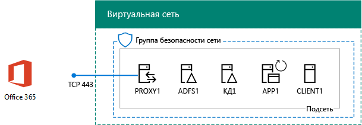
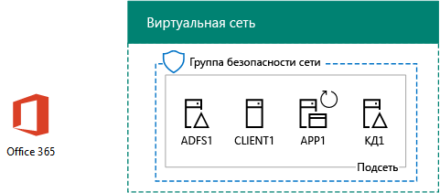

# <a name="federated-identity-for-your-office-365-devtest-environment"></a><span data-ttu-id="6139d-103">Федеративное удостоверение для среды разработки и тестирования Office 365</span><span class="sxs-lookup"><span data-stu-id="6139d-103">Federated identity for your Office 365 dev/test environment</span></span>

 <span data-ttu-id="6139d-104">**Сводка:** Настройка федеративной проверки подлинности для среды разработки и тестирования Office 365.</span><span class="sxs-lookup"><span data-stu-id="6139d-104">**Summary:** Configure federated authentication for your Office 365 dev/test environment.</span></span>
  
<span data-ttu-id="6139d-p101">Office 365 поддерживает федеративных удостоверений. Это означает, что вместо самого выполнения проверки учетные данные Office 365 ссылается подключающегося пользователя федеративной проверки подлинности сервера, на котором отношения доверия с Office 365. Если правильны ли учетные данные пользователя, федеративной проверки подлинности сервер выдает маркер безопасности, затем клиент передает в Office 365 как доказательство проверки подлинности. Федеративное удостоверение позволяет разгрузки и вертикального масштабирования проверки подлинности для подписки на Office 365 и сложных сценариев проверки подлинности и безопасности.</span><span class="sxs-lookup"><span data-stu-id="6139d-p101">Office 365 supports federated identity. This means that instead of performing the validation of credentials itself, Office 365 refers the connecting user to a federated authentication server that Office 365 trusts. If the user's credentials are correct, the federated authentication server issues a security token that the client then sends to Office 365 as proof of authentication. Federated identity allows for the offloading and scaling up of authentication for an Office 365 subscription and advanced authentication and security scenarios.</span></span>
  
<span data-ttu-id="6139d-109">В этой статье описано, как можно настроить федеративную аутентификацию для среды разработки и тестирования Office 365, чтобы получить представленную ниже конфигурацию.</span><span class="sxs-lookup"><span data-stu-id="6139d-109">This article describes how you can configure federated authentication for the Office 365 dev/test environment, resulting in the following:</span></span>
  
<span data-ttu-id="6139d-110">**На рисунке 1: Федеративной проверки подлинности для Office 365 dev/тестовой среды**</span><span class="sxs-lookup"><span data-stu-id="6139d-110">**Figure 1: The federated authentication for Office 365 dev/test environment**</span></span>


  
<span data-ttu-id="6139d-112">В состав конфигурации, показанной на рисунке 1, входит: </span><span class="sxs-lookup"><span data-stu-id="6139d-112">The configuration shown in Figure 1 consists of:</span></span> 
  
- <span data-ttu-id="6139d-113">Пробная подписка Office 365 E5, которая действительна в течение 30 дней с момента создания.</span><span class="sxs-lookup"><span data-stu-id="6139d-113">An Office 365 E5 Trial Subscription, which expires 30 days from when you create it.</span></span>
    
- <span data-ttu-id="6139d-p102">Упрощенная интрасеть организации, подключенная к Интернету и состоящая из пяти виртуальных машин в подсети виртуальной сети Azure (DC1, APP1, CLIENT1, ADFS1 и PROXY1). Azure AD Connect работает на APP1 для синхронизации списка учетных записей в домене Windows Server AD с Office 365. PROXY1 получает входящие запросы аутентификации. ADFS1 проверяет учетные данные с помощью DC1 и выдает маркеры безопасности.</span><span class="sxs-lookup"><span data-stu-id="6139d-p102">A simplified organization intranet connected to the Internet, consisting of five virtual machines on a subnet of an Azure virtual network (DC1, APP1, CLIENT1, ADFS1, and PROXY1). Azure AD Connect runs on APP1 to synchronize the list of accounts in the Windows Server AD domain to Office 365. PROXY1 receives the incoming authentication requests. ADFS1 validates credentials with DC1 and issues security tokens.</span></span>
    
<span data-ttu-id="6139d-118">Настройка этой среды разработки и тестирования состоит из пяти указанных ниже этапов.</span><span class="sxs-lookup"><span data-stu-id="6139d-118">There are five phases to setting up this dev/test environment:</span></span>
  
1. <span data-ttu-id="6139d-119">Создание среды разработки и тестирования Office 365 для условного предприятия с DirSync.</span><span class="sxs-lookup"><span data-stu-id="6139d-119">Create the simulated enterprise Office 365 dev/test environment with DirSync.</span></span>
    
2. <span data-ttu-id="6139d-120">Создание сервера AD FS (ADFS1).</span><span class="sxs-lookup"><span data-stu-id="6139d-120">Create the AD FS server (ADFS1).</span></span>
    
3. <span data-ttu-id="6139d-121">Создание веб-прокси-сервера (PROXY1).</span><span class="sxs-lookup"><span data-stu-id="6139d-121">Create the web proxy server (PROXY1).</span></span>
    
4. <span data-ttu-id="6139d-122">Создание самозаверяющего сертификата и настройка ADFS1 и PROXY1.</span><span class="sxs-lookup"><span data-stu-id="6139d-122">Create a self-signed certificate and configure ADFS1 and PROXY1.</span></span>
    
5. <span data-ttu-id="6139d-123">Настройка федеративной идентификации для Office 365.</span><span class="sxs-lookup"><span data-stu-id="6139d-123">Configure Office 365 for federated identity.</span></span>
    
<span data-ttu-id="6139d-124">Пошаговое выполнение рабочее развертывание федеративной проверки подлинности для Office 365 в Azure видеть [Развертывание высокой доступности федеративной проверки подлинности для Office 365 в Azure](deploy-high-availability-federated-authentication-for-office-365-in-azure.md).</span><span class="sxs-lookup"><span data-stu-id="6139d-124">To step through a production deployment of federated authentication for Office 365 in Azure, see [Deploy high availability federated authentication for Office 365 in Azure](deploy-high-availability-federated-authentication-for-office-365-in-azure.md).</span></span>
  
> [!NOTE]
> <span data-ttu-id="6139d-125">Эту среду разработки и тестирования невозможно настроить, имея пробную подписку Azure.</span><span class="sxs-lookup"><span data-stu-id="6139d-125">You cannot configure this dev/test environment with an Azure Trial subscription.</span></span> 
  
> [!TIP]
> <span data-ttu-id="6139d-126">Щелкните [здесь](http://aka.ms/catlgstack), чтобы просмотреть схему всех статей, относящихся к руководствам по лаборатории тестирования Microsoft Cloud.</span><span class="sxs-lookup"><span data-stu-id="6139d-126">Click [here](http://aka.ms/catlgstack) for a visual map to all the articles in the One Microsoft Cloud Test Lab Guide stack.</span></span>
  
## <a name="phase-1-create-the-simulated-enterprise-office-365-devtest-environment-with-dirsync"></a><span data-ttu-id="6139d-127">Этап 1. Создание среды разработки и тестирования Office 365 для условного предприятия с DirSync</span><span class="sxs-lookup"><span data-stu-id="6139d-127">Phase 1: Create the simulated enterprise Office 365 dev/test environment with DirSync</span></span>

<span data-ttu-id="6139d-128">Следуйте инструкциям в [DirSync для вашей среды разработки или тестирования Office 365](dirsync-for-your-office-365-dev-test-environment.md) для создания среды разработки и тестирования имитации enterprise Office 365 с APP1 как сервер синхронизации каталогов и синхронизированного удостоверения в Office 365 и Windows Server AD учетные записи на DC1.</span><span class="sxs-lookup"><span data-stu-id="6139d-128">Follow the instructions in [DirSync for your Office 365 dev/test environment](dirsync-for-your-office-365-dev-test-environment.md) to create the simulated enterprise Office 365 dev/test environment with APP1 as the DirSync server and synchronized identity between Office 365 and the Windows Server AD accounts on DC1.</span></span>
  
<span data-ttu-id="6139d-p103">Затем создание нового общедоступных DNS-имени домена на основании текущей доменное имя и добавить его в подписки Office 365. Рекомендуется использовать имя **Лаборатория тестирования.** \<общедоступного домена >. Например если ваше имя общедоступного домена contoso.com, добавьте testlab.contoso.com имя общедоступного домена.</span><span class="sxs-lookup"><span data-stu-id="6139d-p103">Next, create a new public DNS domain name based on your current domain name and add it to your Office 365 subscription. We recommend using the name **testlab.**\<your public domain>. For example, if your public domain name is contoso.com, add the public domain name testlab.contoso.com.</span></span>
  
<span data-ttu-id="6139d-132">Инструкции для создания правильных записей DNS в поставщике DNS и добавить домен пробной подписки Office 365 можно [Добавить пользователей и домен в Office 365](https://support.office.com/article/Add-users-and-domain-to-Office-365-6383f56d-3d09-4dcb-9b41-b5f5a5efd611).</span><span class="sxs-lookup"><span data-stu-id="6139d-132">For instructions on how to create the correct DNS records in your DNS provider and add the domain to your Office 365 trial subscription, see [Add users and domain to Office 365](https://support.office.com/article/Add-users-and-domain-to-Office-365-6383f56d-3d09-4dcb-9b41-b5f5a5efd611).</span></span> 
  
<span data-ttu-id="6139d-133">Ниже показана итоговая конфигурация.</span><span class="sxs-lookup"><span data-stu-id="6139d-133">Here is your resulting configuration.</span></span>
  
<span data-ttu-id="6139d-134">**На рисунке 2: DirSync для Office 365 dev/тестовой среды**</span><span class="sxs-lookup"><span data-stu-id="6139d-134">**Figure 2: DirSync for Office 365 dev/test environment**</span></span>


  
<span data-ttu-id="6139d-136">На рисунке 2 показано средство DirSync для среды разработки и тестирования Office 365, которая включает Office 365 и виртуальные машины CLIENT1, APP1 и DC1 в виртуальной сети Azure.</span><span class="sxs-lookup"><span data-stu-id="6139d-136">Figure 2 shows the DirSync for Office 365 dev/test environment, which includes Office 365 and CLIENT1, APP1, and DC1 virtual machines in an Azure virtual network.</span></span>
  
## <a name="phase-2-create-the-ad-fs-server"></a><span data-ttu-id="6139d-137">Этап 2. Создание сервера AD FS</span><span class="sxs-lookup"><span data-stu-id="6139d-137">Phase 2: Create the AD FS server</span></span>

<span data-ttu-id="6139d-138">Сервер AD FS обеспечивает федеративную аутентификацию между Office 365 и учетными записями в домене corp.contoso.com, размещенном на DC1.</span><span class="sxs-lookup"><span data-stu-id="6139d-138">An AD FS server provides federated authentication between Office 365 and the accounts in the corp.contoso.com domain hosted on DC1.</span></span>
  
<span data-ttu-id="6139d-139">Чтобы создать Azure виртуальной машины для ADFS1, заполните поля имя подписки и группы ресурсов и Azure расположение для базовой конфигурации и затем выполните следующие команды в командной строке Windows Azure PowerShell на локальном компьютере.</span><span class="sxs-lookup"><span data-stu-id="6139d-139">To create an Azure virtual machine for ADFS1, fill in the name of your subscription and the resource group and Azure location for your Base Configuration, and then run these commands at the Azure PowerShell command prompt on your local computer.</span></span>
  
```
$subscr="<your Azure subscription name>"
$rgName="<the resource group name of your Base Configuration>"
Login-AzureRMAccount
Get-AzureRmSubscription -SubscriptionName $subscr | Select-AzureRmSubscription
$staticIP="10.0.0.100"
$locName=(Get-AzureRmResourceGroup -Name $rgName).Location
$vnet=Get-AzureRMVirtualNetwork -Name TestLab -ResourceGroupName $rgName
$pip = New-AzureRMPublicIpAddress -Name ADFS1-PIP -ResourceGroupName $rgName -Location $locName -AllocationMethod Dynamic
$nic = New-AzureRMNetworkInterface -Name ADFS1-NIC -ResourceGroupName $rgName -Location $locName -SubnetId $vnet.Subnets[0].Id -PublicIpAddressId $pip.Id -PrivateIpAddress $staticIP
$vm=New-AzureRMVMConfig -VMName ADFS1 -VMSize Standard_D2_v2
$cred=Get-Credential -Message "Type the name and password of the local administrator account for ADFS1."
$vm=Set-AzureRMVMOperatingSystem -VM $vm -Windows -ComputerName ADFS1 -Credential $cred -ProvisionVMAgent -EnableAutoUpdate
$vm=Set-AzureRMVMSourceImage -VM $vm -PublisherName MicrosoftWindowsServer -Offer WindowsServer -Skus 2016-Datacenter -Version "latest"
$vm=Add-AzureRMVMNetworkInterface -VM $vm -Id $nic.Id
$vm=Set-AzureRmVMOSDisk -VM $vm -Name "ADFS-OS" -DiskSizeInGB 128 -CreateOption FromImage -StorageAccountType "StandardLRS"
New-AzureRMVM -ResourceGroupName $rgName -Location $locName -VM $vm
```

> [!TIP]
> <span data-ttu-id="6139d-140">Щелкните [здесь](https://gallery.technet.microsoft.com/PowerShell-commands-for-f79bc2c2?redir=0) для получения текстовый файл, содержащий все команды PowerShell в данной статье.</span><span class="sxs-lookup"><span data-stu-id="6139d-140">Click [here](https://gallery.technet.microsoft.com/PowerShell-commands-for-f79bc2c2?redir=0) to get a text file that contains all the PowerShell commands in this article.</span></span>
  
<span data-ttu-id="6139d-141">Затем используйте [Azure портала](http://portal.azure.com) для подключения к виртуальной машине ADFS1 ADFS1 имя учетной записи локального администратора и пароль и затем откройте командную строку Windows PowerShell.</span><span class="sxs-lookup"><span data-stu-id="6139d-141">Next, use the [Azure portal](http://portal.azure.com) to connect to the ADFS1 virtual machine using the ADFS1 local administrator account name and password, and then open a Windows PowerShell command prompt.</span></span>
  
<span data-ttu-id="6139d-142">Чтобы проверить имя разрешения и сети обмена данными между ADFS1 и DC1, выполните команду **ping dc1.corp.contoso.com** и убедитесь, что существует четыре ответа.</span><span class="sxs-lookup"><span data-stu-id="6139d-142">To check name resolution and network communication between ADFS1 and DC1, run the **ping dc1.corp.contoso.com** command and verify that there are four replies.</span></span>
  
<span data-ttu-id="6139d-143">Далее присоедините виртуальную машину ADFS1 к домену CORP, выполнив указанные ниже команды в командной строке Windows PowerShell на ADFS1.</span><span class="sxs-lookup"><span data-stu-id="6139d-143">Next, join the ADFS1 virtual machine to the CORP domain with these commands at the Windows PowerShell prompt on ADFS1.</span></span>
  
```
$cred=Get-Credential -UserName "CORP\\User1" -Message "Type the User1 account password."
Add-Computer -DomainName corp.contoso.com -Credential $cred
Restart-Computer
```

<span data-ttu-id="6139d-144">Ниже показана итоговая конфигурация.</span><span class="sxs-lookup"><span data-stu-id="6139d-144">Here is your resulting configuration.</span></span>
  
<span data-ttu-id="6139d-145">**На рисунке 3: Добавление сервера AD FS**</span><span class="sxs-lookup"><span data-stu-id="6139d-145">**Figure 3: Adding the AD FS server**</span></span>


  
<span data-ttu-id="6139d-147">На рисунке 3 показано добавление сервера ADFS1 в DirSync для среды разработки и тестирования Office 365.</span><span class="sxs-lookup"><span data-stu-id="6139d-147">Figure 3 shows the addition of the ADFS1 server to the DirSync for Office 365 dev/test environment.</span></span>
  
## <a name="phase-3-create-the-web-proxy-server"></a><span data-ttu-id="6139d-148">Этап 3. Создание веб-прокси-сервера</span><span class="sxs-lookup"><span data-stu-id="6139d-148">Phase 3: Create the web proxy server</span></span>

<span data-ttu-id="6139d-149">PROXY1 обеспечивает передачу сообщений аутентификации через прокси-соединения между подключающимися пользователями и ADFS1.</span><span class="sxs-lookup"><span data-stu-id="6139d-149">PROXY1 provides proxying of authentication messages between users attempting to authenticate and ADFS1.</span></span>
  
<span data-ttu-id="6139d-150">Чтобы создать виртуальную машину Azure для PROXY1, укажите имя группы ресурсов, расположение Azure, а затем выполните указанные ниже команды в командной строке Azure PowerShell на локальном компьютере.</span><span class="sxs-lookup"><span data-stu-id="6139d-150">To create an Azure virtual machine for PROXY1, fill in the name of your resource group and Azure location, and then run these commands at the Azure PowerShell command prompt on your local computer.</span></span>
  
```
$rgName="<the resource group name of your Base Configuration>"
$staticIP="10.0.0.101"
$locName=(Get-AzureRmResourceGroup -Name $rgName).Location
$vnet=Get-AzureRMVirtualNetwork -Name TestLab -ResourceGroupName $rgName
$pip = New-AzureRMPublicIpAddress -Name PROXY1-PIP -ResourceGroupName $rgName -Location $locName -AllocationMethod Static
$nic = New-AzureRMNetworkInterface -Name PROXY1-NIC -ResourceGroupName $rgName -Location $locName -SubnetId $vnet.Subnets[0].Id -PublicIpAddressId $pip.Id -PrivateIpAddress $staticIP
$vm=New-AzureRMVMConfig -VMName PROXY1 -VMSize Standard_D2_v2
$cred=Get-Credential -Message "Type the name and password of the local administrator account for PROXY1."
$vm=Set-AzureRMVMOperatingSystem -VM $vm -Windows -ComputerName PROXY1 -Credential $cred -ProvisionVMAgent -EnableAutoUpdate
$vm=Set-AzureRMVMSourceImage -VM $vm -PublisherName MicrosoftWindowsServer -Offer WindowsServer -Skus 2016-Datacenter -Version "latest"
$vm=Add-AzureRMVMNetworkInterface -VM $vm -Id $nic.Id
$vm=Set-AzureRmVMOSDisk -VM $vm -Name "PROXY1-OS" -DiskSizeInGB 128 -CreateOption FromImage -StorageAccountType "StandardLRS"
New-AzureRMVM -ResourceGroupName $rgName -Location $locName -VM $vm
```

> [!NOTE]
> <span data-ttu-id="6139d-151">Машине PROXY1 присваивается статический общедоступный IP-адрес, который не должен меняться при перезапуске виртуальной машины PROXY1, так как на него указывает созданная вами общедоступная запись DNS.</span><span class="sxs-lookup"><span data-stu-id="6139d-151">PROXY1 is assigned a static public IP address because you will create a public DNS record that points to it and it must not change when you restart the PROXY1 virtual machine.</span></span> 
  
<span data-ttu-id="6139d-p104">Добавьте правила в группу безопасности сети для подсети CorpNet разрешены незапрошенный входящий трафик из Интернета к PROXY1's частный IP-адрес и TCP-порт 443. Выполните следующие команды в командной строке Windows Azure PowerShell на локальном компьютере.</span><span class="sxs-lookup"><span data-stu-id="6139d-p104">Next, add a rule to the network security group for the CorpNet subnet to allow unsolicited inbound traffic from the Internet to PROXY1's private IP address and TCP port 443. Run these commands at the Azure PowerShell command prompt on your local computer.</span></span>
  
```
$rgName="<the resource group name of your Base Configuration>"
Get-AzureRmNetworkSecurityGroup -Name CorpNet -ResourceGroupName $rgName | Add-AzureRmNetworkSecurityRuleConfig -Name "HTTPS-to-PROXY1" -Description "Allow TCP 443 to PROXY1" -Access "Allow" -Protocol "Tcp" -Direction "Inbound" -Priority 101 -SourceAddressPrefix "Internet" -SourcePortRange "*" -DestinationAddressPrefix "10.0.0.101" -DestinationPortRange "443" | Set-AzureRmNetworkSecurityGroup
```

<span data-ttu-id="6139d-154">Далее используйте [Azure портала](http://portal.azure.com) для подключения к виртуальной машине PROXY1, с помощью учетной записи локального администратора PROXY1 имя и пароль, а затем откройте командную строку Windows PowerShell на PROXY1.</span><span class="sxs-lookup"><span data-stu-id="6139d-154">Next, use the [Azure portal](http://portal.azure.com) to connect to the PROXY1 virtual machine using the PROXY1 local administrator account name and password, and then open a Windows PowerShell command prompt on PROXY1.</span></span>
  
<span data-ttu-id="6139d-155">Чтобы проверить имя разрешения и сети обмена данными между PROXY1 и DC1, выполните команду **ping dc1.corp.contoso.com** и убедитесь, что существует четыре ответа.</span><span class="sxs-lookup"><span data-stu-id="6139d-155">To check name resolution and network communication between PROXY1 and DC1, run the **ping dc1.corp.contoso.com** command and verify that there are four replies.</span></span>
  
<span data-ttu-id="6139d-156">Далее присоедините виртуальную машину PROXY1 к домену CORP, выполнив указанные ниже команды в командной строке Windows PowerShell на PROXY1.</span><span class="sxs-lookup"><span data-stu-id="6139d-156">Next, join the PROXY1 virtual machine to the CORP domain with these commands at the Windows PowerShell prompt on PROXY1.</span></span>
  
```
$cred=Get-Credential -UserName "CORP\\User1" -Message "Type the User1 account password."
Add-Computer -DomainName corp.contoso.com -Credential $cred
Restart-Computer
```

<span data-ttu-id="6139d-157">Выведите на экран общедоступный IP-адрес PROXY1 с помощью этих команд Azure PowerShell на локальном компьютере:</span><span class="sxs-lookup"><span data-stu-id="6139d-157">Display the public IP address of PROXY1 with these Azure PowerShell commands on your local computer:</span></span>
  
```
Write-Host (Get-AzureRMPublicIpaddress -Name "PROXY1-PIP" -ResourceGroup $rgName).IPAddress
```

<span data-ttu-id="6139d-p105">Теперь работать с внешнему поставщику DNS и создания новой общей запись DNS A для **fs.testlab.** \<имени домена DNS >, которая разрешается в IP-адрес, командой **Write-Host** . **Fs.testlab.** \<имени домена DNS > Далее называется *службой федерации полное доменное имя* .</span><span class="sxs-lookup"><span data-stu-id="6139d-p105">Next, work with your public DNS provider and create a new public DNS A record for **fs.testlab.**\<your DNS domain name> that resolves to the IP address displayed by the **Write-Host** command. The **fs.testlab.**\<your DNS domain name> is hereafter referred to as the  *federation service FQDN*  .</span></span>
  
<span data-ttu-id="6139d-160">Затем используйте [Azure портала](http://portal.azure.com) для подключения к виртуальной машине DC1, используя CORP\\учетные данные пользователя User1 и выполните следующие команды в командной строке Windows PowerShell уровня администратора:</span><span class="sxs-lookup"><span data-stu-id="6139d-160">Next, use the [Azure portal](http://portal.azure.com) to connect to the DC1 virtual machine using the CORP\\User1 credentials, and then run the following commands at an administrator-level Windows PowerShell command prompt:</span></span>
  
```
$testZone="<the FQDN of your testlab domain from phase 1, example: testlab.contoso.com>"
$testZoneFile= $testZone + ".dns"
Add-DnsServerPrimaryZone -Name $testZone -ZoneFile $testZoneFile
Add-DnsServerResourceRecordA -Name "fs" -ZoneName $testZone -AllowUpdateAny -IPv4Address "10.0.0.100" -TimeToLive 01:00:00
```

<span data-ttu-id="6139d-161">Эти команды создают запись DNS A для полного доменного имени службы федерации, которое виртуальные машины в виртуальной сети Azure могут превращать в частный IP-адрес ADFS1.</span><span class="sxs-lookup"><span data-stu-id="6139d-161">These commands create a DNS A record for your federation service FQDN that virtual machines on the Azure virtual network can resolve to ADFS1's private IP address.</span></span>
  
<span data-ttu-id="6139d-162">Ниже показана итоговая конфигурация.</span><span class="sxs-lookup"><span data-stu-id="6139d-162">Here is your resulting configuration.</span></span>
  
<span data-ttu-id="6139d-163">**На рисунке 4: Добавление веб-сервер приложений прокси-сервера**</span><span class="sxs-lookup"><span data-stu-id="6139d-163">**Figure 4: Adding the web application proxy server**</span></span>


  
<span data-ttu-id="6139d-165">На рисунке 4 показано добавление сервера PROXY1.</span><span class="sxs-lookup"><span data-stu-id="6139d-165">Figure 4 shows the addition of the PROXY1 server.</span></span>
  
## <a name="phase-4-create-a-self-signed-certificate-and-configure-adfs1-and-proxy1"></a><span data-ttu-id="6139d-166">Этап 4. Создание самозаверяющего сертификата и настройка ADFS1 и PROXY1</span><span class="sxs-lookup"><span data-stu-id="6139d-166">Phase 4: Create a self-signed certificate and configure ADFS1 and PROXY1</span></span>

<span data-ttu-id="6139d-167">На этом этапе создается самозаверяющий цифровой сертификат для полного доменного имени службы федерации и настраиваются ADFS1 и PROXY1 как ферма AD FS.</span><span class="sxs-lookup"><span data-stu-id="6139d-167">In this phase, you create a self-signed digital certificate for your federation service FQDN and configure ADFS1 and PROXY1 as an AD FS farm.</span></span>
  
<span data-ttu-id="6139d-168">Во-первых, используйте [Azure портала](http://portal.azure.com) для подключения к виртуальной машине DC1, используя CORP\\учетные данные пользователя User1, а затем откройте Windows PowerShell администраторские командную строку.</span><span class="sxs-lookup"><span data-stu-id="6139d-168">First, use the [Azure portal](http://portal.azure.com) to connect to the DC1 virtual machine using the CORP\\User1 credentials, and then open an administrator-level Windows PowerShell command prompt.</span></span>
  
<span data-ttu-id="6139d-169">После этого создайте учетную запись службы AD FS с помощью этой команды в командной строке Windows PowerShell на DC1:</span><span class="sxs-lookup"><span data-stu-id="6139d-169">Next, create AD FS service account with this command at the Windows PowerShell command prompt on DC1:</span></span>
  
```
New-ADUser -SamAccountName ADFS-Service -AccountPassword (read-host "Set user password" -assecurestring) -name "ADFS-Service" -enabled $true -PasswordNeverExpires $true -ChangePasswordAtLogon $false
```

<span data-ttu-id="6139d-p106">Обратите внимание, что при выполнении этой команды вам будет предложено ввести пароль учетной записи. Выберите надежный пароль и запишите его в безопасном месте. Он понадобится вам на текущем этапе и на этапе 5.</span><span class="sxs-lookup"><span data-stu-id="6139d-p106">Note that this command prompts you to supply the account password. Choose a strong password and record it in a secured location. You will need it for this phase and Phase 5.</span></span>
  
<span data-ttu-id="6139d-p107">Используйте [Azure портала](http://portal.azure.com) для подключения к виртуальной машине ADFS1, с помощью CORP\\учетные данные пользователя User1. Откройте командную строку Windows PowerShell правами администратора на ADFS1, заполните поля в поле полное доменное имя службы федерации и затем выполните следующие команды для создания самозаверяющего сертификата:</span><span class="sxs-lookup"><span data-stu-id="6139d-p107">Use the [Azure portal](http://portal.azure.com) to connect to the ADFS1 virtual machine using the CORP\\User1 credentials. Open an administrator-level Windows PowerShell command prompt on ADFS1, fill in your federation service FQDN, and then run these commands to create a self-signed certificate:</span></span>
  
```
$fedServiceFQDN="<federation service FQDN>"
New-SelfSignedCertificate -DnsName $fedServiceFQDN -CertStoreLocation "cert:\\LocalMachine\\My"
New-Item -path c:\\Certs -type directory
New-SmbShare -name Certs -path c:\\Certs -changeaccess CORP\\User1
```

<span data-ttu-id="6139d-175">После этого выполните указанные ниже действия, чтобы сохранить новый самозаверяющий сертификат в виде файла.</span><span class="sxs-lookup"><span data-stu-id="6139d-175">Next, use these steps to save the new self-signed certificate as a file.</span></span>
  
1. <span data-ttu-id="6139d-176">Нажмите кнопку **Пуск**, введите **mmc.exe**и нажмите клавишу **Ввод**.</span><span class="sxs-lookup"><span data-stu-id="6139d-176">Click **Start**, type **mmc.exe**, and then press **Enter**.</span></span>
    
2. <span data-ttu-id="6139d-177">Нажмите кнопку **Файл > Добавить/удалить оснастку**.</span><span class="sxs-lookup"><span data-stu-id="6139d-177">Click **File > Add/Remove Snap-in**.</span></span>
    
3. <span data-ttu-id="6139d-178">**Добавление и удаление оснастки**дважды щелкните **сертификаты** в списке Доступные оснастки, нажмите кнопку **учетная запись компьютера**и нажмите кнопку **Далее**.</span><span class="sxs-lookup"><span data-stu-id="6139d-178">In **Add or Remove Snap-ins**, double-click **Certificates** in the list of available snap-ins, click **Computer account**, and then click **Next**.</span></span>
    
4. <span data-ttu-id="6139d-179">**Выбор компьютера**нажмите кнопку **Готово**и нажмите кнопку **ОК**.</span><span class="sxs-lookup"><span data-stu-id="6139d-179">In **Select Computer**, click **Finish**, and then click **OK**.</span></span>
    
5. <span data-ttu-id="6139d-180">В древовидном представлении откройте **Сертификаты (локальный компьютер) > личных > сертификаты**.</span><span class="sxs-lookup"><span data-stu-id="6139d-180">In the tree pane, open **Certificates (Local Computer) > Personal > Certificates**.</span></span>
    
6. <span data-ttu-id="6139d-181">Щелкните правой кнопкой мыши сертификат с полным доменным ИМЕНЕМ службы федерации, выберите пункт **Все задачи**и выберите команду **Экспорт**.</span><span class="sxs-lookup"><span data-stu-id="6139d-181">Right-click the certificate with your federation service FQDN, click **All tasks**, and then click **Export**.</span></span>
    
7. <span data-ttu-id="6139d-182">На странице **приветствия** нажмите кнопку **Далее**.</span><span class="sxs-lookup"><span data-stu-id="6139d-182">On the **Welcome** page, click **Next**.</span></span>
    
8. <span data-ttu-id="6139d-183">На странице " **Экспортирование закрытого ключа** ", нажмите кнопку **Да**и нажмите кнопку **Далее**.</span><span class="sxs-lookup"><span data-stu-id="6139d-183">On the **Export Private Key** page, click **Yes**, and then click **Next**.</span></span>
    
9. <span data-ttu-id="6139d-184">На странице " **Формат экспортируемого файла** " нажмите кнопку **экспортировать все расширенные свойства**и нажмите кнопку **Далее**.</span><span class="sxs-lookup"><span data-stu-id="6139d-184">On the **Export File Format** page, click **Export all extended properties**, and then click **Next**.</span></span>
    
10. <span data-ttu-id="6139d-185">На странице " **Безопасность** " нажмите кнопку **пароль** , а в поле **пароль** введите пароль и **Подтверждение пароля.**</span><span class="sxs-lookup"><span data-stu-id="6139d-185">On the **Security** page, click **Password** and type a password in **Password** and **Confirm password.**</span></span>
    
11. <span data-ttu-id="6139d-186">На странице " **экспортируемого файла** " нажмите кнопку **Обзор**.</span><span class="sxs-lookup"><span data-stu-id="6139d-186">On the **File to Export** page, click **Browse**.</span></span>
    
12. <span data-ttu-id="6139d-187">Перейдите к **C:\\сертификаты** папки, введите в поле **имя файла** **SSL** и нажмите кнопку **Сохраните.**</span><span class="sxs-lookup"><span data-stu-id="6139d-187">Browse to the **C:\\Certs** folder, type **SSL** in **File name**, and then click **Save.**</span></span>
    
13. <span data-ttu-id="6139d-188">На странице " **экспортируемого файла** " нажмите кнопку **Далее**.</span><span class="sxs-lookup"><span data-stu-id="6139d-188">On the **File to Export** page, click **Next**.</span></span>
    
14. <span data-ttu-id="6139d-p108">На странице **Завершение работы мастера экспорта сертификатов** нажмите кнопку **Готово**. При появлении запроса нажмите **кнопку ОК**.</span><span class="sxs-lookup"><span data-stu-id="6139d-p108">On the **Completing the Certificate Export Wizard** page, click **Finish**. When prompted, click **OK**.</span></span>
    
<span data-ttu-id="6139d-191">После этого установите службу AD FS, выполнив следующую команду в командной строке Windows PowerShell на ADFS1:</span><span class="sxs-lookup"><span data-stu-id="6139d-191">Next, install the AD FS service with this command at the Windows PowerShell command prompt on ADFS1:</span></span>
  
```
Install-WindowsFeature ADFS-Federation -IncludeManagementTools
```

<span data-ttu-id="6139d-192">Дождитесь завершения установки.</span><span class="sxs-lookup"><span data-stu-id="6139d-192">Wait for the installation to complete.</span></span>
  
<span data-ttu-id="6139d-193">После этого выполните указанные ниже действия, чтобы настроить службу AD FS.</span><span class="sxs-lookup"><span data-stu-id="6139d-193">Next, configure the AD FS service with these steps:</span></span>
  
1. <span data-ttu-id="6139d-194">Нажмите кнопку **Пуск**и затем щелкните значок **Диспетчер сервера** .</span><span class="sxs-lookup"><span data-stu-id="6139d-194">Click **Start**, and then click the **Server Manager** icon.</span></span>
    
2. <span data-ttu-id="6139d-195">В древовидном представлении диспетчера сервера щелкните **AD FS**.</span><span class="sxs-lookup"><span data-stu-id="6139d-195">In the tree pane of Server Manager, click **AD FS**.</span></span>
    
3. <span data-ttu-id="6139d-196">В панели инструментов вверху щелкните значок оранжевый осторожность и нажмите кнопку **настроить службу федерации на этом сервере**.</span><span class="sxs-lookup"><span data-stu-id="6139d-196">In the tool bar at the top, click the orange caution symbol, and then click **Configure the federation service on this server**.</span></span>
    
4. <span data-ttu-id="6139d-197">На странице **приветствия** мастера настройки служб каталогов федерации нажмите кнопку **Далее**.</span><span class="sxs-lookup"><span data-stu-id="6139d-197">On the **Welcome** page of the Active Directory Federation Services Configuration Wizard, click **Next**.</span></span>
    
5. <span data-ttu-id="6139d-198">На странице **подключение к Доменные службы Active Directory** нажмите кнопку **Далее**.</span><span class="sxs-lookup"><span data-stu-id="6139d-198">On the **Connect to AD DS** page, click **Next**.</span></span>
    
6. <span data-ttu-id="6139d-199">На странице **Настройка свойств службы** :</span><span class="sxs-lookup"><span data-stu-id="6139d-199">On the **Specify Service Properties** page:</span></span>
    
  - <span data-ttu-id="6139d-200">Для **SSL-сертификат**щелкните стрелку вниз и нажмите кнопку сертификат с именем службы федерации полное доменное имя.</span><span class="sxs-lookup"><span data-stu-id="6139d-200">For **SSL Certificate**, click the down arrow, and then click the certificate with the name of your federation service FQDN.</span></span>
    
  - <span data-ttu-id="6139d-201">В поле **Отображаемое имя службы федерации**введите название вымышленной организации.</span><span class="sxs-lookup"><span data-stu-id="6139d-201">In **Federation Service Display Name**, type the name of your fictional organization.</span></span>
    
  - <span data-ttu-id="6139d-202">Нажмите кнопку **Далее**.</span><span class="sxs-lookup"><span data-stu-id="6139d-202">Click **Next**.</span></span>
    
7. <span data-ttu-id="6139d-203">На странице **Укажите учетную запись службы** для **имени учетной записи**нажмите кнопку **выбрать** .</span><span class="sxs-lookup"><span data-stu-id="6139d-203">On the **Specify Service Account** page, click **Select** for **Account name**.</span></span>
    
8. <span data-ttu-id="6139d-204">**Выбор пользователя или учетной записи службы**введите **Службы ADFS**, нажмите кнопку **Проверить имена**и нажмите кнопку **ОК**.</span><span class="sxs-lookup"><span data-stu-id="6139d-204">In **Select User or Service Account**, type **ADFS-Service**, click **Check Names**, and then click **OK**.</span></span>
    
9. <span data-ttu-id="6139d-205">В поле **Пароль для учетной записи**введите пароль для учетной записи службы ADFS и нажмите кнопку **Далее**.</span><span class="sxs-lookup"><span data-stu-id="6139d-205">In **Account Password**, type the password for the ADFS-Service account, and then click **Next**.</span></span>
    
10. <span data-ttu-id="6139d-206">На странице **Выбор базы данных конфигурации** нажмите кнопку **Далее**.</span><span class="sxs-lookup"><span data-stu-id="6139d-206">On the **Specify Configuration Database** page, click **Next**.</span></span>
    
11. <span data-ttu-id="6139d-207">На странице " **Обзор параметров** " нажмите кнопку **Далее**.</span><span class="sxs-lookup"><span data-stu-id="6139d-207">On the **Review Options** page, click **Next**.</span></span>
    
12. <span data-ttu-id="6139d-208">На странице **Предварительные требования проверки** нажмите кнопку **настроить**.</span><span class="sxs-lookup"><span data-stu-id="6139d-208">On the **Pre-requisite Checks** page, click **Configure**.</span></span>
    
13. <span data-ttu-id="6139d-209">На странице **результатов** нажмите кнопку **Закрыть**.</span><span class="sxs-lookup"><span data-stu-id="6139d-209">On the **Results** page, click **Close**.</span></span>
    
14. <span data-ttu-id="6139d-210">Нажмите кнопку **Пуск**, щелкните значок питания, нажмите кнопку **перезапустить**и нажмите кнопку **Продолжить**.</span><span class="sxs-lookup"><span data-stu-id="6139d-210">Click **Start**, click the power icon, click **Restart**, and then click **Continue**.</span></span>
    
<span data-ttu-id="6139d-211">С [Azure портала](http://portal.azure.com), подключиться к PROXY1 с CORP\\учетные данные учетной записи User1.</span><span class="sxs-lookup"><span data-stu-id="6139d-211">From the [Azure portal](http://portal.azure.com), connect to PROXY1 with the CORP\\User1 account credentials.</span></span>
  
<span data-ttu-id="6139d-212">После этого выполните указанные ниже действия, чтобы установить самозаверяющий сертификат и настроить PROXY1.</span><span class="sxs-lookup"><span data-stu-id="6139d-212">Next, use these steps to install the self-signed certificate and configure PROXY1.</span></span>
  
1. <span data-ttu-id="6139d-213">Нажмите кнопку **Пуск**, введите **mmc.exe**и нажмите клавишу **Ввод**.</span><span class="sxs-lookup"><span data-stu-id="6139d-213">Click **Start**, type **mmc.exe**, and then press **Enter**.</span></span>
    
2. <span data-ttu-id="6139d-214">Нажмите кнопку **Файл > Добавить/удалить оснастку**.</span><span class="sxs-lookup"><span data-stu-id="6139d-214">Click **File > Add/Remove Snap-in**.</span></span>
    
3. <span data-ttu-id="6139d-215">**Добавление и удаление оснастки**дважды щелкните **сертификаты** в списке Доступные оснастки, нажмите кнопку **учетная запись компьютера**и нажмите кнопку **Далее**.</span><span class="sxs-lookup"><span data-stu-id="6139d-215">In **Add or Remove Snap-ins**, double-click **Certificates** in the list of available snap-ins, click **Computer account**, and then click **Next**.</span></span>
    
4. <span data-ttu-id="6139d-216">**Выбор компьютера**нажмите кнопку **Готово**и нажмите кнопку **ОК**.</span><span class="sxs-lookup"><span data-stu-id="6139d-216">In **Select Computer**, click **Finish**, and then click **OK**.</span></span>
    
5. <span data-ttu-id="6139d-217">В древовидном представлении откройте **Сертификаты (локальный компьютер) > личных > сертификаты**.</span><span class="sxs-lookup"><span data-stu-id="6139d-217">In the tree pane, open **Certificates (Local Computer) > Personal > Certificates**.</span></span>
    
6. <span data-ttu-id="6139d-218">Щелкните правой кнопкой мыши **Личные**, выберите пункт **Все задачи**и нажмите кнопку **Импорт**.</span><span class="sxs-lookup"><span data-stu-id="6139d-218">Right-click **Personal**, click **All tasks**, and then click **Import**.</span></span>
    
7. <span data-ttu-id="6139d-219">На странице **приветствия** нажмите кнопку **Далее**.</span><span class="sxs-lookup"><span data-stu-id="6139d-219">On the **Welcome** page, click **Next**.</span></span>
    
8. <span data-ttu-id="6139d-220">На странице **импортируемый файл** введите ** \\ \\adfs1\\сертификаты\\ssl.pfx**и нажмите кнопку **Далее**.</span><span class="sxs-lookup"><span data-stu-id="6139d-220">On the **File to Import** page, type **\\\\adfs1\\certs\\ssl.pfx**, and then click **Next**.</span></span>
    
9. <span data-ttu-id="6139d-221">На странице **защиты закрытого ключа** , введите пароль сертификата в поле **пароль**и нажмите кнопку **следующего.**</span><span class="sxs-lookup"><span data-stu-id="6139d-221">On the **Private key protection** page, type the certificate password in **Password**, and then click **Next.**</span></span>
    
10. <span data-ttu-id="6139d-222">На странице **хранилище сертификатов** щелкните **следующего.**</span><span class="sxs-lookup"><span data-stu-id="6139d-222">On the **Certificate store** page, click **Next.**</span></span>
    
11. <span data-ttu-id="6139d-223">На странице " **Завершение работы** " нажмите кнопку **Готово**.</span><span class="sxs-lookup"><span data-stu-id="6139d-223">On the **Completing** page, click **Finish**.</span></span>
    
12. <span data-ttu-id="6139d-224">На странице **Хранилища сертификатов** нажмите кнопку **Далее**.</span><span class="sxs-lookup"><span data-stu-id="6139d-224">On the **Certificate Store** page, click **Next**.</span></span>
    
13. <span data-ttu-id="6139d-225">При появлении запроса нажмите **кнопку ОК**.</span><span class="sxs-lookup"><span data-stu-id="6139d-225">When prompted, click **OK**.</span></span>
    
14. <span data-ttu-id="6139d-226">В древовидном представлении щелкните **сертификаты** .</span><span class="sxs-lookup"><span data-stu-id="6139d-226">Click **Certificates** in the tree pane.</span></span>
    
15. <span data-ttu-id="6139d-227">Щелкните сертификат правой кнопкой мыши и выберите команду **Копировать**.</span><span class="sxs-lookup"><span data-stu-id="6139d-227">Right-click the certificate, and then click **Copy**.</span></span>
    
16. <span data-ttu-id="6139d-228">В древовидном представлении откройте **Доверенные корневые центры сертификации > сертификаты**.</span><span class="sxs-lookup"><span data-stu-id="6139d-228">In the tree pane, open **Trusted Root Certification Authorities > Certificates**.</span></span>
    
17. <span data-ttu-id="6139d-229">Наведите указатель мыши в списке установленных сертификатов, щелкните правой кнопкой мыши и выберите команду **Вставить**.</span><span class="sxs-lookup"><span data-stu-id="6139d-229">Move your mouse pointer below the list of installed certificates, right-click, and then click **Paste**.</span></span>
    
<span data-ttu-id="6139d-230">Откройте командную строку администратора PowerShell и выполните следующую команду:</span><span class="sxs-lookup"><span data-stu-id="6139d-230">Open an administrator-level PowerShell command prompt and run the following command:</span></span>
  
```
Install-WindowsFeature Web-Application-Proxy -IncludeManagementTools
```

<span data-ttu-id="6139d-231">Дождитесь завершения установки.</span><span class="sxs-lookup"><span data-stu-id="6139d-231">Wait for the installation to complete.</span></span>
  
<span data-ttu-id="6139d-232">Сделайте так, чтобы прокси-служба веб-приложения использовала ADFS1 в качестве сервера федерации:</span><span class="sxs-lookup"><span data-stu-id="6139d-232">Use these steps to configure the web application proxy service to use ADFS1 as its federation server:</span></span>
  
1. <span data-ttu-id="6139d-233">Нажмите кнопку **Пуск**и выберите пункт **Диспетчер сервера**.</span><span class="sxs-lookup"><span data-stu-id="6139d-233">Click **Start**, and then click **Server Manager**.</span></span>
    
2. <span data-ttu-id="6139d-234">В древовидном представлении выберите **Удаленный доступ**.</span><span class="sxs-lookup"><span data-stu-id="6139d-234">In the tree pane, click **Remote Access**.</span></span>
    
3. <span data-ttu-id="6139d-235">В панели инструментов вверху щелкните значок оранжевый осторожность и нажмите кнопку **запустить мастер прокси-сервера веб-приложения**.</span><span class="sxs-lookup"><span data-stu-id="6139d-235">In the tool bar at the top, click the orange caution symbol, and then click **Open the Web Application Proxy Wizard**.</span></span>
    
4. <span data-ttu-id="6139d-236">На странице **приветствия** мастера настройки прокси-сервера веб-приложения нажмите кнопку **Далее**.</span><span class="sxs-lookup"><span data-stu-id="6139d-236">On the **Welcome** page of the Web Application Proxy Configuration Wizard, click **Next**.</span></span>
    
5. <span data-ttu-id="6139d-237">На странице **Сервер федерации** :</span><span class="sxs-lookup"><span data-stu-id="6139d-237">On the **Federation Server** page:</span></span>
    
  - <span data-ttu-id="6139d-238">В поле **имя службы федерации**введите полное доменное имя службы федерации.</span><span class="sxs-lookup"><span data-stu-id="6139d-238">Type your federation service FQDN in **Federation service name**.</span></span>
    
  - <span data-ttu-id="6139d-239">Тип **CORP\\User1** в поле **имя пользователя**.</span><span class="sxs-lookup"><span data-stu-id="6139d-239">Type **CORP\\User1** in **User name**.</span></span>
    
  - <span data-ttu-id="6139d-240">В поле **пароль**введите пароль для учетной записи User1.</span><span class="sxs-lookup"><span data-stu-id="6139d-240">Type the password for the User1 account in **Password**.</span></span>
    
  - <span data-ttu-id="6139d-241">Нажмите кнопку **Далее**.</span><span class="sxs-lookup"><span data-stu-id="6139d-241">Click **Next**.</span></span>
    
6. <span data-ttu-id="6139d-242">На странице " **Сертификат прокси-сервера AD FS** " щелкните стрелку вниз, выберите сертификат с полным доменным ИМЕНЕМ службы федерации и нажмите кнопку **Далее**.</span><span class="sxs-lookup"><span data-stu-id="6139d-242">On the **AD FS Proxy Certificate** page, click the down arrow, click the certificate with your federation service FQDN, and then click **Next**.</span></span>
    
7. <span data-ttu-id="6139d-243">На странице **подтверждения** нажмите кнопку **настроить**.</span><span class="sxs-lookup"><span data-stu-id="6139d-243">On the **Confirmation** page, click **Configure**.</span></span>
    
8. <span data-ttu-id="6139d-244">На странице **результатов** нажмите кнопку **Закрыть**.</span><span class="sxs-lookup"><span data-stu-id="6139d-244">On the **Results** page, click **Close**.</span></span>
    
## <a name="phase-5-configure-office-365-for-federated-identity"></a><span data-ttu-id="6139d-245">Этап 5. Настройка федеративной идентификации для Office 365</span><span class="sxs-lookup"><span data-stu-id="6139d-245">Phase 5: Configure Office 365 for federated identity</span></span>

<span data-ttu-id="6139d-246">Использование [портала Azure](http://portal.azure.com) для подключения к виртуальной машины APP1 с CORP\\учетные данные учетной записи User1.</span><span class="sxs-lookup"><span data-stu-id="6139d-246">Use the [Azure portal](http://portal.azure.com) to connect to the APP1 virtual machine with the CORP\\User1 account credentials.</span></span>
  
<span data-ttu-id="6139d-247">Выполните следующие действия, чтобы настроить федеративную аутентификацию для Azure AD Connect и подписки на Office 365:</span><span class="sxs-lookup"><span data-stu-id="6139d-247">Use these steps to configure Azure AD Connect and your Office 365 subscription for federated authentication:</span></span>
  
1. <span data-ttu-id="6139d-248">С рабочего стола дважды щелкните **Подключить Azure AD**.</span><span class="sxs-lookup"><span data-stu-id="6139d-248">From the desktop, double-click **Azure AD Connect**.</span></span>
    
2. <span data-ttu-id="6139d-249">На странице " **Добро пожаловать в Azure AD подключение** " нажмите кнопку **настроить**.</span><span class="sxs-lookup"><span data-stu-id="6139d-249">On the **Welcome to Azure AD Connect** page, click **Configure**.</span></span>
    
3. <span data-ttu-id="6139d-250">На странице " **Дополнительные задачи** " нажмите кнопку **Изменение входа пользователей в**и нажмите кнопку **Далее**.</span><span class="sxs-lookup"><span data-stu-id="6139d-250">On the **Additional tasks** page, click **Change user sign-in**, and then click **Next**.</span></span>
    
4. <span data-ttu-id="6139d-251">На странице " **подключение к Azure AD** " введите имя учетной записи глобального администратора Office 365 и пароль и нажмите кнопку **Далее**.</span><span class="sxs-lookup"><span data-stu-id="6139d-251">On the **Connect to Azure AD** page, type your Office 365 global administrator account name and password, and then click **Next**.</span></span>
    
5. <span data-ttu-id="6139d-252">На странице **Вход пользователя** выберите **Федерация с AD FS** и нажмите кнопку **Далее**.</span><span class="sxs-lookup"><span data-stu-id="6139d-252">On the **User sign-in** page, click **Federation with AD FS**, and then click **Next**.</span></span>
    
6. <span data-ttu-id="6139d-253">На странице **службы федерации Active Directory фермы** выберите команду **использовать существующую ферму службы федерации Active Directory**, введите **ADFS1** в поле **Имя сервера**и нажмите кнопку **Далее**.</span><span class="sxs-lookup"><span data-stu-id="6139d-253">On the **AD FS farm** page, click **Use an existing AD FS farm**, type **ADFS1** in **Server Name**, and then click **Next**.</span></span>
    
7. <span data-ttu-id="6139d-254">Когда требуется ввести учетные данные сервера, введите учетные данные CORP\\User1 учетной записи, а затем нажмите **кнопку ОК**.</span><span class="sxs-lookup"><span data-stu-id="6139d-254">When prompted for server credentials, enter the credentials of the CORP\\User1 account, and then click **OK**.</span></span>
    
8. <span data-ttu-id="6139d-255">На странице учетные данные **Администратора домена** введите **CORP\\User1** **имя пользователя** и пароль учетной записи в поля **пароль**и нажмите кнопку **Далее**.</span><span class="sxs-lookup"><span data-stu-id="6139d-255">On the **Domain Administrator** credentials page, type **CORP\\User1** in **Username** and the account password in **Password**, and then click **Next**.</span></span>
    
9. <span data-ttu-id="6139d-256">На странице **учетной записи службы AD FS** введите **CORP\\службы ADFS** **Доменное имя пользователя** и пароль учетной записи в поле **Пароль пользователя домена**и нажмите кнопку **Далее**.</span><span class="sxs-lookup"><span data-stu-id="6139d-256">On the **AD FS service account** page, type **CORP\\ADFS-Service** in **Domain Username** and the account password in **Domain User Password**, and then click **Next**.</span></span>
    
10. <span data-ttu-id="6139d-257">На странице **Azure AD домена** в **домене**выберите имя домена, ранее был создан и добавлен к своей подписке Office 365 на этапе 1 и нажмите кнопку **Далее**.</span><span class="sxs-lookup"><span data-stu-id="6139d-257">On the **Azure AD Domain** page, in **Domain**, select the name of the domain you previously created and added to your Office 365 subscription in Phase 1, and then click **Next**.</span></span>
    
11. <span data-ttu-id="6139d-258">На странице **все готово к настройке** нажмите кнопку **настроить**.</span><span class="sxs-lookup"><span data-stu-id="6139d-258">On the **Ready to configure** page, click **Configure**.</span></span>
    
12. <span data-ttu-id="6139d-259">На странице " **Установка завершена** " нажмите кнопку **Проверить**.</span><span class="sxs-lookup"><span data-stu-id="6139d-259">On the **Installation complete** page, click **Verify**.</span></span>
    
    <span data-ttu-id="6139d-260">Появятся сообщения о том, что конфигурации интрасети и Интернета проверены.</span><span class="sxs-lookup"><span data-stu-id="6139d-260">You should see messages indicating that both the intranet and Internet configuration was verified.</span></span>
    
13. <span data-ttu-id="6139d-261">На странице **Установка завершена** нажмите **Выход**.</span><span class="sxs-lookup"><span data-stu-id="6139d-261">On the **Installation complete** page, click **Exit**.</span></span>
    
<span data-ttu-id="6139d-262">Чтобы убедиться, что федеративная аутентификация работает, сделайте следующее:</span><span class="sxs-lookup"><span data-stu-id="6139d-262">To demonstrate that federated authentication is working, do the following:</span></span>
  
1. <span data-ttu-id="6139d-263">Откройте новый экземпляр закрытого браузера на локальном компьютере и перейдите к [https://portal.office.com](https://portal.office.com).</span><span class="sxs-lookup"><span data-stu-id="6139d-263">Open a new private instance of your browser on your local computer and go to [https://portal.office.com](https://portal.office.com).</span></span>
    
2. <span data-ttu-id="6139d-264">Учетные данные входа в систему, введите **user1 @**\<домена, созданном на этапе 1 >.</span><span class="sxs-lookup"><span data-stu-id="6139d-264">For the sign-in credentials, type **user1@**\<the domain created in Phase 1>.</span></span> 
    
    <span data-ttu-id="6139d-265">Например если тест домена **testlab.contoso.com**, введите **user1@testlab.contoso.com**. Нажмите клавишу TAB или разрешить Office 365 для автоматического перехода.</span><span class="sxs-lookup"><span data-stu-id="6139d-265">For example, if your test domain is **testlab.contoso.com**, you would type **user1@testlab.contoso.com**. Press TAB or allow Office 365 to automatically redirect you.</span></span>
    
    <span data-ttu-id="6139d-p109">Теперь вы увидите **подключения не закрытый** страницы. Это, отображается, поскольку самозаверяющий сертификат установлен на ADFS1, который не удается проверить настольного компьютера. В рабочей среде федеративной проверки подлинности будет использовать сертификат из доверенного центра сертификации, и пользователи не увидят на этой странице.</span><span class="sxs-lookup"><span data-stu-id="6139d-p109">You should now see a **Your connection is not private** page. You are seeing this because you installed a self-signed certificate on ADFS1 that your desktop computer cannot validate. In a production deployment of federated authentication, you would use a certificate from a trusted certification authority and your users would not see this page.</span></span>
    
3. <span data-ttu-id="6139d-269">На странице " **подключение к не закрытый** " нажмите кнопку **Дополнительно**и нажмите кнопку **Перейти к \<полное доменное имя службы федерации >**.</span><span class="sxs-lookup"><span data-stu-id="6139d-269">On the **Your connection is not private** page, click **Advanced**, and then click **Proceed to \<your federation service FQDN>**.</span></span> 
    
4. <span data-ttu-id="6139d-270">На странице с именем вымышленной организации войдите с помощью следующих учетных данных:</span><span class="sxs-lookup"><span data-stu-id="6139d-270">On the page with the name of your fictional organization, sign in with the following:</span></span>
    
  - <span data-ttu-id="6139d-271">**CORP\\User1** для имени</span><span class="sxs-lookup"><span data-stu-id="6139d-271">**CORP\\User1** for the name</span></span>
    
  - <span data-ttu-id="6139d-272">пароль учетной записи User1.</span><span class="sxs-lookup"><span data-stu-id="6139d-272">The password for the User1 account</span></span>
    
    <span data-ttu-id="6139d-273">Должна появиться страница **Microsoft Office для дома** .</span><span class="sxs-lookup"><span data-stu-id="6139d-273">You should see the **Microsoft Office Home** page.</span></span>
    
<span data-ttu-id="6139d-p110">Описано, что пробной подписки Office 365 подключенных к corp.contoso.com домена Windows Server AD, размещенного на DC1. Ниже приведены основные сведения о процессе проверки подлинности.</span><span class="sxs-lookup"><span data-stu-id="6139d-p110">This procedure demonstrates that your Office 365 trial subscription is federated with the Windows Server AD corp.contoso.com domain hosted on DC1. Here are the basics of the authentication process:</span></span>
  
1. <span data-ttu-id="6139d-276">Когда вы используете федеративный домен, созданный на этапе 1, в имени учетной записи для входа, Office 365 перенаправляет ваш браузер на полное доменное имя службы федерации и PROXY1.</span><span class="sxs-lookup"><span data-stu-id="6139d-276">When you use the federated domain that you created in Phase 1 within the sign-in account name, Office 365 redirects your browser to your federation service FQDN and PROXY1.</span></span>
    
2. <span data-ttu-id="6139d-277">PROXY1 направляет локальный компьютер на страницу входа вымышленной компании.</span><span class="sxs-lookup"><span data-stu-id="6139d-277">PROXY1 sends your local computer the fictional company sign-in page.</span></span>
    
3. <span data-ttu-id="6139d-278">При отправке CORP\\User1 и пароль, которые PROXY1, он пересылает их ADFS1.</span><span class="sxs-lookup"><span data-stu-id="6139d-278">When you send CORP\\User1 and the password to PROXY1, it forwards them to ADFS1.</span></span>
    
4. <span data-ttu-id="6139d-279">ADFS1 проверяет CORP\\User1 и пароль с DC1 и отправляет маркер безопасности локального компьютера.</span><span class="sxs-lookup"><span data-stu-id="6139d-279">ADFS1 validates CORP\\User1 and the password with DC1 and sends your local computer a security token.</span></span>
    
5. <span data-ttu-id="6139d-280">Локальный компьютер отправляет маркер безопасности в Office 365.</span><span class="sxs-lookup"><span data-stu-id="6139d-280">Your local computer sends the security token to Office 365.</span></span>
    
6. <span data-ttu-id="6139d-281">Office 365 проверяет, действительно ли маркер безопасности создан на ADFS1, и разрешает доступ.</span><span class="sxs-lookup"><span data-stu-id="6139d-281">Office 365 validates that the security token was created by ADFS1 and allows access.</span></span>
    
<span data-ttu-id="6139d-p111">Теперь для вашей пробной подписки на Office 365 настроена федеративная аутентификация. Вы можете использовать эту среду разработки и тестирования для расширенных сценариев аутентификации.</span><span class="sxs-lookup"><span data-stu-id="6139d-p111">Your Office 365 trial subscription is now configured with federated authentication. You can use this dev/test environment for advanced authentication scenarios.</span></span>
  
## <a name="next-step"></a><span data-ttu-id="6139d-284">Следующий шаг</span><span class="sxs-lookup"><span data-stu-id="6139d-284">Next Step</span></span>

<span data-ttu-id="6139d-285">Если вы готовы к развертыванию готовый, высокой доступности федеративной проверки подлинности для Office 365 в Azure, видеть [Развертывание высокой доступности федеративной проверки подлинности для Office 365 в Azure](deploy-high-availability-federated-authentication-for-office-365-in-azure.md).</span><span class="sxs-lookup"><span data-stu-id="6139d-285">When you are ready to deploy production-ready, high availability federated authentication for Office 365 in Azure, see [Deploy high availability federated authentication for Office 365 in Azure](deploy-high-availability-federated-authentication-for-office-365-in-azure.md).</span></span>
  
## <a name="see-also"></a><span data-ttu-id="6139d-286">See Also</span><span class="sxs-lookup"><span data-stu-id="6139d-286">See Also</span></span>

[<span data-ttu-id="6139d-287">Руководства по лаборатории тестирования для принятия облачных решений</span><span class="sxs-lookup"><span data-stu-id="6139d-287">Cloud adoption Test Lab Guides (TLGs)</span></span>](cloud-adoption-test-lab-guides-tlgs.md)
  
[<span data-ttu-id="6139d-288">Базовая конфигурация среды разработки и тестирования</span><span class="sxs-lookup"><span data-stu-id="6139d-288">Base Configuration dev/test environment</span></span>](base-configuration-dev-test-environment.md)
  
[<span data-ttu-id="6139d-289">Среда разработки и тестирования Office 365</span><span class="sxs-lookup"><span data-stu-id="6139d-289">Office 365 dev/test environment</span></span>](office-365-dev-test-environment.md)
  
[<span data-ttu-id="6139d-290">Освоение облака и гибридные решения</span><span class="sxs-lookup"><span data-stu-id="6139d-290">Cloud adoption and hybrid solutions</span></span>](cloud-adoption-and-hybrid-solutions.md)
  
[<span data-ttu-id="6139d-291">Развертывание в Azure федеративной проверки подлинности для обеспечения высокой доступности в случае использования Office 365</span><span class="sxs-lookup"><span data-stu-id="6139d-291">Deploy high availability federated authentication for Office 365 in Azure</span></span>](deploy-high-availability-federated-authentication-for-office-365-in-azure.md)


