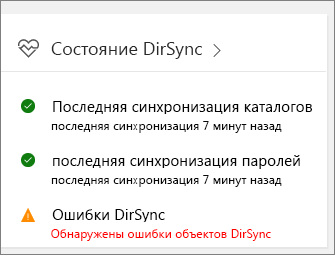

# Устранение проблем с синхронизацией службы каталогов для Office 365Fixing problems with directory synchronization for Office 365

С помощью синхронизации службы каталогов можно продолжать локально управлять пользователями и группами и синхронизировать добавления, удаления и изменения с облаком.With directory synchronization, you can continue to manage users and groups on-premises and synchronize additions, deletions, and changes to the cloud. Тем не менее ее настройка немного сложна и иногда бывает трудно определить причину проблемы.But setup is a little complicated and it can sometimes be difficult to identify the source of problems. Мы предлагаем ресурсы, которые помогут вам выявить потенциальные проблемы и устранить их.We have resources to help you identify potential issues and fix them.
  
## Как узнать, что что-то пошло не так?How do I know if something is wrong?

Первым сигналом о наличии проблемы служит вот такое сообщение, появляющееся на плитке "Состояние DirSync" в Центре администрирования Microsoft 365:The first indication that something is wrong is when the DirSync Status tile in the Microsoft 365 admin center indicates there is a problem:
  

  
Вы также получите от Office 365 почтовое сообщение (на адрес электронной почты администратора и запасной адрес) о том, что в вашем клиенте обнаружены ошибки синхронизации службы каталогов.You will also receive a mail (to the alternate email and to your admin email) from Office 365 that indicates your tenant has encountered directory synchronization errors. Подробные сведения см. в статье [Определение ошибок синхронизации службы каталогов в Office 365](identify-directory-synchronization-errors.md).[Identify directory synchronization errors in Office 365](identify-directory-synchronization-errors.md)
  
## Как получить средство Azure Active Directory Connect?How do I get Azure Active Directory Connect tool?

В [Центре администрирования Microsoft 365](https://admin.microsoft.com) перейдите к разделу \*\* Пользователи \*\* \> **Активные пользователи**.In the [Microsoft 365 admin center](https://admin.microsoft.com), navigate to \*\* Users \*\* \> **Active users**. В меню **Дополнительно** выберите элемент **Синхронизация службы каталогов**.Click the **More** menu and select **Directory synchronization**. 
  

  
Следуйте [инструкциям в мастере](set-up-directory-synchronization.md), чтобы скачать Azure AD Connect.Follow the [instructions in the wizard](set-up-directory-synchronization.md) to download Azure AD Connect. 
  
Если вы все еще используете средство синхронизации Azure Active Directory (DirSync), ознакомьтесь со статьей [Устранение ошибок установки инструмента для синхронизации Azure Active Directory и мастера настройки в Office 365](https://go.microsoft.com/fwlink/p/?LinkId=396717), чтобы узнать о требованиях к системе для установки средства, необходимых разрешениях и устранении распространенных ошибок.If you are still using Azure Active Directory Sync (DirSync), take a look at [How to troubleshoot Azure Active Directory Sync Tool installation and Configuration Wizard error messages in Office 365](https://go.microsoft.com/fwlink/p/?LinkId=396717) for information about the system requirements to install dirsync, the permissions you need, and how to troubleshoot common errors. 
  
Чтобы перейти от средства синхронизации Azure Active Directory к Azure AD Connect, см. [инструкции по обновлению](https://go.microsoft.com/fwlink/p/?LinkId=733240).To update from Azure Active Directory Sync to Azure AD Connect, see [the upgrade instructions](https://go.microsoft.com/fwlink/p/?LinkId=733240).
  
## Устранение распространенных причин проблем с синхронизаций службы каталогов в Office 365Resolving common causes of problems with directory synchronization in Office 365

### **Синхронизированные объекты не отображаются или не обновляются в режиме онлайн. Или служба возвращает отчеты об ошибках синхронизации.****Synchronized objects aren't appearing or updating online, or I'm getting synchronization error reports from the Service.**

- [Синхронизация удостоверений и устойчивость повторяющихся атрибутовIdentity synchronization and duplicate attribute resiliency](https://docs.microsoft.com/azure/active-directory/hybrid/how-to-connect-syncservice-duplicate-attribute-resiliency)

### **Я получаю оповещение в Центре администрирования. Или на мой электронный адрес приходят автоматические сообщения о том, что в последнее время синхронизация не выполнялась****I have an alert in the admin center, or am receiving automated emails that there hasn't been a recent synchronization event**
- [Устранение неполадок подключения с помощью Azure AD ConnectTroubleshoot connectivity issues with Azure AD Connect](https://docs.microsoft.com/azure/active-directory/hybrid/tshoot-connect-connectivity)
- [Azure AD Connect: учетные записи и разрешенияAzure AD Connect Accounts and permissions](https://go.microsoft.com/fwlink/p/?LinkId=820598)
- [Синхронизация Azure AD Connect: управление учетной записью службы Azure ADAzure AD Connect sync: How to manage the Azure AD service account](https://docs.microsoft.com/azure/active-directory/hybrid/how-to-connect-azureadaccount)
- [Синхронизация каталогов с Azure Active Directory остановлена или более суток не зарегистрировано попыток синхронизацииDirectory synchronization to Azure Active Directory stops or you're warned that sync hasn't registered in more than a day](https://support.microsoft.com/help/2882421/directory-synchronization-to-azure-active-directory-stops-or-you-re-warned-that-sync-hasn-t-registered-in-more-than-a-day)

### **Не синхронизируются пароли. Или в Центре администрирования Office 365 появляется оповещение о том, что в последнее время синхронизация паролей не выполнялась****Password hashes aren't synchronizing, or I'm seeing an alert in the admin center that there hasn't been a recent password hash synchronization**
- [Реализация синхронизации хэшированных паролей в службе синхронизации Azure AD Connect](https://docs.microsoft.com/azure/active-directory/hybrid/how-to-connect-password-hash-synchronization)For more information, see [Implement password hash synchronization with Azure AD Connect sync](https://docs.microsoft.com/azure/active-directory/hybrid/how-to-connect-password-hash-synchronization).

### **Появляется оповещение о том, что превышена квота на объекты.****I'm seeing an alert that Object quota exceeded**
- Для защиты службы используется встроенная квота на объекты.We have a built-in object quota to help protect the service. Если в каталоге слишком много объектов, которые нужно синхронизировать с Office 365, [обратитесь в службу поддержки продуктов для бизнеса](https://support.office.com/article/32a17ca7-6fa0-4870-8a8d-e25ba4ccfd4b) с просьбой увеличить квоту.If you have too many objects in your directory that need to sync to Office 365, you'll have to [Contact support for business products](https://support.office.com/article/32a17ca7-6fa0-4870-8a8d-e25ba4ccfd4b) to increase your quota.

### **Мне нужно знать, какие атрибуты синхронизируются****I need to know which attributes are synchronized**
- Список всех атрибутов, которые синхронизируются между локальной средой и облаком, можно найти [здесь](https://go.microsoft.com/fwlink/p/?LinkId=396719).You can find a list of all the attributes that are synced between on-premises and the cloud [right here](https://go.microsoft.com/fwlink/p/?LinkId=396719).

### **Не удается управлять объектами, синхронизированными с облаком, и удалять их****I can't manage or remove objects that were synchronized to the cloud**
- Вы готовы управлять объектами только в облаке?Are you ready to manage objects in the cloud only? Или вы удалили объект локально, но он все еще существует в облаке?Or is there an object that was deleted on-premises, but is stuck in the cloud? Ознакомьтесь с этой статьей [Устранение ошибок синхронизации во время синхронизации](https://go.microsoft.com/fwlink/p/?linkid=842044) и [справочной статьей](https://go.microsoft.com/fwlink/p/?LinkId=396720), чтобы получить инструкции по устранению этих проблем.Take a look at this [Troubleshooting Errors during synchronization](https://go.microsoft.com/fwlink/p/?linkid=842044) and [support article](https://go.microsoft.com/fwlink/p/?LinkId=396720) for guidance on how to resolve these issues.

### **Появляется сообщение об ошибке, в котором говорится, что в компании превышено количество объектов, которые можно синхронизировать.****I got an error message that my company has exceeded the number of objects that can be synchronized**
- Подробнее об этой проблеме вы можете узнать [здесь](https://go.microsoft.com/fwlink/p/?LinkId=396721).You can read more about this issue [here](https://go.microsoft.com/fwlink/p/?LinkId=396721).
   
## Другие ресурсыOther resources

- [Сценарий для устранения повторяющихся имен участников-пользователейScript to fix duplicate user principal names](https://go.microsoft.com/fwlink/p/?LinkId=396725)
    
- [Сведения о подготовке немаршрутизируемого домена (например, .local) для синхронизации службы каталоговHow to prepare a non-routable domain for directory synchronization](prepare-a-non-routable-domain-for-directory-synchronization.md)
    
- [Сценарий для подсчета общего числа синхронизированных объектовScript to count total synchronized objects](https://go.microsoft.com/fwlink/p/?LinkId=396726)
    
- [Устранение неполадок AD FS 2.0AD FS 2.0](https://go.microsoft.com/fwlink/p/?LinkId=396727)
    
- [Использование PowerShell для исправления пустых атрибутов DisplayName для групп, поддерживающих почтуUse PowerShell to fix empty DisplayName attributes for mail-enabled groups](https://go.microsoft.com/fwlink/p/?LinkId=396728)
    
- [Использование PowerShell для устранения повторяющихся имен участников-пользователейUse PowerShell to fix duplicate UPN](https://go.microsoft.com/fwlink/p/?LinkId=396730)
    
- [Использование PowerShell для устранения повторяющихся адресов электронной почтыUse PowerShell to fix duplicate email addresses](https://go.microsoft.com/fwlink/p/?LinkId=396731)
    
## Средства диагностикиDiagnostic tools

Средство [IDFix](prepare-directory-attributes-for-synch-with-idfix.md) используется для обнаружения и исправления объектов удостоверений и их атрибутов в локальной среде Active Directory при подготовке к переходу на Office 365.The  IDFix Tool http://go.microsoft.com/fwlink/?LinkID=286107  is used to perform discovery and remediation of identity objects and their attributes in an on-premises Active Directory environment in preparation for migration to Office 365. Средство IDFix предназначено для администраторов Active Directory, отвечающих за синхронизацию службы каталогов со службой Office 365.IdFix is intended for the Active Directory administrators responsible for DirSync with the Office 365 service. 

[Скачайте средство IDFix](https://go.microsoft.com/fwlink/p/?LinkId=396718) из Центра загрузки Майкрософт.[Download the IDFix tool](https://go.microsoft.com/fwlink/p/?LinkId=396718) from the Microsoft download center.