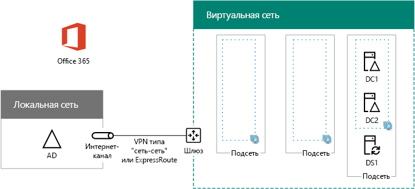

# <a name="high-availability-federated-authentication-phase-2-configure-domain-controllers"></a>Этап 2. Федеративная проверка подлинности для обеспечения высокой доступности: настройка контроллеров домена

 **Сводка.** Настройка контроллеров домена и сервера DirSync для федеративной проверки подлинности с высоким уровнем доступности для Office 365 в Microsoft Azure.
  
На этом этапе развертывания федеративной проверки подлинности с высоким уровнем доступности для Office 365 в службах инфраструктуры Azure настраиваются два контроллера домена и сервер DirSync в виртуальной сети Azure. После этого проверку подлинности клиентов можно выполнять в виртуальной сети Azure, не отправляя трафик проверки подлинности через подключение VPN типа "сеть-сеть" к локальной сети.
  
> [!NOTE]
> В службах федерации Active Directory (AD FS) нельзя использовать доменные службы Azure Active Directory вместо контроллеров домена AD Windows Server. 
  
Необходимо выполнить данный этап перед перемещением на [высокой доступности федеративных проверки подлинности этап 3: настройте серверы AD FS](high-availability-federated-authentication-phase-3-configure-ad-fs-servers.md). В разделе [Развертывание высокой доступности федеративной проверки подлинности для Office 365 в Azure](deploy-high-availability-federated-authentication-for-office-365-in-azure.md) все этапы.
  
## <a name="create-the-domain-controller-virtual-machines-in-azure"></a>Создание виртуальных машин контроллеров домена в Azure

Для начала необходимо заполнить столбец **Имя виртуальной машины** в таблице M и при необходимости изменить размеры виртуальных машин в столбце **Минимальный размер**.
  
|**Элемент**|**Имя виртуальной машины**|**Образ коллекции**|**Тип хранилища**|**Минимальный размер**|
|:-----|:-----|:-----|:-----|:-----|
|1.  <br/> | (первый контроллер домена, например DC1)  <br/> |Windows Server 2016 Datacenter  <br/> |Standard_LRS  <br/> |Standard_D2  <br/> |
|2.  <br/> | (второй контроллер домена, например DC2)  <br/> |Windows Server 2016 Datacenter  <br/> |Standard_LRS  <br/> |Standard_D2  <br/> |
|3.  <br/> |(Сервер синхронизации каталогов, пример DS1)  <br/> |Windows Server 2016 Datacenter  <br/> |Standard_LRS  <br/> |Standard_D2  <br/> |
|4.  <br/> |(первого сервера AD FS, пример ADFS1)  <br/> |Windows Server 2016 Datacenter  <br/> |Standard_LRS  <br/> |Standard_D2  <br/> |
|5.  <br/> |(второго сервера AD FS, пример ADFS2)  <br/> |Windows Server 2016 Datacenter  <br/> |Standard_LRS  <br/> |Standard_D2  <br/> |
|6.  <br/> |(первый сервер веб-приложения прокси, пример WEB1)  <br/> |Windows Server 2016 Datacenter  <br/> |Standard_LRS  <br/> |Standard_D2  <br/> |
|7.  <br/> |(второй веб-прокси сервер приложений, пример WEB2)  <br/> |Windows Server 2016 Datacenter  <br/> |Standard_LRS  <br/> |Standard_D2  <br/> |
   
 **В таблице M - виртуальных машин для проверки подлинности федеративные высокой доступности для Office 365 в Azure**
  
Полный список размеров виртуальных машин представлен в [этой статье](https://docs.microsoft.com/azure/virtual-machines/virtual-machines-windows-sizes).
  
Следующий блок Azure PowerShell команда создает виртуальных машин для два контроллера домена. Укажите значения для переменных, удаление \< и > символов. Обратите внимание, что этот блок Azure PowerShell команда использует значениями, полученными из следующей таблицы:
  
- таблица M (для виртуальных машин);
    
- таблица R (для групп ресурсов);
    
- таблица V (для параметров виртуальной сети);
    
- таблица S (для подсетей);
    
- таблица I (для статических IP-адресов);
    
- таблица A (для групп доступности).
    
Помните, что вы задали таблицы R, V, S, I и A в [высокой доступности федеративных проверки подлинности этап 1: Настройка Azure](high-availability-federated-authentication-phase-1-configure-azure.md).
  
> [!NOTE]
> Для приведенных ниже последовательностей команд используется последняя версия Azure PowerShell. См. статью [Общие сведения об Azure PowerShell](https://docs.microsoft.com/en-us/powershell/azureps-cmdlets-docs/). 
  
Указав правильные значения, выполните полученный блок в командной строке Azure PowerShell или в интегрированной среде сценариев PowerShell (ISE) на локальном компьютере.
  
> [!TIP]
> Текстовый файл, содержащий все команды PowerShell в данной статье и конфигурации книги Microsoft Excel, которое создает все готово к запуску PowerShell команду блоки на основе настраиваемых параметров содержатся в [федеративном проверки подлинности для Office 365 Azure Deployment Kit](https://gallery.technet.microsoft.com/Federated-Authentication-8a9f1664). 
  
```
# Set up variables common to both virtual machines
$locName="<your Azure location>"
$vnetName="<Table V - Item 1 - Value column>"
$subnetName="<Table S - Item 1 - Value column>"
$avName="<Table A - Item 1 - Availability set name column>"
$rgNameTier="<Table R - Item 1 - Resource group name column>"
$rgNameInfra="<Table R - Item 4 - Resource group name column>"

$rgName=$rgNameInfra
$vnet=Get-AzureRMVirtualNetwork -Name $vnetName -ResourceGroupName $rgName
$subnet=Get-AzureRmVirtualNetworkSubnetConfig -VirtualNetwork $vnet -Name $subnetName

$rgName=$rgNameTier
$avSet=Get-AzureRMAvailabilitySet -Name $avName -ResourceGroupName $rgName 

# Create the first domain controller
$vmName="<Table M - Item 1 - Virtual machine name column>"
$vmSize="<Table M - Item 1 - Minimum size column>"
$staticIP="<Table I - Item 1 - Value column>"
$diskStorageType="<Table M - Item 1 - Storage type column>"
$diskSize=<size of the extra disk for Windows Server AD data in GB>

$nic=New-AzureRMNetworkInterface -Name ($vmName +"-NIC") -ResourceGroupName $rgName -Location $locName -Subnet $subnet -PrivateIpAddress $staticIP
$vm=New-AzureRMVMConfig -VMName $vmName -VMSize $vmSize -AvailabilitySetId $avset.Id
$vm=Set-AzureRmVMOSDisk -VM $vm -Name ($vmName +"-OS") -DiskSizeInGB 128 -CreateOption FromImage -StorageAccountType $diskStorageType
$diskConfig=New-AzureRmDiskConfig -AccountType $diskStorageType -Location $locName -CreateOption Empty -DiskSizeGB $diskSize
$dataDisk1=New-AzureRmDisk -DiskName ($vmName + "-DataDisk1") -Disk $diskConfig -ResourceGroupName $rgName
$vm=Add-AzureRmVMDataDisk -VM $vm -Name ($vmName + "-DataDisk1") -CreateOption Attach -ManagedDiskId $dataDisk1.Id -Lun 1
$cred=Get-Credential -Message "Type the name and password of the local administrator account for the first domain controller." 
$vm=Set-AzureRMVMOperatingSystem -VM $vm -Windows -ComputerName $vmName -Credential $cred -ProvisionVMAgent -EnableAutoUpdate
$vm=Set-AzureRMVMSourceImage -VM $vm -PublisherName MicrosoftWindowsServer -Offer WindowsServer -Skus 2016-Datacenter -Version "latest"
$vm=Add-AzureRMVMNetworkInterface -VM $vm -Id $nic.Id
New-AzureRMVM -ResourceGroupName $rgName -Location $locName -VM $vm

# Create the second domain controller
$vmName="<Table M - Item 2 - Virtual machine name column>"
$vmSize="<Table M - Item 2 - Minimum size column>"
$staticIP="<Table I - Item 2 - Value column>"
$diskStorageType="<Table M - Item 2 - Storage type column>"
$diskSize=<size of the extra disk for Windows Server AD data in GB>

$nic=New-AzureRMNetworkInterface -Name ($vmName +"-NIC") -ResourceGroupName $rgName -Location $locName -Subnet $subnet -PrivateIpAddress $staticIP
$vm=New-AzureRMVMConfig -VMName $vmName -VMSize $vmSize -AvailabilitySetId $avset.Id
$vm=Set-AzureRmVMOSDisk -VM $vm -Name ($vmName +"-OS") -DiskSizeInGB 128 -CreateOption FromImage -StorageAccountType $diskStorageType
$diskConfig=New-AzureRmDiskConfig -AccountType $diskStorageType -Location $locName -CreateOption Empty -DiskSizeGB $diskSize
$dataDisk1=New-AzureRmDisk -DiskName ($vmName + "-DataDisk1") -Disk $diskConfig -ResourceGroupName $rgName
$vm=Add-AzureRmVMDataDisk -VM $vm -Name ($vmName + "-DataDisk1") -CreateOption Attach -ManagedDiskId $dataDisk1.Id -Lun 1
$cred=Get-Credential -Message "Type the name and password of the local administrator account for the second domain controller." 
$vm=Set-AzureRMVMOperatingSystem -VM $vm -Windows -ComputerName $vmName -Credential $cred -ProvisionVMAgent -EnableAutoUpdate
$vm=Set-AzureRMVMSourceImage -VM $vm -PublisherName MicrosoftWindowsServer -Offer WindowsServer -Skus 2016-Datacenter -Version "latest"
$vm=Add-AzureRMVMNetworkInterface -VM $vm -Id $nic.Id
New-AzureRMVM -ResourceGroupName $rgName -Location $locName -VM $vm

# Create the DirSync server
$vmName="<Table M - Item 3 - Virtual machine name column>"
$vmSize="<Table M - Item 3 - Minimum size column>"
$staticIP="<Table I - Item 3 - Value column>"
$diskStorageType="<Table M - Item 3 - Storage type column>"

$nic=New-AzureRMNetworkInterface -Name ($vmName +"-NIC") -ResourceGroupName $rgName -Location $locName -Subnet $subnet -PrivateIpAddress $staticIP
$vm=New-AzureRMVMConfig -VMName $vmName -VMSize $vmSize

$cred=Get-Credential -Message "Type the name and password of the local administrator account for the DirSync server." 
$vm=Set-AzureRMVMOperatingSystem -VM $vm -Windows -ComputerName $vmName -Credential $cred -ProvisionVMAgent -EnableAutoUpdate
$vm=Set-AzureRMVMSourceImage -VM $vm -PublisherName MicrosoftWindowsServer -Offer WindowsServer -Skus 2016-Datacenter -Version "latest"
$vm=Add-AzureRMVMNetworkInterface -VM $vm -Id $nic.Id
$vm=Set-AzureRmVMOSDisk -VM $vm -Name ($vmName +"-OS") -DiskSizeInGB 128 -CreateOption FromImage -StorageAccountType $diskStorageType
New-AzureRMVM -ResourceGroupName $rgName -Location $locName -VM $vm
```

> [!NOTE]
> Так как эти виртуальные машины для приложения интрасети, они не назначен общедоступный IP-адрес или имя домена DNS и выход в Интернет. Тем не менее это также означает, что не удается подключиться к ним с Azure портала. Параметр **Подключить** недоступна при просмотре свойств виртуальной машины. Используйте стандартную программу подключения к удаленному рабочему столу или другого средства удаленного рабочего стола для подключения к виртуальной машине с помощью его частных IP-адресов интрасети или адреса DNS-имени.
  
## <a name="configure-the-first-domain-controller"></a>Настройка первого контроллера домена

Используя любой клиент удаленного рабочего стола, создайте подключение к удаленному рабочему столу для виртуальной машины первого контроллера домена. Используйте DNS-имя интрасети или имя компьютера, а также учетные данные локального администратора.
  
Добавьте на диске дополнительных данных для первого контроллера домена с помощью этой команды из Windows PowerShell командной строки **на виртуальной машине первого контроллера домена**:
  
```
Get-Disk | Where PartitionStyle -eq "RAW" | Initialize-Disk -PartitionStyle MBR -PassThru | New-Partition -AssignDriveLetter -UseMaximumSize | Format-Volume -FileSystem NTFS -NewFileSystemLabel "WSAD Data"
```

Затем протестируйте соединение первого контроллера домена с расположениями в сети организации с помощью команды **ping** для имен и IP-адресов ресурсов в этой сети.
  
Это позволяет убедиться, что разрешение DNS-имен работает надлежащим образом (виртуальная машина правильно настроена с указанием локальных DNS-серверов), а в распределенную виртуальную сеть и из нее можно отправлять пакеты. В случае сбоя базового теста обратитесь в ИТ-отдел для устранения проблем с разрешением DNS-имен и доставкой пакетов.
  
Затем в командной строке Windows PowerShell на первом контроллере домена выполните следующие команды:
  
```
$domname="<DNS domain name of the domain for which this computer will be a domain controller, such as corp.contoso.com>"
$cred = Get-Credential -Message "Enter credentials of an account with permission to join a new domain controller to the domain"
Install-WindowsFeature AD-Domain-Services -IncludeManagementTools
Install-ADDSDomainController -InstallDns -DomainName $domname  -DatabasePath "F:\NTDS" -SysvolPath "F:\SYSVOL" -LogPath "F:\Logs" -Credential $cred
```

Вам будет предложено указать учетные данные администратора домена. Компьютер перезагрузится.
  
## <a name="configure-the-second-domain-controller"></a>Настройка второго контроллера домена

Используя любой клиент удаленного рабочего стола, создайте подключение к удаленному рабочему столу на виртуальной машине второго контроллера домена. Используйте DNS-имя интрасети или имя компьютера, а также учетные данные локального администратора.
  
Затем необходимо добавить дополнительные данные в второго контроллера домена с помощью этой команды из Windows PowerShell командной строки **на виртуальной машине второго контроллера домена**:
  
```
Get-Disk | Where PartitionStyle -eq "RAW" | Initialize-Disk -PartitionStyle MBR -PassThru | New-Partition -AssignDriveLetter -UseMaximumSize | Format-Volume -FileSystem NTFS -NewFileSystemLabel "WSAD Data"
```

Затем выполните следующие команды:
  
```
$domname="<DNS domain name of the domain for which this computer will be a domain controller, such as corp.contoso.com>"
$cred = Get-Credential -Message "Enter credentials of an account with permission to join a new domain controller to the domain"
Install-WindowsFeature AD-Domain-Services -IncludeManagementTools
Install-ADDSDomainController -InstallDns -DomainName $domname  -DatabasePath "F:\NTDS" -SysvolPath "F:\SYSVOL" -LogPath "F:\Logs" -Credential $cred

```

Вам будет предложено указать учетные данные администратора домена. Компьютер перезагрузится.
  
Затем необходимо обновить DNS-серверов для виртуальной сети, так что Azure назначает виртуальных машин IP-адреса двух новых контроллеров домена для использования в качестве DNS-серверов. Заполните поля в переменные и затем выполните следующие команды в командной строке Windows PowerShell на локальном компьютере:
  
```
$rgName="<Table R - Item 4 - Resource group name column>"
$adrgName="<Table R - Item 1 - Resource group name column>"
$locName="<your Azure location>"
$vnetName="<Table V - Item 1 - Value column>"
$onpremDNSIP1="<Table D - Item 1 - DNS server IP address column>"
$onpremDNSIP2="<Table D - Item 2 - DNS server IP address column>"
$staticIP1="<Table I - Item 1 - Value column>"
$staticIP2="<Table I - Item 2 - Value column>"
$firstDCName="<Table M - Item 1 - Virtual machine name column>"
$secondDCName="<Table M - Item 2 - Virtual machine name column>"

$vnet=Get-AzureRMVirtualNetwork -ResourceGroupName $rgName -Name $vnetName
$vnet.DhcpOptions.DnsServers.Add($staticIP1)
$vnet.DhcpOptions.DnsServers.Add($staticIP2) 
$vnet.DhcpOptions.DnsServers.Remove($onpremDNSIP1)
$vnet.DhcpOptions.DnsServers.Remove($onpremDNSIP2) 
Set-AzureRMVirtualNetwork -VirtualNetwork $vnet
Restart-AzureRMVM -ResourceGroupName $adrgName -Name $firstDCName
Restart-AzureRMVM -ResourceGroupName $adrgName -Name $secondDCName
```

Обратите внимание, что мы перезагружаем два контроллера домена, чтобы они не были настроены с указанием локальных DNS-серверов. Так как они оба сами являются DNS-серверами, эти контроллеры были автоматически настроены с указанием локальных DNS-серверов пересылки при повышении до контроллеров домена.
  
После этого необходимо создать сайт репликации Active Directory, чтобы убедиться, что серверы в виртуальной сети Azure используют локальные контроллеры домена. Подключитесь к любому контроллеру домена, используя учетную запись администратора домена, и выполните следующие команды в командной строке Windows PowerShell с правами администратора:
  
```
$vnet="<Table V - Item 1 - Value column>"
$vnetSpace="<Table V - Item 4 - Value column>"
New-ADReplicationSite -Name $vnet 
New-ADReplicationSubnet -Name $vnetSpace -Site $vnet
```

## <a name="configure-the-dirsync-server"></a>Настройка сервера DirSync

Используйте клиента удаленного рабочего стола на свой выбор и создайте виртуальную машину DirSync сервера удаленного рабочего стола. С помощью его интрасети DNS или имя компьютера и учетные данные учетной записи локального администратора.
  
После этого настройте соединение с соответствующим доменом Windows Server AD, выполнив указанные ниже команды в командной строке Windows PowerShell.
  
```
$domName="<Windows Server AD domain name to join, such as corp.contoso.com>"
$cred=Get-Credential -Message "Type the name and password of a domain acccount."
Add-Computer -DomainName $domName -Credential $cred
Restart-Computer
```

Здесь показана конфигурация, полученная в результате успешного выполнения этого этапа (с заполнителями вместо имен компьютеров).
  
**Этап 2. Контроллеры домена и сервер DirSync для инфраструктуры федеративной проверки подлинности с высоким уровнем доступности в Azure**


  
## <a name="next-step"></a>Следующий шаг

Продолжение здесь: [High availability federated authentication Phase 3: Configure AD FS servers](high-availability-federated-authentication-phase-3-configure-ad-fs-servers.md).
  
## <a name="see-also"></a>См. также

[Развертывание в Azure федеративной проверки подлинности для обеспечения высокой доступности в случае использования Office 365](deploy-high-availability-federated-authentication-for-office-365-in-azure.md)
  
[Федеративное удостоверение для среды разработки и тестирования Office 365](federated-identity-for-your-office-365-dev-test-environment.md)
  
[Освоение облака и гибридные решения](cloud-adoption-and-hybrid-solutions.md)

[Федеративные удостоверения для Office 365](https://support.office.com/article/Understanding-Office-365-identity-and-Azure-Active-Directory-06a189e7-5ec6-4af2-94bf-a22ea225a7a9#bk_federated)


