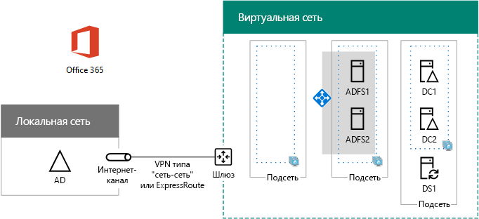

# <a name="high-availability-federated-authentication-phase-3-configure-ad-fs-servers"></a>Этап 3. Федеративная проверка подлинности для обеспечения высокой доступности: настройка серверов AD FS

 **Сводка:** Создание и настройка серверов служб федерации Active Directory (AD FS) для вашей высокой доступности федеративной проверки подлинности для Office 365 в Microsoft Azure.
  
На этом этапе развертывания федеративной проверки подлинности с высоким уровнем доступности для Office 365 в службах инфраструктуры Azure создаются внутренний балансировщик нагрузки и два сервера AD FS.
  
Необходимо выполнить данный этап перед перемещением на [высокой доступности федеративных проверки подлинности этап 4: настройка прокси-серверы приложений web](high-availability-federated-authentication-phase-4-configure-web-application-pro.md). В разделе [Развертывание высокой доступности федеративной проверки подлинности для Office 365 в Azure](deploy-high-availability-federated-authentication-for-office-365-in-azure.md) все этапы.
  
## <a name="create-the-ad-fs-server-virtual-machines-in-azure"></a>Создание виртуальных машин серверов AD FS в Azure

Используйте приведенный ниже блок команд PowerShell, чтобы создать виртуальные машины для двух серверов AD FS. В этом наборе команд PowerShell используются значения из следующих таблиц:
  
- таблица M (для виртуальных машин);
    
- таблица R (для групп ресурсов);
    
- таблица V (для параметров виртуальной сети);
    
- таблица S (для подсетей);
    
- таблица I (для статических IP-адресов);
    
- таблица A (для групп доступности).
    
Помните, что вы задали M таблицы в [высокой доступности федеративных проверки подлинности этап 2: Настройка контроллеров домена](high-availability-federated-authentication-phase-2-configure-domain-controllers.md) и таблиц R, V, S, I и A в [высокой доступности федеративных проверки подлинности на шаге 1: настройте Azure](high-availability-federated-authentication-phase-1-configure-azure.md).
  
> [!NOTE]
> Следующие наборы команд использовать последнюю версию Windows Azure PowerShell. В разделе [Начало работы с Windows Azure PowerShell командлетов](https://docs.microsoft.com/en-us/powershell/azureps-cmdlets-docs/). 
  
Во-первых создается Azure внутренних балансировщика AD двух серверов федерации Active Directory. Укажите значения для переменных, удаление \< и > символов. Когда вы задали все соответствующие значения, запустите блоке в командной строке Windows Azure PowerShell или в PowerShell ISE.
  
> [!TIP]
> Текстовый файл, содержащий все команды PowerShell в данной статье и конфигурации книги Microsoft Excel, которое создает все готово к запуску PowerShell команду блоки на основе настраиваемых параметров содержатся в [федеративном проверки подлинности для Office 365 Azure Deployment Kit](https://gallery.technet.microsoft.com/Federated-Authentication-8a9f1664). 
  
```
# Set up key variables
$locName="<your Azure location>"
$vnetName="<Table V - Item 1 - Value column>"
$subnetName="<Table R - Item 2 - Subnet name column>"
$privIP="<Table I - Item 4 - Value column>"
$rgName=<Table R - Item 4 - Resource group name column>"

$vnet=Get-AzureRMVirtualNetwork -Name $vnetName -ResourceGroupName $rgName
$subnet=Get-AzureRmVirtualNetworkSubnetConfig -VirtualNetwork $vnet -Name $subnetName

$frontendIP=New-AzureRMLoadBalancerFrontendIpConfig -Name "ADFSServers-LBFE" -PrivateIPAddress $privIP -Subnet $subnet
$beAddressPool=New-AzureRMLoadBalancerBackendAddressPoolConfig -Name "ADFSServers-LBBE"

$healthProbe=New-AzureRMLoadBalancerProbeConfig -Name WebServersProbe -Protocol "TCP" -Port 443 -IntervalInSeconds 15 -ProbeCount 2
$lbrule=New-AzureRMLoadBalancerRuleConfig -Name "HTTPSTraffic" -FrontendIpConfiguration $frontendIP -BackendAddressPool $beAddressPool -Probe $healthProbe -Protocol "TCP" -FrontendPort 443 -BackendPort 443
New-AzureRMLoadBalancer -ResourceGroupName $rgName -Name "ADFSServers" -Location $locName -LoadBalancingRule $lbrule -BackendAddressPool $beAddressPool -Probe $healthProbe -FrontendIpConfiguration $frontendIP
```

После этого создайте виртуальные машины сервера AD FS.
  
Задав правильные значения, выполните полученный блок в командной строке Azure PowerShell или в интегрированной среде сценариев PowerShell.
  
```
# Set up variables common to both virtual machines
$locName="<your Azure location>"
$vnetName="<Table V - Item 1 - Value column>"
$subnetName="<Table R - Item 2 - Subnet name column>"
$avName="<Table A - Item 2 - Availability set name column>"
$rgNameTier="<Table R - Item 2 - Resource group name column>"
$rgNameInfra="<Table R - Item 4 - Resource group name column>"

$rgName=$rgNameInfra
$vnet=Get-AzureRMVirtualNetwork -Name $vnetName -ResourceGroupName $rgName
$subnet=Get-AzureRmVirtualNetworkSubnetConfig -VirtualNetwork $vnet -Name $subnetName
$backendSubnet=Get-AzureRMVirtualNetworkSubnetConfig -Name $subnetName -VirtualNetwork $vnet
$webLB=Get-AzureRMLoadBalancer -ResourceGroupName $rgName -Name "ADFSServers"

$rgName=$rgNameTier
$avSet=Get-AzureRMAvailabilitySet -Name $avName -ResourceGroupName $rgName

# Create the first ADFS server virtual machine
$vmName="<Table M - Item 4 - Virtual machine name column>"
$vmSize="<Table M - Item 4 - Minimum size column>"
$staticIP="<Table I - Item 5 - Value column>"
$diskStorageType="<Table M - Item 4 - Storage type column>"

$nic=New-AzureRMNetworkInterface -Name ($vmName +"-NIC") -ResourceGroupName $rgName -Location $locName -Subnet $backendSubnet -LoadBalancerBackendAddressPool $webLB.BackendAddressPools[0] -PrivateIpAddress $staticIP
$vm=New-AzureRMVMConfig -VMName $vmName -VMSize $vmSize -AvailabilitySetId $avset.Id

$cred=Get-Credential -Message "Type the name and password of the local administrator account for the first AD FS server." 
$vm=Set-AzureRMVMOperatingSystem -VM $vm -Windows -ComputerName $vmName -Credential $cred -ProvisionVMAgent -EnableAutoUpdate
$vm=Set-AzureRMVMSourceImage -VM $vm -PublisherName MicrosoftWindowsServer -Offer WindowsServer -Skus 2016-Datacenter -Version "latest"
$vm=Add-AzureRMVMNetworkInterface -VM $vm -Id $nic.Id
$vm=Set-AzureRmVMOSDisk -VM $vm -Name ($vmName +"-OS") -DiskSizeInGB 128 -CreateOption FromImage -StorageAccountType $diskStorageType
New-AzureRMVM -ResourceGroupName $rgName -Location $locName -VM $vm

# Create the second AD FS virtual machine
$vmName="<Table M - Item 5 - Virtual machine name column>"
$vmSize="<Table M - Item 5 - Minimum size column>"
$staticIP="<Table I - Item 6 - Value column>"
$diskStorageType="<Table M - Item 5 - Storage type column>"

$nic=New-AzureRMNetworkInterface -Name ($vmName +"-NIC") -ResourceGroupName $rgName -Location $locName  -Subnet $backendSubnet -LoadBalancerBackendAddressPool $webLB.BackendAddressPools[0] -PrivateIpAddress $staticIP
$vm=New-AzureRMVMConfig -VMName $vmName -VMSize $vmSize -AvailabilitySetId $avset.Id

$cred=Get-Credential -Message "Type the name and password of the local administrator account for the second AD FS server." 
$vm=Set-AzureRMVMOperatingSystem -VM $vm -Windows -ComputerName $vmName -Credential $cred -ProvisionVMAgent -EnableAutoUpdate
$vm=Set-AzureRMVMSourceImage -VM $vm -PublisherName MicrosoftWindowsServer -Offer WindowsServer -Skus 2016-Datacenter -Version "latest"
$vm=Add-AzureRMVMNetworkInterface -VM $vm -Id $nic.Id
$vm=Set-AzureRmVMOSDisk -VM $vm -Name ($vmName +"-OS") -DiskSizeInGB 128 -CreateOption FromImage -StorageAccountType $diskStorageType
New-AzureRMVM -ResourceGroupName $rgName -Location $locName -VM $vm

```

> [!NOTE]
> Так как эти виртуальные машины для приложения интрасети, они не назначен общедоступный IP-адрес или имя домена DNS и выход в Интернет. Тем не менее это также означает, что не удается подключиться к ним с Azure портала. Параметр **Подключить** недоступна при просмотре свойств виртуальной машины. Используйте стандартную программу подключения к удаленному рабочему столу или другого средства удаленного рабочего стола для подключения к виртуальной машине с помощью его частных IP-адресов интрасети или адреса DNS-имени.
  
Создайте подключение к удаленному рабочему столу для каждой виртуальной машины с помощью любого подходящего клиента. Используйте DNS-имя интрасети или имя компьютера, а также локальные учетные данные администратора.
  
Подключите каждую виртуальную машину к соответствующему домену Windows Server AD, выполнив указанные ниже команды в командной строке Windows PowerShell.
  
```
$domName="<Windows Server AD domain name to join, such as corp.contoso.com>"
$cred=Get-Credential -Message "Type the name and password of a domain acccount."
Add-Computer -DomainName $domName -Credential $cred
Restart-Computer
```

Здесь показана конфигурация, полученная в результате успешного выполнения этого этапа (с заполнителями вместо имен компьютеров).
  
**Этап 3: Серверы AD FS и внутреннего балансировки нагрузки для инфраструктуры федеративной проверки подлинности высокой доступности в Azure**


  
## <a name="next-step"></a>Следующее действие

Использование [высокой доступности федеративных проверки подлинности этап 4: настройка прокси-серверы приложений web](high-availability-federated-authentication-phase-4-configure-web-application-pro.md) для продолжения настройки этой рабочей нагрузкой.
  
## <a name="see-also"></a>См. также

[Развертывание в Azure федеративной проверки подлинности для обеспечения высокой доступности в случае использования Office 365](deploy-high-availability-federated-authentication-for-office-365-in-azure.md)
  
[Федеративное удостоверение для среды разработки и тестирования Office 365](federated-identity-for-your-office-365-dev-test-environment.md)


