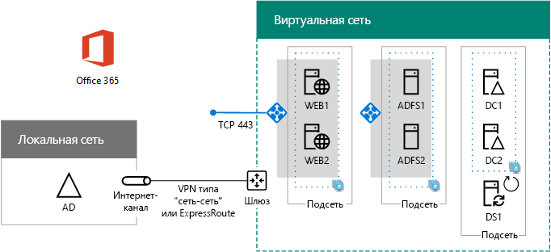

# <a name="high-availability-federated-authentication-phase-4-configure-web-application-proxies"></a><span data-ttu-id="d871a-103">Этап 4. Федеративная проверка подлинности для обеспечения высокой доступности: настройка прокси веб-приложений</span><span class="sxs-lookup"><span data-stu-id="d871a-103">High availability federated authentication Phase 4: Configure web application proxies</span></span>

 <span data-ttu-id="d871a-104">**Сводка:** Настройка серверов прокси-сервера веб-приложений для вашего высокой доступности федеративной проверки подлинности для Office 365 в Microsoft Azure.</span><span class="sxs-lookup"><span data-stu-id="d871a-104">**Summary:** Configure the web application proxy servers for your high availability federated authentication for Office 365 in Microsoft Azure.</span></span>
  
<span data-ttu-id="d871a-105">На этом этапе развертывания федеративной проверки подлинности с высоким уровнем доступности для Office 365 в службах инфраструктуры Azure создаются внутренний балансировщик нагрузки и два сервера AD FS.</span><span class="sxs-lookup"><span data-stu-id="d871a-105">In this phase of deploying high availability for Office 365 federated authentication in Azure infrastructure services, you create an internal load balancer and two AD FS servers.</span></span>
  
<span data-ttu-id="d871a-p101">Необходимо выполнить данный этап перед перемещением на [высокой доступности федеративных проверки подлинности этап 5: Настройка федеративной проверки подлинности для Office 365](high-availability-federated-authentication-phase-5-configure-federated-authentic.md). В разделе [Развертывание высокой доступности федеративной проверки подлинности для Office 365 в Azure](deploy-high-availability-federated-authentication-for-office-365-in-azure.md) все этапы.</span><span class="sxs-lookup"><span data-stu-id="d871a-p101">You must complete this phase before moving on to [High availability federated authentication Phase 5: Configure federated authentication for Office 365](high-availability-federated-authentication-phase-5-configure-federated-authentic.md). See [Deploy high availability federated authentication for Office 365 in Azure](deploy-high-availability-federated-authentication-for-office-365-in-azure.md) for all of the phases.</span></span>
  
## <a name="create-the-internet-facing-load-balancer-in-azure"></a><span data-ttu-id="d871a-108">Создание внешнего балансировщика нагрузки в Azure</span><span class="sxs-lookup"><span data-stu-id="d871a-108">Create the Internet-facing load balancer in Azure</span></span>

<span data-ttu-id="d871a-109">Создайте внешний балансировщик нагрузки, чтобы Azure равномерно распределял входящий трафик проверки подлинности из Интернета между двумя прокси-серверами веб-приложений.</span><span class="sxs-lookup"><span data-stu-id="d871a-109">You must create an Internet-facing load balancer so that Azure distributes the incoming client authentication traffic from the Internet evenly among the two web application proxy servers.</span></span>
  
> [!NOTE]
> <span data-ttu-id="d871a-p102">Следующие наборы команд использовать последнюю версию Windows Azure PowerShell. В разделе [Начало работы с Windows Azure PowerShell командлетов](https://docs.microsoft.com/en-us/powershell/azureps-cmdlets-docs/).</span><span class="sxs-lookup"><span data-stu-id="d871a-p102">The following command sets use the latest version of Azure PowerShell. See [Get started with Azure PowerShell cmdlets](https://docs.microsoft.com/en-us/powershell/azureps-cmdlets-docs/).</span></span> 
  
<span data-ttu-id="d871a-112">Указав расположение и группу ресурсов, выполните полученный блок в командной строке Azure PowerShell или в интегрированной среде сценариев PowerShell.</span><span class="sxs-lookup"><span data-stu-id="d871a-112">When you have supplied location and resource group values, run the resulting block at the Azure PowerShell command prompt or in the PowerShell ISE.</span></span>
  
> [!TIP]
> <span data-ttu-id="d871a-113">Текстовый файл, содержащий все команды PowerShell в данной статье и конфигурации книги Microsoft Excel, которое создает все готово к запуску PowerShell команду блоки на основе настраиваемых параметров содержатся в [федеративном проверки подлинности для Office 365 Azure Deployment Kit](https://gallery.technet.microsoft.com/Federated-Authentication-8a9f1664).</span><span class="sxs-lookup"><span data-stu-id="d871a-113">For a text file that contains all of the PowerShell commands in this article and a Microsoft Excel configuration workbook that generates ready-to-run PowerShell command blocks based on your custom settings, see the [Federated Authentication for Office 365 in Azure Deployment Kit](https://gallery.technet.microsoft.com/Federated-Authentication-8a9f1664).</span></span> 
  
```
# Set up key variables
$locName="<your Azure location>"
$rgName="<Table R - Item 4 - Resource group name column>"

$publicIP=New-AzureRmPublicIpAddress -ResourceGroupName $rgName -Name "WebProxyPublicIP" -Location $LocName -AllocationMethod "Static"
$frontendIP=New-AzureRmLoadBalancerFrontendIpConfig -Name "WebAppProxyServers-LBFE" -PublicIpAddress $publicIP
$beAddressPool=New-AzureRMLoadBalancerBackendAddressPoolConfig -Name "WebAppProxyServers-LBBE"
$healthProbe=New-AzureRMLoadBalancerProbeConfig -Name "WebServersProbe" -Protocol "TCP" -Port 443 -IntervalInSeconds 15 -ProbeCount 2
$lbrule=New-AzureRMLoadBalancerRuleConfig -Name "WebTraffic" -FrontendIpConfiguration $frontendIP -BackendAddressPool $beAddressPool -Probe $healthProbe -Protocol "TCP" -FrontendPort 443 -BackendPort 443
New-AzureRMLoadBalancer -ResourceGroupName $rgName -Name "WebAppProxyServers" -Location $locName -LoadBalancingRule $lbrule -BackendAddressPool $beAddressPool -Probe $healthProbe -FrontendIpConfiguration $frontendIP
```

<span data-ttu-id="d871a-114">Чтобы отобразить общедоступный IP-адрес внешнего балансировщика нагрузки, выполните следующие команды в командной строке Azure PowerShell на локальном компьютере:</span><span class="sxs-lookup"><span data-stu-id="d871a-114">To display the public IP address assigned to your Internet-facing load balancer, run these commands at the Azure PowerShell command prompt on your local computer:</span></span>
  
```
Write-Host (Get-AzureRMPublicIpaddress -Name "WebProxyPublicIP" -ResourceGroup $rgName).IPAddress
```

## <a name="determine-your-federation-service-fqdn-and-create-dns-records"></a><span data-ttu-id="d871a-115">Определение полного доменного имени службы федерации и создание записей DNS</span><span class="sxs-lookup"><span data-stu-id="d871a-115">Determine your federation service FQDN and create DNS records</span></span>

<span data-ttu-id="d871a-p103">Вам нужно определить DNS-имя службы федерации, которое будет использоваться в Интернете. После настройки на этапе 5 это имя станет частью URL-адреса, который Office 365 отправляет подключающимся клиентам, чтобы получить маркер безопасности. Например, fs.contoso.com (fs означает "служба федерации").</span><span class="sxs-lookup"><span data-stu-id="d871a-p103">You need to determine the DNS name to identify your federation service name on the Internet. Azure AD Connect will configure Office 365 with this name in Phase 5, which will become part of the URL that Office 365 sends to connecting clients to get a security token. An example is fs.contoso.com (fs stands for federation service).</span></span>
  
<span data-ttu-id="d871a-119">После этого создайте запись A общедоступного домена DNS для полного доменного имени службы федерации, которая указывает на общедоступный IP-адрес внешнего балансировщика нагрузки Azure.</span><span class="sxs-lookup"><span data-stu-id="d871a-119">Once you have your federation service FDQN, create a public DNS domain A record for the federation service FDQN that resolves to the public IP address of the Azure Internet-facing load balancer.</span></span>
  
|<span data-ttu-id="d871a-120">**Name**</span><span class="sxs-lookup"><span data-stu-id="d871a-120">**Name**</span></span>|<span data-ttu-id="d871a-121">**Тип**</span><span class="sxs-lookup"><span data-stu-id="d871a-121">**Type**</span></span>|<span data-ttu-id="d871a-122">**TTL**</span><span class="sxs-lookup"><span data-stu-id="d871a-122">**TTL**</span></span>|<span data-ttu-id="d871a-123">**Значение**</span><span class="sxs-lookup"><span data-stu-id="d871a-123">**Value**</span></span>|
|:-----|:-----|:-----|:-----|
|<span data-ttu-id="d871a-124">Полное доменное имя службы федерации</span><span class="sxs-lookup"><span data-stu-id="d871a-124">federation service FDQN</span></span>  <br/> |<span data-ttu-id="d871a-125">A</span><span class="sxs-lookup"><span data-stu-id="d871a-125">A</span></span>  <br/> |<span data-ttu-id="d871a-126">3600</span><span class="sxs-lookup"><span data-stu-id="d871a-126">3600</span></span>  <br/> |<span data-ttu-id="d871a-127">общедоступный IP-адрес балансировщика нагрузки Azure в Интернете (отобразить с помощью команды **Записи узла** в предыдущем разделе)</span><span class="sxs-lookup"><span data-stu-id="d871a-127">public IP address of the Azure Internet-facing load balancer (displayed by the **Write-Host** command in the previous section)</span></span> <br/> |
   
<span data-ttu-id="d871a-128">Пример</span><span class="sxs-lookup"><span data-stu-id="d871a-128">Here is an example:</span></span>
  
|<span data-ttu-id="d871a-129">**Name**</span><span class="sxs-lookup"><span data-stu-id="d871a-129">**Name**</span></span>|<span data-ttu-id="d871a-130">**Тип**</span><span class="sxs-lookup"><span data-stu-id="d871a-130">**Type**</span></span>|<span data-ttu-id="d871a-131">**TTL**</span><span class="sxs-lookup"><span data-stu-id="d871a-131">**TTL**</span></span>|<span data-ttu-id="d871a-132">**Значение**</span><span class="sxs-lookup"><span data-stu-id="d871a-132">**Value**</span></span>|
|:-----|:-----|:-----|:-----|
|<span data-ttu-id="d871a-133">FS.contoso.com</span><span class="sxs-lookup"><span data-stu-id="d871a-133">fs.contoso.com</span></span>  <br/> |<span data-ttu-id="d871a-134">A</span><span class="sxs-lookup"><span data-stu-id="d871a-134">A</span></span>  <br/> |<span data-ttu-id="d871a-135">3600</span><span class="sxs-lookup"><span data-stu-id="d871a-135">3600</span></span>  <br/> |<span data-ttu-id="d871a-136">131.107.249.117</span><span class="sxs-lookup"><span data-stu-id="d871a-136">131.107.249.117</span></span>  <br/> |
   
<span data-ttu-id="d871a-137">После этого добавьте адресную запись DNS в частное пространство имен DNS вашей организации, которое превращает полное доменное имя службы федерации в частный IP-адрес, присвоенный внутреннему балансировщику нагрузки для серверов AD FS (таблица I, элемент 4, столбец "Значение").</span><span class="sxs-lookup"><span data-stu-id="d871a-137">Next, add a DNS address record to your organization's private DNS namespace that resolves your federation service FQDN to the private IP address assigned to the internal load balancer for the AD FS servers (Table I, item 4, Value column).</span></span>
  
## <a name="create-the-web-application-proxy-server-virtual-machines-in-azure"></a><span data-ttu-id="d871a-138">Создание виртуальных машин прокси-серверов веб-приложений в Azure</span><span class="sxs-lookup"><span data-stu-id="d871a-138">Create the web application proxy server virtual machines in Azure</span></span>

<span data-ttu-id="d871a-139">Используйте приведенный ниже блок команд Azure PowerShell, чтобы создать виртуальные машины для двух прокси-серверов веб-приложений. </span><span class="sxs-lookup"><span data-stu-id="d871a-139">Use the following block of Azure PowerShell commands to create the virtual machines for the two web application proxy servers.</span></span> 
  
<span data-ttu-id="d871a-140">Обратите внимание, что в указанных наборах команд PowerShell используются значения из следующих таблиц:</span><span class="sxs-lookup"><span data-stu-id="d871a-140">Note that the following Azure PowerShell command sets use values from the following tables:</span></span>
  
- <span data-ttu-id="d871a-141">таблица M (для виртуальных машин);</span><span class="sxs-lookup"><span data-stu-id="d871a-141">Table M, for your virtual machines</span></span>
    
- <span data-ttu-id="d871a-142">таблица R (для групп ресурсов);</span><span class="sxs-lookup"><span data-stu-id="d871a-142">Table R, for your resource groups</span></span>
    
- <span data-ttu-id="d871a-143">таблица V (для параметров виртуальной сети);</span><span class="sxs-lookup"><span data-stu-id="d871a-143">Table V, for your virtual network settings</span></span>
    
- <span data-ttu-id="d871a-144">таблица S (для подсетей);</span><span class="sxs-lookup"><span data-stu-id="d871a-144">Table S, for your subnets</span></span>
    
- <span data-ttu-id="d871a-145">таблица I (для статических IP-адресов);</span><span class="sxs-lookup"><span data-stu-id="d871a-145">Table I, for your static IP addresses</span></span>
    
- <span data-ttu-id="d871a-146">таблица A (для групп доступности).</span><span class="sxs-lookup"><span data-stu-id="d871a-146">Table A, for your availability sets</span></span>
    
<span data-ttu-id="d871a-147">Помните, что вы задали M таблицы в [высокой доступности федеративных проверки подлинности этап 2: Настройка контроллеров домена](high-availability-federated-authentication-phase-2-configure-domain-controllers.md) и таблиц R, V, S, I и A в [высокой доступности федеративных проверки подлинности на шаге 1: настройте Azure](high-availability-federated-authentication-phase-1-configure-azure.md).</span><span class="sxs-lookup"><span data-stu-id="d871a-147">Recall that you defined Table M in [High availability federated authentication Phase 2: Configure domain controllers](high-availability-federated-authentication-phase-2-configure-domain-controllers.md) and Tables R, V, S, I, and A in [High availability federated authentication Phase 1: Configure Azure](high-availability-federated-authentication-phase-1-configure-azure.md).</span></span>
  
<span data-ttu-id="d871a-148">Задав правильные значения, выполните полученный блок в командной строке Azure PowerShell или в интегрированной среде сценариев PowerShell.</span><span class="sxs-lookup"><span data-stu-id="d871a-148">When you have supplied all the proper values, run the resulting block at the Azure PowerShell command prompt or in the PowerShell ISE.</span></span>
  
```
# Set up variables common to both virtual machines
$locName="<your Azure location>"
$vnetName="<Table V - Item 1 - Value column>"
$subnetName="<Table R - Item 3 - Subnet name column>"
$avName="<Table A - Item 3 - Availability set name column>"
$rgNameTier="<Table R - Item 3 - Resource group name column>"
$rgNameInfra="<Table R - Item 4 - Resource group name column>"

$rgName=$rgNameInfra
$vnet=Get-AzureRMVirtualNetwork -Name $vnetName -ResourceGroupName $rgName
$subnet=Get-AzureRmVirtualNetworkSubnetConfig -VirtualNetwork $vnet -Name $subnetName
$backendSubnet=Get-AzureRMVirtualNetworkSubnetConfig -Name $subnetName -VirtualNetwork $vnet
$webLB=Get-AzureRMLoadBalancer -ResourceGroupName $rgName -Name "WebAppProxyServers"

$rgName=$rgNameTier
$avSet=Get-AzureRMAvailabilitySet -Name $avName -ResourceGroupName $rgName

# Create the first web application proxy server virtual machine
$vmName="<Table M - Item 6 - Virtual machine name column>"
$vmSize="<Table M - Item 6 - Minimum size column>"
$staticIP="<Table I - Item 7 - Value column>"
$diskStorageType="<Table M - Item 6 - Storage type column>"

$nic=New-AzureRMNetworkInterface -Name ($vmName +"-NIC") -ResourceGroupName $rgName -Location $locName -Subnet $backendSubnet -LoadBalancerBackendAddressPool $webLB.BackendAddressPools[0] -PrivateIpAddress $staticIP
$vm=New-AzureRMVMConfig -VMName $vmName -VMSize $vmSize -AvailabilitySetId $avset.Id

$cred=Get-Credential -Message "Type the name and password of the local administrator account for the first web application proxy server." 
$vm=Set-AzureRMVMOperatingSystem -VM $vm -Windows -ComputerName $vmName -Credential $cred -ProvisionVMAgent -EnableAutoUpdate
$vm=Set-AzureRMVMSourceImage -VM $vm -PublisherName MicrosoftWindowsServer -Offer WindowsServer -Skus 2016-Datacenter -Version "latest"
$vm=Add-AzureRMVMNetworkInterface -VM $vm -Id $nic.Id
$vm=Set-AzureRmVMOSDisk -VM $vm -Name ($vmName +"-OS") -DiskSizeInGB 128 -CreateOption FromImage -StorageAccountType $diskStorageType
New-AzureRMVM -ResourceGroupName $rgName -Location $locName -VM $vm

# Create the second web application proxy virtual machine
$vmName="<Table M - Item 7 - Virtual machine name column>"
$vmSize="<Table M - Item 7 - Minimum size column>"
$staticIP="<Table I - Item 8 - Value column>"
$diskStorageType="<Table M - Item 7 - Storage type column>"

$nic=New-AzureRMNetworkInterface -Name ($vmName +"-NIC") -ResourceGroupName $rgName -Location $locName  -Subnet $backendSubnet -LoadBalancerBackendAddressPool $webLB.BackendAddressPools[0] -PrivateIpAddress $staticIP
$vm=New-AzureRMVMConfig -VMName $vmName -VMSize $vmSize -AvailabilitySetId $avset.Id

$cred=Get-Credential -Message "Type the name and password of the local administrator account for the second web application proxy server." 
$vm=Set-AzureRMVMOperatingSystem -VM $vm -Windows -ComputerName $vmName -Credential $cred -ProvisionVMAgent -EnableAutoUpdate
$vm=Set-AzureRMVMSourceImage -VM $vm -PublisherName MicrosoftWindowsServer -Offer WindowsServer -Skus 2016-Datacenter -Version "latest"
$vm=Add-AzureRMVMNetworkInterface -VM $vm -Id $nic.Id
$vm=Set-AzureRmVMOSDisk -VM $vm -Name ($vmName +"-OS") -DiskSizeInGB 128 -CreateOption FromImage -StorageAccountType $diskStorageType
New-AzureRMVM -ResourceGroupName $rgName -Location $locName -VM $vm
```

> [!NOTE]
> <span data-ttu-id="d871a-p104">Так как эти виртуальные машины для приложения интрасети, они не назначен общедоступный IP-адрес или имя домена DNS и выход в Интернет. Тем не менее это также означает, что не удается подключиться к ним с Azure портала. Параметр **Подключить** недоступна при просмотре свойств виртуальной машины. Используйте стандартную программу подключения к удаленному рабочему столу или другого средства удаленного рабочего стола для подключения к виртуальной машине с помощью его частных IP-адресов интрасети или адреса DNS-имени и учетные данные учетной записи локального администратора.</span><span class="sxs-lookup"><span data-stu-id="d871a-p104">Because these virtual machines are for an intranet application, they are not assigned a public IP address or a DNS domain name label and exposed to the Internet. However, this also means that you cannot connect to them from the Azure portal. The **Connect** option is unavailable when you view the properties of the virtual machine. Use the Remote Desktop Connection accessory or another Remote Desktop tool to connect to the virtual machine using its private IP address or intranet DNS name and the credentials of the local administrator account.</span></span>
  
<span data-ttu-id="d871a-153">Здесь показана конфигурация, полученная в результате успешного выполнения этого этапа (с заполнителями вместо имен компьютеров).</span><span class="sxs-lookup"><span data-stu-id="d871a-153">Here is the configuration resulting from the successful completion of this phase, with placeholder computer names.</span></span>
  
<span data-ttu-id="d871a-154">**Этап 4: Интернет-загрузить нагрузки и серверов прокси-сервера веб-приложений для обеспечения высокой доступности инфраструктуры федеративной проверки подлинности в Azure**</span><span class="sxs-lookup"><span data-stu-id="d871a-154">**Phase 4: The Internet-facing load balancer and web application proxy servers for your high availability federated authentication infrastructure in Azure**</span></span>


  
## <a name="next-step"></a><span data-ttu-id="d871a-156">Следующее действие</span><span class="sxs-lookup"><span data-stu-id="d871a-156">Next step</span></span>

<span data-ttu-id="d871a-157">Использование [высокой доступности федеративных проверки подлинности этап 5: Настройка федеративной проверки подлинности для Office 365](high-availability-federated-authentication-phase-5-configure-federated-authentic.md) для продолжения настройки этой рабочей нагрузкой.</span><span class="sxs-lookup"><span data-stu-id="d871a-157">Use [High availability federated authentication Phase 5: Configure federated authentication for Office 365](high-availability-federated-authentication-phase-5-configure-federated-authentic.md) to continue configuring this workload.</span></span>
  
## <a name="see-also"></a><span data-ttu-id="d871a-158">См. также</span><span class="sxs-lookup"><span data-stu-id="d871a-158">See Also</span></span>

[<span data-ttu-id="d871a-159">Развертывание в Azure федеративной проверки подлинности для обеспечения высокой доступности в случае использования Office 365</span><span class="sxs-lookup"><span data-stu-id="d871a-159">Deploy high availability federated authentication for Office 365 in Azure</span></span>](deploy-high-availability-federated-authentication-for-office-365-in-azure.md)
  
[<span data-ttu-id="d871a-160">Федеративное удостоверение для среды разработки и тестирования Office 365</span><span class="sxs-lookup"><span data-stu-id="d871a-160">Federated identity for your Office 365 dev/test environment</span></span>](federated-identity-for-your-office-365-dev-test-environment.md)
  
[<span data-ttu-id="d871a-161">Освоение облака и гибридные решения</span><span class="sxs-lookup"><span data-stu-id="d871a-161">Cloud adoption and hybrid solutions</span></span>](cloud-adoption-and-hybrid-solutions.md)

[<span data-ttu-id="d871a-162">Федеративные удостоверения для Office 365</span><span class="sxs-lookup"><span data-stu-id="d871a-162">Federated identity for Office 365</span></span>](https://support.office.com/article/Understanding-Office-365-identity-and-Azure-Active-Directory-06a189e7-5ec6-4af2-94bf-a22ea225a7a9#bk_federated)


