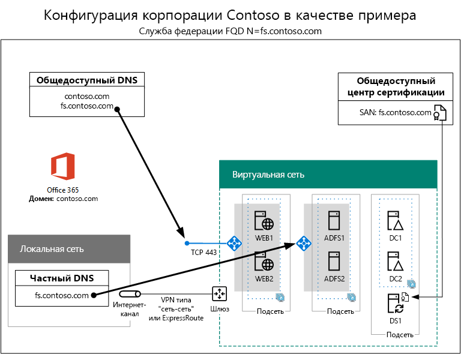

# Этап 5. Федеративная проверка подлинности для обеспечения высокой доступности: настройка федеративной проверки подлинности для Office 365

 **Сводка.** Настройка Azure AD Connect для федеративной проверки высокого уровня доступности для Office 365 в Microsoft Azure.
 
На этом последнем этапе развертывания федеративной проверки подлинности с высоким уровнем доступности для Office 365 в службах инфраструктуры Azure вы получаете и устанавливаете сертификат, выданный общедоступным центром сертификации, проверяете свою конфигурацию, а затем устанавливаете и запускаете Azure AD Connect на сервере DirSync. Azure AD Connect настраивает подписку на Office 365, серверы служб федерации Active Directory (AD FS) и прокси-серверы веб-приложений для федеративной проверки подлинности.
  
Описание всех этапов см. в статье [Развертывание в Azure федеративной проверки подлинности для обеспечения высокой доступности в случае использования Office 365](deploy-high-availability-federated-authentication-for-office-365-in-azure.md).
  
## Получение открытого сертификата и копирование его на сервер DirSync

Получите цифровой сертификат из общедоступного центра сертификации со следующими свойствами:
  
- Сертификат X.509 подходит для создания SSL-соединений.
    
- Расширенному свойству "Альтернативное имя субъекта" (SAN) присвоено полное доменное имя службы федерации (например, fs.contoso.com).
    
- Сертификат должен иметь закрытый ключ и формат PFX.
    
Кроме того, компьютеры и устройства организации должны доверять общедоступному центру сертификации, выдающему цифровой сертификат. Для этого в хранилище доверенных корневых центров сертификации на компьютерах и устройствах должен быть установлен корневой сертификат из общедоступного центра сертификации. На компьютерах с Microsoft Windows обычно установлен набор этих сертификатов из часто используемых центров сертификации. Если корневой сертификат из вашего общедоступного центра сертификации еще не установлен, разверните его на компьютерах и устройствах организации.
  
Дополнительные сведения о требованиях к сертификатам для федеративной проверки подлинности см. в разделе [Предварительные требования для установки и настройки федерации](https://docs.microsoft.com/azure/active-directory/connect/active-directory-aadconnect-prerequisites#prerequisites-for-federation-installation-and-configuration).
  
После получения сертификата скопируйте его в папку на диске C: сервера DirSync. Например, назовите файл SSL.pfx и сохраните его в папке C:\\Certs на сервере DirSync.
  
## Проверка конфигурации

Теперь все должно быть готово к настройке Azure AD Connect и федеративной проверки подлинности для Office 365. Проверьте, так ли это, с помощью этого контрольного списка:
  
- Общедоступный домен организации добавлен в подписку на Office 365.
    
- Учетные записи пользователей Office 365 вашей организации используют общедоступное доменное имя вашей организации и позволяют входить в систему.
    
- Вы определили полное доменное имя службы федерации на основе вашего общедоступного доменного имени.
    
- Запись A общедоступного домена DNS для полного доменного имени службы федерации указывает на общедоступный IP-адрес внешнего балансировщика нагрузки Azure для прокси-серверов веб-приложений.
    
- Запись A частного домена DNS для полного доменного имени службы федерации указывает на частный IP-адрес внутреннего балансировщика нагрузки Azure для серверов AD FS.
    
- Цифровой сертификат, выданный общедоступным центром сертификации, подходит для SSL-соединений, является файлом PFX и хранится на сервере DirSync, а SAN присвоено полное доменное имя службы федерации.
    
- Корневой сертификат для общедоступного центра сертификации установлен в хранилище доверенных корневых центров сертификации на компьютерах и устройствах.
    
Ниже приведен пример для организации Contoso.
  
**Пример конфигурации инфраструктуры федеративной проверки подлинности с высоким уровнем доступности в Azure**

  
## Настройка федеративной проверки подлинности с помощью Azure AD Connect

Чтобы настроить серверы AD FS, прокси-серверы веб-приложений и Office 365 для федеративной проверки подлинности с помощью средства Azure AD Connect, сделайте следующее:
  
1. Создайте подключение к удаленному рабочему столу сервера DirSync с помощью учетной записи домена с правами локального администратора.
    
2. На рабочем столе сервера DirSync откройте Internet Explorer и перейдите на страницу [(https://aka.ms/aadconnect)]((https://aka.ms/aadconnect)).
    
3. На странице **Microsoft Azure Active Directory Connect** нажмите **Скачать**, а затем **Запустить**.
    
4. На странице **Добро пожаловать в Azure AD Connect** установите флажок **Принимаю** и нажмите кнопку **Продолжить**.
    
5. На странице **Стандартные параметры** нажмите кнопку **Настроить**.
    
6. На странице **Установка обязательных компонентов** нажмите кнопку **Установить**.
    
7. На странице **Вход пользователя** выберите **Федерация с AD FS** и нажмите кнопку **Далее**.
    
8. На странице **Подключение к Azure AD** введите имя и пароль учетной записи глобального администратора Office 365 и нажмите кнопку **Далее**.
    
9. На странице **Подключить каталоги** убедитесь, что в разделе **Лес** выбран локальный лес Windows Server AD, введите имя и пароль учетной записи администратора домена, нажмите кнопку **Добавить каталог**, а затем кнопку **Далее**.
    
10. На странице **Настройка входа в Azure AD** нажмите кнопку **Далее**.
    
11. На странице **Фильтрация доменов и подразделений** нажмите кнопку **Далее**.
    
12. На странице **Уникальная идентификация пользователей** нажмите кнопку **Далее**.
    
13. На **Фильтрация пользователей и устройств** нажмите кнопку **Далее**.
    
14. На странице **Дополнительные возможности** нажмите кнопку **Далее**.
    
15. На странице **Ферма AD FS** нажмите кнопку **Настроить новую ферму AD FS**.
    
16. Нажмите кнопку **Обзор** и укажите расположение и имя SSL-сертификата из общедоступного центра сертификации.
    
17. Введите пароль сертификата и нажмите кнопку **ОК**.
    
18. Убедитесь, что в полях **Имя субъекта** и **Имя службы федерации** указано полное доменное имя службы федерации, и нажмите кнопку **Далее**.
    
19. На странице **Серверы AD FS** введите имя первого сервера AD FS (таблица M, элемент 4, "Имя виртуальной машины") и нажмите кнопку **Добавить**.
    
20. Введите имя второго сервера AD FS (таблица M, элемент 5, столбец "Имя виртуальной машины"), нажмите кнопку **Добавить**, а затем кнопку **Далее**.
    
21. На странице **Прокси-серверы веб-приложений** введите имя первого прокси-сервера веб приложений (таблица M, элемент 6, столбец "Имя виртуальной машины") и нажмите кнопку **Добавить**.
    
22. Введите имя второго прокси-сервера веб-приложений (таблица M, элемент 7, столбец "Имя виртуальной машины"), нажмите кнопку **Добавить**, а затем кнопку **Далее**.
    
23. На странице **Учетные данные администратора домена** введите имя пользователя и пароль администратора домена и нажмите кнопку **Далее**.
    
24. На странице **Учетная запись службы AD FS** введите имя пользователя и пароль администратора предприятия и нажмите кнопку **Далее**.
    
25. На странице **Домен Azure AD**, в разделе **Домен**, выберите DNS-имя домена организации и нажмите кнопку **Далее**.
    
26. На странице **Готово к настройке** нажмите кнопку **Установить**.
    
27. На странице **Установка завершена** нажмите **Проверить**. Появятся два сообщения о том, что конфигурации интрасети и Интернета проверены.
    
  - В сообщении интрасети должен быть указан частный IP-адрес внутреннего балансировщика нагрузки Azure для серверов AD FS.
    
  - В сообщении Интернета должен быть указан публичный IP-адрес внешнего балансировщика нагрузки Azure для прокси-серверов веб-приложений.
    
28. На странице **Установка завершена** нажмите **Выход**.
    
Ниже приводится окончательная конфигурация с именами-заполнителями для серверов.
  
**Этап 5. Окончательная конфигурация инфраструктуры федеративной проверки подлинности с высоким уровнем доступности в Azure**

  
Настройка инфраструктуры федеративной проверки подлинности с высоким уровнем доступности для Office 365 в Azure завершена.
  
## См. также

[Развертывание в Azure федеративной проверки подлинности для обеспечения высокой доступности в случае использования Office 365](deploy-high-availability-federated-authentication-for-office-365-in-azure.md)
  
[Федеративное удостоверение для среды разработки и тестирования Office 365](federated-identity-for-your-office-365-dev-test-environment.md)
  
[Освоение облака и гибридные решения](cloud-adoption-and-hybrid-solutions.md)

[Федеративные удостоверения для Office 365](https://support.office.com/article/Understanding-Office-365-identity-and-Azure-Active-Directory-06a189e7-5ec6-4af2-94bf-a22ea225a7a9#bk_federated)

