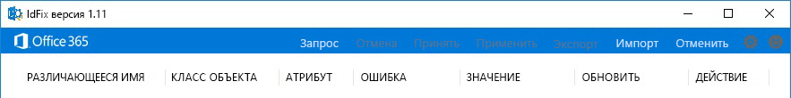
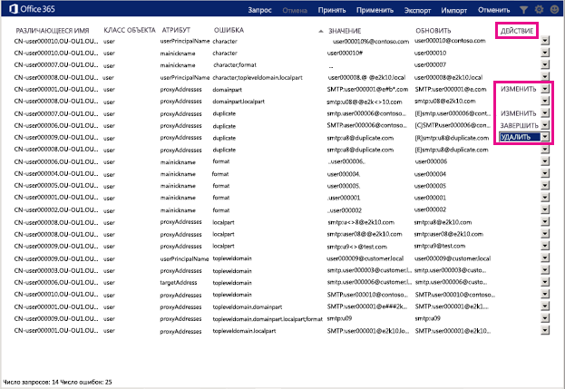

# Скачивание и запуск инструмента Office 365 IdFixInstall and run the Office 365 IdFix tool

IdFix определяет в домене AD DS (доменные службы Active Directory) ошибки, например повторения или ошибки форматирования, перед выполнением синхронизации с Office 365.IdFix identifies errors such as duplicates and formatting problems in your Active Directory Domain Services (AD DS) domain before you synchronize to Office 365. 
  
Для успешного завершения этой задачи требуются навыки работы с объектами пользователей, групп и контактов в AD DS.To finish this task successfully, you should be comfortable working with user, group, and contact objects in AD DS.
  
Если вы не можете выполнить эту задачу, существует еще несколько способов.If you can't complete this task, there are a couple of other things you can do. Они могут быть проще, но при этом могут занимать больше времени или иметь другие недостатки.These methods might be easier, but they might also take longer or have other drawbacks. Они указаны ниже.They are:
  
- **Запуск синхронизации каталога без запуска IdFix****Run directory synchronization without running IdFix** 

  Вы можете синхронизировать свой каталог, не используя инструмент IdFix, однако мы не рекомендуем этого делать.You can synchronize your directory without using the IdFix tool, but we don't recommend it. Исправление ошибок перед синхронизацией требует меньше времени и часто обеспечивает более плавный переход к облаку.Fixing errors before you synchronize takes less time and often provides a smoother transition to the cloud. 

- **Использование услуг консультанта****Hire a consultant** 

  Благодаря помощи экспертов можно быстро подготовить пользователей к работе и синхронизировать каталог.Getting expert help can get your users up and running quickly and your directory synchronized. 
    
## Что необходимо для запуска IdFixWhat you need to run IdFix

Самый простой способ запустить IdFix — скачать его на компьютер, подключенный к вашему домену AD DS.The easiest way to get IdFix up and running is to download it onto a computer that is joined to your AD DS domain. При желании вы можете запустить его на контроллере домена, но это необязательно.You can run it on the domain controller if you want, but it's not necessary.
  
### Требования IdFix к оборудованиюIdFix hardware requirements

Компьютер, на который скачивается IdFix, должен соответствовать следующим минимальным требованиям к оборудованию:The computer where you download IdFix needs to meet these minimum hardware requirements:
  
- 4 ГБ ОЗУ4 GB RAM
- 2 ГБ места на жестком дискеAt least 11 GB of hard disk space.
   
### Требования IdFix к программному обеспечениюIdFix software requirements

Компьютер, на который скачивается IdFix, должен быть присоединен к домену AD DS, пользователей из которого вы хотите синхронизировать с Office 365.The computer where you download IdFix needs to be joined to the same AD DS domain from which you want to synchronize users to Office 365. 

Кроме того, на компьютере должна быть установлена платформа .NET Framework 4.0.The computer also needs to have .NET Framework 4.0 installed. Если вы работаете под управлением Windows Server 2008, вероятно, что платформа .NET Framework уже установлена.If you are running Windows Server 2008 or later, the .NET Framework is probably already installed. Если нет, вы можете [скачать ее из Центра загрузки](https://go.microsoft.com/fwlink/p/?LinkId=400475) или с помощью Центра обновления Windows.If not, you can [download .NET 4.0 from the download center](https://go.microsoft.com/fwlink/p/?LinkId=400475) or with Windows Update. 
  
### Требования к разрешениям IdFixIdFix permissions requirements

Учетная запись пользователя, применяемая для запуска IdFix, должна иметь права на чтение и запись в домене AD DS.The user account that you use to run IdFix must have read and write access to the AD DS domain.
  
Если вы не уверены, что ваша учетная запись пользователя удовлетворяет данным требованиям, и не знаете как это проверить, вы все равно можете скачать и запустить IdFix.If you aren't sure if your user account meets these requirements, and you're not sure how to check, you can still download and run IdFix. Если ваша учетная запись пользователя не имеет соответствующих разрешений, при попытке запуска IdFix отобразится сообщение об ошибке.If your user account doesn't have the right permissions, IdFix will simply display an error when you try to run it.
  
## Скачивание и извлечение IdFixDownload and extract IdFix

Следуйте данным инструкциям.Follow these instructions. 
  
1. Войдите на компьютер, где нужно запустить инструмент IdFix.Sign in to the computer where you want to run the IdFix tool.
    
2. Перейдите на страницу Центра загрузки Майкрософт для [средства исправления ошибок синхронизации каталога IdFix](https://go.microsoft.com/fwlink/?linkid=867219).Go to the Microsoft download site for the [IdFix DirSync Error Remediation Tool](https://go.microsoft.com/fwlink/?linkid=867219).
    
3. Скачайте и откройте ZIP-файл.Download and open the zip file.
    
3. В папке **IdFix** выберите команду **Извлечь**, а затем — **Извлечь все**.In the **IdFix** window, choose **Extract**, and then **Extract all**. По умолчанию IdFix извлекается в папку `C:\Users\<your user name>\Documents\IdFix`.By default, IdFix is extracted to `C:\Users\<your user name>\Documents\IdFix`. 
    
6. Нажмите **Извлечь**.Choose **Extract**.

Эти действия были выполнены в Internet Explorer на сервере под управлением Windows Server 2016.These instructions were done with Internet Explorer on a server running Windows Server 2016. Если вы используете другую версию Windows или другой браузер, ваши действия могут отличаться.If you're using a different version of Windows or a different browser, your steps might vary.
    
## Запуск IdFixRun the tool.

После скачивания и извлечения IdFix запустите его для поиска проблем в домене AD DS.After you download and extract IdFix, run it to search for problems in your AD DS domain.
  
1. С помощью учетной записи, имеющей право чтения и записи в домене AD DS, войдите на компьютер, куда скачан IdFix.Using an account that has read/write access to your AD DS domain, sign in to the computer where you downloaded IdFix.
    
2. В проводнике перейдите в папку, куда извлечен IdFix.In File Explorer, go to the location where you extracted IdFix. Если во время установки была выбрана папка по умолчанию, перейдите в `C:\Users\<your user name>\Documents\IdFix`.If you chose the default folder during extraction, go to `C:\Users\<your user name>\Documents\IdFix`. 
    
3. Дважды щелкните **IdFix.exe**.Double-click **IdFix.exe**. 
  
4. По умолчанию для тестирования записей в каталоге IdFix использует многопользовательский набор правил.By default, IdFix uses the Multi-Tenant rule set to test the entries in your directory. Он подходит для большинства клиентов Office 365.This is the right rule set for most Office 365 customers. Но если вы являетесь пользователем выделенной службы Office 365 или пользователем ITAR (подчиняющимся Правилам международной торговли оружием), вы можете настроить IdFix для использования набора правил "Выделенный".However, if you are an Office 365 Dedicated or International Traffic in Arms Regulations (ITAR)) customer, you can configure IdFix to use the Dedicated rule set instead. Если вы не знаете, к какому типу пользователей относитесь, пропустите этот шаг.If you aren’t sure what type of customer you are, you can safely disregard this note. Чтобы изменить набор правил на "Выделенный", щелкните значок шестеренки в строке меню и выберите **Выделенный**.To set the rule set to Dedicated, click the gear icon in the menu bar, and then choose **Dedicated**.
    
5. Выберите **Запрос**.Choose **Query**.
    
    
  
6. По умолчанию IdFix выполняет поиск ошибок по всему каталогу.By default, IdFix searches the entire directory for errors.
    
    В зависимости от размера каталога выполнение запроса может занять некоторое время.Depending on the size of your directory, running the query can take a while. Отслеживать ход выполнения можно в нижней части главного окна программы.You can watch the progress at the bottom of the tool's main window. Если вы нажмете кнопку **Отмена**, потребуется начать все с начала.If you click **Cancel**, you'll need to restart from the beginning.
  
7. После выполнения запроса, вы можете синхронизировать свой каталог, если не обнаружено никаких ошибок.After IdFix completes the query, you can synchronize your directory if there are no errors. Если в каталоге есть ошибки, рекомендуется исправить их до синхронизации.If there are errors in your directory, it is recommended that you fix them before you synchronize. Дополнительные сведения см. в статье [Подготовка атрибутов каталога к синхронизации с Office 365](prepare-directory-attributes-for-synch-with-idfix.md).See [prepare directory attributes for synchronization with Office 365](prepare-directory-attributes-for-synch-with-idfix.md) for more information.
    
    Хотя исправлять ошибки перед синхронизацией необязательно, мы настоятельно рекомендуем по крайней мере просмотреть все ошибки, обнаруженные IdFix.While it is not mandatory to fix the errors before you synchronize, we strongly recommend that you at least review all the errors returned by IdFix.
    
    Каждая ошибка отображается в отдельной строке в главном окне инструмента.Each error is displayed in a separate row in the tool's main window . 
    
8. Если вы согласны с изменениями, предлагаемыми в столбце **ОБНОВЛЕНИЕ**, в столбце **ДЕЙСТВИЕ** выберите, что средство IdFix должно сделать для их применения, и нажмите кнопку **Применить**.If you agree with the suggested change in the **UPDATE** column, in the **ACTION** column select what you want IdFix to do to implement the change and then click **Apply**. При нажатии кнопки **Применить** инструмент вносит изменения в каталог.When you click **Apply**, the tool makes the changes in the directory.
    
    Не нужно нажимать кнопку **Применить** после каждого обновления.You don't have to click **Apply** after each update. Вы можете исправить несколько ошибок, а потом нажать кнопку **Применить**, чтобы IdFix изменил их все за один раз.Instead, you can fix several errors before you click **Apply** and IdFix will change them all at the same time. Вы можете сортировать ошибки по типу, щелкая **ОШИБКА** в верхней части столбца, в котором перечислены типы ошибок.You can sort the errors by error type by clicking **ERROR** at the top of the column that lists the error types. 
    
    Первый способ — исправить все ошибки одного типа. Например, сначала исправить все повторяющиеся записи и применить их.One strategy is to fix all the errors of the same type; for example, fix all the duplicates first, and apply them. После этого можно исправить ошибки форматирования символов и так далее.Next, fix the character format errors, and so on. Каждый раз после применения изменений IdFix создает отдельный файл журнала, который можно использовать для отмены изменений в случае ошибки.Each time you apply the changes, the IdFix tool creates a separate log file that you can use to undo your changes in case you make a mistake. [Журнал транзакций](idfix-transaction-log.md) хранится в папке, в которую извлечен IdFix (по умолчанию это _C:\Users\<ваше имя пользователя>\Documents\IdFix_).The [transaction log](idfix-transaction-log.md) is stored in the folder where you extracted IdFix, which is _C:\Users\<your user name>\Documents\IdFix_ by default. 
    
    
  
9. После внесения в каталог всех изменений запустите IdFix еще раз, чтобы убедиться, что эти исправления не приводят к появлению новых ошибок.After all of your changes are made to the directory, run IdFix again to ensure that the fixes you made didn't introduce new errors. Можно повторять эти действия столько раз, сколько необходимо.You can repeat these steps for as many sites as you want to join to the hub. Рекомендуется выполнить этот процесс перед синхронизацией несколько раз.It's a good idea to go through the process a few times before you synchronize.
    
## Дополнительные ресурсы по IdFixAdditional resources on IdFix 

- [Исключаемые и поддерживаемые объекты и атрибуты IdFixIdFix excluded and supported objects and attributes](idfix-excluded-and-supported-objects-and-attributes.md)  
- [Журнал транзакций Office 365 IdFixReference: Office 365 IdFix transaction log](idfix-transaction-log.md)
    
## Обучающее видеоVideo training

Дополнительные сведения см. в статье [Установка и использование инструмента IdFix](https://support.office.com/article/install-and-use-the-idfix-tool-4d81d73c-f172-4fd5-8542-f601c0c96aa9?ui=en-US&rs=en-US&ad=US). Обучающее видео предоставлено платформой LinkedIn Learning.For more information, see the lesson [Install and use the IdFix tool](https://support.office.com/article/install-and-use-the-idfix-tool-4d81d73c-f172-4fd5-8542-f601c0c96aa9?ui=en-US&rs=en-US&ad=US), brought to you by LinkedIn Learning.
  

