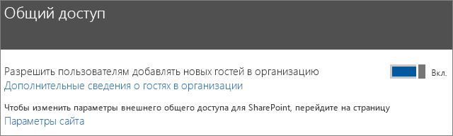
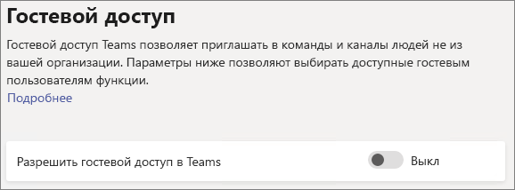
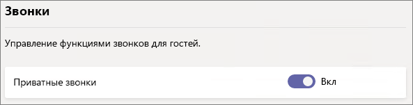
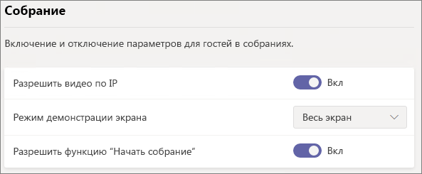
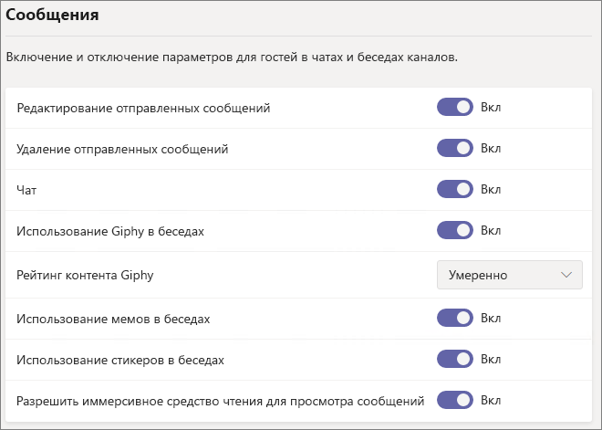
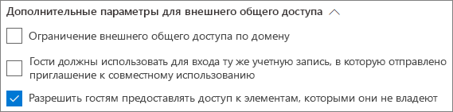
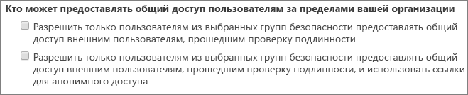

# Справочные сведения о параметрах гостевого общего доступа в Microsoft 365Microsoft 365 guest sharing settings reference

В этой статье описаны различные параметры, которые могут влиять на гостевой общий доступ к рабочим нагрузкам Microsoft 365: Teams, группам Office 365, SharePoint и OneDrive.This article provides a reference for the various settings that can affect guest sharing for the Microsoft 365 workloads: Teams, Office 365 Groups, SharePoint, and OneDrive. Эти параметры находятся в Центрах администрирования Azure Active Directory, Microsoft 365, Teams и SharePoint.These settings are located in the Azure Active Directory, Microsoft 365, Teams, and SharePoint admin centers.

## Azure Active DirectoryAzure Active Directory

**Роль администратора:** глобальный администратор**Admin role:** Global administrator

Azure Active Directory — это служба каталогов, используемая в Microsoft 365.Azure Active Directory is the directory service used by  Microsoft 365. Параметры организационных связей Azure Active Directory непосредственно влияют на общий доступ в Teams, группах Office 365, SharePoint и OneDrive.The Azure Active Directory Organizational relationships settings directly affect sharing in Teams, Office 365 Groups, SharePoint, and OneDrive.

> [!NOTE]
> Эти параметры влияют на SharePoint только в том случае, если настроена [интеграция SharePoint и OneDrive с Azure AD B2B (предварительная версия)](https://docs.microsoft.com/sharepoint/sharepoint-azureb2b-integration-preview).These settings only affect SharePoint when [SharePoint and OneDrive integration with Azure AD B2B (Preview)](https://docs.microsoft.com/sharepoint/sharepoint-azureb2b-integration-preview) has been configured. В таблице ниже предполагается, что эта настройка выполнена.The table below assumes that this has been configured.

### Параметры организационных связейOrganizational relationships settings

**Навигация:** [Центр администрирования Azure Active Directory](https://aad.portal.azure.com) > Azure Active Directory > Организационные связи > Настройки**Navigation:** [Azure Active Directory admin center](https://aad.portal.azure.com) > Azure Active Directory > Organizational relationships > Settings

|**Параметр****Setting**|**По умолчанию****Default**|**Описание****Description**|
|:-----|:-----|:-----|
|Разрешения для гостей ограниченыGuest users permissions are limited|ДаYes|Этот параметр влияет на задачи каталога, которые может выполнять гость.This setting affects the directory tasks that a guest can perform.|
|Администраторы и пользователи с ролью приглашающего гостей могут приглашатьAdmins and users in the guest inviter role can invite|ДаYes|Если установлено значение **Да**, администраторы смогут приглашать гостей с помощью интерфейсов общего доступа Azure AD и Microsoft 365, таких как Teams и SharePoint; если установлено значение **Нет**, они не смогут этого делать.When set to **Yes**, admins can invite guests via Azure AD and via  Microsoft 365 sharing experiences such as Teams and SharePoint; when set to **No**, they cannot.|
|Участники могут приглашатьMembers can invite|ДаYes|Если установлено значение **Да**, участники Azure AD смогут приглашать гостей с помощью Azure AD; если установлено значение **Нет**, они не смогут этого делать.When set to **Yes**, Azure AD members can invite guests via Azure AD; when set to **No**, they cannot. Если установлено значение **Да**, участники групп Office 365 смогут приглашать гостей с утверждения владельца. Если установлено значение **Нет**, участники групп Office 365 смогут приглашать гостей с утверждения владельца, но владельцы должны быть глобальными администраторами для утверждения.When set to **Yes**, Office 365 Group members can invite guests with owner approval; when set to **No**, Office 365 Group members can invite guests with owner approval but owners must be global administrators to approve.   Обратите внимание, что параметр **Участники могут приглашать** относится к участникам в Azure AD (в отличие от гостей), а не участникам сайта или группы в Microsoft 365.Note that **Members can invite** refers to members in Azure AD (as opposed to guests) and not to site or group members in  Microsoft 365.   Это аналогично параметру **Разрешить пользователям добавлять новых гостей в организацию** в разделе безопасности и конфиденциальности Microsoft 365.This is identical to the **Let users add new guests to the organization** setting in Microsoft 365 Security & privacy.|
|Гости могут приглашатьGuests can invite|ДаYes|Если установлено значение **Да**, гости в каталоге смогут приглашать других гостей для совместной работы с ресурсами Azure AD, а также файлами и папками в SharePoint и OneDrive; если установлено значение **Нет**, они не смогут этого делать.When set to **Yes**, guests in the directory can invite other guests to collaborate on Azure AD resources and on files and folders in SharePoint and OneDrive; when set to **No**, they cannot.   Обратите внимание, что параметр **Разрешить внешним пользователям находить учетные записи пользователей в каталоге по их электронным адресам при условии точного совпадения** должен быть включен в Центре администрирования SharePoint, чтобы гости могли предоставлять общий доступ к файлам и папкам другим гостям.Note that **Allow external users to find user accounts in the directory by typing in exact email address matches** must be turned on in the SharePoint admin center for guests to share files and folders with other guests.|
|Включить одноразовый секретный код электронной почты для гостей (предварительная версия)Enable Email One-Time Passcode for guests (Preview)|НетNo|Если установлено значение **Да**, гости без MSA, рабочей или учебной учетной записи смогут [проходить проверку подлинности с помощью Azure AD, используя одноразовый секретный код](https://docs.microsoft.com/azure/active-directory/b2b/one-time-passcode); если установлено значение **Нет**, пользователям потребуется создать учетную запись Майкрософт для проверки подлинности.When set to **Yes**, guests without an MSA or a work or school account can [authenticate with Azure AD using a one-time passcode](https://docs.microsoft.com/azure/active-directory/b2b/one-time-passcode); when set to **No**, users will need to create a Microsoft account in order to authenticate. Чтобы использовать [интеграцию SharePoint и OneDrive с Azure AD B2B (предварительная версия)](https://docs.microsoft.com/sharepoint/sharepoint-azureb2b-integration-preview), для этого параметра требуется установить значение **Да**.This setting must be set to **Yes** for [SharePoint and OneDrive integration with Azure AD B2B (Preview)](https://docs.microsoft.com/sharepoint/sharepoint-azureb2b-integration-preview) to work.|
|Ограничения взаимодействияCollaboration restrictions|Разрешить отправку приглашений в любой доменAllow invitations to be sent to any domain|Этот параметр позволяет указать список разрешенных и заблокированных доменов для общего доступа.This setting allows you to specify a list of allowed or blocked domains for sharing. Если указаны разрешенные домены, приглашения к совместному использованию можно отправлять только в эти домены.When allowed domains are specified, then sharing invitations can only be sent to those domains. Если указаны запрещенные домены, приглашения к совместному использованию нельзя отправлять в эти домены.When denied domains are specified, then sharing invitations cannot be sent to those domains.   Этот параметр влияет на интерфейсы общего доступа Microsoft 365, такие как Teams и SharePoint.This setting affects  Microsoft 365 sharing experiences such as Teams and SharePoint. Вы можете разрешить или заблокировать домены на более детальном уровне, воспользовавшись фильтрацией доменов в SharePoint или Teams.You can allow or block domains at a more granular level by using domain filtering in SharePoint or Teams.|

Эти параметры влияют на способ приглашения пользователей в каталог.These settings affect how users are invited to the directory. Они не влияют на предоставление общего доступа гостям, уже находящимся в каталоге.They do not affect sharing with guests who are already in the directory.

## Microsoft 365Microsoft 365

**Роль администратора:** глобальный администратор**Admin role:** Global administrator

В центре администрирования Microsoft 365 есть параметры уровня организации для общего доступа и групп Office 365.The Microsoft 365 admin center has organization-level settings for sharing and for Office 365 Groups.

### Общий доступSharing

**Навигация:** [Центр администрирования Microsoft 365](https://admin.microsoft.com) > Параметры > Безопасность и конфиденциальность > Общий доступ**Navigation:** [Microsoft 365 admin center](https://admin.microsoft.com) > Settings > Security & privacy > Sharing

|**Параметр****Setting**|**По умолчанию****Default**|**Описание****Description**|
|:-----|:-----|:-----|
|Разрешить пользователям добавлять новых гостей в организациюLet users add new guests to the organization|Вкл.On|Если установлено значение **Да**, участники Azure AD смогут приглашать гостей с помощью Azure AD; если установлено значение **Нет**, они не смогут этого делать.When set to **Yes**, Azure AD members can invite guests via Azure AD; when set to **No**, they cannot. Если установлено значение **Да**, участники групп Office 365 смогут приглашать гостей с утверждения владельца. Если установлено значение **Нет**, участники групп Office 365 смогут приглашать гостей с утверждения владельца, но владельцы должны быть глобальными администраторами для утверждения.When set to **Yes**, Office 365 Group members can invite guests with owner approval; when set to **No**, Office 365 Group members can invite guests with owner approval but owners must be global administrators to approve.   Обратите внимание, что параметр **Участники могут приглашать** относится к участникам в Azure AD (в отличие от гостей), а не участникам сайта или группы в Microsoft 365.Note that **Members can invite** refers to members in Azure AD (as opposed to guests) and not to site or gorup members in  Microsoft 365.   Это идентично параметру **Участники могут приглашать** в настройках организационных связей Azure Active Directory.This is identical to the **Members can invite** setting in Azure Active Directory Organizational relationships settings.|

### Группы Office 365Office 365 Groups

**Навигация:** [Центр администрирования Microsoft 365](https://admin.microsoft.com) > Параметры > Службы и надстройки > Группы Office 365**Navigation:** [Microsoft 365 admin center](https://admin.microsoft.com) > Settings > Services & add-ins > Office 365 Groups

|**Параметр****Setting**|**По умолчанию****Default**|**Описание****Description**|
|:-----|:-----|:-----|
|Разрешить участникам группы, не входящим в организацию, доступ к содержимому группыLet group members outside your organization access group content|Вкл.On|Если установлено значение **Вкл.**, гости смогут получать доступ к содержимому групп; если установлено значение **Выкл.**, они не смогут этого делать.When set to **On**, guests can access groups content; when set to **Off**, they can't. Для любого сценария, в котором гостевые пользователи взаимодействуют с группами Office 365 и Teams, этому параметру должно быть присвоено значение **Вкл.** This setting should be **On** for any scenario where guest users are interacting with Office 365 Groups or Teams.|
|Разрешить владельцам групп добавлять в свои группы людей, не входящих в организациюLet group owners add people outside your organization to groups|Вкл.On|Если установлено значение **Вкл.**, владельцы групп Office 365 или команд Teams смогут приглашать новых гостей в группу.When **On**, Owners of Office 365 Groups or Teams can invite new guests to the group. Если установлено значение **Выкл.**, владельцы смогут приглашать только гостей, уже находящихся в каталоге.When **Off**, owners can only invite guests who are already in the directory.|

## TeamsTeams

В Teams главный переключатель гостевого доступа **Разрешить гостевой доступ в Teams** должен быть установлен в положение **Вкл.**, чтобы обеспечить доступность других гостевых параметров.The Teams master guest access switch, **Allow guest access in Teams**, must be **On** for the other guest settings to be available.

**Роль администратора:** администратор служб Teams**Admin role:** Teams service administrator

### Гостевой доступGuest access

**Навигация:** [Центр администрирования Teams](https://admin.teams.microsoft.com) > Параметры на уровне организации > Гостевой доступ**Navigation:** [Teams admin center](https://admin.teams.microsoft.com) > Org-wide settings > Guest access

|**Параметр****Setting**|**По умолчанию****Default**|**Описание****Description**|
|:-----|:-----|:-----|
|Разрешить гостевой доступ в TeamsAllow guest access in Teams|Выкл.Off|Включает и отключает гостевой доступ для Teams в целом.Turns guest access on or off for Teams overall. Вступление в силу изменения этого параметра может занять 24 часа.This setting can take 24 hours to take effect once changed.|

### Звонки для гостейGuest calling

**Навигация:** [Центр администрирования Teams](https://admin.teams.microsoft.com) > Параметры на уровне организации > Гостевой доступ**Navigation:** [Teams admin center](https://admin.teams.microsoft.com) > Org-wide settings > Guest access

|**Параметр****Setting**|**По умолчанию****Default**|**Описание****Description**|
|:-----|:-----|:-----|
|Приватные звонкиMake private calls|Вкл.On|Если установлено значение **Вкл.**, гости смогут совершать одноранговые звонки в Teams; если установлено значение **Выкл.**, они не смогут этого делать.When **On**, guests can make peer-to-peer calls in Teams; when **Off**, they can't.|

### Гостевые собранияGuest meeting

**Навигация:** [Центр администрирования Teams](https://admin.teams.microsoft.com) > Параметры на уровне организации > Гостевой доступ**Navigation:** [Teams admin center](https://admin.teams.microsoft.com) > Org-wide settings > Guest access

|**Параметр****Setting**|**По умолчанию****Default**|**Описание****Description**|
|:-----|:-----|:-----|
|Разрешить видео по IPAllow IP video|Вкл.On|Если установлено значение **Вкл.**, гости смогут использовать видео в своих звонках и собраниях; если установлено значение **Выкл.**, они не смогут этого делать.When **On**, guests can use video in their calls and meetings; when **Off**, they can't.|
|Режим демонстрации экранаScreen sharing mode|Весь экранEntire screen|Если выбрано значение **Отключено**, гости не смогут демонстрировать свои экраны в Teams.When **Disabled**, guests can't share their screens in Teams. Если установлено значение **Одно приложение**, гости смогут делиться только одним приложением на своем экране.When set to **Single application**, guests can only share a single application on their screen. Если установлено значение **Весь экран**, гости смогут делиться приложением или всем своим экраном.When set to **Entire screen**, guests can choose to share an applicaion or their entire screen.|
|Разрешить функцию "Начать собрание"Allow Meet Now|Вкл.On|Если установлено значение **Вкл.**, гости смогут использовать функцию "Начать собрание" в Teams; если установлено значение **Выкл.**, они не смогут этого делать.When **On**, guests can use the Meet Now feature in Teams; when **Off**, they can't.|

### Сообщения для гостейGuest messaging

**Навигация:** [Центр администрирования Teams](https://admin.teams.microsoft.com) > Параметры на уровне организации > Гостевой доступ**Navigation:** [Teams admin center](https://admin.teams.microsoft.com) > Org-wide settings > Guest access

|**Параметр****Setting**|**По умолчанию****Default**|**Описание****Description**|
|:-----|:-----|:-----|
|Редактирование отправленных сообщенийEdit sent messages|Вкл.On|Если установлено значение **Вкл.**, гости смогут изменять отправленные сообщения; если установлено значение **Выкл.**, они не смогут этого делать.When **On**, guests can edit messages they previously sent; when **Off**, they can't.|
|Удаление отправленных сообщенийDelete sent messages|Вкл.On|Если установлено значение **Вкл.**, гости смогут удалять отправленные сообщения; если установлено значение **Выкл.**, они не смогут этого делать.When **On**, guests can delete messages they previously sent; when **Off**, they can't.|
|ЧатChat|Вкл.On|Если установлено значение **Вкл.**, гости смогут использовать чат в Teams; если установлено значение **Выкл.**, они не смогут этого делать.When **On**, guests can use chat in Teams; when **Off**, they can't.|
|Использование Giphy в беседахUse Giphys in conversations|Вкл.On|Если установлено значение **Вкл.**, гости смогут использовать Giphy в беседах; если установлено значение **Выкл.**, они не смогут этого делать.When **On**, guests can use Giphys in conversations; when **Off**, they can't.|
|Рейтинг контента GiphyGiphy content rating|УмеренноModerate|Если установлено значение **Разрешить весь контент**, гости смогут вставлять все Giphy в беседы, независимо от рейтинга контента.When set to **Allow all content**, guests will can insert all Giphys in chats, regardless of the content rating. Если установлено значение **Умеренно**, гости смогут вставлять Giphy в беседы, при этом будет применяться умеренное ограничение в отношении контента для взрослых. Wnen set to **Moderate** guests can insert Giphys in chats, but will be moderately restricted from adult content. Если установлено значение **Строго**, гости смогут вставлять Giphy в беседы, но будет запрещено вставлять контент для взрослых. When set to **Strict** guests can insert Giphys in chats, but will be restricted from inserting adult content.|
|Использование мемов в беседахUse Memes in conversations|Вкл.On|Если установлено значение **Вкл.**, гости смогут использовать мемы в беседах; если установлено значение **Выкл.**, они не смогут этого делать.When **On**, guests can use memes in conversations; when **Off**, they can't.|
|Использование стикеров в беседахUser stickers in conversations|Вкл.On|Если установлено значение **Вкл.**, гости смогут использовать стикеры в беседах; если установлено значение **Выкл.**, они не смогут этого делать.When **On**, guests can use stickers in conversations; when **Off**, they can't.|
|Разрешить иммерсивное средство чтения для просмотра сообщенийAllow immersive reader for viewing messages|Вкл.On|Если установлено значение **Вкл.**, гости смогут просматривать сообщения в иммерсивном средстве чтения; если установлено значение **Выкл.**, они не смогут этого делать.When **On**, guests can view messages in Immersive Reader; when **Off**, they can't.|

## SharePoint и OneDrive (уровень организации)SharePoint and OneDrive (organization-level)

**Роль администратора:** администратор SharePoint**Admin role:** SharePoint administrator

Эти параметры влияют на все сайты в организации.These settings affect all of the sites in the organization. Они не влияют на группы Office 365 и Teams напрямую, но рекомендуется согласовать эти параметры с параметрами для групп Office 365 и Teams, чтобы избежать проблем при взаимодействии с пользователями.They do not affect Office 365 Groups or Teams directly, however we recommend that you align these settings with the settings for Office 365 Groups and Teams to avoid user experience issues. (Например, если гостевой общий доступ разрешен в Teams, но не в SharePoint, гости в Teams не получат доступ к вкладке "Файлы", так как файлы Teams хранятся в SharePoint.)(For example, if guest sharing is allowed in Teams but not SharePoint, then guests in Teams will not have access to the Files tab because Teams files are stored in SharePoint.)

### Параметры общего доступа в SharePoint и OneDriveSharePoint and OneDrive sharing settings

Так как OneDrive является иерархией сайтов в SharePoint, параметры общего доступа на уровне организации непосредственно влияют на OneDrive, как и на другие сайты SharePoint.Because OneDrive is a hierarchy of sites within SharePoint, the organization-level sharing settings directly affect OneDrive just as they do other SharePoint sites.

**Навигация:** Центр администрирования SharePoint > Общий доступ**Navigation:** SharePoint admin center > Sharing

|**Параметр****Setting**|**По умолчанию****Default**|**Описание****Description**|
|:-----|:-----|:-----|
|SharePointSharePoint|ВсеAnyone|Задает наименее строгие разрешения на общий доступ, доступные для сайтов SharePoint.Specifies the most permissive sharing permissions allowed for SharePoint sites.|
|OneDriveOneDrive|ВсеAnyone|Задает наименее строгие разрешения на общий доступ, доступные для сайтов OneDrive.Specifies the most permissive sharing permissions allowed for OneDrive sites. Этот параметр не может быть менее строгим, чем параметр SharePoint.This setting cannot be more permissive than the SharePoint setting.|

### Дополнительные параметры общего доступа в SharePoint и OneDriveSharePoint and OneDrive advanced sharing settings

**Навигация:** Центр администрирования SharePoint > Общий доступ**Navigation:** SharePoint admin center > Sharing

|**Параметр****Setting**|**По умолчанию****Default**|**Описание****Description**|
|:-----|:-----|:-----|
|Ограничение внешнего общего доступа по доменуLimit external sharing by domain|Выкл.Off|Этот параметр позволяет указать список разрешенных и заблокированных доменов для общего доступа.This setting allows you to specify a list of allowed or blocked domains for sharing. Если указаны разрешенные домены, приглашения к совместному использованию можно отправлять только в эти домены.When allowed domains are specified, then sharing invitations can only be sent to those domains. Если указаны запрещенные домены, приглашения к совместному использованию нельзя отправлять в эти домены.When denied domains are specified, then sharing invitations cannot be sent to those domains.   Этот параметр влияет на все сайты SharePoint и OneDrive в организации.This setting affects all SharePoint and OneDrive sites in the organization.|
|Гости должны использовать для входа ту же учетную запись, в которую отправлено приглашение к совместному использованиюGuests must sign in using the same account to which sharing invitations are sent|Выкл.Off|Запрещает гостям активировать приглашения к совместному использованию сайта с использованием адреса электронной почты, отличного от того, на которое отправлено приглашение.Prevents guests from redeeming site sharing invitations using a different email address than the invitation was sent to.  [При интеграции SharePoint и OneDrive с Azure AD B2B (предварительная версия)](https://docs.microsoft.com/sharepoint/sharepoint-azureb2b-integration-preview) этот параметр не используется, так как все гости добавляются в каталог на основе адреса электронной почты, на который было отправлено приглашение.[SharePoint and OneDrive integration with Azure AD B2B (Preview)](https://docs.microsoft.com/sharepoint/sharepoint-azureb2b-integration-preview) does not use this setting because all guests are added to the directory based on the email address that the invitation was sent to. Другие адреса электронной почты нельзя использовать для доступа к сайту.Alternate email addresses cannot be used to access the site.|
|Разрешить гостям предоставлять доступ к элементам, которыми они не владеютAllow guests to share items they don't own|Вкл.On|Если установлено значение **Вкл.**, гости смогут делиться элементами, которыми они не владеют, с другими пользователями или гостями; если установлено значение **Выкл.**, они не смогут этого делать.When **On**, guests can share items that they don't own with other users or guests; when **Off** they cannot. Гости всегда могут делиться элементами, к которым у них есть полный доступ.Guests can always share items for which they have full control.|

### Параметры ссылок на файлы и папки в SharePoint и OneDriveSharePoint and OneDrive file and folder link settings

Когда к файлам и папкам предоставляется общий доступ в SharePoint и OneDrive, получателям общего доступа отправляется ссылка с разрешениями на доступ к файлу или папке вместо предоставления к ним прямого доступа.When files and folders are shared in SharePoint and OneDrive, sharing recipients are sent a link with permissions to the file or folder rather than being granted direct access to the file or folder themselves. Доступно несколько типов ссылок, и можно выбрать тип ссылки, отображаемый по умолчанию для пользователей, когда они делятся файлом или папкой.Several types of links are available, and you can choose the default link type presented to users when they share a file or folder. Кроме того, можно настроить параметры разрешений и срока действия для ссылок типа *Любой пользователь*.You can also set permissions and expiration options for *Anyone* links.

**Навигация:** Центр администрирования SharePoint > Общий доступ**Navigation:** SharePoint admin center > Sharing

|**Параметр****Setting**|**По умолчанию****Default**|**Описание****Description**|
|:-----|:-----|:-----|
|Ссылки на файлы и папкиFile and folder links|Любой пользователь со ссылкойAnyone with this link|Указывает, какая ссылка для общего доступа отображается по умолчанию, когда пользователь предоставляет общий доступ к файлу или папке.Specifies which sharing link is shown by default when a user shares a file or folder. Пользователи могут изменить этот параметр перед предоставлением общего доступа.Users can change the option before sharing if they want. Если в качестве параметра по умолчанию выбрано значение **Любой пользователь со ссылкой**, но для определенного сайта не разрешен параметр общего доступа *Все*, в качестве ссылки по умолчанию для этого сайта будет отображаться тип **Только пользователи из вашей организации**.If the default is set to **Anyone with the link** and *Anyone* sharing is not allowed for a given site, then **Only people in your organization** will be shown as the default for that site.|
|Срок действия этих ссылок должен истечь в течение указанного количества днейThese links must expire within this many days|Выкл. (с неограниченным сроком действия)Off (no expiration)|Определяет число дней с момента создания, через которые истекает срок действия ссылки типа *Любой пользователь*.Specifies the number of days after an *Anyone* link is created that it expires. Ссылки с истекшим сроком действия невозможно продлить.Expired links cannot be renewed. Создайте новую ссылку, если требуется предоставлять общий доступ после истечения срока действия.Create a new link if you need to continue sharing past the expiration.|
|Разрешения для файловFile permissions|Просмотр и изменениеView and edit slide notes|Указывает уровни разрешений для файлов, доступные пользователям при создании ссылки типа *Любой пользователь*.Specifies the file permission levels available to users when creating an *Anyone* link. Если выбран вариант **Просмотр**, пользователи смогут создавать ссылки типа *Любой пользователь* только с разрешениями на просмотр файлов.If **View** is selected, then users can only create *Anyone* file links with view permissions. Если выбран вариант **Просмотр и изменение**, пользователи при создании ссылки смогут выбирать между разрешениями на просмотр и на просмотр с изменением.If **View, and edit** is selected, then users can choose between view and view and edit permissions when they create the link.|
|Разрешения для папокFolder permissions|Просмотр, изменение и отправкаView, edit, and upload|Указывает уровни разрешений для папок, доступные пользователям при создании ссылки типа *Любой пользователь*.Specifies the folder permission levels available to users when creating an *Anyone* link. Если выбран вариант **Просмотр**, пользователи смогут создавать ссылки типа *Любой пользователь* только с разрешениями на просмотр папок.If **View** is selected, then users can only create *Anyone* folder links with view permissions. Если выбран вариант **Просмотр, изменение и отправка**, пользователи смогут выбирать между разрешениями на просмотр и на просмотр с изменением и отправкой при создании ссылки.If **View, edit, and upload** is selected, then users can choose between view and view, edit, and upload permissions when they creat the link.|

### Параметры группы безопасности в SharePoint и OneDriveSharePoint and OneDrive security group settings

Если нужно разрешить только определенным пользователям предоставлять общий доступ гостям в SharePoint и OneDrive, это можно сделать, ограничив предоставление общего доступа пользователями в определенных группах безопасности.If you want to limit who can share with guests in SharePoint and OneDrive, you can do so by limiting sharing to people in specified security groups. Эти параметры не влияют на общий доступ с помощью групп Office 365 и Teams.These settings do not affect sharing via Office 365 Groups or Teams. Гости, приглашенные с помощью группы или команды, также получат доступ к связанному сайту, но общий доступ к документам и папкам может предоставляться только пользователями из определенных групп безопасности.Guests invited via a group or team would also have access to the associated site, though document and folder sharing could only be done by people in the specified security groups.

**Навигация:** Центр администрирования SharePoint > Общий доступ > Ограничить внешний общий доступ определенными группами безопасности**Navigation:** SharePoint admin center > Sharing > Limit external sharing to specific security groups

|**Параметр****Setting**|**По умолчанию****Default**|**Описание****Description**|
|:-----|:-----|:-----|
|Разрешить только пользователям из выбранных групп безопасности предоставлять общий доступ внешним пользователям, прошедшим проверку подлинностиnote the security groups listed for Let only users in selected security groups share with authenticated external users.|Выкл.Off|Если этот параметр **включен**, только пользователи из указанных групп безопасности смогут предоставлять общий доступ внешним пользователям.When **On**, only the people in the specified security groups can share with external users. Доступны только ссылки типа *Конкретные люди*.Only *Specific people* links are available. Ссылки общего доступа типа *Любой пользователь* отключены, если параметр **Разрешить только пользователям из выбранных групп безопасности предоставлять общий доступ внешним пользователям, прошедшим проверку подлинности, и использовать ссылки для анонимного доступа** не **включен***Anyone* sharing is effectively disabled unless **Let only users in selected security groups share with authenticated external users and using anonymous links** is also **On**|
|Разрешить только пользователям из выбранных групп безопасности предоставлять общий доступ внешним пользователям, прошедшим проверку подлинности, и использовать ссылки для анонимного доступаnote the security groups listed for Let only users in selected security groups share with authenticated external users and using anonymous links.|Выкл.Off|Если этот параметр **включен**, только пользователи из указанных групп безопасности смогут предоставлять общий доступ гостям.When **On**, only the people in the specified security groups can share with guests. Доступны ссылки типа *Любой пользователь* и *Конкретные люди*.Both *Anyone* and *Specific people* links are available.|

Оба этих параметра можно использовать одновременно.Both of these settings can be used at the same time. Если пользователь состоит в группах безопасности, указанных для обоих параметров, приоритет имеет менее строгий уровень разрешения (*Любой пользователь* и *Конкретный пользователь*).If a user is in security groups specified for both settings, then the greater permission level prevails (*Anyone* plus *Specific user*).

## SharePoint (уровень сайта)SharePoint (site level)

**Роль администратора:** администратор SharePoint**Admin role:** SharePoint administrator

### Общий доступ к сайтамSite sharing

Можно настроить разрешения гостевого общего доступа для каждого сайта в SharePoint.You can set guest sharing permissions for each site in SharePoint. Этот параметр применяется для предоставления общего доступа к сайтам, а также файлам и папкам.This setting applies to both site sharing and file and folder sharing. (Параметр общего доступа *Все* недоступен при предоставлении общего доступа к сайту.(*Anyone* sharing is not available for site sharing. Если выбрать параметр **Все**, пользователи смогут предоставлять новым и существующим гостям общий доступ к файлам и папкам с помощью ссылок типа *Любой пользователь*, а также к сайту.)If you choose **Anyone**, users will be able to share files and folders by using *Anyone* links, and the site itself with new and existing guests.)

**Навигация:** Центр администрирования SharePoint > Активные сайты > выбор сайта > Общий доступ**Navigation:** SharePoint admin center > Active sites > select the site > Sharing

|**Параметр****Setting**|**По умолчанию****Default**|**Описание****Description**|
|:-----|:-----|:-----|
|Доступ к контенту сайта можно предоставить таким пользователямSite content can be shared with|Зависит от типа сайта (см. таблицу ниже)Varies by site type (see the table below)|Указывает тип внешнего общего доступа, разрешенный для этого сайта.Indicates the type of external sharing allowed for this site. Доступные здесь параметры регулируются настройками общего доступа SharePoint на уровне организации.Options available here are subject to the organization-level sharing settings for SharePoint.|

Так как эти параметры регулируются настройками SharePoint на уровне организации, действующий параметр общего доступа для сайта может измениться при изменении настроек на уровне организации.Because these settings are subject to the organization-wide settings for SharePoint, the effective sharing setting for the site may change if the organization-level setting changes. Если вы выбрали параметр здесь, а на уровне организации позднее устанавливается более строгое значение, для этого сайта будет действовать это более строгое значение.If you choose a setting here and the organization-level is later set to a more restrictive value, then this site will operate at that more restrictive value. Например, если вы выбрали параметр **Все пользователи**, а на уровне организации позднее устанавливается параметр **Новые и существующие гости**, доступ к этому сайту будет разрешен только новым и существующим гостям.For example, if you choose **Anyone** and the organization-level setting is later set to **New and existing guests**, then this site will only allow new and existing guests. Если после этого параметру на уровне организации снова присваивается значение **Все пользователи**, на этом сайте вновь будут разрешены ссылки типа *Любой пользователь*.If the organization-level setting is then set back to **Anyone**, this site would again allow *Anyone* links.

В таблице ниже показаны параметры общего доступа по умолчанию для каждого типа сайта.The table below shows the default sharing setting for each site type.

|**Тип сайта****Site Type**|**Параметр общего доступа по умолчанию****Default sharing setting**|
|:-----|:-----|
|КлассическийClassic experience|**Только пользователи из организации****Only people in your organization**|
|OneDriveOneDrive|**Все****Anyone**|
|Сайты, подключенные к группам (включая Teams)Group-connected sites (including Teams)|**Новые и существующие гости**, если параметру групп Office 365 **Разрешить владельцам групп добавлять людей, не входящих в организацию, в группы** присвоено значение **Вкл.**; в противном случае — **Только существующие гости****New and existing guests** if the Office 365 Groups setting **Let group owners add people outside the organization to groups** is **On**; otherwise **Existing guests only**|
|ИнформационныйCommunication sites|**Только пользователи из организации****Only people in your organization**|
|Современные сайты без группы (#STS3 TeamSite)Modern sites with no group (#STS3 TeamSite)|**Только пользователи из организации****Only people in your organization**|

## См. такжеSee also

[Обзор внешнего общего доступа в SharePoint и OneDriveSharePoint and OneDrive external sharing overview](https://docs.microsoft.com/sharepoint/external-sharing-overview)

[Гостевой доступ в Microsoft TeamsGuest access in Teams](https://docs.microsoft.com/MicrosoftTeams/guest-access)

[Добавление гостей в группы Office 365Adding guests to Office 365 Groups](https://support.office.com/article/bfc7a840-868f-4fd6-a390-f347bf51aff6)
