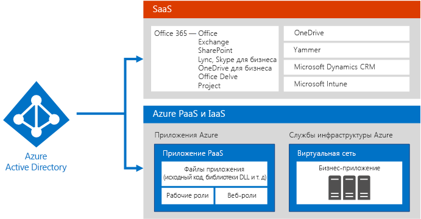
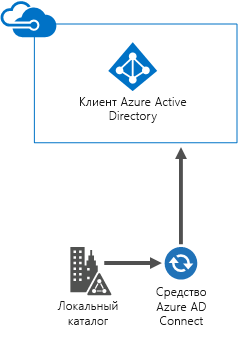
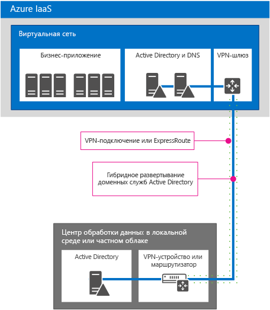

# Облачное удостоверение Майкрософт для корпоративных архитекторовMicrosoft Cloud Identity for Enterprise Architects

 **Сводка.** Разработка решения для работы с удостоверениями для облачных служб и платформ Майкрософт.**Summary:** Design your identity solution for Microsoft cloud services and platforms.
  
В этой статье представлены сведения для ИТ-архитекторов о создании системы удостоверений для организаций, использующих облачные службы и платформы Майкрософт. Вы также можете просмотреть эту статью в виде 5-страничного плаката и распечатать его на листах формата A3.This article describes what IT architects need to know about designing identity for organizations using Microsoft cloud services and platforms. You can also view this article as a 5-page poster and print it in tabloid format (also known as ledger, 11 x 17, or A3).
  

  
[PDF](https://go.microsoft.com/fwlink/p/?LinkId=524586) | [Visio](https://download.microsoft.com/download/2/3/8/238228E6-9017-4F6C-BD3C-5559E6708F82/MSFT_cloud_architecture_identity.vsd) | [Другие языки](https://www.microsoft.com/download/details.aspx?id=54431)[PDF](https://go.microsoft.com/fwlink/p/?LinkId=524586) | [Visio](https://download.microsoft.com/download/2/3/8/238228E6-9017-4F6C-BD3C-5559E6708F82/MSFT_cloud_architecture_identity.vsd) | [More languages](https://www.microsoft.com/download/details.aspx?id=54431)
  
Все модели можно найти в статье [Ресурсы по ИТ-архитектуре Microsoft Cloud](microsoft-cloud-it-architecture-resources.md). Вы также можете просмотреть [материалы по схеме корпоративного облака Майкрософт для ИТ-менеджеров](https://aka.ms/cloudarchitecture).You can also see all of the models in the [Microsoft Cloud IT architecture resources](microsoft-cloud-it-architecture-resources.md) and swipe through [Microsoft's Enterprise Cloud Roadmap: Resources for IT Decision Makers](https://aka.ms/cloudarchitecture).
  
> [!NOTE]
> Эта статья основана на версии плаката **Идентификация в облаке Майкрософт для корпоративных архитекторов** за январь 2016 г. Она не содержит изменения, внесенные в апреле 2016 г. и позже.This article reflects the January 2016 version of the **Microsoft cloud identity for enterprise architects** poster. It does not contain the changes for the April 2016 or later versions of the poster.
  
## Разработка идентификации для облака МайкрософтDesigning identity for the Microsoft cloud

Интеграция удостоверений с облаком Майкрософт предоставляет доступ к широкому выбору служб и облачных платформ. Существует два основных сценария:Integrating your identities with the Microsoft cloud provides access to a broad range of services and cloud platform options. There are two main options:
  
- Вы можете выполнить интеграцию с Microsoft Azure Active Directory (AD). В частности, вам придется синхронизировать локальные учетные записи с Azure AD, поставщиком удостоверений для облака Майкрософт.You can integrate with Microsoft Azure Active Directory (AD). This involves synchronizing your on-premises accounts to Azure AD, the identity provider for the Microsoft cloud.
    
- Вы можете расширить локальную среду доменных служб Active Directory (AD DS) на виртуальные машины, работающие в службах инфраструктуры Microsoft Azure.You can extend your on-premises Active Directory Domain Services (AD DS) environment to virtual machines running in Microsoft Azure infrastructure services.
    

  
 **Рисунок 1. Варианты разработки удостоверений в облаке****Figure 1: Options for designing your identities in the cloud**
  
На рис. 1 показано, что служба Azure AD является поставщиком удостоверений для служб "программное обеспечение как услуга" (SaaS) от Майкрософт и приложений Azure "платформа как услуга" (PaaS), а бизнес-приложения могут использовать локальные службы AD DS.Figure 1 shows how Azure AD is the identity provider for Microsoft Software as a Service (SaaS) services and Azure Platform as a Service (PaaS) applications and how line-of-business applications can use on-premises AD DS. 
  
### Azure Active DirectoryAzure Active Directory

Microsoft Azure AD это размещаемая в облаке Майкрософт служба удостоверений и управления доступом. Она находится в центре облачных служб и платформ Майкрософт. Интеграция Azure AD предоставляет доступ ко всем SaaS-службам Майкрософт с помощью текущего набора учетных записей и паролей. Такая интеграция также предоставляет облачное удостоверение для приложений Azure PaaS.Microsoft Azure AD is the Microsoft cloud-hosted identity and access management service. It's at the center of Microsoft cloud services and platforms. Integrating with Azure AD provides access to all of the Microsoft SaaS services using your current set of accounts and passwords. That integration also provides cloud-based identity for Azure PaaS applications. 
  
> [!NOTE]
> Azure AD не избавляет от необходимости использовать локальные доменные службы Active Directory для предприятий или виртуальных машин под управлением Windows, работающих в Azure "инфраструктура как услуга" (IaaS).Azure AD does not replace the need for AD DS on-premises for enterprise organizations or for Windows -based virtual machines running in Azure Infrastructure as a Service (IaaS). 
  
Существует три выпуска Azure AD: бесплатный, базовый и расширенный.There are three editions of Azure AD: Free, Basic, and Premium. 
  
||||
|:-----|:-----|:-----|
|**Бесплатно****Free**   |**Базовый****Basic**   |**Расширенный****Premium**   |
| 	Управление учетными записями пользователейManage user accounts    Синхронизация с локальными каталогамиSynchronize with on-premises directories    Единый вход в Azure, Office 365 и тысячах других популярных приложений SaaS, например Salesforce, Workday, Concur, DocuSign, Google Apps, Box, ServiceNow, Dropbox и многих другихSingle sign-on across Azure, Office 365, and thousands of other popular SaaS applications, such as Salesforce, Workday, Concur, DocuSign, Google Apps, Box, ServiceNow, Dropbox, and more   | Включает все возможности бесплатного выпуска, а также:Includes all of the abilities in the Free edition, plus:    Фирменная символикаCompany branding    Групповой доступ к приложениямGroup-based application access    Самостоятельный сброс пароляSelf-service password reset    Корпоративное соглашение об уровне обслуживания 99,9 %Enterprise SLA of 99.9%   | Включает все функции бесплатного и базового выпусков, а также:Includes all of the features of the Free and Basic editions, plus:    Самостоятельное управление группамиSelf-service group management    	Расширенные отчеты и оповещения безопасностиAdvanced security reports and alerts    Многофакторная проверка подлинности.Multi-factor authentication    Сброс пароля с обратной записью в локальные службы AD DSPassword reset with write-back to on-premises AD DS    Двунаправленная синхронизация с помощью средства Azure AD ConnectAzure AD Connect tool bidirectional synchronization    Прокси приложения Azure ADAzure AD Application Proxy    	Microsoft Forefront Identity Manager (MIM)Microsoft Forefront Identity Manager (MIM)   |
   
Дополнительные сведения о версиях см. в статье [Выпуски Azure Active Directory](https://go.microsoft.com/fwlink/p/?LinkId=524280).For more information about versions, see [Azure Active Directory editions](https://go.microsoft.com/fwlink/p/?LinkId=524280).
  
### Вариант 1. Интеграция с Azure Active DirectoryOption 1: Integrate with Azure Active Directory

Большинство организаций синхронизируют стандартный набор объектов и атрибутов со своим клиентом Azure AD. Средство Azure AD Connect синхронизирует учетные записи между локальными службами AD DS и клиентом Azure AD.Most organizations synchronize a standard set of objects and attributes to their Azure AD tenant. The Azure AD Connect tool synchronizes your accounts between on-premises AD DS and an Azure AD tenant.
  

  
 **Рисунок 2. Интеграция с Azure AD****Figure 2: Integrating with Azure AD**
  
На рис. 2 показано, как средство Azure AD Connect получает изменения AD DS и отправляет их в клиент Azure AD. В этом случае клиент Azure AD является размещаемой в облаке копией важного содержимого локальных каталогов.Figure 2 shows how the Azure AD Connect tool obtains AD DS changes and sends them to your Azure AD tenant. In this case, your Azure AD tenant is a cloud-hosted duplicate of essential on-premises directory content.
  
Во многих организациях AD DS используется в качестве локального поставщика удостоверений. В локальной среде можно использовать поставщик удостоверений другого типа (например, с использованием LDAP) и синхронизировать эти удостоверения с Azure AD.Many organizations use AD DS as their on-premises identity provider. You can use a different type of identity provider on-premises (such as one that uses LDAP), and synchronize these to Azure AD.
  
### Вариант 2. Расширение доменных служб Active Directory в AzureOption 2: Extend AD DS to Azure

По сравнению с синхронизацией с Azure AD, при расширении AD DS на виртуальные машины в службах инфраструктуры Azure поддерживается другой набор решений и приложений. Вот два из них:Extending AD DS to virtual machines running in Azure infrastructure services supports a different set of solutions and applications compared to synchronization with Azure AD. Here are two:
  
- Поддерживаются облачные решения, которым требуется проверка подлинности NTLM или Kerberos, или присоединенные к домену AD DS виртуальные машины.Supports cloud-based solutions that require NTLM or Kerberos authentication, or AD DS domain-joined virtual machines.
    
- Дополнительный потенциал интеграции для облачных служб и приложений в облачных службах и платформах Майкрософт.Adds additional integration potential for cloud services and applications across Microsoft cloud services and platforms.
    

  
 **Рисунок 3. Расширение доменных служб Active Directory в Azure****Figure 3: Extending AD DS to Azure**
  
На рис. 3 показан контроллер домена AD DS, подключенный к виртуальной сети Azure через локальное VPN-устройство и VPN-шлюз Azure. Виртуальная сеть Azure содержит серверы для бизнес-приложения и собственный набор контроллеров доменов AD DS.Figure 3 shows an AD DS domain controller connected to an Azure virtual network through an on-premises VPN device and an Azure VPN gateway. The Azure virtual network contains servers for a line-of-business application and its own set of AD DS domain controllers.
  
### Дополнительные сведенияMore Information

- [Синхронизация каталога с Office 365  это просто!Synchronizing your directory with Office 365 is easy](https://go.microsoft.com/fwlink/p/?LinkId=524281)
    
- [Инфографика. Управление удостоверениями и доступом в облакеInfographic: Cloud identity and access management](https://go.microsoft.com/fwlink/p/?LinkId=524282)
    
- [Azure Active DirectoryAzure Active Directory](https://go.microsoft.com/fwlink/p/?LinkId=524283)
    
## Интеграция локальных учетных записей AD DS с Microsoft Azure ADIntegrate your on-premises AD DS accounts with Microsoft Azure AD

После синхронизации локальных учетных записей AD DS с Azure AD пользователи смогут использовать свои локальные учетные записи AD DS для доступа:By synchronizing your on-premises AD DS accounts with Azure AD, your users can use their on-premises AD DS accounts to access:
  
- ко всем SaaS-службам Майкрософт (Office 365, Microsoft Intune и Dynamics CRM Online);All of the Microsoft SaaS services (Office 365, Microsoft Intune, and Dynamics CRM Online)
    
- к приложениям, работающим в Azure PaaS.Your applications running in Azure PaaS
    
Два способа настройки этой интеграции:There are two ways to configure this integration:
  
- синхронизация каталогов и паролей;Directory and password synchronization
    
- федерация и единый вход.Federation and single sign-on
    
Начните с простейшего варианта, который соответствует вашим требованиям. При необходимости вы можете переключаться между этими вариантами.Start with the simplest option that meets your needs. You can switch between these options, if needed.
  
> [!NOTE]
> В организациях корпоративного уровня не рекомендуется использовать облачные учетные записи (без интеграции с локальными доменными службами Active Directory).Using cloud-only accounts (not integrating with your on-premises AD DS) is not recommended for enterprise-scale organizations. 
  
### синхронизация каталогов и паролей;Directory and password synchronization

Это самый простой вариант, для которого требуется только сервер со средством Azure AD Connect.This is the simplest option and requires only a server running the Azure AD Connect tool. 
  

  
 **Рисунок 4. Конфигурация синхронизации каталогов и паролей****Figure 4: Directory and password synchronization configuration**
  
На рис. 4 показан локальный или частный облачный центр обработки данных с контроллером домена AD DS. Сервер, на котором запущено средство Azure AD Connect, синхронизирует список имен учетных записей с Azure AD.Figure 4 shows an on-premises or private cloud datacenter with an AD DS domain controller. A server running the Azure AD Connect tool synchronizes the list of account names with Azure AD.
  
При использовании этого варианта:With this option:
  
- Учетные записи пользователей из локальных доменных служб Active Directory (или другого поставщика удостоверений) синхронизируются с клиентом Azure AD. Локальный каталог остается полномочным источником учетных записей, в котором вы управляете всеми их изменениями.User accounts are synchronized from your on-premises AD DS (or other identity provider) to your Azure AD tenant. The on-premises directory remains the authoritative source for accounts and you manage all account changes from there.
    
- Azure AD выполняет все проверки подлинности для SaaS-служб Майкрософт и приложений Azure PaaS.Azure AD performs all authentication for Microsoft SaaS-based services and Azure PaaS applications.
    
- Вы также можете настроить синхронизацию для нескольких лесов AD DS.You can also configure synchronization for multiple AD DS forests.
    
Если используется синхронизация паролей:With password synchronization:
  
- При доступе к облачным службам пользователям предлагается ввести тот же пароль, который они используют для локальных ресурсов.Users are prompted to enter a password when accessing cloud services, which is the same password that they use for on-premises resources.
    
- Пароли пользователей никогда не отправляются в Azure AD открытым текстом. Вместо этого используется хэш пароля. Его криптографически невозможно расшифровать или реконструировать, чтобы получить открытый текст пароля.User passwords are never sent as cleartext to Azure AD. Instead, a hash of the password is used. It is cryptographically impossible to decrypt or reverse-engineer the password hash and obtain the cleartext password. 
    
При многофакторной проверке подлинности (MFA):With multi-factor authentication (MFA):
  
- Вы можете пользоваться основными функциями MFA, включенными в Office 365.You can take advantage of basic MFA features offered with Office 365.
    
- Разработчики приложений Azure PaaS могут пользоваться преимуществами службы многофакторной проверки подлинности Azure.Azure PaaS application developers can take advantage of the Azure Multi-Factor Authentication service.
    
Синхронизация каталогов не обеспечивает интеграцию с локальными решениями MFA.Directory synchronization does not provide integration with on-premises MFA solutions.
  
### федерация и единый вход.Federation and single sign-on

Для этого варианта требуются дополнительные серверы и инфраструктура.This option requires additional servers and infrastructure. 
  

  
 **Рисунок 5. Серверы, необходимые для федеративной проверки подлинности****Figure 5: Servers needed for federated authentication**
  
На рис. 5 показан набор компонентов для федеративной проверки подлинности. Azure AD связывается с прокси-службой веб-приложения, отправляющей запрос проверки подлинности на сервер служб федерации Active Directory (AD FS), который отправляет запрос контроллеру домена AD DS для оценки и ответа. Сервер, на котором запущено средство Azure AD Connect, синхронизирует список имен учетных записей из AD DS с Azure AD.Figure 5 shows the set of components for federated authentication. Azure AD contacts a web application proxy, which forwards the authentication request to an Active Directory Federation Services (AD FS) server, which forwards the request to an AD DS domain controller for evaluation and response. A server running the Azure AD Connect tool synchronizes the list of account names from AD DS to Azure AD.
  
Федерация предоставляет предприятиям следующие дополнительные возможности:Federation provides these additional enterprise capabilities:
  
- Все запросы проверки подлинности, отправленные в Azure AD, направляются локальному поставщику удостоверений и выполняются в нем через AD FS.All authentication requests sent to Azure AD are forwarded to and performed against the on-premises identity provider through AD FS.
    
- Поддерживаются поставщики удостоверений сторонних поставщиков.Works with non-Microsoft identity providers.
    
- Синхронизация хэша паролей может служить запасным вариантом для федеративного входа (например, в случае сбоя федеративной проверки подлинности).Password hash synchronization can act as a sign-in backup for federated sign-in (for example, if the federated authentication fails).
    
Используйте федерацию, если:Use federation if:
  
- Необходим единый вход. С единым входом пользователям не предлагается вводить учетные данные (имя пользователя и пароль) при доступе к облачной службе.Single sign-on is required. With single sign-on, users are not prompted to enter any credentials (user name or password), when accessing a cloud service.
    
- Службы федерации Active Directory уже развернуты.AD FS is already deployed.
    
- Используется сторонний поставщик удостоверений.You use a third-party identity provider.
    
- Используется Forefront Identity Manager 2010 R2 (не поддерживается синхронизация хэша паролей).You use Forefront Identity Manager 2010 R2 (does not support password hash synchronization).
    
- У вас есть локальная встроенная смарт-карта или другое решение MFA.You have an on-premises integrated smart card or other MFA solution.
    
- Требуется аудит входа и/или отключение учетных записей.You require sign-in audit and/or disablement of accounts.
    
- Организации требуются ограничения входа клиентов по сетевому расположению или рабочим часам.Your organization requires client sign-in restrictions by network location or work hours.
    
- Организация должна соответствовать Федеральному стандарту обработки информации (FIPS).You must comply with Federal Information Processing Standards (FIPS).
    
Для федеративной проверки подлинности требуется больше инвестиций в локальную инфраструктуру.Federated authentication requires a greater investment in infrastructure on-premises.
  
- Локальные серверы должны быть доступны из Интернета через корпоративный брандмауэр. Корпорация Майкрософт рекомендует использовать серверы прокси-служб веб-приложений, развернутые в сети периметра.The on-premises servers must be Internet-accessible through a corporate firewall. Microsoft recommends the use of Web Application Proxy servers deployed in your perimeter network.
    
- Необходимы оборудование, лицензии и операции для серверов AD FS, прокси-серверов AD FS или серверов прокси-служб веб-приложений, брандмауэров и подсистем балансировки нагрузки.Requires hardware, licenses, and operations for AD FS servers, AD FS proxy or Web Application Proxy servers, firewalls, and load balancers. 
    
- Доступность и производительность важны, чтобы пользователи имели доступ к Office 365 и другим облачным приложениям.Availability and performance are important to ensure users can access Office 365 and other cloud applications.
    
### Дополнительные сведенияMore Information

- [Синхронизация каталога с Office 365  это просто!Synchronizing your directory with Office 365 is easy](https://go.microsoft.com/fwlink/p/?LinkId=524281)
    
- [Подготовка пользователей к работе путем синхронизации каталогов с Office 365Prepare to provision users through directory synchronization to Office 365](https://go.microsoft.com/fwlink/p/?LinkId=524284)
    
- [Многофакторная проверка подлинности для Office 365Multi-Factor Authentication for Office 365](https://go.microsoft.com/fwlink/p/?LinkID=392012)
    
- [Многофакторная проверка подлинности AzureAzure Multi-Factor Authentication](https://go.microsoft.com/fwlink/p/?LinkId=524285)
    
- [TechEd 2014. Интеграция каталогов: создание одного каталога с Active Directory и Azure Active DirectoryTechEd 2014: Directory Integration: Creating One Directory with Active Directory and Azure Active Directory](https://go.microsoft.com/fwlink/p/?LinkId=524286)
    
## Расширение доменных служб Active Directory в AzureExtend AD DS to Azure

Расширение AD DS в Azure — это первый шаг к поддержке бизнес-приложений, выполняющихся на виртуальных машинах в службах инфраструктуры Azure, которые предоставляют:Extending AD DS to Azure is the first step to support line-of-business applications running on virtual machines in Azure infrastructure services, which provides:
  
- поддержку облачных решений, которым требуется проверка подлинности NTLM или Kerberos, либо виртуальных машин, присоединенных к домену AD DS;Support for cloud-based solutions that require NTLM or Kerberos authentication, or AD DS domain-joined virtual machines.
    
- дополнительный потенциал интеграции для облачных служб и приложений с возможностью добавления в любой момент.Additional integration potential for cloud services and applications and can be added at any time.
    

  
 **Рисунок 6. Расширение доменных служб Active Directory в виртуальной сети Azure****Figure 6: Extending AD DS to an Azure virtual network**
  
На рис. 6 показан локальный или частный облачный центр обработки данных с доменными службами Active Directory, подключенными к виртуальной сети Azure с подключением ExpressRoute или VPN-подключением типа "сеть-сеть". Виртуальная сеть Azure содержит серверы для бизнес-приложения и собственный набор контроллеров доменов AD DS. Эта конфигурация является гибридным развертыванием AD DS в локальной среде и службах инфраструктуры Azure. Для нее требуется следующее:Figure 6 shows an on-premises or private cloud datacenter with AD DS connected to an Azure virtual network with a site-to-site VPN or ExpressRoute connection. The Azure virtual network contains servers for a line-of-business application and its own set of AD DS domain controllers. This configuration is a hybrid deployment of AD DS on-premises and in Azure infrastructure services. It requires:
  
- виртуальная сеть Azure;An Azure virtual network.
    
- соединение между устройством локальной виртуальной частной сети (VPN) или маршрутизатором и VPN-шлюзом Azure;A connection between an on-premises virtual private network (VPN) device or router and an Azure VPN gateway.
    
- часть локального пространства IP-адресов, отведенная под виртуальные машины в виртуальной сети;Using a portion of your on-premises IP address space for the virtual machines in the virtual network.
    
- развертывание одного или нескольких контроллеров доменов в виртуальной сети, назначенных серверами глобального каталога (это снижает исходящий трафик в VPN-подключении).Deploying one or more domain controllers in the virtual network designated as global catalog servers (reduces egress traffic across the VPN connection).
    
По сравнению с синхронизацией с Azure AD, эта архитектура удостоверений поддерживает другой набор решений и приложений.This identity architecture supports a different set of solutions and applications compared to synchronization with Azure AD.
  
### Варианты подключения локальной среды к AzureOn-premises to Azure connection options

Чтобы подключить локальную сеть к виртуальной сети Azure, вы можете использовать:To connect your on-premises network to an Azure virtual network, you can use:
  
- VPN-подключение типа "сеть-сеть", которое может объединить 1-10 сайтов (включая другие виртуальные сети Azure) в одну виртуальную сеть Azure;A site-to-site VPN connection, which can connect 1-10 sites (including other Azure virtual networks) to a single Azure virtual network.
    
- ExpressRoute, частное, защищенное подключение глобальной сети к Azure через партнерскую сеть и поставщика служб центра обработки данных. Подключения ExpressRoute могут обеспечивать повышенную надежность, увеличенную пропускную способность и сокращенное время задержки.ExpressRoute, a private, secure WAN link to Azure through a partner network and datacenter services provider. ExpressRoute connections can offer increased reliability, higher bandwidth, and lower latencies.
    
### Дополнительные сведенияMore Information

- [О безопасных распределенных подключениях для виртуальных сетейCross-premises connectivity for virtual networks](https://go.microsoft.com/fwlink/p/?LinkId=524293)
    
- [Технический обзор ExpressRouteExpressRoute Technical Overview](https://go.microsoft.com/fwlink/?LinkID=392081)
    
- [Руководства по развертыванию Windows Server Active Directory на виртуальных машинах AzureGuidelines for Deploying Windows Server Active Directory on Azure Virtual Machines](https://go.microsoft.com/fwlink/p/?LinkId=524295)
    
## Интеграция приложений с облачными удостоверениямиIntegrate your applications with cloud identities

Во время проектирования и разработки приложений, работающих в облаке, следует ориентироваться на согласованность пользовательского интерфейса для процесса проверки подлинности, включая набор необходимых учетных данных. Например, при использовании учетных данных Windows в Azure AD или расширенных доменных службах Active Directory, убедитесь, что пользователи могут быстро пройти проверку подлинности и сосредоточиться на своих задачах.When designing and developing applications that run in the cloud, you should aim for consistency of the user experience for the authentication process, including the set of required credentials. For example, when using Windows credentials, whether against Azure AD or an extended AD DS, ensure that users can quickly authenticate and focus on their tasks.
  

  
 **Рисунок 7. Интеграция приложений с облачными удостоверениями****Figure 7: Integrate your applications with cloud identities**
  
На рис. 7 показано три варианта интеграции приложения с облачными удостоверениями.Figure 7 shows three options for integrating your application with cloud identities.
  
1. Регистрация размещаемых в облаке приложений с Azure AD.Register your cloud-hosted applications with Azure AD.
    
    См. статью [Интеграция приложений с Azure Active Directory](https://go.microsoft.com/fwlink/p/?LinkId=524303) на портале MSDN. Это позволяет использовать Azure AD для проверки подлинности при доступе к приложению PaaS, а также позволяет пользователям или администраторам предоставлять права доступа к приложению, чтобы другие пользователи могли получать доступ к содержимому от их имени из других облачных служб, например Office 365. Дополнительные сведения и примеры кода можно найти в статье[Сценарии проверки подлинности в Azure AD](https://go.microsoft.com/fwlink/p/?LinkId=524304) на портале MSDN.See the MSDN article [Integrating Applications with Azure Active Directory](https://go.microsoft.com/fwlink/p/?LinkId=524303). This lets you use Azure AD to authenticate access to your PaaS application, as well as allowing users or administrators to grant rights to your application to access content on their behalf from other cloud services, such as Office 365. More details and code samples can be found in the MSDN article [Authentication Scenarios for Azure Active Directory](https://go.microsoft.com/fwlink/p/?LinkId=524304). 
    
2. Приложения, которым необходима программная проверка подлинности для доступа к приложению, защищенному с помощью AD DS, AD FS на сервере Windows Server 2012 R2 или Azure AD, могут использовать:Applications that require programmatic authentication to gain access to an application secured by AD SD, AD FS on Windows Server 2012 R2, or Azure AD can use:
    
  - [Azure AD Graph API](https://go.microsoft.com/fwlink/p/?LinkId=524305);The [Azure AD Graph API](https://go.microsoft.com/fwlink/p/?LinkId=524305)
    
  - [библиотеку проверки подлинности Active Directory (ADAL)](https://go.microsoft.com/fwlink/p/?LinkID=524297).[Active Directory Authentication Library (ADAL)](https://go.microsoft.com/fwlink/p/?LinkID=524297)
    
    Azure AD Graph API поддерживает OAuth и OpenID Connect. Этот интерфейс также поддерживает приложения PaaS.The Azure AD Graph API supports OAuth and OpenID Connect. It also works with PaaS applications.
    
3. Настройте локальные приложения или бизнес-приложения, работающие на виртуальных машинах в виртуальной сети Azure, на непосредственное использование проверки подлинности Windows (NTLM или Kerberos). Это обеспечивает максимальное удобство для пользователей и упрощает настройку для разработчиков серверных приложений.Configure on-premises applications or line-of-business applications running on virtual machines in an Azure virtual network to use Windows authentication (NTLM or Kerberos) directly. This is the best experience for users and requires the least configuration for server application developers.
    
### Пример интеграции приложенийApplication integration example

Организация создает приложение ASP.NET, которое открывает конечную точку REST, где другие приложения могут получать последние данные о продажах. Доступ к этой конечной точке REST защищен с помощью Azure AD. Приложения должны предоставлять учетные данные, которые может проверить служба Azure AD, прежде чем приложение ASP.NET отправит запрашиваемые данные. Затем другие разработчики в организации могут создавать собственные приложения, использующие данные о продажах из конечной точки REST.An organization builds an ASP.NET application that exposes a REST endpoint where other applications can obtain the latest sales data. Access to that REST endpoint is secured with Azure AD. Applications must provide credentials that can be authenticated by Azure AD before the ASP.NET application sends the requested data. Other developers in the organization can then write their own applications that use the sales data from the REST endpoint.
  
Чтобы пройти проверку подлинности в Azure AD и получить данные, ADAL управляет процессом проверки подлинности пользователя и передает маркер доступа приложению, чтобы его можно было использовать для доступа к данным о продажах. ADAL избавляет от большинства сложностей, связанных с получением и анализом маркеров, потоков OAuth и других элементов. ADAL — это еще одна стремительно развивающаяся технология, поэтому разработчикам следует искать последнюю версию на сайте NuGet.To authenticate to Azure AD and retrieve data, ADAL manages the user authentication process and hands the access token off to the application so it can be used to gain access to the sales data. ADAL abstracts out much of the complexity of obtaining and parsing tokens, OAuth flows, and other elements. ADAL is another technology solution that is rapidly changing so developers should look for the latest version on NuGet.
  
## Развертывание компонентов каталога в AzureDeploying directory components in Azure

Вы можете развертывать компоненты каталогов, например серверы для синхронизации паролей или федеративной проверки подлинности, в виртуальной сети Azure, а не в локальном центре обработки данных. Учитывайте ее преимущества, особенно если вы планируете расширить AD DS в Azure.You can deploy directory components, such as servers for password synchronization or federated authentication, in an Azure virtual network rather than an on-premises datacenter. Consider its benefits, especially if you plan to extend AD DS into Azure.
  
В виртуальную сеть Azure можно поместить следующие компоненты:Here are the directory components that can be put in an Azure virtual network:
  
- средство Azure AD Connect;Azure AD Connect tool
    
- компоненты федеративной проверки подлинности;Federated authentication components
    
- автономная среда AD DS.A standalone AD DS environment
    
### Средство AD ConnectAD Connect tool

Средство Azure AD Connect можно разместить в облачной виртуальной сети Azure. Учитывайте следующие преимущества развертывания этой рабочей нагрузки в Azure:The Azure AD Connect tool can be hosted in the cloud on an Azure virtual network. Consider these benefits of deploying this workload to Azure:
  
- потенциально ускоренная подготовка и сниженная стоимость операций;Potentially faster provisioning and lower cost of operations
    
- Повышенная доступностьIncreased availability
    

  
 **Рисунок 8. Средство AD Connect, запущенное в Azure****Figure 8: The AD Connect tool running in Azure**
  
На рис. 8 показано средство AD Connect, работающее на виртуальной машине в виртуальной сети Azure, которая отправляет запрос изменений учетных записей локальному контроллеру домена AD DS, а затем отправляет эти изменения в Office 365. Это решение работает:Figure 8 shows the AD Connect tool running on a virtual machine in an Azure virtual network, which queries an on-premises AD DS domain controller for account changes and then sends those changes to Office 365. This solution works with:
  
- со службами Office 365;Office 365 services.
    
- с приложениями Azure PaaS, доступными через Интернет;Azure PaaS applications that are available over the Internet.
    
- с бизнес-приложениями в Azure, доступными из локальных сред через подключение ExpressRoute или VPN-подключение типа "сеть-сеть".Line-of-business applications in Azure that are available from on-premises environments through the site-to-site VPN or ExpressRoute connection.
    
Дополнительные сведения см. в статье [Интеграция локальных удостоверений с Azure Active Directory](https://go.microsoft.com/fwlink/p/?LinkId=524307).For more information, see [Integrating your on-premises identities with Azure Active Directory](https://go.microsoft.com/fwlink/p/?LinkId=524307).
  
### Инфраструктура федеративной проверки подлинностиFederated authentication infrastructure

Если вы еще не развернули AD FS в локальной среде, учитывайте следующие преимущества развертывания рабочей нагрузки в Azure:If you haven't already deployed AD FS on-premises, consider these benefits of deploying this workload to Azure:
  
- Автономная проверка подлинности в облачных службах (без зависимостей от локальной среды).Provides autonomy for authentication to cloud services (no on-premises dependencies)
    
- Меньшее количество серверов и средств в локальной среде.Reduces servers and tools hosted on-premises
    
- Используется VPN-шлюз типа "сеть-сеть" в отказоустойчивом кластере с двумя узлами для подключения к Azure (новый).Uses a site-to-site VPN gateway on a two-node failover cluster to connect to Azure (new)
    
- Используется ACL, чтобы прокси-серверы приложений могли напрямую взаимодействовать только с AD FS, а не с контроллерами доменов или другими серверами.Uses ACLs to ensure that Web Application Proxy servers can only communicate with AD FS, not domain controllers or other servers directly
    

  
 **Рисунок 9. Развертывание инфраструктуры федеративной проверки подлинности в Azure****Figure 9: Deploying your federated authentication infrastructure in Azure**
  
На рис. 9 показан набор локальных контроллеров доменов, которые реплицируют сведения из AD DS, с набором контроллеров доменов в виртуальной сети Azure. Средство Azure AD Connect. выполняющееся на сервере в виртуальной сети Azure, отправляет локальным контроллерам доменов запросы на изменения, а затем отправляет эти изменения в Azure AD. Входящие запросы проверки подлинности в Azure AD из SaaS-служб Майкрософт, приложений Azure PaaS и других облачных приложений отправляются во внешнюю подсистему балансировки нагрузки, которая направляет запрос набору серверов прокси-служб веб-приложений. Серверы прокси-служб веб-приложений отправляют запрос внешней подсистеме балансировки нагрузки, которая перенаправляет запрос набору серверов AD FS. Затем серверы AD FS перенаправляют запрос на контроллер домена, чтобы проверить учетные данные отправки.Figure 9 shows a set of on-premises domain controllers replicating AD DS information with a set of domain controllers in an Azure virtual network. The Azure AD Connect tool running on a server in the Azure virtual network queries the local domain controllers for changes and then sends those changes to Azure AD. Incoming authentication requests to Azure AD from Microsoft SaaS services, Azure PaaS applications, and other cloud applications are forwarded to an external load balancer, which forwards the request to a set of Web Application Proxy servers. The Web Application Proxy servers forward the request to an internal load balancer, which forwards the request to a set of AD FS servers. The AD FS servers then forward the request to a domain controller to validate the send credentials.
  
 Это решение работает:This solution works with:
  
- с приложениями, требующими Kerberos;Applications that require Kerberos
    
- со всеми SaaS-службами Майкрософт;All of Microsoft's SaaS services
    
- с приложениями в Azure, имеющими доступ к Интернету;Applications in Azure that are Internet-facing
    
- с приложениями в Azure IaaS или PaaS, которым требуется проверка подлинности с набором учетных записей в доменных службах Active Directory организации.Applications in Azure IaaS or PaaS that require authentication with the set of accounts in your organization's AD DS
    
Дополнительные сведения см. в статье [Интеграция локальных удостоверений с Azure Active Directory](https://go.microsoft.com/fwlink/p/?LinkId=524307).For more information, see [Integrating your on-premises identities with Azure Active Directory](https://go.microsoft.com/fwlink/p/?LinkId=524307).
  
### Автономная среда AD DS в виртуальной сети AzureStandalone AD DS environment in an Azure virtual network

Облачное приложение не всегда необходимо интегрировать с локальной средой. Например, автономный домен AD DS в виртуальной сети Azure поддерживает общедоступные приложения, например сайты Интернета.You don't always need to integrate a cloud application with your on-premises environment. For example, a standalone AD DS domain in an Azure virtual network supports applications that are public-facing, such as Internet sites.
  

  
 **Рисунок 10. Отдельная среда доменных служб Active Directory для серверного приложения****Figure 10: A standalone AD DS environment for a server-based application**
  
На рис. 10 показана виртуальная сеть Azure, которая содержит серверы AD DS, а также предоставляет службы AD DS и DNS, с набором серверов, на которых размещается приложение. Это решение работает:Figure 10 shows an Azure virtual network hosting a set of AD DS servers, providing both AD DS and DNS services, with a set of servers that host an application. This solution works with:
  
- с веб-сайтами и приложениями Интернета;Internet-facing web sites and applications
    
- с приложениями, требующими проверку подлинности NTLM или Kerberos;Applications that require NTLM or Kerberos authentication
    
- с приложениями на серверах под управлением Windows, требующих AD DS.Applications running on Windows-based servers that require AD DS
    
Дополнительные сведения см. в статье [Интеграция локальных удостоверений с Azure Active Directory](https://go.microsoft.com/fwlink/p/?LinkId=524307).For more information, see [Integrating your on-premises identities with Azure Active Directory](https://go.microsoft.com/fwlink/p/?LinkId=524307).
  
## См. такжеSee Also

[Ресурсы для администраторов, посвященные архитектуре Microsoft CloudMicrosoft Cloud IT architecture resources](microsoft-cloud-it-architecture-resources.md)

[Стратегия Enterprise Cloud корпорации Майкрософт: ресурсы для лиц, принимающих решения в области ИТMicrosoft's Enterprise Cloud Roadmap: Resources for IT Decision Makers](https://sway.com/FJ2xsyWtkJc2taRD)

