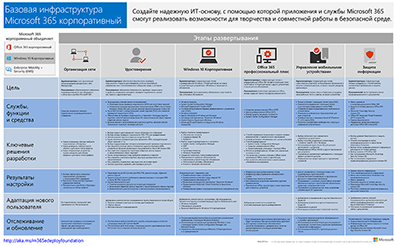
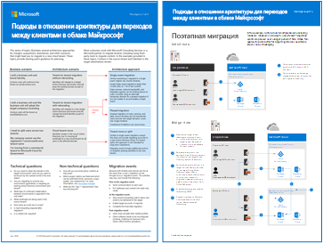
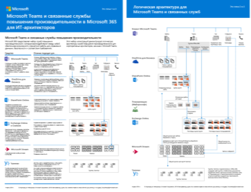
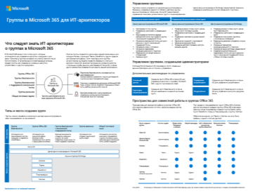
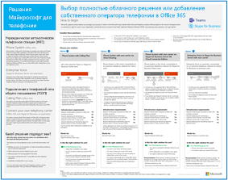

# Ресурсы для администраторов, посвященные архитектуре Microsoft Cloud

Эти плакаты и средства архитектуры содержат сведения об облачных службах (Майкрософт), включая Microsoft 365, Windows 10, Azure Active Directory, Microsoft Intune и Microsoft Dynamics 365, а также о гибридных, локальных и облачных решениях. При помощи этих ресурсов ответственные ИТ-специалисты и архитекторы могут определять подходящие варианты для своих рабочих нагрузок, а также принимать решения по основным компонентам инфраструктуры, таким как идентификация и безопасность. 
  
<!--**[Microsoft's Enterprise Cloud Roadmap](microsoft-cloud-it-architecture-resources.md#roadmap)** (Sway) -->
    
- **[Серия "Облако Майкрософт для корпоративных архитекторов"](microsoft-cloud-it-architecture-resources.md#cloudarch)** 
    <!-- [Microsoft Cloud Services and Platform Options](microsoft-cloud-it-architecture-resources.md#platformoptions) -->
    - [Идентификация в облаке Майкрософт для корпоративных архитекторов](microsoft-cloud-it-architecture-resources.md#identity)
    - [Обеспечение безопасности в облаке Майкрософт для корпоративных архитекторов](microsoft-cloud-it-architecture-resources.md#security)
    - [Организация сети в облаке Майкрософт для корпоративных архитекторов](microsoft-cloud-it-architecture-resources.md#networking)
    - [Гибридное облако Майкрософт для корпоративных архитекторов](microsoft-cloud-it-architecture-resources.md#hybrid)
    - [Распространенные атаки и средства Майкрософт для защиты вашей организации](#common-attacks-and-microsoft-capabilities-that-protect-your-organization)
    - [Базовая инфраструктура Microsoft 365 корпоративный](#m365foundationinfra)
    - [Подходы в отношении архитектуры для переходов между клиентами в облаке Майкрософт](#architecture-approaches-for-microsoft-cloud-tenant-to-tenant-migrations)
    
- **[Серия "Корпоративные решения для Microsoft 365"](microsoft-cloud-it-architecture-resources.md#BKMK_o365solutions)**
    - [Microsoft Teams и связанные службы повышения производительности в Microsoft 365 для ИТ-архитекторов](#microsoft-teams-and-related-productivity-services-in-microsoft-365-for-it-architects)
    - [Группы в Microsoft 365 для ИТ-архитекторов](#groups-in-microsoft-365-for-it-architects)
    - [Безопасность и защита информации для межрегиональных организаций](#security-and-information-protection-for-multi-region-organizations)
    - [Защита идентификации и устройств в Office 365](microsoft-cloud-it-architecture-resources.md#BKMK_O365IDP)
    - [Решения для защиты файлов в Office 365](microsoft-cloud-it-architecture-resources.md#BKMK_O365fileprotect)
    - [Защита информации в Office 365 в соответствии с GDPR](#office-365-information-protection-for-gdpr)
    - [Руководство по безопасности (Майкрософт) для политических кампаний, некоммерческих и других динамических организаций](#microsoft-security-guidance-for-political-campaigns-nonprofits-and-other-agile-organizations)
    - [Решения Майкрософт для телефонии](#microsoft-telephony-solutions) 
    
Let us know what you think! Send us email at [cloudadopt@microsoft.com](mailto:cloudadopt@microsoft.com). 

<!--

## Microsoft's Enterprise Cloud Roadmap

See the posters, icon sets, community venues, and other resources that describe the industry's most complete cloud solution.
  
|**Item**|**Description**|
|:-----|:-----|
|[          ](https://aka.ms/cloudarchitecture)   [Microsoft's Enterprise Cloud Roadmap](https://aka.ms/cloudarchitecture) (https://aka.ms/cloudarchitecture)   |Swipe through this Sway experience for the resources that describe the industry's most complete cloud solution.    |
-->
  

## Серия "Облако Майкрософт для корпоративных архитекторов"

Эти плакаты со сведениями об облачной архитектуре помогут узнать больше об облачных службах (Майкрософт), включая Microsoft 365, Azure Active Directory, Microsoft Intune и Microsoft Dynamics CRM Online, а также о гибридных, локальных и облачных решениях. При помощи этих ресурсов ответственные ИТ-специалисты и архитекторы могут определять подходящие варианты для своих рабочих нагрузок, а также принимать решения по основным компонентам инфраструктуры, таким как идентификация и безопасность.

<!--  

### Microsoft Cloud Services and Platform Options

Learn key differences between Microsoft cloud services and platform offerings. Find the best fit for your solution.
  
|**Item**|**Description**|
|:-----|:-----|
|[          ](https://www.microsoft.com/download/details.aspx?id=54432)   [PDF](https://go.microsoft.com/fwlink/p/?LinkId=524731)  \| [Visio](https://go.microsoft.com/fwlink/p/?LinkId=524732)  \| [More languages](https://www.microsoft.com/download/details.aspx?id=54432)   | This model describes: <ul><li>  Software as a Service (SaaS) offerings, including Microsoft 365 </li><li>  Platform as a Service (PaaS) features in Microsoft Azure </li><li>  Infrastructure as a Service (IaaS) features in Microsoft Azure </li><li>  Private cloud datacenter capabilities using Windows Server and System Center </li><li>  Learn how Microsoft's own IT department is migrating to these cloud services and building its hybrid cloud. </li></ul> |
-->

   

### Идентификация в облаке Майкрософт для корпоративных архитекторов

Сведения для ИТ-архитекторов о создании системы удостоверений для организаций, использующих облачные службы и платформы Майкрософт.
  
|**Ресурс**|**Описание**|
|:-----|:-----|
|[          ](https://www.microsoft.com/download/details.aspx?id=54431)   [PDF](https://go.microsoft.com/fwlink/p/?LinkId=524586)  \| [Visio](https://download.microsoft.com/download/2/3/8/238228E6-9017-4F6C-BD3C-5559E6708F82/MSFT_cloud_architecture_identity.vsd)           \| [Другие языки](https://www.microsoft.com/download/details.aspx?id=54431)   | Эта модель содержит: <ul><li>Общие сведения об использовании удостоверений в облаке Майкрософт </li><li>Возможности платформы IDaaS в Azure AD </li><li>Интеграция локальных учетных записей доменных служб Active Directory с Microsoft Azure Active Directory </li><li>Размещение компонентов каталога в Azure </li><li>Варианты доменных служб для рабочих нагрузок в службе Azure IaaS </li></ul> |
   

### Обеспечение безопасности в облаке Майкрософт для корпоративных архитекторов

Сведения для ИТ-архитекторов о безопасности в облачных службах и платформах Майкрософт.
  
|**Ресурс**|**Описание**|
|:-----|:-----|
|[          ](https://www.microsoft.com/download/details.aspx?id=48121)   [PDF](https://go.microsoft.com/fwlink/p/?linkid=842070)  \| [Visio](https://go.microsoft.com/fwlink/p/?LinkId=842071)  \| [Другие языки](https://www.microsoft.com/download/details.aspx?id=48121)   | Эта модель содержит: <ul><li>Роль корпорации Майкрософт в предоставлении безопасных служб и платформ.</li><li>Обязанности клиента по снижению угроз безопасности.</li><li>Лучшие варианты сертификации защиты. </li><li>Решения для обеспечения безопасности от консалтинговых служб Майкрософт. </ul> |
   

### Организация сети в облаке Майкрософт для корпоративных архитекторов

Сведения для ИТ-архитекторов о сетях для облачных служб и платформ Майкрософт.
  
|**Ресурс**|**Описание**|
|:-----|:-----|
|    [PDF](downloads/MSFT_cloud_architecture_networking.pdf)  \| [Visio](https://github.com/MicrosoftDocs/OfficeDocs-Enterprise/raw/live/Enterprise/downloads/MSFT_cloud_architecture_networking.vsdx)   | Эта модель содержит: <ul><li> Развитие сети для облачного подключения </li><li> Общие элементы облачного подключения Майкрософт </li><li> ExpressRoute для подключения к Microsoft Cloud </li><li> Проектирование сети для Microsoft SaaS, Azure PaaS и Azure IaaS </li></ul>    |

### Гибридное облако Майкрософт для корпоративных архитекторов

Сведения для ИТ-архитекторов о гибридном облаке для служб и платформ Майкрософт.
  
|**Ресурс**|**Описание**|
|:-----|:-----|
|             [PDF](downloads/MSFT_cloud_architecture_hybrid.pdf)  \| [Visio](https://github.com/MicrosoftDocs/OfficeDocs-Enterprise/raw/live/Enterprise/downloads/MSFT_cloud_architecture_hybrid.vsdx)  | Эта модель содержит: <ul><li> Облачные предложения Майкрософт (SaaS, Azure PaaS и Azure IaaS) и их общие элементы </li><li> Архитектуру гибридного облака для облачных предложений Майкрософт </li><li> Сценарии гибридного облака для Microsoft SaaS (Microsoft 365), Azure PaaS и Azure IaaS </li></ul> |
   

### Распространенные атаки и средства Майкрософт для защиты вашей организации
Узнайте о распространенных кибер-атаках и о том, как Майкрософт поможет вашей организации на каждом этапе атаки. 

|**Ресурс**|**Описание**|
|:-----|:-----|
|   [PDF](https://download.microsoft.com/download/F/A/C/FACFC1E9-FA35-4DF1-943C-8D4237B4275B/MSFT_Cloud_architecture_security_commonattacks.pdf) \| [Visio](https://download.microsoft.com/download/F/A/C/FACFC1E9-FA35-4DF1-943C-8D4237B4275B/MSFT_Cloud_architecture_security_commonattacks.vsdx)   | На этом плакате показаны этапы основных атак и описаны возможности, позволяющие остановить злоумышленников на каждом из них.  |

### Базовая инфраструктура Microsoft 365 корпоративный

Быстро ознакомьтесь с [базовой инфраструктурой](https://docs.microsoft.com/microsoft-365/enterprise/deploy-foundation-infrastructure) для Microsoft 365 корпоративный, чтобы приступить к развертыванию.
  
|**Ресурс**|**Описание**|
|:-----|:-----|
|   [Смотреть в Интернете](https://aka.ms/m365efoundinfraposter) \| [PDF-ФАЙЛ](https://github.com/MicrosoftDocs/microsoft-365-docs/raw/public/microsoft-365/media/deploy-foundation-infrastructure/Microsoft365EnterpriseFoundInfra.pdf)   | На этом плакате представлена сводка каждого этапа базовой инфраструктуры с точки зрения целей, функций и инструментов, решений разработки, результатов конфигурации, адаптации, а также текущего мониторинга и обновлений.  | 

### Подходы в отношении архитектуры для переходов между клиентами в облаке Майкрософт 
В этих статьях описано несколько подходов в отношении архитектуры для слияний, приобретений, отделений и других сценариев, которые могут привести к переходу на новый облачный клиент. В этих статьях приведены начальные инструкции по планированию.

|**Ресурс**|**Описание**|
|:-----|:-----|
|   [PDF](downloads/Microsoft-365-tenant-to-tenant-migration.pdf) \| [Visio](https://github.com/MicrosoftDocs/OfficeDocs-Enterprise/raw/live/Enterprise/downloads/Microsoft-365-tenant-to-tenant-migration.vsdx)     |Эта модель содержит: <ul><li>Сопоставление бизнес-сценариев для подходов в отношении архитектуры</li><li>Рекомендации по разработке</li><li>Поток миграции одного события</li><li>Поток поэтапной миграции</li><li>Поток перемещения или разделения клиента</li></ul>|

## Серия "Корпоративные решения для Microsoft 365"

В серии "Корпоративные решения для Microsoft 365" представлены инструкции по реализации возможностей Microsoft 365, особенно при их пересечении с технологиями.

### Microsoft Teams и связанные службы повышения производительности в Microsoft 365 для ИТ-архитекторов
Логическая архитектура служб повышения производительности в Microsoft 365, начиная с Microsoft Teams.

|**Ресурс**|**Описание**|
|:-----|:-----|
|   [PDF](downloads/msft-m365-teams-logical-architecture.pdf) \| [Visio](https://github.com/MicrosoftDocs/OfficeDocs-Enterprise/raw/live/Enterprise/downloads/msft-m365-teams-logical-architecture.vsdx)     |Корпорация Майкрософт предоставляет набор служб повышения производительности, которые взаимодействуют между собой, обеспечивая возможности совместной работы для управления данными, безопасности и соответствия требованиям.    Этот набор иллюстраций демонстрирует логическую архитектуру служб повышения производительности для корпоративных архитекторов, начиная с Microsoft Teams.|

### Группы в Microsoft 365 для ИТ-архитекторов
Что следует знать ИТ-архитекторам о группах в Microsoft 365

|**Ресурс**|**Описание**|
|:-----|:-----|
|   [PDF](downloads/msft-m365-groups.pdf) \| [Visio](https://github.com/MicrosoftDocs/OfficeDocs-Enterprise/raw/live/Enterprise/downloads/msft-m365-groups.vsdx) |На этих иллюстрациях подробно показаны разные типы групп, как они создаются и управляются, а также приводится несколько рекомендаций по управлению.|

### Безопасность и защита информации для межрегиональных организаций
Безопасность и защита информации для межрегиональных организаций с единым клиентом Microsoft 365

|**Ресурс**|**Описание**|
|:-----|:-----|
|   [PDF](https://github.com/MicrosoftDocs/microsoft-365-docs/raw/public/microsoft-365/downloads/msft-security-info-protect-multi-region.pdf) \| [Visio](https://github.com/MicrosoftDocs/microsoft-365-docs/raw/public/microsoft-365/downloads/msft-security-info-protect-multi-region.vsdx) |Использование единого клиента Microsoft 365 для глобальной организации является оптимальным вариантом, обеспечивающим максимально комфортную работу, по многим причинам. Тем не менее, многие архитекторы ломают голову над тем, как соответствовать требованиям безопасности и защиты информации в разных регионах. В этой подборке разделов содержатся рекомендации. |

   

### Защита идентификации и устройств для Office 365

Рекомендуемые возможности для защиты удостоверений и устройств, имеющих доступ к Office 365 и отличных от SaaS-служб и локальных приложений, которые опубликованы с помощью прокси приложения Azure AD.
  
|**Ресурс**|**Описание**|
|:-----|:-----|
|[          ](https://www.microsoft.com/download/details.aspx?id=55032)   [PDF](https://go.microsoft.com/fwlink/p/?linkid=841656)  \| [Visio](https://go.microsoft.com/fwlink/p/?linkid=841657)  \| [Другие языки](https://www.microsoft.com/download/details.aspx?id=55032)   |It's important to use consistent levels of protection across your data, identities, and devices. This document shows you which capabilities are comparable with more information on capabilities to protect identities and devices.    |
   

### Решения для защиты файлов в Office 365

В случае рекомендуемых возможностей для защиты файлов в Office 365 используются три разных уровня конфиденциальности.
  
|**Ресурс**|**Описание**|
|:-----|:-----|
|[          ](https://www.microsoft.com/download/details.aspx?id=55523)   [PDF](https://go.microsoft.com/fwlink/?linkid=2004320)  \| [Visio](https://download.microsoft.com/download/7/8/9/789645A5-BD10-4541-BC33-F8D1EFF5E911/MSFT_cloud_architecture_O365%20file%20protection.vsdx)   |It's important to use consistent levels of protection across your data, identities, and devices. This document shows you which capabilities are comparable with more information on capabilities to protect files in Office 365.    |
   

### Защита информации в Office 365 в соответствии с регламентом GDPR

Prescriptive recommendations for discovering, classifying, protecting, and monitoring personal data. This solution uses General Data Protection Regulation (GDPR) as an example, but you can apply the same process to achieve compliance with many other regulations.

|**Ресурс**|**Описание**|
|:-----|:-----|
|    [PDF](https://download.microsoft.com/download/E/C/D/ECD5A339-EF10-4420-B3A9-99098884D716/MSFT_Cloud_architecture_information%20protection%20for%20GDPR.pdf) \| [Visio](https://download.microsoft.com/download/E/C/D/ECD5A339-EF10-4420-B3A9-99098884D716/MSFT_Cloud_architecture_information%20protection%20for%20GDPR.vsdx)    |Чтобы просмотреть этот контент в формате статьи, см. документ [Защита информации в Office 365 в соответствии с регламентом GDPR](https://docs.microsoft.com/Office365/SecurityCompliance/office-365-information-protection-for-gdpr).      |

### Руководство по безопасности (Майкрософт) для политических кампаний, некоммерческих и других динамических организаций 

This guidance describes how to implement a secure cloud environment. The solution guidance can be used by any organization. It includes extra help for agile organizations with BYOD access and guest accounts. You can use this guidance as a starting-point for designing your own environment.

|**Ресурс**|**Описание**|
|:-----|:-----|
|**Руководство по безопасности (Майкрософт) для политических кампаний**   [          ](https://download.microsoft.com/download/B/4/D/B4D520C3-4D0C-4B4D-BFB9-09F0651C2775/MSFT_Cloud_architecture_security%20for%20political%20campaigns.pdf)   [PDF](https://download.microsoft.com/download/B/4/D/B4D520C3-4D0C-4B4D-BFB9-09F0651C2775/MSFT_Cloud_architecture_security%20for%20political%20campaigns.pdf)  \| [Visio](https://download.microsoft.com/download/B/4/D/B4D520C3-4D0C-4B4D-BFB9-09F0651C2775/MSFT_Cloud_architecture_security%20for%20political%20campaigns.vsdx)   |This guidance uses a political campaign organization as an example. Use this guidance as a starting point for any environment.    |
|**Руководство по безопасности (Майкрософт) для некоммерческих организаций**   [          ](https://download.microsoft.com/download/9/4/3/94389612-C679-4061-8DF2-D9A15D72B65F/Microsoft_Cloud%20Architecture_Security%20for%20Nonprofits.pdf)   [PDF](https://download.microsoft.com/download/9/4/3/94389612-C679-4061-8DF2-D9A15D72B65F/Microsoft_Cloud%20Architecture_Security%20for%20Nonprofits.pdf)  \| [Visio](https://download.microsoft.com/download/9/4/3/94389612-C679-4061-8DF2-D9A15D72B65F/Microsoft_Cloud%20Architecture_Security%20for%20Nonprofits.vsdx)   |This guide is slightly revised for nonprofit organizations. For example, it references Office 365 Nonprofit plans. The technical guidance is the same as the political campaign solution guide.    |

This guidance includes Test Lab Guides. For more information, see [Microsoft Security Guidance for Political Campaigns, Nonprofits, and Other Agile Organizations](https://docs.microsoft.com/Office365/SecurityCompliance/microsoft-security-guidance-for-political-campaigns-nonprofits-and-other-agile-o).

### Решения Майкрософт для телефонии

Microsoft supports several options as you begin your journey to Teams in the Microsoft cloud. This poster helps you decide which Microsoft telephony solution (Phone System in the cloud or Enterprise Voice on-premises) is right for users in your organization, and how your organization can connect to the Public Switched Telephone Network (PSTN).

  
[PDF](https://github.com/MicrosoftDocs/OfficeDocs-SkypeForBusiness/blob/live/Teams/downloads/telephony-solutions/microsoft-telephony-solutions-12-18.pdf) | [Visio](https://github.com/MicrosoftDocs/OfficeDocs-SkypeForBusiness/blob/live/Teams/downloads/telephony-solutions/microsoft-telephony-solutions-12-18.vsdx) 

Дополнительные сведения см. в статье [Решения Майкрософт для телефонии](https://docs.microsoft.com/SkypeForBusiness/hybrid/msft-telephony-solutions).
  
## См. также

[Архитектурные модели для SharePoint, Exchange, Skype для бизнеса и Lync](architectural-models-for-sharepoint-exchange-skype-for-business-and-lync.md)
  
[Руководства по лаборатории тестирования для Microsoft 365 для предприятий](https://docs.microsoft.com/microsoft-365/enterprise/m365-enterprise-test-lab-guides)
  
[Гибридные решения](hybrid-solutions.md)

