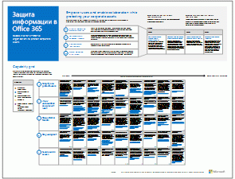

# Ресурсы для администраторов, посвященные архитектуре Microsoft Cloud

 **Сводка.** Узнайте об облачных службах и платформах Майкрософт. Ознакомьтесь со схемой корпоративного облака и рядом сведений об облачной архитектуре и не только.
  
Эти афиши и описания архитектуры содержат информацию об облачных службах и платформах Майкрософт, в том числе Office 365, Microsoft Azure, Microsoft Intune, Microsoft Dynamics 365, центре обработки данных на базе частного облака, а также гибридных, локальных и облачных решениях. При помощи этих ресурсов лица, принимающие решения касательно ИТ-инфраструктуры, и архитекторы могут определять подходящие варианты для своих рабочих нагрузок, а также принимать решения по основным компонентам инфраструктуры, таким как идентификация и безопасность.
  
- **[Схема корпоративного облака Майкрософт](microsoft-cloud-it-architecture-resources.md#roadmap)** (Sway)
    
- **[Серия "Облако Майкрософт для корпоративных архитекторов"](microsoft-cloud-it-architecture-resources.md#cloudarch)**, которая включает афиши, посвященные[Варианты облачных служб и платформ Майкрософт](microsoft-cloud-it-architecture-resources.md#platformoptions), [Облачное удостоверение Майкрософт для корпоративных архитекторов](microsoft-cloud-it-architecture-resources.md#identity), [Обеспечение безопасности в облаке Майкрософт для корпоративных архитекторов](microsoft-cloud-it-architecture-resources.md#security), [Облачные сети Майкрософт для корпоративных архитекторов](microsoft-cloud-it-architecture-resources.md#networking), [Microsoft Mobility + Security для корпоративных архитекторов](microsoft-cloud-it-architecture-resources.md#mobility), [Облачные хранилища Майкрософт для корпоративных архитекторов](microsoft-cloud-it-architecture-resources.md#storage) и[Гибридное облако Майкрософт для корпоративных архитекторов](microsoft-cloud-it-architecture-resources.md#hybrid), а также пример [Contoso в Microsoft Cloud](microsoft-cloud-it-architecture-resources.md#contoso).
    
- **[Серия решений для Office 365 корпоративный](microsoft-cloud-it-architecture-resources.md#BKMK_o365solutions)**, которая включает такие плакаты:[Защита информации в Office 365](microsoft-cloud-it-architecture-resources.md#BKMK_infoprotect), [Защита удостоверений и устройств в Office 365](microsoft-cloud-it-architecture-resources.md#BKMK_O365IDP), [Решения для защиты файлов в Office 365](microsoft-cloud-it-architecture-resources.md#BKMK_O365fileprotect) и[Изменение управления для клиентов Office 365](microsoft-cloud-it-architecture-resources.md#changemgmt).
    
> [!TIP]
> Большинство плакатов на этой странице доступны на нескольких языках, включая английский, испанский, итальянский, китайский, корейский, немецкий, португальский, русский, французский и японский. Чтобы скачать плакат на одном из этих языков, нажмите ссылку **Другие языки**.
  
Ждем ваших отзывов по адресу [cloudadopt@microsoft.com](mailto:cloudadopt@microsoft.com). 
  
## Схема корпоративного облака Майкрософт

Ознакомьтесь с афишами, наборами значков, мероприятиями сообщества и другими ресурсами, которые позволят вам узнать больше о самом совершенном облачном решении в отрасли.
  
|**Элемент**|**Описание**|
|:-----|:-----|
|[          ](https://aka.ms/cloudarchitecture)   [Схема корпоративного облака Майкрософт](https://aka.ms/cloudarchitecture) (https://aka.ms/cloudarchitecture)   |Просмотрите эту презентацию Sway и узнайте о самом совершенном облачном решении в отрасли.    |
   
## Серия "Облако Майкрософт для корпоративных архитекторов"

На этих афишах об облачной архитектуре приведена информация об облачных службах и платформах Майкрософт, в том числе Office 365, Microsoft Azure, Microsoft Intune, Microsoft Dynamics CRM Online, центре обработки данных на базе частного облака, а также гибридных, локальных и облачных решениях. При помощи этих ресурсов лица, принимающие решения касательно ИТ-инфраструктуры, и архитекторы могут определять подходящие варианты для своих рабочих нагрузок, а также принимать решения по основным компонентам инфраструктуры, таким как идентификация и безопасность.
  
### Варианты облачных служб и платформ Майкрософт

Узнайте об основных различиях между вариантами облачных служб и платформ Майкрософт. Выберите наиболее подходящий.
  
|**Элемент**|**Описание**|
|:-----|:-----|
|[          ](https://www.microsoft.com/download/details.aspx?id=54432)   [PDF](https://go.microsoft.com/fwlink/p/?LinkId=524731) |[Visio](https://go.microsoft.com/fwlink/p/?LinkId=524732) |[Другие языки](https://www.microsoft.com/download/details.aspx?id=54432)   | Эта модель описывает:    Варианты программного обеспечения как услуги (SaaS), включая Office 365    Варианты платформы как услуги (PaaS) в Microsoft Azure    Варианты инфраструктуры как услуги (IaaS) в Microsoft Azure    Возможности центра данных на базе частного облака с использованием Windows Server и System Center    Узнайте, как ИТ-отдел Майкрософт переходит на эти облачные службы и формирует собственное гибридное облако.   |
   
### Облачное удостоверение Майкрософт для корпоративных архитекторов

Сведения для ИТ-архитекторов о создании системы удостоверений для организаций, использующих облачные службы и платформы Майкрософт.
  
|**Элемент**|**Описание**|
|:-----|:-----|
|[          ](https://www.microsoft.com/download/details.aspx?id=54431)   [PDF](https://go.microsoft.com/fwlink/p/?LinkId=524586) |[Visio](https://download.microsoft.com/download/2/3/8/238228E6-9017-4F6C-BD3C-5559E6708F82/MSFT_cloud_architecture_identity.vsd)          [Статья](https://technet.microsoft.com/library/mt613459.aspx) |[Другие языки](https://www.microsoft.com/download/details.aspx?id=54431)   | Эта модель содержит:    Использование Azure AD в качестве поставщика услуг IDaaS ("удостоверение как услуга")    Возможности платформы IDaaS в Azure AD    Интеграция локальных учетных записей доменных служб Active Directory с Microsoft Azure Active Directory    Помещение компонентов каталога в Azure    Параметры доменных служб для рабочих нагрузок в службе Azure IaaS    Эти сведения в форме статьи:[Облачное удостоверение Майкрософт для корпоративных архитекторов](microsoft-cloud-identity-for-enterprise-architects.md).    |
   
### Обеспечение безопасности в облаке Майкрософт для корпоративных архитекторов

Сведения для ИТ-архитекторов о безопасности в облачных службах и платформах Майкрософт.
  
|**Элемент**|**Описание**|
|:-----|:-----|
|[          ](https://www.microsoft.com/download/details.aspx?id=48121)   [PDF](https://go.microsoft.com/fwlink/p/?linkid=842070) |[Visio](https://go.microsoft.com/fwlink/p/?LinkId=842071) |[Другие языки](https://www.microsoft.com/download/details.aspx?id=48121)   | Эта модель содержит:    Роль Майкрософт в предоставлении безопасных служб и платформ    Обязанности клиента по снижению угроз безопасности    Лучшие варианты сертификации защиты    Решения для обеспечения безопасности от консалтинговых служб Майкрософт    Пройдите курс виртуальной академии Microsoft Virtual Academy[Обеспечение безопасности в облачном мире](https://aka.ms/securecustomermva), который основан на этом плакате, посвященном архитектуре.    |
   
### Облачные сети Майкрософт для корпоративных архитекторов

Сведения для ИТ-архитекторов о сетях для облачных служб и платформ Майкрософт.
  
|**Элемент**|**Описание**|
|:-----|:-----|
|[          ](https://www.microsoft.com/download/details.aspx?id=54425)   [PDF](https://go.microsoft.com/fwlink/p/?linkid=842073) |[Visio](https://go.microsoft.com/fwlink/p/?linkid=842074)          [Статья](https://technet.microsoft.com/library/mt733214.aspx) |[Другие языки](https://www.microsoft.com/download/details.aspx?id=54425)   | Эта модель содержит следующие страницы:   **Развитие сети для подключения к облаку**. Миграция в облако изменяет объем и характер потоков трафика в корпоративной сети и за ее пределами. Кроме того, она влияет на способы противодействия угрозам безопасности.   **Стандартные элементы Майкрософт для подключения к облаку**. Интеграция сети с облаком Майкрософт обеспечивает оптимальный доступ к большому числу служб.   **ExpressRoute для подключения к облаку Майкрософт**. ExpressRoute обеспечивает закрытое, выделенное и скоростное сетевое подключение к облаку Майкрософт.   **Разработка сетей для Microsoft SaaS (Office 365, Microsoft Intune и Dynamics CRM Online)**. Оптимизация сетей для служб Microsoft SaaS требует тщательного анализа конъюнктуры сети Интернет, клиентских устройств и типичных ИТ-операций.   **Разработка сетей для Azure PaaS**. Оптимизация сетей для приложений Azure PaaS требует соответствующей пропускной способности и, при необходимости, распределения сетевого трафика по нескольким сайтам или приложениям.   **Разработка сетей для Azure IaaS**. Пошаговая инструкция по разработке эффективной виртуальной сети Azure для размещения серверных ИТ-задач, в том числе подсетей, пространств адресов, маршрутизации, балансировки нагрузки, а также подключения к локальной сети, другим виртуальным сетям и к Интернету.    Пройдите новый курс виртуальной академии Microsoft Virtual Academy[Оптимизация сети для облачных предложений корпорации Майкрософт](https://aka.ms/optimizecloudnetworkingmva), который основан на этом плакате, посвященном архитектуре.    |
   
### Microsoft Mobility + Security для корпоративных архитекторов

Сведения для ИТ-архитекторов о мобильности в облачных службах и платформах корпорации Майкрософт.
  
|**Элемент**|**Описание**|
|:-----|:-----|
|[          ](https://www.microsoft.com/download/details.aspx?id=55023)   [PDF](https://go.microsoft.com/fwlink/p/?linkid=842076) |[Visio](https://go.microsoft.com/fwlink/p/?linkid=842077) |[Другие языки](https://www.microsoft.com/download/details.aspx?id=55023)   | Корпорация Майкрософт обеспечивает расширенную поддержку мобильных устройств с административными средствами для защиты данных и приложений.    Мобильные приложения корпорации Майкрософт для бизнеса.    Платформы, службы и ресурсы для разработки мобильных приложений.    Управление доступом к облачным приложениям и данным с мобильных устройств.    Сравнение возможностей и поддержки платформ между Office 365 MDM, Azure Active Directory Premium и Intune.   |
   
### Облачные хранилища Майкрософт для корпоративных архитекторов

Сведения для ИТ-архитекторов о вариантах хранения в облачных службах и на платформах Майкрософт.
  
|**Элемент**|**Описание**|
|:-----|:-----|
|[          ](https://www.microsoft.com/download/details.aspx?id=49552)   [PDF](https://go.microsoft.com/fwlink/p/?linkid=842079) |[Visio](https://go.microsoft.com/fwlink/p/?linkid=842080)          [Статья](hhttps://technet.microsoft.com/library/mt842597.aspx) |[Другие языки](https://www.microsoft.com/download/details.aspx?id=49552)   | Эта модель содержит:    Причины использовать облачное хранилище и основные сценарии.    Варианты хранения в облаке, прилагающиеся к существующим службам и доступные для немедленного использования (с минимальной настройкой).    Варианты хранения в облаке, предусматривающие подготовку, дополнительную настройку или написание кода по своему усмотрению.    Создание собственного решения для хранения (или хранилища для приложений) "с чистого листа" с использованием специальных шаблонов.   |
   
### Гибридное облако Майкрософт для корпоративных архитекторов

Сведения для ИТ-архитекторов о гибридном облаке для служб и платформ Майкрософт.
  
|**Элемент**|**Описание**|
|:-----|:-----|
|[          ](https://www.microsoft.com/download/details.aspx?id=54424)   [PDF](https://go.microsoft.com/fwlink/p/?linkid=842082) |[Visio](https://go.microsoft.com/fwlink/p/?linkid=842083)          [Статья](https://technet.microsoft.com/library/mt750500.aspx) |[Другие языки](https://www.microsoft.com/download/details.aspx?id=54424)   | Эта модель содержит следующие страницы:   **Общие сведения о гибридном облаке**. Облачные предложения корпорации Майкрософт (SaaS, Azure PaaS и Azure IaaS) и их общие элементы.   **Архитектура сценариев гибридного облака корпорации Майкрософт**. Схема архитектуры гибридного облака для облачных предложений корпорации Майкрософт, на которой показаны общие слои локальных инфраструктуры, сети и удостоверений.   **Сценарии гибридного облака для Microsoft SaaS (Office 365)**. Архитектура гибридного сценария SaaS и описания ключевых гибридных конфигураций для Skype для бизнеса, SharePoint Server и Exchange Server.   **Сценарии гибридного облака для Azure PaaS**. Архитектура гибридного сценария Azure PaaS и описание вариантов применения гибридной среды Azure PaaS с примером и описанием базы данных SQL Server 2016 Stretch.   **Сценарии гибридного облака для Azure IaaS**. Архитектура гибридного сценария Azure IaaS и описание варианта применения бизнес-приложения, размещенного в Azure IaaS.   |
   
### Contoso в Microsoft Cloud

Как вымышленная, но типичная международная организация реализовала облачные решения Майкрософт, в том числе Office 365, Azure, Dynamics 365 и Intune.
  
|**Элемент**|**Описание**|
|:-----|:-----|
|[          ](https://www.microsoft.com/download/details.aspx?id=54427)   [PDF](https://go.microsoft.com/fwlink/p/?linkid=842085) |[Visio](https://go.microsoft.com/fwlink/p/?linkid=842086)          [Статья](https://technet.microsoft.com/library/mt775341.aspx) |[Другие языки](https://www.microsoft.com/download/details.aspx?id=54427)   |Посмотрите, как корпорация Contoso, международный производственный конгломерат с главным офисом в Париже, перешла на облачную ИТ-инфраструктуру и приняла важные конструктивные решения касательно сетей, удостоверений и безопасности.    |
   
### The Santa Cloud

Каждый год, доставляя подарки, Санта и его эльфы используют облачные решения Майкрософт.
  
|**Элемент**|**Описание**|
|:-----|:-----|
|[          ](https://www.microsoft.com/download/details.aspx?id=55039)   [PDF](https://go.microsoft.com/fwlink/p/?linkid=842088)   |Чтобы определить, кто вел себя хорошо, а кто плохо, и правильно доставить подарки 24 декабря, Санта-Клаус и его ИТ-отдел эльфов используют Office 365, Azure, Dynamics 365 и Intune.    |
   
## Серия решений для Office 365 корпоративный

В решениях для Office 365 корпоративный представлены инструкции по реализации возможностей Office 365, особенно при их пересечении с технологиями.
  
### Защита информации в Office 365

Возможности защиты корпоративных активов для предприятий.
  
|**Элемент**|**Описание**|
|:-----|:-----|
|[          ](https://www.microsoft.com/download/details.aspx?id=54429)   [PDF](http://download.microsoft.com/download/2/3/D/23D91386-8349-4F7A-9470-FD5AED861F16/MSFT_cloud_architecture_informationprotection.pdf) |[Visio](http://download.microsoft.com/download/2/3/D/23D91386-8349-4F7A-9470-FD5AED861F16/MSFT_cloud_architecture_informationprotection.vsd) |[Другие языки](https://www.microsoft.com/download/details.aspx?id=54429)   |Майкрософт предоставляет самый полный набор возможностей для защиты корпоративных активов. С помощью этой модели предприятия могут использовать методический подход на этапе планирования при принятии решения, какие возможности необходимо реализовать.    |
   
### Защита удостоверений и устройств в Office 365

Рекомендуемые возможности для защиты удостоверений и устройств, имеющих доступ к Office 365 и отличных от SaaS-служб и локальных приложений, которые опубликованы с помощью прокси приложения Azure AD.
  
|**Элемент**|**Описание**|
|:-----|:-----|
|[          ](https://www.microsoft.com/download/details.aspx?id=55032)   [PDF](https://go.microsoft.com/fwlink/p/?linkid=841656) |[Visio](https://go.microsoft.com/fwlink/p/?linkid=841657) |[Другие языки](https://www.microsoft.com/download/details.aspx?id=55032)   |Важно, чтобы уровни защиты данных, удостоверений и устройств согласовывались между собой. В этом документе приводится сравнительная характеристика различных возможностей, а также предоставляются дополнительные сведения о возможностях защиты удостоверений и устройств.    |
   
### Решения для защиты файлов в Office 365

В случае рекомендуемых возможностей для защиты файлов в Office 365 используются три разных уровня конфиденциальности.
  
|**Элемент**|**Описание**|
|:-----|:-----|
|[          ](https://www.microsoft.com/download/details.aspx?id=55523)   [PDF](http://download.microsoft.com/download/7/8/9/789645A5-BD10-4541-BC33-F8D1EFF5E911/MSFT_cloud_architecture_O365 file protection.pdf) |[Visio](http://download.microsoft.com/download/7/8/9/789645A5-BD10-4541-BC33-F8D1EFF5E911/MSFT_cloud_architecture_O365%20file%20protection.vsdx)   |Важно, чтобы уровни защиты данных, удостоверений и устройств согласовывались между собой. В этом документе приводится сравнительная характеристика различных возможностей, а также предоставляются дополнительные сведения о возможностях защиты файлов в Office 365.    |
   
### Изменение управления для клиентов Office 365

Сведения для ИТ-архитекторов об управлении выпусками ветвей обновлений для клиентских приложений Office 365 и Windows 10. 
  
|**Элемент**|**Описание**|
|:-----|:-----|
|[          ](https://www.microsoft.com/download/details.aspx?id=49141)   [PDF](https://go.microsoft.com/fwlink/p/?LinkId=626681) |[Visio](https://go.microsoft.com/fwlink/p/?LinkId=626680)          [Статья](https://technet.microsoft.com/library/mt584223.aspx) |[Другие языки](https://www.microsoft.com/download/details.aspx?id=49141)   | Модель обслуживания для клиентских приложений Office 365 и Windows 10    Варианты выпуска    Периодические выпуски    Типы изменений    Роли и обязанности    Управление развертываниями обновлений    Эти сведения в форме статьи:[Change management for Office 365 clients](http://technet.microsoft.com/library/815fa1aa-0355-40b5-b7bc-cdf7d4610062.aspx).    |
   