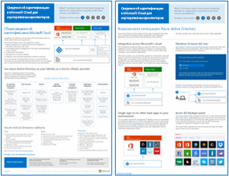
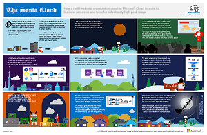
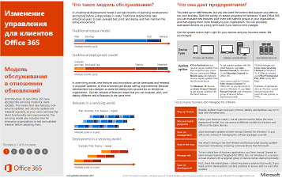
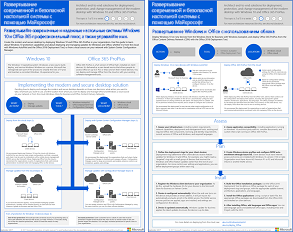

# Ресурсы для администраторов, посвященные архитектуре Microsoft CloudMicrosoft Cloud IT architecture resources

 **Сводка.** Узнайте об облачных службах и платформах Майкрософт. Ознакомьтесь со схемой корпоративного облака и рядом сведений об облачной архитектуре и не только.**Summary:** Learn about Microsoft cloud services and platforms. Review our enterprise cloud roadmap, explore our cloud architecture series, and more.
  
Эти плакаты и средства архитектуры содержат информацию об облачных службах и платформах Майкрософт, в том числе Office 365, Microsoft Azure, Microsoft Intune, Microsoft Dynamics 365, центре данных на базе частного облака, а также гибридных и облачных решениях. При помощи этих ресурсов ответственные ИТ-специалисты и архитекторы могут определять подходящие варианты для своих рабочих нагрузок, а также принимать решения по основным компонентам инфраструктуры, таким как идентификация и безопасность.These architecture tools and posters give you information about Microsoft cloud services and platforms, including Office 365, Microsoft Azure, Microsoft Intune, Microsoft Dynamics 365, private cloud datacenter, and hybrid on-premises and cloud solutions. IT decision makers and architects can use these resources to determine the ideal solutions for their workloads and to make decisions about core infrastructure components such as identity and security. 
  
- **[Схема корпоративного облака Майкрософт](microsoft-cloud-it-architecture-resources.md#roadmap)** (Sway)**[Microsoft's Enterprise Cloud Roadmap](microsoft-cloud-it-architecture-resources.md#roadmap)** (Sway)
    
- **[Серия "Облако Майкрософт для корпоративных архитекторов"](microsoft-cloud-it-architecture-resources.md#cloudarch)****[Microsoft Cloud for Enterprise Architects Series](microsoft-cloud-it-architecture-resources.md#cloudarch)** 
    - [Варианты облачных служб и платформ МайкрософтMicrosoft Cloud Services and Platform Options](microsoft-cloud-it-architecture-resources.md#platformoptions)
    - [Идентификация в облаке Майкрософт для корпоративных архитекторовMicrosoft Cloud Identity for Enterprise Architects](microsoft-cloud-it-architecture-resources.md#identity)
    - [Обеспечение безопасности в облаке Майкрософт для корпоративных архитекторовMicrosoft Cloud Security for Enterprise Architects](microsoft-cloud-it-architecture-resources.md#security)
    - [Организация сети в облаке Майкрософт для корпоративных архитекторовMicrosoft Cloud Networking for Enterprise Architects](microsoft-cloud-it-architecture-resources.md#networking)
    - [Microsoft Mobility + Security для корпоративных архитекторовMicrosoft Mobility and Security for Enterprise Architects](microsoft-cloud-it-architecture-resources.md#mobility)
    - [Хранение в облаке Майкрософт для корпоративных архитекторовMicrosoft Cloud Storage for Enterprise Architects](microsoft-cloud-it-architecture-resources.md#storage)
    - [Гибридное облако Майкрософт для корпоративных архитекторовMicrosoft Hybrid Cloud for Enterprise Architects](microsoft-cloud-it-architecture-resources.md#hybrid)
    - [Contoso в Microsoft CloudContoso in the Microsoft Cloud](microsoft-cloud-it-architecture-resources.md#contoso)
    - [Распространенные атаки и как Майкрософт защищает вашу организациюCommon attacks and Microsoft capabilities that protect your organizaion](#common-attacks-and-microsoft-capabilities-that-protect-your-organization)
    
- **[Серия решений Office 365 для корпоративных пользователей](microsoft-cloud-it-architecture-resources.md#BKMK_o365solutions)**:**[Office 365 Enterprise Solution Series](microsoft-cloud-it-architecture-resources.md#BKMK_o365solutions)**:
    - [Защита информации для Office 365Information Protection for Office 365](microsoft-cloud-it-architecture-resources.md#BKMK_infoprotect)
    - [Защита идентификации и устройств для Office 365Identity and Device Protection for Office 365](microsoft-cloud-it-architecture-resources.md#BKMK_O365IDP)
    - [Решения для защиты файлов в Office 365File Protection Solutions in Office 365](microsoft-cloud-it-architecture-resources.md#BKMK_O365fileprotect)
    - [Управление изменениями для клиентов Office 365Change Management for Office 365 Clients](microsoft-cloud-it-architecture-resources.md#changemgmt)
    - [Развертывание современной и безопасной настольной системы с помощью МайкрософтDeploy a modern and secure desktop with Microsoft](microsoft-cloud-it-architecture-resources.md#msd)
    
> [!TIP]
> Большинство плакатов на этой странице доступны на нескольких языках, включая английский, испанский, итальянский, китайский, корейский, немецкий, португальский, русский, французский и японский. Чтобы скачать плакат на одном из этих языков, нажмите ссылку **Другие языки**.Most of the posters on this page are available in multiple languages, including Chinese, English, French, German, Italian, Japanese, Korean, Portuguese, Russian, and Spanish. To download a poster in one of these languages, click the **More languages** link for that poster.
  
Сообщите нам свое мнение. Ждем ваших отзывов по адресу [cloudadopt@microsoft.com](mailto:cloudadopt@microsoft.com).Let us know what you think! Send us email at [cloudadopt@microsoft.com](mailto:cloudadopt@microsoft.com). 
  

## Схема корпоративного облака МайкрософтMicrosoft's Enterprise Cloud Roadmap

Ознакомьтесь с плакатами, наборами значков, сообществами и другими материалами по самому совершенному облачному решению в отрасли.See the posters, icon sets, community venues, and other resources that describe the industry's most complete cloud solution.
  
|**Элемент****Item**|**Описание****Description**|
|:-----|:-----|
|[          ](https://aka.ms/cloudarchitecture)[          ](https://aka.ms/cloudarchitecture)   [Схема корпоративного облака Майкрософт](https://aka.ms/cloudarchitecture) (https://aka.ms/cloudarchitecture)[Microsoft's Enterprise Cloud Roadmap](https://aka.ms/cloudarchitecture) (https://aka.ms/cloudarchitecture)   |В этой презентации Sway вы найдете материалы по самому совершенному облачному решению в отрасли.Swipe through this Sway experience for the resources that describe the industry's most complete cloud solution.    |
   

## Серия "Облако Майкрософт для корпоративных архитекторов"Microsoft Cloud for Enterprise Architects Series

На этих плакатах об облачной архитектуре приведена информация об облачных службах и платформах Майкрософт, в том числе Office 365, Microsoft Azure, Microsoft Intune, Microsoft Dynamics CRM Online, центре обработки данных на базе частного облака, а также гибридных, локальных и облачных решениях. При помощи этих ресурсов лица, принимающие решения касательно ИТ-инфраструктуры, и архитекторы могут определять подходящие варианты для своих рабочих нагрузок, а также принимать решения по основным компонентам инфраструктуры, таким как идентификация и безопасность.These cloud architecture posters give you information about Microsoft cloud services and platforms, including Office 365, Microsoft Azure, Microsoft Intune, Microsoft Dynamics CRM Online, private cloud datacenter, and hybrid on-premises and cloud solutions. IT decision makers and architects can use these resources to determine the ideal solutions for their workloads and to make decisions about core infrastructure components such as identity and security.
  

### Варианты облачных служб и платформ МайкрософтMicrosoft Cloud Services and Platform Options

Узнайте об основных различиях между вариантами облачных служб и платформ Майкрософт. Выберите наиболее подходящий.Learn key differences between Microsoft cloud services and platform offerings. Find the best fit for your solution.
  
|**Элемент****Item**|**Описание****Description**|
|:-----|:-----|
|[          ](https://www.microsoft.com/download/details.aspx?id=54432)[          ](https://www.microsoft.com/download/details.aspx?id=54432)   [PDF](https://go.microsoft.com/fwlink/p/?LinkId=524731)  \| [Visio](https://go.microsoft.com/fwlink/p/?LinkId=524732)  \| [Другие языки](https://www.microsoft.com/download/details.aspx?id=54432)[PDF](https://go.microsoft.com/fwlink/p/?LinkId=524731)  \| [Visio](https://go.microsoft.com/fwlink/p/?LinkId=524732)  \| [More languages](https://www.microsoft.com/download/details.aspx?id=54432)   | Эта модель описывает:This model describes: <ul><li>  Варианты программного обеспечения как услуги (SaaS), включая Office 365Software as a Service (SaaS) offerings, including Office 365 </li><li>  Варианты платформы как услуги (PaaS) в Microsoft AzurePlatform as a Service (PaaS) features in Microsoft Azure </li><li>  Варианты инфраструктуры как услуги (IaaS) в Microsoft AzureInfrastructure as a Service (IaaS) features in Microsoft Azure </li><li>  Возможности центра данных на базе частного облака с использованием Windows Server и System CenterPrivate cloud datacenter capabilities using Windows Server and System Center </li><li>  Узнайте, как ИТ-отдел Майкрософт переходит на эти облачные службы и формирует собственное гибридное облако.Learn how Microsoft's own IT department is migrating to these cloud services and building its hybrid cloud. </li></ul> |
   

### Идентификация в облаке Майкрософт для корпоративных архитекторовMicrosoft Cloud Identity for Enterprise Architects

Сведения для ИТ-архитекторов о создании системы удостоверений для организаций, использующих облачные службы и платформы Майкрософт.What IT architects need to know about designing identity for organizations using Microsoft cloud services and platforms.
  
|**Элемент****Item**|**Описание****Description**|
|:-----|:-----|
|[          ](https://www.microsoft.com/download/details.aspx?id=54431)[          ](https://www.microsoft.com/download/details.aspx?id=54431)   [PDF](https://go.microsoft.com/fwlink/p/?LinkId=524586)  \| [Visio](https://download.microsoft.com/download/2/3/8/238228E6-9017-4F6C-BD3C-5559E6708F82/MSFT_cloud_architecture_identity.vsd)           \| [Статья](https://technet.microsoft.com/library/mt613459.aspx)[PDF](https://go.microsoft.com/fwlink/p/?LinkId=524586)  \| [Visio](https://download.microsoft.com/download/2/3/8/238228E6-9017-4F6C-BD3C-5559E6708F82/MSFT_cloud_architecture_identity.vsd)           \| [Article](https://technet.microsoft.com/library/mt613459.aspx)   [Другие языки](https://www.microsoft.com/download/details.aspx?id=54431)[More languages](https://www.microsoft.com/download/details.aspx?id=54431)   | Эта модель содержит:This model contains: <ul><li>Общие сведения об удостоверениях в облаке МайкрософтIntroduction to identity with Microsoft’s cloud </li> <li>Возможности платформы IDaaS в Azure ADAzure AD IDaaS capabilities </li><li>Интеграция локальных учетных записей доменных служб Active Directory с Microsoft Azure Active DirectoryIntegrating on-premises Active Directory Domain Services accounts with Microsoft Azure Active Directory </li> <li>Размещение компонентов каталога в AzurePutting directory components in Azure </li><li>Варианты доменных служб для рабочих нагрузок в службе Azure IaaSDomain services options for workloads in Azure IaaS </li></ul>  |
   

### Обеспечение безопасности в облаке Майкрософт для корпоративных архитекторовMicrosoft Cloud Security for Enterprise Architects

Сведения для ИТ-архитекторов о безопасности в облачных службах и платформах Майкрософт.What IT architects need to know about security in Microsoft cloud services and platforms.
  
|**Элемент****Item**|**Описание****Description**|
|:-----|:-----|
|[          ](https://www.microsoft.com/download/details.aspx?id=48121)[          ](https://www.microsoft.com/download/details.aspx?id=48121)   [PDF](https://go.microsoft.com/fwlink/p/?linkid=842070)  \| [Visio](https://go.microsoft.com/fwlink/p/?LinkId=842071)  \| [Другие языки](https://www.microsoft.com/download/details.aspx?id=48121)[PDF](https://go.microsoft.com/fwlink/p/?linkid=842070)  \| [Visio](https://go.microsoft.com/fwlink/p/?LinkId=842071)  \| [More languages](https://www.microsoft.com/download/details.aspx?id=48121)   | Эта модель содержит:This model contains: <ul><li>Роль корпорации Майкрософт в предоставлении безопасных служб и платформ.Microsoft's role in providing secure services and platforms</li><li>Обязанности клиента по снижению угроз безопасности.Customer responsibilities to mitigate security risks</li><li>Лучшие варианты сертификации защиты.Top security certifications </li><li>Решения для обеспечения безопасности от консалтинговых служб Майкрософт.Security offerings provided by Microsoft consulting services </ul></li>Пройдите курс виртуальной академии Microsoft Virtual Academy [Обеспечение безопасности в облачном мире](https://mva.microsoft.com/training-courses/security-in-a-cloudenabled-world-12725?l=CfLHobAcB_3904300474), основанный на этом плакате.Take [Security in a Cloud-Enabled World](https://mva.microsoft.com/training-courses/security-in-a-cloudenabled-world-12725?l=CfLHobAcB_3904300474), a Microsoft Virtual Academy course based on this architecture poster.  |
   

### Организация сети в облаке Майкрософт для корпоративных архитекторовMicrosoft Cloud Networking for Enterprise Architects

Сведения для ИТ-архитекторов о сетях для облачных служб и платформ Майкрософт.What IT architects need to know about networking for Microsoft cloud services and platforms.
  
|**Элемент****Item**|**Описание****Description**|
|:-----|:-----|
|[          ](https://www.microsoft.com/download/details.aspx?id=54425)[          ](https://www.microsoft.com/download/details.aspx?id=54425)   [PDF](https://go.microsoft.com/fwlink/p/?linkid=842073)  \| [Visio](https://go.microsoft.com/fwlink/p/?linkid=842074)           \| [Статья](https://technet.microsoft.com/library/mt733214.aspx)[PDF](https://go.microsoft.com/fwlink/p/?linkid=842073)  \| [Visio](https://go.microsoft.com/fwlink/p/?linkid=842074)           \| [Article](https://technet.microsoft.com/library/mt733214.aspx)  [Другие языки](https://www.microsoft.com/download/details.aspx?id=54425)[More languages](https://www.microsoft.com/download/details.aspx?id=54425)   | Эта модель содержит следующие страницы:This model contains the following pages: <ul><li> **Развитие сети для подключения к облаку.** Миграция в облако изменяет объем и характер потоков трафика в корпоративной сети и за ее пределами. Кроме того, она влияет на способы противодействия угрозам безопасности.**Evolving your network for cloud connectivity** Cloud migration changes the volume and nature of traffic flows within and outside a corporate network. It also affects approaches to mitigating security risk. </li><li> **Стандартные элементы Майкрософт для подключения к облаку.** Интеграция сети с облаком Майкрософт обеспечивает оптимальный доступ к большому числу служб.**Common elements of Microsoft cloud connectivity** Integrating your networking with the Microsoft cloud provides optimal access to a broad range of services. </li><li> **ExpressRoute для подключения к облаку Майкрософт**. ExpressRoute обеспечивает закрытое, выделенное и скоростное сетевое подключение к облаку Майкрософт.**ExpressRoute for Microsoft cloud connectivity** ExpressRoute provides a private, dedicated, high-throughput network connection to Microsoft's cloud. </li><li> **Разработка сетей для Microsoft SaaS (Office 365, Microsoft Intune и Dynamics CRM Online)**. Оптимизация сетей для служб Microsoft SaaS требует тщательного анализа конъюнктуры сети Интернет, клиентских устройств и типичных ИТ-операций.**Designing networking for Microsoft SaaS (Office 365, Microsoft Intune, and Dynamics CRM Online)** Optimizing your network for Microsoft SaaS services requires careful analysis of your Internet edge, your client devices, and typical IT operations. </li><li> **Разработка сетей для Azure PaaS**. Оптимизация сетей для приложений Azure PaaS требует соответствующей пропускной способности и, при необходимости, распределения сетевого трафика по нескольким сайтам или приложениям.**Designing networking for Azure PaaS** Optimizing networking for Azure PaaS apps requires adequate Internet bandwidth and can require the distribution of network traffic across multiple sites or apps. </li><li> **Разработка сетей для Azure IaaS**. Пошаговая инструкция по разработке эффективной виртуальной сети Azure для размещения серверных ИТ-задач, в том числе подсетей, пространств адресов, маршрутизации, балансировки нагрузки, а также подключения к локальной сети, другим виртуальным сетям и к Интернету.**Designing networking for Azure IaaS** Step through the design process to create an optimal Azure virtual network (VNet) for hosting server-based IT workloads, including subnets, address spaces, routing, DNS, load balancing, and connectivity to your on-premises network, other VNets, and the Internet. </li></ul>   Пройдите новый курс виртуальной академии Microsoft Virtual Academy [Оптимизация сети для облачных служб Майкрософт](https://aka.ms/optimizecloudnetworkingmva), основанный на этом плакате.Take [Optimize Your Network for Microsoft Cloud Offerings](https://aka.ms/optimizecloudnetworkingmva), a new Microsoft Virtual Academy course based on this architecture poster.   |
   

### Microsoft Mobility + Security для корпоративных архитекторовMicrosoft Mobility and Security for Enterprise Architects

Сведения для ИТ-архитекторов о мобильности в облачных службах и платформах корпорации Майкрософт.What IT architects need to know about mobility with Microsoft cloud services and platforms.
  
|**Элемент****Item**|**Описание****Description**|
|:-----|:-----|
|[          ](https://www.microsoft.com/download/details.aspx?id=55023)[          ](https://www.microsoft.com/download/details.aspx?id=55023)   [PDF](https://go.microsoft.com/fwlink/p/?linkid=842076)  \| [Visio](https://go.microsoft.com/fwlink/p/?linkid=842077)  \| [Другие языки](https://www.microsoft.com/download/details.aspx?id=55023)[PDF](https://go.microsoft.com/fwlink/p/?linkid=842076)  \| [Visio](https://go.microsoft.com/fwlink/p/?linkid=842077)  \| [More languages](https://www.microsoft.com/download/details.aspx?id=55023)   | Эта модель содержит:This model contains: <ul><li>Основные мобильные приложения для бизнесаTop mobile apps for business </li><li>Платформа, службы и ресурсы для разработки мобильных приложенийPlatform, services, and resources for developing mobile apps </li><li>Управление доступом к облачным приложениям и данным с мобильных устройствManaging access to cloud-based applications and data from mobile devices </li><li>Сравнение возможностей и поддержки платформ между Office 365 MDM, Azure Active Directory Premium и IntuneComparison of capabilities and platform support for Office 365 MDM, Azure Active Directory Premium, and Intune </li></ul>  |
   

### Хранение в облаке Майкрософт для корпоративных архитекторовMicrosoft Cloud Storage for Enterprise Architects

Сведения для ИТ-архитекторов о вариантах хранения в облачных службах и на платформах Майкрософт.What IT architects need to know about storage options in Microsoft cloud services and platforms.
  
|**Элемент****Item**|**Описание****Description**|
|:-----|:-----|
|[          ](https://www.microsoft.com/download/details.aspx?id=49552)[          ](https://www.microsoft.com/download/details.aspx?id=49552)   [PDF](https://go.microsoft.com/fwlink/p/?linkid=842079)  \| [Visio](https://go.microsoft.com/fwlink/p/?linkid=842080)           \| [Статья](hhttps://technet.microsoft.com/library/mt842597.aspx)[PDF](https://go.microsoft.com/fwlink/p/?linkid=842079)  \| [Visio](https://go.microsoft.com/fwlink/p/?linkid=842080)           \| [Article](hhttps://technet.microsoft.com/library/mt842597.aspx)  [Другие языки](https://www.microsoft.com/download/details.aspx?id=49552)[More languages](https://www.microsoft.com/download/details.aspx?id=49552)   | Эта модель содержит:This model contains: <ul><li>Причины использования облачного хранилища и основные сценарииReasons for using cloud storage and the key scenarios </li><li>Службы облачного хранения, которые прилагаются к существующим службамCloud storage options that are bundled with existing services </li><li>Службы хранения, которые можно использовать в качестве отправной точки для собственного решенияStorage options that you can use as a starting point for your storage solution </li><li>Функциональные блоки для создания собственного решения или хранилища для приложенийStorage building blocks to create your own storage solution or storage for your apps</li></ul> |
   

### Гибридное облако Майкрософт для корпоративных архитекторовMicrosoft Hybrid Cloud for Enterprise Architects

Сведения для ИТ-архитекторов о гибридном облаке для служб и платформ Майкрософт.What IT architects need to know about hybrid cloud for Microsoft services and platforms.
  
|**Элемент****Item**|**Описание****Description**|
|:-----|:-----|
|[          ](https://www.microsoft.com/download/details.aspx?id=54424)[          ](https://www.microsoft.com/download/details.aspx?id=54424)   [PDF](https://go.microsoft.com/fwlink/p/?linkid=842082)  \| [Visio](https://go.microsoft.com/fwlink/p/?linkid=842083)           \| [Статья](https://technet.microsoft.com/library/mt750500.aspx)[PDF](https://go.microsoft.com/fwlink/p/?linkid=842082)  \| [Visio](https://go.microsoft.com/fwlink/p/?linkid=842083)           \| [Article](https://technet.microsoft.com/library/mt750500.aspx)  [Другие языки](https://www.microsoft.com/download/details.aspx?id=54424)[More languages](https://www.microsoft.com/download/details.aspx?id=54424)   | Эта модель содержит следующие страницы:This model contains the following pages: <ul><li> **Общие сведения о гибридном облаке**. Облачные предложения корпорации Майкрософт (SaaS, Azure PaaS и Azure IaaS) и их общие элементы.**Hybrid cloud overview** Microsoft's cloud offerings (SaaS, Azure PaaS, and Azure IaaS) and their common elements. </li><li> **Архитектура сценариев гибридного облака корпорации Майкрософт**. Схема архитектуры гибридного облака для облачных предложений корпорации Майкрософт, на которой показаны общие слои локальных инфраструктуры, сети и удостоверений.**Architecture of Microsoft hybrid cloud scenarios** An architectural diagram of hybrid cloud for Microsoft's cloud offerings, showing the common layers of on-premises infrastructure, networking, and identity. </li><li> **Сценарии гибридного облака для Microsoft SaaS (Office 365)**. Архитектура гибридного сценария SaaS и описания ключевых гибридных конфигураций для Skype для бизнеса, SharePoint Server и Exchange Server.**Hybrid cloud scenarios for Microsoft SaaS (Office 365)** The SaaS hybrid scenario architecture and descriptions of key hybrid configurations for Skype for Business, SharePoint Server, and Exchange Server. </li><li> **Сценарии гибридного облака для Azure PaaS**. Архитектура гибридного сценария Azure PaaS и описание вариантов применения гибридной среды Azure PaaS с примером и описанием базы данных SQL Server 2016 Stretch.**Hybrid cloud scenarios for Azure PaaS** The Azure PaaS hybrid scenario architecture, the description of an Azure PaaS hybrid application with an example, and the description of SQL Server 2016 Stretch Database. </li><li> **Сценарии гибридного облака для Azure IaaS**. Архитектура гибридного сценария Azure IaaS и описание варианта применения бизнес-приложения, размещенного в Azure IaaS.**Hybrid cloud scenarios for Azure IaaS** The Azure IaaS hybrid scenario architecture and the description of a line of business (LOB) application hosted in Azure IaaS. </li></ul> |
   

### Contoso в Microsoft CloudContoso in the Microsoft Cloud

Как вымышленная, но типичная международная организация реализовала облачные решения Майкрософт, в том числе Office 365, Azure, Dynamics 365 и Intune.How a fictional but representative global organization has implemented Microsoft's cloud offerings, including Office 365, Azure, Dynamics 365, and Intune.
  
|**Элемент****Item**|**Описание****Description**|
|:-----|:-----|
|[          ](https://www.microsoft.com/download/details.aspx?id=54427)[          ](https://www.microsoft.com/download/details.aspx?id=54427)   [PDF](https://go.microsoft.com/fwlink/p/?linkid=842085)  \| [Visio](https://go.microsoft.com/fwlink/p/?linkid=842086)           \| [Статья](https://technet.microsoft.com/library/mt775341.aspx)[PDF](https://go.microsoft.com/fwlink/p/?linkid=842085)  \| [Visio](https://go.microsoft.com/fwlink/p/?linkid=842086)           \| [Article](https://technet.microsoft.com/library/mt775341.aspx)  [Другие языки](https://www.microsoft.com/download/details.aspx?id=54427)[More languages](https://www.microsoft.com/download/details.aspx?id=54427)   |Эта модель содержит:This model contains: <ul><li>Общие сведения о корпорации ContosoOverview of the Contoso Corporation </li><li>ИТ-инфраструктура и потребности корпорации ContosoContoso's IT infrastructure and needs </li><li>Организация сети Contoso в облакеCloud networking for Contoso</li><li>Идентификация Contoso в облакеCloud identity for Contoso</li><li>Подписки, лицензии и учетные записи пользователей ContosoContoso's subscriptions, licenses, and user accounts</li><li>Обеспечение безопасности в облаке для ContosoCloud security for Contoso</li><li>Сценарии использования облака в корпорации ContosoEnterprise cloud scenarios for Contoso</li></ul>  |
   

### Распространенные атаки и как Майкрософт защищает вашу организациюCommon attacks and Microsoft capabilities that protect your organization
Узнайте о распространенных кибер-атаках и о том, как Майкрософт поможет вашей организации на каждом этапе атаки.Learn about the most common cyber attacks and how Microsoft can help your organization at every stage of an attack. 

|**Ресурс****Item**|**Описание****Description**|
|:-----|:-----|
|   [PDF](http://download.microsoft.com/download/F/A/C/FACFC1E9-FA35-4DF1-943C-8D4237B4275B/MSFT_Cloud_architecture_security_commonattacks.pdf) \| [Visio](http://download.microsoft.com/download/F/A/C/FACFC1E9-FA35-4DF1-943C-8D4237B4275B/MSFT_Cloud_architecture_security_commonattacks.vsdx)[PDF](http://download.microsoft.com/download/F/A/C/FACFC1E9-FA35-4DF1-943C-8D4237B4275B/MSFT_Cloud_architecture_security_commonattacks.pdf) \| [Visio](http://download.microsoft.com/download/F/A/C/FACFC1E9-FA35-4DF1-943C-8D4237B4275B/MSFT_Cloud_architecture_security_commonattacks.vsdx)   | На этом плакате показаны этапы основных атак и описаны возможности, позволяющие остановить злоумышленников на каждом из них.This poster illustrates the path of common attacks and describes which capabilities help stop attackers at each stage of an attack.  |

### Облако СантыThe Santa Cloud

Каждый год, доставляя подарки, Санта и его эльфы используют облачные решения Майкрософт.How Santa and his elves use Microsoft's cloud offerings to make their annual deliveries.
  
|**Элемент****Item**|**Описание****Description**|
|:-----|:-----|
|[          ](https://www.microsoft.com/download/details.aspx?id=55039)[          ](https://www.microsoft.com/download/details.aspx?id=55039)   [PDF](https://go.microsoft.com/fwlink/p/?linkid=842088)[PDF](https://go.microsoft.com/fwlink/p/?linkid=842088)   |Чтобы определить, кто вел себя хорошо, а кто плохо, и правильно доставить подарки 24 декабря, Санта-Клаус и его ИТ-отдел эльфов используют Office 365, Azure, Dynamics 365 и Intune.To determine who is naughty and nice and the presents to deliver on December 24, Santa Claus and his elfin IT department use Office 365, Azure, Dynamics 365, and Intune.   |
   

## Серия "Корпоративные решения для Office 365"Office 365 Enterprise Solution Series

В решениях для Office 365 корпоративный представлены инструкции по реализации возможностей Office 365, особенно при их пересечении с технологиями.The Office 365 enterprise solution series provides guidance for implementing Office 365 capabilities, especially where capabilities cross technologies.
  

### Защита информации в Office 365Information Protection for Office 365

Возможности защиты корпоративных активов для предприятий.Capabilities for enterprise organizations to protect corporate assets.
  
|**Элемент****Item**|**Описание****Description**|
|:-----|:-----|
|[          ](https://www.microsoft.com/download/details.aspx?id=54429)[          ](https://www.microsoft.com/download/details.aspx?id=54429)   [PDF](http://download.microsoft.com/download/2/3/D/23D91386-8349-4F7A-9470-FD5AED861F16/MSFT_cloud_architecture_informationprotection.pdf)  \| [Visio](http://download.microsoft.com/download/2/3/D/23D91386-8349-4F7A-9470-FD5AED861F16/MSFT_cloud_architecture_informationprotection.vsd)  \| [Другие языки](https://www.microsoft.com/download/details.aspx?id=54429)[PDF](http://download.microsoft.com/download/2/3/D/23D91386-8349-4F7A-9470-FD5AED861F16/MSFT_cloud_architecture_informationprotection.pdf)  \| [Visio](http://download.microsoft.com/download/2/3/D/23D91386-8349-4F7A-9470-FD5AED861F16/MSFT_cloud_architecture_informationprotection.vsd)  \| [More languages](https://www.microsoft.com/download/details.aspx?id=54429)   |Майкрософт предоставляет самый полный набор возможностей для защиты корпоративных активов. С помощью этой модели предприятия могут использовать методический подход на этапе планирования при принятии решения, какие возможности необходимо реализовать.Microsoft provides the most complete set of capabilities to protect your corporate assets. This model helps organizations take a methodical approach when planning which capabilities to implement.   |
   

### Защита идентификации и устройств в Office 365Identity and Device Protection for Office 365

Рекомендуемые возможности для защиты удостоверений и устройств, имеющих доступ к Office 365 и отличных от SaaS-служб и локальных приложений, которые опубликованы с помощью прокси приложения Azure AD.Recommended capabilities for protecting identities and devices that access Office 365, other SaaS services, and on-premises applications published with Azure AD Application Proxy.
  
|**Элемент****Item**|**Описание****Description**|
|:-----|:-----|
|[          ](https://www.microsoft.com/download/details.aspx?id=55032)[          ](https://www.microsoft.com/download/details.aspx?id=55032)   [PDF](https://go.microsoft.com/fwlink/p/?linkid=841656)  \| [Visio](https://go.microsoft.com/fwlink/p/?linkid=841657)  \| [Другие языки](https://www.microsoft.com/download/details.aspx?id=55032)[PDF](https://go.microsoft.com/fwlink/p/?linkid=841656)  \| [Visio](https://go.microsoft.com/fwlink/p/?linkid=841657)  \| [More languages](https://www.microsoft.com/download/details.aspx?id=55032)   |Важно, чтобы уровни защиты данных, удостоверений и устройств согласовывались между собой. В этом документе приводится сравнительная характеристика различных возможностей, а также предоставляются дополнительные сведения о возможностях защиты удостоверений и устройств.It's important to use consistent levels of protection across your data, identities, and devices. This document shows you which capabilities are comparable with more information on capabilities to protect identities and devices.    |
   

### Решения для защиты файлов в Office 365File Protection Solutions in Office 365

В случае рекомендуемых возможностей для защиты файлов в Office 365 используются три разных уровня конфиденциальности.Recommended capabilities for protecting files in Office 365 based on three different sensitivity levels.
  
|**Элемент****Item**|**Описание****Description**|
|:-----|:-----|
|[          ](https://www.microsoft.com/download/details.aspx?id=55523)[          ](https://www.microsoft.com/download/details.aspx?id=55523)   [PDF](http://download.microsoft.com/download/7/8/9/789645A5-BD10-4541-BC33-F8D1EFF5E911/MSFT_cloud_architecture_O365 file protection.pdf)  \| [Visio](http://download.microsoft.com/download/7/8/9/789645A5-BD10-4541-BC33-F8D1EFF5E911/MSFT_cloud_architecture_O365%20file%20protection.vsdx)[PDF](http://download.microsoft.com/download/7/8/9/789645A5-BD10-4541-BC33-F8D1EFF5E911/MSFT_cloud_architecture_O365 file protection.pdf)  \| [Visio](http://download.microsoft.com/download/7/8/9/789645A5-BD10-4541-BC33-F8D1EFF5E911/MSFT_cloud_architecture_O365%20file%20protection.vsdx)   |Важно, чтобы уровни защиты данных, удостоверений и устройств согласовывались между собой. В этом документе приводится сравнительная характеристика различных возможностей, а также предоставляются дополнительные сведения о возможностях защиты файлов в Office 365.It's important to use consistent levels of protection across your data, identities, and devices. This document shows you which capabilities are comparable with more information on capabilities to protect files in Office 365.    |
   

### Изменение управления для клиентов Office 365Change Management for Office 365 Clients

Сведения для ИТ-архитекторов об управлении выпусками Windows 10 и клиентских приложений Office 365.What IT architects need to know about managing releases for the Office 365 client applications and Windows 10. 
  
|**Элемент****Item**|**Описание****Description**|
|:-----|:-----|
|[          ](https://www.microsoft.com/download/details.aspx?id=49141)[          ](https://www.microsoft.com/download/details.aspx?id=49141)   [PDF](https://go.microsoft.com/fwlink/p/?LinkId=626681)  \| [Visio](https://go.microsoft.com/fwlink/p/?LinkId=626680)           \| [Статья](https://technet.microsoft.com/library/mt584223.aspx)[PDF](https://go.microsoft.com/fwlink/p/?LinkId=626681)  \| [Visio](https://go.microsoft.com/fwlink/p/?LinkId=626680)           \| [Article](https://technet.microsoft.com/library/mt584223.aspx)  [Другие языки](https://www.microsoft.com/download/details.aspx?id=49141)[More languages](https://www.microsoft.com/download/details.aspx?id=49141)   | Эта модель содержит:This model contains: <ul><li>Модель обслуживания Windows 10 и клиентских приложений Office 365The servicing model for Windows 10 and the Office 365 client applications </li><li>  Варианты выпускаRelease Options </li><li>  Периодические выпускиRelease Cadences </li><li>  Типы измененийTypes of Changes </li><li>  Роли и обязанностиRoles and Responsibilities </li><li>  Управление развертываниями обновленийManage Update Deployments </li></ul>   [Информация в виде статьи](http://technet.microsoft.com/library/815fa1aa-0355-40b5-b7bc-cdf7d4610062.aspx)View the information in article form: [Change management for Office 365 clients](http://technet.microsoft.com/library/815fa1aa-0355-40b5-b7bc-cdf7d4610062.aspx).    |
   

### Развертывание современной и безопасной настольной системы с помощью МайкрософтDeploy a modern and secure desktop with Microsoft

Что ИТ-архитекторам нужно знать о развертывании обновлений для Office 365 профессиональный плюс в Windows 10 и управлении ими.What IT architects need to know about deploying and managing updates for Office 365 ProPlus on Windows 10.
  
|**Элемент****Item**|**Описание****Description**|
|:-----|:-----|
|[          ](https://www.microsoft.com/download/details.aspx?id=55987)[          ](https://www.microsoft.com/download/details.aspx?id=55987)   [PDF](http://download.microsoft.com/download/4/E/9/4E90E227-770A-41D1-99FE-925A64D81A55/MSFT_modern_secure_desktop.pdf)  \| [Visio](http://download.microsoft.com/download/4/E/9/4E90E227-770A-41D1-99FE-925A64D81A55/MSFT_modern_secure_desktop.vsdx)[PDF](http://download.microsoft.com/download/4/E/9/4E90E227-770A-41D1-99FE-925A64D81A55/MSFT_modern_secure_desktop.pdf)  \| [Visio](http://download.microsoft.com/download/4/E/9/4E90E227-770A-41D1-99FE-925A64D81A55/MSFT_modern_secure_desktop.vsdx)   | Эта модель содержит:This model contains: <ul><li>  Развертывание Windows 10 и Office профессиональный плюс из облака МайкрософтDeploying Windows 10 and Office ProPlus from the Microsoft cloud </li><li>  Развертывание Windows 10 и Office профессиональный плюс с помощью System Center Configuration ManagerDeploying Windows 10 and Office ProPlus with System Center Configuration Manager </li><li>  Управление обновлениями для Windows 10 и Office профессиональный плюс из облака МайкрософтManaging updates for Windows 10 and Office ProPlus from the Microsoft cloud </li><li>  Управление обновлениями для Windows 10 и Office профессиональный плюс с помощью System Center Configuration ManagerManaging updates for Windows 10 and Office ProPlus with System Center Configuration Manager </li><li>  Встроенные и дополнительные механизмы защиты Windows 10Out-of-the-box and additional protection capabilities of Windows 10 </li></ul>  |
   
## См. такжеSee Also

[Архитектурные модели для SharePoint, Exchange, Skype для бизнеса и LyncArchitectural models for SharePoint, Exchange, Skype for Business, and Lync](architectural-models-for-sharepoint-exchange-skype-for-business-and-lync.md)
  
[Руководства по созданию сред разработки и тестирования облачных решенийCloud adoption Test Lab Guides (TLGs)](cloud-adoption-test-lab-guides-tlgs.md)
  
[Решения для обеспечения безопасностиSecurity solutions](security-solutions.md)
  
[Гибридные решенияHybrid solutions](hybrid-solutions.md)

