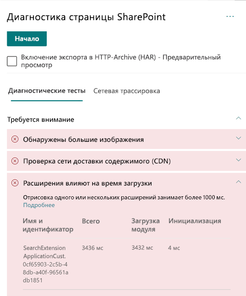

# Оптимизация производительности настраиваемых расширений страниц современных сайтов SharePoint OnlineOptimize custom extension performance in SharePoint Online modern site pages

Из этой статьи вы узнаете, как определять влияние настраиваемых расширений на задержку, распознаваемую конечным пользователем, и как устранять распространенные проблемы.This article will help you understand how to determine how custom extensions affect user perceived latency, and how to remediate common issues.

## Использование средства диагностики страниц SharePoint для анализа настраиваемых расширенийUse the Page Diagnostics for SharePoint tool to analyze custom extensions

Средство "Диагностика страниц SharePoint" — это браузерное расширение для браузеров Chrome и новой версии Microsoft Edge (https://www.microsoft.com/edge), анализирующее страницы современных и классических сайтов публикаций SharePoint Online.The Page Diagnostics for SharePoint tool is a browser extension for the new Microsoft Edge (https://www.microsoft.com/edge) and Chrome browsers that analyzes both SharePoint Online modern portal and classic publishing site pages. Это средство предоставляет отчет о каждой проанализированной странице, показывающий, как она работает при заданных критериях производительности.The tool provides a report for each analyzed page showing how the page performs against a defined set of performance criteria. Чтобы установить и изучить средство диагностики страниц SharePoint, ознакомьтесь со статьей [Использование средства диагностики страниц SharePoint Online](page-diagnostics-for-spo.md).To install and learn about the Page Diagnostics for SharePoint tool, visit [Use the Page Diagnostics tool for SharePoint Online](page-diagnostics-for-spo.md).

>[!NOTE]
>Средство диагностики страниц работает только в SharePoint Online, и его нельзя использовать на системной странице SharePoint.The Page Diagnostics tool only works for SharePoint Online, and cannot be used on a SharePoint system page.

При анализе страницы сайта SharePoint с помощью средства диагностики страниц SharePoint можно просматривать сведения о настраиваемых расширениях, превышающие базовые показатели, в результатах **Влияние расширений на время загрузки** на панели _Диагностические тесты_.When you analyze a SharePoint site page with the Page Diagnostics for SharePoint tool, you can see information about custom extensions that exceed the baseline metric in the **Extensions are impacting load time** result in the _Diagnostic tests_ pane.

Возможные результаты:Possible results include:

- **Внимание** (красный цвет) — любое _настраиваемое_ расширение, требующее более **одной** секунды на загрузку.**Attention required** (red): Any _custom_ extension that takes longer than **one** second to load. Общее время загрузки распределяется в результатах теста в зависимости от времени, потраченного на загрузку модулей и инициализацию.Total load time as displayed in test results is broken down by module load and init.
- **Действия не требуются** (зеленый цвет) — загрузка любого расширения занимает не больше одной секунды.**No action required** (green): No extension is taking longer than one second to load.

Если расширение влияет на время загрузки страницы, результаты отображается в разделе результатов **Внимание**.If an extension is impacting page load time, the result appears in the **Attention required** section of the results. Щелкните результаты, чтобы просмотреть сведения о том, какое расширение загружается медленно.Click the result to see details about which extension is loading slowly. В последующих обновлениях средства диагностики страниц SharePoint могут быть обновленные правила анализа, поэтому убедитесь, что у вас всегда есть последняя версия средства.Future updates to the Page Diagnostics for SharePoint tool may include updates to analysis rules, so please ensure you always have the latest version of the tool.

Результаты содержат следующие данные:Information available in the results includes:

- **Имя и идентификатор** — идентификационные данные, необходимые при поиске расширения на странице**Name and ID** shows identifying information that can help you find the extension on the page
- **Общее время** — общее время инициализации и загрузки расширения**Total** shows the total time for the extension to initialize and load
- **Загрузка модуля** — время, затраченное на извлечение и загрузку расширения**Module Load** shows the time taken to fetch and load the extension
- **Инициализация** — время, затраченное на инициализацию расширения**Init** shows the time taken for the extension to initialize

Эта информация предназначена для того, чтобы помочь проектировщикам и разработчикам устранять проблемы.This information is provided to help designers and developers troubleshoot issues. С ней следует ознакомить команду по проектированию и разработке.This information should be provided to your design and development team.

## Обзор расширенийOverview of extensions

С помощью расширений SharePoint Framework (SPFx) можно сделать SharePoint удобнее для пользователей.SharePoint Framework (SPFx) Extensions can be used to extend the SharePoint user experience. Используя расширения SharePoint Framework, можно настроить области уведомлений, панели инструментов, представления данных списков и другие аспекты SharePoint.With SharePoint Framework Extensions, you can customize more facets of the SharePoint experience, including notification areas, toolbars, and list data views.

Расширения могут негативно влиять на производительность страницы SharePoint, так как она также использует ресурсы ЦП и сети для выполнения необходимых действий.Extensions can have a bad influence on the performance of a SharePoint page as it also takes CPU and network resources to do required work.

Существует четыре типа расширений:There are four types of extensions:

- **Настройщики приложений** позволяют добавлять скрипты на страницу и получать доступ к заполнителям известных элементов HTML и дополнять их с использованием специальной отрисовки.**Application Customizers** adds scripts to the page, and accesses well-known HTML element placeholders and extends them with custom renderings.
- **Настройщики полей** предоставляют измененные представления данных для полей списка.**Field Customizers** provides modified views to data for fields within a list.
- **Наборы команд** позволяют добавлять новые действия для команд SharePoint, а также предоставляют клиентский код, с помощью которого можно реализовать определенное поведение.**Command Sets** extend the SharePoint command surfaces to add new actions, and provides client-side code that you can use to implement behaviors.
- **Модификатор поискового запроса (только предварительная версия)** вызывается непосредственно перед выполнением поискового запроса.**Search Query Modifier (preview only)** are invoked just before the search query is executed.

## Устранение проблем производительности расширенийRemediate extension performance issues

Чтобы определить и устранить проблемы с производительностью расширений, указанных в окне **Влияние расширений на время загрузки страниц**, используйте инструкции, приведенные в этом разделе.Follow the guidance in this section to identify and remediate performance issues with extensions listed in the **Extensions are impacting page load time** results.

>[!NOTE]
>Настройщики приложений можно выполнять на раннем этапе жизненного цикла страницы, и это может влиять на производительность других расширений на странице.Application customizers may be executed in the early stage during the lifecycle of a page and it may influence the performance of other extensions on the page.

Результаты аудита в средстве диагностики страниц содержат два этапа выполнения расширения, чтобы определить потенциальное влияние на производительность.The audit results in the Page Diagnostic Tool will display two stages of executing an extension in order to help identify the potential performance impact.

- **Загрузка модуля** — это время, необходимое для загрузки расширения, на которое влияет размер расширения. Поэтому рекомендуется объединять в расширении только необходимые библиотеки и выбирать облегченные библиотеки.**Module load** is how long it takes to load the extension, which is impacted by the size of an extension so it is a good idea to only bundle the necessary libraries in the extension and to also choose lighter libraries.
- **Инициализация** — это время инициализации расширения. Разработчики расширений должны учитывать, выполняет ли расширение ненужные действия или слишком много команд на этапе инициализации.**Init** is the initialization time of the extension and extension developers should consider whether the extension is doing unnecessary work or executing too many commands during the initializing stage.

Авторы страниц также могут использовать результаты аудита, чтобы определить, содержит ли страница слишком много расширений, так как слишком большое количество расширений будет негативно влиять на производительность страницы.Page authors can also use the audit result to see whether a page has too many extensions as too many extensions will negatively impact the performance of a page.

- **Размер расширения и зависимости****Extension size and dependencies**
  - Для оптимальной статической загрузки ресурсов следует использовать сеть доставки содержимого (CDN) Office 365.Use of the Office 365 CDN is required for optimal static resource download. Открытые источники CDN предпочтительнее использовать для файлов _JS и CSS_.Public CDN origins are preferable for _js/css_ files. Дополнительные сведения о сети Office 365 CDN см. в статье [Использование сети доставки содержимого Office 365 с SharePoint Online](use-office-365-cdn-with-spo.md).For more information about using the Office 365 CDN, see [Use the Office 365 Content Delivery Network (CDN) with SharePoint Online](use-office-365-cdn-with-spo.md).
  - Повторно используйте такие платформы, как _React_ и _Fabric imports_, которые входят в состав SharePoint Framework (SPFx).Reuse frameworks like _React_ and _Fabric imports_ that come as part of the SharePoint Framework (SPFx). Дополнительные сведения см. в статье [Обзор SharePoint Framework](https://docs.microsoft.com/sharepoint/dev/spfx/sharepoint-framework-overview).For more information, see [Overview of the SharePoint Framework](https://docs.microsoft.com/sharepoint/dev/spfx/sharepoint-framework-overview).
  - Убедитесь, что у вас установлена последняя версия SharePoint Framework, и обновляйте до новых версий, когда они станут доступны.Ensure that you are using the latest version of the SharePoint Framework, and upgrade to new versions as they become available.
- **Извлечение или кэширование данных****Data fetching/caching**
  - Если расширение использует дополнительные вызовы сервера, чтобы извлечь данные для отображения, убедитесь, что эти серверные API достаточно быстры и (или) выполняют кэширование на стороне клиента (например, с использованием _localStorage_ или _IndexDB_ для более крупных наборов).If the extension relies on extra server calls to fetch data for display, ensure those server APIs are fast and/or implement client side caching (such as using _localStorage_ or _IndexDB_ for larger sets).
  - Если для отображения важных данных требуется несколько вызовов, воспользуйтесь пакетной обработкой на сервере или другими методами объединения запросов в один вызов.If multiple calls are required to render critical data, consider batching on the server or other methods of consolidating requests to a single call.
  - Если определенные данные задействуют медленные серверные API, а отображение может начаться и без них, рекомендуется отделить их в независимый вызов, который будет выполнен после отображения критически важных данных.Alternatively, if some elements of data require a slower API, but are not critical to initial rendering, decouple these to a separate call that is executed after critical data is rendered.
  - Когда одни и те же данные повторяются в разных частях, используйте один уровень данных, чтобы избежать повторения вызовов.If multiple parts use the same data, utilize a common data layer to avoid duplicate calls.
- **Время отображения****Rendering time**
  - Любые мультимедийные источники, такие как изображения и видеоролики, следует уменьшать до размера контейнера, устройства и (или) сети во избежание загрузки ненужных больших активов.Any media sources like images and videos should be sized to the limits of the container, device and/or network to avoid downloading unnecessary large assets. Дополнительные сведения о пакетных зависимостях см. в статье [Использование сети доставки содержимого Office 365 с SharePoint Online](use-office-365-cdn-with-spo.md).For more information about content dependencies, see [Use the Office 365 Content Delivery Network (CDN) with SharePoint Online](use-office-365-cdn-with-spo.md).
  - Избегайте вызовов API, которые приводят к перегруппировке, применению сложных правил CSS или сложной анимации.Avoid API calls that cause re-flow, complex CSS rules or complicated animations. Дополнительные сведения см. в статье [Минимизация перегруппировки браузера](https://developers.google.com/speed/docs/insights/browser-reflow).For more information, see [Minimizing browser reflow](https://developers.google.com/speed/docs/insights/browser-reflow).
  - Избегайте выполнения длительных цепных задач.Avoid use of chained long running tasks. Разбивайте такие задачи на отдельные очереди.Instead, break long running tasks apart into separate queues. Дополнительные сведения см. в статье [Оптимизация выполнения JavaScript](https://developers.google.com/web/fundamentals/performance/rendering/optimize-javascript-execution).For more information, see [Optimize JavaScript Execution](https://developers.google.com/web/fundamentals/performance/rendering/optimize-javascript-execution).
  - Резервируйте соответствующее место для асинхронного отображения визуальных элементов или элементов мультимедиа, чтобы избежать пропуска кадров и перебоев, известных как_подвисания_.Reserve corresponding space for asynchronously rendering media or visual elements to avoid skipped frames and stuttering (also known as _jank_).
  - Если какой-либо из браузеров не поддерживает функцию, используемую для отображения, загрузите полизаполнение или исключите выполнение зависимого кода.If a certain browser doesn't support a feature used in rendering, either load a polyfill or exclude running dependent code. А если эта функция не является критической, удалите ресурсы, например, обработчики событий, чтобы избежать утечки памяти.If the feature is not critical, dispose resources such as event handlers to avoid memory leaks.

Перед изменением в страниц для устранения проблем производительности запомните время загрузки страницы по результатам анализа.Before you make page revisions to remediate performance issues, make a note of the page load time in the analysis results. Снова запустите средство после внесения изменений, чтобы узнать, соответствует ли новый результат базовому стандарту, и проверить, сократилось ли время загрузки.Run the tool again after your revision to see if the new result is within the baseline standard, and check the new page load time to see if there was an improvement.

>[!NOTE]
>Время загрузки страницы зависит от множества факторов, например от загрузки сети, времени суток и других переменных условий.Page load time can vary based on a variety of factors such as network load, time of day, and other transient conditions. Следует несколько раз проверить время загрузки страницы до и после внесения изменений, чтобы получить среднестатистические данные.You should test page load time a few times before and after making changes to help you average the results.

## Статьи по темеRelated topics

[Настройка производительности SharePoint OnlineTune SharePoint Online performance](tune-sharepoint-online-performance.md)

[Настройка производительности Office 365Tune Office 365 performance](tune-office-365-performance.md)

[Производительность в современном интерфейсе SharePointPerformance in the modern SharePoint experience](https://docs.microsoft.com/sharepoint/modern-experience-performance)

[Сети доставки содержимогоContent delivery networks](content-delivery-networks.md)

[Использование сети доставки содержимого Office 365 с SharePoint OnlineUse the Office 365 Content Delivery Network (CDN) with SharePoint Online](use-office-365-cdn-with-spo.md)