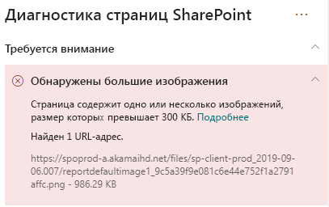

# Оптимизация изображений на современных страницах сайтов SharePoint OnlineOptimize images in SharePoint Online modern site pages

С помощью этой статьи вы узнаете, как оптимизировать изображения на современных страницах сайтов SharePoint Online.This article will help you understand how to optimize images in SharePoint Online modern site pages.

Сведения об оптимизации изображений на классических сайтах публикации см. в статье [Оптимизация изображений для SharePoint Online](image-optimization-for-sharepoint-online.md).For information about optimizing images in classic publishing sites, see [Image optimization for SharePoint Online](image-optimization-for-sharepoint-online.md)..

>[!NOTE]
>Дополнительные сведения о производительности на современных порталах SharePoint Online см. в статье [Производительность в современном интерфейсе SharePoint](https://docs.microsoft.com/ru-RU/sharepoint/modern-experience-performance).For more information about performance in SharePoint Online modern portals, see [Performance in the modern SharePoint experience](https://docs.microsoft.com/ru-RU/sharepoint/modern-experience-performance).

## Использование средства диагностики страниц SharePoint для анализа оптимизации изображенийUse the Page Diagnostics for SharePoint tool to analyze image optimization

Средство **Диагностика страниц SharePoint** — это браузерное расширение для Chrome и [Microsoft Edge версии 77 или более поздней](https://www.microsoftedgeinsider.com/en-us/download?form=MI13E8&OCID=MI13E8), которое можно использовать для анализа современных и классических страниц сайтов публикации SharePoint.The **Page Diagnostics for SharePoint tool** is a browser extension for Chrome and [Microsoft Edge version 77 or later](https://www.microsoftedgeinsider.com/en-us/download?form=MI13E8&OCID=MI13E8) you can use to analyze SharePoint both modern and classic publishing site pages. Это средство предоставляет отчет о каждой проанализированной странице, показывающий, как страница работает в определенном наборе условий.The tool provides a report for each analyzed page showing how the page performs against a defined set of performance criteria. Чтобы установить и изучить средство диагностики страниц SharePoint, ознакомьтесь со статьей [Использование средства диагностики страниц SharePoint Online](page-diagnostics-for-spo.md).To install and learn about the Page Diagnostics for SharePoint tool, visit [Use the Page Diagnostics tool for SharePoint Online](page-diagnostics-for-spo.md).

При анализе современного сайта SharePoint с помощью средства диагностики страниц SharePoint вы можете просматривать сведения о больших изображениях в панели _Диагностические тесты_.When you analyze a SharePoint modern site with the Page Diagnostics for SharePoint tool, you can see information about large images in the _Diagnostic tests_ pane.

Возможные результаты:Possible results include:

- **Внимание!** (красный цвет). Страница содержит **одно или несколько** изображений размером более 300 КБ**Attention required** (red): The page contains **one or more** images over 300KB in size
- **Действия не требуются** (зеленый цвет). Страница не содержит изображений размером более 300 КБ**No action required** (green): The page contains no images over 300KB in size

Если результат **Обнаружены большие изображения** отображается в разделе результатов **Внимание!**, вы можете щелкнуть его для просмотра дополнительных сведений.If the **Large images detected** result appears in the **Attention required** section of the results, you can click the result to see additional details.

## Исправление проблем с большими изображениямиRemediate large image issues

Если страница содержит изображения с размером более 300 КБ, щелкните результат **Обнаружены большие изображения**, чтобы увидеть, какие изображения являются слишком большими.If a page contains images over 300KB in size, select the **Large images detected** result to see which images are too large. На современных страницах SharePoint Online представления изображений создаются автоматически с подбором размеров с учетом окна браузера и разрешения монитора клиента.In modern SharePoint Online pages, renditions of images are automatically provided and sized depending on the size of the browser window and the resolution of the client monitor. Перед отправкой в SharePoint Online всегда следует оптимизировать изображения для использования в Интернете.You should always optimize images for web use prior to upload to SharePoint Online. Размеры и разрешение очень больших изображений автоматически уменьшаются, что может привести к непредвиденным параметрам представления.Very large images will be automatically reduced in size and resolution which can result in unexpected rendering characteristics.

Перед внесением изменений в страницы для исправления проблем с производительностью запомните время загрузки страницы в результатах анализа.Before you make page revisions to remediate performance issues, make a note of the page load time in the analysis results. Снова запустите средство после изменения, чтобы увидеть, соответствует ли новый результат базовому стандарту, и проверить новое время загрузки на наличие улучшений.Run the tool again after your revision to see if the new result is within the baseline standard, and check the new page load time to see if there was an improvement.

>[!NOTE]
>Время загрузки страницы зависит от множества факторов, например загрузки сети, времени суток и других переменных условий.Page load time can vary based on a variety of factors such as network load, time of day, and other transient conditions. Следует несколько раз проверить время загрузки страницы до и после внесения изменений, чтобы получить средние результаты.You should test page load time a few times before and after making changes to help you average the results.

## Статьи по темеRelated topics

[Настройка производительности SharePoint OnlineTune SharePoint Online performance](tune-sharepoint-online-performance.md)

[Настройка производительности Office 365Tune Office 365 performance](tune-office-365-performance.md)

[Производительность в современном интерфейсе SharePointPerformance in the modern SharePoint experience](https://docs.microsoft.com/ru-RU/sharepoint/modern-experience-performance.md)

[Сети доставки содержимогоContent delivery networks](content-delivery-networks.md)

[Использование сети доставки содержимого Office 365 с SharePoint OnlineUse the Office 365 Content Delivery Network (CDN) with SharePoint Online](use-office-365-cdn-with-spo.md)
