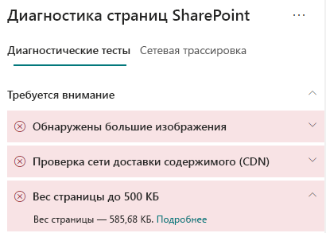

# Оптимизация веса страниц современных сайтов SharePoint OnlineOptimize page weight in SharePoint Online modern site pages

Страницы современного сайта SharePoint Online содержат сериализованный код, необходимый для отображения содержимого страницы, включая изображения, текст, объекты в области содержимого под панелью навигации или панелью команд, а также HTML-код для формирования структуры страницы.SharePoint Online modern site pages contain serialized code that is required to render page content of the page, including images, text, objects in the content area underneath navigation/command bars and other HTML code that forms the framework of the page. Вес страницы определяется этим HTML-кодом и должен быть ограничен, чтобы обеспечить оптимальное время загрузки страницы.Page weight is a measurement of this HTML code, and should be limited to ensure optimal page load times.

Эта статья поможет вам понять, как уменьшить вес страниц современного сайта.This article will help you understand how to reduce page weight in your modern site pages.

>[!NOTE]
>Дополнительные сведения о производительности на современных порталах SharePoint Online см. в статье [Производительность в современном интерфейсе SharePoint](https://docs.microsoft.com/ru-RU/sharepoint/modern-experience-performance).For more information about performance in SharePoint Online modern portals, see [Performance in the modern SharePoint experience](https://docs.microsoft.com/ru-RU/sharepoint/modern-experience-performance).

## Использование средства диагностики страниц SharePoint для анализа веса страницUse the Page Diagnostics for SharePoint tool to analyze page weight

Средство **Диагностика страниц SharePoint** — это браузерное расширение для Chrome и [Microsoft Edge версии 77 или более поздней](https://www.microsoftedgeinsider.com/en-us/download?form=MI13E8&OCID=MI13E8), которое можно использовать для анализа страниц современных и классических сайтов публикации SharePoint.The **Page Diagnostics for SharePoint tool** is a browser extension for Chrome and [Microsoft Edge version 77 or later](https://www.microsoftedgeinsider.com/en-us/download?form=MI13E8&OCID=MI13E8) you can use to analyze SharePoint both modern and classic publishing site pages. Это средство предоставляет отчет о каждой проанализированной странице, показывающий, как страница работает в определенном наборе условий.The tool provides a report for each analyzed page showing how the page performs against a defined set of performance criteria. Чтобы установить и изучить средство диагностики страниц SharePoint, ознакомьтесь со статьей [Использование средства диагностики страниц SharePoint Online](page-diagnostics-for-spo.md).To install and learn about the Page Diagnostics for SharePoint tool, visit [Use the Page Diagnostics tool for SharePoint Online](page-diagnostics-for-spo.md).

При анализе страницы сайта SharePoint с помощью средства диагностики страниц SharePoint вы можете просматривать сведения о странице в результате **Вес страницы до 500 КБ** на панели _Диагностические тесты_.When you analyze a SharePoint site page with the Page Diagnostics for SharePoint tool, you can see information about page in the **Page weight under 500KB** result of the _Diagnostic tests_ pane. Результат появится в зеленом цвете, если вес страницы ниже базового значения, и в красном, если вес страницы превышает базовое значение.The result will appear in green if the page weight is under the baseline value, and red if the page weight exceeds the baseline value.

Возможные результаты:Possible results include:

- **Внимание** (красный): вес страницы превышает 500 КБ**Attention required** (red): Page weight exceeds 500KB
- **Действия не требуются** (зеленый): вес страницы не превышает 500 КБ**No action required** (green): Page weight is under 500KB

Если результат **Вес страницы до 500 КБ** появляется в разделе **Внимание**, щелкните результат, чтобы получить дополнительные сведения.  If the **Page weight under 500KB** result appears in the **Attention required** section, you can click the result for details.

## Исправление проблем с весом страницRemediate page weight issues

Если вес страницы превышает 500 КБ, общее время загрузки можно улучшить, уменьшая количество веб-частей и ограничивая содержимое страницы до соответствующего уровня. If page weight exceeds 500KB, you can improve overall page load time by reducing the number of web parts and limiting page content to an appropriate degree.

Общие инструкции по уменьшению веса страницыGeneral guidance for reducing page weight includes:

- Ограничьте содержимое страницы до приемлемого размера и используйте несколько страниц для связанного контента.Limit the page content to a reasonable amount and use multiple pages for related content.
- Минимизируйте использование веб-частей с крупными контейнерами свойств.Minimize the use of web parts that have large property bags.
- По возможности используйте неинтерактивные представления сведений.Use non-interactive rollup views when possible.
- Оптимизируйте размеры изображений, изменяя их с помощью форматов сжатия и загружая их из CDN.Optimize image sizes by sizing images appropriately, using compressed image formats and ensuring that they are downloaded from a CDN.

Дополнительные инструкции по ограничению веса страницы можно найти в следующей статье:You can find additional guidance for limiting page weight in the following article:

- [Оптимизация производительности страниц в SharePointOptimize page performance in SharePoint](https://docs.microsoft.com/ru-RU/sharepoint/dev/general-development/optimize-page-performance-in-sharepoint)

Перед внесением изменений в страницы для исправления проблем с производительностью запомните время загрузки страницы в результатах анализа.Before you make page revisions to remediate performance issues, make a note of the page load time in the analysis results. Снова запустите средство после изменения, чтобы увидеть, соответствует ли новый результат базовому стандарту, и проверить новое время загрузки на наличие улучшений.Run the tool again after your revision to see if the new result is within the baseline standard, and check the new page load time to see if there was an improvement.

>[!NOTE]
>Время загрузки страницы зависит от множества факторов, например загрузки сети, времени суток и других переменных условий.Page load time can vary based on a variety of factors such as network load, time of day, and other transient conditions. Следует несколько раз проверить время загрузки страницы до и после внесения изменений, чтобы получить средние результаты.You should test page load time a few times before and after making changes to help you average the results.

## Статьи по темеRelated topics

[Настройка производительности SharePoint OnlineTune SharePoint Online performance](tune-sharepoint-online-performance.md)

[Настройка производительности Office 365Tune Office 365 performance](tune-office-365-performance.md)

[Производительность в современном интерфейсе SharePointPerformance in the modern SharePoint experience](https://docs.microsoft.com/ru-RU/sharepoint/modern-experience-performance.md)

[Сети доставки содержимогоContent delivery networks](content-delivery-networks.md)

[Использование сети доставки содержимого Office 365 с SharePoint OnlineUse the Office 365 Content Delivery Network (CDN) with SharePoint Online](use-office-365-cdn-with-spo.md)
