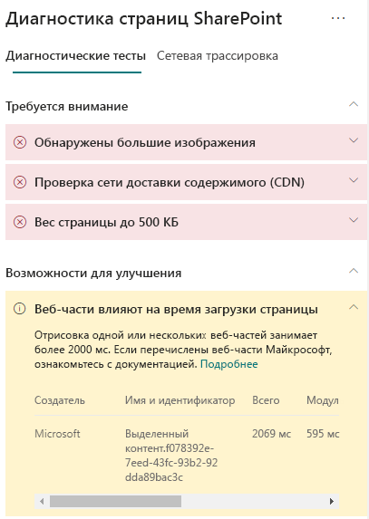
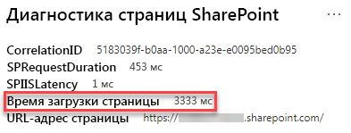

# Оптимизация производительности веб-частей страниц современных сайтов SharePoint OnlineOptimize web part performance in SharePoint Online modern site pages

Страницы современного сайта SharePoint Online содержат веб-части, которые могут влиять на общее время загрузки страниц.SharePoint Online modern site pages contain web parts that can contribute to overall page load times. Из этой статьи вы узнаете, как определять, насколько веб-части на страницах влияют на задержку, распознаваемую конечным пользователем, и как устранять распространенные проблемы.This article will help you understand how to determine how web parts in your pages affect user perceived latency, and how to remediate common issues.

>[!NOTE]
>Дополнительные сведения о производительности на современных порталах SharePoint Online см. в статье [Производительность в современном интерфейсе SharePoint](https://docs.microsoft.com/sharepoint/modern-experience-performance).For more information about performance in SharePoint Online modern portals, see [Performance in the modern SharePoint experience](https://docs.microsoft.com/sharepoint/modern-experience-performance).

## Использование средства диагностики страниц SharePoint для анализа веб-частейUse the Page Diagnostics for SharePoint tool to analyze web parts

Средство **Диагностика страниц SharePoint** — это браузерное расширение для Chrome и [Microsoft Edge версии 77 или более поздней](https://www.microsoftedgeinsider.com/download?form=MI13E8&OCID=MI13E8), которое можно использовать для анализа страниц современных и классических сайтов публикаций SharePoint.The **Page Diagnostics for SharePoint tool** is a browser extension for Chrome and [Microsoft Edge version 77 or later](https://www.microsoftedgeinsider.com/download?form=MI13E8&OCID=MI13E8) you can use to analyze SharePoint both modern and classic publishing site pages. Это средство предоставляет отчет о каждой проанализированной странице, показывающий, как она работает при заданных критериях производительности.The tool provides a report for each analyzed page showing how the page performs against a defined set of performance criteria. Чтобы установить и изучить средство диагностики страниц SharePoint, ознакомьтесь со статьей [Использование средства диагностики страниц SharePoint Online](page-diagnostics-for-spo.md).To install and learn about the Page Diagnostics for SharePoint tool, visit [Use the Page Diagnostics tool for SharePoint Online](page-diagnostics-for-spo.md).

При анализе сайта SharePoint с помощью средства диагностики страниц SharePoint можно просматривать данные о веб-частях, превышающие базовые показатели, которые указаны для результата **Влияние веб-частей на общее время загрузки страниц** на панели _Диагностические тесты_.When you analyze a SharePoint site page with the Page Diagnostics for SharePoint tool, you can see information about web parts that exceed the baseline metric in the **Web parts are impacting page load time** result in the _Diagnostic tests_ pane.

Возможные результаты:Possible results include:

- **Внимание** (красный цвет) — любая _настраиваемая_ веб-часть, требующая более **двух** секунд на загрузку.**Attention required** (red): Any _custom_ web part that takes longer than **two** seconds to load. Общее время загрузки распределяется в результатах теста в зависимости от времени, потраченного на загрузку модулей, отложенную загрузку, инициализацию и отображение.Total load time as displayed in test results is broken down by module load, lazy load, init and render.
- **Возможна оптимизация** (желтый цвет) — требующие проверки и контроля элементы, которые могут влиять на время загрузки страницы.**Improvement opportunities** (yellow): Items that may be impacting page load time are shown in this section and should be reviewed and monitored. Среди них могут быть готовые веб-части Майкрософт.This may include "out of the box" (OOTB) Microsoft web parts. Результаты для всех веб-частей Майкрософт, приведенные в этом разделе, автоматически направляются в корпорацию Майкрософт, поэтому **никакие действия не требуются**.Results for any Microsoft web parts shown in this section are automatically reported to Microsoft, so **no action is required**. Если результаты анализа **всех веб-частей Майкрософт** на странице отображаются в разделе **Возможна оптимизация**, а вы столкнулись с очень низкой производительностью на странице, тогда следует отправить запрос в службу поддержки.You should only log a support ticket for investigation if you are experiencing very slow performance on the page and **all Microsoft web parts** on the page appear in the results in the **Improvement opportunities** section. Обратите внимание, что при последующих обновлениях средство диагностики страниц будет группировать результаты в соответствии с определенными конфигурациями веб-частей Майкрософт.Note that a future Page Diagnostics tool update will further break down the results based on the specific configuration of the Microsoft web part.
- **Действия не требуются** (зеленый цвет) — для возвращения данных все веб-части не занимают больше **двух** секунд времени.**No action required** (green): No web part is taking longer than **two** seconds to return data.

Если в разделе **Возможна оптимизация** или **Внимание** появится результат **Влияние веб-частей на общее время загрузки страниц**, щелкните его, чтобы посмотреть, какие веб-части загружаются медленно.If the **Web parts are impacting page load time** result appears in either the **Attention required** or **Improvement opportunities** section of the results, click the result to see details about which web parts are loading slowly. В последующих обновлениях средства диагностики страниц SharePoint могут быть обновленные правила анализа, поэтому убедитесь, что у вас всегда есть последняя версия средства.Future updates to the Page Diagnostics for SharePoint tool may include updates to analysis rules, so please ensure you always have the latest version of the tool.

Результаты содержат следующие данные:Information available in the results includes:

- **Создано** — сведения о том, является ли веб-часть пользовательской или предустановленной Майкрософт**Made by** shows whether the web part is custom or Microsoft OOTB
- **Имя и идентификатор** — идентификационные данные, необходимые при поиске веб-части на странице**Name and ID** shows identifying information that can help you find the web part on the page
- **Общее время** — общее время загрузки веб-части**Total** shows the total time for the web part to load
- **Загрузка модуля** — время, затраченное на извлечение и загрузку компонентов веб-части**Module Load** shows the time taken to fetch and load the web part components
- **Отложенная загрузка** — показывает время отложенной загрузки веб-частей, не отображаемых в основном разделе страницы**Lazy Load** shows the time for deferred loading of web parts not seen in the main section of the page
- **Инициализация** — время, затраченное на инициализацию веб-части**Init** shows the time taken for web part initialization
- **Отображение** — время, затраченное веб-частью на извлечение и отображение результатов**Render** shows the time taken for the web part to fetch and render results

Эта информация предназначена для того, чтобы помочь проектировщикам и разработчикам устранять проблемы.This information is provided to help designers and developers troubleshoot issues. С ней следует ознакомить команду по проектированию и разработке.This information should be provided to your design and development team.

## Устранение проблем производительности веб-частейRemediate web part performance issues

Чтобы определить и устранить проблемы с производительностью веб-частей, указанных в окне **Влияние веб-частей на общее время загрузки страниц**, используйте инструкции, приведенные в этом разделе.Follow the guidance in this section to identify and remediate performance issues with web parts listed in the **Web parts are impacting page load time** results.

Возможные причины низкой производительности веб-части делятся на три категории.There are three categories of possible causes for poor web part performance. С помощью приведенной ниже информации можно определить, какие проблемы относятся к вашему сценарию, и устранить их.Use the information below to determine which issues apply to your scenario and remediate them.

- Размер скрипта веб-части и зависимостиWeb part script size and dependencies
  - Оптимизируйте исходный сценарий, который отображает основной сценарий _только в режиме просмотра_.Optimize the initial script that renders the mainline scenario for _view mode only_.
  - Переместите редко используемые сценарии и код режима изменения (например, панель свойств) в отдельные блоки с помощью оператора _import()_.Move the less frequent scenarios and edit mode code (like the property pane) to separate chunks using the _import()_ statement.
  - Ознакомьтесь с зависимостями в файле _package.json_, чтобы полностью удалить ненужный код.Review dependencies of the _package.json_ file to remove any dead code completely. Переместите зависимости "только тестирование" или "только сборка" в раздел devDependencies.Move any test/build only dependencies to devDependencies.
  - Для оптимальной статической загрузки ресурсов следует использовать сеть доставки содержимого (CDN) Office 365.Use of the Office 365 CDN is required for optimal static resource download. Открытые источники CDN предпочтительнее использовать для файлов _JS и CSS_.Public CDN origins are preferable for _js/css_ files. Дополнительные сведения о сети Office 365 CDN см. в статье [Использование сети доставки содержимого Office 365 с SharePoint Online](use-office-365-cdn-with-spo.md).For more information about using the Office 365 CDN, see [Use the Office 365 Content Delivery Network (CDN) with SharePoint Online](use-office-365-cdn-with-spo.md).
  - Повторно используйте такие платформы, как _React_ и _Fabric imports_, которые входят в состав SharePoint Framework (SPFx).Reuse frameworks like _React_ and _Fabric imports_ that come as part of the SharePoint Framework (SPFx). Дополнительные сведения см. в статье [Обзор SharePoint Framework](https://docs.microsoft.com/sharepoint/dev/spfx/sharepoint-framework-overview).For more information, see [Overview of the SharePoint Framework](https://docs.microsoft.com/sharepoint/dev/spfx/sharepoint-framework-overview).
  - Убедитесь, что у вас установлена последняя версия SharePoint Framework, и обновляйте до новых версий, когда они станут доступны.Ensure that you are using the latest version of the SharePoint Framework, and upgrade to new versions as they become available.
- Извлечение или кэширование данныхData fetching/caching
  - Если веб-часть использует дополнительные вызовы сервера, чтобы извлечь данные для отображения, убедитесь, что эти серверные API достаточно быстры и (или) выполняют кэширование на стороне клиента (например, с использованием _localStorage_ или _IndexDB_ для более крупных наборов).If the web part relies on extra server calls to fetch data for display, ensure those server APIs are fast and/or implement client side caching (such as using _localStorage_ or _IndexDB_ for larger sets).
  - Если для отображения важных данных требуется несколько вызовов, воспользуйтесь пакетной обработкой на сервере или другими методами объединения запросов в один вызов.If multiple calls are required to render critical data, consider batching on the server or other methods of consolidating requests to a single call.
  - Если определенные данные задействуют медленные серверные API, а отображение может начаться и без них, рекомендуется отделить их в независимый вызов, который будет выполнен после отображения критически важных данных.Alternatively, if some elements of data require a slower API, but are not critical to initial rendering, decouple these to a separate call that is executed after critical data is rendered.
  - Когда одни и те же данные повторяются в разных частях, используйте один уровень данных, чтобы избежать повторения вызовов.If multiple parts use the same data, utilize a common data layer to avoid duplicate calls.
- Время отображенияRendering time
  - Любые мультимедийные источники, такие как изображения и видеоролики, следует уменьшать до размера контейнера, устройства и (или) сети во избежание загрузки ненужных больших активов.Any media sources like images and videos should be sized to the limits of the container, device and/or network to avoid downloading unnecessary large assets. Дополнительные сведения о пакетных зависимостях см. в статье [Использование сети доставки содержимого Office 365 с SharePoint Online](use-office-365-cdn-with-spo.md).For more information about content dependencies, see [Use the Office 365 Content Delivery Network (CDN) with SharePoint Online](use-office-365-cdn-with-spo.md).
  - Избегайте вызовов API, которые приводят к перегруппировке, применению сложных правил CSS или сложной анимации.Avoid API calls that cause re-flow, complex CSS rules or complicated animations. Дополнительные сведения см. в статье [Минимизация перегруппировки браузера](https://developers.google.com/speed/docs/insights/browser-reflow).For more information, see [Minimizing browser reflow](https://developers.google.com/speed/docs/insights/browser-reflow).
  - Избегайте выполнения длительных цепных задач.Avoid use of chained long running tasks. Разбивайте такие задачи на отдельные очереди.Instead, break long running tasks apart into separate queues. Дополнительные сведения см. в статье [Оптимизация выполнения JavaScript](https://developers.google.com/web/fundamentals/performance/rendering/optimize-javascript-execution).For more information, see [Optimize JavaScript Execution](https://developers.google.com/web/fundamentals/performance/rendering/optimize-javascript-execution).
  - Резервируйте соответствующее место для асинхронного отображения визуальных элементов или элементов мультимедиа, чтобы избежать пропуска кадров и перебоев, известных как_подвисания_.Reserve corresponding space for asynchronously rendering media or visual elements to avoid skipped frames and stuttering (also known as _jank_).
  - Если какой-либо из браузеров не поддерживает функцию, используемую для отображения, загрузите полизаполнение или исключите выполнение зависимого кода.If a certain browser doesn't support a feature used in rendering, either load a polyfill or exclude running dependent code. А если эта функция не является критической, удалите ресурсы, например, обработчики событий, чтобы избежать утечки памяти.If the feature is not critical, dispose resources such as event handlers to avoid memory leaks.

Перед изменением в страниц для устранения проблем производительности запомните время загрузки страницы по результатам анализа.Before you make page revisions to remediate performance issues, make a note of the page load time in the analysis results. Снова запустите средство после внесения изменений, чтобы узнать, соответствует ли новый результат базовому стандарту, и проверить, сократилось ли время загрузки.Run the tool again after your revision to see if the new result is within the baseline standard, and check the new page load time to see if there was an improvement.

>[!NOTE]
>Время загрузки страницы зависит от множества факторов, например от загрузки сети, времени суток и других переменных условий.Page load time can vary based on a variety of factors such as network load, time of day, and other transient conditions. Следует несколько раз проверить время загрузки страницы до и после внесения изменений, чтобы получить среднестатистические данные.You should test page load time a few times before and after making changes to help you average the results.

## Статьи по темеRelated topics

[Настройка производительности SharePoint OnlineTune SharePoint Online performance](tune-sharepoint-online-performance.md)

[Настройка производительности Office 365Tune Office 365 performance](tune-office-365-performance.md)

[Производительность в современном интерфейсе SharePointPerformance in the modern SharePoint experience](https://docs.microsoft.com/sharepoint/modern-experience-performance.md)

[Сети доставки содержимогоContent delivery networks](content-delivery-networks.md)

[Использование сети доставки содержимого Office 365 с SharePoint OnlineUse the Office 365 Content Delivery Network (CDN) with SharePoint Online](use-office-365-cdn-with-spo.md)
