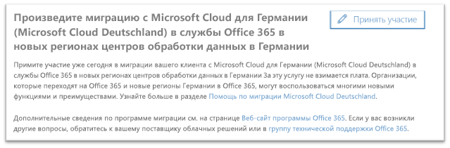
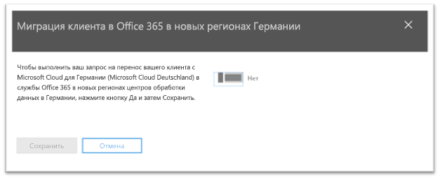
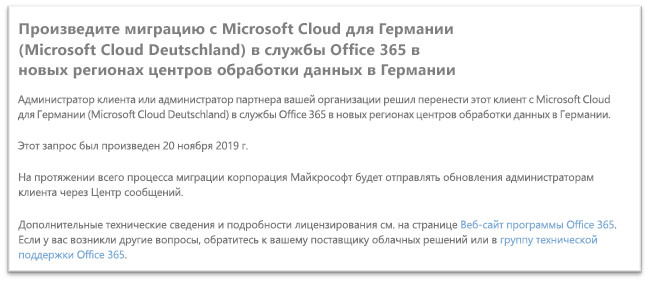

# Как дать согласие на миграцию с Microsoft Cloud для Германии (Microsoft Cloud Deutschland) в службы Office 365 в новых регионах центров обработки данных в ГерманииHow to opt-In for migration from Microsoft Cloud Germany (Microsoft Cloud Deutschland) to Office 365 services in the new German datacenter regions

>[!Note]
>Эта статья относится только к разрешенным клиентам Microsoft Cloud для Германии (Microsoft Cloud Deutschland).This article only applies to eligible Microsoft Cloud Germany/Deutschland customers.
>

## Запрос на миграциюHow to request migration

Разрешенные клиенты, которым предоставлена служба в Microsoft Cloud для Германии, увидят в Центре администрирования Microsoft 365 страницу, которая позволит администратору клиента пользователя согласиться на миграцию.Eligible customers with service provisioned in Microsoft Cloud Germany will see a page in the Microsoft 365 admin center that will allow a customer tenant administrator to opt-in for migration.

Чтобы получить доступ к этой странице в Центре администрирования Microsoft 365, в области навигации слева разверните **Параметры**, а затем выберите **Профиль организации**.To access the page in the Microsoft 365 admin center, in the navigation pane on the left, expand **Settings** and then click **Organization Profile**.

На странице **Профиль организации** прокрутите вниз до раздела **Миграция с Microsoft Cloud для Германии (Microsoft Cloud Deutschland) в службы Office 365 в новых регионах центров обработки данных в Германии**.On the **Organization Profile** page, scroll down to the **Migrate from Microsoft Cloud Germany (Microsoft Cloud Deutschland) to Office 365 services in the new German datacenter regions** section.

Если вашей организации требуется перенести службу с Microsoft Cloud для Германии (Microsoft Cloud Deutschland) в службы Office 365 в новых регионах центров обработки данных в Германии, нажмите кнопку **Согласиться**.If your organization wishes to migrate your service from Microsoft Cloud Germany (Microsoft Cloud Deutschland) to Office 365 services in the new German datacenter regions, click **Opt-in**.
 

Ваше подтверждение будет принято в новом разделе, который появится в правой части экрана.A new section will appear on the right side of your screen to accept your confirmation. Установите переключатель в положение **Да** и нажмите кнопку **Сохранить**.Select the toggle button to **Yes**, and then click **Save**.
 

После того как администратор выразил согласие от имени клиента, все администраторы увидят подтверждение в разделе **Миграция с Microsoft Cloud для Германии (Microsoft Cloud Deutschland) в службы Office 365 в новых регионах центров обработки данных в Германии**, включая дату предоставления согласия.Once an administrator has opted-in on behalf of your tenant then all administrators will see the confirmation in **Migrate from Microsoft Cloud Germany (Microsoft Cloud Deutschland) to Office 365 services in the new German datacenter regions** section, including the date of opt-in. Кроме того, администраторы получат подтверждение в Центре сообщений Центра администрирования Microsoft 365.Administrators will also have a confirmation in Message Center of the Microsoft 365 admin center. 
 

## Что произойдет после предоставления согласия на миграцию?What happens after opting-in for migration?

Ожидается, что для организаций, давших согласие на участие в программе под руководством корпорации Майкрософт, миграция будет выполнена в 2020 г.Migrations are expected to take place in 2020 for organizations that opt-in to the Microsoft-driven approach.  В результате миграции основные данные и подписки клиента будут перемещены в новые регионы в Германии.As a result of the migration, core customer data and subscriptions are moved to the new German regions.  На протяжении всего процесса миграции корпорация Майкрософт будет отправлять обновления через Центр сообщений.Microsoft will send updates throughout the migration process in Message Center.

## Дополнительные сведенияMore information

- Помощь по миграции Microsoft Cloud Deutschland на [https://aka.ms/germanymigrateassist](https://aka.ms/germanymigrateassist)Microsoft Cloud Deutschland Migration Assistance at [https://aka.ms/germanymigrateassist](https://aka.ms/germanymigrateassist)
- Миграция Office 365 на [https://aka.ms/office365germanymove](https://aka.ms/office365germanymove)Office 365 migration at [https://aka.ms/office365germanymove](https://aka.ms/office365germanymove)
- Миграция Dynamics 365 на [https://aka.ms/d365ceoptin](https://aka.ms/d365ceoptin)Dynamics 365 migration at [https://aka.ms/d365ceoptin](https://aka.ms/d365ceoptin)
- Миграция Power BI на [https://aka.ms/pbioptin](https://aka.ms/pbioptin)Power BI migration at [https://aka.ms/pbioptin](https://aka.ms/pbioptin)
- Задайте свои вопросы с помощью опции "Нужна помощь?"Submit questions using the “Need Help?” ссылка [Центра администрирования Microsoft 365](https://portal.office.de/)link of the [Microsoft 365 admin center](https://portal.office.de/)
