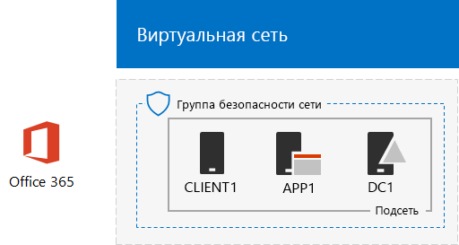

# <a name="office-365-devtest-environment"></a>Среда разработки и тестирования Office 365

 **Сводка.** Используйте это руководство, чтобы создать пробную подписку Office 365 для оценки или разработки и тестирования.
  
Пробную подписку Office 365 можно использовать для создания среды разработки и тестирования для приложений или для демонстрации функций и возможностей Office 365. Существуют две версии:
  
- Упрощенная среда Office 365 для разработки и тестирования состоит из пробной подписки на Office 365, доступ к которой можно получить с основного компьютера.
    
    Используйте эту среду для быстрой демонстрации компонента. Для упрощенной среды разработки и тестирования Office 365 выполните только этапы 2 и 3, описанные в этой статье.
    
- Среда Office 365 для разработки и тестирования смоделированного предприятия включает в себя пробную подписку на Office 365 и подключенную к Интернету упрощенную интрасеть организации, которая размещена в службах инфраструктуры Microsoft Azure. Вы можете полностью создать эту конфигурацию в Microsoft Cloud.
    
    Эту среду можно использовать для демонстрации функции или приложения в среде, напоминающей обычную сеть организации, подключенную к Интернету, или для функций, которым требуется такой тип среды. Для среды Office 365 для разработки и тестирования смоделированного предприятия выполните этапы 1, 2 и 3 настоящей статьи.
    
> [!NOTE]
> Вы можете распечатать эту статью, чтобы записать значения, которые понадобятся вам для этой среды в течение 30 дней пробной подписки на Office 365. Вы легко можете продлить пробную подписку еще на 30 дней. Для постоянной среды тестирования и разработки создайте новую платную подписку с небольшим количеством лицензий. 
  

  
> [!TIP]
> Щелкните [здесь](http://aka.ms/catlgstack), чтобы просмотреть схему всех статей, относящихся к руководствам по лаборатории тестирования в One Microsoft Cloud.
  
## <a name="phase-1-create-the-base-configuration-in-azure"></a>Этап 1. Создание базовой конфигурации в Azure

Следуйте инструкциям в статье [Базовая конфигурация среды разработки и тестирования](base-configuration-dev-test-environment.md).
  
Понадобится подписка на Azure. Для этой конфигурации можно использовать [бесплатную пробную подписку](https://azure.microsoft.com/pricing/free-trial/). Если у вас есть подписка на MSDN или Visual Studio, см. страницу [Ежемесячная сумма денег на счете в Azure для подписчиков Visual Studio](https://azure.microsoft.com/pricing/member-offers/msdn-benefits-details/).
  
Ниже показана итоговая конфигурация.
  


  
Эта конфигурация состоит из виртуальных машин DC1, APP1 и CLIENT1 в подсети, входящей в виртуальную сеть Azure.
  
## <a name="phase-2-create-an-office-365-trial-subscription"></a>Этап 2. Создание пробной подписки на Office 365

Чтобы оформить пробную подписку на Office 365 E5, потребуются вымышленное название компании и новая учетная запись Майкрософт.
  
1. Рекомендуем использовать в качестве названия компании какую-нибудь вариацию имени Contoso (вымышленной компании, используемой в примерах от Майкрософт), но это необязательно. Запишите здесь название своей вымышленной компании: 
    
2. Чтобы зарегистрировать новую учетную запись Майкрософт, перейдите на сайт [https://outlook.com](https://outlook.com) и создайте учетную запись, используя новый адрес электронной почты. Эта учетная запись будет использоваться для регистрации в Office 365.
    
  - Запишите имя и фамилию новой учетной записи здесь: 
    
  - Запишите здесь адрес электронной почты новой учетной записи: @outlook.com
    
### <a name="sign-up-for-an-office-365-e5-trial-subscription"></a>Оформление пробной подписки на Office 365 E5

1. Для создания упрощенной среды разработки и тестирования Office 365 откройте интернет-браузер на компьютере и перейдите на страницу [https://aka.ms/e5trial](https://aka.ms/e5trial). 
    
    Для среды разработки и тестирования Office 365, имитирующей предприятие, подключитесь к виртуальной машине CLIENT1 на портале Azure, используя учетную запись CORP\User1.

    На начальном экране запустите Microsoft Edge и перейдите по адресу [https://aka.ms/e5trial](https://aka.ms/e5trial).
    
2. На странице **приветствия** укажите:
    
  - ваше физическое местонахождение;
    
  - имя и фамилию новой учетной записи Майкрософт;
    
  - новый адрес электронной почты;
    
  - рабочий телефон;
    
  - вымышленное название компании;
    
  - размер организации (250–999 человек).
    
3. Нажмите **Еще одно действие**.
    
4. На странице **создание идентификатора пользователя** введите имя пользователя на основе нового адреса электронной почты, название вымышленной компании после знака @ (удалите все пробелы в названии) и пароль (дважды) для новой учетной записи Office 365. 
    
    Запишите пароль в надежном месте.
    
    Запишите вымышленное название компании (**название организации**) здесь: 
    
5. Нажмите **Создать мою учетную запись**.
    
6. На странице **Докажите. Что. Вы. Не. Робот.** введите номер телефона, поддерживающего текстовые сообщения, а затем нажмите **Отправить мне SMS**.
    
7. Введите код подтверждения из полученного SMS и нажмите **Далее**.
    
8. Запишите здесь URL-адрес страницы входа (выделите и скопируйте): 
    
9. Запишите здесь идентификатор пользователя (выделите и скопируйте): .onmicrosoft.com
    
    Это значение будет называться **именем глобального администратора Office 365**.
    
10. Когда появится надпись **Все готово к работе**, нажмите ее.
    
11. На следующей странице дождитесь завершения настройки Office 365 и появления всех плиток.
    
Появится главная страница портала Office 365, с которой можно получить доступ к службам Office Online и Центру администрирования Microsoft 365.
  
Ниже показана итоговая конфигурация для среды разработки и тестирования Office 365, имитирующей предприятие.
  

  
Конфигурация состоит из следующих компонентов: 
  
- Виртуальные машины DC1, APP1 и CLIENT1 в подсети, входящей в виртуальную сеть Azure.
    
- Пробная подписка на Office 365 E5.
    
## <a name="phase-3-configure-your-office-365-trial-subscription"></a>Этап 3. Настройка пробной подписки на Office 365

На этом этапе настраивается подписка на Office 365 с дополнительными пользователями и им назначаются лицензии Office 365 E5.
  
Следуйте указаниям из статьи [Подключение к Office 365 PowerShell](https://docs.microsoft.com/office365/enterprise/powershell/connect-to-office-365-powershell#connect-with-the-azure-active-directory-powershell-for-graph-module), чтобы подключиться к подписке на Office 365 с модулем PowerShell Azure Active Directory для Graph с:
  
- компьютера (для упрощенной среды разработки и тестирования Office 365);
    
- виртуальной машины CLIENT1 (для среды Office 365 для разработки и тестирования смоделированного предприятия).
    
 В диалоговом окне "Запрос учетных данных Windows PowerShell" введите имя глобального администратора Office 365 (например, jdoe@contosotoycompany.onmicrosoft.com) и пароль.
  
Введите название организации (например, contosotoycompany), двузначный код страны и пароль обычной учетной записи, а затем выполните следующие команды в командной строке PowerShell:

```
$orgName="<organization name>"
$loc="<two-character country code, such as US>"
$commonPW="<common user account password>"
$PasswordProfile=New-Object -TypeName Microsoft.Open.AzureAD.Model.PasswordProfile
$PasswordProfile.Password=$commonPW

$userUPN= "user2@" + $orgName + ".onmicrosoft.com"
New-AzureADUser -DisplayName "User 2" -GivenName User -SurName 2 -UserPrincipalName $userUPN -UsageLocation $loc -AccountEnabled $true -PasswordProfile $PasswordProfile -MailNickName "user2"
$License = New-Object -TypeName Microsoft.Open.AzureAD.Model.AssignedLicense
$License.SkuId = (Get-AzureADSubscribedSku | Where-Object -Property SkuPartNumber -Value "ENTERPRISEPREMIUM" -EQ).SkuID
$LicensesToAssign = New-Object -TypeName Microsoft.Open.AzureAD.Model.AssignedLicenses
$LicensesToAssign.AddLicenses = $License
Set-AzureADUserLicense -ObjectId $userUPN -AssignedLicenses $LicensesToAssign

$userUPN= "user3@" + $orgName + ".onmicrosoft.com"
New-AzureADUser -DisplayName "User 3" -GivenName User -SurName 3 -UserPrincipalName $userUPN -UsageLocation $loc -AccountEnabled $true -PasswordProfile $PasswordProfile -MailNickName "user3"
$License = New-Object -TypeName Microsoft.Open.AzureAD.Model.AssignedLicense
$License.SkuId = (Get-AzureADSubscribedSku | Where-Object -Property SkuPartNumber -Value "ENTERPRISEPREMIUM" -EQ).SkuID
$LicensesToAssign = New-Object -TypeName Microsoft.Open.AzureAD.Model.AssignedLicenses
$LicensesToAssign.AddLicenses = $License
Set-AzureADUserLicense -ObjectId $userUPN -AssignedLicenses $LicensesToAssign

$userUPN= "user4@" + $orgName + ".onmicrosoft.com"
New-AzureADUser -DisplayName "User 4" -GivenName User -SurName 4 -UserPrincipalName $userUPN -UsageLocation $loc -AccountEnabled $true -PasswordProfile $PasswordProfile -MailNickName "user4"
$License = New-Object -TypeName Microsoft.Open.AzureAD.Model.AssignedLicense
$License.SkuId = (Get-AzureADSubscribedSku | Where-Object -Property SkuPartNumber -Value "ENTERPRISEPREMIUM" -EQ).SkuID
$LicensesToAssign = New-Object -TypeName Microsoft.Open.AzureAD.Model.AssignedLicenses
$LicensesToAssign.AddLicenses = $License
Set-AzureADUserLicense -ObjectId $userUPN -AssignedLicenses $LicensesToAssign
```

<!--
> [!TIP]
> Click [here](https://gallery.technet.microsoft.com/PowerShell-commands-for-fe3d7a34) to get a text file that has all the PowerShell commands in this article.
-->

  
## <a name="phase-4-create-three-new-sharepoint-online-team-sites-optional"></a>Этап 4. Создание трех сайтов групп SharePoint Online (необязательно)

На этом этапе выполняется настройка набора сайтов групп SharePoint Online.
  
1. Установите [командную консоль SharePoint Online](https://go.microsoft.com/fwlink/p/?LinkId=255251) (версия x64).
    
2. Нажмите кнопку **Пуск**, введите **sharepoint** и выберите **Командная консоль SharePoint Online**.
    
3. Введите название организации (например, contosotoycompany), а затем выполните следующие команды в командной консоли SharePoint Online, чтобы подключиться к службе SharePoint Online:
```
$orgName="<organization name>"
$spURL="https://" + $orgName + "-admin.sharepoint.com"
Connect-SPOService -Url $spURL
```

4. В диалоговом окне **Командная консоль Microsoft SharePoint Online** введите имя глобального администратора Office 365 (например, jdoe@contosotoycompany.onmicrosoft.com) и пароль, а затем нажмите кнопку **Войти**.
    
5. Чтобы создать три сайта групп (отделов продаж, производства и поддержки), введите имя глобального администратора Office 365, а затем выполните следующие команды в командной консоли SharePoint Online:
    
  ```
  $owner = "<global administrator account name>"
$siteURL = "https://" + $orgName + ".sharepoint.com/sites/sales"
New-SPOSite -Url $siteURL -Owner $owner -StorageQuota 1000 -Title "Sales site collection" -Template "STS#0"
$siteURL = "https://" + $orgName + ".sharepoint.com/sites/production"
New-SPOSite -Url $siteURL -Owner $owner -StorageQuota 1000 -Title "Production site collection" -Template "STS#0"
$siteURL = "https://" + $orgName + ".sharepoint.com/sites/support"
New-SPOSite -Url $siteURL -Owner $owner -StorageQuota 1000 -Title "Support site collection" -Template "STS#0"
  ```

6. Выполните эту команду, чтобы вывести список URL-адресов этих новых сайтов:
    
  ```
  Get-SPOSite | Where URL -like "*/sites/*" | Sort URL | Select URL
  ```

7. Введите в Internet Explorer URL-адрес сайта SharePoint Online для производственного отдела, чтобы просмотреть его.
    
## <a name="record-values-for-future-reference"></a>Запишите значения для дальнейшего использования

Запишите эти значения для использования или развертывания дополнительных руководств в этой тестовой среде:
  
- Имя глобального администратора Office 365: .onmicrosoft.com (с шага 9 этапа 2)
    
    Кроме того, запишите пароль этой учетной записи в надежном месте.
    
- Название организации с пробной подпиской:  (с шага 4 этапа 2)
    
- Чтобы увидеть список учетных записей пользователей User 2, User 3, User 4 и User 5, выполните следующую команду в командной строке модуля Windows Azure Active Directory для Windows PowerShell:
    
  ```
  Get-AzureADUser | Sort UserPrincipalName | Select UserPrincipalName
  ```

    Запишите здесь имена учетных записей:
    
  - Имя учетной записи пользователя User 2: user2@.onmicrosoft.com
    
  - Имя учетной записи пользователя User 3: user3@.onmicrosoft.com
    
  - Имя учетной записи пользователя User 4: user4@.onmicrosoft.com
    
  - Имя учетной записи пользователя User 5: user5@.onmicrosoft.com
    
    Кроме того, запишите в надежном месте пароли этих учетных записей.
    
- (Необязательно) Чтобы увидеть список URL-адресов сайтов групп для отделов продаж, производства и поддержки, выполните следующую команду в командной консоли SharePoint Online:
    
  ```
  Get-SPOSite | Where URL -like "*/sites/*" | Sort URL | Select URL
  ```

  - URL-адрес сайта производственного отдела: https://.sharepoint.com/sites/production
    
  - URL-адрес сайта отдела продаж: https://.sharepoint.com/sites/sales
    
  - URL-адрес сайта отдела поддержки: https://.sharepoint.com/sites/support
    
## <a name="next-steps"></a>Дальнейшие действия

Используйте следующие статьи в среде разработки и тестирования Office 365:
  
- [Синхронизация каталогов для среды разработки и тестирования Office 365](dirsync-for-your-office-365-dev-test-environment.md)
    
- [Многофакторная проверка подлинности для среды разработки и тестирования Office 365](multi-factor-authentication-for-your-office-365-dev-test-environment.md)
    
- [Федеративная идентификация для среды разработки и тестирования Office 365](federated-identity-for-your-office-365-dev-test-environment.md)
    
- [Cloud App Security для среды разработки и тестирования Office 365](cloud-app-security-for-your-office-365-dev-test-environment.md)
    
- [Advanced Threat Protection для среды разработки и тестирования Office 365](advanced-threat-protection-for-your-office-365-dev-test-environment.md)
    
- [Advanced eDiscovery для среды разработки и тестирования Office 365](advanced-ediscovery-for-your-office-365-dev-test-environment.md)
    
- [Защита конфиденциальных файлов в среде разработки и тестирования Office 365](sensitive-file-protection-in-the-office-365-dev-test-environment.md)
    
- [Изолированный сайт группы SharePoint Online в среде разработки и тестирования](isolated-sharepoint-online-team-site-dev-test-environment.md)
    
- [Классификация и маркировка данных в среде разработки и тестирования Office 365](data-classification-and-labeling-in-the-office-365-dev-test-environment.md)
    
Добавьте в среду разработки и тестирования Office 365 дополнительные облачные решения Майкрософт:
  
- [Среда разработки и тестирования Microsoft 365 корпоративный](the-microsoft-365-enterprise-dev-test-environment.md)
    
- [Среда разработки и тестирования для Office 365 и Dynamics 365](office-365-and-dynamics-365-dev-test-environment.md)
    
## <a name="see-also"></a>См. также

- [Руководства по лаборатории тестирования для облачных решений](cloud-adoption-test-lab-guides-tlgs.md)
  
- [Среда разработки и тестирования для Office 365 и Dynamics 365](office-365-and-dynamics-365-dev-test-environment.md)
  
- [Освоение облака и гибридные решения](cloud-adoption-and-hybrid-solutions.md)


