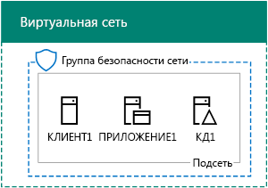
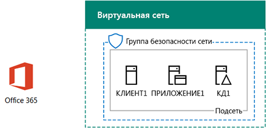

# <a name="office-365-devtest-environment"></a>Среда разработки и тестирования Office 365

 **Сводка:** В этом документе Test Lab Guide используется для создания пробную подписку на Office 365 для оценки или разработку и тестирование.
  
Пробную подписку Office 365 можно использовать для создания среды разработки и тестирования для приложений или для демонстрации функций и возможностей Office 365. Существуют две версии:
  
- Упрощенная среда Office 365 для разработки и тестирования включает в себя пробную подписку Office 365, доступ к которой можно получить с основного компьютера.
    
    Используйте эту среду для быстрой демонстрации компонента. Для упрощенной среды разработки и тестирования Office 365 выполните этапы 2 и 3, описанные в этой статье.
    
- Среда Office 365 для разработки и тестирования смоделированного предприятия включает в себя пробную подписку на Office 365 и подключенную к Интернету упрощенную интрасеть организации, которая размещена в службах инфраструктуры Microsoft Azure. Вы можете полностью создать эту конфигурацию в Microsoft Cloud.
    
    Эту среду можно использовать для демонстрации функции или приложения в среде, напоминающей обычную сеть организации, подключенную к Интернету, или для функций, которым требуется такой тип среды. Для среды Office 365 для разработки и тестирования смоделированного предприятия выполните этапы 1, 2 и 3 настоящей статьи.
    
> [!NOTE]
> Вы можете распечатать эту статью, чтобы записать значения, которые понадобятся вам для этой среды в течение 30 дней пробной подписки на Office 365. Вы легко можете продлить пробную подписку еще на 30 дней. Для постоянной среды тестирования и разработки создайте новую платную подписку с небольшим количеством лицензий. 
  

  
> [!TIP]
> Щелкните [здесь](http://aka.ms/catlgstack), чтобы просмотреть схему всех статей, относящихся к руководствам по лаборатории тестирования Microsoft Cloud.
  
## <a name="phase-1-create-the-base-configuration-in-azure"></a>Этап 1. Создание базовой конфигурации в Azure

Следуйте инструкциям, представленным в [среде разработки и тестирования базовой конфигурации](base-configuration-dev-test-environment.md).
  
Необходимо будет Azure подписки. [Бесплатная пробная версия Azure](https://azure.microsoft.com/pricing/free-trial/) можно использовать для этой конфигурации. Если у вас есть подписка на MSDN или Visual Studio, видеть [кредит ежемесячный Azure для подписчиков Visual Studio](https://azure.microsoft.com/pricing/member-offers/msdn-benefits-details/).
  
Ниже показана итоговая конфигурация.
  

  
Эта конфигурация состоит из виртуальных машин DC1, APP1 и CLIENT1 в подсети, входящей в виртуальную сеть Azure.
  
## <a name="phase-2-create-an-office-365-trial-subscription"></a>Этап 2. Создание пробной подписки на Office 365

Чтобы оформить пробную подписку на Office 365 E5, потребуются вымышленное название компании и новая учетная запись Майкрософт.
  
1. Рекомендуется использовать значение variant, название компании Contoso для название компании, которая вымышленной компании, используемые в Microsoft образцы контента, но она не требуется. Запишите имя вымышленной компании: ___.
    
2. Чтобы зарегистрировать новую учетную запись Майкрософт, перейдите к [https://outlook.com](https://outlook.com) и создание учетной записи с помощью новой учетной записи электронной почты и адрес. Эта учетная запись будет использоваться для подписки на Office 365.
    
  - Запишите имя и фамилию новой учетной записи здесь: ___.
    
  - Запишите здесь адрес электронной почты новой учетной записи: _____________________________@outlook.com
    
### <a name="sign-up-for-an-office-365-e5-trial-subscription"></a>Оформление пробной подписки на Office 365 E5

1. Упрощенный Office 365 dev/тестовой среды, откройте веб-браузер на вашем компьютере и перейдите к [https://aka.ms/e5trial](https://aka.ms/e5trial). 
    
    Для имитации enterprise Office 365 dev/тестовой среды:
    
  - С [Azure портала](https://portal.azure.com), подключиться к CLIENT1 с CORP\\учетной записи User1.
    
  - Откройте командную строку Windows PowerShell с правами администратора и выполните следующие команды:
    
  ```
  Set-ItemProperty -Path "HKLM:\\SOFTWARE\\Microsoft\\Active Setup\\Installed Components\\{A509B1A7-37EF-4b3f-8CFC-4F3A74704073}" -Name "IsInstalled" -Value 0
Set-ItemProperty -Path "HKLM:\\SOFTWARE\\Microsoft\\Active Setup\\Installed Components\\{A509B1A8-37EF-4b3f-8CFC-4F3A74704073}" -Name "IsInstalled" -Value 0
Stop-Process -Name Explorer -Force
  ```

    > [!TIP]
    > Щелкните [здесь](https://gallery.technet.microsoft.com/PowerShell-commands-for-fe3d7a34) для получения текстовый файл, содержащий все команды PowerShell в данной статье.
  
  - На начальном экране выберите пункт **Internet Explorer** и перейдите к [https://aka.ms/e5trial](https://aka.ms/e5trial).
    
2. На странице **приветствия, давайте рассмотрим знать, можно** укажите:
    
  - ваше физическое местонахождение;
    
  - имя и фамилию новой учетной записи Майкрософт;
    
  - новый адрес электронной почты;
    
  - рабочий телефон;
    
  - вымышленное название компании;
    
  - размер организации (250–999 человек).
    
3. Щелкните **только что один этап**.
    
4. На странице **Создание код пользователя** введите имя пользователя, на основании свой новый адрес электронной почты, вымышленной компании после знак @ (удалить все пробелы в имени), а затем пароль (два раза) для этого нового Office 365 учетная запись.
    
    Запишите пароль в надежном месте.
    
    Запишите свое имя вымышленной компании, чтобы рассматриваться, как **Название организации**, здесь: ___.
    
5. Нажмите кнопку **Создать учетную запись**.
    
6. На **Подтверждение. Вы. Не. A. робот.** Введите номер телефона, поддерживающим текст телефона и нажмите кнопку **текст мне**.
    
7. Введите код проверки из текст сообщения и нажмите кнопку **Далее**.
    
8. Запишите страница входа URL-адрес здесь (Выбор и копии): ___.
    
9. Запишите здесь идентификатор пользователя (выделите и скопируйте): __________________________________.onmicrosoft.com
    
    Это значение будет рассматриваться, как **имя глобального администратора Office 365**.
    
10. Когда **вы будете готовы перейти**, щелкните его.
    
11. На следующей странице Подождите, пока Office 365 завершает параметр копирование и доступны только Плитка.
    
Появится главная страница портала Office 365, с которой можно получить доступ к службам Office Online и Центру администрирования Office 365.
  
Ниже показана итоговая конфигурация для среды Office 365 для разработки и тестирования смоделированного предприятия.
  

  
Конфигурация состоит из следующих компонентов:  
  
- Виртуальные машины DC1, APP1 и CLIENT1 в подсети, входящей в виртуальную сеть Azure.
    
- Пробная подписка на Office 365 E5.
    
## <a name="phase-3-configure-your-office-365-trial-subscription"></a>Этап 3. Настройка пробной подписки на Office 365

На этом этапе настраивается подписка на Office 365 с дополнительными пользователями и сайтами групп SharePoint Online.
  
Для начала добавьте четырех новых пользователей и назначьте им лицензии E5.
  
Используйте инструкции из статьи Установка модулей PowerShell и подключиться к новой подписки Office 365 через [подключение к Office 365 PowerShell](https://technet.microsoft.com/library/dn975125.aspx) :
  
- компьютера (для упрощенной среды разработки и тестирования Office 365);
    
- виртуальной машины CLIENT1 (для среды Office 365 для разработки и тестирования смоделированного предприятия).
    
 В диалоговом окне запрос учетных данных Windows PowerShell введите имя глобального администратора Office 365 (пример: jdoe@contosotoycompany.onmicrosoft.com) и пароль.
  
Введите название организации (например, contosotoycompany) и двузначный код страны, а затем выполните следующие команды в командной строке модуля Windows Azure Active Directory для Windows PowerShell:
  
```
$orgName="<organization name>"
$loc="<two-character country code, such as US>"
$licAssignment= $orgName + ":ENTERPRISEPREMIUM"
$userName= "user2@" + $orgName + ".onmicrosoft.com"
New-MsolUser -DisplayName "User 2" -FirstName User -LastName 2 -UserPrincipalName $userName -UsageLocation $loc -LicenseAssignment $licAssignment
```

Отображение команду **New-MsolUser** Обратите внимание, созданный пароль для учетной записи пользователя 2 и запишите его в надежном месте.
  
Выполните следующие команды в командной строке модуля Windows Azure Active Directory для Windows PowerShell:
  
```
$userName= "user3@" + $orgName + ".onmicrosoft.com"
New-MsolUser -DisplayName "User 3" -FirstName User -LastName 3 -UserPrincipalName $userName -UsageLocation $loc -LicenseAssignment $licAssignment
```

Отображение команду **New-MsolUser** Обратите внимание, созданный пароль для учетной записи пользователя 3 и запишите его в надежном месте.
  
Выполните следующие команды в командной строке модуля Windows Azure Active Directory для Windows PowerShell:
  
```
$userName= "user4@" + $orgName + ".onmicrosoft.com"
New-MsolUser -DisplayName "User 4" -FirstName User -LastName 4 -UserPrincipalName $userName -UsageLocation $loc -LicenseAssignment $licAssignment
```

Отображение команду **New-MsolUser** Обратите внимание, созданный пароль для учетной записи пользователя 4 и запишите его в надежном месте.
  
Выполните следующие команды в командной строке модуля Windows Azure Active Directory для Windows PowerShell:
  
```
$userName= "user5@" + $orgName + ".onmicrosoft.com"
New-MsolUser -DisplayName "User 5" -FirstName User -LastName 5 -UserPrincipalName $userName -UsageLocation $loc -LicenseAssignment $licAssignment
```

Отображение команду **New-MsolUser** Обратите внимание, созданный пароль для учетной записи пользователя 5 и запишите его в надежном месте.
  
Затем создайте три сайта групп SharePoint Online для отделов продаж, производства и поддержки.
  
### <a name="create-three-new-sharepoint-online-team-sites"></a>Создание трех сайтов групп SharePoint Online

1. Установка [Консоли SharePoint Online](https://go.microsoft.com/fwlink/p/?LinkId=255251) (x64 версии).
    
2. Нажмите кнопку **Пуск**, введите **sharepoint**и щелкните **Командная консоль SharePoint Online**.
    
3. Введите название организации (например, contosotoycompany), а затем выполните следующие команды в командной консоли SharePoint Online, чтобы подключиться к службе SharePoint Online:
```
$orgName="<organization name>"
$spURL="https://" + $orgName + "-admin.sharepoint.com"
Connect-SPOService -Url $spURL
```

4. В диалоговом окне **Microsoft Командная консоль SharePoint Online** введите имя глобального администратора Office 365 (пример: jdoe@contosotoycompany.onmicrosoft.com) и пароль и нажмите кнопку **Вход**.
    
5. Создание трех новых сайтов группы (продаж, производства и поддержки), заполните поля в поле Имя глобального администратора Office 365 и затем выполните следующие команды в командной строке консоли SharePoint Online:
    
  ```
  $owner = "<global administrator account name>"
$siteURL = "https://" + $orgName + ".sharepoint.com/sites/sales"
New-SPOSite -Url $siteURL -Owner $owner -StorageQuota 1000 -Title "Sales site collection" -Template "STS#0"
$siteURL = "https://" + $orgName + ".sharepoint.com/sites/production"
New-SPOSite -Url $siteURL -Owner $owner -StorageQuota 1000 -Title "Production site collection" -Template "STS#0"
$siteURL = "https://" + $orgName + ".sharepoint.com/sites/support"
New-SPOSite -Url $siteURL -Owner $owner -StorageQuota 1000 -Title "Support site collection" -Template "STS#0"
  ```

6. Выполните эту команду, чтобы вывести список URL-адресов этих новых сайтов:
    
  ```
  Get-SPOSite | Where URL -like "*/sites/*" | Sort URL | Select URL
  ```

7. Введите в Internet Explorer URL-адрес сайта SharePoint Online для производственного отдела, чтобы просмотреть его.
    
## <a name="record-values-for-future-reference"></a>Запишите значения для дальнейшего использования

Запишите эти значения для использования или развертывания дополнительных лабораторий тестирования в этой тестовой среде:
  
- Имя глобального администратора Office 365: ____________________________________.onmicrosoft.com (с шага 9 этапа 2)
    
    Кроме того, запишите пароль этой учетной записи в надежном месте.
    
- Название организации с пробной подпиской: _______________________________________________ (с шага 4 этапа 2)
    
- Чтобы увидеть список учетных записей пользователей User 2, User 3, User 4 и User 5, выполните следующую команду в командной строке модуля Windows Azure Active Directory для Windows PowerShell:
    
  ```
  Get-MSolUser | Sort UserPrincipalName | Select UserPrincipalName
  ```

    Запишите здесь имена учетных записей:
    
  - Имя учетно запись пользователя User 2: user2@_______________________________________________.onmicrosoft.com
    
  - Имя учетно запись пользователя User 3: user3@_______________________________________________.onmicrosoft.com
    
  - Имя учетно запись пользователя User 4: user4@_______________________________________________.onmicrosoft.com
    
  - Имя учетно запись пользователя User 5: user5@_______________________________________________.onmicrosoft.com
    
    Кроме того, запишите в надежном месте пароли этих учетных записей.
    
- Чтобы увидеть список URL-адресов сайтов групп для отделов продаж, производства и поддержки, выполните следующую команду в командной консоли SharePoint Online:
    
  ```
  Get-SPOSite | Where URL -like "*/sites/*" | Sort URL | Select URL
  ```

  - URL-адрес сайта рабочей:https://______________________________________________.sharepoint.com/sites/production
    
  - URL-адрес сайта продаж:https://______________________________________________.sharepoint.com/sites/sales
    
  - Поддержка URL-адрес сайта:https://______________________________________________.sharepoint.com/sites/support
    
## <a name="next-steps"></a>Дальнейшие действия

Дополнительную информацию о среде разработки и тестирования для Office 365 см. в следующих статьях:
  
- [Синхронизация каталогов для Office 365 dev/тестовой среды](dirsync-for-your-office-365-dev-test-environment.md)
    
- [Многофакторная проверка подлинности для среды разработки и тестирования Office 365](multi-factor-authentication-for-your-office-365-dev-test-environment.md)
    
- [Федеративное удостоверение для среды разработки и тестирования Office 365](federated-identity-for-your-office-365-dev-test-environment.md)
    
- [Облако безопасности приложения для Office 365 dev/тестовой среды](cloud-app-security-for-your-office-365-dev-test-environment.md)
    
- [Дополнительные защиту от угроз для вашей среды разработки или тестирования Office 365](advanced-threat-protection-for-your-office-365-dev-test-environment.md)
    
- [Расширенные eDiscovery для вашей среды разработки или тестирования Office 365](advanced-ediscovery-for-your-office-365-dev-test-environment.md)
    
- [Защита конфиденциальных файлов в Office 365 dev/тестовой среде](sensitive-file-protection-in-the-office-365-dev-test-environment.md)
    
- [Изолированный SharePoint Online группы сайта dev/тестовой среды](isolated-sharepoint-online-team-site-dev-test-environment.md)
    
- [Классификации данных и маркировки в Office 365 dev/тестовой среде](data-classification-and-labeling-in-the-office-365-dev-test-environment.md)
    
Добавьте к среде разработки и тестирования для Office 365 дополнительные облачные решения Майкрософт:
  
- [Microsoft 365 Enterprise dev/тестовой среды](the-microsoft-365-enterprise-dev-test-environment.md)
    
- [Среда разработки и тестирования для Office 365 и Dynamics 365](office-365-and-dynamics-365-dev-test-environment.md)
    
## <a name="see-also"></a>См. также

[Руководства по лаборатории тестирования для принятия облачных решений](cloud-adoption-test-lab-guides-tlgs.md)
  
[Среда разработки и тестирования для Office 365 и Dynamics 365](office-365-and-dynamics-365-dev-test-environment.md)
  
[Освоение облака и гибридные решения](cloud-adoption-and-hybrid-solutions.md)


