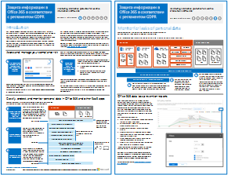

# Защита информации Office 365 для GDPR

 **Сводка:** В этом решении демонстрируется, как для защиты конфиденциальных данных, которые хранятся в службах Office 365.
  
Это решение включает в себя сопровождению рекомендации для обнаружения, классификации, защиты и мониторинга личных данных. В этом решении используются общие нормы защиты данных (GDPR) в качестве примера, но можно применять же процесс для обеспечения соответствия требованиям многих других.

  
[Версия в формате](http://download.microsoft.com/download/E/C/D/ECD5A339-EF10-4420-B3A9-99098884D716/MSFT_Cloud_architecture_information protection for GDPR.pdf)  | [Visio](http://download.microsoft.com/download/E/C/D/ECD5A339-EF10-4420-B3A9-99098884D716/MSFT_Cloud_architecture_information protection for GDPR.vsdx)
  

## See Also

[Решения для обеспечения безопасности](security-solutions.md)
  
[Руководство по безопасности (Майкрософт) для политических кампаний, некоммерческих и других динамических организаций](microsoft-security-guidance-for-political-campaigns-nonprofits-and-other-agile-o.md)

