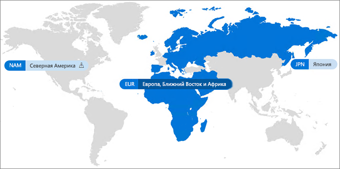

# Office 365 с поддержкой нескольких регионовOffice 365 Multi-Geo

Поддержка нескольких регионов в Office 365 позволяет организации развивать бизнес в нескольких географических регионах или странах, используя существующий клиент Office 365.With Office 365 Multi-Geo, your organization can expand its Office 365 presence to multiple geographic regions and/or countries within your existing tenant. Обратитесь в отдел по работе с клиентами Майкрософт, чтобы зарегистрировать свою международную компанию для работы с несколькими регионами в Office 365.Reach out to your Microsoft Account Team to sign up your Multi-National Company for Office 365 Multi-Geo.
  
Поддержка нескольких регионов в Office 365 позволяет подготавливать и хранить неактивные данные в выбранных вами регионах, а также предоставлять современные возможности для работы всем сотрудникам.With Office 365 Multi-Geo, you can provision and store data at rest in the geo locations that you've chosen to meet data residency requirements, and at the same time unlock your global roll out of modern productivity experiences to your workforce.

#### Видео: знакомство с Office 365 с поддержкой нескольких регионовVideo: Introducing Office 365 Multi-Geo

> [!VIDEO https://www.microsoft.com/en-us/videoplayer/embed/RE1Yk6B?autoplay=false]

В среде с поддержкой нескольких регионов клиент Office 365 состоит из центрального расположения (где изначально подготавливается подписка на Office 365) и одного или нескольких периферийных расположений.In a Multi-Geo environment, your Office 365 tenant consists of a central location (where your Office 365 subscription was originally provisioned) and one or more satellite locations. В клиенте с несколькими регионами информация о регионах, группах и пользователях обрабатывается в Azure Active Directory (AAD).In a multi-geo tenant, the information about geo locations, groups, and user information, is mastered in Azure Active Directory (AAD). Так как информация клиента обрабатывается централизованно и синхронизируется с каждым регионом, общий доступ и возможности в компании носят глобальный характер.Because your tenant information is mastered centrally and synchronized into each geo location, sharing and experiences involving anyone from your company contain global awareness.

Обратите внимание, что функция поддержки нескольких регионов в Office 365 изначально не предназначена для повышения производительности. Она предназначена для соблюдения требований по расположению данных.Note that Office 365 Multi-Geo is not primarily designed for performance optimization, it is designed to meet data residency requirements. Сведения о повышении производительности для Office 365 см. в статье [Планирование сети и настройка производительности для Office 365](https://support.office.com/article/e5f1228c-da3c-4654-bf16-d163daee8848) или обратитесь к группе поддержки.For information about performance optimization for Office 365, see [Network planning and performance tuning for Office 365](https://support.office.com/article/e5f1228c-da3c-4654-bf16-d163daee8848) or contact your support group.

## ТерминологияTerminology

Ниже указаны основные термины, используемые при описании Office 365 с поддержкой нескольких регионов:Here are the key terms used in describing Office 365 Multi-Geo:

- **Центральное расположение** — географическое расположение, в котором изначально подготовлен клиент.**Central location** - the geo location where your tenant was originally provisioned.
- **Администратор геообъекта** — администратор, который может управлять одним или несколькими периферийными расположениями.**Geo administrator** - An administrator who can administer one or more specified satellite locations.
- **Код региона** — код из трех букв для определенного географического расположения.**Geo code** - a three-letter code for a given geo location.
- **Географическое расположение** — регион, который можно использовать в клиенте с поддержкой нескольких регионов для размещения данных, включая почтовые ящики Exchange, а также сайты OneDrive и SharePoint.**Geo location** – A geographic location that can be used in a multi-geo tenant to host data, including Exchange mailboxes and OneDrive and SharePoint sites.
- **Предпочтительное расположение данных (PDL)** — свойство пользователя, устанавливаемое администратором, которое указывает географическое расположение, где следует подготовить почтовый ящик Exchange и хранилище OneDrive пользователей.**Preferred Data Location (PDL)** – A user property set by the administrator that indicates where the geo location where the users Exchange mailbox and OneDrive should be provisioned. PDL также определяет, где подготовлены сайты SharePoint, созданные пользователем.The PDL also determines where SharePoint sites that are created by the user are provisioned.
- **Периферийное расположение** — географическое расположение, где учитывающие регион рабочие нагрузки Office 365 (SharePoint, OneDrive и Exchange) включены в клиенте с поддержкой нескольких регионов.**Satellite location** – The geo locations where the geo-aware Office 365 workloads (SharePoint, OneDrive, and Exchange) are enabled in a multi-geo tenant.
- **Клиент** — представление организации в Office 365, которое имеет, как правило, один или несколько связанных с ним доменов (например, contoso.com).**Tenant** – An organization's representation in Office 365 which typically has one or more domains associated with it (for example, contoso.com).

## Доступность поддержки нескольких регионов в Office 365Office 365 Multi-Geo availability

В настоящее время поддержка нескольких регионов в Office 365 доступна в таких странах и регионах:Office 365 Multi-Geo is currently offered in these regions and countries:

[!INCLUDE [Office 365 Multi-Geo locations](includes/office-365-multi-geo-locations.md)]

## Начало работыGetting started

Чтобы приступить к работе с несколькими регионами, следуйте указанным ниже инструкциям.Follow these steps to get started with multi-geo:

1. Совместно с группой специалистов, занимающихся учетными записями, добавьте план обслуживания _с поддержкой нескольких регионов в Office 365_.Work with your account team to add the _Multi-Geo Capabilities in Office 365_ service plan. Они помогут вам добавить необходимое количество лицензий.They will guide you to add the number of licenses needed. Функция поддержки нескольких регионов доступна клиентам с не менее 500 подписками на Office 365.Multi-Geo feature is available to customers with a minimum of 2,500 Office 365 subscriptions.

   Прежде чем вы сможете начать работу в Office 365 с поддержкой нескольких регионов корпорации Майкрософт потребуется настроить ваш клиент Exchange Online для поддержки нескольких регионов.Before you can start using Office 365 Multi-Geo, Microsoft needs to configure your Exchange Online tenant for multi-geo support. Этот разовый процесс настройки запускается после заказа плана обслуживания с *функциями поддержки нескольких регионов в Office 365* и появления лицензий в вашем клиенте.This one-time configuration process is triggered after you order the *Multi-Geo Capabilities in Office 365* service plan and the licenses show up in your tenant. Вы получите уведомления в [Центре сообщений Office 365](https://support.office.com/article/38FB3333-BFCC-4340-A37B-DEDA509C2093) после присвоения лицензий с поддержкой нескольких регионов и затем сможете начать настройку и использование функций поддержки нескольких регионов в Office 365.You'll receive notifications in the [Office 365 message center](https://support.office.com/article/38FB3333-BFCC-4340-A37B-DEDA509C2093) once your Multi-Geo licenses are applied and you then may begin configuring and using your Office 365 Multi-Geo capabilities.

2. См. статью [Планирование среды с поддержкой нескольких регионов](plan-for-multi-geo.md).Read [Plan your multi-geo environment](plan-for-multi-geo.md).

3. Узнайте об [администрировании среды с поддержкой нескольких регионов](administering-a-multi-geo-environment.md) и о том, [как пользователи взаимодействуют со средой](multi-geo-user-experience.md).Learn about [administering a multi-geo environment](administering-a-multi-geo-environment.md) and [how your users will experience the environment](multi-geo-user-experience.md).

4. Когда вы будете готовы настроить Office 365 с поддержкой нескольких регионов, [настройте свой клиент для поддержки нескольких регионов](multi-geo-tenant-configuration.md).When you are ready to set up Office 365 Multi-Geo, [configure your tenant for multi-geo](multi-geo-tenant-configuration.md).

5. [Настройка поиска](configure-search-for-multi-geo.md).[Set up search](configure-search-for-multi-geo.md).

## См. такжеSee also

[Поддержка нескольких регионов в Exchange Online и OneDriveMulti-Geo in Exchange Online and OneDrive](https://Aka.ms/GoMultiGeo)

[Поддержка нескольких регионов в OneDrive и SharePoint OnlineMulti-Geo Capabilities in OneDrive and SharePoint Online](https://docs.microsoft.com/office365/enterprise/multi-geo-capabilities-in-onedrive-and-sharepoint-online-in-office-365)

[Поддержка нескольких регионов в Exchange OnlineMulti-Geo Capabilities in Exchange Online](https://docs.microsoft.com/office365/enterprise/multi-geo-capabilities-in-exchange-online)
