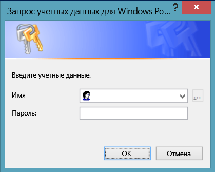
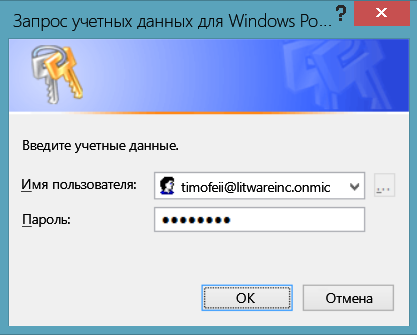
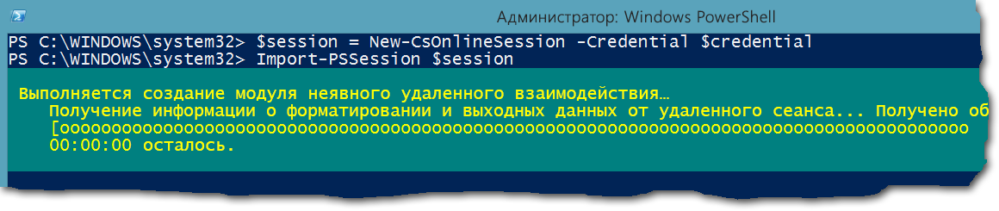

# <a name="connect-to-all-office-365-services-in-a-single-windows-powershell-window"></a><span data-ttu-id="e35fe-103">Подключение ко всем службам Office 365 с помощью единого окна Windows PowerShell</span><span class="sxs-lookup"><span data-stu-id="e35fe-103">Connect to all Office 365 services in a single Windows PowerShell window</span></span>

 <span data-ttu-id="e35fe-104">**Summary:** Instead of managing different Office 365 services in separate PowerShell console windows, you can connect to all Office 365 services and manage them from single console window.</span><span class="sxs-lookup"><span data-stu-id="e35fe-104">**Summary:** Instead of managing different Office 365 services in separate PowerShell console windows, you can connect to all Office 365 services and manage them from single console window.</span></span>
  
<span data-ttu-id="e35fe-p101">When you use PowerShell to manage Office 365, it is possible to have up to five different Windows PowerShell sessions open at the same time corresponding to Office 365 admin center, SharePoint Online, Exchange Online, Skype for Business Online, and the Security &amp; Compliance Center. With five different connection methods in separate Windows PowerShell sessions, your desktop could look like this:</span><span class="sxs-lookup"><span data-stu-id="e35fe-p101">When you use PowerShell to manage Office 365, it is possible to have up to five different Windows PowerShell sessions open at the same time corresponding to Office 365 admin center, SharePoint Online, Exchange Online, Skype for Business Online, and the Security &amp; Compliance Center. With five different connection methods in separate Windows PowerShell sessions, your desktop could look like this:</span></span>
  

  
<span data-ttu-id="e35fe-p102">This is not optimal for managing Office 365 because you can't exchange data among those five windows for cross-service management. This topic describes how to use a single instance of Windows PowerShell from which you can manage Office 365, Skype for Business Online, Exchange Online, SharePoint Online, and the Security &amp; Compliance Center.</span><span class="sxs-lookup"><span data-stu-id="e35fe-p102">This is not optimal for managing Office 365 because you can't exchange data among those five windows for cross-service management. This topic describes how to use a single instance of Windows PowerShell from which you can manage Office 365, Skype for Business Online, Exchange Online, SharePoint Online, and the Security &amp; Compliance Center.</span></span>
  
## <a name="before-you-begin"></a><span data-ttu-id="e35fe-110">Перед началом работы</span><span class="sxs-lookup"><span data-stu-id="e35fe-110">Before you begin</span></span>
<span data-ttu-id="e35fe-111"><a name="BeforeYouBegin"> </a></span><span class="sxs-lookup"><span data-stu-id="e35fe-111"></span></span>

<span data-ttu-id="e35fe-112">Before you can manage all of Office 365 from a single instance of Windows PowerShell, consider the following prerequisites:</span><span class="sxs-lookup"><span data-stu-id="e35fe-112">Before you can manage all of Office 365 from a single instance of Windows PowerShell, consider the following prerequisites:</span></span>
  
- <span data-ttu-id="e35fe-p103">The Office 365 work or school account that you use for these procedures needs to be a member of an Office 365 admin role. For more information, see [About Office 365 admin roles](https://go.microsoft.com/fwlink/p/?LinkId=532367). This a requirement for Office 365 PowerShell, not necessarily for all other Office 365 services.</span><span class="sxs-lookup"><span data-stu-id="e35fe-p103">The Office 365 work or school account that you use for these procedures needs to be a member of an Office 365 admin role. For more information, see [About Office 365 admin roles](https://go.microsoft.com/fwlink/p/?LinkId=532367). This a requirement for Office 365 PowerShell, not necessarily for all other Office 365 services.</span></span>
    
- <span data-ttu-id="e35fe-116">Ниже приведены 64-разрядные версии Windows, которые можно использовать.</span><span class="sxs-lookup"><span data-stu-id="e35fe-116">You can use the following 64-bit versions of Windows:</span></span>
    
  - <span data-ttu-id="e35fe-117">Windows 10</span><span class="sxs-lookup"><span data-stu-id="e35fe-117">Windows 10</span></span>
    
  - <span data-ttu-id="e35fe-118">Windows 8.1 или Windows 8</span><span class="sxs-lookup"><span data-stu-id="e35fe-118">Windows 8.1 or Windows 8</span></span>
    
  - <span data-ttu-id="e35fe-119">Windows Server 2016</span><span class="sxs-lookup"><span data-stu-id="e35fe-119">Windows Server 2016</span></span>
    
  - <span data-ttu-id="e35fe-120">Windows Server 2012 R2 или Windows Server 2012</span><span class="sxs-lookup"><span data-stu-id="e35fe-120">Windows Server 2012 R2 or Windows Server 2012</span></span>
    
  - <span data-ttu-id="e35fe-121">Windows 7 с пакетом обновления 1 (SP1)*</span><span class="sxs-lookup"><span data-stu-id="e35fe-121">Windows 7 Service Pack 1 (SP1)*</span></span>
    
  - <span data-ttu-id="e35fe-122">Windows Server 2008 R2 с пакетом обновления 1 (SP1)*</span><span class="sxs-lookup"><span data-stu-id="e35fe-122">Windows Server 2008 R2 SP1*</span></span>
    
    * <span data-ttu-id="e35fe-p104">You need to install the Microsoft .NET Framework 4.5. _x_ and then either the Windows Management Framework 3.0 or the Windows Management Framework 4.0. For more information, see [Installing the .NET Framework](https://go.microsoft.com/fwlink/p/?LinkId=257868) and [Windows Management Framework 3.0](https://go.microsoft.com/fwlink/p/?LinkId=272757) or [Windows Management Framework 4.0](https://go.microsoft.com/fwlink/p/?LinkId=391344).</span><span class="sxs-lookup"><span data-stu-id="e35fe-p104">You need to install the Microsoft .NET Framework 4.5. _x_ and then either the Windows Management Framework 3.0 or the Windows Management Framework 4.0. For more information, see [Installing the .NET Framework](https://go.microsoft.com/fwlink/p/?LinkId=257868) and [Windows Management Framework 3.0](https://go.microsoft.com/fwlink/p/?LinkId=272757) or [Windows Management Framework 4.0](https://go.microsoft.com/fwlink/p/?LinkId=391344).</span></span>
    
    <span data-ttu-id="e35fe-126">You need to use a 64-bit version of Windows because of the requirements for the Skype for Business Online module and one of the Office 365 modules.</span><span class="sxs-lookup"><span data-stu-id="e35fe-126">You need to use a 64-bit version of Windows because of the requirements for the Skype for Business Online module and one of the Office 365 modules.</span></span>
    
- <span data-ttu-id="e35fe-127">You need to install the modules that are required for Office 365, SharePoint Online, and Skype for Business Online:</span><span class="sxs-lookup"><span data-stu-id="e35fe-127">You need to install the modules that are required for Office 365, SharePoint Online, and Skype for Business Online:</span></span>
    
  - [<span data-ttu-id="e35fe-128">Microsoft Online Service Sign-in Assistant for IT Professionals RTW</span><span class="sxs-lookup"><span data-stu-id="e35fe-128">Microsoft Online Service Sign-in Assistant for IT Professionals RTW</span></span>](https://go.microsoft.com/fwlink/p/?LinkId=286152)
    
  - [<span data-ttu-id="e35fe-129">Windows Azure Active Directory Module for Windows PowerShell (64-bit version)</span><span class="sxs-lookup"><span data-stu-id="e35fe-129">Windows Azure Active Directory Module for Windows PowerShell (64-bit version)</span></span>](https://go.microsoft.com/fwlink/p/?linkid=236297)
    
  - [<span data-ttu-id="e35fe-130">SharePoint Online Management Shell</span><span class="sxs-lookup"><span data-stu-id="e35fe-130">SharePoint Online Management Shell</span></span>](https://go.microsoft.com/fwlink/p/?LinkId=255251)
    
  - [<span data-ttu-id="e35fe-131">Skype for Business Online, Windows PowerShell Module</span><span class="sxs-lookup"><span data-stu-id="e35fe-131">Skype for Business Online, Windows PowerShell Module</span></span>](https://go.microsoft.com/fwlink/p/?LinkId=532439)
    
-  <span data-ttu-id="e35fe-p105">Windows PowerShell needs to be configured to run signed scripts for Skype for Business Online, Exchange Online, and the Security &amp; Compliance Center. To do this, run the following command in an elevated Windows PowerShell session (a Windows PowerShell window you open by selecting **Run as administrator**).</span><span class="sxs-lookup"><span data-stu-id="e35fe-p105">Windows PowerShell needs to be configured to run signed scripts for Skype for Business Online, Exchange Online, and the Security &amp; Compliance Center. To do this, run the following command in an elevated Windows PowerShell session (a Windows PowerShell window you open by selecting **Run as administrator**).</span></span>
    
  ```
  Set-ExecutionPolicy RemoteSigned
  ```

## <a name="the-short-version-instructions-without-explanations"></a><span data-ttu-id="e35fe-134">Краткая версия (инструкции без пояснений)</span><span class="sxs-lookup"><span data-stu-id="e35fe-134">The short version (instructions without explanations)</span></span>
<span data-ttu-id="e35fe-135"><a name="ShortVersion"> </a></span><span class="sxs-lookup"><span data-stu-id="e35fe-135"></span></span>

<span data-ttu-id="e35fe-p106">В этом разделе описываются шаги подключения без подробных пояснений. Если у вас возникнут вопросы или вам потребуются дополнительные сведения, можно обратиться к остальным разделам статьи. Указанные здесь номера шагов соответствуют шагам в остальных разделах данной статьи.</span><span class="sxs-lookup"><span data-stu-id="e35fe-p106">This section presents the connection steps without in-depth explanations. If you have questions or want more information, you can read rest of the topic. The step numbers here match the step-numbered sections in the rest of the topic:</span></span>
  
1. <span data-ttu-id="e35fe-139">Open Windows PowerShell as an administrator (use **Run as administrator**).</span><span class="sxs-lookup"><span data-stu-id="e35fe-139">Open Windows PowerShell as an administrator (use **Run as administrator**).</span></span>
    
2. <span data-ttu-id="e35fe-140">Run this command, and enter your Office 365 work or school account credentials.</span><span class="sxs-lookup"><span data-stu-id="e35fe-140">Run this command, and enter your Office 365 work or school account credentials.</span></span>
    
  ```
  $credential = Get-Credential
  ```

3. <span data-ttu-id="e35fe-141">Run these commands to connect to Office 365.</span><span class="sxs-lookup"><span data-stu-id="e35fe-141">Run these commands to connect to Office 365.</span></span>
    
  ```
  Import-Module MsOnline
  Connect-MsolService -Credential $credential
  ```

4. <span data-ttu-id="e35fe-p107">Run these commands to connect to SharePoint Online. Replace  _\<domainhost>_ with the actual value for your domain. For example, for `litwareinc.onmicrosoft.com`, the  _\<domainhost>_ value is `litwareinc`.</span><span class="sxs-lookup"><span data-stu-id="e35fe-p107">Run these commands to connect to SharePoint Online. Replace  _\<domainhost>_ with the actual value for your domain. For example, for `litwareinc.onmicrosoft.com`, the  _\<domainhost>_ value is `litwareinc`.</span></span>
    
  ```
  Import-Module Microsoft.Online.SharePoint.PowerShell -DisableNameChecking
  Connect-SPOService -Url https://<domainhost>-admin.sharepoint.com -credential $credential
  ```

5. <span data-ttu-id="e35fe-p108">Run these commands to connect to Skype for Business Online. A warning about increasing the `WSMan NetworkDelayms` value is expected the first time you connect and should be ignored.</span><span class="sxs-lookup"><span data-stu-id="e35fe-p108">Run these commands to connect to Skype for Business Online. A warning about increasing the `WSMan NetworkDelayms` value is expected the first time you connect and should be ignored.</span></span>
    
  ```
  Import-Module SkypeOnlineConnector
  $sfboSession = New-CsOnlineSession -Credential $credential
  Import-PSSession $sfboSession
  ```

6. <span data-ttu-id="e35fe-147">Run these commands to connect to Exchange Online.</span><span class="sxs-lookup"><span data-stu-id="e35fe-147">Run these commands to connect to Exchange Online.</span></span>
    
  ```
  $exchangeSession = New-PSSession -ConfigurationName Microsoft.Exchange -ConnectionUri "https://outlook.office365.com/powershell-liveid/" -Credential $credential -Authentication "Basic" -AllowRedirection
  Import-PSSession $exchangeSession -DisableNameChecking
  ```

7. <span data-ttu-id="e35fe-148">Run these commands to connect to the Security &amp; Compliance Center.</span><span class="sxs-lookup"><span data-stu-id="e35fe-148">Run these commands to connect to the Security &amp; Compliance Center.</span></span>
    
  ```
  $ccSession = New-PSSession -ConfigurationName Microsoft.Exchange -ConnectionUri https://ps.compliance.protection.outlook.com/powershell-liveid/ -Credential $credential -Authentication Basic -AllowRedirection
  Import-PSSession $ccSession -Prefix cc
  ```
> [!NOTE]
> <span data-ttu-id="e35fe-p109">The text prefix "cc" is added to  *all*  Security &amp; Compliance Center cmdlet names so you can run cmdlets that exist in both Exchange Online and the Security &amp; Compliance Center in the same Windows PowerShell session. For example, **Get-RoleGroup** becomes **Get-ccRoleGroup** in the Security &amp; Compliance Center.</span><span class="sxs-lookup"><span data-stu-id="e35fe-p109">The text prefix "cc" is added to  *all*  Security &amp; Compliance Center cmdlet names so you can run cmdlets that exist in both Exchange Online and the Security &amp; Compliance Center in the same Windows PowerShell session. For example, **Get-RoleGroup** becomes **Get-ccRoleGroup** in the Security &amp; Compliance Center.</span></span>
  
<span data-ttu-id="e35fe-p110">Here are all the commands in a single block. Specify the name of your domain host, and then run them all at one time.</span><span class="sxs-lookup"><span data-stu-id="e35fe-p110">Here are all the commands in a single block. Specify the name of your domain host, and then run them all at one time.</span></span>
  
```
$domainHost="<domain host name, such as litware for litwareinc.onmicrosoft.com>"
$credential = Get-Credential
Import-Module MsOnline
Connect-MsolService -Credential $credential
Import-Module Microsoft.Online.SharePoint.PowerShell -DisableNameChecking
Connect-SPOService -Url https://$domainHost-admin.sharepoint.com -credential $credential
Import-Module SkypeOnlineConnector
$sfboSession = New-CsOnlineSession -Credential $credential
Import-PSSession $sfboSession
$exchangeSession = New-PSSession -ConfigurationName Microsoft.Exchange -ConnectionUri "https://outlook.office365.com/powershell-liveid/" -Credential $credential -Authentication "Basic" -AllowRedirection
Import-PSSession $exchangeSession -DisableNameChecking
$ccSession = New-PSSession -ConfigurationName Microsoft.Exchange -ConnectionUri https://ps.compliance.protection.outlook.com/powershell-liveid/ -Credential $credential -Authentication Basic -AllowRedirection
Import-PSSession $ccSession -Prefix cc
```

<span data-ttu-id="e35fe-153">When you are ready to close down the Windows PowerShell window, run this command to remove the active sessions to Skype for Business Online, Exchange Online, SharePoint Online, and the Security &amp; Compliance Center:</span><span class="sxs-lookup"><span data-stu-id="e35fe-153">When you are ready to close down the Windows PowerShell window, run this command to remove the active sessions to Skype for Business Online, Exchange Online, SharePoint Online, and the Security &amp; Compliance Center:</span></span>
  
```
Remove-PSSession $sfboSession ; Remove-PSSession $exchangeSession ; Remove-PSSession $ccSession ; Disconnect-SPOService
```

## <a name="the-long-version-instructions-with-detailed-explanations"></a><span data-ttu-id="e35fe-154">Подробная версия (инструкции с подробными пояснениями)</span><span class="sxs-lookup"><span data-stu-id="e35fe-154">The long version (instructions with detailed explanations)</span></span>
<span data-ttu-id="e35fe-155"><a name="LongVersion"> </a></span><span class="sxs-lookup"><span data-stu-id="e35fe-155"></span></span>

### <a name="step-1-open-windows-powershell-as-an-administrator"></a><span data-ttu-id="e35fe-156">Шаг 1. Запуск Windows PowerShell от имени администратора</span><span class="sxs-lookup"><span data-stu-id="e35fe-156">Step 1: Open Windows PowerShell as an administrator</span></span>
<span data-ttu-id="e35fe-157"><a name="Step1"> </a></span><span class="sxs-lookup"><span data-stu-id="e35fe-157"></span></span>

<span data-ttu-id="e35fe-158">If you're running Windows 10, Windows 8, Windows 8.1, Windows Server 2016, Windows Server 2012 R2, or Windows Server 2012 R2, do this:</span><span class="sxs-lookup"><span data-stu-id="e35fe-158">If you're running Windows 10, Windows 8, Windows 8.1, Windows Server 2016, Windows Server 2012 R2, or Windows Server 2012 R2, do this:</span></span>
  
1. <span data-ttu-id="e35fe-159">Use any of these methods to find the shortcut for **Windows PowerShell**:</span><span class="sxs-lookup"><span data-stu-id="e35fe-159">Use any of these methods to find the shortcut for **Windows PowerShell**:</span></span>
    
  - <span data-ttu-id="e35fe-160">On the Start screen, click an empty area, and type Windows PowerShell.</span><span class="sxs-lookup"><span data-stu-id="e35fe-160">On the Start screen, click an empty area, and type Windows PowerShell.</span></span>
    
  - <span data-ttu-id="e35fe-p111">On the desktop or the Start screen, press the Windows key+Q. In the Search charm, type Windows PowerShell.</span><span class="sxs-lookup"><span data-stu-id="e35fe-p111">On the desktop or the Start screen, press the Windows key+Q. In the Search charm, type Windows PowerShell.</span></span>
    
  - <span data-ttu-id="e35fe-p112">On the desktop or the Start screen, move your cursor to the upper-right corner, or swipe left from the right edge of the screen to show the charms. Select the Search charm, and enter Windows PowerShell.</span><span class="sxs-lookup"><span data-stu-id="e35fe-p112">On the desktop or the Start screen, move your cursor to the upper-right corner, or swipe left from the right edge of the screen to show the charms. Select the Search charm, and enter Windows PowerShell.</span></span>
    
2. <span data-ttu-id="e35fe-165">In the results, right-click **Windows PowerShell**, and select **Run as administrator**.</span><span class="sxs-lookup"><span data-stu-id="e35fe-165">In the results, right-click **Windows PowerShell**, and select **Run as administrator**.</span></span>
    
3. <span data-ttu-id="e35fe-166">If the **User Account Control** dialog box appears, select **Yes** to verify that you want to run Windows PowerShell under administrator credentials.</span><span class="sxs-lookup"><span data-stu-id="e35fe-166">If the **User Account Control** dialog box appears, select **Yes** to verify that you want to run Windows PowerShell under administrator credentials.</span></span>
    
<span data-ttu-id="e35fe-167">If you're running Windows 7 SP1 (or Windows Server 2008 R2 SP1), do this:</span><span class="sxs-lookup"><span data-stu-id="e35fe-167">If you're running Windows 7 SP1 (or Windows Server 2008 R2 SP1), do this:</span></span>
  
1. <span data-ttu-id="e35fe-p113">On the **Start** menu, select **All Programs** > **Accessories** > **Windows PowerShell**. Right-click **Windows PowerShell**, and then select **Run as administrator**.</span><span class="sxs-lookup"><span data-stu-id="e35fe-p113">On the **Start** menu, select **All Programs** > **Accessories** > **Windows PowerShell**. Right-click **Windows PowerShell**, and then select **Run as administrator**.</span></span>
    
2. <span data-ttu-id="e35fe-170">If the **User Account Control** dialog box appears, select **Yes** to verify that you want to run Windows PowerShell under administrator credentials.</span><span class="sxs-lookup"><span data-stu-id="e35fe-170">If the **User Account Control** dialog box appears, select **Yes** to verify that you want to run Windows PowerShell under administrator credentials.</span></span>
    
<span data-ttu-id="e35fe-p114">You must run Windows PowerShell as an administrator. If you don't, you're going to get an error message similar to this when you try to import one of the required modules.</span><span class="sxs-lookup"><span data-stu-id="e35fe-p114">You must run Windows PowerShell as an administrator. If you don't, you're going to get an error message similar to this when you try to import one of the required modules.</span></span>
  
```
The specified module 'Microsoft.Online.SharePoint.Online.PowerShell' was not loaded because no valid module file was found in any directory.
```

<span data-ttu-id="e35fe-p115">The only way to remedy the situation is to close Windows PowerShell and restart it as an administrator. Here's a quick and easy way to tell if you're running Windows PowerShell as an administrator: the prompt is  `PS C:\Windows\System32>`, not  `PS C:\Users\YourUserName>`.</span><span class="sxs-lookup"><span data-stu-id="e35fe-p115">The only way to remedy the situation is to close Windows PowerShell and restart it as an administrator. Here's a quick and easy way to tell if you're running Windows PowerShell as an administrator: the prompt is  `PS C:\Windows\System32>`, not  `PS C:\Users\YourUserName>`.</span></span>

  
### <a name="step-2-create-a-windows-powershell-credentials-object"></a><span data-ttu-id="e35fe-175">Этап 2. Создание объекта учетных данных Windows PowerShell</span><span class="sxs-lookup"><span data-stu-id="e35fe-175">Step 2: Create a Windows PowerShell credentials object</span></span>
<span data-ttu-id="e35fe-176"><a name="Step2"> </a></span><span class="sxs-lookup"><span data-stu-id="e35fe-176"></span></span>

<span data-ttu-id="e35fe-p116">The credentials object provides an encrypted way to pass your user name and password to Windows PowerShell. To create a credentials object, run the following command in Windows PowerShell.</span><span class="sxs-lookup"><span data-stu-id="e35fe-p116">The credentials object provides an encrypted way to pass your user name and password to Windows PowerShell. To create a credentials object, run the following command in Windows PowerShell.</span></span>
  
```
$credential = Get-Credential
```

> [!NOTE]
>  <span data-ttu-id="e35fe-p117">`$credential` is a variable that will store the credentials object. You don't have to name the variable `$credential`, but doing so makes it easier to remember which variable contains the credentials object. (And that's important, because we'll reuse this variable several times.) That will also make it easier for you to follow our examples, because this article will always use  `$credential` to represent the credentials object.</span><span class="sxs-lookup"><span data-stu-id="e35fe-p117">`$credential` is a variable that will store the credentials object. You don't have to name the variable `$credential`, but doing so makes it easier to remember which variable contains the credentials object. (And that's important, because we'll reuse this variable several times.) That will also make it easier for you to follow our examples, because this article will always use  `$credential` to represent the credentials object.</span></span>
  
<span data-ttu-id="e35fe-182">Windows PowerShell will then display a dialog box that looks like this.</span><span class="sxs-lookup"><span data-stu-id="e35fe-182">Windows PowerShell will then display a dialog box that looks like this.</span></span>
  

  
<span data-ttu-id="e35fe-184">Type your work or school account user name in the **User name** box, using the format _username@domainname_ (for example, kenmyer@litwareinc.onmicrosoft.com); type your password in the **Password** box; and then click **OK**:</span><span class="sxs-lookup"><span data-stu-id="e35fe-184">Type your work or school account user name in the **User name** box, using the format _username@domainname_ (for example, kenmyer@litwareinc.onmicrosoft.com); type your password in the **Password** box; and then click **OK**:</span></span>
  

  
<span data-ttu-id="e35fe-p118">Обратите внимание на то, что, как часто в случае, вы не увидите запрос на подтверждение, что был создан объект учетных данных. (Windows PowerShell обычно о том, когда вещей ошибок, но не всегда сообщает, когда вещей перейдите вправо.) Если вы хотите убедиться, что был создан объект учетные данные, введите следующую команду в Windows PowerShell и нажмите клавишу ВВОД.</span><span class="sxs-lookup"><span data-stu-id="e35fe-p118">Note that, as is often the case, you won't see any sort of confirmation that the credentials object was created. (Windows PowerShell typically tells you when things go wrong but doesn't always tell you when things go right.) If you want to verify that the credentials object was created, type the following in Windows PowerShell and then press Enter.</span></span>
  
```
$credential
```

<span data-ttu-id="e35fe-188">На экране должно отобразиться что-то вроде этого:</span><span class="sxs-lookup"><span data-stu-id="e35fe-188">You should then see something similar to this on the screen.</span></span>
  
```
UserName                               Password
--------                               --------
kenmyer@litwareinc.onmicrosoft.com     System.Security.SecureString
```

<span data-ttu-id="e35fe-p119">— Это следует помнить, что командлет [Get-Credential](https://go.microsoft.com/fwlink/p/?LinkId=389618) только создает объект учетных данных; не выполнить проверку подлинности, и в противном случае проверьте правильность имени пользователя и пароль. Например предположим, что вы ввели имя пользователя, kenmyer@litwareinc.onmicrosoft.com. Если вы сделаете это, **Get-Credential** будет создан объект учетные данные, используя это имя пользователя и без проверки на предмет, — это фактически допустимое имя пользователя. Не будут знать ли объект действительно допустимые учетные данные были созданы до фактически использовать этот объект подключения к службам Office 365.</span><span class="sxs-lookup"><span data-stu-id="e35fe-p119">One thing to keep in mind here is that the [Get-Credential](https://go.microsoft.com/fwlink/p/?LinkId=389618) cmdlet only creates the credentials object; it does not authenticate you or otherwise verify that the user name and password you supplied are correct. For example, suppose you mistyped the user name as kenmyer@litwareinc.onmicrosoft.com. If you do that, **Get-Credential** will create a credentials object using that user name, and without checking to see if that is actually a valid user name. You won't know whether you have created a truly valid credentials object until you actually use that object to try to connect to the Office 365 services.</span></span>
  
### <a name="step-3-connect-to-office-365"></a><span data-ttu-id="e35fe-192">Действие 3. Подключение к Office 365</span><span class="sxs-lookup"><span data-stu-id="e35fe-192">Step 3: Connect to Office 365</span></span>
<span data-ttu-id="e35fe-193"><a name="Step3"> </a></span><span class="sxs-lookup"><span data-stu-id="e35fe-193"></span></span>

<span data-ttu-id="e35fe-194">We'll start by connecting to Office 365 itself.</span><span class="sxs-lookup"><span data-stu-id="e35fe-194">We'll start by connecting to Office 365 itself.</span></span> 
  
<span data-ttu-id="e35fe-p120">The first thing we need to do here is import the Office 365 module (the Microsoft Azure Active Directory Module for Windows PowerShell). To do that, run this command in Windows PowerShell.</span><span class="sxs-lookup"><span data-stu-id="e35fe-p120">The first thing we need to do here is import the Office 365 module (the Microsoft Azure Active Directory Module for Windows PowerShell). To do that, run this command in Windows PowerShell.</span></span>
  
```
Import-Module MsOnline
```

<span data-ttu-id="e35fe-197">Чтобы проверить, успешно ли импортирован модуль, выполните следующую команду:</span><span class="sxs-lookup"><span data-stu-id="e35fe-197">If you want to verify that the module was imported, run this command.</span></span>
  
```
Get-Module
```

<span data-ttu-id="e35fe-198">Somewhere in the list of modules that are returned by this command you should see something that looks like this:  `Manifest 1.0 MSOnline {Add-MsolForeignGroupToRole, Add-MsolG...}`.</span><span class="sxs-lookup"><span data-stu-id="e35fe-198">Somewhere in the list of modules that are returned by this command you should see something that looks like this:  `Manifest 1.0 MSOnline {Add-MsolForeignGroupToRole, Add-MsolG...}`.</span></span>
  
<span data-ttu-id="e35fe-199">Если вы видите `MSOnline` в списке, это означает, что все выполнено согласно плану.</span><span class="sxs-lookup"><span data-stu-id="e35fe-199">If you see  `MSOnline` listed, that means that everything went according to plan.</span></span>
  
<span data-ttu-id="e35fe-200">С помощью создания объекта учетные данные (см [Шаг 2: создание объекта учетных данных Windows PowerShell](connect-to-all-office-365-services-in-a-single-windows-powershell-window.md#Step2)), а также с `MsOnline` модулем, мы можно теперь подключение к Office 365 с помощью командлета [Connect-MsolService](https://go.microsoft.com/fwlink/p/?LinkId=532375) и следующую команду.</span><span class="sxs-lookup"><span data-stu-id="e35fe-200">With the credentials object created (see [Step 2: Create a Windows PowerShell credentials object](connect-to-all-office-365-services-in-a-single-windows-powershell-window.md#Step2)) and with the  `MsOnline` module loaded, we can now connect to Office 365 by using the [Connect-MsolService](https://go.microsoft.com/fwlink/p/?LinkId=532375) cmdlet and the following command.</span></span>
  
```
Connect-MsolService -Credential $credential
```

<span data-ttu-id="e35fe-p121">Обратите внимание, что все, что необходимо указать — это объект учетные данные ( `$credential`). На основе этих учетных данных, Office 365 будет автоматически подключаются к правильный домен. Необходимо указать имя домена, при запуске **Connect-MsolService**.</span><span class="sxs-lookup"><span data-stu-id="e35fe-p121">Notice that all you have to provide is the credentials object ( `$credential`). Based on those credentials, Office 365 will automatically connect you to the correct domain. You do not have to specify your domain name when running **Connect-MsolService**.</span></span>
  
<span data-ttu-id="e35fe-204">To verify that you really  *are*  connected to Office 365, run this command.</span><span class="sxs-lookup"><span data-stu-id="e35fe-204">To verify that you really  *are*  connected to Office 365, run this command.</span></span>
  
```
Get-MsolDomain
```

<span data-ttu-id="e35fe-205">В ответ вы должны получить что-то вроде этого:</span><span class="sxs-lookup"><span data-stu-id="e35fe-205">In return, you should get back something similar to this.</span></span>
  
```
Name                         Status          Authentication
----                         ------          --------------
litwareinc.onmicrosoft.com   Verified        Managed
```

### <a name="step-4-connect-to-sharepoint-online"></a><span data-ttu-id="e35fe-206">Действие 4. Подключение к SharePoint Online</span><span class="sxs-lookup"><span data-stu-id="e35fe-206">Step 4: Connect to SharePoint Online</span></span>
<span data-ttu-id="e35fe-207"><a name="Step4"> </a></span><span class="sxs-lookup"><span data-stu-id="e35fe-207"></span></span>

<span data-ttu-id="e35fe-208">Import the SharePoint Online module with the following command:</span><span class="sxs-lookup"><span data-stu-id="e35fe-208">Import the SharePoint Online module with the following command:</span></span>
  
```
Import-Module Microsoft.Online.SharePoint.PowerShell -DisableNameChecking
```

<span data-ttu-id="e35fe-209">Переключатель _DisableNameChecking_ подавляет появление этого предупреждения.</span><span class="sxs-lookup"><span data-stu-id="e35fe-209">The  _DisableNameChecking_ switch suppresses this warning.</span></span>
  
```
WARNING: The names of some imported commands from the module 'Microsoft.Online.SharePoint.PowerShell' include unapproved verbs that might make them less discoverable. To find the commands with unapproved verbs, run the Import-Module command again with the Verbose parameter. For a list of approved verbs, type Get-Verb.
```

<span data-ttu-id="e35fe-p122">Чтобы подключиться к SharePoint Online, необходимо указать следующая информация: свои учетные данные и URL-адрес веб-узла администрирования SharePoint Online. Часть учетные данные прост: мы уже хранятся, указанному в переменной `$credential` (видеть [Шаг 2: создание объекта учетных данных Windows PowerShell](connect-to-all-office-365-services-in-a-single-windows-powershell-window.md#Step2)). Как для URL-адрес сайта администрирования, простой определить, а также. Предположим, что имя домена Office 365 — это `litwareinc.onmicrosoft.com`.</span><span class="sxs-lookup"><span data-stu-id="e35fe-p122">In order to connect to SharePoint Online, you need to supply two pieces of information: your credentials and the URL of your SharePoint Online admin site. The credentials part is easy: we've already stored that in the variable  `$credential` (see [Step 2: Create a Windows PowerShell credentials object](connect-to-all-office-365-services-in-a-single-windows-powershell-window.md#Step2)). As for the URL of your admin site, that's easy enough to determine, as well. Suppose your Office 365 domain name is  `litwareinc.onmicrosoft.com`.</span></span>
  
<span data-ttu-id="e35fe-214">Чтобы определить URL-адрес сайта администрирования, выполните перечисленные ниже действия.</span><span class="sxs-lookup"><span data-stu-id="e35fe-214">To determine the admin site URL, do this:</span></span>
  
1. <span data-ttu-id="e35fe-215">Start by using the prefix  `https://`.</span><span class="sxs-lookup"><span data-stu-id="e35fe-215">Start by using the prefix  `https://`.</span></span>
    
2. <span data-ttu-id="e35fe-p123">Add the domain host portion of your domain name. For example, for  `litwareinc.onmicrosoft.com`, the domain host name is  `litwareinc`. For  `contoso.onmicrosoft.com`, the domain host name is  `contoso`.</span><span class="sxs-lookup"><span data-stu-id="e35fe-p123">Add the domain host portion of your domain name. For example, for  `litwareinc.onmicrosoft.com`, the domain host name is  `litwareinc`. For  `contoso.onmicrosoft.com`, the domain host name is  `contoso`.</span></span>
    
3. <span data-ttu-id="e35fe-219">Add a hyphen (-) followed by  `admin.sharepoint.com`.</span><span class="sxs-lookup"><span data-stu-id="e35fe-219">Add a hyphen (-) followed by  `admin.sharepoint.com`.</span></span>
    
<span data-ttu-id="e35fe-220">Другими словами:</span><span class="sxs-lookup"><span data-stu-id="e35fe-220">In other words:</span></span>
  
 `https://` + `litwareinc` + `-admin.sharepoint.com` = `https://litwareinc-admin.sharepoint.com`
  
<span data-ttu-id="e35fe-p124">После создания URL-адрес, затем можно использовать этот URL-адрес и объект учетных данных для подключения к SharePoint Online. Просто вызовите командлет [Connect-sposervice открывает](https://go.microsoft.com/fwlink/p/?LinkId=532436) , используя команду, аналогичную этой.</span><span class="sxs-lookup"><span data-stu-id="e35fe-p124">After you've constructed the URL, you can then use that URL and your credentials object to connect to SharePoint Online. Just call the [Connect-SPOService](https://go.microsoft.com/fwlink/p/?LinkId=532436) cmdlet, using a command similar to this one.</span></span>
  
```
Connect-SPOService -Url https://litwareinc-admin.sharepoint.com -credential $credential
```

<span data-ttu-id="e35fe-223">Чтобы убедиться в том, что выполнено подключение, выполните следующую команду в Windows PowerShell.</span><span class="sxs-lookup"><span data-stu-id="e35fe-223">To verify that the connection has been made, run the following command in Windows PowerShell.</span></span>
  
```
Get-SPOSite
```

<span data-ttu-id="e35fe-p125">Вы должны получить список всех сайтов SharePoint Online. Ниже приведен пример:</span><span class="sxs-lookup"><span data-stu-id="e35fe-p125">You should get a list of all your SharePoint Online sites. Here is an example:</span></span>
  
```
Url                                       Owner          Storage Quota
---                                       -----          -------------
http://litwareinc-public.sharepoint.com/                 1000
https://litwareinc.sharepoint.com/                       1000
https://litwareinc.sharepoint.com/search                 1000
```

<span data-ttu-id="e35fe-p126">Office 365 команды (Следуйте описанной в [Шаг 3: подключение к Office 365](connect-to-all-office-365-services-in-a-single-windows-powershell-window.md#Step3)) будет по-прежнему работали. (Попробуйте выполнить **Такую**и посмотрите сами.) Это означает, что теперь можно управлять Office 365 и SharePoint Online из одного экземпляра Windows PowerShell.</span><span class="sxs-lookup"><span data-stu-id="e35fe-p126">Your Office 365 commands (the ones described in [Step 3: Connect to Office 365](connect-to-all-office-365-services-in-a-single-windows-powershell-window.md#Step3)) will still work. (Try running **Get-MsolUser**, and see for yourself.) That means that you can now manage both Office 365 and SharePoint Online from the same instance of Windows PowerShell.</span></span>
  
### <a name="step-5-connect-to-skype-for-business-online"></a><span data-ttu-id="e35fe-228">Шаг 5. Подключение к Skype для бизнеса Online</span><span class="sxs-lookup"><span data-stu-id="e35fe-228">Step 5: Connect to Skype for Business Online</span></span>
<span data-ttu-id="e35fe-229"><a name="Step5"> </a></span><span class="sxs-lookup"><span data-stu-id="e35fe-229"></span></span>

<span data-ttu-id="e35fe-p127">Подключение к Скайп для бизнеса в Интернет (и в Exchange Online и безопасность &amp; центре соответствия требованиям), отличается от подключение к Office 365 или в SharePoint Online. Вот так как Скайп по командлетам Business Online и Exchange Online не получите установленный на компьютере, как командлеты SharePoint Online и Office 365. Вместо этого каждый раз, когда входа, соответствующие командлеты, временно копируются на своем компьютере. При выйти из этих командлетов затем удаляются со своего компьютера.</span><span class="sxs-lookup"><span data-stu-id="e35fe-p127">Connecting to Skype for Business Online (and to Exchange Online or the Security &amp; Compliance Center) is different than connecting to Office 365 or to SharePoint Online. That's because the Skype for Business Online and Exchange Online cmdlets don't get installed on your computer like the Office 365 and the SharePoint Online cmdlets do. Instead, each time you sign in, the appropriate cmdlets are temporarily copied to your computer. When you sign off, those cmdlets are then removed from your computer.</span></span>
  
<span data-ttu-id="e35fe-p128">Чтобы подключиться к Скайп для бизнеса в Интернет, необходимо импортировать Скайп для бизнеса в Интернет модуля. Для этого выполните эту команду.</span><span class="sxs-lookup"><span data-stu-id="e35fe-p128">In order to connect to Skype for Business Online, you need to import the Skype for Business Online module. To do that, run this command.</span></span>
  
```
Import-Module SkypeOnlineConnector
```

<span data-ttu-id="e35fe-236">При первом запуске может появиться следующее сообщение об ошибке, которое можно смело игнорировать:</span><span class="sxs-lookup"><span data-stu-id="e35fe-236">The first time you do this, you might see the following warning message, which you can safely ignore.</span></span>
  
```
WARNING: WSMan NetworkDelayms has been set to 30000 milliseconds. The previous value was 5000 milliseconds.
WARNING: To improve the performance of the Lync Online Connector, it is recommended that the network delay be set to
30000 milliseconds (30 seconds). However, you can use Set-WinRMNetworkDelayMS to change the network delay to any
integer value.
```

<span data-ttu-id="e35fe-237">После импорта модуля выполните следующую команду:</span><span class="sxs-lookup"><span data-stu-id="e35fe-237">After the module has been imported, run this command.</span></span>
  
```
$sfboSession = New-CsOnlineSession -Credential $credential
```

<span data-ttu-id="e35fe-p129">Мы создали удаленного сеанса PowerShell. В этом случае это означает, что мы было установлено подключение к экземпляру ядра Windows PowerShell на одном из серверов Office 365.</span><span class="sxs-lookup"><span data-stu-id="e35fe-p129">We have created a remote PowerShell session. In this case, that means that we've connected to an instance of Windows PowerShell running on one of the Office 365 servers.</span></span> 
  
<span data-ttu-id="e35fe-p130">Несмотря на то, что внесенные подключение к Office 365 мы еще не загружен, сценарии, командлеты и другие элементы, необходимые для управления Скайп для бизнеса в Интернет. Для этого необходимо, выполните следующую команду.</span><span class="sxs-lookup"><span data-stu-id="e35fe-p130">Although we've made a connection to Office 365, we haven't downloaded the scripts, cmdlets, and other items needed to manage Skype for Business Online. To do that, we have to run this command.</span></span>
  
```
Import-PSSession $sfboSession
```

<span data-ttu-id="e35fe-242">When you import the Windows PowerShell session, you should see a progress bar similar to the following, a progress bar that reports on all the Skype for Business Online cmdlets being imported to your computer.</span><span class="sxs-lookup"><span data-stu-id="e35fe-242">When you import the Windows PowerShell session, you should see a progress bar similar to the following, a progress bar that reports on all the Skype for Business Online cmdlets being imported to your computer.</span></span>
  

  
<span data-ttu-id="e35fe-244">Когда индикатор выполнения исчезнет, будут выведены показанные ниже результаты.</span><span class="sxs-lookup"><span data-stu-id="e35fe-244">When the progress bar disappears, you should then see output similar to the following.</span></span>
  
```
ModuleType Version    Name               ExportedCommands
---------- -------    ----               ----------------
Script     1.0        tmp_swc5mp4v.1ck  {Copy-CsVoicePolicy, Disabl...
```

### <a name="step-6-connect-to-exchange-online"></a><span data-ttu-id="e35fe-245">Шаг 6. Подключение к Exchange Online</span><span class="sxs-lookup"><span data-stu-id="e35fe-245">Step 6: Connect to Exchange Online</span></span>
<span data-ttu-id="e35fe-246"><a name="Step6"> </a></span><span class="sxs-lookup"><span data-stu-id="e35fe-246"></span></span>

<span data-ttu-id="e35fe-247">Выполните эту команду, которая создает удаленного сеанса Windows PowerShell с Exchange Online.</span><span class="sxs-lookup"><span data-stu-id="e35fe-247">Run this command, which creates a remote Windows PowerShell session with Exchange Online.</span></span>
  
```
$exchangeSession = New-PSSession -ConfigurationName Microsoft.Exchange -ConnectionUri "https://outlook.office365.com/powershell-liveid/" -Credential $credential -Authentication "Basic" -AllowRedirection
```

> [!NOTE]
> <span data-ttu-id="e35fe-p131">Почему — команда для подключения к Exchange Online сложнее, чем команду для подключения к Скайп для бизнеса в Интернет? Технически, это не: обе команды выполните те же самые функции. Тем не менее, Скайп для бизнеса в Интернет команды создать собственный командлет — **New-CsOnlineSession** —, скрывает некоторые параметры (например, _Проверка подлинности_ и _AllowRedirection_), используемые при подключении к Exchange Online. Устраняет необходимость ввести эти данные самостоятельно, параметры _проверки подлинности_ и _AllowRedirection_ эффективно встроены командлет **New-CsOnlineSession** . Необходимо ввести эти параметры при подключении к Exchange Online, так как Exchange Online с помощью командлета [New-PSSession](https://go.microsoft.com/fwlink/p/?LinkId=389621) standard для подключения к Office 365. Недостаток состоит в том, что у вас есть немного больше ввода для этого. Преимущество заключается в том, что не нужно загрузить и установить модуль Exchange Online.</span><span class="sxs-lookup"><span data-stu-id="e35fe-p131">Why is the command for connecting to Exchange Online more complicated than the command to connect to Skype for Business Online? Technically, it's not: both commands do the exact same thing. However, the Skype for Business Online team created its own cmdlet— **New-CsOnlineSession** —that hides some of the parameters (like _Authentication_ and _AllowRedirection_) that are used when connecting to Exchange Online. Instead of requiring you to type that information yourself, the  _Authentication_ and _AllowRedirection_ parameters are effectively built in to the **New-CsOnlineSession** cmdlet. You have to type those parameters when connecting to Exchange Online because Exchange Online uses the standard [New-PSSession](https://go.microsoft.com/fwlink/p/?LinkId=389621) cmdlet to connect to Office 365. The disadvantage is that you have a little more typing to do. The advantage is that you don't have to download and install an Exchange Online module.</span></span>
  
<span data-ttu-id="e35fe-255">Все, что вам потребуется выполнить теперь — импортировать этот сеанс удаленного так же, как выполнялись с Скайп для бизнеса в Интернет.</span><span class="sxs-lookup"><span data-stu-id="e35fe-255">All you have to do now is import this remote session, just like we did with Skype for Business Online.</span></span>
  
```
Import-PSSession $exchangeSession -DisableNameChecking
```

<span data-ttu-id="e35fe-256">На экране должно отобразиться что-то вроде этого:</span><span class="sxs-lookup"><span data-stu-id="e35fe-256">You should see something similar to this on the screen.</span></span>
  
```
ModuleType Version  Name             ExportedCommands
---------- -------  ----             ----------------
Script     1.0      tmp_nweiqjvl.geu {Add-AvailabilityAddressSpace...
```

<span data-ttu-id="e35fe-257">Теперь попробуйте выполнить следующую команду:</span><span class="sxs-lookup"><span data-stu-id="e35fe-257">Now try running this command.</span></span>
  
```
Get-AcceptedDomain
```

<span data-ttu-id="e35fe-258">In return, you should see information about your Office 365 domains that are configured for email addresses in Exchange Online.</span><span class="sxs-lookup"><span data-stu-id="e35fe-258">In return, you should see information about your Office 365 domains that are configured for email addresses in Exchange Online.</span></span>
  
```
Name            DomainName          DomainType      Default
----            ----------          ----------      -------
litwareinc.com  litwareinc.com      Authoritative   True
```

### <a name="step-7-connect-to-the-security-amp-compliance-center"></a><span data-ttu-id="e35fe-259">Step 7: Connect to the Security &amp; Compliance Center</span><span class="sxs-lookup"><span data-stu-id="e35fe-259">Step 7: Connect to the Security &amp; Compliance Center</span></span>
<span data-ttu-id="e35fe-260"><a name="Step7"> </a></span><span class="sxs-lookup"><span data-stu-id="e35fe-260"></span></span>

<span data-ttu-id="e35fe-p132">The Security &amp; Compliance Center is a service in Office 365 that lets you to manage compliance features from one location. For more information, see [Office 365 compliance center](http://technet.microsoft.com/library/fde83656-f136-448d-b250-6fa17b503e4e.aspx).</span><span class="sxs-lookup"><span data-stu-id="e35fe-p132">The Security &amp; Compliance Center is a service in Office 365 that lets you to manage compliance features from one location. For more information, see [Office 365 compliance center](http://technet.microsoft.com/library/fde83656-f136-448d-b250-6fa17b503e4e.aspx).</span></span>
  
<span data-ttu-id="e35fe-263">Инструкции по подключения для системы безопасности &amp; центре соответствия требованиям очень похожи на для Exchange Online, но с добавлены версия, который вы увидите позже.</span><span class="sxs-lookup"><span data-stu-id="e35fe-263">The connection instructions for the Security &amp; Compliance Center are very similar to those for Exchange Online, but with an added twist, which you'll see in a moment.</span></span>
  
<span data-ttu-id="e35fe-264">Выполните эту команду, когда создается удаленный сеанс PowerShell с безопасностью &amp; центре соответствия требованиям.</span><span class="sxs-lookup"><span data-stu-id="e35fe-264">Run this command, which creates a remote PowerShell session with the Security &amp; Compliance Center.</span></span>
  
```
$ccSession = New-PSSession -ConfigurationName Microsoft.Exchange -ConnectionUri https://ps.compliance.protection.outlook.com/powershell-liveid/ -Credential $credential -Authentication Basic -AllowRedirection
```

<span data-ttu-id="e35fe-265">Затем выполните следующую команду:</span><span class="sxs-lookup"><span data-stu-id="e35fe-265">Now run this command:</span></span>
  
```
Import-PSSession $ccSession -Prefix cc
```

<span data-ttu-id="e35fe-p133">Again, this command is very similar to the command for Exchange Online. The  _DisableNameChecking_ switch isn't required because there are no unapproved verbs in the Security &amp; Compliance Center. But what about that additional `-Prefix cc` parameter and value? That's the added twist we told you about.</span><span class="sxs-lookup"><span data-stu-id="e35fe-p133">Again, this command is very similar to the command for Exchange Online. The  _DisableNameChecking_ switch isn't required because there are no unapproved verbs in the Security &amp; Compliance Center. But what about that additional `-Prefix cc` parameter and value? That's the added twist we told you about.</span></span>
  
<span data-ttu-id="e35fe-p134">Exchange Online and the Security &amp; Compliance Center share some cmdlets that have exactly the same names and provide the same functionality. **Get-RoleGroup** is an example.</span><span class="sxs-lookup"><span data-stu-id="e35fe-p134">Exchange Online and the Security &amp; Compliance Center share some cmdlets that have exactly the same names and provide the same functionality. **Get-RoleGroup** is an example.</span></span>
  
<span data-ttu-id="e35fe-p135">Что произойдет, если при попытке импорта два сеанса, содержащих командлеты с тем же именем? Они встречаются. Вы получите большой предупреждение, что, `WARNING: Proxy creation has been skipped for the following command:` за которым следует список конфликтующие командлеты, которые не могут быть импортированы. Конечный результат? **Get-RoleGroup** можно запустить в Exchange Online, так как вы сначала подключена, но не может запустить **Get-RoleGroup** в системы &amp; центра обработки соответствия требованиям, так как вы последнее существует подключенных и конфликтующие командлеты отказано для импорта.</span><span class="sxs-lookup"><span data-stu-id="e35fe-p135">So what happens if you try to import two sessions that contain cmdlets with the same name? They collide. You'll get a big yellow warning message that says,  `WARNING: Proxy creation has been skipped for the following command:` followed by the list of conflicting cmdlets that couldn't be imported. The end result? You can run **Get-RoleGroup** in Exchange Online because you connected there first, but you can't run **Get-RoleGroup** in the Security &amp; Compliance Center because you connected there last and the conflicting cmdlets refused to import.</span></span>
  
<span data-ttu-id="e35fe-p136">Это самый простой способ решения этой проблемы необходимо добавить префикс произвольный текст для импортированных безопасности &amp; командлеты центре соответствия требованиям. Мы использовали, с помощью параметра _префикс_ со значением «копия» на командлет **Import-PSSession** . Что еще, этого для нас? Ее использованием отпала конфликты с помощью (немного) изменения в безопасности &amp; имена центре соответствия требованиям для данного сеанса. Все импортированные безопасности &amp; центре соответствия требованиям командлеты теперь начинаются с «копия» в существительных часть имени командлета (справа от «-»). Например, командлет **Get-RoleGroup** спорными становится **Get-ccRoleGroup** для системы безопасности &amp; центре соответствия требованиям, чтобы она не конфликтовала с **Get-RoleGroup** для Exchange Online.</span><span class="sxs-lookup"><span data-stu-id="e35fe-p136">The easiest way to deal with this problem is to add an arbitrary text prefix to the imported Security &amp; Compliance Center cmdlets. We did that using the  _Prefix_ parameter with the value "cc" on the **Import-PSSession** cmdlet. What did that do for us? It eliminated the conflicts by (slightly) changing the Security &amp; Compliance Center cmdlet names for this session. All of the imported Security &amp; Compliance Center cmdlets now start with "cc" in the noun part of the cmdlet name (to the right of the "-"). For example, the contentious **Get-RoleGroup** cmdlet becomes **Get-ccRoleGroup** for the Security &amp; Compliance Center so it doesn't conflict with **Get-RoleGroup** for Exchange Online.</span></span>
  
<span data-ttu-id="e35fe-p137">Недостатки.  *Все*  Безопасность &amp; центре соответствия требованиям имена получают префикс «копия» — даже уникальные командлеты, оно не требуется. Например **Get-ComplianceSearch** становится **Get-ccComplianceSearch** , даже если нет командлет не в Exchange Online. Это немного области, но не плохо во время рассмотрения преимуществами управление всех служб Office 365 в одном сеансе Windows PowerShell. Не забудьте добавить «копия» имена для всех процедур, описанных в системы &amp; центре соответствия требованиям.</span><span class="sxs-lookup"><span data-stu-id="e35fe-p137">The downside?  *All*  Security &amp; Compliance Center cmdlet names receive the "cc" prefix—even unique cmdlets that don't need it. For example, **Get-ComplianceSearch** becomes **Get-ccComplianceSearch** even though there is no such cmdlet in Exchange Online. It's a bit of a pain, but not too bad when you consider the benefits of managing all Office 365 services in a single Windows PowerShell session. Just remember to add "cc" to the cmdlet names for all procedures in the Security &amp; Compliance Center.</span></span>
  
<span data-ttu-id="e35fe-288">Если все сделано правильно, на экране появится следующее сообщение:</span><span class="sxs-lookup"><span data-stu-id="e35fe-288">If all goes well, you'll see something similar to this:</span></span>
  
```
ModuleType Version  Name             ExportedCommands
---------- -------  ----             ----------------
Script     1.0      tmp_xbbx5exr.ehm {Add-ccRoleGroupMember, Get-ccAdminAuditLogConfig, Get-ccA...
```

<span data-ttu-id="e35fe-289">Now you are free to manage all Office 365 services in a single Windows PowerShell session.</span><span class="sxs-lookup"><span data-stu-id="e35fe-289">Now you are free to manage all Office 365 services in a single Windows PowerShell session.</span></span>
  
### <a name="step-8-gracefully-end-your-powershell-sessions"></a><span data-ttu-id="e35fe-290">Шаг 8. Корректное завершение сеансов PowerShell</span><span class="sxs-lookup"><span data-stu-id="e35fe-290">Step 8: Gracefully end your PowerShell sessions</span></span>
<span data-ttu-id="e35fe-291"><a name="Step8"> </a></span><span class="sxs-lookup"><span data-stu-id="e35fe-291"></span></span>

<span data-ttu-id="e35fe-p138">Если вы только что закрыть окно Windows PowerShell, вашей Скайп для бизнеса в Интернет подключение к удаленному остается активным для следующего 15 минут. Так как Скайп для бизнеса в Интернет ограничивает количество одновременных подключений, имеют открыть любой одному или любой один домен, который может быть проблема. С помощью Скайп для бизнеса в Интернет отдельных администратор может иметь, не более трех подключений за один раз и в домене может быть не более девяти открытых подключений. Если вход на портал Скайп для бизнеса в Интернет и выйти из режима без закрытия сеанса должным образом, сеанс остается открытой для следующего 15 минут. В результате это одно подключение меньшего числа доступных вам или другим администраторам в вашем домене.</span><span class="sxs-lookup"><span data-stu-id="e35fe-p138">If you just close the Windows PowerShell window, your Skype for Business Online remote connection will remain active for the next 15 minutes or so. Because Skype for Business Online limits the number of simultaneous connections that any one person or any one domain can have open, that could be a problem. With Skype for Business Online, an individual administrator can have, at most, three open connections at one time, and a domain can have a maximum of nine open connections. If you sign in to Skype for Business Online and then exit without properly closing the session, that session remains open for the next 15 minutes or so. As a result, that's one fewer connection available to you or to other administrators in your domain.</span></span>
  
<span data-ttu-id="e35fe-p139">Вместо этого, давайте закрыть удаленных сеансов для Скайп для бизнеса в Интернет, Exchange Online и безопасность &amp; соответствия центрирования соответствующим образом. Сначала, выполните следующую команду.</span><span class="sxs-lookup"><span data-stu-id="e35fe-p139">Instead, let's close the remote sessions for Skype for Business Online, Exchange Online, and the Security &amp; Compliance Center gracefully. Before we do that, run this command.</span></span>
  
```
Get-PSSession
```

<span data-ttu-id="e35fe-p140">The [Get-PSSession](https://go.microsoft.com/fwlink/p/?LinkId=532437) cmdlet should show you that you have at least three remote sessions open, one for Skype for Business Online, one for Exchange Online and one for the Security &amp; Compliance Center (it's possible you could have more than three remote sessions running, depending on whether you've used this instance of Windows PowerShell to connect to something else besides the Office 365 services). You should see something similar to the following.</span><span class="sxs-lookup"><span data-stu-id="e35fe-p140">The [Get-PSSession](https://go.microsoft.com/fwlink/p/?LinkId=532437) cmdlet should show you that you have at least three remote sessions open, one for Skype for Business Online, one for Exchange Online and one for the Security &amp; Compliance Center (it's possible you could have more than three remote sessions running, depending on whether you've used this instance of Windows PowerShell to connect to something else besides the Office 365 services). You should see something similar to the following.</span></span>
  
```
Id Name     ComputerName     State   ConfigurationName    Availability
-- ----     ------------     -----   -----------------    ------------
 1 Session1 webdir0a.onl...  Opened  Microsoft.PowerShell    Available
 2 Session2 outlook.offi...  Opened  Microsoft.Exchange      Available
 3 Session3 ps.complianc...  Opened  Microsoft.Exchange      Available
```

<span data-ttu-id="e35fe-p141">To close these three sessions, run these commands one at a time. The first command closes the Skype for Business Online session, the second closes the Exchange Online session, and the third closes the Security &amp; Compliance Center session.</span><span class="sxs-lookup"><span data-stu-id="e35fe-p141">To close these three sessions, run these commands one at a time. The first command closes the Skype for Business Online session, the second closes the Exchange Online session, and the third closes the Security &amp; Compliance Center session.</span></span>
  
```
Remove-PSSession $sfboSession
Remove-PSSession $exchangeSession
Remove-PSSession $ccSession
```

<span data-ttu-id="e35fe-303">If you now run the **Get-PSSession** cmdlet, you should see nothing at all (unless you have other remote sessions up and running).</span><span class="sxs-lookup"><span data-stu-id="e35fe-303">If you now run the **Get-PSSession** cmdlet, you should see nothing at all (unless you have other remote sessions up and running).</span></span>
  

  
> [!NOTE]
> <span data-ttu-id="e35fe-305">If you'd prefer to close all your remote sessions at the same time, you can use this command: >  `Get-PSSession | Remove-PSSession`</span><span class="sxs-lookup"><span data-stu-id="e35fe-305">If you'd prefer to close all your remote sessions at the same time, you can use this command: >  `Get-PSSession | Remove-PSSession`</span></span>
  
<span data-ttu-id="e35fe-306">If you now try running a cmdlet from any of these closed sessions (for example, **Get-CsMeetingConfiguration** in Skype for Business Online) you'll get an error message that's similar to this one.</span><span class="sxs-lookup"><span data-stu-id="e35fe-306">If you now try running a cmdlet from any of these closed sessions (for example, **Get-CsMeetingConfiguration** in Skype for Business Online) you'll get an error message that's similar to this one.</span></span>
  
```
Get-CsMeetingConfiguration : The term 'Get-CsMeetingConfiguration' is not recognized as the name of a cmdlet, function, script file, or operable program. Check the spelling of the name, or if a path was included, verify that the path is correct and try again.
```

<span data-ttu-id="e35fe-307">We get that error message because the cmdlets for Skype for Business Online, Exchange Online, and the Security &amp; Compliance Center were deleted when we closed the remote sessions.</span><span class="sxs-lookup"><span data-stu-id="e35fe-307">We get that error message because the cmdlets for Skype for Business Online, Exchange Online, and the Security &amp; Compliance Center were deleted when we closed the remote sessions.</span></span>
  
<span data-ttu-id="e35fe-308">To close the SharePoint Online session, type this command.</span><span class="sxs-lookup"><span data-stu-id="e35fe-308">To close the SharePoint Online session, type this command.</span></span>
  
```
Disconnect-SPOService
```

<span data-ttu-id="e35fe-309">If you now try to run the **Get-SPOSite** cmdlet, you'll get an error message like this.</span><span class="sxs-lookup"><span data-stu-id="e35fe-309">If you now try to run the **Get-SPOSite** cmdlet, you'll get an error message like this.</span></span>
  
```
get-sposite : No connection available. Use Connect-SPOService before running this CmdLet.
```

<span data-ttu-id="e35fe-310">You can't retrieve site information because you're no longer connected to SharePoint Online.</span><span class="sxs-lookup"><span data-stu-id="e35fe-310">You can't retrieve site information because you're no longer connected to SharePoint Online.</span></span>
  
<span data-ttu-id="e35fe-p142">As for your connection to Office 365, although there's a **Connect-MsolService** cmdlet, there's no corresponding **Disconnect-MsolService** cmdlet. So for Office 365, just close the Windows PowerShell window. Nevertheless, it's still a good idea to do this last so you can properly disconnect from SharePoint Online, Skype for Business Online, Exchange Online, and the Security &amp; Compliance Center.</span><span class="sxs-lookup"><span data-stu-id="e35fe-p142">As for your connection to Office 365, although there's a **Connect-MsolService** cmdlet, there's no corresponding **Disconnect-MsolService** cmdlet. So for Office 365, just close the Windows PowerShell window. Nevertheless, it's still a good idea to do this last so you can properly disconnect from SharePoint Online, Skype for Business Online, Exchange Online, and the Security &amp; Compliance Center.</span></span>
  
## <a name="new-to-office-365"></a><span data-ttu-id="e35fe-314">Никогда не работали с Office 365?</span><span class="sxs-lookup"><span data-stu-id="e35fe-314">New to Office 365?</span></span>
<span data-ttu-id="e35fe-315"><a name="LongVersion"> </a></span><span class="sxs-lookup"><span data-stu-id="e35fe-315"></span></span>

||
|:-----|
|<span data-ttu-id="e35fe-p143"> **New to Office 365?**         Discover free video courses for [Office 365 admins and IT pros](https://support.office.com/article/Office-365-admin-and-IT-pro-courses-68cc9b95-0bdc-491e-a81f-ee70b3ec63c5), brought to you by LinkedIn Learning.</span><span class="sxs-lookup"><span data-stu-id="e35fe-p143"> **New to Office 365?**         Discover free video courses for [Office 365 admins and IT pros](https://support.office.com/article/Office-365-admin-and-IT-pro-courses-68cc9b95-0bdc-491e-a81f-ee70b3ec63c5), brought to you by LinkedIn Learning.</span></span> |
   
## <a name="see-also"></a><span data-ttu-id="e35fe-318">См. также</span><span class="sxs-lookup"><span data-stu-id="e35fe-318">See also</span></span>

#### 

[<span data-ttu-id="e35fe-319">Управление Office 365 с помощью PowerShell Office 365</span><span class="sxs-lookup"><span data-stu-id="e35fe-319">Manage Office 365 with Office 365 PowerShell</span></span>](manage-office-365-with-office-365-powershell.md)
  
[<span data-ttu-id="e35fe-320">Начало работы с Office 365 PowerShell</span><span class="sxs-lookup"><span data-stu-id="e35fe-320">Getting started with Office 365 PowerShell</span></span>](getting-started-with-office-365-powershell.md)
  
[<span data-ttu-id="e35fe-321">Управление SharePoint Online с помощью Office 365 PowerShell</span><span class="sxs-lookup"><span data-stu-id="e35fe-321">Manage SharePoint Online with Office 365 PowerShell</span></span>](manage-sharepoint-online-with-office-365-powershell.md)
  
[<span data-ttu-id="e35fe-322">Управление учетными записями и лицензиями пользователей с помощью Office 365 PowerShell</span><span class="sxs-lookup"><span data-stu-id="e35fe-322">Manage user accounts and licenses with Office 365 PowerShell</span></span>](manage-user-accounts-and-licenses-with-office-365-powershell.md)
  
[<span data-ttu-id="e35fe-323">Использование Windows PowerShell для создания отчетов в Office 365</span><span class="sxs-lookup"><span data-stu-id="e35fe-323">Use Windows PowerShell to create reports in Office 365</span></span>](use-windows-powershell-to-create-reports-in-office-365.md)

