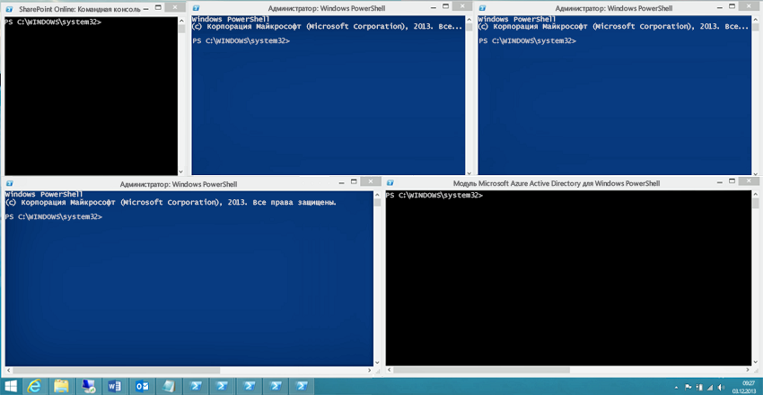

# <a name="connect-to-all-office-365-services-in-a-single-windows-powershell-window"></a>Подключение ко всем службам Office 365 с помощью единого окна Windows PowerShell

 **Сводка:** Вместо управление различных службах Office 365 в отдельной консоли windows PowerShell можно подключиться ко всем службам Office 365 и управлять ими из одного окна консоли.
  
При использовании PowerShell для управления Office 365, его можно установить до пяти различных Windows PowerShell открытые в то же время, соответствующий центра администрирования Office 365, SharePoint Online, Exchange Online, Скайп для бизнеса в Интернет и безопасности &amp;Центре соответствия требованиям. С помощью пяти разные способы подключения в отдельных сеансах Windows PowerShell к рабочему столу может выглядеть следующим образом:
  

  
Это не является оптимальным для управления Office 365, так как не удается обмен данными между этих пяти windows для управления между службами. В этом разделе описывается, как использовать один экземпляр Windows PowerShell, из которого можно управлять Office 365, Скайп для бизнеса в Интернет, Exchange Online, SharePoint Online и безопасность &amp; центре соответствия требованиям.

## <a name="before-you-begin"></a>Перед началом работы
<a name="BeforeYouBegin"> </a>

Прежде чем все Office 365 можно управлять из одного экземпляра Windows PowerShell, необходимо учитывайте следующие требования:
  
- Office 365 работы или школе учетной записи, используемой для этих процедур потребностей для быть участником роли администратора Office 365. Дополнительные сведения см в [роли администраторов об Office 365](https://go.microsoft.com/fwlink/p/?LinkId=532367). В этом является обязательным требованием для Office 365 PowerShell, а не обязательно для всех других служб Office 365.
    
- Ниже приведены 64-разрядные версии Windows, которые можно использовать.
    
  - Windows 10
    
  - Windows 8.1 или Windows 8
    
  - Windows Server 2016
    
  - Windows Server 2012 R2 или Windows Server 2012
    
  - Windows 7 с пакетом обновления 1 (SP1)*
    
  - Windows Server 2008 R2 с пакетом обновления 1 (SP1)*
    
    * Необходимо установить Microsoft .NET Framework 4.5. *x* и затем либо Windows Management Framework 3.0 или Windows Management Framework 4.0. Для получения дополнительных сведений см [установки .NET Framework](https://go.microsoft.com/fwlink/p/?LinkId=257868) и [Windows Management Framework 3.0](https://go.microsoft.com/fwlink/p/?LinkId=272757) или [Windows Management Framework 4.0](https://go.microsoft.com/fwlink/p/?LinkId=391344).
    
    Необходимо использовать 64-разрядной версии Windows из-за требования к Скайп для бизнеса в Интернет в модуле и один из модулей Office 365.
    
- Требуется ли установить модули, которые необходимы для Azure AD SharePoint Online и Скайп для бизнеса в Интернет:
    
   - [Azure Active Directory версии 2](connect-to-office-365-powershell.md#ConnectV2)
   - [Командная консоль SharePoint Online](https://go.microsoft.com/fwlink/p/?LinkId=255251)
   - [Скайп для бизнеса через Интернет, модуля Windows PowerShell](https://go.microsoft.com/fwlink/p/?LinkId=532439)
    
-  Windows PowerShell необходимо настроить для запуска сценариев со знаком для Скайп для бизнеса в Интернет, Exchange Online и безопасность &amp; центре соответствия требованиям. Для этого выполните следующую команду в сеансе Windows PowerShell с повышенными привилегиями (окно Windows PowerShell можно открыть, выбрав **Запуск от имени администратора**).
    
  ```
  Set-ExecutionPolicy RemoteSigned
  ```

## <a name="connection-steps-when-using-a-password"></a>Действия подключения при с помощью пароля
<a name="ConnStepsPassword"> </a>

Далее приведены шаги для подключения к службам в одном окне PowerShell.
  
1. Откройте Windows PowerShell с правами администратора ( **Запуск от имени администратора**использования).
    
2. Выполните следующую команду и введите данные Office 365 или школе учетные данные учетной записи.
    
  ```
  $credential = Get-Credential
  ```

3. Выполните эту команду, чтобы подключиться к Azure Active Directory (AD).
    
  ```
   Connect-AzureAD -Credential $credential
  ```

4. Выполните следующие команды для подключения к SharePoint Online. Замените _ \<domainhost >_ с фактическое значение для вашего домена. Например, `litwareinc.onmicrosoft.com`, _ \<domainhost >_ значение — `litwareinc`.
    
  ```
  Import-Module Microsoft.Online.SharePoint.PowerShell -DisableNameChecking
  Connect-SPOService -Url https://<domainhost>-admin.sharepoint.com -credential $credential
  ```

5. Выполните следующие команды для подключения к Скайп для бизнеса в Интернет. Предупреждение о том, увеличение `WSMan NetworkDelayms` впервые ожидается значение подключения и можно пропустить.
    
  ```
  Import-Module SkypeOnlineConnector
  $sfboSession = New-CsOnlineSession -Credential $credential
  Import-PSSession $sfboSession
  ```

6. Выполните следующие команды для подключения к Exchange Online.
    
  ```
  $exchangeSession = New-PSSession -ConfigurationName Microsoft.Exchange -ConnectionUri "https://outlook.office365.com/powershell-liveid/" -Credential $credential -Authentication "Basic" -AllowRedirection
  Import-PSSession $exchangeSession
  ```

7. Выполните следующие команды для подключения к безопасности &amp; центре соответствия требованиям.
    
  ```
  $SccSession = New-PSSession -ConfigurationName Microsoft.Exchange -ConnectionUri https://ps.compliance.protection.outlook.com/powershell-liveid/ -Credential $UserCredential -Authentication Basic -AllowRedirection
  Import-PSSession $SccSession
  ```

Ниже приведены все команды в один блок. Укажите имя вашего домена узла и затем использовать их для работы всех за один раз.
  
```
$domainHost="<domain host name, such as litware for litwareinc.onmicrosoft.com>"
$credential = Get-Credential
Connect-AzureAD -Credential $credential
Import-Module Microsoft.Online.SharePoint.PowerShell -DisableNameChecking
Connect-SPOService -Url https://$domainHost-admin.sharepoint.com -credential $credential
Import-Module SkypeOnlineConnector
$sfboSession = New-CsOnlineSession -Credential $credential
Import-PSSession $sfboSession
$exchangeSession = New-PSSession -ConfigurationName Microsoft.Exchange -ConnectionUri "https://outlook.office365.com/powershell-liveid/" -Credential $credential -Authentication "Basic" -AllowRedirection
Import-PSSession $exchangeSession
$SccSession = New-PSSession -ConfigurationName Microsoft.Exchange -ConnectionUri https://ps.compliance.protection.outlook.com/powershell-liveid/ -Credential $UserCredential -Authentication Basic -AllowRedirection
Import-PSSession $SccSession
```
Когда вы будете готовы закрыть все окна Windows PowerShell, выполните следующую команду, чтобы удалить активных сеансов для Скайп для бизнеса в Интернет, Exchange Online, SharePoint Online и безопасность &amp; центре соответствия требованиям:
  
```
Remove-PSSession $sfboSession ; Remove-PSSession $exchangeSession ; Remove-PSSession $SccSession ; Disconnect-SPOService
```

## <a name="connection-steps-when-using-multi-factor-authentication"></a>Действия подключения при использовании многофакторной проверки подлинности
<a name="ConnStepsMFA"> </a>

Ниже приведены все команды в один блок для подключения к Azure AD SharePoint Online и Скайп для Buiness с помощью многофакторной проверки подлинности в одном окне. Укажите имя участника (UPN) имя пользователя учетной записи глобального администратора и доменное имя узла, а затем использовать их для работы всех за один раз.

````
$acctName="<UPN of a global administrator account>"
$domainHost="<domain host name, such as litware for litwareinc.onmicrosoft.com>"
#Azure Active Directory
Connect-AzureAD
#SharePoint Online
Connect-SPOService -Url https://$domainHost-admin.sharepoint.com
#Skype for Business Online
$sfboSession = New-CsOnlineSession -UserName $acctName
Import-PSSession $sfboSession
````

Exchange Online и системы безопасности &amp; центре соответствия требованиям в следующих разделах подключиться, используя многофакторной проверки подлинности:

- [Подключение к Exchange Online PowerShell с помощью многофакторной проверки подлинности](https://docs.microsoft.com/powershell/exchange/exchange-online/connect-to-exchange-online-powershell/mfa-connect-to-exchange-online-powershell).
- [Подключение к Office 365 безопасности & PowerShell центр соответствия требованиям, с помощью многофакторной проверки подлинности](https://docs.microsoft.com/powershell/exchange/office-365-scc/connect-to-scc-powershell/mfa-connect-to-scc-powershell?view=exchange-ps)
 
Обратите внимание, что в обоих случаях, необходимо подключиться, используя отдельные сеансы модуля Exchange Online удаленного PowerShell.


## <a name="new-to-office-365"></a>Никогда не работали с Office 365?

[!INCLUDE [LinkedIn Learning Info](../common/office/linkedin-learning-info.md)]

## <a name="see-also"></a>См. также

- [Подключение к Office 365 PowerShell](connect-to-office-365-powershell.md)
- [Управление SharePoint Online с помощью Office 365 PowerShell](manage-sharepoint-online-with-office-365-powershell.md)
- [Управление учетными записями и лицензиями пользователей с помощью Office 365 PowerShell](manage-user-accounts-and-licenses-with-office-365-powershell.md)
- [Использование Windows PowerShell для создания отчетов в Office 365](use-windows-powershell-to-create-reports-in-office-365.md)
