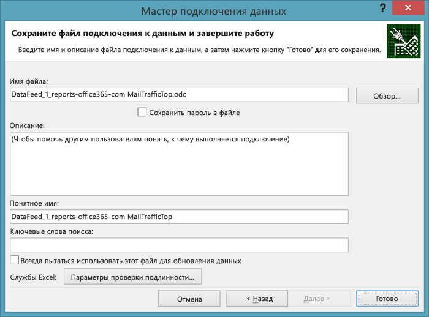
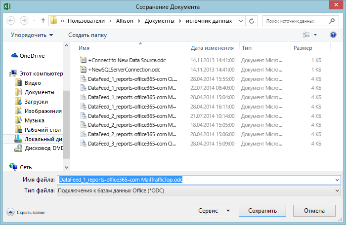
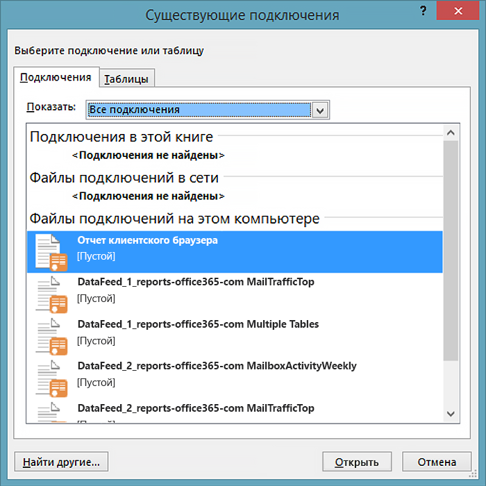
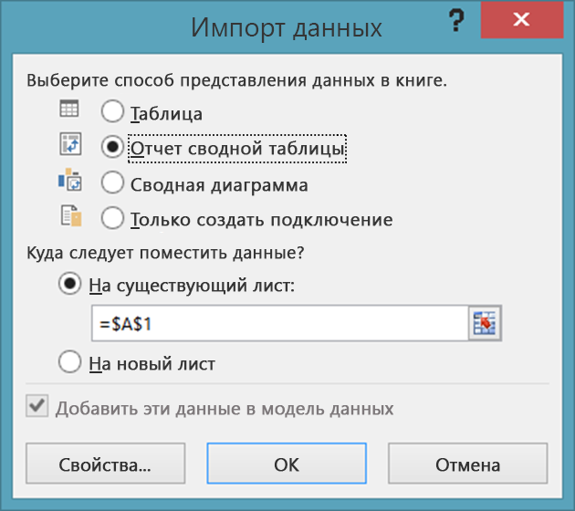

# <a name="using-excel-to-retrieve-office-365-reporting-data"></a><span data-ttu-id="2a177-103">Использование Excel для получения отчетных данных Office 365</span><span class="sxs-lookup"><span data-stu-id="2a177-103">Using Excel to Retrieve Office 365 Reporting Data</span></span>

 <span data-ttu-id="2a177-104">**Сводка.** Получите подробную информацию из отчета о развертывании Office 365, используя компонент oData в Microsoft Excel.</span><span class="sxs-lookup"><span data-stu-id="2a177-104">Summary: Use the oData feature in Microsoft Excel to retrieve detailed reporting information for your deployment of Office 365</span></span>
  
<span data-ttu-id="2a177-p101">Отчеты  важная составляющая администрирования системы. Центр администрирования Office 365: включает ряд готовых отчетов, доступных в разделе **Отчеты** в левой области навигации. Среди них есть отчеты об использовании, а также о безопасности и соответствии требованиям.</span><span class="sxs-lookup"><span data-stu-id="2a177-p101">Reporting is a key part of system administration. The Office 365 Admin center includes a number of predefined reports, which you can access from the **Reports** section of the left navigation. There are usage reports and security and compliance reports.</span></span>
  
<span data-ttu-id="2a177-p102">Доступные вам отчеты зависят от используемой версии Office 365: и включенных служб Office 365:. Дополнительные сведения см. в статье [Отчеты](https://technet.microsoft.com/ru-RU/library/office-365-reports.aspx).</span><span class="sxs-lookup"><span data-stu-id="2a177-p102">The reports available to you depend on the version of Office 365 you are using and which Office 365 services you have enabled. For more information, see the [Reports page](https://technet.microsoft.com/ru-RU/library/office-365-reports.aspx).</span></span>
  
<span data-ttu-id="2a177-p103">Готовые отчеты Центра администрирования являются отличным ресурсом. Они упрощают проверку таких параметров, как использование почтовых ящиков и время, проведенное вашими пользователями на конференциях по сети. Тем не менее, отчеты имеют определенные ограничения в отношении подробного анализа домена Office 365:.</span><span class="sxs-lookup"><span data-stu-id="2a177-p103">The pre-defined Admin center reports are an excellent resource. They make it easy to check on such things as mailbox usage or the number of minutes that your users have been spending in online conferences. However, when it comes to detailed analysis of your Office 365 domain, the reports do have their limitations.</span></span>
  
<span data-ttu-id="2a177-p104">Один из способов обойти эти ограничения  использовать Windows PowerShell или другой язык разработки для доступа к службе отчетов Office 365: и создания пользовательских отчетов. Пользовательские отчеты позволяют вам выбирать данные, которые будет возвращать служба отчетов Office 365:. Составляя пользовательские отчеты, вы также можете выбирать способ сортировки и группировки данных, а также (если это применимо) способ сохранения данных. Например, данные можно сохранять в формате XML или файле с разделителями-запятыми, который легко импортировать в Excel.</span><span class="sxs-lookup"><span data-stu-id="2a177-p104">One way to work around these limitations is to use Windows PowerShell or another development language to access the Office 365 reporting service and create custom reports; custom reports give you the ability to dictate which data (and how much data) is returned from the Office 365 reporting service. By writing custom reports you can also specify how the data should be sorted and grouped, and, if applicable, how that data should be saved; for example, you can save data in XML format or in a comma-separated values format that can easily be imported in Excel.</span></span> 
  
<span data-ttu-id="2a177-p105">Кроме того, пользовательские сценарии и приложения позволяют получать доступ к отчетам, недоступным из Центра администрирования Office 365:. Например, в Центре администрирования можно узнать, сколько у вас неактивных почтовых ящиков, но нельзя узнать, какие почтовые ящики не использовались за последние 30 дней. Однако это можно узнать с помощью пользовательского сценария PowerShell. Это обеспечивает высокую гибкость при том, что вам требуется написать короткий и относительно простой сценарий Windows PowerShell.</span><span class="sxs-lookup"><span data-stu-id="2a177-p105">In addition, custom scripts/applications enable you to access reports that are not available in the Office 365 Admin center. For example, the Admin center can tell you how many stale mailboxes you have, but it can't tell which mailboxes haven't been accessed in the past 30 days. That is something that a custom PowerShell script can tell you. Taken together, this represents an enormous amount of flexibility in return for having to write a short and relatively-simple Windows PowerShell script.</span></span>
  
> [!VISUAL BASIC NOTE]<span data-ttu-id="2a177-119"> Дополнительные сведения см. на [главной странице](https://msdn.microsoft.com/ru-RU/library/office/jj984325%28v=office.15%29.aspx) службы отчетов Office 365:.</span><span class="sxs-lookup"><span data-stu-id="2a177-119"> For more information, see the [home page](https://msdn.microsoft.com/ru-RU/library/office/jj984325%28v=office.15%29.aspx) for the Office 365 reporting service.</span></span>
  
<span data-ttu-id="2a177-p106">Для получения данных необходимо написать код того или иного типа. Это оправдано, если вы работаете в крупной организации, где требуется ограничить количество и тип возвращаемой информации. Но что если ваша организация небольшая и вам не требуется ограничивать количество и тип возвращаемой информации? В таком случае вы можете открывать отчеты Office 365: непосредственно в Excel.</span><span class="sxs-lookup"><span data-stu-id="2a177-p106">In order to retrieve this data, you do have to write code of some kind. That's worth it if you are a larger organization that needs to limit the amount and the type of information that gets returned. But if you're a smaller organization, and you don't need to limit the amount and type of information that gets returned, you might consider opening the Office 365 reports from within Excel itself.</span></span>
  
<span data-ttu-id="2a177-p107">Однако существует ряд ограничений, в первую очередь следующего: нельзя фильтровать, сортировать, выделять данные и выполнять с ними другие действия до того, как они будут возвращены. Вместо этого можно просто вернуть набор данных, возвращаемых отчетом по умолчанию. В некоторых случаях данных может быть недостаточно. Например, отчет может вернуть данные только за предыдущий месяц, а не за весь год. С другой стороны, иногда данных может быть слишком много: вы можете получить данные за весь год, хотя вас интересуют только данные за предыдущий месяц.</span><span class="sxs-lookup"><span data-stu-id="2a177-p107">However, there are a few limitations here, the primary one being this: you cannot filter, sort, select, or otherwise manipulate the data that before it gets returned. Instead, you simply get back the default set of data returned by the report. In some cases that might not be enough data. For example, the report might return data for, say, only the previous month and not for the entire year. Conversely, in other cases that might be too much data: you might get back data for the entire year even though you only want data for the previous month.</span></span>
  
<span data-ttu-id="2a177-128">Чтобы открыть отчет Office 365: непосредственно в Excel, выполните указанные ниже действия.</span><span class="sxs-lookup"><span data-stu-id="2a177-128">To open an Office 365 report directly from within Excel, complete the following procedure:</span></span>
  
1. <span data-ttu-id="2a177-p108">Для начала откройте новый лист в Excel. На этом листе нажмите **Данные**, **Из других источников** и **Из веб-канала данных OData**. Откроется диалоговое окно **Мастер подключения данных**:</span><span class="sxs-lookup"><span data-stu-id="2a177-p108">Start by opening a new worksheet in Excel. On that worksheet, click **Data**, click **From Other Sources**, and then click **From OData Data Feed**. That brings up the **Data Connection Wizard** dialog box:</span></span>
    
     
  
2. <span data-ttu-id="2a177-p109">На странице **Подключение к каналу данных** введите расположение канала **https://reports.office365.com/ecp/reportingwebservice/reporting.svc/**. Обратите внимание, что вводить базовый URL-адрес можно только в таком виде, не добавляя операторов выбора, фильтрации и форматирования. Если ввести что-либо, кроме базового URL-адреса, данные не будут возвращаться. Вместо этого появится следующее сообщение об ошибке:</span><span class="sxs-lookup"><span data-stu-id="2a177-p109">On the **Connect to a Data Feed** page, enter **https://reports.office365.com/ecp/reportingwebservice/reporting.svc/** as the data feed location. Note that you can only enter the base URL as shown; you cannot add any Select, Filter, or Format statements. If you enter anything but the base URL you won't get back any data; instead, you'll simply see the following error message:</span></span>
    
     
  
3. <span data-ttu-id="2a177-p110">Указав URL-адрес службы отчетов, выберите параметр **Использовать эти имя и пароль** в разделе **Учетные данные входа в систему**. В поле **Имя пользователя** введите свое имя в Office 365: (например, admin@litwareinc.onmicrosoft.com). В поле **Пароль** введите свой пароль для входа в Office 365:, а затем нажмите кнопку **Далее**. Затем Excel попробует подключиться к службе отчетов с помощью указанных учетных данных.</span><span class="sxs-lookup"><span data-stu-id="2a177-p110">After entering the reporting service URL, select **Use this name and password** under **Log on credentials**. In the **User Name** box, enter your Office 365 logon name (for example, admin@litwareinc.onmicrosoft.com). In the **Password** box, enter your Office 365 logon password and then click **Next**. Excel will then attempt to connect to the reporting service using the supplied credentials.</span></span>
    
4. <span data-ttu-id="2a177-p111">После проверки подлинности откроется страница **Выбор таблиц**. Выберите нужный отчет (например, **MailTrafficTop** ) и нажмите кнопку **Далее**:</span><span class="sxs-lookup"><span data-stu-id="2a177-p111">After you have been authenticated, you'll see the **Select Tables** page. Select the report that you'd like to view (for example, **MailTrafficTop** ) and then click **Next**:</span></span>
    
     
  
    > [!NOTE]
    > <span data-ttu-id="2a177-p112">Вы можете выбрать несколько отчетов. При этом в электронную таблицу Excel будет добавлено несколько таблиц или диаграмм. Можно даже создать одну таблицу или диаграмму, объединяющую данные из нескольких отчетов. Тем не менее, мы не будем обсуждать это во вводной статье.</span><span class="sxs-lookup"><span data-stu-id="2a177-p112">It's possible to select multiple reports; that results in multiple tables/charts being added to your Excel spreadsheet. It's even possible to create a single table/chart that combines data from multiple reports. However, we won't discuss that in this introductory article.</span></span> 
  
5. <span data-ttu-id="2a177-147">После нажатия кнопки **Далее** откроется страница **Сохраните файл подключения данных и завершите работу**:</span><span class="sxs-lookup"><span data-stu-id="2a177-147">After clicking **Next** you'll be presented with the **Save Data Connection File and Finish** page:</span></span>
    
     
  
    <span data-ttu-id="2a177-p113">На ней не требуется вводить никаких сведений. Для получения данных достаточно нажать кнопку **Готово**. Тем не менее важно отменить, что по умолчанию Excel сохраняет сведения о каждом подключении к данным. Эти данные хранятся в папке **Мои источники данных**:</span><span class="sxs-lookup"><span data-stu-id="2a177-p113">You don't have to enter any information here. All you need to do to retrieve your data is to click **Finish**. However, it's worth noting that, by default, Excel saves information about each data connection you make; this data is stored in your **My Data Sources** folder:</span></span>
    
     
  
    <span data-ttu-id="2a177-p114">По этой причине диалоговое окно содержит текстовые поля с такими заголовками, как **Понятное имя** и **Ключевые слова поиска**. Эти параметры позволяют настраивать подключения к данным. Благодаря этому вам не придется иметь дело с большим количеством источников данных, вроде этих:</span><span class="sxs-lookup"><span data-stu-id="2a177-p114">That's why the dialog box includes text boxes with labels like **Friendly Name** and **Search Keywords**; these options give you the chance to customize these data connections. That way you do not end up with a whole bunch of data sources that look like these:</span></span>
    
  ```
  DataFeed_1_reports-office365-com ClientSoftwareBrowserDetail.odc
DataFeed_1_reports-office365-com MailTrafficTop.odc
DataFeed_1_reports-office365-com Multiple Tables.odc
DataFeed_2_reports-office365-com MailboxActivityWeekly.odc
DataFeed_2_reports-office365-com MailTrafficTop.odc
DataFeed_3_reports-office365-com ClientSoftwareBrowserDetail.odc
  ```

<span data-ttu-id="2a177-p115">Установив флажок **Сохранить пароль в файле**, вы сможете повторно использовать эти каналы данных. Допустим, вы сохраняете подключение к данным как **отчет браузера клиента**. В следующий раз, когда вам понадобятся сведения о веб-браузерах, используемых для доступа к домену Office 365:, вам не придется использовать мастер подключения данных. Вместо этого достаточно будет открыть Excel, нажать **Данные** и выбрать **Существующие источники**. Выберите нужное подключение к данным в диалоговом окне **Существующие подключения** и нажмите кнопку **ОК**:</span><span class="sxs-lookup"><span data-stu-id="2a177-p115">If you select the checkbox **Save password in file**, you'll be able to reuse these data feeds. For example, suppose you save a data connection as **Client Browser Report**. The next time you want information about the web browsers being used to access your Office 365 domain you don't have to walk through the data connection wizard. Instead, all you need to do is open Excel, click **Data**, and then click **Existing Sources**. Select the desired data connection in the **Existing Connections** dialog box and then click **OK**:</span></span>
    

  
<span data-ttu-id="2a177-161">После этого Excel выполнит подключение и получит данные.</span><span class="sxs-lookup"><span data-stu-id="2a177-161">At that point, Excel will make the connection for you and retrieve the data.</span></span>
    
<span data-ttu-id="2a177-p116">Обратите внимание, что эти файлы ODC представляют собой текстовые файлы XML, в которых указаны ваши имя пользователя и пароль Office 365::</span><span class="sxs-lookup"><span data-stu-id="2a177-p116">Note that these .ODC files are plain-text XML files. Included in these plain-text XML files are your Office 365 user name and password:</span></span>
    
<span data-ttu-id="2a177-164">\<odc:ConnectionString>Data Source=https://reports.office365.com/ecp/reportingwebservice/reporting.svc/;Namespaces to Include=*;Max Received Message Size=4398046511104;Integrated Security=Basic; **User ID=admin@litwareinc.onmicrosoft.com;Password=MYpassw0rd!**;Persist Security Info=false;Service Document Url=https://reports.office365.com/ecp/reportingwebservice/reporting.svc/\</odc:ConnectionString></span><span class="sxs-lookup"><span data-stu-id="2a177-164"><odc:ConnectionString>Data Source=https://reports.office365.com/ecp/reportingwebservice/reporting.svc/;Namespaces to Include=*;Max Received Message Size=4398046511104;Integrated Security=Basic; User ID=admin@litwareinc.onmicrosoft.com;Password=MYpassw0rd!;Persist Security Info=false;Service Document Url=https://reports.office365.com/ecp/reportingwebservice/reporting.svc/</odc:ConnectionString></span></span>
    
<span data-ttu-id="2a177-p117">Если вы не хотите сохранять свои имя пользователя и пароль в текстовом файле, не устанавливайте флажок **Сохранить пароль в файле**. Однако в этом случае следует помнить, что вы не сможете повторно использовать эти подключения к данным. Это вызвано тем, что без имени пользователя и пароля Office 365: не сможет проверить подлинность вашей попытки входа в службу.</span><span class="sxs-lookup"><span data-stu-id="2a177-p117">If you don't like the idea of saving your user name and password in a plain-text file, then don't check the box labeled **Save password in file**. If you do that, however, keep in mind that you won't be able to reuse these data connections. That's because, without the user name and password, Office 365 will not be able to authenticate your attempt to log on to the service.</span></span>
    
6. <span data-ttu-id="2a177-168">Нажмите кнопку **Готово** на странице **Сохраните файл подключения данных и завершите работу**, и откроется диалоговое окно **Импорт данных**:</span><span class="sxs-lookup"><span data-stu-id="2a177-168">Click **Finish** on the **Save Data Connection File and Finish** page you'll be presented with the **Import Data** dialog box:</span></span>
    
     
  
7. <span data-ttu-id="2a177-p118">Выберите варианты отображения (например, **Отчет сводной таблицы** ) и нажмите кнопку **ОК**. Если все пройдет успешно, ваши данные будут импортированы и представлены в выбранном варианте отображения:</span><span class="sxs-lookup"><span data-stu-id="2a177-p118">Select your view options (for example, **PivotTable Report** ) and then click **OK**. If all goes well, your data will be imported and be presented in whichever view option you happened to choose:</span></span>
    
     
  
<span data-ttu-id="2a177-p119">Вы можете использовать эти данные по своему усмотрению. Рекомендации см. в статье [Создание панели мониторинга служб Excel с помощью веб-канала данных OData](https://technet.microsoft.com/ru-RU/library/jj873965%28v=office.15%29.aspx). Хотя в этой статье не используется служба отчетов Office 365:, в ней приводится некоторые полезные советы по таким действиям, как добавление фильтров и срезов на новую панель мониторинга.</span><span class="sxs-lookup"><span data-stu-id="2a177-p119">What you do with that data is then entirely up to you. For some suggestions. take a look at [Create an Excel Services dashboard using an oData data feed](https://technet.microsoft.com/ru-RU/library/jj873965%28v=office.15%29.aspx). Although that article doesn't use the Office 365 reporting service, it does provide some handy hints for doing things like adding filters and slicers to your new dashboard.</span></span>
  
## <a name="see-also"></a><span data-ttu-id="2a177-177">См. также</span><span class="sxs-lookup"><span data-stu-id="2a177-177">See also</span></span>

#### 

[<span data-ttu-id="2a177-178">Управление Office 365 с помощью PowerShell Office 365</span><span class="sxs-lookup"><span data-stu-id="2a177-178">Manage Office 365 with Office 365 PowerShell</span></span>](manage-office-365-with-office-365-powershell.md)
  
[<span data-ttu-id="2a177-179">Начало работы с Office 365 PowerShell</span><span class="sxs-lookup"><span data-stu-id="2a177-179">Getting started with Office 365 PowerShell</span></span>](getting-started-with-office-365-powershell.md)
  
[<span data-ttu-id="2a177-180">Использование Windows PowerShell для создания отчетов в Office 365</span><span class="sxs-lookup"><span data-stu-id="2a177-180">Use Windows PowerShell to create reports in Office 365</span></span>](use-windows-powershell-to-create-reports-in-office-365.md)

