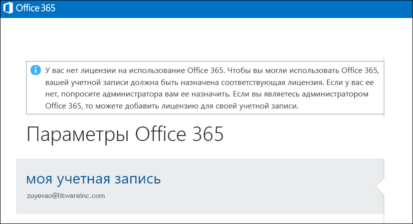

# <a name="view-licensed-and-unlicensed-users-with-office-365-powershell"></a>Отображение списков пользователей с лицензиями и пользователей без лицензий с помощью Office 365 PowerShell

**Сводка.** Узнайте, как просмотреть учетные записи пользователей Office 365 с лицензиями и без них, используя PowerShell.
  
Учетным записям пользователей в вашей организации Office 365: могут быть назначены все лицензии или часть лицензий (или вообще ни одной доступной лицензии) из планов лицензирования, имеющихся в организации. С помощью PowerShell в Office 365 вы можете быстро найти пользователей в организации, у которых есть лицензии, и пользователей, у которых их нет.
  
## <a name="before-you-begin"></a>Перед началом работы

- Для процедур, описанных в этой статье, требуется подключение к PowerShell в Office 365. Указания см. в статье [Подключение к Office 365 PowerShell](connect-to-office-365-powershell.md).
    
- Если использовать командлет **Get-MsolUser** без параметра _-All_, возвращаются только первые 500 учетных записей.
    
## <a name="the-short-version-instructions-without-explanations"></a>Краткая версия (инструкции без пояснений)

В этом разделе процедуры представлены без лишних слов и объяснений. Если у вас возникнут вопросы или вам потребуются дополнительные сведения, вы можете прочитать остальные разделы статьи.
  
Чтобы отобразить список всех учетных записей пользователей в организации и сведения об их состояниях лицензирования, в PowerShell в Office 365 выполните указанную ниже команду.
  
```
Get-MsolUser -All
```

Чтобы отобразить список всех учетных записей пользователей без лицензий в вашей организации, выполните указанную ниже команду.
  
```
Get-MsolUser -All -UnlicensedUsersOnly
```

Чтобы отобразить список всех учетных записей пользователей с лицензиями в вашей организации, выполните указанную ниже команду.
  
```
Get-MsolUser -All | where {$_.isLicensed -eq $true}
```

## <a name="the-long-version-instructions-with-detailed-explanations"></a>Подробная версия (инструкции с подробными пояснениями)

Учетные записи пользователей Office 365 и лицензий на Office 365 не нужно иметь однозначного соответствия: возможно для пользователей Office 365, у которых нет лицензии Office 365, и это может быть лицензии Office 365, которые еще не были назначены пользователям. (На самом деле одной учетной записи пользователя можно даже имеют *несколько* Office 365 лицензий). При создании нового пользователя Office 365 учетной записи (в статье [Назначение лицензий для учетных записей пользователей с Office 365 PowerShell](assign-licenses-to-user-accounts-with-office-365-powershell.md) для получения дополнительных сведений) вам не нужно назначить этому пользователю лицензии: новый пользователь будет иметь действительную учетную запись, но он не сможет получить подпись n, в Office 365. При попытке выполнить вход пользователей будет отображено что-то вроде этого:
  

  
Аналогично, пользователь может уйти во внеплановый отпуск, например творческий или декретный. В таком случае вы можете удалить лицензию этого пользователя, оставив учетную запись нетронутой (то есть оставив "как есть" все значения ее свойств, такие как адрес, номер телефона и т. д.). Благодаря этому вы можете назначить эту лицензию другому пользователю (например, временному сотруднику, занявшему должность пользователя, который ушел в отпуск). Когда пользователь вернется на работу, вы можете выдать ему новую лицензию, чтобы тот смог сразу вернуться к выполнению своих задач.
  
Таким образом, у вас действительно могут быть пользователи с учетными записями без лицензий или наоборот.
  
В статье [Просмотр лицензий и служб с помощью PowerShell в Office 365](view-licenses-and-services-with-office-365-powershell.md) описано, как определить количество приобретенных вашей организацией лицензий Office 365: и сколько из них назначены пользователям. Это важные сведения. Не менее важно знать, каким пользователям назначены лицензии, а каким  нет. Об этом также говорится в этой статье.
  
Как вам, вероятно, известно, командлет **Get-MsolUser** возвращает сведения обо всех учетных записях пользователей Office 365:. Необходимо быстро получить сведения обо всех пользователях Office 365:? В PowerShell в Office 365 выполните указанную ниже команду.
  
```
Get-MsolUser
```

В свою очередь командлет Get-MsolUser возвращает приведенные ниже данные.
  
```
UserPrincipalName           DisplayName                     isLicensed
-----------------           -----------                     ----------
ZrinkaM@litwareinc.com      Zrinka Makovac                  True
BelindaN@litwareinc.com     Belinda Newman                  False
BonnieK@litwareinc.com      Bonnie Kearney                  True
FabriceC@litwareinc.com     Fabrice Canel                   True
AnneW@litwareinc.com        Anne Wallace                    True
AlexD@litwareinc.com        Alex Darrow                     True
```

Как видите, одно из возвращенных значений свойств предназначено для свойства **isLicensed**. Если свойство **isLicensed** имеет значение `False`, то это означает, что у пользователя нет лицензии на Office 365:. Другими словами, вы могли бы просто прокрутить список пользователей и выбрать пользователей, для которых свойство **isLicensed** имеет значение `False`.
  
В любом случае, прокрутить список и выбрать нелицензированных пользователей можно, если имеется относительно небольшое количество пользователей. Однако при наличии большого числа пользователей это очень трудоемкая задача. (Кроме того, в зависимости от настроек Windows PowerShell выполнение этой задачи может оказаться невозможным, поскольку в Windows PowerShell существует ограничение относительно количества строк вывода, которые можно одновременно отобразить.)
  
Поэтому намного лучший способ отобразить нелицензированных пользователей — выполнить такую команду:
  
```
Get-MsolUser -UnlicensedUsersOnly
```

Эта команда возвращает только пользователей, у которых нет лицензии на Office 365:. Другими словами:
  
```
UserPrincipalName           DisplayName                     isLicensed
-----------------           -----------                     ----------
BelindaN@litwareinc.com     Belinda Newman                  False
```

Как вы видите, имеется один пользователь без лицензии. А что, если нам нужен список только  *лицензированных*  пользователей? Это немного сложнее:
  
```
Get-MsolUser | Where-Object {$_.isLicensed -eq $true}
```

Эта команда ищет все учетные записи пользователей, для которых значение свойства **isLicensed** равно `True`, и возвращает примерно следующую информацию:
  
```
UserPrincipalName           DisplayName                     isLicensed
-----------------           -----------                     ----------
ZrinkaM@litwareinc.com      Zrinka Makovac                  True
BonnieK@litwareinc.com      Bonnie Kearney                  True
FabriceC@litwareinc.com     Fabrice Canel                   True
AnneW@litwareinc.com        Anne Wallace                    True
AlexD@litwareinc.com        Alex Darrow                     True
```

Как видите, сведения о пользователе Belinda Newman не возвращаются. Почему? Очень просто: для учетной записи этого пользователя значение свойства **isLicensed** не равно `True`.
  
## <a name="see-also"></a>См. также

Дополнительные сведения о командлетах, использованных в этих процедурах, см. в указанных ниже статьях.
  
- [Get-MsolUser](https://go.microsoft.com/fwlink/p/?LinkId=691547)
    
- [Where-Object](https://go.microsoft.com/fwlink/p/?LinkId=113423)
    

