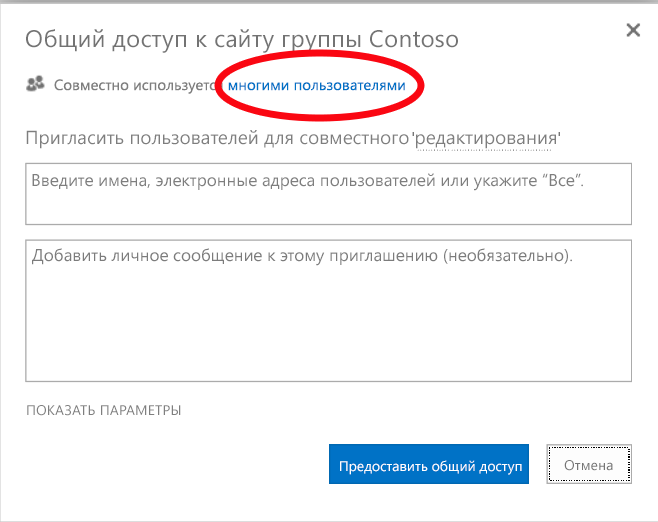
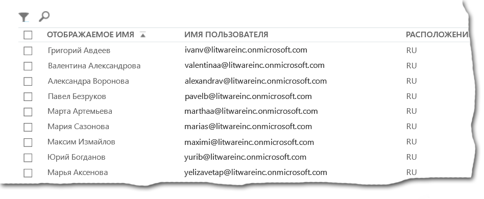

# <a name="why-you-need-to-use-office-365-powershell"></a>Причины использования Office 365 PowerShell

 **Сводка:** Понимаете, почему необходимо использовать Office 365 PowerShell для управления Office 365, в некоторых случаях более эффективным и в других случаях участники групп.
  
Центр администрирования Office 365 позволяет не только управлять учетными записями и лицензиями пользователей Office 365:, но и серверными продуктами Office 365:: Exchange, Skype для бизнеса Online и SharePoint Online. Кроме того, этими элементами можно также управлять с помощью команд PowerShell в Office 365, используя командную строку и язык сценариев. Это позволит увеличить скорость работы, использовать автоматизацию и получить дополнительные возможности.
  
В этой статье мы покажем вам эти способы использования PowerShell в Office 365 для управления Office 365:.
  
- PowerShell в Office 365 может раскрыть дополнительную информацию, которая недоступна в средстве "Центр администрирования Office 365".
    
- Office 365: имеет компоненты, которые можно настроить только с помощью PowerShell в Office 365
    
- PowerShell в Office 365 идеально подходит для выполнения групповых операций.
    
- PowerShell в Office 365 прекрасно подходит для фильтрации данных.
    
- PowerShell в Office 365 упрощает процесс печати и сохранения данных.
    
- PowerShell в Office 365 позволяет управлять серверными продуктами.
    
Приступая к чтению статьи, необходимо понимать, что PowerShell в Office 365 — это набор модулей для Windows PowerShell, среда командной строки для служб и платформ Windows. Эта среда создает язык командной строки, который можно расширить с помощью дополнительных модулей и который позволяет выполнять как простые, так и сложные команды и сценарии. Например, после установки модулей PowerShell в Office 365 и подключения подписки Office 365: вы можете запустить следующую команду, чтобы отобразить список всех почтовых ящиков пользователей для Microsoft Exchange Online:
  
```
Get-Mailbox
```

Кроме того, эта команда позволяет определить количество элементов во всех списках для всех сайтов всех веб-приложений в SharePoint Online:
  
```
Get-SPOSite -Limit All | Get-SPWeb -Limit All | % {$_.Lists} | ? {$_ -is [Microsoft.SharePoint.SPDocumentLibrary]} | % {$total+= $_.ItemCount}; $total
```

Центр администрирования Office 365 также позволяет с легкостью отобразить список почтовых ящиков, но подсчитать количество элементов во всех списках для всех сайтов всех веб-приложений будет непросто.
  
Помните, что среда PowerShell в Office 365 разработана для того, чтобы расширить и дополнить возможности управления Office 365:, а не заменить Центр администрирования Office 365. Как администратор Office 365:, вы должны владеть по крайней мере основами работы с Office 365: PowerShell, так как некоторые процедуры настройки можно выполнить только с помощью команд PowerShell в Office 365. В таких случаях вы должны уметь:
  
- устанавливать модули PowerShell в Office 365 (выполняется только один раз для компьютера администратора);
    
- подключаться к своей подписке Office 365: (выполняется один раз для каждого сеанса PowerShell);
    
- собирать информацию для выполнения необходимых команд PowerShell в Office 365;
    
- успешно выполнять команды PowerShell в Office 365.
    
Овладев этими основными навыками, вам не обязательно отображать список пользователей почтовых ящиков с помощью команды **Get-Mailbox** или учиться создавать команду, подобную предыдущей, для подсчета всех элементов во всех списках для всех сайтов всех веб-приложений. Корпорация Майкрософт и сообщество администраторов Office 365: могут помочь вам в этом при необходимости.
  
## <a name="office-365-powershell-can-reveal-additional-information-that-you-cannot-see-with-the-office-365-admin-center"></a>PowerShell в Office 365 может раскрыть дополнительную информацию, которая недоступна в средстве "Центр администрирования Office 365".
<a name="reveal"> </a>

Центр администрирования Office 365 включает много полезных сведений, но это не означает, что там отображается вся возможная информация о пользователях, лицензиях, почтовых ящиках и сайтах, имеющаяся в Office 365:. Ниже приведен пример раздела **пользователи и группы** в средстве "Центр администрирования Office 365":
  

  
Здесь отображаются сведения, которых очень часто бывает достаточно. Однако есть случаи, когда нужно знать больше. Например, лицензирование Office 365: (а также доступных пользователю компонентов Office 365:) частично зависит от географического местоположения пользователя: для пользователя, проживающего в США, можно активировать политики и функции, отличные от политик и функций для жителя Индии или Бельгии. Центр администрирования Office 365 позволяет определить географическое расположение пользователя, как описано ниже.
  
1. Дважды щелкните **отображаемое имя** пользователя.
    
2. На панели отображения свойств пользователя щелкните **сведения**.
    
3. В окне сведений щелкните **дополнительные сведения**.
    
4. Прокрутите окно вниз до заголовка **Страна или регион**.
    
     
  
5. Запишите отображаемое имя и местонахождение пользователя на лист бумаги или скопируйте и вставьте их в Блокнот. 
    
Эту процедуру необходимо повторить для каждого пользователя. Если пользователей очень много, эта задача может показаться утомительной. В PowerShell в Office 365 вы можете отобразить эти сведения обо всех пользователях с помощью следующей команды:
  
```
Get-MsolUser | Select DisplayName, UsageLocation
```

> [!NOTE]
> Для использования этой команды необходимо установить [модуль Windows Azure Active Directory](https://technet.microsoft.com/en-us/library/jj151815.aspx). 
  
Ниже приведен пример отображения.
  
```
DisplayName                               UsageLocation
-----------                               -------------
Zrinka Makovac                            US
Bonnie Kearney                            GB
Fabrice Canel                             BR
Brian Johnson (TAILSPIN)                  US
Anne Wallace                              US
Alex Darrow                               US
David Longmuir                            BR
```

> [!TIP]
>  Интерпретация этой команды Office 365 PowerShell зависит от: получение всех пользователей в текущей подписки Office 365 ( **Get-MsolUser** ), но только отображать имя и расположение для каждого пользователя ( **выберите DisplayName, UsageLocation** ).
  
Так как PowerShell в Office 365 поддерживает язык командной оболочки, вы можете выполнять дополнительные действия над информацией, полученной с помощью команды **Get-MSolUser**. Например, вы можете отсортировать пользователей по их расположениям и объединить в группы пользователей из Бразилии, США, и т. д. Это можно сделать с помощью указанной ниже команды.
  
```
Get-MsolUser | Select DisplayName, UsageLocation | Sort UsageLocation, DisplayName
```

Ниже приведен пример отображения.
  
```
DisplayName                                 UsageLocation
-----------                                 -------------
David Longmuir                              BR
Fabrice Canel                               BR
Bonnie Kearney                              GB
Alex Darrow                                 US
Anne Wallace                                US
Brian Johnson (TAILSPIN)                    US
Zrinka Makovac                              US
```

> [!TIP]
>  Интерпретация этой команды Office 365 PowerShell зависит от: получение всех пользователей в текущей подписки Office 365, но только отображать имя и расположение для каждого пользователя и способ сортировки сначала по их расположения, а затем их имена ( **UsageLocation сортировки Отображаемое имя** ).
  
Можно также использовать дополнительные фильтры. Например, если нужно просмотреть сведения о пользователях, находящихся в Бразилии, используйте следующую команду:
  
```
Get-MsolUser | Where {$_.UsageLocation -eq "BR"} | Select DisplayName, UsageLocation 
```

Ниже приведен пример отображения.
  
```
DisplayName                                           UsageLocation
-----------                                           -------------
David Longmuir                                        BR
Fabrice Canel                                         BR
```

> [!TIP]
>  Интерпретация этой команды Office 365 PowerShell зависит от: получение всех пользователей в текущей подписки Office 365, расположение которого является Бразилия ( **где {$\_. UsageLocation - eq «BR»}** ), затем отображать имя и расположение для каждого пользователя.
  
 **Небольшое примечание относительно более крупных доменов**
  
Если у вас очень большой домен, включающий десятки тысяч пользователей, то использование некоторых сценариев, описанных в этой статье, может привести к так называемому "регулированию". Это будет означать, что вы одновременно выполняете слишком большое количество задач, для чего недостаточно мощности компьютера и пропускной способности сети. Поэтому крупным организациям может понадобиться разбить некоторые из этих команд PowerShell в Office 365 на две команды. Например, указанная ниже команда возвращает все учетные записи пользователей и отображает для каждой из них имя и расположение.
  
```
Get-MsolUser | Select DisplayName, UsageLocation
```

Она отлично подходит для небольших доменов. Тем не менее крупной организации может понадобиться разделить ее на две команды: одна команда будет использоваться для сохранения сведений об учетных записях пользователей в переменной, а другая — для отображения необходимой информации. Вот пример:
  
```
$x = Get-MsolUser
$x | Select DisplayName, UsageLocation
```


Интерпретация этот набор команд Office 365 PowerShell — это:
- Получение всех пользователей в текущей подписки Office 365 и сохранения данных в переменной с именем $x ( **$x = Get-MsolUser** ).
- Отображение содержимого из переменной $x, но только включать имя и расположение для каждого пользователя ( **$x | Выберите DisplayName, UsageLocation** ).
  
## <a name="office-365-has-features-that-you-can-only-configure-with-office-365-powershell"></a>В Office 365 имеются компоненты, которые можно настроить только с помощью PowerShell в Office 365
<a name="only"> </a>

Центр администрирования Office 365 позволяет выполнять самые распространенные и важные задачи администрирования, применимые к большинству пользователей. Другими словами, Центр администрирования Office 365 создан, чтобы типичный администратор с его помощью мог выполнять распространенные задачи управления. Следовательно, Центр администрирования Office 365 не позволяет выполнить некоторые задачи.
  
Например, в Центр администрирования Skype для бизнеса Online используется несколько параметров для создания настраиваемых приглашений на собрания:
  

  
С помощью указанных ниже параметров приглашения на собрания можно сделать более персонализированными и профессиональными. Тем не менее, настройки собраний позволяют сделать больше, чем просто создать пользовательские приглашения. Например, по умолчанию собрания позволяют:
  
- анонимным пользователям автоматически присоединяться к каждому собранию;
    
- участникам записывать собрание;
    
- обозначать всех пользователей из вашей организации докладчиками при их присоединении к собранию.
    
Эти параметры недоступны в Центре администрирования Skype для бизнеса Online. Но ими можно управлять с помощью PowerShell в Office 365. Указанная ниже команда отключает эти три параметра.
  
```
Set-CsMeetingConfiguration -AdmitAnonymousUsersByDefault $False -AllowConferenceRecording $False -DesignateAsPresenter "None"
```

> [!NOTE]
> Для использования этой команды необходимо установить [модуль PowerShell для Skype для бизнеса Online ](https://www.microsoft.com/download/details.aspx?id=39366). 
  
> [!TIP]
>  Интерпретация этой команды Office 365 PowerShell зависит от: параметры для нового Скайп Business собрание по сети ( **Set-CsMeetingConfiguration** ), отключение, позволяя анонимным пользователям автоматически присоединяться к собраниям ( **- AdmitAnonymousUsersByDefault $False** ), запретить участникам записывать собрания ( **-AllowConferenceRecording $False** ) и не назначения всех пользователей из вашей организации в качестве выступающих ( **- DesignateAsPresenter «None»** ).
  
Если вы передумали и хотите восстановить эти параметры по умолчанию (т. е. включить их все), выполните следующую команду:
  
```
Set-CsMeetingConfiguration -AdmitAnonymousUsersByDefault $True -AllowConferenceRecording $True -DesignateAsPresenter "Company"
```

Это только один пример. Существуют и другие, поэтому вы как администратор Office 365: должны уметь без труда использовать команды PowerShell в Office 365.
  
## <a name="office-365-powershell-is-great-at-carrying-out-bulk-operations"></a>PowerShell в Office 365 идеально подходит для массовых операций
<a name="bulk"> </a>

Исторически сложилось так, что графические пользовательские интерфейсы, например Центр администрирования Office 365, оптимальны при выполнении одной операции. Например, если нужно отключить одну учетную запись пользователя, Центр администрирования Office 365 позволяет быстро найти и снять соответствующий флажок. Обычно это проще, чем выполнить аналогичную операцию в PowerShell в Office 365.
  
Однако если вам нужно изменить ряд параметров или некоторые параметры внутри большого набора других параметров, Центр администрирования Office 365 может быть не лучшим вариантом с точки зрения экономии времени. Например, если нужно изменить префикс в тысячах номеров телефонов или удалить определенного пользователя, например Кена Майера (Ken Myer), со всех сайтов SharePoint Online, то как это можно сделать в средстве "Центр администрирования Office 365"?
  
Допустим, в последнем примере у вас есть несколько сотен сайтов SharePoint Online и вы даже не знаете, на каком из них зарегистрирован пользователь Ken Meyer. Это означает, что сначала необходимо войти в Центр администрирования Office 365, а затем выполнить следующую процедуру для каждого сайта:
  
1. Щелкнуть **URL-адрес** сайта.
    
2. В поле **свойств семейства веб-сайтов** щелкнуть ссылку **Адрес веб-сайта**, чтобы открыть сайт.
    
3. На сайте нажать кнопку **Общий доступ**.
    
4. В диалоговом окне **Общий доступ** щелкнуть ссылку, чтобы показать всех пользователей с разрешениями для сайта:
    
     
  
5. В диалоговом окне **Общий доступ предоставлен** нажать кнопку **Дополнительно**.
    
6. Прокрутить список пользователей, найти и выбрать Кена Майера (если у него есть разрешения для сайта) и нажать кнопку **Удалить разрешения пользователя**.
    
Для нескольких сотен сайтов это может занять очень много времени.
  
Но есть и другой вариант: удалить пользователя Ken Myer со всех сайтов с помощью указанной ниже команды PowerShell в Office 365.
  
```
Get-SPOSite | ForEach {Remove-SPOUser -Site $_.Url -LoginName "kenmyer@litwareinc.com"}
```

> [!NOTE]
> Для выполнения этой команды необходимо установить [подключение к PowerShell SharePoint Online](https://technet.microsoft.com/library/fp161372.aspx). 
  
> [!TIP]
>  Интерпретация этой команды Office 365 PowerShell зависит от: получают все сайты SharePoint в текущей подписки Office 365 ( **Get-SPOSite** ) и для каждого сайта удалить из списка пользователей, которые могут обращаться к ней ( **ForEach {Remove-SPOUser - Кен Майер Веб-сайтов $\_. URL-адрес - LoginName «kenmyer@litwareinc.com»}** ).
  
Так как мы указываем Office 365: удалить пользователя Ken Meyer с каждого сайта, включая те, к которым у него нет доступа, эта команда будет показывать ошибки для таких сайтов. В этой команде можно использовать дополнительное условие, чтобы пользователь Ken Meyer был удален только с тех сайтов, в списке учетных записей которых он содержится, но чтобы указанные ошибки не влияли на сами сайты. Чтобы обработать несколько сотен сайтов, команде может потребоваться несколько минут — в отличие от часов работы в средстве "Центр администрирования Office 365".
  
Вот еще один пример массовой операции. Чтобы добавить пользователя Бонни Керни (Bonnie Kearney) — нового администратора SharePoint — на все сайты в организации, используйте следующую команду:
  
```
Get-SPOSite | ForEach {Add-SPOUser -Site $_.Url -LoginName "bkearney@litwareinc.com" -Group "Members"}
```

> [!TIP]
>  Интерпретация этой команды Office 365 PowerShell —: получение всех узлов SharePoint в текущей подписки Office 365 и для каждого сайта, разрешить доступ Bonnie Kearney, добавив ее имени для входа для группы участников сайта ( **ForEach {Add-SPOUser-сайта $\_. URL-адрес - LoginName «bkearney@litwareinc.com»-группы «Участники»}** ).
  
## <a name="office-365-powershell-is-great-at-filtering-data"></a>PowerShell в Office 365 прекрасно подходит для фильтрации данных.
<a name="filter"> </a>

Центр администрирования Office 365 предоставляет несколько различных способов фильтрации данных, т. е. быстрого и легкого поиска целевого подмножества информации. Например, Exchange позволяет с легкостью фильтровать сведения по практически любому свойству почтового ящика пользователя. Например, вот список почтовых ящиков всех пользователей, проживающих в г. Блумингтон (Bloomington):
  

  
Кроме того, Центр администрирования Exchange позволяет сочетать различные условия фильтра. Например, можно найти почтовые ящики всех пользователей, проживающих в г. Блумингтон и работающих в отделе финансов. 
  
Но возможности фильтрации в Центре администрирования Exchange ограничены. Например, вам может понадобиться найти почтовые ящики пользователей, проживающих в городах Блумингтон (Bloomington) или Сан-Диего (San Diego), или почтовые ящики всех пользователей, которые не проживают в городе Блумингтон. 
  
PowerShell в Office 365 позволяет получить список почтовых ящиков всех пользователей, проживающих в городах Блумингтон или Сан-Диего, с помощью указанной ниже команды.
  
```
Get-User | Where {$_.RecipientTypeDetails -eq "UserMailbox" -and ($_.City -eq "San Diego" -or $_.City -eq "Bloomington")} | Select DisplayName, City
```

Ниже приведен пример отображения.
  
```
DisplayName                              City
-----------                              ----
Alex Darrow                              San Diego
Bonnie Kearney                           San Diego
Julian Isla                              Bloomington
Rob Young                                Bloomington
Zrinka Makovac                           San Diego
```

> [!TIP]
>  Интерпретация этой команды Office 365 PowerShell зависит от: получение всех пользователей в текущей подписки Office 365, у которых нет почтового ящика в городах Москва или Блумингтона ( **где {$\_. RecipientTypeDetails - eq «UserMailbox»- и ($\_. Город - eq «Москва»- или $\_. Город - eq "Блумингтона")}** ), затем отображения имени и Город для каждого ( **выберите DisplayName, Город** ).
  
Чтобы отобразить список всех почтовых ящиков пользователей, проживающих в любом месте за исключением г. Блумингтон, используйте такую команду:
  
```
Get-User | Where {$_.RecipientTypeDetails -eq "UserMailbox" -and $_.City -ne "Bloomington"} | Select DisplayName, City
```

Ниже приведен пример отображения.
  
```
DisplayName                               City
-----------                               ----
MOD Administrator                         Redmond
Alex Darrow                               San Diego
Allie Bellew                              Bellevue
Anne Wallace                              Louisville
Aziz Hassouneh                            Cairo
Belinda Newman                            Charlotte
Bonnie Kearney                            San Diego
David Longmuir                            Waukesha
Denis Dehenne                             Birmingham
Garret Vargas                             Seattle
Garth Fort                                Tulsa
Janet Schorr                              Bellevue
```

> [!TIP]
>  Интерпретация этой команды Office 365 PowerShell зависит от: получение всех пользователей в текущей подписки Office 365, у которых нет почтового ящика не находится в городе Блумингтона ( **где {$\_. RecipientTypeDetails - eq «UserMailbox»- и $\_. Город - ne «Блумингтона»}** ), затем отображения имени и Город для каждого из них.
  
Кроме того, в фильтрах PowerShell в Office 365 можно использовать подстановочные знаки для поиска соответствия с частью имени. Предположим, вы ищете учетную запись пользователя, но помните только, что его фамилия или Андерсон, или Хендерсон, или, может быть, Йоргенсон.
  
Центр администрирования Office 365 позволяет найти этого пользователя, используя средство поиска для поиска пользователей с тремя фамилиями:
  
- *Андерсон*  ; 
    
- *Хендерсон*  ; 
    
- *Йоргенсон*  . 
    
Так как все три фамилии заканчиваются на "-сон", в PowerShell в Office 365 можно использовать команду для отображения всех пользователей, фамилия которых имеет такое окончание. Вот как это делается:
  
```
Get-User -Filter '{LastName -like "*son"}'
```

> [!TIP]
>  Интерпретация этой команды Office 365 PowerShell зависит от: получение всех пользователей в текущей подписки Office 365, но использовать фильтр, который только выводит список пользователей, фамилии оканчивающиеся на «son» ( **-фильтра "{LastName-как"\*сын "}"** ). \* Обозначает любой набор знаков, которые являются буквы в случае фамилию пользователя.
  
## <a name="office-365-powershell-makes-it-easy-to-print-or-save-data"></a>PowerShell в Office 365 упрощает процесс печати и сохранения данных.
<a name="printsave"> </a>

Центр администрирования Office 365 позволяет просматривать списки данных. Ниже приведен пример, где в Центре администрирования Skype для бизнеса Online отображается список пользователей, для которых включено приложение Skype для бизнеса Online:
  

  
Чтобы сохранить эти данные в файл, необходимо их скопировать и вставить в документ или лист Excel. В любом случае может потребоваться дополнительное форматирование копии. Кроме того, Центр администрирования Office 365 не позволяет напрямую распечатать отображаемый список.
  
К счастью, с помощью PowerShell в Office 365 можно не только отобразить список, но и сохранить его в файл, который легко импортировать в Excel. Ниже приведен пример команды, позволяющей сохранить пользовательские данные Skype для бизнеса Online в файл с разделителями-запятыми (CSV-файл), который легко импортировать в виде таблицы в лист Excel.
  
```
Get-CsOnlineUser | Select DisplayName, UserPrincipalName, UsageLocation | Export-Csv -Path "C:\\Logs\\SfBUsers.csv" -NoTypeInformation
```

Ниже приведен пример отображения.
  

  
> [!TIP]
>  Интерпретация этой команды Office 365 PowerShell зависит от: получают все Скайп для бизнеса в Интернет пользователей в текущей подписки Office 365 ( **Get-CsOnlineUser** ), получить имя пользователя, имя участника-пользователя и расположение ( **выберите DisplayName UserPrincipalName, UsageLocation** ), а затем сохраните, что сведения в CSV-файл с именем C:\\журналы\\SfBUsers.csv ( **Export-Csv-пути «C:\\журналы\\SfBUsers.csv» - NoTypeInformation** ).
  
PowerShell также позволяет сохранить этот список в виде XML-файла или HTML-страницы. Кроме того, с помощью дополнительных команд PowerShell вы можете сохранить данные непосредственно в файл Excel, используя необходимое форматирование. 
  
Список, возвращенный командой PowerShell в Office 365, можно также отправить непосредственно на принтер, используемый по умолчанию в Windows. Вот пример необходимой команды:
  
```
Get-CsOnlineUser | Select DisplayName, UserPrincipalName, UsageLocation | Out-Printer
```

Ниже показано, как будет выглядеть напечатанный документ.
  

  
> [!TIP]
>  Интерпретация этой команды Office 365 PowerShell зависит от: получают все Скайп для бизнеса в Интернет пользователей в текущей подписки Office 365 получить имя пользователя, имя участника-пользователя и расположение, а затем отправьте эти сведения на принтере Windows по умолчанию ( ** Out-Printer** ).
  
Напечатанный документ имеет же форматирование, использовать для отображения в окне командной строки Office 365 PowerShell, но после создания команды Office 365 PowerShell, чтобы отобразить, что вам нужно просто добавить **| Out-принтера** в конец команду для получения работать с компакт-диске.
  
## <a name="office-365-powershell-lets-you-manage-across-server-products"></a>PowerShell в Office 365 позволяет управлять серверными продуктами.
<a name="printsave"> </a>

Различные компоненты, составляющие Office 365:, предназначены для совместной работы. Предположим, вы добавляете нового пользователя в Office 365: и при этом указываете такие сведения, как его отдел и номер телефона. Эти сведения в дальнейшем будут доступны при получении доступа к данным пользователя с помощью любого из серверных продуктов Office 365:. Skype для бизнеса Online, Exchange или SharePoint Online.
  
Это общие сведения, распространяющиеся на набор продуктов. Сведения о конкретных продуктах, например информация о почтовом ящике Exchange пользователя, обычно недоступны во всех продуктах набора. Например, если вы хотите знать, включен ли почтовый ящик пользователя, то эти сведения доступны только в Центре администрирования Exchange. 
  
Предположим, вы хотите создать отчет со следующим сведениями обо всех пользователях:
  
- краткое имя пользователя;
    
- наличие у пользователя лицензии на Office 365:;
    
- включен ли почтовый ящик Exchange пользователя;
    
- включено ли для пользователя приложение Skype для бизнеса Online.
    
В настоящее время создать такой отчет в средстве "Центр администрирования Office 365" непросто. Для этого вам придется создать отдельный документ для хранения сведений (например, лист Excel), использовать Центр администрирования Office 365, чтобы получить все имена и сведения о лицензировании пользователей, получить сведения о почтовом ящике из Центра администрирования Exchange, данные Skype для бизнеса Online из Центра администрирования Skype для бизнеса Online, а затем разобрать и объединить всю эту информацию.
  
Вместо этого можно запустить сценарий PowerShell в Office 365, который составит для вас этот отчет.
  
Следующий пример сценария сложнее приведенных выше команд. Но он показывает преимущества PowerShell в Office 365 при создании представления данных, которое очень сложно получить другим способом. Вот сценарий, с помощью которого можно составить и отобразить необходимый список:
  
```
$x = Get-MsolUser

foreach ($i in $x)
    {
      $y = Get-Mailbox -Identity $i.UserPrincipalName
      $i | Add-Member -MemberType NoteProperty -Name IsMailboxEnabled -Value $y.IsMailboxEnabled

      $y = Get-CsOnlineUser -Identity $i.UserPrincipalName
      $i | Add-Member -MemberType NoteProperty -Name EnabledForSfB -Value $y.Enabled
    }

$x | Select DisplayName, IsLicensed, IsMailboxEnabled, EnabledforSfB
```

Ниже приведен пример отображения.
  
```
DisplayName             IsLicensed   IsMailboxEnabled   EnabledForSfB
-----------             ----------   ----------------   --------------
Zrinka Makovac          True         True               True
Bonnie Kearney          True         True               True
Fabrice Canel           True         True               True
Brian Johnson           False        True               False
Anne Wallace            True         True               True
Alex Darrow             True         True               True
David Longmuir          True         True               True
Katy Jordan             False        True               False
Molly Dempsey           False        True               False
```

Интерпретация этого скрипта Office 365 PowerShell — это:  
- Получение всех пользователей в текущей подписки Office 365 и сохранения данных в переменной с именем $x ( **$x = Get-MsolUser** ).
- Запустите цикл, на котором выполняется на всех пользователей в переменной с именем $x ( **foreach ($i в $x)** ).  
- Определение переменной с именем $y и сохраните сведения о почтовом ящике пользователя в нем ( **$y = Get-Mailbox-Identity $i.UserPrincipalName** ).
- Добавление нового свойства для сведений о пользователе, с именем IsMailBoxEnabled и присвойте ей значение значение свойства IsMailBoxEnabled из почтового ящика пользователя ( **$i | Add-Member - MemberType NoteProperty-IsMailboxEnabled имя-значение $y.IsMailboxEnabled** ).
- Определение переменной с именем $y и сохраните Скайп пользователя для бизнеса в Интернет сведения в нем ( **$y = Get-CsOnlineUser-Identity $i.UserPrincipalName** ).
- Добавление нового свойства для сведений о пользователе, с именем EnabledForSfB и присвойте ей значение значение свойства Enabled Скайп пользователя для бизнеса в Интернет сведений ( **$i | Add-Member - MemberType NoteProperty-EnabledForSfB имя-значение $y.Enabled** ).
- Для отображения списка пользователей, но включать только свои имя, ли лицензия и два новых свойств, которые указывают, включена ли их почтовых ящиков и доступны ли они для Скайп для бизнеса в Интернет ( **$x | Выберите DisplayName, IsLicensed, IsMailboxEnabled, EnabledforSfB** ).
  
## <a name="see-also"></a>See also


#### 

[Начало работы с Office 365 PowerShell](getting-started-with-office-365-powershell.md)
  
[Управление учетными записями и лицензиями пользователей с помощью Office 365 PowerShell](manage-user-accounts-and-licenses-with-office-365-powershell.md)
  
[Использование Windows PowerShell для создания отчетов в Office 365](use-windows-powershell-to-create-reports-in-office-365.md)

