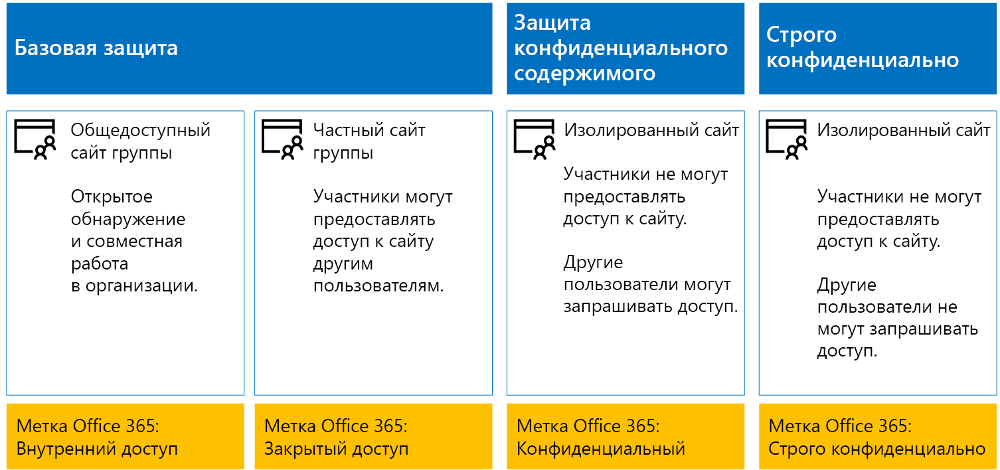
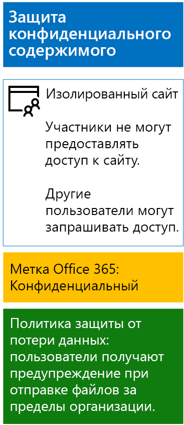
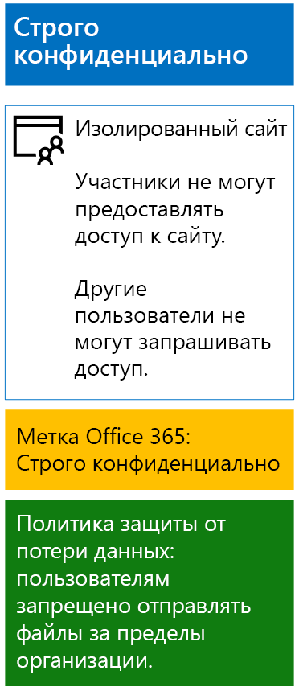

# <a name="protect-sharepoint-online-files-with-office-365-labels-and-dlp"></a><span data-ttu-id="caba5-103">Защита файлов SharePoint Online с помощью меток Office 365 и DLP</span><span class="sxs-lookup"><span data-stu-id="caba5-103">Protect files with Office 365 labels and DLP</span></span>

 <span data-ttu-id="caba5-104">**Сводка.** Применяйте метки Office 365 и политики защиты от потери данных для сайтов групп SharePoint Online с различными уровнями защиты информации.</span><span class="sxs-lookup"><span data-stu-id="caba5-104">**Summary:** Apply Office 365 labels and data loss prevention (DLP) policies for SharePoint Online team sites with various levels of information protection.</span></span>
  
<span data-ttu-id="caba5-p101">В этой статье описано создание и развертывание меток Office 365 и политик защиты от потери данных для базовых, конфиденциальных и строго конфиденциальных сайтов группы SharePoint Online. Дополнительные сведения об этих трех уровнях защиты см. в статье [Secure SharePoint Online sites and files](secure-sharepoint-online-sites-and-files.md).</span><span class="sxs-lookup"><span data-stu-id="caba5-p101">Use the steps in this article to design and deploy Office 365 labels and DLP policies for baseline, sensitive, and highly confidential SharePoint Online team sites. For more information about these three tiers of protection, see [Secure SharePoint Online sites and files](secure-sharepoint-online-sites-and-files.md).</span></span>
  
## <a name="office-365-labels-for-your-sharepoint-online-sites"></a><span data-ttu-id="caba5-107">Метки Office 365 для сайтов SharePoint Online</span><span class="sxs-lookup"><span data-stu-id="caba5-107">Office 365 labels for your SharePoint Online sites</span></span>

<span data-ttu-id="caba5-108">Существует три этапа создания и назначения меток Office 365 для сайтов группы SharePoint Online.</span><span class="sxs-lookup"><span data-stu-id="caba5-108">There are three phases to creating and then assigning Office 365 labels to SharePoint Online team sites.</span></span>
  
### <a name="phase-1-determine-the-office-365-label-names"></a><span data-ttu-id="caba5-109">Этап 1. Определение имен меток Office 365</span><span class="sxs-lookup"><span data-stu-id="caba5-109">Phase 1: Determine the Office 365 label names</span></span>

<span data-ttu-id="caba5-p102">На этом этапе нужно определить названия меток Office 365 для четырех уровней защиты информации, применяемых к сайтам группы SharePoint Online. В приведенной ниже таблице перечислены рекомендуемые имена для каждого уровня.</span><span class="sxs-lookup"><span data-stu-id="caba5-p102">In this phase, you determine the names of your Office 365 labels for the four levels of information protection applied to SharePoint Online team sites. The following table lists the recommended names for each level.</span></span>
  
|<span data-ttu-id="caba5-112">**Уровень защиты сайта группы SharePoint Online**</span><span class="sxs-lookup"><span data-stu-id="caba5-112">**SharePoint Online team site protection level**</span></span>|<span data-ttu-id="caba5-113">**Имя метки**</span><span class="sxs-lookup"><span data-stu-id="caba5-113">**Label name**</span></span>|
|:-----|:-----|
|<span data-ttu-id="caba5-114">Базовый общедоступный</span><span class="sxs-lookup"><span data-stu-id="caba5-114">Baseline-Public</span></span>  <br/> |<span data-ttu-id="caba5-115">Внутренний общедоступный</span><span class="sxs-lookup"><span data-stu-id="caba5-115">Internal public</span></span>  <br/> |
|<span data-ttu-id="caba5-116">Базовый частный</span><span class="sxs-lookup"><span data-stu-id="caba5-116">Baseline-Private</span></span>  <br/> |<span data-ttu-id="caba5-117">Private</span><span class="sxs-lookup"><span data-stu-id="caba5-117">Private</span></span>  <br/> |
|<span data-ttu-id="caba5-118">Конфиденциальный</span><span class="sxs-lookup"><span data-stu-id="caba5-118">Sensitive</span></span>  <br/> |<span data-ttu-id="caba5-119">Конфиденциальный</span><span class="sxs-lookup"><span data-stu-id="caba5-119">Sensitive</span></span>  <br/> |
|<span data-ttu-id="caba5-120">Строго конфиденциально</span><span class="sxs-lookup"><span data-stu-id="caba5-120">Highly Confidential</span></span>  <br/> |<span data-ttu-id="caba5-121">Строго конфиденциально</span><span class="sxs-lookup"><span data-stu-id="caba5-121">Highly Confidential</span></span>  <br/> |
   
### <a name="phase-2-create-the-office-365-labels"></a><span data-ttu-id="caba5-122">Этап 2. Создание меток Office 365</span><span class="sxs-lookup"><span data-stu-id="caba5-122">Phase 2: Create the Office 365 labels</span></span>

<span data-ttu-id="caba5-123">На этом этапе нужно создать и опубликовать определенные метки для разных уровней защиты информации.</span><span class="sxs-lookup"><span data-stu-id="caba5-123">In this phase, you create and then publish your determined labels for the different levels of information protection.</span></span>
  
<span data-ttu-id="caba5-124">Создать метки можно с помощью Microsoft PowerShell или Центра администрирования Office 365.</span><span class="sxs-lookup"><span data-stu-id="caba5-124">To create the labels, you can use the Office 365 Admin center or Microsoft PowerShell.</span></span>
  
### <a name="create-office-365-labels-with-the-office-365-admin-center"></a><span data-ttu-id="caba5-125">Создание меток Office 365 в Центре администрирования Office 365</span><span class="sxs-lookup"><span data-stu-id="caba5-125">Create Office 365 labels with the Office 365 Admin center</span></span>

1. <span data-ttu-id="caba5-p103">Войдите на портал Office 365, используя учетную запись с ролью администратора компании или администратора безопасности. Справочные сведения см. в статье [Вход в Office 365](https://support.office.com/Article/Where-to-sign-in-to-Office-365-e9eb7d51-5430-4929-91ab-6157c5a050b4).</span><span class="sxs-lookup"><span data-stu-id="caba5-p103">Sign in to the Office 365 portal with an account that has the Security Administrator or Company Administrator role. For help, see [Where to sign in to Office 365](https://support.office.com/Article/Where-to-sign-in-to-Office-365-e9eb7d51-5430-4929-91ab-6157c5a050b4).</span></span>
    
2. <span data-ttu-id="caba5-128">На вкладке **Домашняя страница Microsoft Office** щелкните плитку **Администрирование**.</span><span class="sxs-lookup"><span data-stu-id="caba5-128">From the **Microsoft Office Home** tab, click the **Admin** tile.</span></span>
    
3. <span data-ttu-id="caba5-129">На новой вкладке браузера **Центр администрирования Office** выберите **Центры администрирования > Безопасность и соответствие требованиям**.</span><span class="sxs-lookup"><span data-stu-id="caba5-129">From the new Office Admin center tab of your browser, click Admin centers > Security & Compliance.</span></span>
    
4. <span data-ttu-id="caba5-130">На новой вкладке браузера **Главная — Безопасность и соответствие требованиям** выберите **Классификации > Метки**.</span><span class="sxs-lookup"><span data-stu-id="caba5-130">From the new Home – Security & Compliance tab of your browser, click Classifications > Labels.</span></span>
    
5. <span data-ttu-id="caba5-131">В области **Главная > Метки** щелкните **Создать метку**.</span><span class="sxs-lookup"><span data-stu-id="caba5-131">From the **Home > Labels** pane, click **Create a label**.</span></span>
    
6. <span data-ttu-id="caba5-132">В области **Задайте имя для метки** введите название метки, а затем нажмите кнопку **Далее**.</span><span class="sxs-lookup"><span data-stu-id="caba5-132">On the **Name your label** pane, type the name of the label, and then click **Next**.</span></span>
    
7. <span data-ttu-id="caba5-133">В области **Параметры метки** нажмите кнопку **Далее**.</span><span class="sxs-lookup"><span data-stu-id="caba5-133">On the **Label settings** pane, click **Next**.</span></span>
    
8. <span data-ttu-id="caba5-134">В области **Проверьте параметры** нажмите **Создать эту метку**, а затем — кнопку **Закрыть**.</span><span class="sxs-lookup"><span data-stu-id="caba5-134">On the **Review your settings** pane, click **Create this label**, and then click **Close**.</span></span>
    
9. <span data-ttu-id="caba5-135">Повторите действия 5–8, чтобы создать дополнительные метки.</span><span class="sxs-lookup"><span data-stu-id="caba5-135">Repeat steps 5-8 for your additional labels.</span></span>
    
### <a name="create-office-365-labels-with-powershell"></a><span data-ttu-id="caba5-136">Создание меток Office 365 с помощью PowerShell</span><span class="sxs-lookup"><span data-stu-id="caba5-136">Create Office 365 labels with PowerShell</span></span>

1. <span data-ttu-id="caba5-137">[Подключитесь к Центру безопасности и соответствия требованиям Office 365 с помощью удаленного сеанса PowerShell](http://go.microsoft.com/fwlink/?LinkID=799771&amp;clcid=0x409) и укажите данные учетной записи, которой назначена роль администратора безопасности или роль администратора организации.</span><span class="sxs-lookup"><span data-stu-id="caba5-137">Connect to the Office 365 Security & Compliance Center using remote PowerShell and specify the credentials of an account that has the Security Administrator or Company Administrator role.</span></span>
    
2. <span data-ttu-id="caba5-138">Заполните список имен меток, а затем выполните эти команды в командной строке PowerShell:</span><span class="sxs-lookup"><span data-stu-id="caba5-138">Fill out the list of label names, and then run these commands at the PowerShell command prompt:</span></span>
    
  ```
  $labelNames=@(<list of label names, each enclosed in quotes and separated by commas>)
ForEach ($element in $labelNames){ New-ComplianceTag -Name $element }
  ```

<span data-ttu-id="caba5-139">Для публикации новых меток Office 365 выполните действия, указанные ниже.</span><span class="sxs-lookup"><span data-stu-id="caba5-139">Next, use these steps to publish the new Office 365 labels.</span></span>
  
1. <span data-ttu-id="caba5-140">В области **Главная > Метки** Центра безопасности и соответствия требованиям выберите **Опубликовать метки**.</span><span class="sxs-lookup"><span data-stu-id="caba5-140">From the Home > Labels pane the Security & Compliance Center, click Publish labels.</span></span>
    
2. <span data-ttu-id="caba5-141">В области **Выбор меток для публикации** щелкните **Выбрать метки для публикации**.</span><span class="sxs-lookup"><span data-stu-id="caba5-141">On the **Choose labels to publish** pane, click **Choose labels to publish**.</span></span>
    
3. <span data-ttu-id="caba5-142">В области **Выбор меток** нажмите кнопку **Добавить** и выберите все четыре метки.</span><span class="sxs-lookup"><span data-stu-id="caba5-142">On the **Choose labels** pane, click **Add** and select all four labels.</span></span>
    
4. <span data-ttu-id="caba5-143">Нажмите кнопку **Готово**.</span><span class="sxs-lookup"><span data-stu-id="caba5-143">Click **Done**.</span></span>
    
5. <span data-ttu-id="caba5-144">В области **Выбор меток для публикации** нажмите кнопку **Далее**.</span><span class="sxs-lookup"><span data-stu-id="caba5-144">On the **Choose labels to publish** pane, click **Next**.</span></span>
    
6. <span data-ttu-id="caba5-145">В области **Выбор расположений** нажмите кнопку **Далее**.</span><span class="sxs-lookup"><span data-stu-id="caba5-145">On the **Choose locations** pane, click **Next**.</span></span>
    
7. <span data-ttu-id="caba5-146">В области **Укажите имя для политики** введите название для своего набора меток в поле **Имя**, а затем нажмите кнопку **Далее**.</span><span class="sxs-lookup"><span data-stu-id="caba5-146">On the **Name your policy** pane, type a name for your set of labels in **Name**, and then click **Next**.</span></span>
    
8. <span data-ttu-id="caba5-147">В области **Проверьте настройки** выберите **Опубликовать метки** и нажмите кнопку **Закрыть**.</span><span class="sxs-lookup"><span data-stu-id="caba5-147">On the **Review your settings** pane, click **Publish labels**, and then click **Close**.</span></span>
    
### <a name="phase-3-apply-the-office-365-labels-to-your-sharepoint-online-sites"></a><span data-ttu-id="caba5-148">Этап 3. Применение меток Office 365 к сайтам SharePoint Online</span><span class="sxs-lookup"><span data-stu-id="caba5-148">Phase 3: Apply the Office 365 labels to your SharePoint Online sites</span></span>

<span data-ttu-id="caba5-149">Инструкции по применению меток Office 365 к папкам документов, размещенным на сайтах группы SharePoint Online, приведены ниже.</span><span class="sxs-lookup"><span data-stu-id="caba5-149">Use these steps to apply the Office 365 labels to the documents folders of your SharePoint Online team sites.</span></span>
  
1. <span data-ttu-id="caba5-150">На вкладке браузера **Главная (Microsoft Office)** щелкните плитку **SharePoint**.</span><span class="sxs-lookup"><span data-stu-id="caba5-150">From the **Microsoft Office Home** tab of your browser, click the **SharePoint** tile.</span></span>
    
2. <span data-ttu-id="caba5-151">На новой вкладке **SharePoint** в браузере выберите сайт, которому нужно назначить метку Office 365.</span><span class="sxs-lookup"><span data-stu-id="caba5-151">On the new **SharePoint** tab in your browser, click a site that needs an Office 365 label assigned.</span></span>
    
3. <span data-ttu-id="caba5-152">На новой вкладке SharePoint в браузере щелкните **Документы**.</span><span class="sxs-lookup"><span data-stu-id="caba5-152">In the new SharePoint site tab of your browser, click **Documents**.</span></span>
    
4. <span data-ttu-id="caba5-153">Щелкните значок параметров, а затем **Параметры библиотеки**.</span><span class="sxs-lookup"><span data-stu-id="caba5-153">Click the settings icon, and then click **Library settings**.</span></span>
    
5. <span data-ttu-id="caba5-154">В разделе **Разрешения и управление** нажмите **Применить метку к элементам в этой библиотеке**.</span><span class="sxs-lookup"><span data-stu-id="caba5-154">Under **Permissions and Management**, click **Apply label to items in this library**.</span></span>
    
6. <span data-ttu-id="caba5-155">В разделе **Параметры — применение метки** выберите соответствующую метку, а затем нажмите кнопку **Сохранить**.</span><span class="sxs-lookup"><span data-stu-id="caba5-155">In **Settings-Apply Label**, select the appropriate label, and then click **Save**.</span></span>
    
7. <span data-ttu-id="caba5-156">Закройте вкладку сайта SharePoint Online.</span><span class="sxs-lookup"><span data-stu-id="caba5-156">Close the tab for the SharePoint Online site.</span></span>
    
8. <span data-ttu-id="caba5-157">Повторите шаги с 3 по 8, чтобы назначить метки Office 365 для дополнительных сайтов SharePoint Online.</span><span class="sxs-lookup"><span data-stu-id="caba5-157">Repeat steps 3-8 to assign Office 365 labels to your additional SharePoint Online sites.</span></span>
    
<span data-ttu-id="caba5-158">Ниже показана итоговая конфигурация.</span><span class="sxs-lookup"><span data-stu-id="caba5-158">Here is your resulting configuration.</span></span>
  

  
## <a name="dlp-policies-for-your-sharepoint-online-sites"></a><span data-ttu-id="caba5-160">Политики защиты от потери данных для сайтов SharePoint Online</span><span class="sxs-lookup"><span data-stu-id="caba5-160">DLP policies for your SharePoint Online sites</span></span>

<span data-ttu-id="caba5-161">Выполните следующие действия, чтобы настроить политику защиты от потери данных, которая уведомляет пользователей, когда они совместно используют документы на конфиденциальном сайте группы SharePoint Online за пределами организации.</span><span class="sxs-lookup"><span data-stu-id="caba5-161">Use these steps to configure a DLP policy that notifies users when they share a document on a SharePoint Online sensitive team site outside the organization.</span></span>
  
1. <span data-ttu-id="caba5-162">На вкладке браузера **Домашняя страница Microsoft Office** щелкните плитку **Безопасность и соответствие требованиям**.</span><span class="sxs-lookup"><span data-stu-id="caba5-162">From the Microsoft Office Home tab in your browser, click the Security & Compliance tile.</span></span>
    
2. <span data-ttu-id="caba5-163">На новой вкладке **Безопасность и соответствие требованиям** выберите **Защита от потери данных > Политика**.</span><span class="sxs-lookup"><span data-stu-id="caba5-163">On the new Security & Compliance tab in your browser, click Data loss prevention > Policy.</span></span>
    
3. <span data-ttu-id="caba5-164">В области **Защита от потери данных** нажмите кнопку **+ Создать политику**.</span><span class="sxs-lookup"><span data-stu-id="caba5-164">In the **Data loss prevention** pane, click **+ Create a policy**.</span></span>
    
4. <span data-ttu-id="caba5-165">В области **Начните с шаблона или создайте настраиваемую политику** выберите **Настраиваемая**, а затем нажмите кнопку **Далее**.</span><span class="sxs-lookup"><span data-stu-id="caba5-165">In the **Start with a template or create a custom policy** pane, click **Custom**, and then click **Next**.</span></span>
    
5. <span data-ttu-id="caba5-166">В области **Укажите имя для политики** введите название для политики защиты от потери конфиденциальных данных в поле **Имя**, а затем нажмите кнопку **Далее**.</span><span class="sxs-lookup"><span data-stu-id="caba5-166">In the **Name your policy** pane, type the name for the sensitive level DLP policy in **Name**, and then click **Next**.</span></span>
    
6. <span data-ttu-id="caba5-167">В области **Выбор расположений** щелкните **Let me choose specific locations** (Предоставить мне выбор конкретных расположений) и нажмите кнопку **Далее**.</span><span class="sxs-lookup"><span data-stu-id="caba5-167">In the **Choose locations** pane, click **Let me choose specific locations**, and then click **Next**.</span></span>
    
7. <span data-ttu-id="caba5-168">В списке расположений отключите параметры **Электронная почта Exchange** и **Учетные записи OneDrive**, а затем нажмите кнопку **Далее**.</span><span class="sxs-lookup"><span data-stu-id="caba5-168">In the list of locations, disable the **Exchange email** and **OneDrive accounts** locations, and then click **Next**.</span></span>
    
8. <span data-ttu-id="caba5-169">В области **Customize the types of sensitive info you want to protect** (Настройка типов защищаемых конфиденциальных сведений) нажмите кнопку **Изменить**.</span><span class="sxs-lookup"><span data-stu-id="caba5-169">In the **Customize the types of sensitive info you want to protect** pane, click **Edit**.</span></span>
    
9. <span data-ttu-id="caba5-170">В области **Выбор типов содержимого для защиты** нажмите **Добавить** в раскрывающемся списке, а затем выберите **Метки**.</span><span class="sxs-lookup"><span data-stu-id="caba5-170">In the **Choose the types of content to protect** pane, click **Add** in the drop-down box, and then click **Labels**.</span></span>
    
10. <span data-ttu-id="caba5-171">В области **Метки** нажмите кнопку **+ Добавить**, укажите метку **Конфиденциальный** и выберите **Добавить** > **Готово**.</span><span class="sxs-lookup"><span data-stu-id="caba5-171">In the **Labels** pane, click **+ Add**, select the **Sensitive** label, click **Add**, and then click **Done**.</span></span>
    
11. <span data-ttu-id="caba5-172">В области **Choose the types of content to protect** (Выбор типов защищаемого содержимого) нажмите кнопку **Сохранить**.</span><span class="sxs-lookup"><span data-stu-id="caba5-172">In the **Choose the types of content to protect** pane, click **Save**.</span></span>
    
12. <span data-ttu-id="caba5-173">В области **Customize the types of sensitive info you want to protect** (Настройка типов защищаемых конфиденциальных сведений) нажмите кнопку **Далее**.</span><span class="sxs-lookup"><span data-stu-id="caba5-173">In the **Customize the types of sensitive info you want to protect** pane, click **Next**.</span></span>
    
13. <span data-ttu-id="caba5-174">В области **What do you want to do if we detect sensitive info?** (Что делать при обнаружении конфиденциальной информации?) щелкните **Customize the tip and email** (Настроить подсказки и уведомления по электронной почте).</span><span class="sxs-lookup"><span data-stu-id="caba5-174">In the **What do you want to do if we detect sensitive info?** pane, click **Customize the tip and email**.</span></span>
    
14. <span data-ttu-id="caba5-175">В области **Customize policy tips and email notifications** (Настройка подсказок политики и уведомления по электронной почте) щелкните **Customize the policy tip text** (Настроить текст подсказки политики).</span><span class="sxs-lookup"><span data-stu-id="caba5-175">In the **Customize policy tips and email notifications** pane, click **Customize the policy tip text**.</span></span>
    
15. <span data-ttu-id="caba5-176">В текстовом поле введите или вставьте следующее:</span><span class="sxs-lookup"><span data-stu-id="caba5-176">In the text box, type or paste in the following:</span></span>
    
  - <span data-ttu-id="caba5-p104">Чтобы предоставить доступ пользователю за пределами организации, скачайте файл и откройте его. Выберите пункты "Файл > Защитить документ > Зашифровать паролем", а затем укажите надежный пароль. Отправьте пароль в отдельном сообщении или с помощью других средств связи.</span><span class="sxs-lookup"><span data-stu-id="caba5-p104">To share with a user outside the organization, download the file and then open it. Click File, then Protect Document, and then Encrypt with Password, and then specify a strong password. Send the password in a separate email or other means of communication.</span></span>
    
    <span data-ttu-id="caba5-180">Вы также можете ввести или вставить, скопировав, собственную подсказку политики, которая укажет пользователям, как делиться файлом с людьми за пределами организации.</span><span class="sxs-lookup"><span data-stu-id="caba5-180">Alternately, type or paste in your own policy tip that instructs users on how to share a file outside your organization.</span></span>
    
16. <span data-ttu-id="caba5-181">Нажмите кнопку **ОК**.</span><span class="sxs-lookup"><span data-stu-id="caba5-181">Click **OK**.</span></span>
    
17. <span data-ttu-id="caba5-182">В области **Что делать при обнаружении конфиденциальной информации?** снимите флажки **Запретить пользователям делиться контентом и ограничить доступ к совместно используемому содержимому**, а затем нажмите кнопку **Далее**.</span><span class="sxs-lookup"><span data-stu-id="caba5-182">In the **What do you want to do if we detect sensitive info?** pane, clear the **Block people from sharing, and restrict access to shared content** check box, and then click **Next**.</span></span>
    
18. <span data-ttu-id="caba5-183">В области **Включить политику или сначала протестировать ее?** выберите пункт **Да, включить ее сразу**, а затем нажмите кнопку **Далее**.</span><span class="sxs-lookup"><span data-stu-id="caba5-183">In the **Do you want to turn on the policy or test things out first?** pane, click **Yes, turn it on right away**, and then click **Next**.</span></span>
    
19. <span data-ttu-id="caba5-184">В области **Проверка параметров** нажмите **Создать**, а затем нажмите кнопку **Закрыть**.</span><span class="sxs-lookup"><span data-stu-id="caba5-184">In the **Review your settings** pane, click **Create**, and then click **Close**.</span></span>
    
<span data-ttu-id="caba5-185">Здесь показана итоговая конфигурация для конфиденциальных сайтов групп SharePoint Online.</span><span class="sxs-lookup"><span data-stu-id="caba5-185">Here is your resulting configuration for sensitive SharePoint Online team sites.</span></span>
  

  
<span data-ttu-id="caba5-187">Выполните следующие действия, чтобы настроить политику защиты от потери данных, которая блокирует пользователей, когда они совместно используют документы на строго конфиденциальном сайте группы SharePoint Online за пределами организации.</span><span class="sxs-lookup"><span data-stu-id="caba5-187">Next, use these steps to configure a DLP policy that blocks users when they share a document on a SharePoint Online highly confidential team site outside the organization.</span></span>
  
1. <span data-ttu-id="caba5-188">На вкладке браузера **Домашняя страница Microsoft Office** щелкните плитку **Безопасность и соответствие требованиям**.</span><span class="sxs-lookup"><span data-stu-id="caba5-188">From the Microsoft Office Home tab in your browser, click the Security & Compliance tile.</span></span>
    
2. <span data-ttu-id="caba5-189">На новой вкладке **Безопасность и соответствие требованиям** выберите **Защита от потери данных > Политика**.</span><span class="sxs-lookup"><span data-stu-id="caba5-189">On the new Security & Compliance tab in your browser, click Data loss prevention > Policy.</span></span>
    
3. <span data-ttu-id="caba5-190">В области **Защита от потери данных** нажмите кнопку **+ Создать политику**.</span><span class="sxs-lookup"><span data-stu-id="caba5-190">In the **Data loss prevention** pane, click **+ Create a policy**.</span></span>
    
4. <span data-ttu-id="caba5-191">В области **Начните с шаблона или создайте настраиваемую политику** выберите **Настраиваемая**, а затем нажмите кнопку **Далее**.</span><span class="sxs-lookup"><span data-stu-id="caba5-191">In the **Start with a template or create a custom policy** pane, click **Custom**, and then click **Next**.</span></span>
    
5. <span data-ttu-id="caba5-192">В области **Укажите имя для политики** введите название для политики защиты от потери строго конфиденциальных данных в поле **Имя**, а затем нажмите кнопку **Далее**.</span><span class="sxs-lookup"><span data-stu-id="caba5-192">In the **Name your policy** pane, type the name for the highly sensitive level DLP policy in **Name**, and then click **Next**.</span></span>
    
6. <span data-ttu-id="caba5-193">В области **Выбор расположений** щелкните **Let me choose specific locations** (Предоставить мне выбор конкретных расположений) и нажмите кнопку **Далее**.</span><span class="sxs-lookup"><span data-stu-id="caba5-193">In the **Choose locations** pane, click **Let me choose specific locations**, and then click **Next**.</span></span>
    
7. <span data-ttu-id="caba5-194">В списке расположений отключите параметры **Электронная почта Exchange** и **Учетные записи OneDrive**, а затем нажмите кнопку **Далее**.</span><span class="sxs-lookup"><span data-stu-id="caba5-194">In the list of locations, disable the **Exchange email** and **OneDrive accounts** locations, and then click **Next**.</span></span>
    
8. <span data-ttu-id="caba5-195">В области **Customize the types of sensitive info you want to protect** (Настройка типов защищаемых конфиденциальных сведений) нажмите кнопку **Изменить**.</span><span class="sxs-lookup"><span data-stu-id="caba5-195">In the **Customize the types of sensitive info you want to protect** pane, click **Edit**.</span></span>
    
9. <span data-ttu-id="caba5-196">В области **Выбор типов содержимого для защиты** нажмите **Добавить** в раскрывающемся списке, а затем выберите **Метки**.</span><span class="sxs-lookup"><span data-stu-id="caba5-196">In the **Choose the types of content to protect** pane, click **Add** in the drop-down box, and then click **Labels**.</span></span>
    
10. <span data-ttu-id="caba5-197">В области **Метки** нажмите кнопку **+ Добавить**, выберите метку **Строго конфиденциально**, нажмите **Добавить**, а затем нажмите кнопку **Готово**.</span><span class="sxs-lookup"><span data-stu-id="caba5-197">In the **Labels** pane, click **+ Add**, select the **Highly Confidential** label, click **Add**, and then click **Done**.</span></span>
    
11. <span data-ttu-id="caba5-198">В области **Choose the types of content to protect** (Выбор типов защищаемого содержимого) нажмите кнопку **Сохранить**.</span><span class="sxs-lookup"><span data-stu-id="caba5-198">In the **Choose the types of content to protect** pane, click **Save**.</span></span>
    
12. <span data-ttu-id="caba5-199">В области **Customize the types of sensitive info you want to protect** (Настройка типов защищаемых конфиденциальных сведений) нажмите кнопку **Далее**.</span><span class="sxs-lookup"><span data-stu-id="caba5-199">In the **Customize the types of sensitive info you want to protect** pane, click **Next**.</span></span>
    
13. <span data-ttu-id="caba5-200">В области **What do you want to do if we detect sensitive info?** (Что делать при обнаружении конфиденциальной информации?) щелкните **Customize the tip and email** (Настроить подсказки и уведомления по электронной почте).</span><span class="sxs-lookup"><span data-stu-id="caba5-200">In the **What do you want to do if we detect sensitive info?** pane, click **Customize the tip and email**.</span></span>
    
14. <span data-ttu-id="caba5-201">В области **Customize policy tips and email notifications** (Настройка подсказок политики и уведомления по электронной почте) щелкните **Customize the policy tip text** (Настроить текст подсказки политики).</span><span class="sxs-lookup"><span data-stu-id="caba5-201">In the **Customize policy tips and email notifications** pane, click **Customize the policy tip text**.</span></span>
    
15. <span data-ttu-id="caba5-202">В текстовом поле введите или вставьте следующее:</span><span class="sxs-lookup"><span data-stu-id="caba5-202">In the text box, type or paste in the following:</span></span>
    
  - <span data-ttu-id="caba5-p105">Чтобы предоставить доступ пользователю за пределами организации, скачайте файл и откройте его. Выберите пункты "Файл > Защитить документ > Зашифровать паролем", а затем укажите надежный пароль. Отправьте пароль в отдельном сообщении или с помощью других средств связи.</span><span class="sxs-lookup"><span data-stu-id="caba5-p105">To share with a user outside the organization, download the file and then open it. Click File, then Protect Document, and then Encrypt with Password, and then specify a strong password. Send the password in a separate email or other means of communication.</span></span>
    
    <span data-ttu-id="caba5-206">Вы также можете ввести или вставить, скопировав, собственную подсказку политики, которая укажет пользователям, как делиться файлом с людьми за пределами организации.</span><span class="sxs-lookup"><span data-stu-id="caba5-206">Alternately, type or paste in your own policy tip that instructs users on how to share a file outside your organization.</span></span>
    
16. <span data-ttu-id="caba5-207">Нажмите кнопку **ОК**.</span><span class="sxs-lookup"><span data-stu-id="caba5-207">Click **OK**.</span></span>
    
17. <span data-ttu-id="caba5-208">В области **Что делать при обнаружении конфиденциальной информации?** выберите **Требовать коммерческое обоснование для переопределения**, а затем нажмите кнопку **Далее**.</span><span class="sxs-lookup"><span data-stu-id="caba5-208">In the **What do you want to do if we detect sensitive info?** pane, select **Require a business justification to override**, and then click **Next**.</span></span>
    
18. <span data-ttu-id="caba5-209">В области **Включить политику или сначала протестировать ее?** выберите пункт **Да, включить ее сразу**, а затем нажмите кнопку **Далее**.</span><span class="sxs-lookup"><span data-stu-id="caba5-209">In the **Do you want to turn on the policy or test things out first?** pane, click **Yes, turn it on right away**, and then click **Next**.</span></span>
    
19. <span data-ttu-id="caba5-210">В области **Проверка параметров** нажмите **Создать**, а затем нажмите кнопку **Закрыть**.</span><span class="sxs-lookup"><span data-stu-id="caba5-210">In the **Review your settings** pane, click **Create**, and then click **Close**.</span></span>
    
<span data-ttu-id="caba5-211">Ниже показана итоговая конфигурация для строго конфиденциальных сайтов групп SharePoint Online.</span><span class="sxs-lookup"><span data-stu-id="caba5-211">Here is your resulting configuration for high confidentiality SharePoint Online team sites.</span></span>
  

  
## <a name="next-step"></a><span data-ttu-id="caba5-213">Следующий шаг</span><span class="sxs-lookup"><span data-stu-id="caba5-213">Next step</span></span>

[<span data-ttu-id="caba5-214">Защита файлов SharePoint Online с помощью Azure Information Protection</span><span class="sxs-lookup"><span data-stu-id="caba5-214">Protect SharePoint Online files with Azure Information Protection</span></span>](protect-sharepoint-online-files-with-azure-information-protection.md)
    
## <a name="see-also"></a><span data-ttu-id="caba5-215">См. также</span><span class="sxs-lookup"><span data-stu-id="caba5-215">See Also</span></span>

[<span data-ttu-id="caba5-216">Безопасность сайтов и файлов SharePoint Online</span><span class="sxs-lookup"><span data-stu-id="caba5-216">Secure SharePoint Online sites and files</span></span>](secure-sharepoint-online-sites-and-files.md)
  
[<span data-ttu-id="caba5-217">Защита сайтов SharePoint Online в среде разработки и тестирования</span><span class="sxs-lookup"><span data-stu-id="caba5-217">Secure SharePoint Online sites in a dev/test environment</span></span>](secure-sharepoint-online-sites-in-a-dev-test-environment.md)
  
[<span data-ttu-id="caba5-218">Руководство по безопасности (Майкрософт) для политических кампаний, некоммерческих и других динамических организаций</span><span class="sxs-lookup"><span data-stu-id="caba5-218">Microsoft Security Guidance for Political Campaigns, Nonprofits, and Other Agile Organizations</span></span>](microsoft-security-guidance-for-political-campaigns-nonprofits-and-other-agile-o.md)
  
[<span data-ttu-id="caba5-219">Освоение облака и гибридные решения</span><span class="sxs-lookup"><span data-stu-id="caba5-219">Cloud adoption and hybrid solutions</span></span>](cloud-adoption-and-hybrid-solutions.md)


