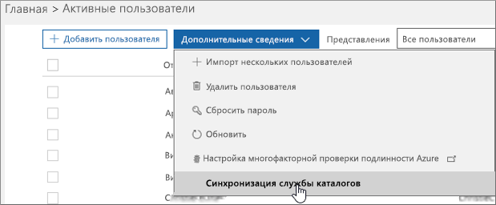

# Настройка синхронизации каталогов для Office 365Set up directory synchronization for Office 365

В Office 365 для управления пользователями используется облачная служба управления удостоверениями Azure Active Directory. Вы также можете интегрировать локальную службу Active Directory с Azure AD, синхронизируя локальную среду с Office 365. После настройки синхронизации можно использовать проверку подлинности пользователей в Azure AD или в локальном каталоге.Office 365 uses the cloud-based user identity management service Azure Active Directory to manage users. You can also integrate your on-premises Active Directory with Azure AD by synchronizing your on-premises environment with Office 365. Once you set up synchronization you can decide to have their user authentication take place within Azure AD or within your on-premises directory.
  
## Синхронизация каталогов Office 365Office 365 directory synchronization

Вы можете использовать синхронизированное удостоверение или федеративный идентификатор между локальной организацией и Office 365. С помощью синхронизированного удостоверения вы управляете локальными пользователями и проходят проверку подлинности с помощью Azure AD, когда они используют один и тот же пароль в облаке в локальной среде. Это наиболее распространенный сценарий синхронизации каталогов. Сквозная проверка подлинности или федеративного удостоверения позволяет управлять локальными пользователями и проходить их проверку подлинности в локальном каталоге. Для федеративного удостоверения требуется дополнительная настройка, и пользователи могут выполнять только один вход. Для получения дополнительных сведений ознакомьтесь со сведениями [об удостоверенИи Office 365 и Azure Active Directory](about-office-365-identity.md).You can either use synchronized identity or federated identity between your on-premises organization and Office 365. With synchronized identity, you manage your users on-premises, and they are authenticated by Azure AD when they use the same password in the cloud as on-premises. This is the most common directory synchronization scenario. Pass-through authentication or Federated identity, allows you to manage your users on-premises and they are authenticated by your on-premises directory. Federated identity requires additional configuration and enables your users to only sign in once. For details, read [Understanding Office 365 Identity and Azure Active Directory](about-office-365-identity.md).
  
## Хотите обновить синхронизацию с Windows Azure Active Directory (DirSync) до Azure Active Directory Connect?Want to upgrade from Windows Azure Active Directory sync (DirSync) to Azure Active Directory Connect?

Если вы используете DirSync и хотите выполнить обновление, перейдите к [Azure.com](https://azure.com) для [получения инструкций](https://go.microsoft.com/fwlink/p/?LinkId=733240)по обновлению.If you are currently using DirSync and want to upgrade, head over to [azure.com](https://azure.com) for [upgrade instructions](https://go.microsoft.com/fwlink/p/?LinkId=733240).
  
## Необходимые условия для Azure AD ConnectPrerequisites for Azure AD Connect

Вы получаете бесплатную подписку на Azure AD с вашей подпиской на Office 365. Когда вы настраиваете синхронизацию службы каталогов, вы сможете установить Azure Active Directory Connect на одном из локальных серверов.You get a free subscription to Azure AD with your Office 365 subscription. When you set up directory synchronization, you will install Azure Active Directory Connect on one of your on-premises servers.
  
Для Office 365 вам потребуется выполнить следующие действия:For Office 365 you will need to:
  
- Проверка локального домена (процедура поможет вам выполнить указанные ниже действия).Verify your on-premises domain (the procedure will guide you through this).
- [Назначьте роли администратора в office 365 для бизнес](https://support.office.com/article/EAC4D046-1AFD-4F1A-85FC-8219C79E1504) -разрешений для клиента Office 365 и локального каталога Active Directory.Have [Assign admin roles in Office 365 for business](https://support.office.com/article/EAC4D046-1AFD-4F1A-85FC-8219C79E1504) permissions for your Office 365 tenant and on-premises Active Directory.

Для локального сервера, на котором вы устанавливаете Azure AD Connect, вам потребуется следующее программное обеспечение:For your on-premises server on which you install Azure AD Connect you will need the following software:
  
|**Серверная операционная система****Server OS**|\*\*другое программное обеспечение. \*\***Other software**|
|:-----|:-----|
|**Windows Server 2012 R2****Windows Server 2012 R2** | -PowerShell устанавливается по умолчанию, никакие действия не требуются.- PowerShell is installed by default, no action is required.    – NET 4.5.1 и более поздние версии предлагаются через обновление Windows. Убедитесь, что установлены последние обновления для Windows Server на панели управления.- Net 4.5.1 and later releases are offered through Windows Update. Make sure you have installed the latest updates to Windows Server in the Control Panel. |
|**Windows server 2008 R2 с пакетом обновления 1 (SP1)** или **Windows Server 2012****Windows Server 2008 R2 with Service Pack 1 (SP1)** or **Windows Server 2012** | — Последняя версия PowerShell доступна в Windows Management Framework 4,0. Выполните поиск в [центре загрузки Майкрософт](https://go.microsoft.com/fwlink/p/?LinkId=717996).- The latest version of PowerShell is available in Windows Management Framework 4.0. Search for it on [Microsoft Download Center](https://go.microsoft.com/fwlink/p/?LinkId=717996).    .NET 4.5.1 и более поздние версии доступны в [центре загрузки Майкрософт](https://go.microsoft.com/fwlink/p/?LinkId=717996).- .Net 4.5.1 and later releases are available on [Microsoft Download Center](https://go.microsoft.com/fwlink/p/?LinkId=717996). |
|**Windows Server 2008****Windows Server 2008** | -Последняя поддерживаемая версия PowerShell доступна в Windows Management Framework 3,0, которая доступна в [центре загрузки Майкрософт](https://go.microsoft.com/fwlink/p/?LinkId=717996).- The latest supported version of PowerShell is available in Windows Management Framework 3.0, available on [Microsoft Download Center](https://go.microsoft.com/fwlink/p/?LinkId=717996).    .NET 4.5.1 и более поздние версии доступны в [центре загрузки Майкрософт](https://go.microsoft.com/fwlink/p/?LinkId=717996).- .Net 4.5.1 and later releases are available on [Microsoft Download Center](https://go.microsoft.com/fwlink/p/?LinkId=717996). |

> [!NOTE]
> Если вы используете Azure Active Directory DirSync, максимальное число членов группы рассылки, которые можно синхронизировать из локального каталога Active Directory с Azure Active Directory, — 15 000. Для Azure AD Connect это число равно 50 000.If you're using Azure Active Directory DirSync, the maximum number of distribution group members that you can synchronize from your on-premises Active Directory to Azure Active Directory is 15,000. For Azure AD Connect, that number is 50,000. 
  
Чтобы тщательно проанализировать требования к оборудованию, программному обеспечению, учетным записям и разрешениям, требования к сертификатам SSL и ограничению объектов для Azure AD Connect, прочитайте [необходимые компоненты для Azure Active Directory Connect](https://go.microsoft.com/fwlink/p/?LinkId=716896).To more carefully review hardware, software, account and permissions requirements, SSL certificate requirements, and object limits for Azure AD Connect, read [Prerequisites for Azure Active Directory Connect](https://go.microsoft.com/fwlink/p/?LinkId=716896).
  
Вы также можете ознакомиться с журналом выпусков для [версии](https://docs.microsoft.com/azure/active-directory/hybrid/reference-connect-version-history) Azure AD Connect, чтобы узнать, какие из них включены и исправлены в каждом выпуске.You can also review the Azure AD Connect [version release history](https://docs.microsoft.com/azure/active-directory/hybrid/reference-connect-version-history) to see what is included and fixed in each release.

## Настройка синхронизации службы каталоговTo set up directory synchronization

1. войдите в центр администрирования Office 365 и выберите **пользователи** \> **активные пользователи** на левой панели навигации.Sign in to the Office 365 admin center and choose **Users** \> **Active Users** on the left navigation.
2. в центре администрирования Office 365 на странице **активные пользователи** выберите пункт **больше** \> **синхронизации службы каталогов**.In the Office 365 admin center, on the **Active users** page, choose **More** \> **Directory synchronization**.

    
  
3. На странице " **Подготовка Active Directory** " выберите ссылку **скачать средство Microsoft Azure Active Directory Connect** , чтобы приступить к работе. Дополнительные сведения о процессе установки Azure Active Directory Connect можно найти в статье [план установки Azure AD Connect и Azure AD Connect Health](https://docs.microsoft.com/azure/active-directory/hybrid/how-to-connect-install-roadmap).On the **Active Directory preparation** page, select the **Download Microsoft Azure Active Directory Connect tool** link to get started. For more information about the Azure Active Directory Connect installation process, see [Azure AD Connect and Azure AD Connect Health installation roadmap](https://docs.microsoft.com/azure/active-directory/hybrid/how-to-connect-install-roadmap).

## Назначение лицензий синхронизированным пользователямAssign licenses to synchronized users

После синхронизации пользователей с Office 365 они будут созданы, но вам нужно назначить им лицензии, чтобы они могли использовать функции Office 365, такие как почта. Инструкции приведены в статье [Назначение лицензий пользователям в Office 365 для бизнеса](https://support.office.com/article/997596b5-4173-4627-b915-36abac6786dc).After you have synchronized your users to Office 365, they are created but you need to assign licenses to them so they can use Office 365 features, such as mail. For instructions, see [Assign licenses to users in Office 365 for business](https://support.office.com/article/997596b5-4173-4627-b915-36abac6786dc).

## Завершение настройки доменовFinish setting up domains

Выполните действия, описанные в статье [CREATE DNS Records for Office 365, когда вы управляете записями DNS](https://support.office.com/article/b0f3fdca-8a80-4e8e-9ef3-61e8a2a9ab23) для завершения настройки доменов.Follow the steps in [Create DNS records for Office 365 when you manage your DNS records](https://support.office.com/article/b0f3fdca-8a80-4e8e-9ef3-61e8a2a9ab23) to finish setting up your domains.