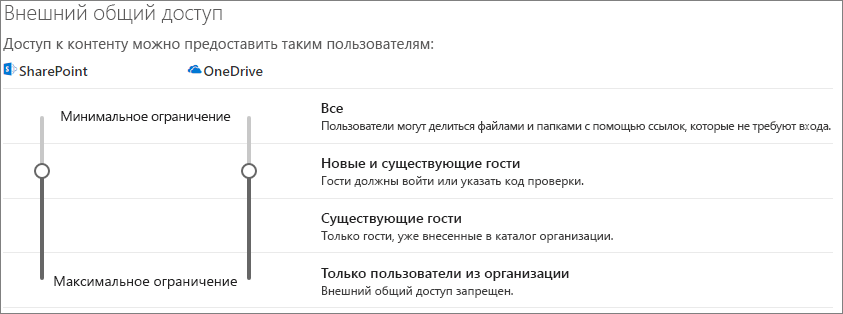
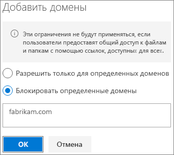

# Ограничение возможности случайного раскрытия файлов при предоставлении доступа гостямLimit accidental exposure to files when sharing with guests

Существует множество вариантов, позволяющих сократить вероятность случайного раскрытия конфиденциальной информации при предоставлении гостям общего доступа к файлам и папкам.When sharing files and folders with guests, there are a variety of options to reduce the chances of accidentally sharing confidential information. Чтобы обеспечить соответствие требованиям вашей организации, можете выбрать один из описанных в этой статье вариантов.You can choose from the options in this article to best meet the needs of your organization.

## Следуйте рекомендациям для ссылок типа "Любой пользователь"Use best practices for Anyone links

Если сотрудникам вашей организации требуется предоставлять анонимный доступ, но вас беспокоит, что пользователи, не прошедшие проверку подлинности, могут изменять содержимое, см. [рекомендации по анонимному доступу](best-practices-anonymous-sharing.md), чтобы узнать, как эту возможность реализовать в организации.If people in your organization need to do anonymous sharing, but you're concerned about unauthenticated guests modifying content, read [Best practices for anonymous sharing](best-practices-anonymous-sharing.md) for guidance on how to work with anonymous sharing in your organization.

## Отключение ссылок типа "Любой пользователь"Turn off Anyone links

Рекомендуем оставить тип ссылок *Любой пользователь* включенным для соответствующего содержимого, так как это самый простой способ предоставления общего доступа, который помогает снизить риск применения других решений, неконтролируемых вашим ИТ-отделом.We recommend leaving *Anyone* links enabled for appropriate content because it's the easiest way to share and can help reduce the risk of users seeking other solutions that are outside the control of your IT department. Ссылки типа *Любой пользователь* можно пересылать другим, но доступ к файлам предоставляется только тем, у кого есть ссылка.*Anyone* links can be forwarded to others, but file access is only available to those who have the link.

Если вы хотите, чтобы гости проходили проверку подлинности каждый раз при получении доступа к файлам в SharePoint, компоненту "Группы" или Teams, отключите предоставление доступа типа *Любой пользователь*.If you always want guests to authenticate when accessing content in SharePoint, Groups, or Teams, you can turn off *Anyone* sharing. В результате пользователи не смогут получать анонимный доступ к содержимому.This will prevent users from sharing content anonymously.

Если отключить ссылки типа *Любой пользователь*, пользователи все еще смогут легко предоставлять гостям доступ к файлам с помощью ссылок типа *Определенные пользователи*.If you disable *Anyone* links, users can still easily share with guests using *Specific people* links. В этом случае, чтобы гости могли получить доступ к предоставленному содержимому, им потребуется пройти проверку подлинности.In this case, all guests will be required to authenticate before they can access the shared content.

При необходимости можно отключить тип ссылок *Любой пользователь* для определенных сайтов или для всей организации.Depending on your needs, you can disable *Anyone* links for specific sites, or for your whole organization.

Отключение типа ссылок *Любой пользователь* для организацииTo turn off *Anyone* links for your organization
1. Откройте Центр администрирования SharePoint и на панели навигации слева нажмите кнопку **Доступ**.In the SharePoint Online admin center, in the left navigation, click **configure hybrid**.
2. В настройках внешнего общего доступа к SharePoint задайте значение **Новые и существующие гости**.Set the SharePoint external sharing settings to **New and existing guests**. 
   
3. Нажмите кнопку **Сохранить**.Click **Save**.

Отключение типа ссылок *Любой пользователь* для сайтаTo turn off *Anyone* links for a site
1. Откройте Центр администрирования SharePoint, затем на панели навигации слева разверните меню **Сайты** и нажмите **Активные сайты**.In the SharePoint admin center, in the left navigation, expand **Sites** and click **Active sites**.
2. Выберите сайт для команды, которую вы только что создали.Select the site for the team that you just created.
3. На ленте выберите **Доступ**.In the ribbon, click **New**.
4. В настройках общего доступа задайте значение **Новые и существующие гости**.Ensure that sharing is set to **New and existing guests**. 
   
5. Если внесены изменения, нажмите кнопку **Сохранить**.If you make any changes, click **Save**.

## Фильтрация доменовDomain filtering

Чтобы определить домены, из которых пользователи могут приглашать гостей, можно добавить списки разрешенных и запрещенных доменов.You can use domain allow or deny lists to determine which domains your users can invite guests from.

В списке разрешений можно указать список доменов, из которых пользователи в вашей организации могут приглашать гостей.With an allow list, you can specify a list of domains from which users in your organization can invite guests. Приглашение гостей в другие домены заблокировано.Guest invitations to other domains are blocked. Если ваша организация взаимодействует только с гостями из списка указанных доменов, эта возможность позволит предотвратить доступ из других доменов.If your organization only collaborates with guests from a list of specific domains, you can use this feature to prevent sharing with other domains.

В списке запретов можно указать список доменов, из которых пользователи в вашей организации не могут приглашать гостей.With a deny list, you can specify a list of domains from which users in your organization cannot invite guests. Приглашение гостей в указанные домены заблокировано.Guest invitations to the listed domains are blocked. К примеру, это может быть полезно, если у вас есть конкуренты, которые не должны стать гостями в вашей организации.This can be useful if you have competitors, for example, who you want to prevent from becoming guests in your organization.

Списки разрешенных и запрещенных доменов касаются только предоставления доступа гостям, прошедшим проверку подлинности.The allow and deny lists only affect sharing with authenticated guests. Пользователи смогут предоставлять доступ гостям из запрещенных доменов с помощью ссылок типа *Любой пользователь*, если вы их не отключите.Users can still share with guests from prohibited domains by using *Anyone* links if you haven't disabled them. Чтобы списки разрешенных и запрещенных доменов выполняли свою функцию должным образом, отключите ссылки типа *Любой пользователь*, как описано выше.For best results with domain allow and deny lists, consider disabling *Anyone* links as described above.

Настройка списка разрешенных и запрещенных доменов для предоставления доступа гостямTo set up a domain allow or deny list for guest sharing
1. Откройте Центр администрирования SharePoint и на панели навигации слева нажмите кнопку **Доступ**.In the SharePoint Online admin center, in the left navigation, click **configure hybrid**.
2. В разделе **Дополнительные параметры для внешнего общего доступа** установите флажок **Ограничение внешнего общего доступа по домену**.Under **Advanced settings for external sharing**, select the **Limit external sharing by domain** check box.
3. Нажмите кнопку **Добавить домены**.Click **Add domains**.
4. Укажите, нужно ли блокировать домены, введите имена доменов и нажмите кнопку **ОК**.Select whether you want to block domains, type the domains, and click **OK**. 
   
5. Нажмите кнопку **Сохранить**.Click **Save**.

Если вы хотите ограничить предоставление общего доступа по домену на более высоком уровне, чем в SharePoint и OneDrive, вы можете [разрешить или заблокировать приглашения для пользователей B2B из определенных организаций](https://docs.microsoft.com/azure/active-directory/b2b/allow-deny-list) в Azure Active Directory.If you want to limit sharing by domain at a higher level than SharePoint and OneDrive, you can [allow or block invitations to B2B users from specific organizations](https://docs.microsoft.com/azure/active-directory/b2b/allow-deny-list) in Azure Active Directory. Необходимо настроить [интеграцию SharePoint и OneDrive с Azure AD B2B (предварительная версия)](https://docs.microsoft.com/sharepoint/sharepoint-azureb2b-integration-preview), чтобы эти параметры повлияли на SharePoint и OneDrive.(You must configure the [SharePoint and OneDrive integration with Azure AD B2B Preview](https://docs.microsoft.com/sharepoint/sharepoint-azureb2b-integration-preview) for these settings to affect SharePoint and OneDrive.)

## Ограничение доступа гостей к файлам, папкам и сайтам определенными группами безопасностиLimit guest sharing of files, folders, and sites to specified security groups

Вы можете ограничить доступ гостей к файлам, папкам и сайтам, разрешив его только для участников определенной группы безопасности.You can restrict guest sharing of files, folders, and sites to members of a specific security group. Это полезно, если вы хотите включить доступ для гостей, но с использованием рабочего процесса утверждения или отправки запроса.This is useful if you want to enable guest sharing, but with an approval workflow or request process.

Ограничение доступа гостей группой безопасностиTo limit guest sharing to members of a security group
1. Откройте Центр администрирования SharePoint и на панели навигации слева нажмите кнопку **Доступ**.In the SharePoint Online admin center, in the left navigation, click **configure hybrid**.
2. В разделе **Другие параметры**Under **Other settings**. щелкните ссылку **Ограничить внешний общий доступ определенными группами безопасности**.follow the **Limit external sharing to specific security groups** link.
3. В разделе **Кто может предоставлять общий доступ пользователям за пределами вашей организации** установите один или оба указанных далее флажка.Under **Who can share outside your organization**, select one or both of the check boxes: a. **Разрешить только пользователям из выбранных групп безопасности предоставлять общий доступ внешним пользователям, прошедшим проверку подлинности** позволяет указать группу безопасности, которая может предоставлять доступ пользователям, прошедшим проверку подлинности.**Let only users in selected security groups share with authenticated external users** to specify a security group that can share with authenticated users b. **Разрешить только пользователям из выбранных групп безопасности предоставлять общий доступ внешним пользователям, прошедшим проверку подлинности, и использовать ссылки для анонимного доступа** позволяет указать группу безопасности, которая может предоставлять доступ пользователям, прошедшим проверку подлинности, и отправлять ссылки "Любой пользователь".**Let only users in selected security groups share with authenticated external users and using anonymous links** to specify a security group that can share with authenticated users and by using Anyone links
4. Нажмите кнопку **ОК**.Click **OK**.

Обратите внимание, что это относится к файлам, папкам и сайтам, но не к группам Office 365 или Teams.Note that this affects files, folders, and sites, but not Office 365 groups or Teams. Когда участники приглашают гостей в закрытую группу Office 365 или закрытую команду в Microsoft Teams, приглашение отправляется владельцу группы или команды для утверждения.When members invite guests to a private Office 365 group or a private team in Microsoft Teams, the invitation is sent to the group or team owner for approval.

## См. такжеSee Also

[Создание безопасной среды гостевого доступаCreate a secure guest sharing environment](create-a-secure-guest-sharing-environment.md)

[Рекомендации по предоставлению общего доступа к файлам и папкам анонимным пользователямBest practices for sharing files and folders with anonymous users](best-practices-anonymous-sharing.md)