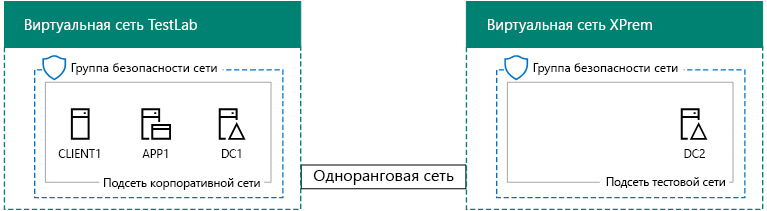
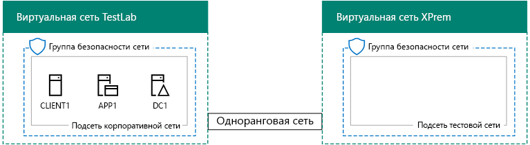

# <a name="simulated-cross-premises-virtual-network-in-azure"></a>Имитация распределенной виртуальной сети в Azure

 **Сводка:** Создание имитации распределенной виртуальной сети в Microsoft Azure в среде разработки и тестирования.
  
В этой статье описаны действия по созданию имитации гибридной облачной среды в Microsoft Azure с помощью двух виртуальных сетей Azure. Ниже показана итоговая конфигурация.   
  

  
Так имитируется гибридная облачная рабочая среда Azure IaaS, которая включает:
  
- 	Имитацию упрощенной локальной сети, размещенной в виртуальной сети Azure (TestLab).
    
- 	Имитацию распределенной виртуальной сети, размещенной в Azure (XPrem).
    
- 	Пиринговую связь между двумя виртуальными сетями.
    
- 	Дополнительный контроллер домена в виртуальной сети XPrem.
    
Это обеспечивает общую исходную точку, начиная с которой, вы можете:  
  
- 	Разрабатывать и тестировать приложения в имитированной гибридной облачной среде Azure IaaS.
    
- 	Создавать тестовые конфигурации компьютеров внутри виртуальной сети (для некоторых это TestLab, а для некоторых — XPrem), чтобы имитировать рабочие ИТ-нагрузки на основе гибридного облака.
    
Процесс настройки этой среды разработки и тестирования состоит из трех перечисленных ниже основных этапов.
  
1. 	Настраивать виртуальную сеть TestLab.
    
2. Создавать распределенную виртуальную сеть.
    
3. Настраивать DC2.
    
> [!NOTE]
> Эта конфигурация требует платной подписки на Azure. 
  

  
> [!TIP]
> Щелкните [здесь](http://aka.ms/catlgstack), чтобы просмотреть схему всех статей, относящихся к руководствам по лаборатории тестирования в One Microsoft Cloud.
  
## <a name="phase-1-configure-the-testlab-virtual-network"></a>Этап 1. Настройка виртуальной сети TestLab

Используйте инструкции в [среде разработки и тестирования базовой конфигурации](base-configuration-dev-test-environment.md) для настройки компьютеров DC1, APP1 и CLIENT1 в виртуальная сеть Azure, с именем лаборатория тестирования.
  
Это — ваша текущая конфигурация. 
  

  
## <a name="phase-2-create-the-xprem-virtual-network"></a>Этап 2. Создание виртуальной сети XPrem

На этом этапе создается и настраивается новая виртуальная сеть XPrem, а затем подключается к пиринговой виртуальной сети TestLab.
  
Во-первых, запустите командную строку Azure PowerShell на своем локальном компьютере.
  
> [!NOTE]
> [!Примечание] Для указанных ниже последовательностей команд используется последняя версия Azure PowerShell. Просмотрите статью [Начало работы с командлетами Azure PowerShell](https://docs.microsoft.com/en-us/powershell/azureps-cmdlets-docs/). 
  
Войдите в свою учетную запись Azure с помощью указанной ниже команды.
  
```
Login-AzureRMAccount
```

> [!TIP]
> [!Совет] Скачать текстовый файл, который содержит все команды PowerShell, указанные в этой статье, можно [здесь](https://gallery.technet.microsoft.com/PowerShell-commands-for-7844edd0).
  
Получите имя подписки с помощью следующей команды.
  
```
Get-AzureRMSubscription | Sort Name | Select Name
```

Задайте подпиской Azure. Замените все содержимое в кавычки, включая \< и > символов с правильные имена.
  
```
$subscrName="<subscription name>"
Get-AzureRmSubscription -SubscriptionName $subscrName | Select-AzureRmSubscription
```

Далее создайте виртуальную сеть XPrem и защитите ее с помощью группы безопасности сети, воспользовавшись этими командами.
  
```
$rgName="<name of the resource group that you used for your TestLab virtual network>"
$locName=(Get-AzureRmResourceGroup -Name $rgName).Location
$Testnet=New-AzureRMVirtualNetworkSubnetConfig -Name "Testnet" -AddressPrefix 192.168.0.0/24
New-AzureRMVirtualNetwork -Name "XPrem" -ResourceGroupName $rgName -Location $locName -AddressPrefix 192.168.0.0/16 -Subnet $Testnet -DNSServer 10.0.0.4
$rule1=New-AzureRMNetworkSecurityRuleConfig -Name "RDPTraffic" -Description "Allow RDP to all VMs on the subnet" -Access Allow -Protocol Tcp -Direction Inbound -Priority 100 -SourceAddressPrefix Internet -SourcePortRange * -DestinationAddressPrefix * -DestinationPortRange 3389
New-AzureRMNetworkSecurityGroup -Name "Testnet" -ResourceGroupName $rgName -Location $locName -SecurityRules $rule1
$vnet=Get-AzureRMVirtualNetwork -ResourceGroupName $rgName -Name XPrem
$nsg=Get-AzureRMNetworkSecurityGroup -Name "Testnet" -ResourceGroupName $rgName
Set-AzureRMVirtualNetworkSubnetConfig -VirtualNetwork $vnet -Name "Testnet" -AddressPrefix 192.168.0.0/24 -NetworkSecurityGroup $nsg
```

Затем создайте пиринговую связь между виртуальными сетями TestLab и XPrem с помощью этих команд.
  
```
$rgName="<name of the resource group that you used for your TestLab virtual network>"
$vnet1=Get-AzureRmVirtualNetwork -ResourceGroupName $rgName -Name TestLab
$vnet2=Get-AzureRmVirtualNetwork -ResourceGroupName $rgName -Name XPrem
Add-AzureRmVirtualNetworkPeering -Name TestLab2XPrem -VirtualNetwork $vnet1 -RemoteVirtualNetworkId $vnet2.Id
Add-AzureRmVirtualNetworkPeering -Name XPrem2TestLab -VirtualNetwork $vnet2 -RemoteVirtualNetworkId $vnet1.Id
```

Это — ваша текущая конфигурация. 
  

  
## <a name="phase-3-configure-dc2"></a>Этап 3. Настройка DC2

На этом этапе нужно создать виртуальную машину DC2 в виртуальной сети XPrem, а затем настроить ее в качестве контроллера домена реплики.
  
Сначала создайте виртуальную машину для DC2. Выполните эти команды в командной строке Azure PowerShell на локальном компьютере.
  
```
$rgName="<your resource group name>"
$locName=(Get-AzureRmResourceGroup -Name $rgName).Location
$vnet=Get-AzureRMVirtualNetwork -Name XPrem -ResourceGroupName $rgName
$pip=New-AzureRMPublicIpAddress -Name DC2-PIP -ResourceGroupName $rgName -Location $locName -AllocationMethod Dynamic
$nic=New-AzureRMNetworkInterface -Name DC2-NIC -ResourceGroupName $rgName -Location $locName -SubnetId $vnet.Subnets[0].Id -PublicIpAddressId $pip.Id -PrivateIpAddress 192.168.0.4
$vm=New-AzureRMVMConfig -VMName DC2 -VMSize Standard_A1
$cred=Get-Credential -Message "Type the name and password of the local administrator account for DC2."
$vm=Set-AzureRMVMOperatingSystem -VM $vm -Windows -ComputerName DC2 -Credential $cred -ProvisionVMAgent -EnableAutoUpdate
$vm=Set-AzureRMVMSourceImage -VM $vm -PublisherName MicrosoftWindowsServer -Offer WindowsServer -Skus 2016-Datacenter -Version "latest"
$vm=Add-AzureRMVMNetworkInterface -VM $vm -Id $nic.Id
$vm=Set-AzureRmVMOSDisk -VM $vm -Name "DC2-OS" -DiskSizeInGB 128 -CreateOption FromImage -StorageAccountType "StandardLRS"
$diskConfig=New-AzureRmDiskConfig -AccountType "StandardLRS" -Location $locName -CreateOption Empty -DiskSizeGB 20
$dataDisk1=New-AzureRmDisk -DiskName "DC2-DataDisk1" -Disk $diskConfig -ResourceGroupName $rgName
$vm=Add-AzureRmVMDataDisk -VM $vm -Name "DC2-DataDisk1" -CreateOption Attach -ManagedDiskId $dataDisk1.Id -Lun 1
New-AzureRMVM -ResourceGroupName $rgName -Location $locName -VM $vm
```

Затем подключитесь к новой виртуальной машины DC2 с [Azure портала](https://portal.azure.com) с помощью его имя учетной записи локального администратора и пароль.
  
Далее настройте правило брандмауэра Windows, разрешающее трафик для тестирования базовых параметров подключения. С помощью командной строки Windows PowerShell уровня администратора на DC2 выполните эти команды.  
  
```
Set-NetFirewallRule -DisplayName "File and Printer Sharing (Echo Request - ICMPv4-In)" -enabled True
ping dc1.corp.contoso.com
```

В результате команды проверки связи должны прийти четыре успешных ответа с IP-адреса 10.0.0.4. Это тест трафика в рамках пиринговой виртуальной сети.  
  
Добавьте на диске дополнительных данных как новый том с диска F:, с помощью этой команды в командной строке Windows PowerShell на DC2.
  
```
Get-Disk | Where PartitionStyle -eq "RAW" | Initialize-Disk -PartitionStyle MBR -PassThru | New-Partition -AssignDriveLetter -UseMaximumSize | Format-Volume -FileSystem NTFS -NewFileSystemLabel "WSAD Data"
```

Затем настройте виртуальную машину DC2 как контроллер домена реплики для corp.contoso.com. Выполните указанные ниже команды в командной строке Windows PowerShell на DC2.
  
```
Install-WindowsFeature AD-Domain-Services -IncludeManagementTools
Install-ADDSDomainController -Credential (Get-Credential CORP\User1) -DomainName "corp.contoso.com" -InstallDns:$true -DatabasePath "F:\NTDS" -LogPath "F:\Logs" -SysvolPath "F:\SYSVOL"
```

Обратите внимание на то, что вам предлагается ввести обоих CORP\\User1 пароль и пароль режима восстановления служб каталогов (DSRM) и для перезапуска DC2. 
  
Теперь, когда у виртуальной сети XPrem есть свой DNS-сервер (DC2), вам нужно настроить XPrem для использования этого DNS-сервера. Выполните эти команды в командной строке Azure PowerShell на локальном компьютере.
  
```
$vnet=Get-AzureRmVirtualNetwork -ResourceGroupName $rgName -name "XPrem"
$vnet.DhcpOptions.DnsServers="192.168.0.4" 
Set-AzureRmVirtualNetwork -VirtualNetwork $vnet
Restart-AzureRmVM -ResourceGroupName $rgName -Name "DC2"
```

С Azure портала на локальном компьютере, подключиться к DC1 с CORP\\учетные данные пользователя User1. Чтобы настроить домен CORP, чтобы пользователи и компьютеры использовать их локального контроллера домена для проверки подлинности, выполните эти команды из командной строки Windows PowerShell уровня администратора на DC1.
  
```
New-ADReplicationSite -Name "TestLab" 
New-ADReplicationSite -Name "XPrem"
New-ADReplicationSubnet -Name "10.0.0.0/8" -Site "TestLab"
New-ADReplicationSubnet -Name "192.168.0.0/16" -Site "XPrem"
```

Это — ваша текущая конфигурация. 
  

  
Ваша имитированная гибридная облачная среда Azure готова к тестированию.
  
## <a name="next-step"></a>Следующий этап

Используйте этот dev/тестовой среды для моделирования работы [фермы SharePoint Server 2016 интрасети, размещать в Azure](https://technet.microsoft.com/library/mt806351%28v=office.16%29.aspx).
  
## <a name="see-also"></a>См. также

[Базовая конфигурация среды разработки и тестирования](base-configuration-dev-test-environment.md)
  
[Среда разработки и тестирования Office 365](office-365-dev-test-environment.md)
  
[DirSync для среды разработки и тестирования Office 365](dirsync-for-your-office-365-dev-test-environment.md)
  
[Cloud App Security для среды разработки и тестирования Office 365](cloud-app-security-for-your-office-365-dev-test-environment.md)
  
[Advanced Threat Protection в среде разработки и тестирования Office 365](advanced-threat-protection-for-your-office-365-dev-test-environment.md)
  
[Освоение облака и гибридные решения](cloud-adoption-and-hybrid-solutions.md)


