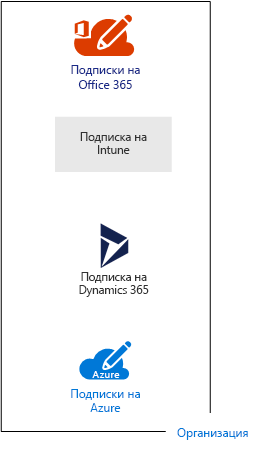
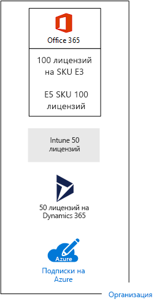

# Подписки, лицензии, учетные записи и клиенты для облачных предложений корпорации МайкрософтSubscriptions, licenses, accounts, and tenants for Microsoft's cloud offerings

 **Сводка.** Общие сведения о связи между организациями, подписками, лицензиями, учетными записями пользователей и клиентами в облачных предложениях корпорации Майкрософт.**Summary:** Understand the relationships of organizations, subscriptions, licenses, user accounts, and tenants across Microsoft's cloud offerings.
  
Для облачных решений Майкрософт предусмотрена иерархия организаций, подписок, лицензий и учетных записей пользователей. Это обеспечивает согласованное использование удостоверений и выставление счетов.Microsoft provides a hierarchy of organizations, subscriptions, licenses, and user accounts for consistent use of identities and billing across its cloud offerings:
  
- Microsoft Office 365Microsoft Office 365
    
    [Планы для бизнеса и цены](https://products.office.com/business/compare-office-365-for-business-plans)See [business plans and pricing](https://products.office.com/business/compare-office-365-for-business-plans) for more information.
    
- Microsoft AzureMicrosoft Azure
    
    [Цены на Azure](https://azure.microsoft.com/pricing/)See [Azure pricing](https://azure.microsoft.com/pricing/) for more information.
    
- Microsoft Intune и Enterprise Mobility + Security (EMS)Microsoft Intune and the Enterprise Mobility + Security (EMS)
    
    [Цены на Intune](https://www.microsoft.com/cloud-platform/microsoft-intune-pricing)See [Intune pricing](https://www.microsoft.com/cloud-platform/microsoft-intune-pricing) for more information.
    
- Microsoft Dynamics 365Microsoft Dynamics 365
    
    [Цены на Dynamics 365](https://dynamics.microsoft.com/)See [Dynamics 365 pricing](https://dynamics.microsoft.com/) for more information.
    
## Элементы иерархииElements of the hierarchy

Ниже перечислены элементы иерархии.Here are the elements of the hierarchy:
  
### ОрганизацияOrganization

Организация представляет субъект бизнес-деятельности, использующий облачные решения Майкрософт. Как правило, он определяется по одному или нескольким именам общедоступного домена службы доменных имен (DNS), например contoso.com. Организация является контейнером для подписок.An organization represents a business entity that is using Microsoft cloud offerings, typically identified by one or more public Domain Name System (DNS) domain names, such as contoso.com. The organization is a container for subscriptions.
  
### ПодпискиSubscriptions

Подписка — это соглашение с корпорацией Майкрософт на использование одной или нескольких платформ или служб Майкрософт, за которые взимается плата (по лицензиям отдельных пользователей или по использованию облачных ресурсов). В облачных предложениях корпорации Майкрософт на основе SaaS (Office 365, Intune/EMS и Dynamics 365) оплата взимается за лицензии пользователей. В облачных предложениях корпорации Майкрософт (Azure) на основе PaaS (платформа как услуга) и IaaS (инфраструктура как услуга) оплата взимается за использование облачных ресурсов.A subscription is an agreement with Microsoft to use one or more Microsoft cloud platforms or services, for which charges accrue based on either a per-user license fee or on cloud-based resource consumption. Microsoft's Software as a Service (SaaS)-based cloud offerings (Office 365, Intune/EMS, and Dynamics 365) charge per-user license fees. Microsoft's Platform as a Service (PaaS) and Infrastructure as a Service (IaaS) cloud offerings (Azure) charge based on cloud resource consumption.
  
Вы также можете использовать пробную подписку, срок действия которой истекает через определенное время или после использования определенного количества ресурсов. Вы можете преобразовать пробную подписку в платную.You can also use a trial subscription, but the subscription expires after a specific amount of time or consumption charges. You can convert a trial subscription to a paid subscription.
  
У организации может быть несколько подписок на облачные предложения корпорации Майкрософт, как показано на рис. 1.Organizations can have multiple subscriptions for Microsoft's cloud offerings. Figure 1 shows an example.
  
**Рис. 1. Пример использования нескольких подписок для организации****Figure 1: Example of multiple subscriptions for an organization**

  
На изображении 1 показана одна организация с несколькими подписками на Office 365 и Azure, подпиской на Intune и подпиской на Dynamics 365.Figure 1 shows a single organization that has multiple Office 365 subscriptions, an Intune subscription, a Dynamics 365 subscription, and multiple Azure subscriptions.
  
### ЛицензииLicenses

В случае облачных предложений корпорации Майкрософт на основе SaaS лицензия позволяет определенному пользователю пользоваться услугами облачной службы. В рамках подписки ежемесячно взимается плата. Администраторы назначают лицензии отдельным учетным записям пользователей в подписке. Например, на рис. 2 у корпорации Contoso есть подписка на Office 365 корпоративный E5 со 100 лицензиями, что позволяет 100 отдельным пользователям использовать функции и службы Office 365 корпоративный E5.For Microsoft's SaaS cloud offerings, a license allows a specific user account to use the services of the cloud offering. You are charged a fixed monthly fee as part of your subscription. Administrators assign licenses to individual user accounts in the subscription. For the example in Figure 2, the Contoso Corporation has an Office 365 Enterprise E5 subscription with 100 licenses, which allows to up to 100 individual user accounts to use Enterprise E5 features and services.
  
**Рис. 2. Лицензии в рамках подписок на основе SaaS для организации****Figure 2: Licenses within the SaaS-based subscriptions for an organization**

  
В случае облачных служб на основе Azure PaaS стоимость лицензий на программное обеспечение включается в цену службы.For Azure PaaS-based cloud services, software licenses are built into the service pricing.
  
Для виртуальных машин на основе Azure IaaS могут потребоваться дополнительные лицензии на использование ПО или приложений, установленных в образе виртуальной машины. В некоторых образах виртуальных машин установлены лицензированные версии программного обеспечения, цены которых включаются в поминутный тариф для сервера. К примерам таких виртуальных машин относятся образы для SQL Server 2014 и SQL Server 2016.For Azure IaaS-based virtual machines, additional licenses to use the software or application installed on a virtual machine image might be required. Some virtual machine images have licensed versions of software installed and the cost is included in the per-minute rate for the server. Examples are the virtual machine images for SQL Server 2014 and SQL Server 2016. 
  
В некоторых образах виртуальных машин установлены пробные версии приложений, а для их использования по завершении пробного периода требуются дополнительные лицензии. Например, образ виртуальной машины для пробной версии SharePoint Server 2016 включает предустановленную пробную версию SharePoint Server 2016. Чтобы продолжать использовать SharePoint Server 2016 по истечении пробного периода, необходимо приобрести у корпорации Майкрософт лицензию на SharePoint Server 2016 и клиентские лицензии. Эта плата взимается отдельно от платы за подписку Azure и не отменяет поминутный тариф на работу виртуальной машины.Some virtual machine images have trial versions of applications installed and need additional software application licenses for use beyond the trial period. For example, the SharePoint Server 2016 Trial virtual machine image includes a trial version of SharePoint Server 2016 pre-installed. To continue using SharePoint Server 2016 after the trail expiration date, you must purchase a SharePoint Server 2016 license and client licenses from Microsoft. These charges are separate from the Azure subscription and the per-minute rate to run the virtual machine still applies.
  
### Учетные записи пользователейUser accounts

Учетные записи для всех облачных предложений корпорации Майкрософт хранятся в клиенте Azure AD, содержащем учетные записи и группы пользователей. Клиент Azure AD можно синхронизировать с имеющимися учетными записями Windows Server AD с помощью Azure AD Connect, серверной службы Windows. Это называется синхронизацией службы каталогов, или DirSync.User accounts for all of Microsoft's cloud offerings are stored in an Azure Active Directory (AD) tenant, which contains user accounts and groups. An Azure AD tenant can be synchronized with your existing Windows Server AD accounts using Azure AD Connect, a Windows server-based service. This is known as directory synchronization (DirSync).
  
На рис. 3 показан пример нескольких подписок организации, использующих общий клиент Azure AD с учетными записями организации.Figure 3 shows an example of multiple subscriptions of an organization using a common Azure AD tenant that contains the organization's accounts.
  
**Рис. 3. Несколько подписок организации, использующих один клиент Azure AD****Figure 3: Multiple subscriptions of an organization that use the same Azure AD tenant**

  
### КлиентыTenants

В случае облачных предложений на основе SaaS клиент — это регион, в котором располагаются серверы, предоставляющие облачные службы. Например, корпорация Contoso выбрала европейский регион для размещения клиентов Office 365, EMS и Dynamics 365, которыми пользуются 15 000 сотрудников главного офиса компании в Париже.For SaaS cloud offerings, the tenant is the regional location that houses the servers providing cloud services. For example, the Contoso Corporation chose the European region to host its Office 365, EMS, and Dynamics 365 tenants for the 15,000 workers in their Paris headquarters.
  
Службы PaaS Azure и рабочие нагрузки на основе виртуальных машин, размещенные на платформе IaaS Azure, могут находиться в центре обработки данных Azure в любой точке мира. Центр обработки данных Azure, или расположение, указывается при создании приложения или службы PaaS Azure либо элемента рабочей нагрузки IaaS.Azure PaaS services and virtual machine-based workloads hosted in Azure IaaS can have tenancy in any Azure datacenter across the world. You specify the Azure datacenter, known as the location, when you create the Azure PaaS app or service or element of an IaaS workload.
  
Клиент Azure AD — это определенный экземпляр Azure AD, содержащий учетные записи и группы. Платные и пробные подписки Office 365, Dynamics 365 или Intune/EMS включают бесплатный клиент Azure AD. Этот клиент Azure AD не включает службы Azure и не предоставляется с пробной или платной подпиской Azure.An Azure AD tenant is a specific instance of Azure AD containing accounts and groups. Paid or trial subscriptions of Office 365, Dynamics 365, or Intune/EMS include a free Azure AD tenant. This Azure AD tenant does not include other Azure services and is not the same as an Azure trial or paid subscription.
  
### Сводка по иерархииSummary of the hierarchy

Краткая сводка:Here is a quick recap:
  
- У организации может быть несколько подписокAn organization can have multiple subscriptions
    
  - В одной подписке может быть несколько лицензийA subscription can have multiple licenses
    
  - Лицензии можно назначать отдельным учетным записямLicenses can be assigned to individual user accounts
    
  - Учетные записи хранятся в клиенте Azure ADUser accounts are stored in an Azure AD tenant
    
Ниже приведен пример связи между организациями, подписками, лицензиями и учетными записями пользователей.Here is an example of the relationship of organizations, subscriptions, licenses, and user accounts:
  
- Организация определяется по имени общедоступного домена.An organization identified by its public domain name.
    
  - Подписка Office 365 корпоративный E3 с лицензиями "на пользователя".An Office 365 Enterprise E3 subscription with user licenses.
    
    Подписка Office 365 корпоративный E5 с лицензиями "на пользователя".An Office 365 Enterprise E5 subscription with user licenses.
    
    Подписка на EMS с лицензиями "на пользователя".An EMS subscription with user licenses.
    
    Подписка на Dynamics 365 с лицензиями "на пользователя".A Dynamics 365 subscription with user licenses.
    
    Несколько подписок на Azure.Multiple Azure subscriptions.
    
  - Учетные записи пользователей организации на общем клиенте Azure AD.The organization's user accounts in a common Azure AD tenant.
    
Для нескольких подписок на облачные решения Майкрософт может использоваться один клиент Azure AD, выступающий в качестве поставщика удостоверений. Благодаря центральному клиенту Azure AD, содержащему синхронизированные учетные записи из локальной службы Active Directory в составе Windows Server, возможно предоставление удостоверений как услуги (IDaaS) для организации. Это показано на рисунке 4.Multiple Microsoft cloud offering subscriptions can use the same Azure AD tenant that acts as a common identity provider. A central Azure AD tenant that contains the synchronized accounts of your on-premises Windows Server AD provides cloud-based Identity as a Service (IDaaS) for your organization. This is shown in Figure 4.
  
**Рис. 4. Синхронизированные локальные учетные записи и IDaaS для организации****Figure 4: Synchronized on-premises accounts and IDaaS for an organization**

  
На рисунке 4 показано, как взаимодействуют с общим клиентом Azure AD облачные решения SaaS Майкрософт, приложения PaaS Azure и виртуальные машины на платформе IaaS Azure, использующие доменные службы Azure AD. Клиент Azure AD синхронизируется с локальным лесом Active Directory Windows Server с помощью Azure AD Connect.Figure 4 shows how a common Azure AD tenant is utilized by Microsoft's SaaS cloud offerings, Azure PaaS apps, and virtual machines in Azure IaaS that use Azure AD Domain Services. Azure AD Connect synchronizes the on-premises Windows Server AD forest with the Azure AD tenant.
  
Дополнительные сведения об интеграции идентификации между облачными решениями Майкрософт см. в разделе [Идентификация в Microsoft Cloud для корпоративных архитекторов](https://aka.ms/cloudarchidentity).For more information about identity integration across Microsoft's cloud offerings, see [Microsoft Cloud Identity for Enterprise Architects](https://aka.ms/cloudarchidentity).
  
## Объединение подписок для нескольких облачных предложений корпорации МайкрософтCombining subscriptions for multiple Microsoft cloud offerings

В приведенной ниже таблице показано, как объединить несколько облачных предложений корпорации Майкрософт на основе имеющейся подписки на облачное предложение одного типа (подписи в первом столбце) и добавленной подписки на другое решение (поперек столбцов).The following table describes how you can combine multiple Microsoft cloud offerings based on already having a subscription for one type of cloud offering (the labels going down the first column) and adding a subscription for a different cloud offering (going across the columns).
  
||**Office 365****Office 365**|**Azure****Azure**|**Intune/EMS****Intune/EMS**|**Dynamics 365****Dynamics 365**|
|:-----|:-----|:-----|:-----|:-----|
|**Office 365****Office 365**   |Н/ДNA    |Добавьте подписку Azure для организации с помощью портала Azure.You add an Azure subscription to your organization from the Azure portal.    |Добавьте подписку Intune/EMS для организации с помощью портала Office 365.You add an Intune/EMS subscription to your organization from the Office 365 portal.    |Добавьте подписку на Dynamics 365 для организации на портале Office 365.You add a Dynamics 365 subscription to your organization from the Office 365 portal.    |
|**Azure****Azure**   |Добавьте подписку на Office 365 для организации.You add an Office 365 subscription to your organization.    |НедоступноNA    |Добавьте подписку Intune/EMS для организации.You add an Intune/EMS subscription to your organization.    |Добавьте подписку Dynamics 365 для организации.You add a Dynamics 365 subscription to your organization.    |
|**Intune/EMS****Intune/EMS**   |Добавьте подписку на Office 365 для организации.You add an Office 365 subscription to your organization.    |Добавьте подписку Azure для организации с помощью портала Azure.You add an Azure subscription to your organization from the Azure portal.    |НедоступноNA    |Добавьте подписку Dynamics 365 для организации.You add a Dynamics 365 subscription to your organization.    |
|**Dynamics 365****Dynamics 365**   |Добавьте подписку на Office 365 для организации.You add an Office 365 subscription to your organization.    |Добавьте подписку Azure для организации с помощью портала Azure.You add an Azure subscription to your organization from the Azure portal.    |Добавьте подписку Intune/EMS для организации.You add an Intune/EMS subscription to your organization.    |НедоступноNA    |
   
Вы можете легко добавлять подписки на службы Майкрософт на основе SaaS, используя Центр администрирования Office 365:An easy way to add subscriptions to your organization for Microsoft SaaS-based services is through the Office 365 Admin center:
  
1. Войдите на портал Office 365 ([https://portal.office.com](https://portal.office.com)), используя учетную запись глобального администратора, и выберите **Администрирование**.Sign in to the Office 365 portal ([https://portal.office.com](https://portal.office.com)) with your global administrator account, and then click **Admin**.
    
2. В левой части главной страницы **Центра администрирования** выберите **Выставление счетов** > **Приобретение служб**.From the left navigation of the **Admin center** home page, click **Billing**, and then **Purchase services**.
    
3. На странице **Приобретение служб** купите новые подписки.On the **Purchase services** page, purchase your new subscriptions.
    
Центр администрирования Office 365 назначает для новых подписок на облачные решения SaaS соответствующие организацию и клиента Azure AD, указанные для подписки на Office 365.The Office 365 Admin center assigns the organization and Azure AD tenant of your Office 365 subscription to the new subscriptions for SaaS-based cloud offerings.
  
Чтобы добавить подписку Azure с теми же организацией и клиентом Azure AD, что и в подписке на Office 365:To add an Azure subscription with the same organization and Azure AD tenant as your Office 365 subscription:
  
1. Войдите на портал Azure ([https://portal.azure.com](https://portal.azure.com)), используя учетную запись глобального администратора Office 365.Sign in to the Azure portal ([https://portal.azure.com](https://portal.azure.com)) with your Office 365 global administrator account.
    
2. В области навигации слева выберите **Подписки** > **Добавить**.In the left navigation, click **Subscriptions**, and then click **Add**.
    
3. На странице **Добавление подписки** выберите предложение, а затем укажите платежную информацию и примите условия лицензионного соглашения.On the **Add subscription** page, select an offer and complete the payment information and agreement.
    
Если вы приобрели подписки на Azure и Office 365 отдельно и хотите получить доступ к клиенту Azure AD в Office 365, воспользуйтесь инструкциями в статье [Связывание клиента Office 365 с подпиской на Azure](https://channel9.msdn.com/Series/Microsoft-Azure-Tutorials/Associate-an-Office-365-tenant-with-an-Azure-subscription).If you purchased Azure and Office 365 subscriptions separately and want to access the Office 365 Azure AD tenant from your Azure subscription, see the instructions in [Associate an Office 365 tenant with an Azure subscription](https://channel9.msdn.com/Series/Microsoft-Azure-Tutorials/Associate-an-Office-365-tenant-with-an-Azure-subscription).
  
## См. такжеSee Also

[Ресурсы для администраторов, посвященные архитектуре Microsoft CloudMicrosoft Cloud IT architecture resources](microsoft-cloud-it-architecture-resources.md)
  
[Руководства по лаборатории тестирования для принятия облачных решенийCloud adoption Test Lab Guides (TLGs)](cloud-adoption-test-lab-guides-tlgs.md)
  
[Архитектурные модели для SharePoint, Exchange, Skype для бизнеса и LyncArchitectural models for SharePoint, Exchange, Skype for Business, and Lync](architectural-models-for-sharepoint-exchange-skype-for-business-and-lync.md)
  
[Гибридные решенияHybrid solutions](hybrid-solutions.md)
  
