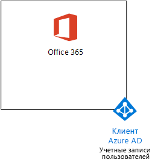
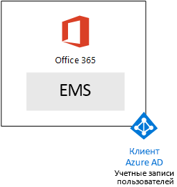
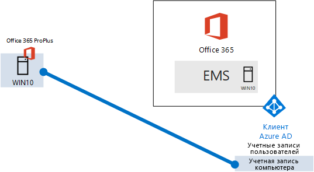

# <a name="the-microsoft-365-enterprise-devtest-environment"></a><span data-ttu-id="e69c9-103">Среда разработки и тестирования Microsoft 365 корпоративный</span><span class="sxs-lookup"><span data-stu-id="e69c9-103">The Microsoft 365 Enterprise dev/test environment</span></span>

 <span data-ttu-id="e69c9-104">**Сводка.** Используйте это руководство по лаборатории тестирования для создания среды разработки и тестирования, включающей Office 365 E5, Enterprise Mobility + Security (EMS) E5 и компьютер с ОС Windows 10 Корпоративная.</span><span class="sxs-lookup"><span data-stu-id="e69c9-104">**Summary:** Use this Test Lab Guide to create a dev/test environment that includes Office 365 E5, Enterprise Mobility + Security (EMS) E5, and a computer running Windows 10 Enterprise.</span></span>
  
<span data-ttu-id="e69c9-105">В этой статье представлено пошаговое руководство по созданию упрощенной среды для проверки возможностей и функций [Microsoft 365 корпоративный](https://www.microsoft.com/microsoft-365/enterprise).</span><span class="sxs-lookup"><span data-stu-id="e69c9-105">This article provides you with step-by-step instructions to create a simplified environment to test the features and functionality of Microsoft 365 Enterprise.</span></span>
  
## <a name="phase-1-create-your-office-365-e5-subscription"></a><span data-ttu-id="e69c9-106">Этап 1. Создание подписки на Office 365 E5</span><span class="sxs-lookup"><span data-stu-id="e69c9-106">Phase 1: Create your Office 365 E5 subscription</span></span>

<span data-ttu-id="e69c9-107">Выполните действия, описанные в этапах 2 и 3 статьи [Среда разработки и тестирования Office 365](office-365-dev-test-environment.md), чтобы создать упрощенную среду разработки и тестирования Office 365, показанную на рисунке 1.</span><span class="sxs-lookup"><span data-stu-id="e69c9-107">Follow the steps in Phase 2 and Phase 3 of Office 365 dev/test environment to create a lightweight Office 365 dev/test environment, as shown in Figure 1.</span></span>
  
<span data-ttu-id="e69c9-108">**Рис. 1. Подписка на Office 365 E5 с учетными записями клиентов и пользователей Azure Active Directory (AD)**</span><span class="sxs-lookup"><span data-stu-id="e69c9-108">**Figure 1: Your Office 365 E5 subscription with its Azure Active Directory (AD) tenant and user accounts**</span></span>



> [!NOTE]
> <span data-ttu-id="e69c9-p101">Период пробной подписки на Office 365 E5 составляет 30 дней, но его легко продлить до 60 дней. Чтобы создать постоянную среду тестирования и разработки, создайте новую платную подписку с небольшим количеством лицензий.</span><span class="sxs-lookup"><span data-stu-id="e69c9-p101">The Azure trial  is 30 days. The Office 365 Enterprise E5 Trial subscription is 30 days, which can be easily extended for another 30 days. For a permanent dev/test environment, create a new paid Azure subscription and a new paid Office 365 Enterprise E5 subscription with a small number of licenses.</span></span> 
  
## <a name="phase-2-add-ems"></a><span data-ttu-id="e69c9-112">Этап 2. Добавление EMS</span><span class="sxs-lookup"><span data-stu-id="e69c9-112">Phase 2: Add EMS</span></span>

<span data-ttu-id="e69c9-113">На этом этапе можно оформить пробную подписку на EMS E5 и добавить ее к той же организации, для которой создана пробная подписка на Office 365 E5.</span><span class="sxs-lookup"><span data-stu-id="e69c9-113">In this phase, you sign up for the EMS E5 trial subscription and add it to the same organization as your Office 365 E5 trial subscription.</span></span>
  
<span data-ttu-id="e69c9-114">Для начала добавьте пробную подписку EMS E5 и назначьте лицензию на EMS учетной записи глобального администратора.</span><span class="sxs-lookup"><span data-stu-id="e69c9-114">First, add the EMS E5 trial subscription and assign an EMS license to your global administrator account.</span></span>
  
1. <span data-ttu-id="e69c9-p102">С помощью приватного экземпляра веб-браузера войдите на портал Office 365, используя данные учетной записи глобального администратора. Сведения о том, как это сделать, см в статье [Вход в Office 365](https://support.office.com/Article/Where-to-sign-in-to-Office-365-e9eb7d51-5430-4929-91ab-6157c5a050b4).</span><span class="sxs-lookup"><span data-stu-id="e69c9-p102">With a private instance of an Internet browser, sign in to the Office 365 portal with your global administrator account credentials. For help, see [Where to sign in to Office 365https://support.office.com/Article/Where-to-sign-in-to-Office-365-e9eb7d51-5430-4929-91ab-6157c5a050b4](https://support.office.com/Article/Where-to-sign-in-to-Office-365-e9eb7d51-5430-4929-91ab-6157c5a050b4).</span></span>
    
2. <span data-ttu-id="e69c9-117">Выберите плитку **Администрирование**.</span><span class="sxs-lookup"><span data-stu-id="e69c9-117">Click the **Admin** tile.</span></span>
    
3. <span data-ttu-id="e69c9-118">На вкладке **Центр администрирования Office** в браузере на панели навигации слева выберите **Выставление счетов > Приобретение служб**.</span><span class="sxs-lookup"><span data-stu-id="e69c9-118">On the **Office Admin center** tab in your browser, in the left navigation, click **Billing > Purchase services**.</span></span>
    
4. <span data-ttu-id="e69c9-p103">На странице **Приобретение служб** найдите элемент **Enterprise Mobility + Security E5**. Наведите на него указатель мыши и выберите **Начать бесплатный пробный период**.</span><span class="sxs-lookup"><span data-stu-id="e69c9-p103">On the **Purchase services** page, find the **Enterprise Mobility + Security E5** item. Hover your mouse pointer over it and click **Start free trial**.</span></span>
    
5. <span data-ttu-id="e69c9-121">На странице **Подтверждение заказа** нажмите **Попробовать сейчас**.</span><span class="sxs-lookup"><span data-stu-id="e69c9-121">On the **Confirm your order** page, click **Try now**.</span></span>
    
6. <span data-ttu-id="e69c9-122">На странице **Получение заказа** нажмите кнопку **Продолжить**.</span><span class="sxs-lookup"><span data-stu-id="e69c9-122">On the **Order receipt** page, click **Continue**.</span></span>
    
7. <span data-ttu-id="e69c9-123">На вкладке браузера **Центр администрирования Office 365** на панели навигации слева выберите **Пользователи > Активные пользователи**.</span><span class="sxs-lookup"><span data-stu-id="e69c9-123">On the **Office 365 Admin center** tab in your browser, in the left navigation, click **Users > Active users**.</span></span>
    
8. <span data-ttu-id="e69c9-124">Выберите свою учетную запись глобального администратора и нажмите **Изменить** для элемента **Лицензии на продукты**.</span><span class="sxs-lookup"><span data-stu-id="e69c9-124">Click your global administrator account, and then click Edit for Product licenses.</span></span>
    
9. <span data-ttu-id="e69c9-125">На панели **Лицензии на продукты** переведите переключатель **Enterprise Mobility + Security E5** в положение **Вкл.**, нажмите **Сохранить**, а затем дважды **Закрыть**.</span><span class="sxs-lookup"><span data-stu-id="e69c9-125">On the **Product licenses** pane, turn the product license for **Enterprise Mobility + Security E5** to **On**, click **Save,** and then click **Close** twice.</span></span>
    
> [!NOTE]
> <span data-ttu-id="e69c9-p104">Период пробной подписки на Enterprise Mobility + Security E5 составляет 90 дней. Чтобы создать постоянную среду тестирования и разработки, создайте новую платную подписку с небольшим количеством лицензий.</span><span class="sxs-lookup"><span data-stu-id="e69c9-p104">The Enterprise Mobility + Security E5 trial subscription is 90 days. For a permanent dev/test environment, create a new paid subscription with a small number of licenses.</span></span> 
  
 <span data-ttu-id="e69c9-128">***Если вы выполнили этап 3*** [среды разработки и тестирования Office 365](office-365-dev-test-environment.md), повторите действия 8 и 9 из предыдущей процедуры для всех остальных учетных записей (User 2, User 3, User 4 и User 5).</span><span class="sxs-lookup"><span data-stu-id="e69c9-128">***If you completed Phase 3 of the*** [Office 365 dev/test environment](office-365-dev-test-environment.md), repeat steps 8 and 9 of the previous procedure for all of your other accounts (User 2, User 3, User 4, and User 5).</span></span>
  
<span data-ttu-id="e69c9-129">Теперь ваша среда разработки и тестирования содержит:</span><span class="sxs-lookup"><span data-stu-id="e69c9-129">Your dev/test environment now has:</span></span>
  
- <span data-ttu-id="e69c9-130">пробные подписки на Office 365 корпоративный E5 и EMS E5 с одним и тем же клиентом Azure AD для всех учетных записей пользователей из списка;</span><span class="sxs-lookup"><span data-stu-id="e69c9-130">Office 365 E5 Enterprise and EMS trial subscriptions sharing the same organization and the same Azure AD tenant with your list of user accounts.</span></span>
- <span data-ttu-id="e69c9-131">все подходящие учетные записи пользователей (либо только глобального администратора или всех пяти пользователей), поддерживающие Office 365 E5 и EMS E5.</span><span class="sxs-lookup"><span data-stu-id="e69c9-131">All your appropriate user accounts (either just the global administrator or all five user accounts) are enabled to use Office 365 E5 and EMS E5.</span></span>
    
<span data-ttu-id="e69c9-132">На рисунке 2 показана полученная в итоге конфигурация с EMS.</span><span class="sxs-lookup"><span data-stu-id="e69c9-132">Figure 2 shows your resulting configuration, which adds EMS.</span></span>
  
<span data-ttu-id="e69c9-133">**Рис. 2. Добавление пробной подписки на EMS**</span><span class="sxs-lookup"><span data-stu-id="e69c9-133">**Figure 2: Adding the EMS trial subscription**</span></span>


  
## <a name="phase-3-create-a-windows-10-enterprise-computer"></a><span data-ttu-id="e69c9-135">Этап 3. Создание изолированного компьютера с ОС Windows 10 Корпоративная</span><span class="sxs-lookup"><span data-stu-id="e69c9-135">Phase 3: Create a Windows 10 Enterprise computer</span></span>

<span data-ttu-id="e69c9-136">На этом этапе можно создать изолированный компьютер под управлением Windows 10 Корпоративная.</span><span class="sxs-lookup"><span data-stu-id="e69c9-136">In this phase, you create a standalone computer running Windows 10 Enterprise.</span></span>
  
### <a name="physical-computer"></a><span data-ttu-id="e69c9-137">Физический компьютер</span><span class="sxs-lookup"><span data-stu-id="e69c9-137">Physical computer</span></span>

<span data-ttu-id="e69c9-p105">Установите Windows 10 Корпоративная на персональном компьютере. Пробную версию Windows 10 Корпоративная можно скачать [здесь](https://www.microsoft.com/evalcenter/evaluate-windows-10-enterprise).</span><span class="sxs-lookup"><span data-stu-id="e69c9-p105">Obtain a personal computer and install Windows 10 Enterprise on it. You can download the Windows 10 Enterprise trial [herehttps://www.microsoft.com/evalcenter/evaluate-windows-10-enterprise](https://www.microsoft.com/evalcenter/evaluate-windows-10-enterprise).</span></span>
  
### <a name="virtual-machine"></a><span data-ttu-id="e69c9-140">Виртуальная машина</span><span class="sxs-lookup"><span data-stu-id="e69c9-140">Virtual machine</span></span>

<span data-ttu-id="e69c9-p106">Создайте виртуальную машину с помощью выбранного гипервизора и установите на него Windows 10 Корпоративная. Пробную версию Windows 10 Корпоративная можно скачать [здесь](https://www.microsoft.com/evalcenter/evaluate-windows-10-enterprise).</span><span class="sxs-lookup"><span data-stu-id="e69c9-p106">Create a virtual machine using the hypervisor of your choice and install Windows 10 Enterprise on it. You can download the Windows 10 Enterprise trial [herehttps://www.microsoft.com/evalcenter/evaluate-windows-10-enterprise](https://www.microsoft.com/evalcenter/evaluate-windows-10-enterprise).</span></span>
  
### <a name="virtual-machine-in-azure"></a><span data-ttu-id="e69c9-143">Виртуальная машина в Azure</span><span class="sxs-lookup"><span data-stu-id="e69c9-143">Virtual machine in Azure</span></span>

<span data-ttu-id="e69c9-p107">Для создания виртуальной машины с Windows 10 в Microsoft Azure ***необходима подписка на основе Visual Studio*** с доступом к образу Windows 10 Корпоративная. В других типах подписок Azure, например пробной или платной, подобный доступ отсутствует.</span><span class="sxs-lookup"><span data-stu-id="e69c9-p107">To create a Windows 10 virtual machine in Microsoft Azure, ***you must have a Visual Studio-based subscription***, which has access to the image for Windows 10 Enterprise. Other types of Azure subscriptions, such as trial and paid subscriptions, do not have access to this image.</span></span>
  
> [!NOTE]
> <span data-ttu-id="e69c9-p108">Для приведенных ниже последовательностей команд используется последняя версия Azure PowerShell. См. статью [Начало работы с командлетами Azure PowerShell](https://docs.microsoft.com/powershell/azureps-cmdlets-docs/). Эти наборы команд создают виртуальную машину под управлением Windows 10 Корпоративная с именем WIN10, а также всю необходимую инфраструктуру, включая группу ресурсов, учетную запись хранения и виртуальную сеть. Если вы уже знакомы со службами инфраструктуры Azure, адаптируйте эти инструкции в соответствии с вашей развернутой инфраструктурой.</span><span class="sxs-lookup"><span data-stu-id="e69c9-p108">The following command sets use Azure PowerShell 1.0.0 and later. See [Get started with Azure PowerShell cmdletshttps://docs.microsoft.com/powershell/azureps-cmdlets-docs/](https://docs.microsoft.com/powershell/azureps-cmdlets-docs/). These command sets build a Windows 10 Enterprise virtual machine named WIN10 and all of its required infrastructure, including a resource group, a storage account, and a virtual network. If you are already familiar with Azure infrastructure services, please adapt these instructions to suit your currently deployed infrastructure.</span></span> 
  
<span data-ttu-id="e69c9-150">Для начала запустите командную строку Microsoft PowerShell.</span><span class="sxs-lookup"><span data-stu-id="e69c9-150">First, start a Microsoft PowerShell prompt.</span></span>
  
<span data-ttu-id="e69c9-151">Войдите в свою учетную запись Azure с помощью указанной ниже команды.</span><span class="sxs-lookup"><span data-stu-id="e69c9-151">Sign in to your Azure account with the following command.</span></span>
  
```
Login-AzureRMAccount
```

<span data-ttu-id="e69c9-152">Получите имя подписки с помощью приведенной ниже команды.</span><span class="sxs-lookup"><span data-stu-id="e69c9-152">Get your subscription name using the following command.</span></span>
  
```
Get-AzureRMSubscription | Sort Name | Select Name
```

<span data-ttu-id="e69c9-p109">Укажите свою подписку Azure. Замените текст в кавычках, в том числе символы "\<" и ">", на правильное имя.</span><span class="sxs-lookup"><span data-stu-id="e69c9-p109">Set your Azure subscription. Replace everything within the quotes, including the < and > characters, with the correct name.</span></span>
  
```
$subscr="<subscription name>"
Get-AzureRmSubscription -SubscriptionName $subscr | Select-AzureRmSubscription
```

<span data-ttu-id="e69c9-p110">Затем создайте группу ресурсов. Чтобы выбрать уникальное имя для группы ресурсов, с помощью этой команды выведите имеющиеся группы ресурсов.</span><span class="sxs-lookup"><span data-stu-id="e69c9-p110">Next, create a new resource group. To determine a unique resource group name, use this command to list your existing resource groups.</span></span>
  
```
Get-AzureRMResourceGroup | Sort ResourceGroupName | Select ResourceGroupName
```

<span data-ttu-id="e69c9-p111">Создайте группу ресурсов с помощью приведенных ниже команд. Замените все символы в кавычках (в том числе символы "\<" и ">") на правильные имена.</span><span class="sxs-lookup"><span data-stu-id="e69c9-p111">Create your new resource group with these commands. Replace everything within the quotes, including the < and > characters, with the correct names.</span></span>
  
```
$rgName="<resource group name>"
$locName="<location name, such as West US>"
New-AzureRMResourceGroup -Name $rgName -Location $locName
```

<span data-ttu-id="e69c9-p112">Далее используйте приведенные ниже команды для создания новой виртуальной сети и виртуальной машины WIN10. При появлении запроса укажите имя и пароль учетной записи локального администратора WIN10 и сохраните их в надежном месте.</span><span class="sxs-lookup"><span data-stu-id="e69c9-p112">Next, you create a new virtual network and the WIN10 virtual machine with these commands. When prompted, provide the name and password of the local administrator account for WIN10 and store these in a secure location.</span></span>
  
```
$corpnetSubnet=New-AzureRMVirtualNetworkSubnetConfig -Name Corpnet -AddressPrefix 10.0.0.0/24
New-AzureRMVirtualNetwork -Name "M365Ent-TestLab" -ResourceGroupName $rgName -Location $locName -AddressPrefix 10.0.0.0/8 -Subnet $corpnetSubnet
$rule1=New-AzureRMNetworkSecurityRuleConfig -Name "RDPTraffic" -Description "Allow RDP to all VMs on the subnet" -Access Allow -Protocol Tcp -Direction Inbound -Priority 100 -SourceAddressPrefix Internet -SourcePortRange * -DestinationAddressPrefix * -DestinationPortRange 3389
New-AzureRMNetworkSecurityGroup -Name Corpnet -ResourceGroupName $rgName -Location $locName -SecurityRules $rule1
$vnet=Get-AzureRMVirtualNetwork -ResourceGroupName $rgName -Name "M365Ent-TestLab"
$nsg=Get-AzureRMNetworkSecurityGroup -Name Corpnet -ResourceGroupName $rgName
Set-AzureRMVirtualNetworkSubnetConfig -VirtualNetwork $vnet -Name Corpnet -AddressPrefix "10.0.0.0/24" -NetworkSecurityGroup $nsg
$pip=New-AzureRMPublicIpAddress -Name WIN10-PIP -ResourceGroupName $rgName -Location $locName -AllocationMethod Dynamic
$nic=New-AzureRMNetworkInterface -Name WIN10-NIC -ResourceGroupName $rgName -Location $locName -SubnetId $vnet.Subnets[0].Id -PublicIpAddressId $pip.Id
$vm=New-AzureRMVMConfig -VMName WIN10 -VMSize Standard_D1_V2
$cred=Get-Credential -Message "Type the name and password of the local administrator account for WIN10."
$vm=Set-AzureRMVMOperatingSystem -VM $vm -Windows -ComputerName WIN10 -Credential $cred -ProvisionVMAgent -EnableAutoUpdate
$vm=Set-AzureRMVMSourceImage -VM $vm -PublisherName MicrosoftWindowsDesktop -Offer Windows-10 -Skus RS3-Pro -Version "latest"
$vm=Add-AzureRMVMNetworkInterface -VM $vm -Id $nic.Id
$vm=Set-AzureRmVMOSDisk -VM $vm -Name WIN10-TestLab-OSDisk -DiskSizeInGB 128 -CreateOption FromImage -StorageAccountType "StandardLRS"
New-AzureRMVM -ResourceGroupName $rgName -Location $locName -VM $vm
```

## <a name="phase-4-join-your-windows-10-computer-to-azure-ad"></a><span data-ttu-id="e69c9-161">Этап 4. Присоединение компьютера с Windows 10 к Azure AD</span><span class="sxs-lookup"><span data-stu-id="e69c9-161">Phase 4: Join your Windows 10 computer to Azure AD</span></span>

<span data-ttu-id="e69c9-162">После создания физической или виртуальной машины с Windows 10 Корпоративная войдите в систему, используя учетную запись локального администратора.</span><span class="sxs-lookup"><span data-stu-id="e69c9-162">After the physical or virtual machine is created, configured with Windows 10 Enterprise, and is running, sign in with a local administrator account.</span></span>
  
> [!NOTE]
> <span data-ttu-id="e69c9-p113">Для подключения к виртуальной машине в Azure воспользуйтесь [этими инструкциями](https://docs.microsoft.com/azure/virtual-machines/windows/connect-logon). Войдите с помощью учетных данных локального администратора.</span><span class="sxs-lookup"><span data-stu-id="e69c9-p113">For a virtual machine in Azure, connect to it using [these instructionshttps://docs.microsoft.com/azure/virtual-machines/windows/connect-logon](https://docs.microsoft.com/azure/virtual-machines/windows/connect-logon). Sign in with the credentials of the local administrator account.</span></span> 
  
<span data-ttu-id="e69c9-165">Затем присоедините компьютер WIN10 к клиенту Azure AD, отвечающему за ваши подписки на Office 365 и EMS.</span><span class="sxs-lookup"><span data-stu-id="e69c9-165">Next, join the WIN10 computer to the Azure AD tenant of your Office 365 and EMS subscriptions.</span></span>
  
1. <span data-ttu-id="e69c9-166">На рабочем столе компьютера WIN10 нажмите **Пуск > Параметры > Учетные записи > Доступ к учетной записи места работы или учебного заведения > Подключиться**.</span><span class="sxs-lookup"><span data-stu-id="e69c9-166">At the desktop of the WIN10 computer, click **Start > Settings > Accounts > Access work or school > Connect**.</span></span>
    
2. <span data-ttu-id="e69c9-167">В диалоговом окне **Настройка рабочей или учебной учетной записи** нажмите **Присоединить это устройство к Azure Active Directory**.</span><span class="sxs-lookup"><span data-stu-id="e69c9-167">In the **Set up a work or school account** dialog box, click **Join this device to Azure Active Directory**.</span></span>
    
3. <span data-ttu-id="e69c9-168">В диалоговом окне **Рабочая или учебная учетная запись** введите имя учетной записи глобального администратора подписки на Office 365 и нажмите кнопку **Далее**.</span><span class="sxs-lookup"><span data-stu-id="e69c9-168">In **Work or school account**, type the global administrator account name of your Office 365 subscription, and then click **Next**.</span></span>
    
4. <span data-ttu-id="e69c9-169">В поле **Введите пароль** укажите пароль к учетной записи глобального администратора, а затем нажмите кнопку **Войти**.</span><span class="sxs-lookup"><span data-stu-id="e69c9-169">In **Enter password**, type the password for your global administrator account, and then click **Sign in**.</span></span>
    
5. <span data-ttu-id="e69c9-170">Чтобы убедиться, что это ваша организация, нажмите кнопку **Присоединиться**, а затем нажмите**Готово**.</span><span class="sxs-lookup"><span data-stu-id="e69c9-170">When prompted to make sure this is your organization, click **Join**, and then click **Done**.</span></span>
    
6. <span data-ttu-id="e69c9-171">Закройте окно параметров.</span><span class="sxs-lookup"><span data-stu-id="e69c9-171">Close the settings window.</span></span>
    
<span data-ttu-id="e69c9-172">Затем установите Office 2016 на компьютере WIN10.</span><span class="sxs-lookup"><span data-stu-id="e69c9-172">Next, install Office 2016 on the WIN10 computer</span></span>
  
1. <span data-ttu-id="e69c9-p114">Откройте браузер Microsoft Edge и войдите на портал Office 365, используя учетные данные глобального администратора. Сведения о том, как это сделать, см. в статье [Вход в Office 365](https://support.office.com/Article/Where-to-sign-in-to-Office-365-e9eb7d51-5430-4929-91ab-6157c5a050b4).</span><span class="sxs-lookup"><span data-stu-id="e69c9-p114">Open the Microsoft Edge browser and sign in to the Office 365 portal with your global administrator account credentials. For help, see [Where to sign in to Office 365https://support.office.com/Article/Where-to-sign-in-to-Office-365-e9eb7d51-5430-4929-91ab-6157c5a050b4](https://support.office.com/Article/Where-to-sign-in-to-Office-365-e9eb7d51-5430-4929-91ab-6157c5a050b4).</span></span>
    
2. <span data-ttu-id="e69c9-175">На главной вкладке **Microsoft Office** нажмите **Установить Office 2016**.</span><span class="sxs-lookup"><span data-stu-id="e69c9-175">On the **Microsoft Office Home** tab, click **Install Office 2016**.</span></span>
    
3. <span data-ttu-id="e69c9-176">Когда вам будет предложено выбрать действие, нажмите кнопку **Выполнить**, а затем выберите **Да** для пункта **Контроль учетных записей**.</span><span class="sxs-lookup"><span data-stu-id="e69c9-176">When prompted with what to do, click **Run**, and then click **Yes** for **User Account Control**.</span></span>
    
4. <span data-ttu-id="e69c9-p115">Подождите, пока Office завершит установку. Увидев оповещение **Настройка завершена**, дважды нажмите кнопку **Закрыть**.</span><span class="sxs-lookup"><span data-stu-id="e69c9-p115">Wait for Office to complete its installation. When you see **You’re all set!**, click **Close** twice.</span></span>
    
<span data-ttu-id="e69c9-179">На рисунке 3 представлена итоговая среда, в которую входит компьютер WIN10, присоединенный к клиенту Azure AD, отвечающему за подписки Office 365 и EMS.</span><span class="sxs-lookup"><span data-stu-id="e69c9-179">Figure 3 shows your resulting environment, which includes the WIN10 computer that has joined the Azure AD tenant of your Office 365 and EMS subscriptions.</span></span>
  
<span data-ttu-id="e69c9-180">**Рис. 3. Добавление учетной записи компьютера WIN10 к клиенту Azure AD**</span><span class="sxs-lookup"><span data-stu-id="e69c9-180">**Figure 3: Adding the WIN10 computer account to the Azure AD tenant**</span></span>


  
<span data-ttu-id="e69c9-182">Теперь вы готовы поэкспериментировать с дополнительными возможностями [Microsoft 365 корпоративный](https://www.microsoft.com/microsoft-365/enterprise).</span><span class="sxs-lookup"><span data-stu-id="e69c9-182">You are now ready to experiment with additional features of [Microsoft 365 Enterprisehttps://www.microsoft.com/microsoft-365/enterprise](https://www.microsoft.com/microsoft-365/enterprise).</span></span>
  
## <a name="next-steps"></a><span data-ttu-id="e69c9-183">Дальнейшие действия</span><span class="sxs-lookup"><span data-stu-id="e69c9-183">Next steps</span></span>

<span data-ttu-id="e69c9-184">Изучите возможности Microsoft 365 корпоративный, ознакомившись со следующими дополнительными статьями:</span><span class="sxs-lookup"><span data-stu-id="e69c9-184">Use these additional articles to explore features of Microsoft 365 Enterprise:</span></span>
  
- [<span data-ttu-id="e69c9-185">Добавление политик управления мобильными приложениями (MAM)</span><span class="sxs-lookup"><span data-stu-id="e69c9-185">Add mobile application management (MAM) policies</span></span>](https://technet.microsoft.com/library/mt764059.aspx)
    
- <span data-ttu-id="e69c9-186">[Регистрация устройств iOS и Android](https://technet.microsoft.com/library/mt743077.aspx)</span><span class="sxs-lookup"><span data-stu-id="e69c9-186">[Intune/EMS:](https://technet.microsoft.com/library/mt743077.aspx) Manage iOS and Android devices.</span></span>
    
- [<span data-ttu-id="e69c9-187">Настройка и тестирование расширенного управления безопасностью</span><span class="sxs-lookup"><span data-stu-id="e69c9-187">Configure and test Advanced Security Management</span></span>](https://technet.microsoft.com/library/mt757250.aspx)
    
- [<span data-ttu-id="e69c9-188">Настройка и тестирование Advanced Threat Protection</span><span class="sxs-lookup"><span data-stu-id="e69c9-188">Configure and test Advanced Threat Protection</span></span>](https://technet.microsoft.com/library/mt490479.aspx)
    
## <a name="see-also"></a><span data-ttu-id="e69c9-189">См. также</span><span class="sxs-lookup"><span data-stu-id="e69c9-189">See Also</span></span>

- [<span data-ttu-id="e69c9-190">Документация по Microsoft 365 корпоративный</span><span class="sxs-lookup"><span data-stu-id="e69c9-190">Microsoft 365 Enterprise documentation and resources</span></span>](https://docs.microsoft.com/microsoft-365-enterprise/)
- <span data-ttu-id="e69c9-191">[Развертывание Microsoft 365 корпоративный](https://docs.microsoft.com/microsoft-365/enterprise/deploy-microsoft-365-enterprise)</span><span class="sxs-lookup"><span data-stu-id="e69c9-191">Microsoft 365 Enterprise[](https://docs.microsoft.com/microsoft-365/enterprise/deploy-microsoft-365-enterprise)</span></span>
- [<span data-ttu-id="e69c9-192">Среда разработки и тестирования One Microsoft Cloud</span><span class="sxs-lookup"><span data-stu-id="e69c9-192">The One Microsoft Cloud dev/test environment</span></span>](the-one-microsoft-cloud-dev-test-environment.md)
- [<span data-ttu-id="e69c9-193">Руководства по лаборатории тестирования для облачных решений</span><span class="sxs-lookup"><span data-stu-id="e69c9-193">Cloud adoption Test Lab Guides (TLGs)</span></span>](cloud-adoption-test-lab-guides-tlgs.md)
