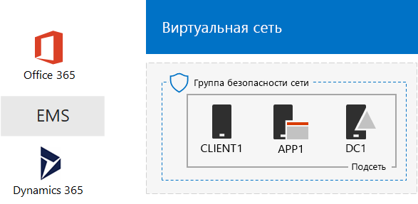
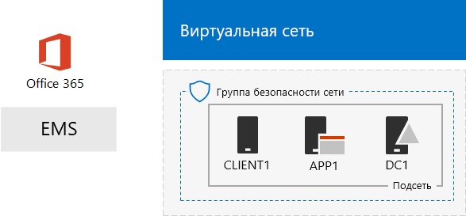

# Среда разработки и тестирования One Microsoft Cloud

 **Сводка:** В этом документе Test Lab Guide используйте для создания среды разработки или тестирования, которая включает в себя все облака корпорации Майкрософт.
  
Инструкции из этой статьи помогут создать имитируемую интрасеть в службах инфраструктуры Microsoft Azure, а затем добавить подписки на Microsoft Office 365, Microsoft Enterprise Mobility + Security (EMS) и Microsoft Dynamics 365. В результате вы получите упрощенную организацию, которая использует все облачные решения Майкрософт одновременно в одной среде тестирования и разработки.  
  

  
Полученную в итоге конфигурацию можно использовать, чтобы:
  
- опробовать интеграцию облачных решений Майкрософт, таких как общая инфраструктура идентификации, которую обеспечивает Azure Active Directory (AD);
    
- оценить комплексные сценарии, включающие несколько решений Microsoft Cloud;
    
- создать демоверсию конфигурации, конфигурацию для подтверждения концепции или конфигурацию для тестирования и разработки, которая использует несколько решений Microsoft Cloud;
    
- развить свои навыки работы с Microsoft Cloud для профессионального роста.
    
## Этап 1. Создание имитированной интрасети и добавление Office 365

Следуйте инструкциям в [DirSync для вашей среды разработки или тестирования Office 365](dirsync-for-your-office-365-dev-test-environment.md).
  
На рисунке 1 показано итоговый конфигурации, включая Office 365 и имитации интрасети под управлением служб инфраструктуры и синхронизации каталогов в из локального леса Active Directory Windows Server (AD).
  
**На рисунке 1: Имитации интрасети в Azure с Office 365**

  
> [!NOTE]
> Azure пробной версии — 30 дней. Пробная версия Enterprise E5 Office 365 подписки — 30 дней, которые могут быть легко расширены еще 30 дней. Для постоянного dev/тестовой среды создайте новую оплата за подпиской Azure и новой платной подписки Office 365 корпоративный E5 с небольшого числа лицензий. 
  
## Этап 2. Добавление EMS

На этом этапе можно оформить пробную подписку на EMS и добавить ее к той же организации, что и пробную подписку на Office 365.
  
1. С помощью браузера на одном компьютере или из CLIENT1, войдите в портал Office 365 на [https://portal.office.com](https://portal.office.com) с использованием учетных данных учетной записи глобального администратора.
    
2. Щелкните плитку **администрирования** .
    
3. На вкладке **центра администрирования Office** в браузере на панели навигации слева щелкните **выставления счетов > службы приобретения**.
    
4. На странице " **службы приобретения** " Поиск элемента **мобильной работы предприятия + E5 безопасности** . Наведите указатель мыши на его и нажмите кнопку **Пуск бесплатную пробную версию**.
    
5. На странице " **Подтверждение заказа** " щелкните **Теперь попробуйте**.
    
6. На странице **получения заказа** нажмите кнопку **Продолжить**.
    
> [!NOTE]
> Период пробной подписки на Enterprise Mobility + Security E5 составляет 90 дней. Чтобы создать постоянную среду тестирования и разработки, создайте новую платную подписку с небольшим количеством лицензий. 
  
Далее включите лицензию на Enterprise Mobility + Security E5 для всех учетных записей пользователей.
  
1. На вкладке **Центр администрирования Office 365** в браузере на панели навигации слева щелкните **Пользователи > Активные пользователи**.
    
2. Выберите учетную запись глобального администратора и нажмите кнопку **Изменить** для **лицензий на продукт**.
    
3. В области **лицензий на продукт** включить лицензии для **мобильных устройств предприятия + E5 безопасности** для **на**, нажмите кнопку **Сохранить** и дважды нажмите кнопку **Закрыть** .
    
4. Для всех других учетных записей (User1, User 2, User 3, User 4 и User 5) выполните действия 2 и 3.
    
Теперь ваша среда разработки и тестирования содержит следующее:
  
- имитированную интрасеть в службах инфраструктуры Azure;
    
- пробные подписки на Office 365 корпоративный E5 и EMS для одной организации, а также один и тот же клиент Azure AD для всех учетных записей пользователей из списка;
    
- все учетные записи пользователей могут использовать Office 365 корпоративный E5 и EMS.
    
На рисунке 2 показана полученная в итоге конфигурация с EMS.
  
**На рисунке 2: Имитации интрасети в Azure с Office 365 и Командной**

  
## Этап 3: Добавление Dynamics 365

На этом этапе можно оформить пробную подписку на Dynamics 365 и добавить ее к той же организации, что и пробные подписки на Office 365 и EMS.
  
1. С помощью браузера на одном компьютере или из CLIENT1, войдите в портал Office 365 на [https://portal.office.com](https://portal.office.com) с использованием учетных данных учетной записи глобального администратора.
    
2. Щелкните плитку **администрирования** .
    
3. На вкладке **Центр администрирования Office** на панели навигации слева щелкните **выставления счетов > службы приобретения**.
    
4. На странице " **службы приобретения** " Поиск элемента **Dynamics 365 планирование 1 Enterprise Edition** . Наведите указатель мыши на его и нажмите кнопку **Пуск бесплатную пробную версию**.
    
5. На странице " **Подтверждение заказа** " щелкните **Теперь попробуйте**.
    
6. На странице **получения заказа** нажмите кнопку **Продолжить**.
    
> [!NOTE]
> Пробная подписка на Dynamics 365 Plan 1 Enterprise Edition действует 30 дней. Вы легко можете продлить ее еще на 30 дней. Чтобы создать постоянную среду тестирования и разработки, создайте новую платную подписку с небольшим количеством лицензий. 
  
Эти инструкции помогут назначить лицензии на Dynamics 365 глобальному администратору, учетным записям User 2 и User 3 и сделать их системными администраторами.
  
1. На вкладке **Центр администрирования Office** щелкните **Пользователи > Активные пользователи**.
    
2. В список активных пользователей щелкните учетную запись глобального администратора и нажмите кнопку **Изменить** для **лицензий на продукт**.
    
3. В области **лицензий на продукт** включить лицензии для **Dynamics 365 планирование 1 Enterprise Edition** **на**, нажмите кнопку **Сохранить** и дважды нажмите кнопку **Закрыть** .
    
4. Повторите шаги 2 и 3 для учетных записей пользователей User 2 и User 3.
    
5. Закройте вкладку **Центр администрирования Office** .
    
Выполните следующие действия, чтобы сделать учетные записи User 2 и User 3 системными администраторами Dynamics 365.
  
1. На вкладке **центра администрирования Office** в браузере на панели навигации слева щелкните **центры администрирования**и нажмите кнопку **Dynamics 365**.
    
    Возможно, вам придется подождать окончания подготовки системы, прежде чем в меню появится пункт Dynamics 365.
    
2. На вкладке Dynamics 365 щелкните **все эти**и нажмите кнопку **завершить настройку.**
    
    Подождите окончания операции.
    
    После завершения установки отображается на основе образца данных, который является частью подписки журнала активности панели мониторинга продаж. Занять некоторое время для просмотра **Добро пожаловать пробную версию** видео. Закройте окно видео после завершения.
    
3. На панели инструментов вверху щелкните стрелку вниз рядом с пунктом **Sales**, нажмите кнопку **Параметры**и нажмите кнопку **Безопасность**.
    
4. На странице " **Безопасность** " щелкните **Пользователи**.
    
5. В списке пользователей выберите **пользователей 2**.
    
6. В панели инструментов нажмите кнопку **Управление ролями**.
    
7. **Управление ролями**щелкните **Системный администратор**и нажмите кнопку **ОК**.
    
8. В панели инструментов вверху щелкните **Безопасность**.
    
9. Повторите действия 5–8 для учетной записи User 3.
    
10. Закрытие **пользователя: User3** вкладки.
    
> [!NOTE]
> Вашей учетной записи глобального администратора Office 365 автоматически назначена роль системного администратора Dynamics 365. 
  
Теперь ваша среда разработки и тестирования содержит следующее:
  
- имитированную интрасеть в службах инфраструктуры Azure;
    
- пробные подписки на Office 365 корпоративный E5, EMS и Dynamics 365 для одной организации, а также один и тот же клиент Azure AD для всех учетных записей пользователей из списка;
    
- все учетные записи пользователей могут использовать Office 365 корпоративный E5 и EMS;
    
- учетным записям глобального администратора и пользователей User 2 и User 3 предоставлено разрешение использовать Dynamics 365 и назначена роль системного администратора Dynamics 365.
    
На рисунке 3 показана итоговая конфигурация.
  
**На рисунке 3: Имитации интрасети в Azure с Office 365, Командной и Dynamics 365**

  
## Дальнейшие действия

Теперь вы можете экспериментировать в среде тестирования и разработки One Microsoft Cloud. Вот несколько статей, если вам при этом понадобятся рекомендации:
  
- [Настройка политик управления (MAM) мобильных приложений в Командной для приложений Office 365](https://technet.microsoft.com/library/mt764059.aspx)
    
- [Демонстрация Exchange Online в Office 365 интеграции с контактами Dynamics 365](https://technet.microsoft.com/library/mt798313.aspx)
    
- [Создание имитации распределенной сети в службах инфраструктуры для размещения рабочих нагрузок на стороне сервера](https://technet.microsoft.com/library/mt745150.aspx)
    
## См. также

[Руководства по лаборатории тестирования для принятия облачных решений](cloud-adoption-test-lab-guides-tlgs.md)
  
[Ресурсы для администраторов, посвященные архитектуре Microsoft Cloud](microsoft-cloud-it-architecture-resources.md)
  
[Гибридные решения](hybrid-solutions.md)
  
[Решения для обеспечения безопасности](security-solutions.md)

